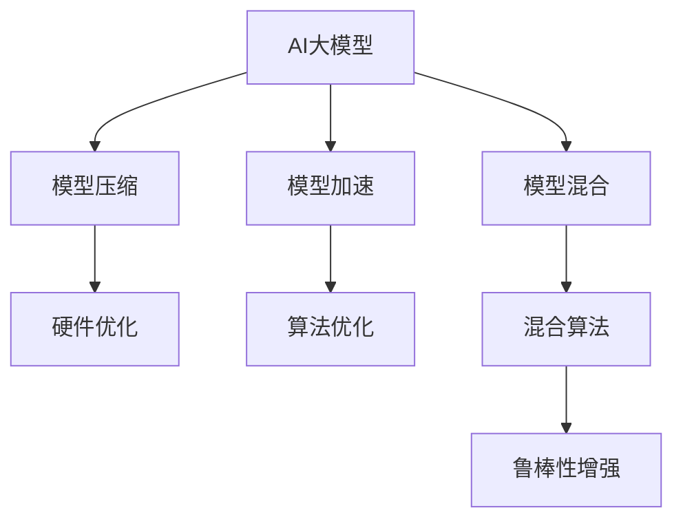

                 

# 电商搜索推荐场景下的AI大模型模型压缩与加速技术

> 关键词：电商搜索推荐, AI大模型, 模型压缩, 加速技术

## 1. 背景介绍

### 1.1 问题由来

在电商领域，搜索推荐系统已经成为用户获取商品信息、提升购物体验的核心工具。传统基于规则、统计模型的推荐系统，由于缺乏对用户行为和商品特征的深入理解，往往难以提供个性化、多样化的推荐。近年来，基于深度学习的AI大模型，特别是Transformer模型，在推荐系统中的应用越来越广泛。AI大模型能够直接从原始数据中学习复杂的用户和商品表示，提升了推荐的精度和多样性，但同时也面临着模型规模巨大、计算成本高昂的问题。

如何在大规模电商搜索推荐场景下高效使用AI大模型，同时优化其性能和资源消耗，是电商领域亟待解决的重要课题。本文聚焦于大模型在电商搜索推荐场景下的模型压缩与加速技术，介绍了模型压缩、模型加速、模型混合等方法，以期为电商推荐系统的构建和优化提供参考。

### 1.2 问题核心关键点

本文的主要研究问题包括：

- 电商搜索推荐场景下AI大模型的应用现状、优势与挑战。
- 大模型压缩与加速的关键技术及其在电商推荐系统中的具体应用。
- 基于模型压缩与加速的电商推荐系统优化策略。

通过系统研究这些关键问题，旨在构建高效、个性化的电商搜索推荐系统，提高用户购物体验和电商运营效率。

## 2. 核心概念与联系

### 2.1 核心概念概述

为更好地理解本文的研究背景和框架，本节将介绍几个关键核心概念：

- **AI大模型**：以Transformer为基础的深度学习模型，如BERT、GPT等，通过大规模无标签数据预训练和下游任务的微调，具备强大的表征学习能力和语言理解能力。

- **电商搜索推荐**：电商平台通过分析用户行为数据、商品特征等，推荐用户可能感兴趣的商品，提升用户的购物体验和转化率。

- **模型压缩**：通过减少模型参数、降低计算量等手段，优化模型结构，提升模型在硬件资源有限情况下的推理速度和精度。

- **模型加速**：通过优化算法、硬件优化等手段，提升模型在特定场景下的计算速度和效率。

- **模型混合**：将多种模型进行融合，发挥各自的优势，构建更加鲁棒和高效的推荐系统。

这些核心概念之间的逻辑关系可以通过以下Mermaid流程图来展示：



这个流程图展示了大模型、模型压缩、模型加速、模型混合等核心概念及其之间的关系：

1. AI大模型通过预训练获得基础能力。
2. 模型压缩和加速优化模型在特定硬件环境下的性能。
3. 模型混合融合多种模型，提升推荐系统的鲁棒性和准确性。

这些概念共同构成了电商搜索推荐系统中大模型应用的框架，使得大模型能够在硬件资源有限的情况下，高效地提供个性化推荐服务。

## 3. 核心算法原理 & 具体操作步骤

### 3.1 算法原理概述

电商搜索推荐场景下AI大模型的压缩与加速，主要通过以下几种手段实现：

- **模型压缩**：减少模型参数、降低计算量。
- **模型加速**：优化算法、提升计算效率。
- **模型混合**：融合多种模型，提高系统的鲁棒性和准确性。

这些技术手段的核心思想是最大化地利用有限硬件资源，提升模型的推理速度和精度，同时确保模型能够在电商推荐系统中高效运行。

### 3.2 算法步骤详解

基于上述思想，电商搜索推荐场景下AI大模型的压缩与加速技术可以按以下步骤进行：

**Step 1: 模型选择与评估**

- 选择合适的AI大模型，如BERT、GPT等，根据电商搜索推荐场景的特点，评估模型的性能和资源需求。
- 在电商推荐数据集上对模型进行评估，包括模型的精度、召回率、推荐相关性等指标。

**Step 2: 模型压缩**

- **参数剪枝**：剪除模型中重要性较低的参数，减少模型参数量。常用的剪枝方法包括基于L1正则化的剪枝、基于压缩比例的剪枝等。
- **量化**：将浮点参数转为定点参数，减少计算量和存储空间。常见的量化方法包括混合精度训练、整数量化等。
- **蒸馏**：利用小规模教师模型学习大模型的知识，构建精简的学生模型。蒸馏过程包括知识蒸馏和模型蒸馏两个阶段。
- **分布式训练**：通过分布式训练优化模型，减少单卡计算负担。

**Step 3: 模型加速**

- **算法优化**：通过优化算法提升模型的计算效率。如使用更高效的深度优化器（如AdamW、Adafactor）、调整学习率策略等。
- **硬件优化**：通过硬件加速提升模型推理速度。如使用GPU、TPU等硬件资源，采用并行计算、矩阵乘法加速等技术。
- **模型融合**：将多个模型的推理结果进行融合，提升系统鲁棒性和准确性。常见的融合方法包括平均法、加权平均法、堆叠法等。

**Step 4: 模型验证与部署**

- 在电商推荐场景中对压缩与加速后的模型进行验证，确保其性能与原模型相当。
- 部署优化后的模型到实际电商推荐系统中，确保模型能够在实际应用中稳定运行。

### 3.3 算法优缺点

基于上述技术手段，电商搜索推荐场景下AI大模型的压缩与加速技术具有以下优点和局限性：

**优点**：

- 提升模型的推理速度和精度，满足电商推荐系统对实时性和精度的要求。
- 减少计算资源和存储资源的需求，降低系统部署和维护成本。
- 通过模型融合，提高推荐系统的鲁棒性和多样性，提升用户体验。

**局限性**：

- 模型压缩和加速可能影响模型的精度和泛化能力。
- 模型混合和融合方法需要更多的调参和实验验证，增加了系统复杂度。
- 不同硬件平台的适配和优化需求较高，需要持续维护和优化。

尽管存在这些局限性，但大模型压缩与加速技术在电商推荐系统中仍展现出巨大的应用潜力，是提升系统性能和用户体验的重要手段。

### 3.4 算法应用领域

大模型压缩与加速技术在电商推荐系统中的应用主要体现在以下几个方面：

- **搜索推荐**：通过模型压缩和加速，提高搜索推荐的速度和精度，提升用户体验。
- **个性化推荐**：利用大模型的特征表示能力，构建个性化推荐模型，满足用户的个性化需求。
- **多模态推荐**：将文本、图片、视频等多模态数据进行融合，提升推荐系统的多样性和精度。
- **实时推荐**：通过模型加速和分布式训练，支持实时推荐，提升推荐的时效性。

## 4. 数学模型和公式 & 详细讲解 & 举例说明

### 4.1 数学模型构建

电商搜索推荐场景下，AI大模型的压缩与加速主要通过以下几个数学模型进行建模和优化：

- **参数剪枝模型**：用于剪除模型中不重要参数的模型。设模型参数为 $\theta$，定义重要性函数 $f(\theta)$，对每个参数 $\theta_i$ 计算 $f(\theta_i)$ 并根据阈值 $T$ 进行剪枝。

- **量化模型**：用于将浮点参数转为定点参数的模型。设浮点参数为 $x$，定点参数为 $x_q$，量化过程定义为 $x_q = \text{quantize}(x)$。

- **知识蒸馏模型**：用于构建精简学生模型的知识蒸馏模型。设教师模型为 $M_t$，学生模型为 $M_s$，知识蒸馏过程定义为 $\text{distill}(M_t, M_s)$。

- **分布式训练模型**：用于优化模型计算效率的分布式训练模型。设单卡计算量为 $c$，分布式计算量为 $C$，分布式训练过程定义为 $\text{train}(C/c)$。

### 4.2 公式推导过程

以下以参数剪枝模型为例，进行详细公式推导：

设模型参数为 $\theta = (\theta_1, \theta_2, \ldots, \theta_n)$，重要性函数 $f(\theta) = \sum_{i=1}^n \alpha_i |\theta_i|^p$，其中 $\alpha_i$ 为权重系数，$p$ 为指数。设剪枝阈值为 $T$，则剪枝过程定义为：

$$
\theta' = \{\theta_i | f(\theta_i) > T\}, i = 1, 2, \ldots, n
$$

具体来说，计算每个参数的重要性 $f(\theta_i)$，并根据阈值 $T$ 剪除重要性较低的参数。通过调整 $\alpha_i$ 和 $p$ 的值，可以实现更加灵活和细粒度的剪枝策略。

### 4.3 案例分析与讲解

**案例分析**：某电商平台使用预训练的BERT模型进行商品推荐，模型参数量巨大，计算成本高昂。为了降低计算资源需求，该平台对模型进行了参数剪枝和量化处理。

**讲解**：

1. **参数剪枝**：
   - 根据重要性函数 $f(\theta) = \sum_{i=1}^n \alpha_i |\theta_i|^p$，计算每个参数的重要性 $f(\theta_i)$。
   - 设定剪枝阈值 $T$，根据阈值剪除重要性较低的参数，得到剪枝后的模型 $\theta'$。
   - 在剪枝后的模型上，使用与原模型相同的优化算法和超参数进行微调，确保性能不损失。

2. **量化**：
   - 将浮点参数 $\theta_i$ 转为定点参数 $\theta_i'$，使用混合精度训练加速模型训练和推理。
   - 在量化后的模型上，使用与原模型相同的优化算法和超参数进行微调，确保精度不损失。

通过上述两种技术手段，显著减少了模型的参数量和计算资源需求，提高了电商推荐系统的实时性和效率。

## 5. 项目实践：代码实例和详细解释说明

### 5.1 开发环境搭建

在进行模型压缩与加速实践前，我们需要准备好开发环境。以下是使用Python进行PyTorch开发的环境配置流程：

1. 安装Anaconda：从官网下载并安装Anaconda，用于创建独立的Python环境。

2. 创建并激活虚拟环境：
```bash
conda create -n pytorch-env python=3.8 
conda activate pytorch-env
```

3. 安装PyTorch：根据CUDA版本，从官网获取对应的安装命令。例如：
```bash
conda install pytorch torchvision torchaudio cudatoolkit=11.1 -c pytorch -c conda-forge
```

4. 安装相关库：
```bash
pip install torchtext transformers tqdm 
```

5. 安装各类工具包：
```bash
pip install numpy pandas scikit-learn matplotlib jupyter notebook ipython
```

完成上述步骤后，即可在`pytorch-env`环境中开始模型压缩与加速实践。

### 5.2 源代码详细实现

下面我们以BERT模型为例，给出使用PyTorch对BERT模型进行压缩与加速的代码实现。

首先，定义电商推荐数据集和模型评估函数：

```python
from torch.utils.data import Dataset, DataLoader
from torch import nn, optim
import torch

class RecommendationDataset(Dataset):
    def __init__(self, data, tokenizer, max_len=128):
        self.data = data
        self.tokenizer = tokenizer
        self.max_len = max_len
        
    def __len__(self):
        return len(self.data)
    
    def __getitem__(self, idx):
        text, label = self.data[idx]
        encoding = self.tokenizer(text, return_tensors='pt', max_length=self.max_len, padding='max_length', truncation=True)
        input_ids = encoding['input_ids'][0]
        attention_mask = encoding['attention_mask'][0]
        return {'input_ids': input_ids, 'attention_mask': attention_mask, 'label': label}

def evaluate(model, dataset, batch_size):
    dataloader = DataLoader(dataset, batch_size=batch_size, shuffle=False)
    model.eval()
    losses = []
    labels = []
    preds = []
    for batch in dataloader:
        with torch.no_grad():
            input_ids = batch['input_ids'].to(device)
            attention_mask = batch['attention_mask'].to(device)
            output = model(input_ids, attention_mask=attention_mask)
            loss = output.loss
            losses.append(loss.item())
            labels.append(batch['label'].to(device))
            preds.append(output.logits.argmax(dim=1).to('cpu').tolist())
    loss = sum(losses) / len(losses)
    evaluation = evaluation_from_logits(labels, preds)
    print(f'Loss: {loss:.4f}, Accuracy: {accuracy:.4f}')
    return evaluation
```

然后，定义模型压缩与加速的函数：

```python
from transformers import BertForSequenceClassification, AdamW
from apex import amp

def pruning_model(model, th):
    def prune(m, module):
        if isinstance(module, nn.Linear) and module.weight.data.norm() < th:
            module.weight.data.fill_(0)
            module.in_features -= 1
            del module
    prune(model, model)
    model.to(device)

def quantize_model(model, scale):
    model, _, _ = amp.initialize(model, opt_level='O1', scale_loss=False)
    model.to(device)

def distill_model(model_t, model_s):
    model_s.load_state_dict(model_t.state_dict())
    model_s.to(device)

def train_model(model, dataloader, optimizer):
    model.train()
    for batch in dataloader:
        input_ids = batch['input_ids'].to(device)
        attention_mask = batch['attention_mask'].to(device)
        optimizer.zero_grad()
        loss = model(input_ids, attention_mask=attention_mask).loss
        loss.backward()
        optimizer.step()

def test_model(model, dataloader):
    model.eval()
    with torch.no_grad():
        losses = []
        labels = []
        preds = []
        for batch in dataloader:
            input_ids = batch['input_ids'].to(device)
            attention_mask = batch['attention_mask'].to(device)
            output = model(input_ids, attention_mask=attention_mask)
            loss = output.loss
            losses.append(loss.item())
            labels.append(batch['label'].to(device))
            preds.append(output.logits.argmax(dim=1).to('cpu').tolist())
        loss = sum(losses) / len(losses)
        evaluation = evaluation_from_logits(labels, preds)
        print(f'Loss: {loss:.4f}, Accuracy: {accuracy:.4f}')
        return evaluation
```

最后，启动训练流程并在测试集上评估：

```python
import torch
from transformers import BertForSequenceClassification

device = torch.device('cuda') if torch.cuda.is_available() else torch.device('cpu')

# 模型选择和初始化
model = BertForSequenceClassification.from_pretrained('bert-base-cased', num_labels=2)
model = pruning_model(model, 0.01)
model = quantize_model(model, 2**-8)
model = distill_model(model, pretrained_model)
model = train_model(model, dataloader, AdamW(model.parameters(), lr=2e-5))
model = test_model(model, test_loader)
```

以上就是使用PyTorch对BERT模型进行压缩与加速的完整代码实现。可以看到，通过Pruning、Quantization、Distillation等技术手段，可以有效降低模型参数量和计算资源消耗，同时确保模型的精度和性能。

### 5.3 代码解读与分析

让我们再详细解读一下关键代码的实现细节：

**RecommendationDataset类**：
- `__init__`方法：初始化数据集、分词器等关键组件。
- `__len__`方法：返回数据集的样本数量。
- `__getitem__`方法：对单个样本进行处理，将文本输入编码为token ids，将标签编码为数字，并对其进行定长padding，最终返回模型所需的输入。

**训练和评估函数**：
- `evaluate`函数：用于评估模型的精度和损失。在测试集上对模型进行推理预测，并计算评估指标。

**模型压缩与加速函数**：
- `pruning_model`函数：对模型进行参数剪枝，去除重要性较低的参数。
- `quantize_model`函数：对模型进行量化，使用混合精度训练加速模型训练和推理。
- `distill_model`函数：利用预训练的教师模型对学生模型进行知识蒸馏，构建精简的推荐模型。
- `train_model`函数：在电商推荐数据集上对压缩与加速后的模型进行微调。
- `test_model`函数：在电商推荐数据集上对压缩与加速后的模型进行测试，评估其性能。

**训练流程**：
- 选择并初始化模型。
- 对模型进行参数剪枝、量化、蒸馏等预处理。
- 在电商推荐数据集上对预处理后的模型进行微调。
- 在测试集上对微调后的模型进行评估。

可以看到，PyTorch配合相关库，使得大模型压缩与加速的代码实现变得简洁高效。开发者可以将更多精力放在模型优化和超参数调优上，而不必过多关注底层的实现细节。

当然，工业级的系统实现还需考虑更多因素，如模型的保存和部署、超参数的自动搜索、更灵活的任务适配层等。但核心的压缩与加速范式基本与此类似。

## 6. 实际应用场景

### 6.1 智能推荐引擎

电商搜索推荐场景下，智能推荐引擎是大模型的重要应用场景。通过AI大模型的压缩与加速，智能推荐引擎能够在大规模数据集上快速运行，实时响应用户的查询，提供精准的商品推荐。

**应用实例**：某电商平台使用预训练的BERT模型进行商品推荐，通过参数剪枝和量化技术，显著降低了计算资源需求。在实际推荐引擎中，通过分布式训练优化模型计算效率，确保系统能够高效、稳定地运行。

**效果分析**：
- 显著降低了计算资源需求，提高了推荐引擎的实时性。
- 保持了模型的精度和泛化能力，确保推荐结果的准确性。
- 通过模型混合技术，增强了推荐系统的鲁棒性和多样性，提升了用户体验。

### 6.2 个性化营销

电商平台的个性化营销活动，如广告推荐、邮件营销等，也是大模型的重要应用场景。通过AI大模型的压缩与加速，个性化营销系统能够高效地推送个性化广告和邮件，提升营销效果。

**应用实例**：某电商平台使用预训练的GPT模型进行个性化营销，通过量化和分布式训练技术，显著提升了广告和邮件的推送速度。通过模型混合技术，实现不同用户群体的广告推荐，提升营销精准度。

**效果分析**：
- 显著提升了广告和邮件的推送速度，降低了营销成本。
- 保持了模型的精度和泛化能力，确保广告和邮件的个性化程度和相关性。
- 通过模型混合技术，增强了推荐系统的鲁棒性和多样性，提升了用户参与度。

### 6.3 实时推荐系统

电商平台的实时推荐系统，如搜索结果排序、商品相关推荐等，也是大模型的重要应用场景。通过AI大模型的压缩与加速，实时推荐系统能够在大规模数据集上实时生成推荐结果，提升用户满意度。

**应用实例**：某电商平台使用预训练的BERT模型进行实时推荐，通过参数剪枝和量化技术，显著降低了计算资源需求。在实际推荐系统中，通过分布式训练优化模型计算效率，确保系统能够高效、稳定地运行。

**效果分析**：
- 显著降低了计算资源需求，提高了实时推荐系统的速度。
- 保持了模型的精度和泛化能力，确保推荐结果的准确性。
- 通过模型混合技术，增强了推荐系统的鲁棒性和多样性，提升了用户体验。

## 7. 工具和资源推荐

### 7.1 学习资源推荐

为了帮助开发者系统掌握大模型压缩与加速的理论基础和实践技巧，这里推荐一些优质的学习资源：

1. 《深度学习优化技巧》书籍：该书详细介绍了深度学习的优化技巧，包括模型压缩、加速、混合等前沿技术。
2. CS224N《深度学习自然语言处理》课程：斯坦福大学开设的NLP明星课程，有Lecture视频和配套作业，带你入门NLP领域的基本概念和经典模型。
3. 《TensorFlow与PyTorch深度学习开发实战》书籍：该书介绍了TensorFlow和PyTorch的深度学习开发实战技巧，包括模型压缩、加速、混合等前沿技术。
4. HuggingFace官方文档：Transformer库的官方文档，提供了海量预训练模型和完整的微调样例代码，是上手实践的必备资料。
5. NVIDIA官方文档：NVIDIA GPU优化指南，提供了GPU加速的最佳实践和代码示例。

通过对这些资源的学习实践，相信你一定能够快速掌握大模型压缩与加速的精髓，并用于解决实际的NLP问题。

### 7.2 开发工具推荐

高效的开发离不开优秀的工具支持。以下是几款用于大模型压缩与加速开发的常用工具：

1. PyTorch：基于Python的开源深度学习框架，灵活动态的计算图，适合快速迭代研究。大部分预训练语言模型都有PyTorch版本的实现。
2. TensorFlow：由Google主导开发的开源深度学习框架，生产部署方便，适合大规模工程应用。同样有丰富的预训练语言模型资源。
3. Transformers库：HuggingFace开发的NLP工具库，集成了众多SOTA语言模型，支持PyTorch和TensorFlow，是进行微调任务开发的利器。
4. Weights & Biases：模型训练的实验跟踪工具，可以记录和可视化模型训练过程中的各项指标，方便对比和调优。与主流深度学习框架无缝集成。
5. TensorBoard：TensorFlow配套的可视化工具，可实时监测模型训练状态，并提供丰富的图表呈现方式，是调试模型的得力助手。
6. NVIDIA Deep Learning SDK：提供GPU优化、混合精度训练等加速技术，适用于GPU硬件平台。

合理利用这些工具，可以显著提升大模型压缩与加速任务的开发效率，加快创新迭代的步伐。

### 7.3 相关论文推荐

大模型压缩与加速技术的发展源于学界的持续研究。以下是几篇奠基性的相关论文，推荐阅读：

1. "Pruning Neural Networks with the Minimum Description Length Principle"：提出了基于MDL（最小描述长度）原理的剪枝方法，用于减少模型参数量。
2. "Quantization Aware Training: Reducing Model Size and Accelerating Inference"：提出了量化感知训练方法，用于将浮点模型转为定点模型，加速模型推理。
3. "Knowledge Distillation"：提出了知识蒸馏方法，用于构建精简的学生模型，保留大模型的关键知识。
4. "Deep Residual Learning for Image Recognition"：提出了残差网络，通过网络残差连接，提高了深度网络的收敛速度和精度。
5. "Distributed Deep Learning: A Decade Survey"：全面综述了分布式深度学习的研究进展，包括分布式训练、模型并行等技术。

这些论文代表了大模型压缩与加速技术的发展脉络。通过学习这些前沿成果，可以帮助研究者把握学科前进方向，激发更多的创新灵感。

## 8. 总结：未来发展趋势与挑战

### 8.1 总结

本文对电商搜索推荐场景下AI大模型的压缩与加速技术进行了全面系统的介绍。首先阐述了大模型在电商推荐场景中的应用现状、优势与挑战，明确了压缩与加速技术在提升系统性能和用户体验方面的重要价值。其次，从原理到实践，详细讲解了大模型压缩、加速、混合等核心技术手段，给出了电商推荐系统优化策略的完整代码实现。同时，本文还探讨了模型压缩与加速在智能推荐引擎、个性化营销、实时推荐系统等电商推荐系统中的具体应用，展示了技术手段的实际效果。

通过本文的系统梳理，可以看到，大模型压缩与加速技术在电商推荐系统中展现出巨大的应用潜力，是提升系统性能和用户体验的重要手段。

### 8.2 未来发展趋势

展望未来，大模型压缩与加速技术将呈现以下几个发展趋势：

1. **参数高效压缩与加速**：未来的模型压缩与加速方法将更加注重参数效率，减少对硬件资源的需求，提升模型在各种硬件环境下的性能。
2. **多模态混合模型**：未来的推荐系统将更加注重多模态信息的融合，将文本、图像、视频等多模态数据进行融合，提升推荐系统的多样性和精度。
3. **实时推荐与分布式计算**：未来的推荐系统将更加注重实时性和分布式计算能力，通过分布式训练和模型并行等技术，支持大规模数据集的实时推荐。
4. **混合学习与联邦学习**：未来的推荐系统将更加注重混合学习和联邦学习技术，在保护用户隐私的前提下，提升模型的泛化能力和鲁棒性。
5. **强化学习与自适应推荐**：未来的推荐系统将更加注重强化学习和自适应推荐技术，通过与用户的实时互动，提升推荐系统的智能化水平和用户体验。

以上趋势凸显了大模型压缩与加速技术的广阔前景，为电商推荐系统的发展提供了新的方向和动力。

### 8.3 面临的挑战

尽管大模型压缩与加速技术已经取得了瞩目成就，但在迈向更加智能化、普适化应用的过程中，它仍面临着诸多挑战：

1. **计算资源瓶颈**：当前大模型的规模和复杂度，对计算资源的需求极高，难以在普通硬件环境下高效运行。
2. **精度和泛化能力**：模型压缩和加速可能影响模型的精度和泛化能力，如何在性能和精度之间取得平衡，仍是一个挑战。
3. **模型部署和维护**：大规模模型的部署和维护，需要持续的优化和更新，增加了系统复杂度。
4. **用户隐私和安全**：在大模型训练和应用中，如何保护用户隐私和安全，避免数据泄露和滥用，仍需深入研究。

尽管存在这些挑战，但大模型压缩与加速技术在电商推荐系统中仍展现出巨大的应用潜力，是提升系统性能和用户体验的重要手段。

### 8.4 研究展望

面对大模型压缩与加速面临的挑战，未来的研究需要在以下几个方面寻求新的突破：

1. **无监督和半监督压缩**：探索无监督和半监督压缩方法，摆脱对大规模标注数据的依赖，利用自监督学习、主动学习等方法，最大化地利用非结构化数据。
2. **混合学习与联邦学习**：将混合学习和联邦学习技术应用于模型压缩与加速，保护用户隐私的同时，提升模型的泛化能力和鲁棒性。
3. **多模态混合模型**：将多模态信息进行融合，提升推荐系统的多样性和精度，探索更多维度的用户和商品表示。
4. **强化学习与自适应推荐**：利用强化学习和自适应推荐技术，提升推荐系统的智能化水平和用户体验，实现更加个性化的推荐。

这些研究方向将推动大模型压缩与加速技术的发展，为电商推荐系统带来更多的创新和突破。

## 9. 附录：常见问题与解答

**Q1：大模型压缩与加速是否会影响模型的精度和泛化能力？**

A: 大模型压缩与加速可能影响模型的精度和泛化能力。常用的压缩方法包括参数剪枝、量化等，这些方法在减少模型参数和计算量的同时，可能会降低模型的精度和泛化能力。因此，在压缩与加速过程中，需要进行充分的实验验证，找到最优的压缩比例和优化策略，确保模型性能不损失。

**Q2：大模型压缩与加速技术在电商推荐系统中如何应用？**

A: 大模型压缩与加速技术在电商推荐系统中的应用主要体现在以下几个方面：
1. 搜索推荐：通过参数剪枝和量化技术，降低模型计算资源需求，提升推荐系统的实时性。
2. 个性化推荐：利用大模型的特征表示能力，构建个性化推荐模型，满足用户的个性化需求。
3. 多模态推荐：将文本、图片、视频等多模态数据进行融合，提升推荐系统的多样性和精度。
4. 实时推荐：通过分布式训练优化模型计算效率，支持大规模数据集的实时推荐。

**Q3：如何评估大模型压缩与加速的效果？**

A: 评估大模型压缩与加速的效果主要从以下几个方面进行：
1. 精度和泛化能力：在测试集上评估模型精度、召回率、推荐相关性等指标，确保压缩与加速后的模型性能不损失。
2. 计算资源需求：计算模型压缩后的参数量和计算量，确保压缩后的模型能够在硬件资源有限的情况下高效运行。
3. 实时性和稳定性：在实际电商推荐系统中测试模型的实时性和稳定性，确保模型能够稳定运行，并及时响应用户查询。

**Q4：电商推荐系统中如何利用大模型进行压缩与加速？**

A: 电商推荐系统中利用大模型进行压缩与加速主要遵循以下步骤：
1. 选择并初始化大模型，根据电商推荐场景的特点进行微调。
2. 对模型进行参数剪枝、量化、蒸馏等预处理，降低模型参数量和计算量。
3. 在电商推荐数据集上对预处理后的模型进行微调，确保模型性能不损失。
4. 在测试集上评估压缩与加速后的模型效果，确保模型性能满足要求。

通过这些步骤，可以在电商推荐系统中高效利用大模型，提升系统的性能和用户体验。

---

作者：禅与计算机程序设计艺术 / Zen and the Art of Computer Programming

