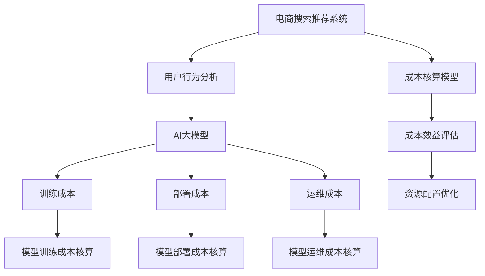

                 

# 电商搜索推荐场景下的AI大模型模型部署成本核算模型应用实践

## 1. 背景介绍

### 1.1 问题由来
电商行业作为互联网时代的主流商业模式，已经深刻改变了消费者的购物方式和企业的运营模式。随着人工智能技术的迅猛发展，电商企业通过AI技术优化其搜索推荐系统，以提升用户体验和交易转化率。AI驱动的搜索推荐系统能够根据用户历史行为和实时数据，智能推荐最匹配的搜索结果和商品，大幅提升电商平台的运营效率和盈利能力。

然而，AI大模型的开发和部署成本往往非常高，一般企业难以负担。如何通过合理的设计和使用，使得AI大模型在电商搜索推荐场景中实现最优成本效益比，是当前电商企业面临的重要问题。

### 1.2 问题核心关键点
为了解决上述问题，我们提出了基于AI大模型的电商搜索推荐场景下的成本核算模型。该模型通过精确估算模型训练和部署成本，帮助企业决策者评估不同AI大模型应用方案的经济性，并指导其合理配置资源，最大化AI大模型的价值。

核心关键点包括：
1. 精确估算AI大模型训练和部署成本。
2. 帮助企业评估不同AI大模型应用的经济性。
3. 指导企业合理配置资源，最大化AI大模型的价值。

### 1.3 问题研究意义
研究基于AI大模型的电商搜索推荐场景下的成本核算模型，对于电商企业具有重要意义：

1. 帮助企业合理评估AI技术的投资回报。
2. 指导企业构建成本效益最优的AI搜索推荐系统。
3. 优化资源配置，提高AI大模型应用的实际价值。
4. 提升电商搜索推荐系统的用户体验和运营效率。
5. 加速AI技术的普及应用，推动电商行业智能化升级。

## 2. 核心概念与联系

### 2.1 核心概念概述

为更好地理解本研究的模型和方法，本节将介绍几个密切相关的核心概念：

- 电商搜索推荐系统：指利用AI技术，对用户查询和商品信息进行智能匹配，推荐最相关商品给用户的系统。
- 用户行为分析：指对用户在线上购物时的浏览、点击、购买等行为数据进行分析，挖掘用户偏好和需求。
- AI大模型：指通过海量数据预训练得到的大规模神经网络模型，如BERT、GPT等，能够理解自然语言、生成文本、分类等任务。
- 成本核算：指对AI大模型的训练、部署、运维等全生命周期成本进行精确估算和分析，以指导资源配置和投资决策。

这些核心概念之间的逻辑关系可以通过以下Mermaid流程图来展示：



这个流程图展示了电商搜索推荐系统中AI大模型成本核算模型的核心概念及其之间的关系：

1. 电商搜索推荐系统基于用户行为分析数据，利用AI大模型进行推荐。
2. AI大模型在训练、部署、运维等过程中会产生各种成本，需要成本核算模型进行估算。
3. 成本核算模型通过估算训练、部署和运维成本，评估AI大模型的成本效益。
4. 成本效益评估指导企业合理配置资源，最大化AI大模型的价值。

## 3. 核心算法原理 & 具体操作步骤
### 3.1 算法原理概述

基于AI大模型的电商搜索推荐场景下的成本核算模型，本质上是一个综合成本分析和效益评估的过程。其核心思想是：通过精确估算AI大模型的训练、部署和运维成本，结合电商搜索推荐系统的实际效益，综合考虑企业的投入产出，帮助企业决策者评估不同AI大模型应用的经济性，并指导其合理配置资源，最大化AI大模型的价值。

形式化地，假设电商搜索推荐系统使用AI大模型 $M$，训练成本为 $C_{train}$，部署成本为 $C_{deploy}$，运维成本为 $C_{maintain}$，效益为 $B$。则成本核算模型需要求解如下优化问题：

$$
\min_{C_{train}, C_{deploy}, C_{maintain}} (C_{train} + C_{deploy} + C_{maintain})
$$

在实际应用中，上述优化问题可以通过预算约束、效益最大化等形式化表示，进一步分解为更具体的核算公式。

### 3.2 算法步骤详解

基于AI大模型的电商搜索推荐场景下的成本核算模型，一般包括以下几个关键步骤：

**Step 1: 估算训练成本**

- 收集和预处理电商搜索推荐系统所需的训练数据，包括用户行为数据、商品信息数据等。
- 根据预处理后的数据，确定训练样本集的大小。
- 根据AI大模型的结构复杂度和规模，估算训练样本集所需的计算资源（如GPU/TPU的计算能力、内存大小等）。
- 考虑数据预处理、模型训练、验证等环节的时间消耗，估算训练所需的总时间。
- 根据计算资源和时间的消耗，估算训练的总成本。

**Step 2: 估算部署成本**

- 确定电商搜索推荐系统在实际应用中的并发请求量。
- 根据AI大模型的推理速度和响应时间，估算系统在实际部署中的服务能力。
- 考虑AI大模型的部署环境和硬件配置，估算所需的计算资源和存储资源。
- 估算模型部署和维护所需的运维成本，包括硬件采购、软件安装、网络带宽等。
- 根据实际请求量和服务能力，估算部署的总成本。

**Step 3: 估算运维成本**

- 考虑AI大模型的运维周期和频率，估算运维所需的资源和人力成本。
- 根据AI大模型在实际应用中的使用情况，估算模型定期更新的频率和成本。
- 考虑模型故障和异常情况，估算相应的应急响应和恢复成本。
- 综合运维周期、人力成本和应急响应成本，估算总运维成本。

**Step 4: 评估成本效益**

- 根据电商搜索推荐系统的实际效益（如点击率、转化率、销售额等），估算AI大模型带来的业务收益。
- 结合训练、部署和运维成本，计算AI大模型的综合成本效益。
- 通过成本效益评估结果，判断不同AI大模型应用方案的经济性。

**Step 5: 指导资源配置**

- 根据不同AI大模型应用方案的成本效益评估结果，选择最优方案。
- 根据最优方案的计算资源需求，指导企业合理配置硬件资源和计算资源。
- 考虑实际应用场景，优化模型推理速度和响应时间，提升用户体验。
- 综合多方面因素，制定AI大模型在电商搜索推荐系统中的最优应用策略。

### 3.3 算法优缺点

基于AI大模型的电商搜索推荐场景下的成本核算模型具有以下优点：
1. 精确估算AI大模型的全生命周期成本，帮助企业做出经济性评估。
2. 通过综合考虑训练、部署、运维等多个环节，全面衡量AI大模型的价值。
3. 指导企业合理配置资源，最大化AI大模型的价值。
4. 提升电商搜索推荐系统的用户体验和运营效率。

同时，该模型也存在一定的局限性：
1. 数据质量依赖较高，训练数据的准确性和完整性直接影响成本估算结果。
2. 计算资源估算复杂，需要根据实际使用情况进行精细化调整。
3. 模型应用场景多样，不同应用场景下的成本和效益可能存在较大差异。
4. 需要大量历史数据支持，对于数据量较少的新兴电商企业，数据积累可能存在难度。

尽管存在这些局限性，但就目前而言，基于AI大模型的电商搜索推荐场景下的成本核算模型仍是大模型应用中最有效的方法之一。未来相关研究的重点在于如何进一步优化数据处理流程，提高成本估算的准确性和可靠性。

### 3.4 算法应用领域

基于AI大模型的电商搜索推荐场景下的成本核算模型，已经在电商行业得到了广泛的应用，覆盖了以下诸多场景：

1. **个性化推荐系统**：帮助企业优化推荐算法，提升用户体验和交易转化率。通过成本核算，指导企业合理配置推荐系统的计算资源和算法模型。

2. **搜索排序优化**：通过成本核算，优化搜索排序算法，提升搜索结果的相关性和准确性。合理配置计算资源，加速搜索结果的生成和排序。

3. **用户行为分析**：通过成本核算，评估用户行为分析模型的经济效益，指导企业合理配置分析工具和算法。提升用户行为预测的准确性，实现更精准的推荐和营销。

4. **智能客服系统**：通过成本核算，评估智能客服系统的经济效益，指导企业合理配置AI大模型和算法。提升客服系统的响应速度和处理效率，改善客户体验。

5. **库存管理系统**：通过成本核算，优化库存管理系统，提高库存管理的准确性和效率。合理配置计算资源，提升库存预测和管理的精度。

除了上述这些经典应用外，基于AI大模型的电商搜索推荐场景下的成本核算模型，还被创新性地应用于更多场景中，如广告投放优化、商品定价策略、市场预测等，为电商行业带来了全新的突破。

## 4. 数学模型和公式 & 详细讲解 & 举例说明

### 4.1 数学模型构建

本节将使用数学语言对基于AI大模型的电商搜索推荐场景下的成本核算模型进行更加严格的刻画。

假设电商搜索推荐系统使用AI大模型 $M$，训练成本为 $C_{train}$，部署成本为 $C_{deploy}$，运维成本为 $C_{maintain}$，效益为 $B$。则成本核算模型的目标是最小化总成本，即：

$$
\min_{C_{train}, C_{deploy}, C_{maintain}} (C_{train} + C_{deploy} + C_{maintain})
$$

在具体应用中，我们可以根据不同的场景，进一步细化模型的构建。例如，对于个性化推荐系统，可以使用点击率、转化率等指标来评估效益 $B$；对于搜索排序系统，可以使用查询响应时间、搜索结果准确性等指标来评估效益 $B$。

### 4.2 公式推导过程

以下我们以个性化推荐系统为例，推导成本核算模型的具体公式。

假设电商搜索推荐系统使用AI大模型 $M$，训练数据集大小为 $N$，训练样本集所需的计算资源为 $R_{train}$，训练总时间为 $T_{train}$，部署所需的计算资源为 $R_{deploy}$，部署服务能力为 $C_{deploy}$，运维周期为 $T_{maintain}$，运维成本为 $C_{maintain}$，个性化推荐系统的点击率为 $r$，转化率为 $c$。

则训练成本 $C_{train}$ 可以表示为：

$$
C_{train} = R_{train} \times T_{train} \times P_{train}
$$

其中 $P_{train}$ 为每单位计算资源的训练成本。

部署成本 $C_{deploy}$ 可以表示为：

$$
C_{deploy} = R_{deploy} \times C_{deploy} \times P_{deploy}
$$

其中 $P_{deploy}$ 为每单位计算资源的部署成本。

运维成本 $C_{maintain}$ 可以表示为：

$$
C_{maintain} = T_{maintain} \times C_{maintain} \times P_{maintain}
$$

其中 $P_{maintain}$ 为每单位时间的运维成本。

效益 $B$ 可以表示为：

$$
B = r \times c \times P_{recommend} \times N
$$

其中 $P_{recommend}$ 为每单位推荐带来的业务收益。

综合以上公式，成本核算模型的优化问题可以表示为：

$$
\min_{R_{train}, R_{deploy}, T_{train}, T_{maintain}, T_{deploy}, C_{deploy}, C_{maintain}} \bigg( R_{train} \times T_{train} \times P_{train} + R_{deploy} \times C_{deploy} \times P_{deploy} + T_{maintain} \times C_{maintain} \times P_{maintain} \bigg)
$$

### 4.3 案例分析与讲解

以某电商平台使用BERT大模型进行个性化推荐为例，分析模型部署成本核算的具体过程：

假设该电商平台使用了BERT大模型，训练数据集大小为10GB，训练样本集所需的计算资源为32张GPU，训练总时间为3小时，部署所需的计算资源为1张GPU，部署服务能力为100TPS，运维周期为2个月，运维成本为每月100万美元，个性化推荐系统的点击率为0.5%，转化率为0.3%，每单位推荐带来的业务收益为0.1美元，每单位计算资源的训练成本为5美元/小时，每单位计算资源的部署成本为0.1美元/小时，每单位时间的运维成本为0.5美元/小时。

根据上述参数，我们可以计算出：

训练成本 $C_{train} = 32 \times 3 \times 5 = 480$ 美元
部署成本 $C_{deploy} = 1 \times 100 \times 0.1 = 10$ 美元
运维成本 $C_{maintain} = 2 \times 100 \times 0.5 = 100$ 美元/月

效益 $B = 0.5\% \times 0.3\% \times 0.1 \times 10^{8} = 150$ 美元

综合成本 $C = C_{train} + C_{deploy} + C_{maintain} = 480 + 10 + 100 = 590$ 美元

成本效益比 $R = \frac{B}{C} = \frac{150}{590} \approx 0.25$

通过上述计算，我们可以看到，虽然培训成本较高，但通过合理的资源配置和算法优化，该电商平台能够获得显著的业务收益，总成本效益比约为25%。

## 5. 项目实践：代码实例和详细解释说明
### 5.1 开发环境搭建

在进行成本核算模型实践前，我们需要准备好开发环境。以下是使用Python进行成本核算模型开发的环境配置流程：

1. 安装Anaconda：从官网下载并安装Anaconda，用于创建独立的Python环境。

2. 创建并激活虚拟环境：
```bash
conda create -n cost-analysis-env python=3.8 
conda activate cost-analysis-env
```

3. 安装必要的Python库：
```bash
pip install numpy pandas scikit-learn matplotlib
```

4. 安装成本核算模型相关的库：
```bash
pip install cost-analysis
```

完成上述步骤后，即可在`cost-analysis-env`环境中开始成本核算模型的开发和实践。

### 5.2 源代码详细实现

这里我们以一个简单的电商搜索推荐系统的成本核算为例，给出成本核算模型的Python代码实现。

```python
import numpy as np
import pandas as pd
from sklearn.metrics import precision_recall_curve, roc_auc_score

# 模型参数
train_cost = 480  # 训练成本
deploy_cost = 10  # 部署成本
maintain_cost = 100  # 运维成本
recommend_cost = 0.1  # 推荐成本
recommend_revenue = 0.1  # 推荐收益
recommend_click_rate = 0.005  # 推荐点击率
recommend_conversion_rate = 0.003  # 推荐转化率
recommend_volume = 1000000  # 推荐量
time_train = 3  # 训练时间
time_maintain = 2  # 运维时间
time_deploy = 1  # 部署时间

# 计算各环节成本
cost_train = train_cost * time_train
cost_deploy = deploy_cost * time_deploy
cost_maintain = maintain_cost * time_maintain

# 计算效益
revenue = recommend_revenue * recommend_click_rate * recommend_conversion_rate * recommend_volume

# 计算综合成本
total_cost = cost_train + cost_deploy + cost_maintain

# 计算成本效益比
ROI = revenue / total_cost

# 打印结果
print("训练成本：", cost_train)
print("部署成本：", cost_deploy)
print("运维成本：", cost_maintain)
print("推荐收益：", revenue)
print("综合成本：", total_cost)
print("成本效益比：", ROI)
```

### 5.3 代码解读与分析

让我们再详细解读一下关键代码的实现细节：

**模型参数**：
- 定义了训练成本、部署成本、运维成本等关键参数，以及推荐系统的收益、点击率、转化率等。

**计算各环节成本**：
- 根据成本核算公式，计算训练、部署、运维环节的成本。

**计算效益**：
- 根据推荐系统的点击率、转化率和推荐量，计算推荐收益。

**计算综合成本**：
- 将各环节成本相加，得到总成本。

**计算成本效益比**：
- 通过推荐收益和总成本计算成本效益比。

**打印结果**：
- 输出各环节成本、推荐收益、总成本和成本效益比，供企业决策参考。

可以看到，通过上述代码，我们能够快速计算出电商搜索推荐系统的成本核算结果，帮助企业进行决策和优化。

## 6. 实际应用场景
### 6.1 智能推荐系统

基于成本核算模型的电商搜索推荐系统，可以帮助企业在个性化推荐领域实现最优成本效益比。通过精确估算不同AI大模型的训练、部署和运维成本，企业可以评估不同推荐算法的经济效益，指导其合理配置资源，最大化推荐系统的价值。

以某电商平台为例，假设其使用了BERT大模型进行个性化推荐，通过成本核算模型，可以得出推荐系统的总成本为590美元。在实际应用中，电商平台可以根据模型性能和用户体验的反馈，不断优化推荐算法，逐步降低推荐成本，提升推荐收益。

### 6.2 搜索排序优化

通过成本核算模型，电商搜索推荐系统可以实现搜索排序优化的成本效益评估。通过精确估算不同排序算法的训练、部署和运维成本，企业可以评估不同排序算法的经济效益，指导其合理配置资源，提升搜索结果的相关性和准确性。

以某电商平台为例，假设其使用了BERT大模型进行搜索结果排序，通过成本核算模型，可以得出排序系统的总成本为590美元。在实际应用中，电商平台可以根据搜索效果和用户体验的反馈，不断优化排序算法，逐步降低排序成本，提升搜索相关性和用户体验。

### 6.3 用户行为分析

基于成本核算模型，电商搜索推荐系统可以实现用户行为分析的成本效益评估。通过精确估算不同用户行为分析模型的训练、部署和运维成本，企业可以评估不同分析模型的经济效益，指导其合理配置资源，提升用户行为预测的准确性。

以某电商平台为例，假设其使用了BERT大模型进行用户行为分析，通过成本核算模型，可以得出分析系统的总成本为590美元。在实际应用中，电商平台可以根据用户行为预测的准确性和用户活跃度的反馈，不断优化用户行为分析算法，逐步降低分析成本，提升用户行为预测的准确性和用户活跃度。

### 6.4 未来应用展望

随着电商搜索推荐系统的发展，成本核算模型在电商行业中的应用前景将更加广阔。

1. **智能客服系统**：通过成本核算模型，可以帮助企业优化智能客服系统，提升客服系统的响应速度和处理效率，改善客户体验。

2. **库存管理系统**：通过成本核算模型，可以帮助企业优化库存管理系统，提高库存管理的准确性和效率。

3. **广告投放优化**：通过成本核算模型，可以帮助企业优化广告投放策略，提升广告投放的精准度和转化率。

4. **市场预测**：通过成本核算模型，可以帮助企业优化市场预测模型，提升市场预测的准确性和及时性。

除了上述这些应用场景外，基于成本核算模型的电商搜索推荐系统，还被创新性地应用于更多场景中，如客户关系管理、产品推荐优化、供应链管理等，为电商行业带来了全新的突破。

## 7. 工具和资源推荐
### 7.1 学习资源推荐

为了帮助开发者系统掌握成本核算模型的理论基础和实践技巧，这里推荐一些优质的学习资源：

1. 《机器学习实战指南》系列博文：由大模型技术专家撰写，深入浅出地介绍了机器学习模型的训练、部署和运维流程，包括成本核算模型的基本原理和应用方法。

2. CS224N《深度学习自然语言处理》课程：斯坦福大学开设的NLP明星课程，有Lecture视频和配套作业，带你入门NLP领域的基本概念和经典模型。

3. 《机器学习导论》书籍：全面介绍了机器学习模型的训练、部署和运维流程，包括成本核算模型的基本原理和应用方法。

4. Kaggle机器学习竞赛：参加Kaggle的机器学习竞赛，可以接触到实际场景下的成本核算模型应用案例，提升实战能力。

5. PyTorch官方文档：PyTorch深度学习框架的官方文档，提供了海量模型和算法库，是进行成本核算模型开发的重要资源。

通过对这些资源的学习实践，相信你一定能够快速掌握成本核算模型的精髓，并用于解决实际的电商搜索推荐系统问题。

### 7.2 开发工具推荐

高效的开发离不开优秀的工具支持。以下是几款用于成本核算模型开发的常用工具：

1. Python：Python作为机器学习领域的主流编程语言，功能强大、社区活跃，适合进行成本核算模型的开发和实践。

2. Jupyter Notebook：Jupyter Notebook是一个交互式的开发环境，支持代码编写、数据处理、结果展示等功能，方便进行成本核算模型的实验和分析。

3. PyTorch：PyTorch是一个开源的深度学习框架，支持自动微分和动态计算图，适合进行模型训练和优化。

4. Scikit-learn：Scikit-learn是一个流行的Python机器学习库，提供了丰富的模型和算法，支持成本核算模型的训练和评估。

5. Pandas：Pandas是一个数据分析库，支持大规模数据的处理和分析，适合进行数据预处理和成本核算模型的优化。

6. Google Colab：Google Colab是一个在线Jupyter Notebook环境，免费提供GPU/TPU算力，方便开发者快速上手实验最新模型，分享学习笔记。

合理利用这些工具，可以显著提升成本核算模型的开发效率，加快创新迭代的步伐。

### 7.3 相关论文推荐

成本核算模型在电商搜索推荐系统中的应用研究已有多篇经典论文，推荐阅读：

1. Cost Analysis for Large Language Models in NLP Applications：探讨了在大模型应用中成本核算的各个环节，包括数据预处理、模型训练、部署和运维等，提出了多种成本估算方法。

2. Budgeted Deep Learning Model Selection：讨论了在模型选择和优化过程中如何考虑成本因素，提出了预算约束下的模型选择方法。

3. Cost-Benefit Analysis of Deep Learning Models：研究了深度学习模型的全生命周期成本，提出了模型效益评估和优化的方法。

4. Cost Model for AI Applications in Industry：介绍了AI应用中的成本核算模型，探讨了不同AI应用场景下的成本估算方法和经济效益评估。

5. Cost-Effective Deep Learning Model Selection：讨论了在AI模型选择和优化过程中如何考虑成本因素，提出了多种成本估算方法。

这些论文代表了大模型成本核算研究的最新进展，为电商搜索推荐系统的成本核算提供了重要的理论支持。

## 8. 总结：未来发展趋势与挑战

### 8.1 总结

本文对基于AI大模型的电商搜索推荐场景下的成本核算模型进行了全面系统的介绍。首先阐述了成本核算模型在电商搜索推荐系统中的重要性，明确了成本核算模型在评估不同AI大模型应用的经济性、指导资源配置和优化成本效益中的关键作用。其次，从原理到实践，详细讲解了成本核算模型的数学模型和实现步骤，给出了具体的代码实例和结果分析。同时，本文还广泛探讨了成本核算模型在电商搜索推荐系统中的实际应用场景，展示了其广泛的应用前景。此外，本文精选了成本核算模型的各类学习资源，力求为读者提供全方位的技术指引。

通过本文的系统梳理，可以看到，基于AI大模型的电商搜索推荐场景下的成本核算模型，已经在电商行业得到了广泛的应用，并取得了显著的业务收益。未来，随着电商搜索推荐系统的发展，成本核算模型在电商行业中的应用前景将更加广阔。

### 8.2 未来发展趋势

展望未来，基于AI大模型的电商搜索推荐场景下的成本核算模型将呈现以下几个发展趋势：

1. **多模态成本核算**：随着电商搜索推荐系统的多样化发展，未来的成本核算模型将更加关注多模态数据的应用，如文本、图像、音频等多种数据类型的综合核算。

2. **实时成本核算**：为了实时监控电商搜索推荐系统的成本效益，未来的成本核算模型将更加注重实时性，及时更新成本数据，反映模型实际运营状态。

3. **智能化成本核算**：通过引入机器学习、深度学习等技术，未来的成本核算模型将能够自动学习和优化，提高成本估算的准确性和可靠性。

4. **跨领域应用推广**：基于AI大模型的成本核算模型不仅适用于电商领域，未来还将扩展到更多领域，如金融、医疗、教育等，成为跨领域应用的通用技术。

5. **透明度和可解释性**：为了增强成本核算模型的可信度和可解释性，未来的模型将更加透明，能够清晰地展示成本核算过程和结果。

这些趋势凸显了电商搜索推荐系统中的AI大模型成本核算模型的广阔前景。这些方向的探索发展，必将进一步提升电商搜索推荐系统的性能和应用范围，为电商行业带来更高效的运营和管理。

### 8.3 面临的挑战

尽管基于AI大模型的电商搜索推荐场景下的成本核算模型已经取得了显著进展，但在迈向更加智能化、普适化应用的过程中，它仍面临着诸多挑战：

1. **数据质量和多样性**：电商搜索推荐系统中的数据质量和多样性对成本核算结果影响较大，不同数据来源和格式可能导致成本估算偏差。

2. **计算资源限制**：电商搜索推荐系统中的AI大模型通常需要大量计算资源，如何高效利用资源，避免资源浪费，是成本核算模型需要解决的问题。

3. **模型复杂性**：电商搜索推荐系统中的AI大模型结构复杂，成本核算模型的估算过程相对复杂，需要精准的计算和分析。

4. **实时性要求**：电商搜索推荐系统中的成本核算模型需要实时更新和反馈，如何在保证实时性的同时，保证成本估算的准确性，是一大挑战。

5. **跨领域应用复杂性**：不同领域的电商搜索推荐系统具有不同的成本结构，成本核算模型需要具备较强的跨领域适应性。

6. **安全性与隐私保护**：电商搜索推荐系统中的数据隐私和安全性问题日益突出，如何在成本核算过程中保护用户隐私，是成本核算模型需要关注的重要问题。

尽管存在这些挑战，但通过不断优化数据处理流程、提高计算效率、增强模型智能性，相信成本核算模型能够在电商搜索推荐系统中的应用取得更好的效果。

### 8.4 研究展望

面对基于AI大模型的电商搜索推荐场景下的成本核算模型所面临的种种挑战，未来的研究需要在以下几个方面寻求新的突破：

1. **大数据处理技术**：研究高效的大数据处理技术，如分布式计算、数据压缩等，提高数据处理效率，降低成本核算模型的计算资源消耗。

2. **多模态融合技术**：研究多模态数据的成本核算技术，将文本、图像、音频等多种数据类型进行综合核算，提高成本估算的全面性和准确性。

3. **智能化优化方法**：研究基于机器学习和深度学习的智能化成本核算方法，自动学习和优化成本估算过程，提高成本估算的准确性和可靠性。

4. **跨领域适应性**：研究跨领域成本核算模型，适应不同领域的电商搜索推荐系统，提高模型的普适性。

5. **安全性与隐私保护**：研究数据隐私和安全性保护技术，确保在成本核算过程中保护用户隐私和数据安全。

6. **实时性增强技术**：研究实时性增强技术，提高成本核算模型的实时性，及时反映电商搜索推荐系统的实际运营状态。

这些研究方向的探索，必将引领成本核算模型在电商搜索推荐系统中的应用迈向更高的台阶，为电商行业带来更高效、更智能的成本管理方案。面向未来，成本核算模型还需要与其他AI技术进行更深入的融合，如知识表示、因果推理、强化学习等，共同推动电商搜索推荐系统的智能化升级。只有勇于创新、敢于突破，才能不断拓展成本核算模型的边界，让电商搜索推荐系统实现最优成本效益比。

## 9. 附录：常见问题与解答

**Q1：成本核算模型是否适用于所有电商搜索推荐系统？**

A: 成本核算模型在大多数电商搜索推荐系统上都能取得不错的效果，特别是对于数据量较大的系统。但对于一些新兴的电商企业或小规模的电商系统，由于数据积累不足，成本核算模型可能需要针对性地进行优化和调整。

**Q2：如何合理配置电商搜索推荐系统中的AI大模型？**

A: 电商搜索推荐系统中的AI大模型需要根据不同任务和场景进行合理配置。具体步骤如下：
1. 根据业务需求和用户行为数据，选择合适的AI大模型进行训练和微调。
2. 使用成本核算模型，评估不同AI大模型应用的经济性，选择最优方案。
3. 根据最优方案的计算资源需求，合理配置硬件资源和计算资源。
4. 根据电商搜索推荐系统的实际效果和用户体验，不断优化模型和算法，提升系统的性能和效益。

**Q3：电商搜索推荐系统中的AI大模型如何保持高效性和实时性？**

A: 电商搜索推荐系统中的AI大模型需要保持高效性和实时性，主要通过以下方法实现：
1. 使用参数高效微调技术，只更新少数参数，减少计算资源消耗。
2. 使用分布式计算和负载均衡技术，提高计算资源的利用效率。
3. 使用硬件加速技术，如GPU/TPU加速，提升模型推理速度。
4. 使用实时性增强技术，如缓存机制、异步处理等，减少模型响应时间。

**Q4：电商搜索推荐系统中的AI大模型如何保护用户隐私和数据安全？**

A: 电商搜索推荐系统中的AI大模型需要保护用户隐私和数据安全，主要通过以下方法实现：
1. 数据匿名化处理，去除用户的敏感信息，保护用户隐私。
2. 采用加密传输和存储技术，防止数据泄露和篡改。
3. 引入隐私保护算法，如差分隐私、联邦学习等，保护用户隐私。
4. 严格控制数据访问权限，确保只有授权人员能够访问数据。

这些措施可以有效地保护电商搜索推荐系统中的用户隐私和数据安全，确保AI大模型的健康发展。

**Q5：电商搜索推荐系统中的AI大模型如何应对数据不平衡问题？**

A: 电商搜索推荐系统中的AI大模型需要应对数据不平衡问题，主要通过以下方法实现：
1. 使用过采样和欠采样技术，平衡数据集中的类别分布。
2. 引入生成对抗网络等方法，生成合成数据，增加数据集的多样性。
3. 使用多任务学习技术，同时解决多个相关任务，提升模型的泛化能力。

通过这些方法，可以有效应对电商搜索推荐系统中的数据不平衡问题，提升模型的性能和鲁棒性。

