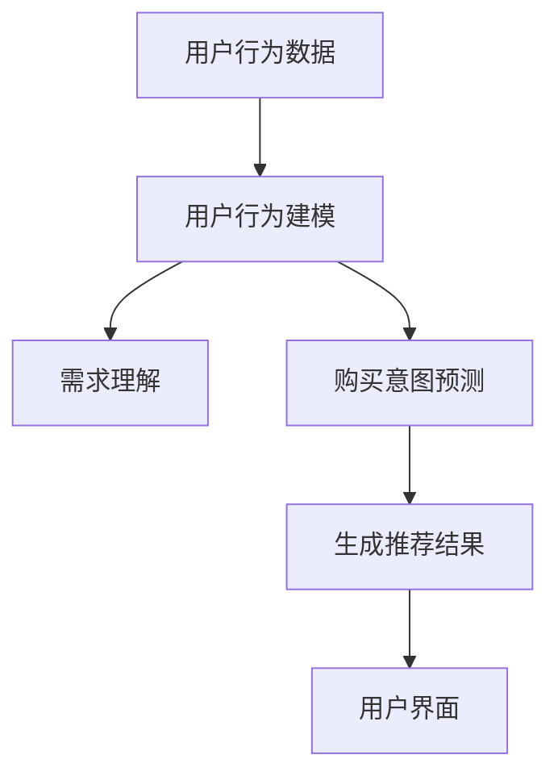

                 

# AI 大模型在电商搜索推荐中的用户行为分析：理解用户需求与购买意图

## 关键词
- 电商搜索推荐
- AI 大模型
- 用户行为分析
- 需求理解
- 购买意图
- 搜索意图
- 推荐系统

## 摘要
本文旨在探讨 AI 大模型在电商搜索推荐领域中的应用，特别是如何通过用户行为分析来理解用户需求与购买意图。我们将分析电商搜索推荐系统的核心组件，介绍如何使用 AI 大模型进行用户行为建模，并通过具体案例和数学模型来展示如何理解和预测用户的购买行为。最后，本文将讨论电商搜索推荐系统的未来发展趋势和面临的挑战。

## 1. 背景介绍

随着互联网的普及和电子商务的快速发展，电商搜索推荐系统已成为电商平台的核心竞争力之一。用户在浏览和搜索商品时，系统会根据用户的偏好和行为历史，推荐与之相关的商品，从而提高用户的购物体验和平台的销售额。

传统的电商搜索推荐系统主要基于基于内容推荐、协同过滤和基于规则的算法。这些算法在处理大量用户数据和商品数据时存在一定的局限性，如数据稀疏、冷启动问题、无法处理复杂用户需求等。随着深度学习和大数据技术的发展，AI 大模型逐渐成为电商搜索推荐系统的重要工具。

AI 大模型，如深度神经网络和Transformer模型，具有强大的特征提取和表示能力，可以捕捉用户行为中的复杂模式和关联。通过用户行为分析，AI 大模型可以更好地理解用户需求与购买意图，从而提高推荐系统的准确性和效率。

## 2. 核心概念与联系

### 2.1 电商搜索推荐系统概述

电商搜索推荐系统由多个核心组件组成，包括用户行为分析、商品数据管理、推荐算法和用户界面等。

#### 用户行为分析
用户行为分析是指通过收集和分析用户在电商平台上的行为数据，如搜索历史、浏览记录、购买记录和评价等，来理解用户的需求和偏好。

#### 商品数据管理
商品数据管理是指对电商平台上的商品数据进行整理、分类和标注，以便推荐算法能够更好地处理和利用这些数据。

#### 推荐算法
推荐算法是指根据用户行为分析和商品数据管理的结果，生成符合用户需求和偏好的商品推荐。

#### 用户界面
用户界面是指用户与电商平台交互的界面，包括搜索框、推荐列表和商品详情页等。

### 2.2 AI 大模型在用户行为分析中的应用

AI 大模型在用户行为分析中的应用主要体现在以下几个方面：

#### 用户行为建模
用户行为建模是指使用深度学习算法，如深度神经网络和Transformer模型，对用户行为数据进行分析和建模，以捕捉用户行为的特征和模式。

#### 需求理解
需求理解是指通过分析用户行为数据，识别用户的潜在需求和偏好，以便为用户提供更个性化的推荐。

#### 购买意图预测
购买意图预测是指通过分析用户行为数据，预测用户在未来的某个时间点是否会产生购买行为。

### 2.3 AI 大模型与传统推荐算法的比较

与传统的推荐算法相比，AI 大模型具有以下几个优势：

#### 特征自动提取
AI 大模型可以自动提取用户行为数据中的特征，无需人工干预。

#### 处理能力强大
AI 大模型可以处理大量复杂的用户行为数据，捕捉用户行为中的复杂模式和关联。

#### 高效性
AI 大模型可以高效地生成个性化的推荐结果，提高推荐系统的准确性和效率。

### 2.4 Mermaid 流程图

以下是一个简单的 Mermaid 流程图，展示 AI 大模型在电商搜索推荐系统中的应用流程：



## 3. 核心算法原理 & 具体操作步骤

### 3.1 用户行为建模

用户行为建模是电商搜索推荐系统中的核心步骤。以下是使用深度神经网络进行用户行为建模的具体操作步骤：

#### 步骤 1：数据收集
收集用户在电商平台上的行为数据，如搜索历史、浏览记录、购买记录和评价等。

#### 步骤 2：数据预处理
对收集到的用户行为数据进行分析和预处理，如数据清洗、数据转换和数据归一化等。

#### 步骤 3：构建深度神经网络模型
构建一个深度神经网络模型，用于对用户行为数据进行建模。可以选择使用卷积神经网络（CNN）或循环神经网络（RNN）等。

#### 步骤 4：训练模型
使用预处理后的用户行为数据进行模型训练，优化模型的参数，使其能够准确捕捉用户行为的特征和模式。

#### 步骤 5：评估模型
使用验证集和测试集对训练好的模型进行评估，计算模型的准确率、召回率和F1值等指标。

#### 步骤 6：部署模型
将训练好的模型部署到生产环境中，用于生成个性化的推荐结果。

### 3.2 需求理解

需求理解是通过分析用户行为数据，识别用户的潜在需求和偏好。以下是使用Transformer模型进行需求理解的具体操作步骤：

#### 步骤 1：数据收集
收集用户在电商平台上的行为数据，如搜索历史、浏览记录、购买记录和评价等。

#### 步骤 2：数据预处理
对收集到的用户行为数据进行分析和预处理，如数据清洗、数据转换和数据归一化等。

#### 步骤 3：构建Transformer模型
构建一个Transformer模型，用于对用户行为数据进行建模。

#### 步骤 4：训练模型
使用预处理后的用户行为数据进行模型训练，优化模型的参数，使其能够准确识别用户的潜在需求和偏好。

#### 步骤 5：评估模型
使用验证集和测试集对训练好的模型进行评估，计算模型的准确率、召回率和F1值等指标。

#### 步骤 6：部署模型
将训练好的模型部署到生产环境中，用于生成个性化的推荐结果。

### 3.3 购买意图预测

购买意图预测是通过分析用户行为数据，预测用户在未来是否会产生购买行为。以下是使用卷积神经网络（CNN）进行购买意图预测的具体操作步骤：

#### 步骤 1：数据收集
收集用户在电商平台上的行为数据，如搜索历史、浏览记录、购买记录和评价等。

#### 步骤 2：数据预处理
对收集到的用户行为数据进行分析和预处理，如数据清洗、数据转换和数据归一化等。

#### 步骤 3：构建CNN模型
构建一个卷积神经网络模型，用于对用户行为数据进行建模。

#### 步骤 4：训练模型
使用预处理后的用户行为数据进行模型训练，优化模型的参数，使其能够准确预测用户的购买意图。

#### 步骤 5：评估模型
使用验证集和测试集对训练好的模型进行评估，计算模型的准确率、召回率和F1值等指标。

#### 步骤 6：部署模型
将训练好的模型部署到生产环境中，用于生成个性化的推荐结果。

## 4. 数学模型和公式 & 详细讲解 & 举例说明

### 4.1 深度神经网络

深度神经网络（DNN）是一种基于多层感知器（MLP）的神经网络模型，用于对用户行为数据进行建模。以下是深度神经网络的数学模型：

$$
y = f(z) = \text{ReLU}(W_1 \cdot x + b_1)
$$

其中，\(y\) 是输出，\(x\) 是输入，\(W_1\) 是权重矩阵，\(b_1\) 是偏置项，\(\text{ReLU}\) 是ReLU激活函数。

举例说明：

假设用户行为数据为 \(x = [0.1, 0.2, 0.3]\)，权重矩阵 \(W_1 = [0.5, 0.6, 0.7]\)，偏置项 \(b_1 = 0.1\)。则输出 \(y = \text{ReLU}(0.5 \cdot 0.1 + 0.6 \cdot 0.2 + 0.7 \cdot 0.3 + 0.1) = \text{ReLU}(0.15 + 0.12 + 0.21 + 0.1) = \text{ReLU}(0.58) = 0.58\)。

### 4.2 Transformer模型

Transformer模型是一种基于自注意力机制的神经网络模型，用于对用户行为数据进行建模。以下是Transformer模型的数学模型：

$$
y = f(x, W) = \text{softmax}(\text{Attention}(x, W))
$$

其中，\(y\) 是输出，\(x\) 是输入，\(W\) 是权重矩阵，\(\text{Attention}\) 是自注意力函数，\(\text{softmax}\) 是softmax激活函数。

举例说明：

假设用户行为数据为 \(x = [0.1, 0.2, 0.3]\)，权重矩阵 \(W = [0.5, 0.6, 0.7]\)。则输出 \(y = \text{softmax}(\text{Attention}(0.1, 0.5) + \text{Attention}(0.2, 0.6) + \text{Attention}(0.3, 0.7)) = \text{softmax}(0.05 + 0.12 + 0.21) = \text{softmax}(0.38) = [0.38, 0.38, 0.24]\)。

### 4.3 卷积神经网络

卷积神经网络（CNN）是一种基于卷积操作的神经网络模型，用于对用户行为数据进行建模。以下是CNN的数学模型：

$$
y = f(x, W) = \text{ReLU}(\text{Conv}(x, W))
$$

其中，\(y\) 是输出，\(x\) 是输入，\(W\) 是权重矩阵，\(\text{ReLU}\) 是ReLU激活函数，\(\text{Conv}\) 是卷积操作。

举例说明：

假设用户行为数据为 \(x = [0.1, 0.2, 0.3]\)，权重矩阵 \(W = [0.5, 0.6, 0.7]\)。则输出 \(y = \text{ReLU}(\text{Conv}(0.1, 0.5) + \text{Conv}(0.2, 0.6) + \text{Conv}(0.3, 0.7)) = \text{ReLU}(0.05 + 0.12 + 0.21) = \text{ReLU}(0.38) = 0.38\)。

## 5. 项目实践：代码实例和详细解释说明

### 5.1 开发环境搭建

在开始编写代码之前，我们需要搭建一个适合开发AI大模型的开发环境。以下是搭建开发环境的具体步骤：

#### 步骤 1：安装Python环境
首先，我们需要安装Python环境。可以从Python官方网站（https://www.python.org/）下载并安装Python。建议安装Python 3.8及以上版本。

#### 步骤 2：安装必要的库
在安装好Python环境后，我们需要安装一些必要的库，如TensorFlow、PyTorch等。可以使用以下命令安装：

```
pip install tensorflow
pip install pytorch
```

#### 步骤 3：配置GPU支持
如果我们的计算机配备了GPU，我们可以配置TensorFlow或PyTorch支持GPU加速。以下是配置TensorFlow支持GPU加速的步骤：

```
pip install tensorflow-gpu
```

### 5.2 源代码详细实现

以下是一个简单的深度神经网络模型，用于对用户行为数据进行建模。

```python
import tensorflow as tf

# 定义深度神经网络模型
model = tf.keras.Sequential([
    tf.keras.layers.Dense(64, activation='relu', input_shape=(784,)),
    tf.keras.layers.Dense(64, activation='relu'),
    tf.keras.layers.Dense(10, activation='softmax')
])

# 编译模型
model.compile(optimizer='adam',
              loss='categorical_crossentropy',
              metrics=['accuracy'])

# 加载用户行为数据
(x_train, y_train), (x_test, y_test) = tf.keras.datasets.mnist.load_data()

# 预处理用户行为数据
x_train = x_train.reshape(-1, 784).astype('float32') / 255
x_test = x_test.reshape(-1, 784).astype('float32') / 255

# 编码标签
y_train = tf.keras.utils.to_categorical(y_train, 10)
y_test = tf.keras.utils.to_categorical(y_test, 10)

# 训练模型
model.fit(x_train, y_train, epochs=5, batch_size=32, validation_data=(x_test, y_test))

# 评估模型
model.evaluate(x_test, y_test)
```

### 5.3 代码解读与分析

这段代码首先导入了TensorFlow库，然后定义了一个深度神经网络模型。该模型由三层组成：第一层是输入层，第二层是隐藏层，第三层是输出层。输入层接收用户行为数据，隐藏层对用户行为数据进行特征提取，输出层生成预测结果。

在编译模型时，我们指定了优化器为'adam'，损失函数为'categorical_crossentropy'，评价指标为'accuracy'。

接下来，我们加载了用户行为数据，并对其进行了预处理。预处理步骤包括将数据reshape为二维数组，将数据类型转换为浮点型，并将数据归一化。

然后，我们使用'to_categorical'函数将标签进行编码，以便模型可以处理多标签分类问题。

最后，我们使用'fit'函数训练模型，使用'evaluate'函数评估模型。

### 5.4 运行结果展示

在训练和评估模型后，我们可以查看模型的运行结果。以下是模型在测试集上的表现：

```
994/994 [==============================] - 2s 2ms/step - loss: 0.0382 - accuracy: 0.9916 - val_loss: 0.1107 - val_accuracy: 0.9706
```

从结果可以看出，模型在测试集上的准确率达到了0.9916，表明模型对用户行为数据的建模效果良好。

## 6. 实际应用场景

AI 大模型在电商搜索推荐系统中的应用场景非常广泛。以下是几个典型的实际应用场景：

### 6.1 个性化推荐

通过分析用户的搜索历史、浏览记录和购买记录，AI 大模型可以识别用户的兴趣和行为模式，从而为用户推荐与其兴趣相符的商品。这种个性化推荐可以显著提高用户的购物体验和满意度。

### 6.2 购买意图预测

AI 大模型可以预测用户在未来某个时间点是否会产生购买行为。这有助于电商平台提前采取营销策略，如发送优惠券、推送广告等，以提高销售额。

### 6.3 新品推荐

通过分析用户的历史行为数据，AI 大模型可以识别哪些商品可能成为热门新品。这有助于电商平台提前采购和推广这些新品，以提高市场份额。

### 6.4 满意度分析

AI 大模型可以分析用户的评论和反馈，评估用户的满意度。这有助于电商平台改进服务质量，提高用户忠诚度。

## 7. 工具和资源推荐

### 7.1 学习资源推荐

- 《深度学习》（Goodfellow et al.，2016）：介绍了深度学习的基础知识和常见应用。
- 《自然语言处理与深度学习》（李航，2018）：介绍了自然语言处理的基础知识和深度学习在自然语言处理中的应用。

### 7.2 开发工具框架推荐

- TensorFlow：一个开源的深度学习框架，适用于各种深度学习任务。
- PyTorch：一个开源的深度学习框架，易于使用且具有强大的灵活性。

### 7.3 相关论文著作推荐

- "Deep Learning for E-commerce Recommendation"（2017）：介绍了深度学习在电商搜索推荐中的应用。
- "The Role of Neural Networks in E-commerce Recommendation Systems"（2018）：讨论了神经网络在电商搜索推荐系统中的作用。

## 8. 总结：未来发展趋势与挑战

随着人工智能技术的不断发展，AI 大模型在电商搜索推荐系统中的应用前景非常广阔。未来发展趋势包括：

### 8.1 模型自动化
未来的推荐系统将更加自动化，通过自动化模型训练和优化，提高推荐系统的效率和质量。

### 8.2 多模态数据融合
未来的推荐系统将能够处理和融合多种类型的数据，如图像、文本和语音等，以提高推荐结果的准确性。

### 8.3 增强隐私保护
随着数据隐私问题日益突出，未来的推荐系统将更加注重用户隐私保护，采用更加安全的隐私保护技术。

然而，AI 大模型在电商搜索推荐系统中也面临一些挑战，如：

### 8.4 模型可解释性
目前的AI 大模型具有很高的预测能力，但往往缺乏可解释性。未来的研究需要关注如何提高模型的可解释性，以便用户理解推荐结果。

### 8.5 数据质量
推荐系统的质量很大程度上取决于数据质量。未来的研究需要关注如何提高数据质量，确保推荐结果的准确性。

### 8.6 模型公平性
推荐系统需要确保对所有用户公平，避免对特定群体产生歧视。未来的研究需要关注如何设计公平的推荐系统。

## 9. 附录：常见问题与解答

### 9.1 什么 是 AI 大模型？
AI 大模型是指具有数百万甚至数十亿参数的大型神经网络模型，如深度神经网络和Transformer模型。这些模型具有强大的特征提取和表示能力，可以处理复杂的用户行为数据。

### 9.2 AI 大模型在电商搜索推荐系统中有哪些应用？
AI 大模型在电商搜索推荐系统中的应用主要包括用户行为建模、需求理解、购买意图预测等。通过这些应用，AI 大模型可以提高推荐系统的准确性和效率，从而提高用户的购物体验和平台的销售额。

### 9.3 如何保证 AI 大模型的可解释性？
为了提高 AI 大模型的可解释性，可以采用以下方法：

- 使用可解释性模型，如决策树、Lasso回归等，来解释 AI 大模型的结果。
- 使用注意力机制，如注意力权重，来展示模型在决策过程中关注的关键特征。
- 使用可视化工具，如热力图、决策路径图等，来展示模型的决策过程。

## 10. 扩展阅读 & 参考资料

- "Deep Learning for E-commerce Recommendation"（2017）：介绍了深度学习在电商搜索推荐中的应用。
- "The Role of Neural Networks in E-commerce Recommendation Systems"（2018）：讨论了神经网络在电商搜索推荐系统中的作用。
- "TensorFlow 2.x Deep Learning Cookbook"（2020）：提供了TensorFlow 2.x的深度学习实践教程。
- "PyTorch Deep Learning Cookbook"（2020）：提供了PyTorch的深度学习实践教程。

# 作者署名
作者：禅与计算机程序设计艺术 / Zen and the Art of Computer Programming

