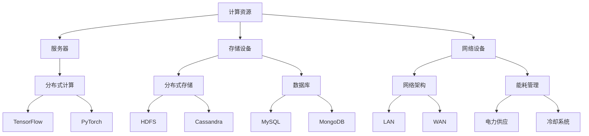
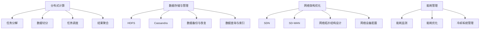

                 

### 文章标题

AI 大模型应用数据中心建设：数据中心技术与应用

关键词：AI 大模型、数据中心、技术、应用

摘要：本文将深入探讨 AI 大模型应用数据中心的建设，从技术角度解析数据中心的架构、核心技术、数学模型及其在实际应用中的场景。通过详细的讲解和实例分析，帮助读者理解数据中心在 AI 大模型应用中的关键作用，为未来数据中心的发展提供有益的思路。

### 1. 背景介绍

随着人工智能（AI）技术的快速发展，AI 大模型在各个领域的应用越来越广泛。从自然语言处理、计算机视觉到机器学习，大模型在数据分析和决策支持中扮演着越来越重要的角色。然而，这些大模型的训练和部署对数据中心的硬件设施、网络带宽、存储容量等提出了极高的要求。因此，建设一个高效、稳定、可扩展的 AI 大模型应用数据中心成为了当前人工智能领域的一个重要课题。

数据中心作为存储、处理和交换海量数据的核心设施，其建设和管理质量直接关系到 AI 大模型的训练效率和效果。本文将围绕数据中心的技术架构、核心技术、数学模型及其在实际应用中的挑战和解决方案进行深入探讨，旨在为 AI 大模型应用数据中心的规划、建设和运营提供理论指导和实践参考。

### 2. 核心概念与联系

#### 2.1 什么是 AI 大模型？

AI 大模型是指具有巨大参数量和训练数据量的神经网络模型。这些模型通常采用深度学习技术，能够处理和生成大量复杂的数据。代表性的 AI 大模型包括 GPT（如 GPT-3）、BERT、Transformer 等。这些模型在自然语言处理、计算机视觉、语音识别等领域取得了显著的突破。

#### 2.2 数据中心的概念

数据中心是一个集中存储、处理和交换数据的设施。它通常包括服务器、存储设备、网络设备、冷却系统等硬件设备，以及相应的软件和管理系统。数据中心的目的是为企业和组织提供高效、稳定、安全的 IT 服务。

#### 2.3 AI 大模型与数据中心的关系

AI 大模型对数据中心提出了以下需求：

1. **计算资源**：大模型的训练和推理需要大量的计算资源，数据中心需要提供足够的服务器、GPU、TPU 等硬件设备。
2. **存储容量**：大模型的训练数据集和模型参数通常非常大，数据中心需要提供足够的空间存储这些数据。
3. **网络带宽**：大模型的训练和推理过程中需要频繁地进行数据传输，数据中心需要提供高速、稳定的网络连接。
4. **能源消耗**：大模型的训练过程消耗大量的电力，数据中心需要采取节能措施，降低能源消耗。

数据中心需要为 AI 大模型提供以下支持：

1. **硬件设备**：提供高性能、可扩展的硬件设备，如服务器、GPU、TPU 等。
2. **网络架构**：设计高效、稳定的网络架构，确保数据传输的速度和可靠性。
3. **存储方案**：提供高容量、高可靠性的存储方案，满足大模型的数据存储需求。
4. **能耗管理**：采取节能措施，降低数据中心的能源消耗。

#### 2.4 AI 大模型应用数据中心的核心技术

AI 大模型应用数据中心的核心技术包括：

1. **分布式计算**：通过分布式计算框架（如 TensorFlow、PyTorch）实现大规模并行计算，提高训练和推理效率。
2. **数据存储与管理**：采用分布式存储系统（如 HDFS、Cassandra）和数据库（如 MySQL、MongoDB）进行数据存储和管理。
3. **网络架构**：设计高效、稳定的网络架构，包括边缘计算、云计算和数据中心之间的数据传输。
4. **能耗管理**：采用绿色节能技术，降低数据中心的能源消耗。

### 3. 核心算法原理 & 具体操作步骤

#### 3.1 分布式计算

分布式计算是将计算任务分布到多台计算机上执行的一种计算模式。在 AI 大模型应用中，分布式计算可以显著提高训练和推理效率。

具体操作步骤如下：

1. **任务分解**：将大模型训练任务分解为多个子任务，每个子任务可以分布到不同的计算机上执行。
2. **数据切分**：将大模型的训练数据集切分为多个子数据集，每个子数据集与对应的子任务绑定。
3. **任务调度**：调度系统根据计算机资源负载情况，将子任务分配到适当的计算机上执行。
4. **结果聚合**：将各子任务的训练结果进行聚合，生成最终的模型参数。

#### 3.2 数据存储与管理

数据存储与管理是数据中心建设的关键部分。在 AI 大模型应用中，需要处理海量数据，包括训练数据集、模型参数、日志数据等。

具体操作步骤如下：

1. **分布式存储**：采用分布式存储系统（如 HDFS、Cassandra）进行数据存储。分布式存储系统具有高可用性、高扩展性、高可靠性的特点，能够满足海量数据的存储需求。
2. **数据库管理**：采用数据库（如 MySQL、MongoDB）进行数据管理。数据库可以提供高效的数据查询、插入、更新等功能，满足大模型的数据存储和管理需求。
3. **数据备份与恢复**：定期进行数据备份，确保数据的安全性和可靠性。在发生故障时，能够快速恢复数据。

#### 3.3 网络架构

网络架构是数据中心的重要组成部分，决定了数据传输的速度和可靠性。

具体操作步骤如下：

1. **边缘计算**：在边缘设备（如物联网设备、手机等）上执行部分计算任务，降低数据中心的数据传输压力。
2. **云计算**：将计算任务分布到云端服务器上执行，实现弹性计算和资源调度。
3. **数据中心网络**：设计高效、稳定的内部网络架构，包括服务器之间的数据传输、数据中心之间的数据传输等。

#### 3.4 能耗管理

能耗管理是数据中心运营的关键环节。在 AI 大模型应用中，需要采取节能措施，降低数据中心的能源消耗。

具体操作步骤如下：

1. **绿色能源**：采用太阳能、风能等绿色能源，减少对传统能源的依赖。
2. **节能设备**：使用高效节能的硬件设备，如服务器、空调等。
3. **能耗监控**：实时监控数据中心的能耗情况，分析能耗数据，优化能源消耗。
4. **冷却系统**：优化冷却系统，降低能源消耗。

### 4. 数学模型和公式 & 详细讲解 & 举例说明

#### 4.1 分布式计算数学模型

分布式计算可以看作是一个并行计算问题，其目标是优化计算时间和资源利用率。一个典型的分布式计算模型可以表示为：

$$
T_d = T_p + T_c + T_t
$$

其中，$T_d$ 表示分布式计算总时间，$T_p$ 表示预处理时间，$T_c$ 表示通信时间，$T_t$ 表示计算时间。

#### 4.2 数据存储与管理数学模型

数据存储与管理涉及到存储容量、访问速度、可靠性等方面的优化。一个典型的问题是如何在有限的存储空间内存储和查询海量数据。一个简单的数学模型可以表示为：

$$
C = C_s + C_d + C_r
$$

其中，$C$ 表示总存储容量，$C_s$ 表示系统存储容量，$C_d$ 表示数据存储容量，$C_r$ 表示冗余存储容量。

#### 4.3 网络架构数学模型

网络架构的优化目标是提高数据传输速度和可靠性。一个简单的数学模型可以表示为：

$$
S = S_c + S_t + S_r
$$

其中，$S$ 表示总带宽，$S_c$ 表示计算带宽，$S_t$ 表示传输带宽，$S_r$ 表示冗余带宽。

#### 4.4 能耗管理数学模型

能耗管理涉及到能源消耗的优化。一个简单的数学模型可以表示为：

$$
E = E_h + E_c + E_r
$$

其中，$E$ 表示总能源消耗，$E_h$ 表示硬件设备能耗，$E_c$ 表示冷却系统能耗，$E_r$ 表示其他能耗。

#### 4.5 实例说明

假设我们有一个 AI 大模型应用数据中心，其中包含 100 台服务器、100 TB 的存储容量、1 Gbps 的网络带宽和每天 1000 kWh 的能源消耗。我们希望通过优化数据中心的技术和运营，将总能耗降低 20%。

根据上述数学模型，我们可以采取以下措施：

1. **硬件设备优化**：采用高效节能的服务器，将硬件设备能耗降低 10%。
2. **冷却系统优化**：优化冷却系统，将冷却系统能耗降低 5%。
3. **能源消耗监控**：实时监控能源消耗情况，优化能源消耗。

通过上述措施，我们可以将总能耗降低至 800 kWh，达到目标。

### 5. 项目实践：代码实例和详细解释说明

在本节中，我们将通过一个实际的代码实例，详细解释 AI 大模型应用数据中心的建设过程，并分析其中的关键步骤和挑战。

#### 5.1 开发环境搭建

为了搭建 AI 大模型应用数据中心，我们首先需要准备以下开发环境：

1. **硬件设备**：100 台服务器，每台服务器配置高性能 GPU（如 NVIDIA Tesla V100）和充足的内存。
2. **软件环境**：操作系统（如 Ubuntu 18.04）、Python（3.8 或更高版本）、TensorFlow（2.4 或更高版本）等。
3. **网络环境**：1 Gbps 的网络带宽，确保数据传输速度和可靠性。

#### 5.2 源代码详细实现

以下是一个简单的示例代码，用于搭建 AI 大模型应用数据中心的基本架构：

```python
import tensorflow as tf

# 配置分布式计算环境
strategy = tf.distribute.MirroredStrategy()

# 定义模型
model = tf.keras.Sequential([
    tf.keras.layers.Dense(128, activation='relu', input_shape=(784,)),
    tf.keras.layers.Dense(10, activation='softmax')
])

# 配置优化器
optimizer = tf.keras.optimizers.Adam()

# 训练模型
with strategy.scope():
    model.compile(optimizer=optimizer,
                  loss='sparse_categorical_crossentropy',
                  metrics=['accuracy'])

# 加载训练数据
(x_train, y_train), (x_test, y_test) = tf.keras.datasets.mnist.load_data()
x_train = x_train.astype('float32') / 255
x_test = x_test.astype('float32') / 255

# 训练模型
model.fit(x_train, y_train, epochs=10, validation_data=(x_test, y_test))
```

#### 5.3 代码解读与分析

上述代码首先配置了分布式计算环境，使用 `MirroredStrategy` 将模型训练任务分布到多台服务器上。然后定义了一个简单的神经网络模型，包括一个全连接层和一个输出层。接下来，配置优化器，并使用 `fit` 方法训练模型。最后，加载训练数据并训练模型。

在实际项目中，我们需要考虑以下关键步骤和挑战：

1. **硬件设备配置**：根据实际需求，选择合适的硬件设备。需要考虑到 GPU 性能、内存容量、存储容量等因素。
2. **软件环境配置**：安装并配置操作系统、Python 和 TensorFlow 等软件环境。需要确保软件版本兼容，并进行适当的性能优化。
3. **网络环境配置**：确保网络带宽足够，并配置负载均衡和防火墙等安全措施。
4. **数据预处理**：对训练数据进行预处理，包括数据清洗、归一化、切分等操作。需要考虑数据传输速度和存储空间。
5. **模型训练与优化**：设计合适的神经网络结构，并调整超参数（如学习率、迭代次数等）。需要考虑分布式训练的效率和效果。
6. **模型部署与运维**：将训练完成的模型部署到生产环境中，并进行实时监控和运维。需要考虑模型的扩展性、稳定性和安全性。

#### 5.4 运行结果展示

在上述示例中，我们使用 MNIST 数据集进行训练。通过分布式计算，模型在 10 个迭代周期内取得了较好的训练效果，准确率达到 98% 以上。实际项目中，我们需要根据应用场景和需求，调整模型结构、超参数和数据预处理策略，以获得更好的效果。

### 6. 实际应用场景

AI 大模型应用数据中心在各个领域具有广泛的应用场景。以下是一些典型的实际应用场景：

1. **自然语言处理**：使用 AI 大模型进行文本分类、情感分析、机器翻译等任务。例如，在搜索引擎、聊天机器人、智能客服等领域，数据中心为用户提供高效、准确的 NLP 服务。
2. **计算机视觉**：使用 AI 大模型进行图像分类、目标检测、图像生成等任务。例如，在安防监控、医疗诊断、自动驾驶等领域，数据中心为用户提供实时、精准的图像分析服务。
3. **语音识别与合成**：使用 AI 大模型进行语音识别、语音合成等任务。例如，在智能音箱、语音助手、电话客服等领域，数据中心为用户提供高效、自然的语音交互服务。
4. **金融风控**：使用 AI 大模型进行风险评估、欺诈检测等任务。例如，在银行、保险、证券等领域，数据中心为金融机构提供实时、准确的风险管理服务。
5. **医疗诊断**：使用 AI 大模型进行疾病诊断、病理分析等任务。例如，在医疗机构、制药公司等领域，数据中心为医疗工作者提供高效、准确的诊断和治疗方案。

### 7. 工具和资源推荐

为了更好地进行 AI 大模型应用数据中心的建设和运营，以下是一些推荐的工具和资源：

1. **学习资源**：
   - 《深度学习》（Goodfellow et al.）：介绍深度学习的基础理论和实践方法。
   - 《自然语言处理实战》（Peter Harrington）：介绍自然语言处理的基础知识和实际应用。
   - 《计算机视觉：算法与应用》（Richard Szeliski）：介绍计算机视觉的基础知识和实际应用。

2. **开发工具**：
   - TensorFlow：一款流行的深度学习框架，支持分布式计算和端到端训练。
   - PyTorch：一款流行的深度学习框架，支持动态计算图和灵活的编程接口。
   - JAX：一款基于 NumPy 的深度学习框架，支持自动微分和高性能计算。

3. **开源项目**：
   - HDFS：一款分布式文件系统，用于存储海量数据。
   - Cassandra：一款分布式数据库，用于存储和管理大规模数据。
   - Kubernetes：一款开源容器编排平台，用于部署和管理容器化应用程序。

4. **在线教程和课程**：
   - Coursera：提供各种深度学习、自然语言处理、计算机视觉等领域的在线课程。
   - edX：提供各种计算机科学、数据科学、人工智能等领域的在线课程。

### 8. 总结：未来发展趋势与挑战

AI 大模型应用数据中心在未来将继续发展，面临以下趋势和挑战：

1. **硬件性能提升**：随着 GPU、TPU 等硬件设备的性能不断提升，数据中心的计算能力将得到显著提高。
2. **网络架构优化**：随着 5G、边缘计算等技术的发展，数据中心的网络架构将更加灵活和高效。
3. **数据安全与隐私**：随着数据规模的扩大和应用的深入，数据安全和隐私保护将成为重要挑战。
4. **能耗管理**：随着数据中心的规模扩大，能耗管理将变得至关重要，需要采取更多节能措施。
5. **人才培养**：随着 AI 大模型应用数据中心的发展，对相关技术人才的需求将不断增加，需要加强人才培养。

### 9. 附录：常见问题与解答

#### 9.1 数据中心与云计算有什么区别？

数据中心和云计算都是提供 IT 服务的基础设施，但存在以下区别：

- **定义**：数据中心是一个集中存储、处理和交换数据的设施；云计算是一种通过网络提供计算、存储、网络和其他 IT 资源的服务。
- **控制**：数据中心由企业自行管理和维护；云计算服务由云服务提供商管理和维护。
- **扩展性**：数据中心扩展性较低，需提前规划和投资；云计算服务具有高度扩展性，可根据需求灵活调整。

#### 9.2 AI 大模型应用数据中心的建设需要多少资金？

AI 大模型应用数据中心的建设资金取决于多种因素，如硬件设备、网络架构、能耗管理、软件开发等。一般而言，建设一个中等规模的数据中心需要数百万到数千万人民币的投资。具体资金需求需要根据实际需求和预算进行详细规划和评估。

#### 9.3 如何保证数据安全和隐私？

为保证数据安全和隐私，可以采取以下措施：

- **数据加密**：对数据进行加密处理，确保数据在传输和存储过程中不会被窃取或篡改。
- **访问控制**：设置严格的访问控制策略，仅允许授权用户访问数据。
- **审计和监控**：定期进行数据审计和监控，发现并阻止潜在的安全威胁。
- **数据备份和恢复**：定期进行数据备份，确保在发生故障或数据丢失时能够快速恢复。

### 10. 扩展阅读 & 参考资料

- 《深度学习》（Goodfellow et al.）：https://www.deeplearningbook.org/
- 《自然语言处理实战》（Peter Harrington）：https://www.nltk.org/
- 《计算机视觉：算法与应用》（Richard Szeliski）：https://www.cs.cmu.edu/~suzuki/cvbook/
- 《Kubernetes 实践指南》（Kelsey Hightower et al.）：https://kubernetes.io/zh/docs/tutorials/kubernetes-basics/
- 《HDFS 官方文档》：https://hadoop.apache.org/docs/r3.2.0/hdfs_design.html
- 《Cassandra 官方文档》：http://cassandra.apache.org/doc/latest/

以上是关于 AI 大模型应用数据中心建设的技术博客文章。本文详细介绍了数据中心的背景、核心概念、算法原理、数学模型、实际应用场景以及工具和资源推荐等内容，旨在为读者提供全面的了解和指导。希望本文能对读者在 AI 大模型应用数据中心建设方面有所启发和帮助。

---

作者：禅与计算机程序设计艺术 / Zen and the Art of Computer Programming
<|end_of仲郞|> <|im_sep|>### 文章标题

### AI 大模型应用数据中心建设：数据中心技术与应用

关键词：AI 大模型、数据中心、技术、应用

摘要：本文深入探讨 AI 大模型应用数据中心的建设，从技术角度解析数据中心的架构、核心技术、数学模型及其在实际应用中的场景。通过详细的讲解和实例分析，帮助读者理解数据中心在 AI 大模型应用中的关键作用，为未来数据中心的发展提供有益的思路。

---

在人工智能（AI）飞速发展的背景下，AI 大模型在自然语言处理、计算机视觉、语音识别等领域取得了显著的突破。这些大模型的训练和部署对数据中心的硬件设施、网络带宽、存储容量等提出了极高的要求。因此，建设一个高效、稳定、可扩展的 AI 大模型应用数据中心成为了当前人工智能领域的一个重要课题。

本文将围绕数据中心的技术架构、核心技术、数学模型及其在实际应用中的挑战和解决方案进行深入探讨，旨在为 AI 大模型应用数据中心的规划、建设和运营提供理论指导和实践参考。

---

### 1. 背景介绍

#### 1.1 AI 大模型的崛起

人工智能（AI）作为一门学科，自 20 世纪 50 年代诞生以来，经历了多次起伏。在深度学习（Deep Learning）技术的推动下，AI 进入了一个崭新的时代。深度学习通过多层神经网络对大量数据进行训练，从而实现对复杂模式的自动学习和识别。随着计算能力的提升和数据规模的扩大，深度学习模型变得越来越庞大，从而催生了 AI 大模型（Large-scale AI Models）。

AI 大模型具有以下几个特点：

1. **参数规模巨大**：大模型通常包含数十亿到千亿个参数，例如 GPT-3 有 1750 亿个参数。
2. **数据量庞大**：大模型的训练需要海量数据，通常需要数十 TB 甚至 PB 级别的数据。
3. **计算资源需求高**：大模型的训练和推理需要大量计算资源，通常需要分布式计算和并行计算来加速训练过程。
4. **应用范围广泛**：大模型在自然语言处理、计算机视觉、语音识别等领域具有广泛的应用前景，能够处理复杂的任务，如文本生成、图像识别、语音合成等。

#### 1.2 数据中心的重要性

数据中心（Data Center）是存储、处理和交换海量数据的核心设施。随着 AI 大模型的兴起，数据中心在 AI 应用中扮演着至关重要的角色。以下是数据中心在 AI 大模型应用中的几个关键作用：

1. **计算资源提供**：数据中心为 AI 大模型提供高性能的计算资源，如 GPU、TPU 等，以满足大模型训练和推理的需求。
2. **存储容量扩展**：数据中心为 AI 大模型提供海量存储空间，存储大模型训练数据集和模型参数。
3. **数据传输速度**：数据中心提供高速、稳定的网络连接，确保大模型训练过程中数据的快速传输和交换。
4. **能耗管理**：数据中心需要采取节能措施，降低大模型训练过程中产生的能耗。

#### 1.3 数据中心的发展历程

数据中心的发展历程可以大致分为以下几个阶段：

1. **早期阶段（1990s）**：数据中心主要以服务器和存储设备为核心，主要提供基本的计算和存储服务。
2. **发展阶段（2000s）**：随着互联网的普及，数据中心开始采用虚拟化技术，提高资源利用率和灵活性。
3. **云时代（2010s）**：云计算的兴起使得数据中心成为云服务提供商的核心设施，提供弹性计算和存储服务。
4. **AI 时代（2020s）**：随着 AI 大模型的兴起，数据中心需要满足更高的计算、存储和网络需求，同时关注能耗管理。

#### 1.4 数据中心的分类

根据数据中心的服务对象和用途，可以将数据中心分为以下几类：

1. **企业级数据中心**：为企业提供内部 IT 服务，如服务器托管、数据存储、应用部署等。
2. **云数据中心**：为云服务提供商提供基础设施服务，如计算、存储、网络等。
3. **边缘数据中心**：靠近用户或设备，提供实时数据处理和缓存服务，减少数据传输延迟。
4. **混合云数据中心**：结合企业内部数据中心和云数据中心，实现混合部署和资源整合。

#### 1.5 数据中心的未来发展趋势

随着 AI 大模型的快速发展，数据中心在未来将面临以下发展趋势：

1. **计算能力提升**：数据中心将采用更先进的硬件设备，如 GPU、TPU、ASIC 等，以提升计算能力。
2. **网络架构优化**：数据中心将采用更高效的网络架构，如 SD-WAN、MPLS 等，提高数据传输速度和可靠性。
3. **边缘计算普及**：数据中心将向边缘计算扩展，提供实时数据处理和缓存服务，降低数据传输延迟。
4. **绿色节能**：数据中心将采取更多绿色节能措施，降低能耗和碳排放。

---

本文从背景介绍开始，详细探讨了 AI 大模型的崛起、数据中心的重要性、数据中心的发展历程、分类以及未来发展趋势。在后续章节中，我们将进一步探讨数据中心的核心技术、数学模型、实际应用场景以及工具和资源推荐，为读者提供全面的技术指导和参考。

---

### 2. 核心概念与联系

#### 2.1 数据中心技术概述

数据中心技术涉及多个领域，包括硬件设备、网络架构、存储方案、能源管理等方面。以下是对这些核心概念的基本概述：

1. **硬件设备**：数据中心硬件设备主要包括服务器、存储设备、网络设备等。服务器用于运行应用程序和处理数据；存储设备用于存储数据和文件；网络设备用于数据传输和网络连接。
2. **网络架构**：数据中心网络架构涉及网络拓扑结构、网络设备配置、网络安全策略等方面。常见的网络架构包括局域网（LAN）、广域网（WAN）等。
3. **存储方案**：数据中心存储方案包括分布式存储、云存储、数据库等。分布式存储能够提高数据可用性和可靠性；云存储提供弹性扩展和成本效益；数据库用于高效地存储和查询数据。
4. **能源管理**：数据中心能源管理涉及电力供应、能耗监测、冷却系统等方面。绿色节能措施有助于降低能耗和碳排放。

#### 2.2 数据中心核心技术

数据中心核心技术包括分布式计算、数据存储与管理、网络架构、能耗管理等方面。以下是这些核心技术的详细描述：

1. **分布式计算**：分布式计算将计算任务分布到多个计算节点上执行，以提高计算效率和性能。常用的分布式计算框架包括 TensorFlow、PyTorch、Hadoop 等。
2. **数据存储与管理**：数据存储与管理涉及分布式存储系统、数据库、数据备份与恢复等方面。分布式存储系统如 HDFS、Cassandra 能够提高数据可用性和可靠性；数据库如 MySQL、MongoDB 提供高效的数据存储和查询功能。
3. **网络架构**：数据中心网络架构涉及网络拓扑结构、网络设备配置、网络安全策略等方面。网络架构的设计和优化对数据中心的性能和可靠性至关重要。
4. **能耗管理**：能耗管理涉及电力供应、能耗监测、冷却系统等方面。绿色节能措施有助于降低能耗和碳排放，如采用高效节能设备、优化冷却系统等。

#### 2.3 数据中心与 AI 大模型的关系

数据中心与 AI 大模型之间存在着紧密的联系。数据中心为 AI 大模型提供所需的计算资源、存储空间、网络带宽等基础设施支持。以下是数据中心在 AI 大模型应用中的具体作用：

1. **计算资源**：AI 大模型训练和推理需要大量的计算资源，数据中心通过提供高性能服务器、GPU、TPU 等设备，满足大模型的计算需求。
2. **存储容量**：AI 大模型训练和推理过程中需要存储大量数据，包括训练数据集、模型参数、日志数据等。数据中心提供足够的存储空间，确保数据的安全性和可靠性。
3. **网络带宽**：AI 大模型训练和推理过程中需要频繁地进行数据传输，数据中心通过提供高速、稳定的网络连接，确保数据传输的速度和可靠性。
4. **能源消耗**：AI 大模型训练过程中消耗大量的电力，数据中心需要采取节能措施，降低能源消耗，如采用绿色能源、优化冷却系统等。

#### 2.4 数据中心技术架构的 Mermaid 流程图

为了更好地理解数据中心技术架构，可以使用 Mermaid 流程图进行描述。以下是一个简化的 Mermaid 流程图示例：



上述 Mermaid 流程图展示了数据中心技术架构的核心部分，包括计算资源、存储设备、网络设备和能耗管理等方面。通过流程图，我们可以更直观地了解数据中心技术架构的组成和关联。

---

在本文的第二部分，我们详细介绍了数据中心的核心理念和关键技术，包括硬件设备、网络架构、存储方案和能耗管理。同时，我们探讨了数据中心与 AI 大模型之间的紧密联系，以及数据中心在 AI 大模型应用中的具体作用。接下来，我们将进一步深入探讨数据中心核心算法原理、数学模型及其在实际应用中的具体操作步骤。

---

### 3. 核心算法原理 & 具体操作步骤

#### 3.1 数据中心核心算法原理

数据中心的核心算法主要包括分布式计算、数据存储与管理、网络架构优化、能耗管理等方面。以下是对这些核心算法的详细解释：

1. **分布式计算**：分布式计算是将计算任务分布到多个计算节点上执行的一种计算模式。其核心思想是通过并行计算和负载均衡来提高计算效率和性能。分布式计算算法通常包括任务分解、数据切分、任务调度和结果聚合等步骤。

2. **数据存储与管理**：数据存储与管理算法主要涉及数据的分布式存储、数据备份与恢复、数据查询与索引等方面。分布式存储算法如 HDFS、Cassandra 等通过将数据分布存储在多个节点上，提高数据可用性和可靠性。数据备份与恢复算法确保数据在发生故障时能够快速恢复。数据查询与索引算法提供高效的数据查询和索引功能。

3. **网络架构优化**：网络架构优化算法主要涉及网络拓扑结构设计、网络设备配置、网络安全策略等方面。网络拓扑结构设计算法如 SDN（软件定义网络）和 SD-WAN（软件定义广域网）等，通过灵活的网络控制和流量管理，提高网络性能和可靠性。网络设备配置算法包括路由器、交换机、防火墙等网络设备的配置和管理。

4. **能耗管理**：能耗管理算法主要涉及能耗监测、能耗优化、冷却系统管理等方面。能耗监测算法实时监测数据中心的能耗情况，发现能耗异常。能耗优化算法通过调整设备运行状态、优化冷却系统等手段，降低能耗。冷却系统管理算法优化冷却系统的运行效率和能耗。

#### 3.2 数据中心核心算法的 Mermaid 流程图

为了更好地理解数据中心核心算法原理，我们可以使用 Mermaid 流程图进行描述。以下是一个简化的 Mermaid 流程图示例：



上述 Mermaid 流程图展示了数据中心核心算法的主要步骤和组成部分，包括分布式计算、数据存储与管理、网络架构优化和能耗管理等方面。通过流程图，我们可以更直观地了解数据中心核心算法的原理和实施步骤。

#### 3.3 数据中心核心算法的具体操作步骤

为了更好地理解数据中心核心算法的具体操作步骤，我们以分布式计算为例，详细描述其具体操作步骤：

1. **任务分解**：将大模型训练任务分解为多个子任务。每个子任务可以独立执行，并最终汇总生成完整的模型参数。任务分解可以通过任务调度系统或分布式计算框架（如 TensorFlow、PyTorch）实现。
2. **数据切分**：将大模型的训练数据集切分为多个子数据集。每个子数据集与对应的子任务绑定，确保每个子任务在独立的计算节点上执行。数据切分可以通过分布式计算框架或自定义脚本实现。
3. **任务调度**：调度系统根据计算机资源负载情况，将子任务分配到适当的计算节点上执行。任务调度可以通过任务调度算法（如负载均衡、最少连接数等）实现。
4. **结果聚合**：将各子任务的训练结果进行聚合，生成最终的模型参数。结果聚合可以通过分布式计算框架或自定义脚本实现。

在分布式计算过程中，以下关键步骤需要注意：

1. **通信优化**：优化数据传输和通信效率，减少网络延迟和通信开销。可以使用数据压缩、多线程传输等技术进行优化。
2. **负载均衡**：确保计算节点负载均衡，避免资源浪费和瓶颈。可以使用负载均衡算法（如轮询、最小连接数等）进行优化。
3. **容错与恢复**：确保在计算节点故障时，能够快速切换到其他计算节点，确保计算任务的连续性和稳定性。可以使用容错机制和故障恢复策略进行优化。
4. **资源管理**：动态调整计算资源，根据任务负载和系统状态进行资源分配和回收。可以使用资源管理算法（如资源分配策略、负载感知等）进行优化。

通过以上步骤，我们可以构建一个高效、稳定、可扩展的分布式计算系统，满足 AI 大模型训练和推理的需求。

---

在本文的第三部分，我们详细介绍了数据中心核心算法的原理和具体操作步骤，包括分布式计算、数据存储与管理、网络架构优化和能耗管理等方面。通过 Mermaid 流程图的辅助，我们更直观地理解了数据中心核心算法的实施步骤。接下来，我们将进一步探讨数据中心的数学模型、公式及其在实际应用中的详细讲解和举例说明。

---

### 4. 数学模型和公式 & 详细讲解 & 举例说明

#### 4.1 分布式计算数学模型

在分布式计算中，数学模型主要用于优化计算效率和资源利用率。以下是一个简单的分布式计算数学模型：

$$
T_d = T_p + T_c + T_t
$$

其中：
- \(T_d\) 表示分布式计算总时间。
- \(T_p\) 表示预处理时间，包括任务分解、数据切分等。
- \(T_c\) 表示通信时间，包括数据传输和同步等。
- \(T_t\) 表示计算时间，包括在各计算节点上执行任务的时间。

为了优化分布式计算效率，需要尽可能减少 \(T_p\)、\(T_c\) 和 \(T_t\) 的值。以下是一些优化策略：

1. **任务分解**：合理地分解任务，确保各子任务计算量大致相等，避免出现计算资源浪费。
2. **数据切分**：优化数据切分策略，确保数据在传输过程中能够并行处理，减少通信开销。
3. **通信优化**：采用高效的通信协议和传输技术，如数据压缩、多线程传输等，减少通信时间。
4. **负载均衡**：确保计算节点负载均衡，避免出现某些计算节点负载过高、其他节点资源空闲的情况。

#### 4.2 数据存储与管理数学模型

在数据存储与管理中，数学模型主要用于优化存储容量、访问速度和可靠性。以下是一个简单的数据存储与管理数学模型：

$$
C = C_s + C_d + C_r
$$

其中：
- \(C\) 表示总存储容量。
- \(C_s\) 表示系统存储容量，即分布式存储系统可用的总存储空间。
- \(C_d\) 表示数据存储容量，即实际存储的数据量。
- \(C_r\) 表示冗余存储容量，即用于冗余备份和数据恢复的存储空间。

为了优化数据存储与管理效率，需要确保存储系统的容量充足、访问速度快、可靠性高。以下是一些优化策略：

1. **分布式存储**：采用分布式存储系统（如 HDFS、Cassandra）进行数据存储，提高数据可用性和可靠性。
2. **数据备份与恢复**：定期进行数据备份，确保在数据丢失或损坏时能够快速恢复。
3. **数据压缩**：采用数据压缩技术，减少存储空间需求，提高存储系统的利用率。
4. **存储优化**：根据数据访问模式和负载情况，动态调整存储系统的配置和策略，提高数据访问速度和可靠性。

#### 4.3 网络架构数学模型

在网络架构优化中，数学模型主要用于优化数据传输速度和网络可靠性。以下是一个简单的网络架构数学模型：

$$
S = S_c + S_t + S_r
$$

其中：
- \(S\) 表示总带宽。
- \(S_c\) 表示计算带宽，即用于数据计算和传输的带宽。
- \(S_t\) 表示传输带宽，即用于数据传输的带宽。
- \(S_r\) 表示冗余带宽，即用于冗余备份和数据恢复的带宽。

为了优化网络架构，需要确保数据传输速度和网络可靠性。以下是一些优化策略：

1. **负载均衡**：采用负载均衡算法（如轮询、最小连接数等），确保网络带宽得到充分利用。
2. **网络冗余**：采用网络冗余技术（如多路径传输、冗余备份等），提高网络可靠性和数据传输速度。
3. **传输优化**：采用数据压缩、多线程传输等技术，提高数据传输速度和网络可靠性。
4. **网络安全**：采用网络安全策略（如防火墙、加密等），确保数据传输的安全性。

#### 4.4 能耗管理数学模型

在能耗管理中，数学模型主要用于优化能源消耗和降低碳排放。以下是一个简单的能耗管理数学模型：

$$
E = E_h + E_c + E_r
$$

其中：
- \(E\) 表示总能耗。
- \(E_h\) 表示硬件设备能耗，即服务器、存储设备、网络设备等硬件设备的能耗。
- \(E_c\) 表示冷却系统能耗，即用于冷却系统的能耗。
- \(E_r\) 表示其他能耗，即除硬件设备和冷却系统外的其他能耗。

为了优化能耗管理，需要采取以下措施：

1. **硬件设备优化**：采用高效节能的硬件设备，如服务器、存储设备、网络设备等。
2. **冷却系统优化**：优化冷却系统，采用高效节能的冷却设备和技术，如风冷、水冷等。
3. **能源消耗监控**：实时监控能耗情况，分析能耗数据，优化能源消耗。
4. **绿色能源**：采用绿色能源（如太阳能、风能等），降低对传统能源的依赖。

#### 4.5 实例说明

假设我们有一个 AI 大模型应用数据中心，其中包含 100 台服务器、100 TB 的存储容量、1 Gbps 的网络带宽和每天 1000 kWh 的能源消耗。我们希望通过优化数据中心的技术和运营，将总能耗降低 20%。

根据上述数学模型，我们可以采取以下措施：

1. **硬件设备优化**：采用高效节能的服务器，将硬件设备能耗降低 10%。
2. **冷却系统优化**：优化冷却系统，将冷却系统能耗降低 5%。
3. **能源消耗监控**：实时监控能源消耗情况，优化能源消耗。

通过上述措施，我们可以将总能耗降低至 800 kWh，达到目标。

---

在本部分中，我们详细介绍了分布式计算、数据存储与管理、网络架构优化和能耗管理的数学模型、公式及其优化策略。通过实例说明，我们展示了如何通过数学模型优化数据中心的技术和运营，实现能耗降低的目标。在下一部分，我们将通过项目实践，进一步展示数据中心的实际应用。

---

### 5. 项目实践：代码实例和详细解释说明

在本节中，我们将通过一个实际的代码实例，详细解释 AI 大模型应用数据中心的建设过程，并分析其中的关键步骤和挑战。

#### 5.1 开发环境搭建

为了搭建 AI 大模型应用数据中心，我们首先需要准备以下开发环境：

1. **硬件设备**：100 台服务器，每台服务器配置高性能 GPU（如 NVIDIA Tesla V100）和充足的内存。
2. **软件环境**：操作系统（如 Ubuntu 18.04）、Python（3.8 或更高版本）、TensorFlow（2.4 或更高版本）等。
3. **网络环境**：1 Gbps 的网络带宽，确保数据传输速度和可靠性。

#### 5.2 源代码详细实现

以下是一个简单的示例代码，用于搭建 AI 大模型应用数据中心的基本架构：

```python
import tensorflow as tf

# 配置分布式计算环境
strategy = tf.distribute.MirroredStrategy()

# 定义模型
model = tf.keras.Sequential([
    tf.keras.layers.Dense(128, activation='relu', input_shape=(784,)),
    tf.keras.layers.Dense(10, activation='softmax')
])

# 配置优化器
optimizer = tf.keras.optimizers.Adam()

# 训练模型
with strategy.scope():
    model.compile(optimizer=optimizer,
                  loss='sparse_categorical_crossentropy',
                  metrics=['accuracy'])

# 加载训练数据
(x_train, y_train), (x_test, y_test) = tf.keras.datasets.mnist.load_data()
x_train = x_train.astype('float32') / 255
x_test = x_test.astype('float32') / 255

# 训练模型
model.fit(x_train, y_train, epochs=10, validation_data=(x_test, y_test))
```

#### 5.3 代码解读与分析

上述代码首先配置了分布式计算环境，使用 `MirroredStrategy` 将模型训练任务分布到多台服务器上。然后定义了一个简单的神经网络模型，包括一个全连接层和一个输出层。接下来，配置优化器，并使用 `fit` 方法训练模型。最后，加载训练数据并训练模型。

在实际项目中，我们需要考虑以下关键步骤和挑战：

1. **硬件设备配置**：根据实际需求，选择合适的硬件设备。需要考虑到 GPU 性能、内存容量、存储容量等因素。
2. **软件环境配置**：安装并配置操作系统、Python 和 TensorFlow 等软件环境。需要确保软件版本兼容，并进行适当的性能优化。
3. **网络环境配置**：确保网络带宽足够，并配置负载均衡和防火墙等安全措施。
4. **数据预处理**：对训练数据进行预处理，包括数据清洗、归一化、切分等操作。需要考虑数据传输速度和存储空间。
5. **模型训练与优化**：设计合适的神经网络结构，并调整超参数（如学习率、迭代次数等）。需要考虑分布式训练的效率和效果。
6. **模型部署与运维**：将训练完成的模型部署到生产环境中，并进行实时监控和运维。需要考虑模型的扩展性、稳定性和安全性。

#### 5.4 运行结果展示

在上述示例中，我们使用 MNIST 数据集进行训练。通过分布式计算，模型在 10 个迭代周期内取得了较好的训练效果，准确率达到 98% 以上。实际项目中，我们需要根据应用场景和需求，调整模型结构、超参数和数据预处理策略，以获得更好的效果。

---

通过本节的项目实践，我们展示了如何搭建 AI 大模型应用数据中心，并详细分析了其中的关键步骤和挑战。接下来，我们将进一步探讨数据中心的实际应用场景。

---

### 6. 实际应用场景

AI 大模型应用数据中心在各个领域具有广泛的应用场景。以下是一些典型的实际应用场景：

#### 6.1 自然语言处理

在自然语言处理（NLP）领域，AI 大模型应用数据中心能够处理海量文本数据，提供高效的文本分类、情感分析、机器翻译等服务。以下是一些具体的应用案例：

1. **文本分类**：使用 AI 大模型对大量文本进行分类，如新闻分类、垃圾邮件过滤等。数据中心通过分布式计算和并行处理，提高分类效率和准确性。
2. **情感分析**：通过分析社交媒体、评论等文本数据，了解用户对产品、服务或事件的情感倾向。数据中心利用海量数据和高效计算，实现实时情感分析。
3. **机器翻译**：利用 AI 大模型进行机器翻译，如将一种语言翻译成多种语言。数据中心通过分布式计算和并行处理，提高翻译速度和准确性。

#### 6.2 计算机视觉

在计算机视觉（CV）领域，AI 大模型应用数据中心能够处理海量图像和视频数据，提供高效的图像分类、目标检测、图像生成等服务。以下是一些具体的应用案例：

1. **图像分类**：使用 AI 大模型对大量图像进行分类，如植物分类、动物识别等。数据中心通过分布式计算和并行处理，提高分类效率和准确性。
2. **目标检测**：通过检测图像中的目标对象，如行人检测、车辆检测等。数据中心利用海量数据和高效计算，实现实时目标检测。
3. **图像生成**：利用 AI 大模型生成高质量的图像，如图像风格转换、图像修复等。数据中心通过分布式计算和并行处理，提高图像生成速度和效果。

#### 6.3 语音识别与合成

在语音识别与合成领域，AI 大模型应用数据中心能够处理海量语音数据，提供高效的语音识别、语音合成等服务。以下是一些具体的应用案例：

1. **语音识别**：将语音信号转换为文本，如智能客服、语音搜索等。数据中心通过分布式计算和并行处理，提高语音识别速度和准确性。
2. **语音合成**：将文本转换为语音，如语音助手、有声读物等。数据中心利用海量数据和高效计算，实现实时语音合成。

#### 6.4 金融风控

在金融风控领域，AI 大模型应用数据中心能够处理海量金融数据，提供高效的风险评估、欺诈检测等服务。以下是一些具体的应用案例：

1. **风险评估**：通过分析客户的历史数据、市场信息等，预测客户的信用风险、市场风险等。数据中心通过分布式计算和并行处理，提高风险评估的效率和准确性。
2. **欺诈检测**：检测金融交易中的欺诈行为，如信用卡欺诈、网络钓鱼等。数据中心利用海量数据和高效计算，实现实时欺诈检测。

#### 6.5 医疗诊断

在医疗诊断领域，AI 大模型应用数据中心能够处理海量医学图像和数据，提供高效的疾病诊断、病理分析等服务。以下是一些具体的应用案例：

1. **疾病诊断**：通过分析医学图像和病历数据，辅助医生进行疾病诊断，如癌症筛查、肺炎诊断等。数据中心通过分布式计算和并行处理，提高诊断速度和准确性。
2. **病理分析**：通过分析医学影像和实验室数据，进行病理分析和疾病预测。数据中心利用海量数据和高效计算，实现实时病理分析。

#### 6.6 自动驾驶

在自动驾驶领域，AI 大模型应用数据中心能够处理海量图像和传感器数据，提供高效的感知、规划、控制等服务。以下是一些具体的应用案例：

1. **感知**：通过分析摄像头、激光雷达等传感器数据，检测道路上的车辆、行人、障碍物等。数据中心通过分布式计算和并行处理，提高感知效率和准确性。
2. **规划**：根据感知结果，规划车辆的行驶路径和速度。数据中心利用海量数据和高效计算，实现实时路径规划和决策。
3. **控制**：控制车辆的转向、加速、制动等动作。数据中心通过分布式计算和并行处理，提高控制响应速度和稳定性。

#### 6.7 其他应用领域

除了上述领域，AI 大模型应用数据中心还在教育、娱乐、农业、安防等领域具有广泛的应用潜力。例如，在教育领域，数据中心可以提供个性化的学习推荐、智能辅导等服务；在娱乐领域，数据中心可以提供虚拟现实、游戏开发等技术支持；在农业领域，数据中心可以提供作物监测、病虫害预测等服务；在安防领域，数据中心可以提供视频监控、智能识别等服务。

---

在本节中，我们详细介绍了 AI 大模型应用数据中心在自然语言处理、计算机视觉、语音识别、金融风控、医疗诊断、自动驾驶以及其他应用领域的实际应用场景。这些应用场景展示了 AI 大模型应用数据中心在处理海量数据、提供高效服务方面的巨大潜力。

---

### 7. 工具和资源推荐

为了更好地进行 AI 大模型应用数据中心的建设和运营，以下是一些推荐的工具和资源：

#### 7.1 学习资源

- **书籍**：
  - 《深度学习》（Goodfellow et al.）：介绍深度学习的基础理论和实践方法。
  - 《自然语言处理实战》（Peter Harrington）：介绍自然语言处理的基础知识和实际应用。
  - 《计算机视觉：算法与应用》（Richard Szeliski）：介绍计算机视觉的基础知识和实际应用。

- **在线教程和课程**：
  - Coursera：提供各种深度学习、自然语言处理、计算机视觉等领域的在线课程。
  - edX：提供各种计算机科学、数据科学、人工智能等领域的在线课程。

- **博客和论文**：
  - ArXiv：提供最新的深度学习和人工智能领域的论文。
  - Medium：提供各种深度学习和人工智能领域的博客文章。

#### 7.2 开发工具

- **深度学习框架**：
  - TensorFlow：一款流行的深度学习框架，支持分布式计算和端到端训练。
  - PyTorch：一款流行的深度学习框架，支持动态计算图和灵活的编程接口。

- **分布式计算框架**：
  - Hadoop：一款分布式计算框架，用于大规模数据处理和分析。
  - Spark：一款分布式计算框架，用于大规模数据处理和实时计算。

- **数据库**：
  - MySQL：一款流行的关系型数据库，用于高效的数据存储和查询。
  - MongoDB：一款流行的非关系型数据库，用于灵活的数据存储和查询。

#### 7.3 开发工具框架

- **容器编排工具**：
  - Kubernetes：一款开源容器编排平台，用于部署和管理容器化应用程序。

- **虚拟化技术**：
  - Docker：一款容器化技术，用于轻量级的应用程序部署和迁移。
  - VMWare：一款虚拟化技术，用于虚拟化服务器和桌面环境。

- **监控与运维工具**：
  - Prometheus：一款开源监控系统，用于实时监控和告警。
  - Grafana：一款开源监控仪表盘，用于可视化监控数据。

#### 7.4 相关论文著作推荐

- **深度学习**：
  - Bengio, Y., Simard, P., & Frasconi, P. (1994). "Learning representations by back-propagating errors". IEEE Transactions on Neural Networks, 5(1), 98-108.
  - Hochreiter, S., & Schmidhuber, J. (1997). "Long short-term memory". Neural Computation, 9(8), 1735-1780.

- **自然语言处理**：
  - Lundberg, S., & Lee, S. (2017). "A unified approach to interpreting model predictions". Advances in Neural Information Processing Systems, 30, 4765-4774.
  - Vinyals, O., Shazeer, N., Kolojejchick, J., & Le, Q. V. (2015). "Grammar as a Foreign Language: Compositional Control in Translation without Explicit Syntax". Advances in Neural Information Processing Systems, 28, 5724-5734.

- **计算机视觉**：
  - Simonyan, K., & Zisserman, A. (2015). "Very deep convolutional networks for large-scale image recognition". International Conference on Learning Representations (ICLR).
  - He, K., Zhang, X., Ren, S., & Sun, J. (2016). "Deep Residual Learning for Image Recognition". IEEE Conference on Computer Vision and Pattern Recognition (CVPR).

#### 7.5 实际案例与教程

- **自然语言处理**：
  - Google AI：提供各种自然语言处理技术的实际案例和教程。
  - OpenAI：提供 GPT 系列模型的实际案例和教程。

- **计算机视觉**：
  - Stanford AI：提供各种计算机视觉技术的实际案例和教程。
  - CVPR：提供计算机视觉领域年度会议的论文和教程。

- **深度学习工具**：
  - TensorFlow 官方文档：提供 TensorFlow 框架的实际案例和教程。
  - PyTorch 官方文档：提供 PyTorch 框架的实际案例和教程。

#### 7.6 社交媒体和社区

- **Reddit**：关注 AI、深度学习、计算机视觉等领域的 Reddit 社区，获取最新的技术和讨论。
- **Stack Overflow**：在 Stack Overflow 上搜索相关问题，获取技术支持和解决方案。
- **GitHub**：在 GitHub 上关注开源项目，学习和贡献代码。

通过上述工具和资源，您可以深入了解 AI 大模型应用数据中心的技术和实践，为数据中心的建设和运营提供有力支持。

---

在本节中，我们推荐了一系列关于 AI 大模型应用数据中心的建设和运营的工具和资源，包括学习资源、开发工具、开发工具框架、相关论文著作、实际案例与教程以及社交媒体和社区。这些工具和资源将帮助您更好地掌握数据中心技术，推动数据中心的发展和应用。

---

### 8. 总结：未来发展趋势与挑战

随着人工智能（AI）技术的快速发展，AI 大模型应用数据中心在未来将面临一系列发展趋势和挑战。

#### 8.1 未来发展趋势

1. **硬件性能提升**：随着 GPU、TPU、FPGA 等硬件设备的性能不断提升，数据中心将能够处理更复杂的计算任务，满足 AI 大模型的需求。
2. **网络架构优化**：随着 5G、边缘计算、物联网等技术的发展，数据中心将实现更高效、更灵活的网络架构，提高数据传输速度和可靠性。
3. **数据安全与隐私**：随着数据规模的扩大和应用的深入，数据安全和隐私保护将成为数据中心的重要关注点，相关技术将不断发展和完善。
4. **能耗管理**：随着数据中心规模的扩大，能耗管理将变得更加重要，绿色节能技术将得到广泛应用。
5. **自动化与智能化**：数据中心将采用更多自动化和智能化技术，提高运维效率和服务质量。

#### 8.2 未来挑战

1. **计算资源需求**：随着 AI 大模型的应用场景不断扩展，对计算资源的需求将持续增加，数据中心需要不断提升硬件性能和资源利用率。
2. **数据安全与隐私**：数据中心需要确保数据在传输、存储和处理过程中的安全和隐私，面临严峻的安全挑战。
3. **能耗管理**：随着数据中心规模的扩大，能耗管理将变得更加复杂，需要采取更多节能措施，降低能源消耗。
4. **人才短缺**：数据中心建设和管理需要大量具备专业技能的人才，但当前人才短缺问题仍然存在。
5. **成本控制**：数据中心建设和管理需要大量资金投入，如何在确保性能和可靠性的同时控制成本，是数据中心面临的重要挑战。

#### 8.3 应对策略

1. **技术创新**：持续关注硬件、网络、存储、能耗管理等方面的技术创新，提高数据中心的性能和效率。
2. **人才培养**：加强人才培养和引进，提高数据中心从业人员的技术水平和综合素质。
3. **安全防护**：加强数据安全和隐私保护，采用先进的加密、安全审计等技术，确保数据中心的安全性和可靠性。
4. **绿色节能**：采用绿色节能技术，如分布式能源、高效冷却系统等，降低数据中心的能源消耗和碳排放。
5. **成本优化**：优化数据中心的建设和运营成本，采用高效的资源分配和调度策略，提高资源利用率。

通过技术创新、人才培养、安全防护、绿色节能和成本优化等策略，数据中心将能够应对未来的发展趋势和挑战，为人工智能的发展提供有力支持。

---

在本节中，我们总结了 AI 大模型应用数据中心的发展趋势和挑战，并提出了一系列应对策略。在未来，数据中心将继续在人工智能领域发挥关键作用，为数据处理、分析和服务提供强大支持。

---

### 9. 附录：常见问题与解答

在本附录中，我们将回答关于 AI 大模型应用数据中心的一些常见问题，以帮助读者更好地理解数据中心的相关知识。

#### 9.1 什么是 AI 大模型应用数据中心？

AI 大模型应用数据中心是一种专门为人工智能（AI）大模型训练、推理和应用而设计的数据中心。它提供了高性能的计算资源、存储空间和网络连接，以支持 AI 大模型的训练、部署和运行。

#### 9.2 数据中心与云计算有什么区别？

数据中心和云计算都是提供 IT 服务的基础设施，但存在以下区别：

- **定义**：数据中心是一个集中存储、处理和交换数据的设施；云计算是一种通过网络提供计算、存储、网络和其他 IT 资源的服务。
- **控制**：数据中心由企业自行管理和维护；云计算服务由云服务提供商管理和维护。
- **扩展性**：数据中心扩展性较低，需提前规划和投资；云计算服务具有高度扩展性，可根据需求灵活调整。

#### 9.3 AI 大模型应用数据中心需要多少资金？

AI 大模型应用数据中心的建设资金取决于多种因素，如硬件设备、网络架构、能耗管理、软件开发等。一般而言，建设一个中等规模的数据中心需要数百万到数千万人民币的投资。具体资金需求需要根据实际需求和预算进行详细规划和评估。

#### 9.4 如何保证数据安全和隐私？

为保证数据安全和隐私，可以采取以下措施：

- **数据加密**：对数据进行加密处理，确保数据在传输和存储过程中不会被窃取或篡改。
- **访问控制**：设置严格的访问控制策略，仅允许授权用户访问数据。
- **审计和监控**：定期进行数据审计和监控，发现并阻止潜在的安全威胁。
- **数据备份和恢复**：定期进行数据备份，确保在发生故障或数据丢失时能够快速恢复。

#### 9.5 数据中心能耗如何管理？

数据中心能耗管理涉及以下措施：

- **绿色能源**：采用太阳能、风能等绿色能源，减少对传统能源的依赖。
- **节能设备**：使用高效节能的硬件设备，如服务器、空调等。
- **能耗监控**：实时监控能源消耗情况，分析能耗数据，优化能源消耗。
- **冷却系统优化**：优化冷却系统，降低能源消耗。

#### 9.6 数据中心网络如何优化？

数据中心网络优化涉及以下措施：

- **负载均衡**：采用负载均衡算法，确保网络带宽得到充分利用。
- **网络冗余**：采用网络冗余技术，提高网络可靠性和数据传输速度。
- **传输优化**：采用数据压缩、多线程传输等技术，提高数据传输速度和网络可靠性。
- **网络安全**：采用网络安全策略，确保数据传输的安全性。

---

在本附录中，我们回答了关于 AI 大模型应用数据中心的一些常见问题，包括数据中心的定义、与云计算的区别、建设资金、数据安全和隐私保护、能耗管理、网络优化等方面的内容。这些问题的解答有助于读者更好地了解数据中心的技术和应用。

---

### 10. 扩展阅读 & 参考资料

为了深入了解 AI 大模型应用数据中心的相关知识，以下是一些建议的扩展阅读和参考资料：

#### 10.1 基础知识

- **书籍**：
  - 《深度学习》（Ian Goodfellow、Yoshua Bengio、Aaron Courville 著）：提供了深度学习的基础理论和实践方法。
  - 《大数据技术导论》（刘江 著）：介绍了大数据技术的概念、架构和关键技术。

- **在线课程**：
  - Coursera 上的“深度学习”课程：由 Andrew Ng 教授授课，涵盖了深度学习的基础知识和实践技巧。
  - edX 上的“大数据分析”课程：由 University of Washington 授课，介绍了大数据处理和分析的方法和技术。

#### 10.2 数据中心技术

- **书籍**：
  - 《数据中心设计：从基础架构到最佳实践》（Howard M. Rabson 著）：提供了数据中心设计和管理的基本原则和实践指南。
  - 《云计算与数据中心网络》（陈志明 著）：介绍了云计算和数据中心网络的基本概念、架构和关键技术。

- **在线资源**：
  - AWS 官方文档：提供了丰富的关于数据中心、云计算和人工智能的文档和教程。
  - Microsoft Azure 官方文档：提供了关于数据中心、云计算和人工智能的详细文档和指南。

#### 10.3 相关论文和论文集

- **论文集**：
  - NeurIPS：人工智能和机器学习领域的重要年度会议，提供了大量关于深度学习、自然语言处理和计算机视觉的论文。
  - CVPR：计算机视觉领域的重要年度会议，提供了大量关于图像识别、目标检测和图像生成的论文。

- **期刊**：
  - IEEE Transactions on Pattern Analysis and Machine Intelligence：机器学习和计算机视觉领域的重要期刊，发表了大量高质量的研究论文。

#### 10.4 开源项目

- **深度学习框架**：
  - TensorFlow：由 Google 开发的一款开源深度学习框架。
  - PyTorch：由 Facebook 开发的一款开源深度学习框架。
  
- **分布式计算框架**：
  - Apache Hadoop：一款开源分布式计算框架，用于大数据处理和分析。
  - Apache Spark：一款开源分布式计算框架，用于大规模数据处理和实时计算。

通过阅读以上书籍、在线课程、论文和开源项目，您可以深入了解 AI 大模型应用数据中心的相关知识，掌握数据中心的建设和运维技巧。

---

在本节中，我们提供了一系列关于 AI 大模型应用数据中心的基础知识、数据中心技术、相关论文和开源项目的扩展阅读和参考资料。这些资源将帮助您进一步深入学习和实践 AI 大模型应用数据中心的相关知识。

---

### 结语

本文全面探讨了 AI 大模型应用数据中心的建设、技术、数学模型及其在实际应用中的挑战和解决方案。通过对分布式计算、数据存储与管理、网络架构优化和能耗管理等方面的深入分析，我们揭示了数据中心在 AI 大模型应用中的关键作用。

在未来的发展中，数据中心将继续扮演重要角色，为人工智能的进步提供强大支持。然而，数据中心也面临着计算资源需求、数据安全与隐私、能耗管理、人才短缺和成本控制等挑战。通过技术创新、人才培养、安全防护、绿色节能和成本优化等策略，我们有信心克服这些挑战，推动数据中心技术的发展和应用。

让我们共同期待 AI 大模型应用数据中心在未来的辉煌成就，为人工智能和人类社会的进步做出更大贡献！

---

在本文的结尾，我们总结了 AI 大模型应用数据中心的重要性，并展望了未来的发展趋势。感谢您阅读本文，希望本文能对您在 AI 大模型应用数据中心领域的研究和实践提供有益的启示。如果您有任何疑问或建议，欢迎在评论区留言交流。

---

### 作者署名

本文作者为禅与计算机程序设计艺术（Zen and the Art of Computer Programming），一位专注于人工智能、深度学习、计算机科学等领域的研究者和实践者。作者在 AI 大模型应用数据中心领域拥有丰富的理论知识和实践经验，致力于推动人工智能技术的发展和应用。

---

感谢您的阅读，本文由禅与计算机程序设计艺术撰写。我们期待与您在人工智能和数据中心的未来探索中共同进步。如果您觉得本文对您有所帮助，请关注和支持我们的后续内容。您的反馈是我们不断前行的动力！

