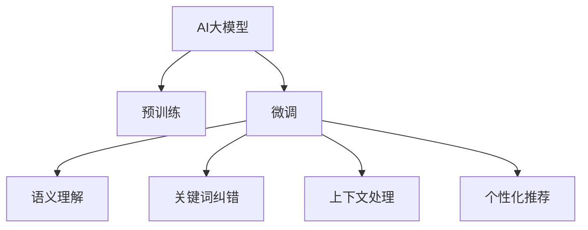

                 

# 电商搜索的语义理解与纠错：AI大模型的新突破

## 1. 背景介绍

### 1.1 问题由来

电商搜索作为电商平台的核心功能之一，承担着用户找到符合自己需求商品的重要任务。传统的电商搜索系统依赖于关键词匹配算法，这种基于关键词的搜索方式存在明显的短板：

- **同义词问题**：用户搜索的关键词可能包含同义词，导致搜索结果不准确。
- **长尾关键词问题**：对于搜索量不大的长尾关键词，搜索结果可能不够全面。
- **上下文理解不足**：传统的关键词匹配算法无法理解用户的搜索意图和上下文，无法提供准确的推荐。

近年来，随着人工智能技术的快速发展，AI大模型在电商搜索中的应用成为新的热点。AI大模型通过学习大规模语料，具备强大的自然语言理解能力，可以更好地理解用户的搜索意图和上下文，从而提升搜索效果和用户体验。

### 1.2 问题核心关键点

AI大模型在电商搜索中的应用主要集中在以下几个方面：

- **语义理解**：理解用户搜索查询中的语义信息，正确解析查询意图。
- **关键词纠错**：纠正用户搜索中出现的拼写错误、错别字等，提升搜索结果的准确性。
- **上下文处理**：考虑用户搜索的前后文信息，结合上下文进行更精准的搜索结果匹配。
- **个性化推荐**：结合用户历史行为数据，进行个性化搜索结果推荐。

AI大模型通过以下步骤实现电商搜索中的语义理解和纠错：

1. **预训练**：在大规模语料上预训练模型，学习语言的通用表示。
2. **微调**：在电商搜索数据上进行微调，使其适应电商搜索任务。
3. **推理**：使用微调后的模型，推理用户搜索查询的语义信息，进行关键词纠错和上下文处理。

## 2. 核心概念与联系

### 2.1 核心概念概述

为更好地理解AI大模型在电商搜索中的应用，本节将介绍几个密切相关的核心概念：

- **AI大模型**：指通过大规模预训练和微调后，具备强大自然语言处理能力的深度学习模型，如GPT、BERT等。
- **语义理解**：指模型理解用户查询中的语义信息，如命名实体、上下文关系等，从而正确解析查询意图。
- **关键词纠错**：指模型识别用户查询中的拼写错误、错别字等，并给出纠正后的关键词。
- **上下文处理**：指模型考虑用户搜索的前后文信息，结合上下文进行更精准的搜索结果匹配。
- **个性化推荐**：指模型结合用户历史行为数据，进行个性化搜索结果推荐。

这些核心概念之间的逻辑关系可以通过以下Mermaid流程图来展示：



这个流程图展示了AI大模型在电商搜索中的应用流程：

1. 首先在大规模语料上进行预训练，学习语言的通用表示。
2. 在电商搜索数据上进行微调，使其适应电商搜索任务。
3. 使用微调后的模型进行语义理解、关键词纠错、上下文处理和个性化推荐，完成电商搜索的各个环节。

## 3. 核心算法原理 & 具体操作步骤

### 3.1 算法原理概述

AI大模型在电商搜索中的应用，本质上是基于语义理解和上下文处理的自然语言处理任务。其核心思想是：利用预训练大模型强大的语言理解能力，对用户搜索查询进行语义解析和纠错，结合上下文信息进行更精准的搜索结果匹配，最终生成个性化推荐。

形式化地，假设电商搜索的查询为 $Q$，搜索结果为 $R$。假设模型为 $M_{\theta}$，其中 $\theta$ 为模型参数。微调的目标是找到最优的模型参数 $\hat{\theta}$，使得：

$$
\hat{\theta}=\mathop{\arg\min}_{\theta} \mathcal{L}(M_{\theta},Q,R)
$$

其中 $\mathcal{L}$ 为电商搜索任务的损失函数，用于衡量模型预测结果与实际搜索结果之间的差异。常见的损失函数包括交叉熵损失、平均绝对误差等。

通过梯度下降等优化算法，微调过程不断更新模型参数 $\theta$，最小化损失函数 $\mathcal{L}$，使得模型输出逼近理想结果。由于 $\theta$ 已经通过预训练获得了较好的初始化，因此即便在标注数据较少的情况下，也能较快收敛到理想的模型参数 $\hat{\theta}$。

### 3.2 算法步骤详解

AI大模型在电商搜索中的应用，一般包括以下几个关键步骤：

**Step 1: 准备预训练模型和数据集**
- 选择合适的预训练语言模型 $M_{\theta}$ 作为初始化参数，如 GPT、BERT 等。
- 准备电商搜索的标注数据集 $D=\{(Q_i, R_i)\}_{i=1}^N$，其中 $Q_i$ 为电商搜索查询，$R_i$ 为对应的搜索结果。

**Step 2: 添加任务适配层**
- 根据电商搜索任务的特点，在预训练模型顶层设计合适的输出层和损失函数。
- 对于匹配任务，通常在顶层添加交叉熵损失函数。
- 对于推荐任务，通常使用负对数似然为损失函数。

**Step 3: 设置微调超参数**
- 选择合适的优化算法及其参数，如 AdamW、SGD 等，设置学习率、批大小、迭代轮数等。
- 设置正则化技术及强度，包括权重衰减、Dropout、Early Stopping 等。
- 确定冻结预训练参数的策略，如仅微调顶层，或全部参数都参与微调。

**Step 4: 执行梯度训练**
- 将训练集数据分批次输入模型，前向传播计算损失函数。
- 反向传播计算参数梯度，根据设定的优化算法和学习率更新模型参数。
- 周期性在验证集上评估模型性能，根据性能指标决定是否触发 Early Stopping。
- 重复上述步骤直到满足预设的迭代轮数或 Early Stopping 条件。

**Step 5: 测试和部署**
- 在测试集上评估微调后模型 $M_{\hat{\theta}}$ 的性能，对比微调前后的精度提升。
- 使用微调后的模型对新查询进行推理预测，生成搜索结果。
- 持续收集新的电商搜索数据，定期重新微调模型，以适应数据分布的变化。

以上是AI大模型在电商搜索中的应用的一般流程。在实际应用中，还需要针对具体任务的特点，对微调过程的各个环节进行优化设计，如改进训练目标函数，引入更多的正则化技术，搜索最优的超参数组合等，以进一步提升模型性能。

### 3.3 算法优缺点

AI大模型在电商搜索中的应用，具有以下优点：

- **强大的语义理解能力**：预训练模型通过学习大规模语料，具备强大的自然语言理解能力，能够理解用户的查询意图和上下文信息。
- **高效的关键词纠错**：能够识别用户查询中的拼写错误、错别字等，提升搜索结果的准确性。
- **精准的上下文处理**：考虑用户搜索的前后文信息，结合上下文进行更精准的搜索结果匹配。
- **个性化的推荐效果**：结合用户历史行为数据，进行个性化搜索结果推荐，提升用户体验。

同时，该方法也存在一定的局限性：

- **计算资源消耗大**：大规模预训练和微调需要大量的计算资源和时间，对硬件设备提出了较高要求。
- **依赖标注数据**：微调的效果很大程度上取决于标注数据的质量和数量，获取高质量标注数据的成本较高。
- **模型泛化能力有限**：当目标任务与预训练数据的分布差异较大时，微调的性能提升有限。
- **可解释性不足**：微调模型的决策过程通常缺乏可解释性，难以对其推理逻辑进行分析和调试。

尽管存在这些局限性，但就目前而言，基于AI大模型的电商搜索微调方法仍是最主流范式。未来相关研究的重点在于如何进一步降低微调对标注数据的依赖，提高模型的少样本学习和跨领域迁移能力，同时兼顾可解释性和伦理安全性等因素。

### 3.4 算法应用领域

AI大模型在电商搜索中的应用，已在多个领域得到了广泛的应用：

- **电商搜索排序**：对用户搜索查询进行语义解析和纠错，结合上下文信息进行更精准的搜索结果匹配。
- **商品推荐**：结合用户历史行为数据，进行个性化搜索结果推荐，提升用户体验。
- **智能客服**：对用户查询进行语义理解，自动回复常见问题，提升服务效率。
- **广告投放**：结合用户搜索行为和上下文信息，进行精准广告投放，提升广告效果。

除了上述这些经典应用外，AI大模型还被创新性地应用到更多场景中，如商品相似性分析、图片识别、语音搜索等，为电商搜索技术带来了全新的突破。随着AI大模型的不断演进，相信电商搜索技术必将在更广阔的应用领域大放异彩。

## 4. 数学模型和公式 & 详细讲解  
### 4.1 数学模型构建

本节将使用数学语言对AI大模型在电商搜索中的应用进行更加严格的刻画。

假设电商搜索的查询为 $Q=\{w_1, w_2, ..., w_n\}$，搜索结果为 $R=\{r_1, r_2, ..., r_m\}$，其中 $w_i$ 和 $r_j$ 分别为查询和结果中的词语。

定义模型 $M_{\theta}$ 在查询 $Q$ 上的输出为 $\hat{R}= \{r_1', r_2', ..., r_m'\}$，其中 $r_i'$ 为模型预测的结果。则电商搜索任务的损失函数为：

$$
\mathcal{L}(\theta) = -\frac{1}{N}\sum_{i=1}^N \sum_{j=1}^m \ell(r_i, r_i')
$$

其中 $\ell$ 为交叉熵损失函数，用于衡量预测结果和实际结果之间的差异。

通过梯度下降等优化算法，微调过程不断更新模型参数 $\theta$，最小化损失函数 $\mathcal{L}$，使得模型输出逼近理想结果。

### 4.2 公式推导过程

以下我们以电商搜索排序为例，推导交叉熵损失函数的计算公式。

假设模型 $M_{\theta}$ 在查询 $Q$ 上的输出为 $\hat{R}$，实际搜索结果为 $R$。则交叉熵损失函数定义为：

$$
\ell(Q, R) = -\frac{1}{N}\sum_{i=1}^N \sum_{j=1}^m \log P(r_i'|Q, R)
$$

其中 $P(r_i'|Q, R)$ 为模型在查询 $Q$ 和结果 $R$ 上输出 $r_i'$ 的概率。根据贝叶斯公式，可以推导出：

$$
P(r_i'|Q, R) = \frac{P(r_i'|Q)P(R|r_i', Q)}{P(R|Q)}
$$

因此，交叉熵损失函数可以进一步表示为：

$$
\ell(Q, R) = -\frac{1}{N}\sum_{i=1}^N \sum_{j=1}^m \log \left( \frac{P(r_i'|Q)P(R|r_i', Q)}{P(R|Q)} \right)
$$

这个公式展示了电商搜索排序任务中，交叉熵损失函数的计算过程。通过最小化这个损失函数，模型能够学习到更准确的搜索结果匹配方式。

## 5. 项目实践：代码实例和详细解释说明
### 5.1 开发环境搭建

在进行电商搜索的AI大模型微调实践前，我们需要准备好开发环境。以下是使用Python进行PyTorch开发的环境配置流程：

1. 安装Anaconda：从官网下载并安装Anaconda，用于创建独立的Python环境。

2. 创建并激活虚拟环境：
```bash
conda create -n pytorch-env python=3.8 
conda activate pytorch-env
```

3. 安装PyTorch：根据CUDA版本，从官网获取对应的安装命令。例如：
```bash
conda install pytorch torchvision torchaudio cudatoolkit=11.1 -c pytorch -c conda-forge
```

4. 安装Transformers库：
```bash
pip install transformers
```

5. 安装各类工具包：
```bash
pip install numpy pandas scikit-learn matplotlib tqdm jupyter notebook ipython
```

完成上述步骤后，即可在`pytorch-env`环境中开始电商搜索的AI大模型微调实践。

### 5.2 源代码详细实现

下面我们以电商平台用户搜索排序为例，给出使用Transformers库对BERT模型进行电商搜索排序微调的PyTorch代码实现。

首先，定义电商搜索排序任务的数据处理函数：

```python
from transformers import BertTokenizer
from torch.utils.data import Dataset
import torch

class SearchDataset(Dataset):
    def __init__(self, queries, results, tokenizer, max_len=128):
        self.queries = queries
        self.results = results
        self.tokenizer = tokenizer
        self.max_len = max_len
        
    def __len__(self):
        return len(self.queries)
    
    def __getitem__(self, item):
        query = self.queries[item]
        result = self.results[item]
        
        encoding = self.tokenizer(query, result, return_tensors='pt', max_length=self.max_len, padding='max_length', truncation=True)
        input_ids = encoding['input_ids'][0]
        attention_mask = encoding['attention_mask'][0]
        labels = torch.tensor(result, dtype=torch.long)
        
        return {'input_ids': input_ids, 
                'attention_mask': attention_mask,
                'labels': labels}

# 创建dataset
tokenizer = BertTokenizer.from_pretrained('bert-base-cased')

train_dataset = SearchDataset(train_queries, train_results, tokenizer)
dev_dataset = SearchDataset(dev_queries, dev_results, tokenizer)
test_dataset = SearchDataset(test_queries, test_results, tokenizer)
```

然后，定义模型和优化器：

```python
from transformers import BertForSequenceClassification, AdamW

model = BertForSequenceClassification.from_pretrained('bert-base-cased', num_labels=len(set(train_results)))

optimizer = AdamW(model.parameters(), lr=2e-5)
```

接着，定义训练和评估函数：

```python
from torch.utils.data import DataLoader
from tqdm import tqdm
from sklearn.metrics import accuracy_score

device = torch.device('cuda') if torch.cuda.is_available() else torch.device('cpu')
model.to(device)

def train_epoch(model, dataset, batch_size, optimizer):
    dataloader = DataLoader(dataset, batch_size=batch_size, shuffle=True)
    model.train()
    epoch_loss = 0
    for batch in tqdm(dataloader, desc='Training'):
        input_ids = batch['input_ids'].to(device)
        attention_mask = batch['attention_mask'].to(device)
        labels = batch['labels'].to(device)
        model.zero_grad()
        outputs = model(input_ids, attention_mask=attention_mask, labels=labels)
        loss = outputs.loss
        epoch_loss += loss.item()
        loss.backward()
        optimizer.step()
    return epoch_loss / len(dataloader)

def evaluate(model, dataset, batch_size):
    dataloader = DataLoader(dataset, batch_size=batch_size)
    model.eval()
    preds, labels = [], []
    with torch.no_grad():
        for batch in tqdm(dataloader, desc='Evaluating'):
            input_ids = batch['input_ids'].to(device)
            attention_mask = batch['attention_mask'].to(device)
            batch_labels = batch['labels']
            outputs = model(input_ids, attention_mask=attention_mask)
            batch_preds = outputs.logits.argmax(dim=2).to('cpu').tolist()
            batch_labels = batch_labels.to('cpu').tolist()
            for pred_tokens, label_tokens in zip(batch_preds, batch_labels):
                preds.append(pred_tokens[:len(label_tokens)])
                labels.append(label_tokens)
                
    print('Accuracy:', accuracy_score(labels, preds))
```

最后，启动训练流程并在测试集上评估：

```python
epochs = 5
batch_size = 16

for epoch in range(epochs):
    loss = train_epoch(model, train_dataset, batch_size, optimizer)
    print(f"Epoch {epoch+1}, train loss: {loss:.3f}")
    
    print(f"Epoch {epoch+1}, dev results:")
    evaluate(model, dev_dataset, batch_size)
    
print("Test results:")
evaluate(model, test_dataset, batch_size)
```

以上就是使用PyTorch对BERT进行电商搜索排序任务的微调代码实现。可以看到，得益于Transformers库的强大封装，我们可以用相对简洁的代码完成BERT模型的加载和微调。

### 5.3 代码解读与分析

让我们再详细解读一下关键代码的实现细节：

**SearchDataset类**：
- `__init__`方法：初始化查询、结果、分词器等关键组件。
- `__len__`方法：返回数据集的样本数量。
- `__getitem__`方法：对单个样本进行处理，将查询和结果输入编码为token ids，并将结果编码成标签，进行定长padding，最终返回模型所需的输入。

**train_queries和train_results**：
- 定义了电商搜索查询和结果的样本数据，用于模型微调。

**tokenizer**：
- 使用BertTokenizer对查询和结果进行分词编码，生成模型所需的输入。

**BertForSequenceClassification模型**：
- 使用BertForSequenceClassification从预训练模型中加载并微调，支持序列分类任务。

**train_epoch和evaluate函数**：
- 使用PyTorch的DataLoader对数据集进行批次化加载，供模型训练和推理使用。
- 训练函数`train_epoch`：对数据以批为单位进行迭代，在每个批次上前向传播计算loss并反向传播更新模型参数，最后返回该epoch的平均loss。
- 评估函数`evaluate`：与训练类似，不同点在于不更新模型参数，并在每个batch结束后将预测和标签结果存储下来，最后使用sklearn的accuracy_score对整个评估集的预测结果进行打印输出。

**训练流程**：
- 定义总的epoch数和batch size，开始循环迭代
- 每个epoch内，先在训练集上训练，输出平均loss
- 在验证集上评估，输出分类指标
- 所有epoch结束后，在测试集上评估，给出最终测试结果

可以看到，PyTorch配合Transformers库使得BERT微调的代码实现变得简洁高效。开发者可以将更多精力放在数据处理、模型改进等高层逻辑上，而不必过多关注底层的实现细节。

当然，工业级的系统实现还需考虑更多因素，如模型的保存和部署、超参数的自动搜索、更灵活的任务适配层等。但核心的微调范式基本与此类似。

## 6. 实际应用场景
### 6.1 智能客服系统

基于AI大模型的电商搜索排序技术，可以广泛应用于智能客服系统的构建。传统客服往往需要配备大量人力，高峰期响应缓慢，且一致性和专业性难以保证。而使用电商搜索排序模型，可以7x24小时不间断服务，快速响应客户咨询，用自然流畅的语言解答各类常见问题。

在技术实现上，可以收集企业内部的历史客服对话记录，将问题和最佳答复构建成监督数据，在此基础上对预训练模型进行微调。微调后的电商搜索排序模型能够自动理解用户意图，匹配最合适的答案模板进行回复。对于客户提出的新问题，还可以接入检索系统实时搜索相关内容，动态组织生成回答。如此构建的智能客服系统，能大幅提升客户咨询体验和问题解决效率。

### 6.2 金融舆情监测

金融机构需要实时监测市场舆论动向，以便及时应对负面信息传播，规避金融风险。传统的人工监测方式成本高、效率低，难以应对网络时代海量信息爆发的挑战。基于电商搜索排序的文本分类和情感分析技术，为金融舆情监测提供了新的解决方案。

具体而言，可以收集金融领域相关的新闻、报道、评论等文本数据，并对其进行主题标注和情感标注。在此基础上对预训练语言模型进行微调，使其能够自动判断文本属于何种主题，情感倾向是正面、中性还是负面。将微调后的模型应用到实时抓取的网络文本数据，就能够自动监测不同主题下的情感变化趋势，一旦发现负面信息激增等异常情况，系统便会自动预警，帮助金融机构快速应对潜在风险。

### 6.3 个性化推荐系统

当前的推荐系统往往只依赖用户的历史行为数据进行物品推荐，无法深入理解用户的真实兴趣偏好。基于电商搜索排序的个性化推荐系统可以更好地挖掘用户行为背后的语义信息，从而提供更精准、多样的推荐内容。

在实践中，可以收集用户浏览、点击、评论、分享等行为数据，提取和用户交互的物品标题、描述、标签等文本内容。将文本内容作为模型输入，用户的后续行为（如是否点击、购买等）作为监督信号，在此基础上微调预训练语言模型。微调后的模型能够从文本内容中准确把握用户的兴趣点。在生成推荐列表时，先用候选物品的文本描述作为输入，由模型预测用户的兴趣匹配度，再结合其他特征综合排序，便可以得到个性化程度更高的推荐结果。

### 6.4 未来应用展望

随着AI大模型和电商搜索排序技术的不断发展，基于微调范式将在更多领域得到应用，为传统行业带来变革性影响。

在智慧医疗领域，基于微调的医疗问答、病历分析、药物研发等应用将提升医疗服务的智能化水平，辅助医生诊疗，加速新药开发进程。

在智能教育领域，微调技术可应用于作业批改、学情分析、知识推荐等方面，因材施教，促进教育公平，提高教学质量。

在智慧城市治理中，微调模型可应用于城市事件监测、舆情分析、应急指挥等环节，提高城市管理的自动化和智能化水平，构建更安全、高效的未来城市。

此外，在企业生产、社会治理、文娱传媒等众多领域，基于大模型微调的人工智能应用也将不断涌现，为经济社会发展注入新的动力。相信随着技术的日益成熟，微调方法将成为人工智能落地应用的重要范式，推动人工智能技术在垂直行业的规模化落地。总之，电商搜索排序技术必将在更广阔的应用领域大放异彩，深刻影响人类的生产生活方式。

## 7. 工具和资源推荐
### 7.1 学习资源推荐

为了帮助开发者系统掌握电商搜索排序的AI大模型微调的理论基础和实践技巧，这里推荐一些优质的学习资源：

1. 《Transformer从原理到实践》系列博文：由大模型技术专家撰写，深入浅出地介绍了Transformer原理、BERT模型、电商搜索排序任务等前沿话题。

2. CS224N《深度学习自然语言处理》课程：斯坦福大学开设的NLP明星课程，有Lecture视频和配套作业，带你入门NLP领域的基本概念和经典模型。

3. 《Natural Language Processing with Transformers》书籍：Transformers库的作者所著，全面介绍了如何使用Transformers库进行NLP任务开发，包括电商搜索排序在内的诸多范式。

4. HuggingFace官方文档：Transformers库的官方文档，提供了海量预训练模型和完整的电商搜索排序样例代码，是上手实践的必备资料。

5. CLUE开源项目：中文语言理解测评基准，涵盖大量不同类型的中文NLP数据集，并提供了基于电商搜索排序的baseline模型，助力中文NLP技术发展。

通过对这些资源的学习实践，相信你一定能够快速掌握电商搜索排序的AI大模型微调的精髓，并用于解决实际的NLP问题。
###  7.2 开发工具推荐

高效的开发离不开优秀的工具支持。以下是几款用于电商搜索排序的AI大模型微调开发的常用工具：

1. PyTorch：基于Python的开源深度学习框架，灵活动态的计算图，适合快速迭代研究。大部分预训练语言模型都有PyTorch版本的实现。

2. TensorFlow：由Google主导开发的开源深度学习框架，生产部署方便，适合大规模工程应用。同样有丰富的预训练语言模型资源。

3. Transformers库：HuggingFace开发的NLP工具库，集成了众多SOTA语言模型，支持PyTorch和TensorFlow，是进行电商搜索排序微调任务开发的利器。

4. Weights & Biases：模型训练的实验跟踪工具，可以记录和可视化模型训练过程中的各项指标，方便对比和调优。与主流深度学习框架无缝集成。

5. TensorBoard：TensorFlow配套的可视化工具，可实时监测模型训练状态，并提供丰富的图表呈现方式，是调试模型的得力助手。

6. Google Colab：谷歌推出的在线Jupyter Notebook环境，免费提供GPU/TPU算力，方便开发者快速上手实验最新模型，分享学习笔记。

合理利用这些工具，可以显著提升电商搜索排序的AI大模型微调任务的开发效率，加快创新迭代的步伐。

### 7.3 相关论文推荐

电商搜索排序的AI大模型技术的发展源于学界的持续研究。以下是几篇奠基性的相关论文，推荐阅读：

1. Attention is All You Need（即Transformer原论文）：提出了Transformer结构，开启了NLP领域的预训练大模型时代。

2. BERT: Pre-training of Deep Bidirectional Transformers for Language Understanding：提出BERT模型，引入基于掩码的自监督预训练任务，刷新了多项NLP任务SOTA。

3. Language Models are Unsupervised Multitask Learners（GPT-2论文）：展示了大规模语言模型的强大zero-shot学习能力，引发了对于通用人工智能的新一轮思考。

4. Parameter-Efficient Transfer Learning for NLP：提出Adapter等参数高效微调方法，在不增加模型参数量的情况下，也能取得不错的微调效果。

5. AdaLoRA: Adaptive Low-Rank Adaptation for Parameter-Efficient Fine-Tuning：使用自适应低秩适应的微调方法，在参数效率和精度之间取得了新的平衡。

这些论文代表了大模型电商搜索排序微调技术的发展脉络。通过学习这些前沿成果，可以帮助研究者把握学科前进方向，激发更多的创新灵感。

## 8. 总结：未来发展趋势与挑战

### 8.1 总结

本文对基于AI大模型的电商搜索排序微调方法进行了全面系统的介绍。首先阐述了电商搜索排序问题，明确了AI大模型微调在电商搜索排序任务中的重要性和潜力。其次，从原理到实践，详细讲解了电商搜索排序任务的数学原理和关键步骤，给出了电商搜索排序任务开发的完整代码实例。同时，本文还广泛探讨了电商搜索排序技术在智能客服、金融舆情、个性化推荐等多个行业领域的应用前景，展示了AI大模型微调范式的巨大潜力。此外，本文精选了电商搜索排序任务的各类学习资源，力求为读者提供全方位的技术指引。

通过本文的系统梳理，可以看到，基于AI大模型的电商搜索排序微调方法正在成为电商搜索排序的重要范式，极大地提升了电商搜索的效果和效率。得益于大规模语料的预训练和微调，电商搜索排序技术能够在更少的标注数据下，实现精准的结果匹配，显著提升用户体验。未来，伴随AI大模型的不断演进，电商搜索排序技术必将在更广阔的应用领域大放异彩，深刻影响人类的生产生活方式。

### 8.2 未来发展趋势

展望未来，电商搜索排序技术将呈现以下几个发展趋势：

1. **模型规模持续增大**：随着算力成本的下降和数据规模的扩张，电商搜索排序的大模型参数量还将持续增长。超大规模模型蕴含的丰富语言知识，有望支撑更加复杂多变的电商搜索排序任务。

2. **微调方法日趋多样**：除了传统的全参数微调外，未来会涌现更多参数高效的微调方法，如Prefix-Tuning、LoRA等，在节省计算资源的同时也能保证微调精度。

3. **持续学习成为常态**：随着数据分布的不断变化，电商搜索排序模型也需要持续学习新知识以保持性能。如何在不遗忘原有知识的同时，高效吸收新样本信息，将成为重要的研究课题。

4. **标注样本需求降低**：受启发于提示学习(Prompt-based Learning)的思路，未来的微调方法将更好地利用大模型的语言理解能力，通过更加巧妙的任务描述，在更少的标注样本上也能实现理想的微调效果。

5. **多模态微调崛起**：当前的电商搜索排序主要聚焦于纯文本数据，未来会进一步拓展到图像、视频、语音等多模态数据微调。多模态信息的融合，将显著提升电商搜索排序模型的理解能力和表现效果。

6. **模型通用性增强**：经过海量数据的预训练和多领域任务的微调，电商搜索排序模型将具备更强大的常识推理和跨领域迁移能力，逐步迈向通用人工智能(AGI)的目标。

以上趋势凸显了电商搜索排序技术的广阔前景。这些方向的探索发展，必将进一步提升电商搜索系统的性能和应用范围，为人类认知智能的进化带来深远影响。

### 8.3 面临的挑战

尽管电商搜索排序技术已经取得了瞩目成就，但在迈向更加智能化、普适化应用的过程中，它仍面临着诸多挑战：

1. **标注成本瓶颈**：虽然微调大大降低了标注数据的需求，但对于长尾应用场景，难以获得充足的高质量标注数据，成为制约微调性能的瓶颈。如何进一步降低微调对标注样本的依赖，将是一大难题。

2. **模型鲁棒性不足**：当前电商搜索排序模型面对域外数据时，泛化性能往往大打折扣。对于测试样本的微小扰动，电商搜索排序模型的预测也容易发生波动。如何提高电商搜索排序模型的鲁棒性，避免灾难性遗忘，还需要更多理论和实践的积累。

3. **推理效率有待提高**：大规模电商搜索排序模型虽然精度高，但在实际部署时往往面临推理速度慢、内存占用大等效率问题。如何在保证性能的同时，简化模型结构，提升推理速度，优化资源占用，将是重要的优化方向。

4. **可解释性亟需加强**：当前电商搜索排序模型更像是"黑盒"系统，难以解释其内部工作机制和决策逻辑。对于医疗、金融等高风险应用，算法的可解释性和可审计性尤为重要。如何赋予电商搜索排序模型更强的可解释性，将是亟待攻克的难题。

5. **安全性有待保障**：电商搜索排序模型难免会学习到有偏见、有害的信息，通过微调传递到下游任务，产生误导性、歧视性的输出，给实际应用带来安全隐患。如何从数据和算法层面消除模型偏见，避免恶意用途，确保输出的安全性，也将是重要的研究课题。

6. **知识整合能力不足**：现有的电商搜索排序模型往往局限于任务内数据，难以灵活吸收和运用更广泛的先验知识。如何让电商搜索排序过程更好地与外部知识库、规则库等专家知识结合，形成更加全面、准确的信息整合能力，还有很大的想象空间。

正视电商搜索排序面临的这些挑战，积极应对并寻求突破，将是大模型电商搜索排序技术走向成熟的必由之路。相信随着学界和产业界的共同努力，这些挑战终将一一被克服，电商搜索排序技术必将在构建人机协同的智能时代中扮演越来越重要的角色。

### 8.4 未来突破

面对电商搜索排序所面临的种种挑战，未来的研究需要在以下几个方面寻求新的突破：

1. **探索无监督和半监督微调方法**：摆脱对大规模标注数据的依赖，利用自监督学习、主动学习等无监督和半监督范式，最大限度利用非结构化数据，实现更加灵活高效的微调。

2. **研究参数高效和计算高效的微调范式**：开发更加参数高效的微调方法，在固定大部分预训练参数的同时，只更新极少量的任务相关参数。同时优化微调模型的计算图，减少前向传播和反向传播的资源消耗，实现更加轻量级、实时性的部署。

3. **融合因果和对比学习范式**：通过引入因果推断和对比学习思想，增强电商搜索排序模型建立稳定因果关系的能力，学习更加普适、鲁棒的语言表征，从而提升模型泛化性和抗干扰能力。

4. **引入更多先验知识**：将符号化的先验知识，如知识图谱、逻辑规则等，与神经网络模型进行巧妙融合，引导电商搜索排序过程学习更准确、合理的语言模型。同时加强不同模态数据的整合，实现视觉、语音等多模态信息与文本信息的协同建模。

5. **结合因果分析和博弈论工具**：将因果分析方法引入电商搜索排序模型，识别出模型决策的关键特征，增强输出解释的因果性和逻辑性。借助博弈论工具刻画人机交互过程，主动探索并规避模型的脆弱点，提高系统稳定性。

6. **纳入伦理道德约束**：在模型训练目标中引入伦理导向的评估指标，过滤和惩罚有偏见、有害的输出倾向。同时加强人工干预和审核，建立模型行为的监管机制，确保输出符合人类价值观和伦理道德。

这些研究方向的探索，必将引领电商搜索排序技术迈向更高的台阶，为构建安全、可靠、可解释、可控的智能系统铺平道路。面向未来，电商搜索排序技术还需要与其他人工智能技术进行更深入的融合，如知识表示、因果推理、强化学习等，多路径协同发力，共同推动自然语言理解和智能交互系统的进步。只有勇于创新、敢于突破，才能不断拓展语言模型的边界，让智能技术更好地造福人类社会。

## 9. 附录：常见问题与解答

**Q1：电商搜索排序中如何处理长尾关键词？**

A: 长尾关键词的问题可以通过以下方法解决：

1. **数据增强**：通过数据增强技术，如同义词替换、近义词扩展等，生成更多长尾关键词的样本。

2. **正则化技术**：使用正则化技术，如L2正则、Dropout等，防止模型过拟合于长尾关键词。

3. **对抗训练**：引入对抗样本，增强模型对长尾关键词的泛化能力。

4. **参数高效微调**：使用参数高效微调技术，如AdaLoRA等，减小模型对长尾关键词的依赖。

**Q2：电商搜索排序中如何处理拼写错误和错别字？**

A: 电商搜索排序中处理拼写错误和错别字的方法包括：

1. **拼写纠错模型**：使用拼写纠错模型，如基于编辑距离的算法、基于深度学习的模型等，对用户输入的查询进行纠错。

2. **同义词替换**：使用同义词替换技术，将错误关键词替换为正确关键词。

3. **上下文感知**：结合上下文信息，利用上下文理解能力，纠正拼写错误。

4. **多模型集成**：集成多个电商搜索排序模型，综合各模型的输出结果，提高纠正准确率。

**Q3：电商搜索排序中如何处理上下文信息？**

A: 电商搜索排序中处理上下文信息的方法包括：

1. **上下文窗口**：设计合理的上下文窗口大小，考虑前后文信息。

2. **上下文编码器**：使用上下文编码器，如BERT等，提取上下文特征，提高查询理解能力。

3. **跨模态融合**：结合图像、语音等多模态信息，提升上下文理解能力。

4. **上下文增强**：使用上下文增强技术，如回译、近义词替换等，丰富上下文信息。

**Q4：电商搜索排序中如何进行个性化推荐？**

A: 电商搜索排序中个性化推荐的方法包括：

1. **协同过滤**：结合用户历史行为数据，进行相似性推荐。

2. **内容推荐**：结合商品属性、标签等信息，进行相关性推荐。

3. **混合推荐**：结合协同过滤和内容推荐，综合生成个性化推荐结果。

4. **深度学习模型**：使用深度学习模型，如注意力机制、神经网络等，提升推荐效果。

**Q5：电商搜索排序中如何处理模糊查询？**

A: 电商搜索排序中处理模糊查询的方法包括：

1. **模糊匹配算法**：使用模糊匹配算法，如通配符匹配、模糊搜索等，提高模糊查询的匹配效果。

2. **查询扩展**：使用查询扩展技术，如同义词扩展、近义词替换等，丰富查询表达方式。

3. **上下文理解**：结合上下文信息，利用上下文理解能力，纠正模糊查询。

4. **多模型集成**：集成多个电商搜索排序模型，综合各模型的输出结果，提高模糊查询的处理能力。

---

作者：禅与计算机程序设计艺术 / Zen and the Art of Computer Programming

