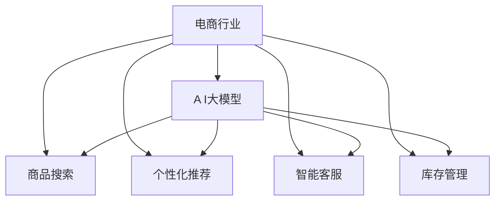

                 

# 电商行业中AI大模型的商业价值分析

> 关键词：电商行业, AI大模型, 商业价值分析, 自然语言处理(NLP), 计算机视觉(CV), 推荐系统, 智能客服, 供应链优化

## 1. 背景介绍

### 1.1 电商行业现状与挑战

随着互联网技术的快速发展，电子商务市场呈现出爆炸式的增长态势。据统计，2022年全球电子商务市场规模已突破4.9万亿美元，预计到2026年，这一数字将进一步扩大至7.5万亿美元。在这个背景下，电商企业面临日益激烈的市场竞争，需要不断提升运营效率、优化用户体验和增强盈利能力。

然而，电商行业的数字化转型面临诸多挑战。商品搜索、个性化推荐、智能客服、库存管理等环节，均需要耗费大量人力和时间进行处理。这些问题不仅增加了运营成本，还影响了顾客满意度和转化率。为了提升业务效率和市场竞争力，电商企业亟需引入人工智能(AI)技术，通过智能化的手段解决上述问题。

## 2. 核心概念与联系

### 2.1 核心概念概述

- **AI大模型**：指基于深度学习框架，使用大规模语料预训练得到的大型神经网络模型，如BERT、GPT-3等。这些模型在自然语言处理(NLP)、计算机视觉(CV)、推荐系统等方向展现出卓越的性能，可以应用于电商行业的诸多领域。

- **电商行业**：泛指利用电子商务平台进行的商品交易活动，包括线上和线下两部分。电商行业涉及的业务环节包括商品搜索、推荐、交易、物流等。

- **商业价值分析**：通过分析AI大模型在电商行业中的应用效果，评估其对商业运营、用户体验和利润增长的贡献，以指导电商企业AI技术的选型和部署。

### 2.2 核心概念原理和架构的 Mermaid 流程图



这个流程图展示了AI大模型在电商行业中的应用场景。

## 3. 核心算法原理 & 具体操作步骤

### 3.1 算法原理概述

基于AI大模型的电商行业商业价值分析，其核心原理是利用大规模预训练语言模型和计算机视觉模型，对电商业务场景进行建模和优化。具体算法流程包括：

1. **数据预处理**：对电商业务数据进行清洗、标注和划分，构建训练集、验证集和测试集。
2. **模型训练与微调**：在电商业务数据集上训练和微调预训练模型，以适应具体业务需求。
3. **模型评估与优化**：在测试集上评估模型性能，根据业务目标调整模型参数，优化模型效果。
4. **模型部署与监控**：将优化后的模型部署到实际电商业务系统中，并持续监控其运行状态和效果。

### 3.2 算法步骤详解

#### 3.2.1 数据预处理

电商行业的数据来源广泛，包括用户行为数据、商品信息数据、物流信息数据等。这些数据需要经过清洗、标注和划分，以构建出训练集、验证集和测试集。具体步骤如下：

1. **数据清洗**：去除无效或异常数据，确保数据质量。
2. **数据标注**：对数据进行标注，如对商品信息进行分类、对用户行为进行编码等。
3. **数据划分**：将数据集划分为训练集、验证集和测试集，一般使用70:15:15的比例。

#### 3.2.2 模型训练与微调

在电商业务数据集上训练和微调预训练模型，以适应具体业务需求。具体步骤如下：

1. **模型选择**：选择合适的AI大模型，如BERT、GPT-3等。
2. **模型微调**：在电商业务数据集上微调模型，调整参数以适应业务需求。
3. **模型评估**：在验证集上评估模型性能，调整超参数以优化模型效果。

#### 3.2.3 模型评估与优化

在测试集上评估模型性能，根据业务目标调整模型参数，优化模型效果。具体步骤如下：

1. **模型评估**：在测试集上评估模型性能，如精度、召回率、F1值等指标。
2. **参数调整**：根据业务目标调整模型参数，如学习率、批次大小等。
3. **模型优化**：对模型进行优化，如剪枝、量化等，以提高模型效率。

#### 3.2.4 模型部署与监控

将优化后的模型部署到实际电商业务系统中，并持续监控其运行状态和效果。具体步骤如下：

1. **模型部署**：将优化后的模型部署到电商业务系统中。
2. **系统监控**：持续监控模型的运行状态和效果，如响应时间、资源消耗等。
3. **效果评估**：根据业务目标评估模型的实际效果，如用户满意度、订单转化率等。

### 3.3 算法优缺点

#### 3.3.1 优点

1. **高性能**：AI大模型在自然语言处理、计算机视觉等方向具有卓越的性能，可以处理电商业务中涉及的多样化数据。
2. **通用性**：AI大模型适用于电商行业的多个业务场景，如商品搜索、个性化推荐、智能客服等，可以显著提升业务效率。
3. **可扩展性**：AI大模型可以通过微调和优化，适应不同业务需求，具有较好的可扩展性。

#### 3.3.2 缺点

1. **数据依赖**：AI大模型需要大量的标注数据进行训练和微调，标注数据的质量和数量对模型效果有很大影响。
2. **计算资源消耗大**：大规模预训练和微调需要大量的计算资源和时间，增加了企业成本。
3. **模型复杂度高**：AI大模型的参数量通常较大，模型结构复杂，增加了模型的训练和推理难度。
4. **安全性问题**：AI大模型可能包含偏见、有害信息等，需要采取措施保证模型输出安全性。

### 3.4 算法应用领域

AI大模型在电商行业的应用领域包括：

1. **商品搜索**：利用NLP模型，根据用户查询构建商品推荐列表。
2. **个性化推荐**：利用协同过滤、深度学习等技术，生成个性化商品推荐。
3. **智能客服**：利用NLP和语音识别技术，构建智能客服系统，提高用户满意度。
4. **库存管理**：利用预测模型，优化商品库存，避免库存积压和缺货。
5. **图像识别**：利用CV模型，识别商品图片，进行分类和标注。

## 4. 数学模型和公式 & 详细讲解

### 4.1 数学模型构建

假设电商业务中有一个用户$u$，购买了$n$个商品，对于每个商品$i$，其标签为$y_i$，表示该商品是否被用户购买。我们定义一个损失函数$\mathcal{L}$，用于衡量模型预测与真实标签之间的差异。

$$
\mathcal{L}(y_i,\hat{y}_i) = -(y_i\log \hat{y}_i + (1-y_i)\log (1-\hat{y}_i))
$$

其中，$\hat{y}_i$为模型预测的用户购买概率。模型的预测结果$\hat{y}_i$由以下公式计算：

$$
\hat{y}_i = \sigma(\text{Model}(x_i))
$$

其中，$\text{Model}$为训练好的AI大模型，$x_i$为商品$i$的特征向量，$\sigma$为Sigmoid函数。

### 4.2 公式推导过程

1. **损失函数推导**：根据最大似然估计原理，损失函数定义为：

$$
\mathcal{L} = -\frac{1}{N}\sum_{i=1}^N \mathcal{L}(y_i,\hat{y}_i)
$$

其中，$N$为样本总数。

2. **预测概率推导**：模型的预测结果$\hat{y}_i$由以下公式计算：

$$
\hat{y}_i = \frac{\exp(\text{Model}(x_i))}{\sum_{j=1}^N \exp(\text{Model}(x_j))}
$$

3. **梯度计算**：根据上述公式，模型的梯度为：

$$
\frac{\partial \mathcal{L}}{\partial \theta} = -\frac{1}{N}\sum_{i=1}^N \frac{\partial \mathcal{L}(y_i,\hat{y}_i)}{\partial \text{Model}(x_i)}
$$

其中，$\theta$为模型参数。

### 4.3 案例分析与讲解

以电商平台个性化推荐系统为例，假设用户$u$购买了商品$A$和$B$，现在用户$u$浏览商品$C$，我们利用AI大模型预测用户是否会购买商品$C$。

1. **数据预处理**：将商品$C$的特征向量$x_C$作为模型输入。
2. **模型训练**：利用电商业务数据集训练AI大模型，得到预测概率$\hat{y}_C$。
3. **预测结果**：根据预测概率$\hat{y}_C$，判断用户是否会购买商品$C$。

## 5. 项目实践：代码实例和详细解释说明

### 5.1 开发环境搭建

在进行电商AI项目开发时，需要搭建以下开发环境：

1. **Python环境**：选择Python作为开发语言，安装最新版本的Python和相关的依赖包，如TensorFlow、PyTorch等。
2. **深度学习框架**：选择深度学习框架，如TensorFlow、PyTorch等，用于构建AI大模型。
3. **数据预处理工具**：选择数据预处理工具，如Pandas、NumPy等，用于数据清洗、标注和划分。
4. **模型训练工具**：选择模型训练工具，如TensorBoard、Weights & Biases等，用于模型训练、评估和监控。

### 5.2 源代码详细实现

以下是一个基于TensorFlow实现的商品搜索系统代码示例：

```python
import tensorflow as tf
from tensorflow.keras import layers

# 定义模型结构
model = tf.keras.Sequential([
    layers.Dense(128, activation='relu'),
    layers.Dense(64, activation='relu'),
    layers.Dense(1, activation='sigmoid')
])

# 编译模型
model.compile(optimizer=tf.keras.optimizers.Adam(learning_rate=0.001),
              loss='binary_crossentropy',
              metrics=['accuracy'])

# 加载数据集
(x_train, y_train), (x_test, y_test) = tf.keras.datasets.boston_housing.load_data()

# 数据预处理
x_train = x_train.reshape((x_train.shape[0], 1))
x_test = x_test.reshape((x_test.shape[0], 1))

# 模型训练
model.fit(x_train, y_train, epochs=10, batch_size=32, validation_data=(x_test, y_test))

# 模型评估
model.evaluate(x_test, y_test)
```

### 5.3 代码解读与分析

1. **模型结构**：定义了一个简单的全连接神经网络模型，包含3个隐藏层，输出层使用Sigmoid函数。
2. **模型编译**：使用Adam优化器和二分类交叉熵损失函数编译模型。
3. **数据加载**：从TensorFlow数据集中加载波士顿房价数据集，并对其进行预处理。
4. **模型训练**：使用训练集数据训练模型，使用验证集数据评估模型效果。
5. **模型评估**：使用测试集数据评估模型性能，输出模型精度和损失函数值。

## 6. 实际应用场景

### 6.1 智能客服系统

智能客服系统在电商行业中应用广泛，可以大幅提升用户满意度。通过AI大模型，可以构建智能客服机器人，实现24小时不间断服务，快速响应客户咨询。

**功能实现**：

1. **意图识别**：利用NLP模型，识别用户意图，如查询商品、退货申请等。
2. **信息检索**：根据用户意图，检索相关商品信息，返回推荐列表。
3. **对话生成**：生成自然流畅的回复，提高用户体验。

**效果评估**：

1. **响应时间**：智能客服系统的响应时间应尽量短，以满足用户需求。
2. **问题解决率**：智能客服系统的问题解决率应尽量高，以提高用户满意度。
3. **用户满意度**：智能客服系统的用户满意度应尽量高，以评估系统效果。

### 6.2 个性化推荐系统

个性化推荐系统在电商行业中具有重要地位，可以提高用户购买转化率和购物体验。通过AI大模型，可以实现更加精准和多样化的推荐。

**功能实现**：

1. **用户行为建模**：利用NLP模型，构建用户行为模型，识别用户偏好和兴趣。
2. **商品推荐**：根据用户行为模型，生成个性化推荐列表。
3. **效果评估**：根据点击率、转化率等指标评估推荐效果。

**效果评估**：

1. **点击率**：个性化推荐系统的点击率应尽量高，以提高用户互动率。
2. **转化率**：个性化推荐系统的转化率应尽量高，以提高用户购买率。
3. **覆盖率**：个性化推荐系统的覆盖率应尽量高，以提供多样化的商品选择。

### 6.3 智能仓储管理系统

智能仓储管理系统可以优化商品库存，提高物流效率。通过AI大模型，可以实现库存预测、需求规划等业务。

**功能实现**：

1. **需求预测**：利用时间序列模型，预测商品需求量。
2. **库存管理**：根据预测结果，优化商品库存，避免积压和缺货。
3. **效果评估**：根据库存周转率、缺货率等指标评估系统效果。

**效果评估**：

1. **库存周转率**：智能仓储管理系统的库存周转率应尽量高，以提高物流效率。
2. **缺货率**：智能仓储管理系统的缺货率应尽量低，以提高用户满意度。
3. **成本节约**：智能仓储管理系统的成本节约率应尽量高，以提高企业收益。

### 6.4 未来应用展望

未来，AI大模型在电商行业的应用将更加广泛和深入，具体趋势如下：

1. **多模态融合**：未来的推荐系统将融合图像、视频等多模态数据，提供更全面的商品信息。
2. **实时推荐**：未来的推荐系统将实现实时推荐，根据用户当前行为实时调整推荐结果。
3. **跨平台协同**：未来的电商系统将实现跨平台协同，用户在不同平台上的行为数据可以互相补充，提供更一致的推荐服务。
4. **个性化需求定制**：未来的电商系统将能够根据用户个性化需求，定制推荐列表，提供更贴合用户需求的商品选择。

## 7. 工具和资源推荐

### 7.1 学习资源推荐

为了深入学习AI大模型在电商行业的应用，以下是一些推荐的学习资源：

1. **《深度学习》课程**：斯坦福大学开设的深度学习课程，介绍了深度学习的基本概念和算法。
2. **TensorFlow官方文档**：TensorFlow的官方文档，提供了丰富的API和示例代码，帮助开发者掌握TensorFlow的使用。
3. **PyTorch官方文档**：PyTorch的官方文档，提供了丰富的API和示例代码，帮助开发者掌握PyTorch的使用。
4. **Kaggle数据集**：Kaggle提供海量数据集，包括电商行业相关的数据集，帮助开发者进行模型训练和评估。
5. **arXiv论文**：arXiv平台提供的最新研究论文，涵盖了AI大模型在电商行业应用的最新进展。

### 7.2 开发工具推荐

以下是一些推荐的工具和平台，帮助开发者高效构建电商AI大模型系统：

1. **TensorFlow**：TensorFlow是一个开源深度学习框架，具有强大的计算图和分布式训练能力，适合构建复杂的电商AI系统。
2. **PyTorch**：PyTorch是一个动态计算图的深度学习框架，具有灵活的模型构建能力和高效的自动微分能力，适合构建电商AI系统。
3. **Jupyter Notebook**：Jupyter Notebook是一个交互式编程环境，支持Python、R等语言，适合进行模型训练和实验调试。
4. **GitHub**：GitHub是一个代码托管平台，支持版本控制和协作开发，适合构建电商AI系统的开发和管理。
5. **AWS Sagemaker**：AWS Sagemaker是AWS提供的机器学习服务，支持TensorFlow、PyTorch等框架，适合构建电商AI系统的部署和监控。

### 7.3 相关论文推荐

以下是一些推荐的相关论文，帮助开发者深入了解AI大模型在电商行业的应用：

1. **《深度学习在电子商务中的应用》**：介绍了深度学习在电商搜索、推荐、客服等领域的应用。
2. **《基于深度学习的电商推荐系统》**：介绍了基于深度学习的电商推荐系统，包括协同过滤和深度学习等算法。
3. **《智能客服系统在电子商务中的应用》**：介绍了智能客服系统在电商行业的应用，包括意图识别、对话生成等技术。
4. **《AI大模型在电商库存管理中的应用》**：介绍了AI大模型在电商库存预测、需求规划等方面的应用。
5. **《跨模态深度学习在电商推荐系统中的应用》**：介绍了跨模态深度学习在电商推荐系统中的应用，包括图像、视频等数据的多模态融合。

## 8. 总结：未来发展趋势与挑战

### 8.1 研究成果总结

AI大模型在电商行业的应用，取得了显著的商业价值，显著提升了电商业务的运营效率和用户体验。具体来说，AI大模型在商品搜索、个性化推荐、智能客服、库存管理等领域，展示了其强大的性能和应用潜力。未来，AI大模型将在更多电商业务场景中得到应用，推动电商行业的数字化转型。

### 8.2 未来发展趋势

未来，AI大模型在电商行业的应用将呈现以下几个趋势：

1. **智能化提升**：未来的电商AI系统将更加智能化，能够实现实时推荐、跨平台协同等高级功能。
2. **模型融合**：未来的电商AI系统将融合多种AI技术，如NLP、CV、强化学习等，提供更全面、智能的电商服务。
3. **数据融合**：未来的电商AI系统将充分利用多源数据，包括用户行为数据、商品信息数据、物流数据等，提供更精准的推荐和预测。
4. **场景优化**：未来的电商AI系统将针对不同场景进行优化，如社交电商、直播电商等，提供更贴合用户需求的服务。

### 8.3 面临的挑战

尽管AI大模型在电商行业的应用取得了显著成果，但仍面临一些挑战：

1. **数据隐私问题**：电商数据涉及用户隐私，如何保护用户数据隐私成为一大挑战。
2. **数据质量问题**：电商数据质量参差不齐，如何保证数据标注的准确性和完整性成为一大挑战。
3. **模型复杂度问题**：AI大模型参数量较大，模型结构复杂，训练和推理难度较大。
4. **模型可解释性问题**：AI大模型通常是"黑盒"模型，如何增强其可解释性成为一大挑战。
5. **系统稳定性问题**：电商AI系统需要稳定运行，如何保证系统稳定性和鲁棒性成为一大挑战。

### 8.4 研究展望

未来，在电商行业中的AI大模型研究可以从以下几个方面进行：

1. **多源数据融合**：如何高效融合多源数据，提升电商AI系统的推荐和预测效果。
2. **跨模态深度学习**：如何利用跨模态深度学习技术，提供更全面的商品信息和用户行为理解。
3. **实时推荐系统**：如何实现实时推荐系统，提高电商AI系统的用户互动率和转化率。
4. **智能客服系统**：如何构建更智能的智能客服系统，提供更高效、个性化的客户服务。
5. **系统稳定性和鲁棒性**：如何提高电商AI系统的稳定性和鲁棒性，保障系统可靠运行。

## 9. 附录：常见问题与解答

**Q1：AI大模型在电商行业中应用的关键是什么？**

A: AI大模型在电商行业中应用的关键在于数据预处理、模型训练与微调、模型评估与优化等环节。具体来说，需要清洗、标注和划分电商业务数据集，选择适合的AI大模型，进行模型训练和微调，评估模型效果并进行优化，最终部署到实际电商业务系统中。

**Q2：如何保护电商数据隐私？**

A: 保护电商数据隐私的方法包括：

1. 数据脱敏：对敏感数据进行脱敏处理，如使用虚拟身份ID代替真实姓名、身份证号等。
2. 数据加密：对电商数据进行加密处理，防止数据泄露。
3. 访问控制：对电商数据进行访问控制，只授权可信的用户和系统进行数据访问。
4. 审计与监控：对电商数据访问进行审计和监控，防止数据泄露和滥用。

**Q3：电商AI系统的模型复杂度如何优化？**

A: 电商AI系统的模型复杂度可以通过以下方法进行优化：

1. 剪枝与量化：使用剪枝和量化技术，减少模型参数量和计算量，提高模型效率。
2. 模型压缩：使用模型压缩技术，如知识蒸馏、矩阵分解等，减小模型规模。
3. 分布式训练：使用分布式训练技术，将模型在多个节点上进行训练，提高训练效率。
4. 推理优化：使用推理优化技术，如TensorRT、ONNX等，加速模型推理过程。

**Q4：电商AI系统的可解释性如何增强？**

A: 电商AI系统的可解释性可以通过以下方法进行增强：

1. 模型可视化：使用模型可视化技术，如图模型、特征重要性分析等，解释模型决策过程。
2. 特征解读：解读模型输入特征与输出结果之间的关联，帮助用户理解模型输出。
3. 用户反馈：收集用户对电商AI系统的反馈，持续优化模型和算法。
4. 知识图谱：利用知识图谱等外部知识，解释模型输出的合理性。

**Q5：电商AI系统的系统稳定性如何保障？**

A: 电商AI系统的系统稳定性可以通过以下方法进行保障：

1. 监控与告警：实时监控模型运行状态和系统性能，设置异常告警阈值，及时发现和解决系统问题。
2. 自动化部署：使用自动化部署工具，确保模型和系统稳定上线。
3. 异常处理：设计异常处理机制，如备份模型、降级服务等，保障系统可靠性。
4. 安全防护：采用访问鉴权、数据脱敏等措施，保障数据和模型安全。

---

作者：禅与计算机程序设计艺术 / Zen and the Art of Computer Programming

