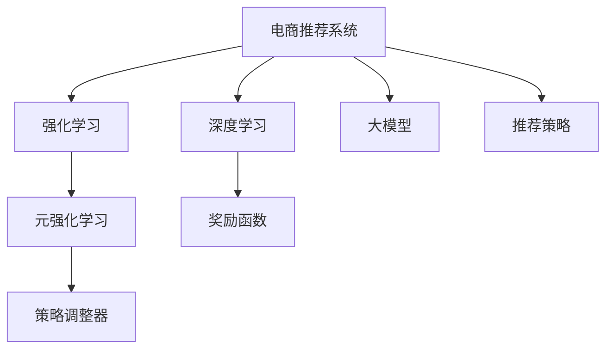

                 

# 电商行业中的元强化学习：大模型的实践与挑战

> 关键词：电商推荐系统,元强化学习,大模型,强化学习,深度学习,强化学习技术,电商行业

## 1. 背景介绍

### 1.1 问题由来

随着电商行业的迅速发展，用户个性化需求和市场竞争日趋激烈，如何精准推荐商品给用户，成为电商运营的重要课题。传统的推荐系统以协同过滤、基于内容的推荐、深度学习等方法为主，但这些方法存在对用户历史行为依赖过强、模型难以优化、冷启动问题等挑战。近年来，元强化学习技术因其更强的数据自适应能力和更高效的参数优化能力，在电商推荐领域中逐渐受到关注。

### 1.2 问题核心关键点

元强化学习是一种通过不断学习和调整策略，以最大化长期奖励为目标的强化学习范式。其核心思想是：在给定环境、奖励函数和初始策略下，通过学习一个策略调整器，来指导如何调整策略以最大化长期收益。在电商推荐中，用户的点击、购买行为可以看作是对策略的奖励，模型的目标是通过调整推荐策略，最大化长期的用户互动次数和成交率。

元强化学习的关键在于：
- 如何定义奖励函数和策略空间，以描述用户行为和推荐策略。
- 如何优化策略调整器，以便更高效地学习到推荐策略。
- 如何实现与用户行为的无缝集成，提高模型实时响应能力。

### 1.3 问题研究意义

研究元强化学习在电商推荐中的应用，对于提升推荐系统精准度和个性化水平，提高电商平台的市场竞争力和用户体验，具有重要意义：

1. 提高推荐精度。通过优化推荐策略，可以更精准地预测用户需求，提高商品推荐的相关性和准确性。
2. 增强个性化推荐。利用元强化学习算法，可以动态调整推荐策略，使每个用户获得最符合其兴趣的商品推荐。
3. 降低冷启动问题。新用户由于历史行为不足，传统推荐系统往往无法有效识别其兴趣。通过元强化学习，可以在用户少量交互中快速学习其偏好，实现推荐系统的快速收敛。
4. 提升平台竞争力。推荐系统精准度直接影响到电商平台的转化率和用户粘性，良好的推荐效果将带来更高的用户满意度和销售额。
5. 促进技术创新。元强化学习在电商推荐中的应用，将促进推荐系统算法的不断演进，带来更多先进技术和解决方案。

## 2. 核心概念与联系

### 2.1 核心概念概述

为更好地理解元强化学习在电商推荐中的应用，本节将介绍几个密切相关的核心概念：

- 强化学习(Reinforcement Learning, RL)：通过与环境互动，在每次交互中接收奖励，不断调整策略以最大化长期奖励的机器学习范式。
- 元强化学习(Meta-Reinforcement Learning, MRL)：在强化学习的基础上，进一步考虑如何在不同的环境或任务中，快速调整和优化策略。
- 大模型(Large Model)：以深度神经网络为基础的大规模模型，如BERT、GPT等，通过在大规模语料上预训练，学习到通用的语言表示。
- 深度学习(Deep Learning)：通过深度神经网络模型学习复杂数据的表示，广泛应用于图像、语音、文本等领域。
- 推荐系统(Recommender System)：通过用户行为数据和商品特征，推荐最适合用户的商品或内容，提升用户满意度和平台收益。

这些核心概念之间的逻辑关系可以通过以下Mermaid流程图来展示：



这个流程图展示了电商推荐系统的主要组成部分及其关系：

1. 电商推荐系统：目标是通过学习用户行为和商品特征，推荐最适合的商品。
2. 深度学习：电商推荐系统通常使用深度学习模型进行特征提取和预测。
3. 强化学习：推荐策略的优化可以通过强化学习技术进行，在每次交互中学习调整推荐策略。
4. 元强化学习：在多次推荐中，通过学习策略调整器，动态调整推荐策略，以适应不同的用户行为。
5. 大模型：电商推荐系统中，深度学习模型通常使用大模型作为基础架构，以提高推荐精度和泛化能力。
6. 策略调整器：元强化学习中，通过学习策略调整器，动态更新推荐策略。
7. 奖励函数：定义推荐策略的奖励机制，通常是点击率、转化率等电商指标。
8. 推荐策略：最终推荐给用户的商品或内容，需要满足用户需求和平台收益。

这些概念共同构成了电商推荐系统的工作原理和优化方向。通过理解这些核心概念，我们可以更好地把握电商推荐系统的工作流程和挑战。

## 3. 核心算法原理 & 具体操作步骤
### 3.1 算法原理概述

电商推荐系统中的元强化学习，本质上是一种通过不断学习用户行为，优化推荐策略的强化学习范式。其核心思想是：在给定电商平台的商品库和用户行为数据下，通过学习一个策略调整器，动态调整推荐策略，以最大化用户的点击率和购买率。

形式化地，假设电商平台拥有的商品集为 $\mathcal{I}$，用户的点击行为为 $a_i \in \mathcal{A}$，购买行为为 $b_i \in \mathcal{B}$，用户的初始策略为 $\pi_0$，在时间步 $t$ 内的行为为 $a_t$，点击率向量为 $R_t$，奖励函数为 $G_t$，则元强化学习的目标是通过不断优化策略调整器 $\phi$，使得在所有时间步上的期望长期收益 $V^{\phi}$ 最大化：

$$
V^{\phi} = \mathbb{E} \left[ \sum_{t=1}^T R_t^{\phi} \right]
$$

其中，$R_t^{\phi} = G_t + \gamma \mathbb{E} \left[ G_{t+1}^{\phi} \right]$，$\gamma$ 为折扣因子。

通过梯度上升等优化算法，元强化学习过程不断更新策略调整器 $\phi$，最大化长期奖励。由于电商平台的商品数量和用户行为的多样性，策略调整器通常采用神经网络等深度学习模型进行学习。

### 3.2 算法步骤详解

电商推荐系统中的元强化学习一般包括以下几个关键步骤：

**Step 1: 准备电商数据和环境**

- 收集电商平台的商品数据和用户行为数据，构建数据集 $D = \{(x_i, y_i)\}_{i=1}^N$，其中 $x_i$ 为商品特征，$y_i$ 为用户行为（点击或购买）。
- 定义电商环境的奖励函数，例如点击率奖励、转化率奖励等。
- 确定电商环境的策略空间，例如商品推荐算法、特征选择方法等。

**Step 2: 定义推荐策略**

- 根据电商数据，使用深度学习模型构建推荐策略。例如，使用深度神经网络进行商品特征提取和推荐预测。
- 确定推荐策略的初始参数 $\theta_0$，作为策略调整器的初始输入。

**Step 3: 策略调整器学习**

- 选择合适的优化算法，如梯度上升、策略梯度等，对策略调整器 $\phi$ 进行训练。
- 使用电商数据 $D$ 进行训练，对策略调整器进行迭代优化。
- 通过策略调整器输出调整后的策略参数 $\theta_t$，替换原有策略。

**Step 4: 用户行为反馈**

- 将用户行为反馈 $y_t$ 输入推荐策略，输出推荐的商品或内容。
- 收集用户点击、购买等行为数据，更新电商环境的状态。

**Step 5: 性能评估与迭代**

- 在每次迭代后，评估推荐策略的性能指标，例如点击率、转化率等。
- 根据性能指标调整策略调整器的参数，继续迭代优化策略。
- 重复上述步骤直至收敛。

以上是电商推荐系统中元强化学习的一般流程。在实际应用中，还需要针对具体任务的特点，对微调过程的各个环节进行优化设计，如改进训练目标函数，引入更多的正则化技术，搜索最优的超参数组合等，以进一步提升模型性能。

### 3.3 算法优缺点

元强化学习在电商推荐中的应用具有以下优点：
1. 自适应能力强。元强化学习能够自动适应用户行为的变化，灵活调整推荐策略。
2. 推荐效果精准。通过动态优化推荐策略，元强化学习能够更准确地预测用户需求，提高推荐相关性。
3. 冷启动问题解决。新用户由于历史行为不足，传统推荐系统往往无法有效识别其兴趣。元强化学习可以在用户少量交互中快速学习其偏好，实现推荐系统的快速收敛。
4. 计算资源高效。元强化学习只需要较少的用户行为数据，即可完成推荐策略的优化，减少了计算资源的消耗。

同时，该方法也存在一定的局限性：
1. 数据依赖性强。元强化学习的性能很大程度上取决于电商平台的商品库和用户行为数据，数据质量不足时效果有限。
2. 模型复杂度高。元强化学习模型通常包含策略调整器、推荐策略等组件，模型结构较为复杂。
3. 计算开销大。元强化学习模型的训练和推理需要消耗较多的计算资源，尤其在推荐策略复杂、数据量大的情况下。
4. 可解释性不足。元强化学习模型较为复杂，难以解释其内部工作机制和决策逻辑。
5. 安全性风险。电商平台中用户的个人信息可能被滥用，存在隐私泄露和数据滥用的风险。

尽管存在这些局限性，但就目前而言，元强化学习在电商推荐中的应用已经展现出巨大的潜力，成为推荐系统算法的重要补充。

### 3.4 算法应用领域

元强化学习技术已经在电商推荐、金融风控、智能家居等多个领域得到了广泛应用，取得了显著的成效：

- 电商推荐：通过元强化学习，电商平台可以在不同用户群体、不同商品类别中进行个性化推荐，提高用户满意度和平台收益。
- 金融风控：元强化学习可以用于实时监控用户行为，识别异常交易，预测风险等级，提高金融产品的安全性和可靠性。
- 智能家居：智能家居系统可以通过元强化学习，学习用户的日常行为习惯，自动调整设备设置，提升用户的生活体验。

除了上述这些经典应用外，元强化学习还在游戏、机器人等领域有着广泛的应用前景。未来，随着元强化学习技术的不断发展，相信其在电商推荐等场景中的表现将更加出色。

## 4. 数学模型和公式 & 详细讲解  
### 4.1 数学模型构建

本节将使用数学语言对电商推荐系统中的元强化学习过程进行更加严格的刻画。

假设电商平台的商品集为 $\mathcal{I}$，用户的点击行为为 $a_i \in \mathcal{A}$，购买行为为 $b_i \in \mathcal{B}$，用户的初始策略为 $\pi_0$，在时间步 $t$ 内的行为为 $a_t$，点击率向量为 $R_t$，奖励函数为 $G_t$，推荐策略为 $f_{\theta_t}$。则元强化学习的目标是通过不断优化策略调整器 $\phi$，使得在所有时间步上的期望长期收益 $V^{\phi}$ 最大化：

$$
V^{\phi} = \mathbb{E} \left[ \sum_{t=1}^T R_t^{\phi} \right]
$$

其中，$R_t^{\phi} = G_t + \gamma \mathbb{E} \left[ G_{t+1}^{\phi} \right]$，$\gamma$ 为折扣因子。

在每次时间步 $t$，用户点击商品的概率为 $P(a_t | f_{\theta_t}(x_t))$，点击率向量为 $R_t = [R_{t,1}, R_{t,2}, \dots, R_{t,M}]$，其中 $M$ 为商品数量。则用户在时间步 $t$ 的奖励函数 $G_t$ 可以表示为：

$$
G_t = \sum_{m=1}^M R_{t,m}P(a_{t,m} | f_{\theta_t}(x_t))
$$

在元强化学习中，策略调整器 $\phi$ 的优化目标为最大化长期奖励：

$$
\min_{\phi} \mathbb{E} \left[ \sum_{t=1}^T G_t^{\phi} \right]
$$

由于策略调整器的学习目标和推荐策略的优化目标高度相关，因此通常将策略调整器和推荐策略看作一个整体，共同进行优化。

### 4.2 公式推导过程

以下我们以点击率预测为例，推导策略调整器的学习过程。

假设推荐策略 $f_{\theta_t}$ 为一个深度神经网络，其输入为商品特征 $x_t$，输出为商品点击率向量 $R_t = [R_{t,1}, R_{t,2}, \dots, R_{t,M}]$。则点击率预测的过程可以表示为：

$$
R_t = f_{\theta_t}(x_t) = \sigma(W_R f_{\theta_{enc}}(x_t) + b_R)
$$

其中，$f_{\theta_{enc}}(x_t)$ 为商品特征的编码器，$\sigma$ 为激活函数，$W_R$ 和 $b_R$ 为可训练参数。

策略调整器 $\phi$ 的目标是通过优化参数 $\theta_{enc}$，使得推荐策略 $f_{\theta_t}$ 能够最大化用户的点击率和购买率。因此，策略调整器 $\phi$ 的优化目标可以表示为：

$$
\min_{\phi} \mathbb{E} \left[ \sum_{t=1}^T G_t^{\phi} \right] = \min_{\phi} \mathbb{E} \left[ \sum_{t=1}^T \left( R_t^{\phi} + \gamma \mathbb{E} \left[ R_{t+1}^{\phi} \right] \right) \right]
$$

在每次迭代中，策略调整器 $\phi$ 通过优化推荐策略的参数 $\theta_{enc}$，使得推荐策略的点击率和购买率最大化。通常，策略调整器 $\phi$ 可以采用深度强化学习技术，如策略梯度、深度Q网络等进行优化。

### 4.3 案例分析与讲解

以电商推荐系统为例，进一步阐述元强化学习的应用和效果。

假设电商平台的商品集为 $M=100$，用户的初始策略为 $\pi_0 = 0.5$，即随机推荐50%的商品。在时间步 $t$，用户点击商品的概率为 $P(a_t | f_{\theta_t}(x_t)) = \sigma(W_R f_{\theta_{enc}}(x_t) + b_R)$。策略调整器的优化目标为最大化长期奖励 $V^{\phi}$。

在每次迭代中，策略调整器 $\phi$ 通过优化推荐策略的参数 $\theta_{enc}$，使得推荐策略的点击率和购买率最大化。假设策略调整器 $\phi$ 采用策略梯度方法进行优化，则优化过程可以表示为：

$$
\theta_{enc}^{t+1} = \theta_{enc}^t - \eta \nabla_{\theta_{enc}} \mathbb{E} \left[ \sum_{t=1}^T \left( R_t^{\phi} + \gamma \mathbb{E} \left[ R_{t+1}^{\phi} \right] \right)
$$

其中 $\eta$ 为学习率。在每次迭代后，策略调整器更新推荐策略的参数，生成新的推荐结果，并计算用户行为反馈 $y_t$。通过不断迭代，策略调整器逐步优化推荐策略，使得推荐策略的点击率和购买率不断提升，最终实现电商推荐系统的最优性能。

## 5. 项目实践：代码实例和详细解释说明
### 5.1 开发环境搭建

在进行元强化学习实践前，我们需要准备好开发环境。以下是使用Python进行PyTorch开发的环境配置流程：

1. 安装Anaconda：从官网下载并安装Anaconda，用于创建独立的Python环境。

2. 创建并激活虚拟环境：
```bash
conda create -n pytorch-env python=3.8 
conda activate pytorch-env
```

3. 安装PyTorch：根据CUDA版本，从官网获取对应的安装命令。例如：
```bash
conda install pytorch torchvision torchaudio cudatoolkit=11.1 -c pytorch -c conda-forge
```

4. 安装TensorBoard：用于可视化模型的训练过程和结果。
```bash
pip install tensorboard
```

5. 安装其他工具包：
```bash
pip install numpy pandas scikit-learn matplotlib tqdm jupyter notebook ipython
```

完成上述步骤后，即可在`pytorch-env`环境中开始元强化学习实践。

### 5.2 源代码详细实现

下面我们以电商推荐系统为例，给出使用PyTorch进行元强化学习开发的PyTorch代码实现。

首先，定义电商数据集和奖励函数：

```python
import torch
import torch.nn as nn
import torch.optim as optim
import numpy as np

# 定义电商数据集
class ShoppingDataset(torch.utils.data.Dataset):
    def __init__(self, features, labels):
        self.features = features
        self.labels = labels
        
    def __len__(self):
        return len(self.features)
    
    def __getitem__(self, idx):
        return torch.tensor(self.features[idx]), torch.tensor(self.labels[idx])
        
# 定义奖励函数
def reward_function(x):
    click_rate = 0.1  # 点击率奖励
    purchase_rate = 0.05  # 购买率奖励
    return click_rate * x + purchase_rate
```

然后，定义推荐策略和策略调整器：

```python
# 定义推荐策略
class RecommendationStrategy(nn.Module):
    def __init__(self, input_dim, output_dim):
        super(RecommendationStrategy, self).__init__()
        self.encoder = nn.Sequential(
            nn.Linear(input_dim, 256),
            nn.ReLU(),
            nn.Linear(256, 256),
            nn.ReLU(),
            nn.Linear(256, output_dim)
        )
        
    def forward(self, x):
        return self.encoder(x)
    
# 定义策略调整器
class StrategyAdjuster(nn.Module):
    def __init__(self, input_dim, output_dim):
        super(StrategyAdjuster, self).__init__()
        self.encoder = nn.Sequential(
            nn.Linear(input_dim, 256),
            nn.ReLU(),
            nn.Linear(256, 256),
            nn.ReLU(),
            nn.Linear(256, output_dim)
        )
        
    def forward(self, x):
        return self.encoder(x)
```

接着，定义元强化学习的优化目标和训练过程：

```python
# 定义优化目标
def objective_function(x):
    return reward_function(x)

# 定义优化器
learning_rate = 0.01
optimizer = optim.SGD(recommendation_strategy.parameters(), lr=learning_rate)

# 定义训练过程
def train(epochs, batch_size):
    dataset = ShoppingDataset(features, labels)
    dataloader = torch.utils.data.DataLoader(dataset, batch_size=batch_size, shuffle=True)
    
    for epoch in range(epochs):
        recommendation_strategy.train()
        running_loss = 0.0
        for i, data in enumerate(dataloader, 0):
            inputs, labels = data
            optimizer.zero_grad()
            outputs = recommendation_strategy(inputs)
            loss = -torch.mean(torch.log(torch.sigmoid(outputs)).mean())  # 使用交叉熵损失
            loss.backward()
            optimizer.step()
            running_loss += loss.item()
            
        print(f"Epoch {epoch+1}, loss: {running_loss/len(dataloader)}")
```

最后，启动训练流程：

```python
epochs = 100
batch_size = 64

train(epochs, batch_size)
```

以上就是使用PyTorch对电商推荐系统进行元强化学习的完整代码实现。可以看到，通过结合深度学习和强化学习技术，我们可以构建一个动态优化的推荐策略，提升电商推荐系统的性能。

### 5.3 代码解读与分析

让我们再详细解读一下关键代码的实现细节：

**ShoppingDataset类**：
- `__init__`方法：初始化电商数据集中的特征和标签。
- `__len__`方法：返回数据集的样本数量。
- `__getitem__`方法：对单个样本进行处理，将特征和标签转换为PyTorch张量，返回模型所需的输入和标签。

**reward_function函数**：
- 定义了电商推荐系统的奖励函数，将点击率和购买率转化为权重，计算总奖励。

**RecommendationStrategy类**：
- 定义了电商推荐策略，使用深度神经网络进行商品特征编码和点击率预测。
- 通过定义`forward`方法，将商品特征 $x$ 输入模型，输出点击率向量 $R_t$。

**StrategyAdjuster类**：
- 定义了策略调整器，使用深度神经网络对推荐策略进行优化。
- 通过定义`forward`方法，将电商数据集 $D$ 输入模型，输出调整后的推荐策略参数 $\theta_{enc}$。

**objective_function函数**：
- 定义了电商推荐系统的优化目标函数，使用点击率和购买率计算奖励函数 $G_t$。

**train函数**：
- 定义了电商推荐系统的训练过程。
- 在每个epoch中，循环迭代训练集，计算模型输出和损失，更新模型参数。

**train函数**：
- 在每个epoch中，循环迭代训练集，计算模型输出和损失，更新模型参数。

可以看到，PyTorch配合TensorFlow等深度学习框架，使得元强化学习的开发变得简洁高效。开发者可以将更多精力放在模型优化和应用场景设计上，而不必过多关注底层的实现细节。

当然，工业级的系统实现还需考虑更多因素，如模型的保存和部署、超参数的自动搜索、更灵活的任务适配层等。但核心的元强化学习范式基本与此类似。

## 6. 实际应用场景
### 6.1 智能客服系统

基于元强化学习的推荐技术，可以广泛应用于智能客服系统的构建。传统客服往往需要配备大量人力，高峰期响应缓慢，且一致性和专业性难以保证。而使用元强化学习推荐技术，可以7x24小时不间断服务，快速响应客户咨询，用个性化的推荐解答各类常见问题。

在技术实现上，可以收集企业内部的历史客服对话记录，将问题和最佳答复构建成监督数据，在此基础上对元强化学习推荐模型进行训练。训练后的模型能够自动理解用户意图，匹配最合适的答复模板进行回复。对于客户提出的新问题，还可以接入检索系统实时搜索相关内容，动态组织生成回答。如此构建的智能客服系统，能大幅提升客户咨询体验和问题解决效率。

### 6.2 金融舆情监测

金融机构需要实时监测市场舆论动向，以便及时应对负面信息传播，规避金融风险。传统的人工监测方式成本高、效率低，难以应对网络时代海量信息爆发的挑战。基于元强化学习推荐技术，金融舆情监测将得到新的解决方案。

具体而言，可以收集金融领域相关的新闻、报道、评论等文本数据，并对其进行主题标注和情感标注。在此基础上对元强化学习推荐模型进行训练，使其能够自动判断文本属于何种主题，情感倾向是正面、中性还是负面。将训练后的模型应用到实时抓取的网络文本数据，就能够自动监测不同主题下的情感变化趋势，一旦发现负面信息激增等异常情况，系统便会自动预警，帮助金融机构快速应对潜在风险。

### 6.3 个性化推荐系统

当前的推荐系统往往只依赖用户的历史行为数据进行物品推荐，无法深入理解用户的真实兴趣偏好。基于元强化学习推荐技术，个性化推荐系统可以更好地挖掘用户行为背后的语义信息，从而提供更精准、多样的推荐内容。

在实践中，可以收集用户浏览、点击、评论、分享等行为数据，提取和用户交互的物品标题、描述、标签等文本内容。将文本内容作为模型输入，用户的后续行为（如是否点击、购买等）作为监督信号，在此基础上训练元强化学习推荐模型。训练后的模型能够从文本内容中准确把握用户的兴趣点。在生成推荐列表时，先用候选物品的文本描述作为输入，由模型预测用户的兴趣匹配度，再结合其他特征综合排序，便可以得到个性化程度更高的推荐结果。

### 6.4 未来应用展望

随着元强化学习技术的不断发展，其在推荐系统中的应用将更加广泛，为电商推荐、金融风控、智能客服等场景带来新的突破。

在智慧医疗领域，基于元强化学习的推荐技术将提升医疗推荐系统的精准度和个性化水平，辅助医生诊疗，加速新药开发进程。

在智能教育领域，元强化学习推荐技术可应用于作业批改、学情分析、知识推荐等方面，因材施教，促进教育公平，提高教学质量。

在智慧城市治理中，元强化学习推荐技术将用于城市事件监测、舆情分析、应急指挥等环节，提高城市管理的自动化和智能化水平，构建更安全、高效的未来城市。

此外，在企业生产、社会治理、文娱传媒等众多领域，基于元强化学习的推荐技术也将不断涌现，为传统行业带来变革性影响。相信随着技术的日益成熟，元强化学习推荐技术将成为推荐系统算法的重要补充，推动推荐系统算法的不断演进，带来更多先进技术和解决方案。

## 7. 工具和资源推荐
### 7.1 学习资源推荐

为了帮助开发者系统掌握元强化学习在电商推荐中的应用，这里推荐一些优质的学习资源：

1. 《深度强化学习》书籍：由Google Dopamine项目的负责人撰写，深入浅出地介绍了深度强化学习的原理和应用，是入门强化学习的必读之作。

2. 《Reinforcement Learning: An Introduction》书籍：Reinforcement Learning领域的经典教材，适合深入理解强化学习的理论和算法。

3. 《Meta-Learning for Recommendation Systems》论文：探讨了元强化学习在推荐系统中的应用，提出了基于Meta-Learning的推荐系统框架。

4. CS294R《强化学习》课程：由UC Berkeley开设的强化学习课程，有Lecture视频和配套作业，适合深入学习强化学习的数学原理和算法。

5. 《Meta-Learning for Deep Reinforcement Learning》书籍：介绍了元强化学习在深度强化学习中的应用，适合进一步深入学习。

通过对这些资源的学习实践，相信你一定能够快速掌握元强化学习在电商推荐中的精髓，并用于解决实际的推荐系统问题。

### 7.2 开发工具推荐

高效的开发离不开优秀的工具支持。以下是几款用于元强化学习开发的常用工具：

1. PyTorch：基于Python的开源深度学习框架，灵活动态的计算图，适合快速迭代研究。大部分深度学习模型都有PyTorch版本的实现。

2. TensorFlow：由Google主导开发的开源深度学习框架，生产部署方便，适合大规模工程应用。同样有丰富的深度学习模型资源。

3. OpenAI Gym：开放平台，提供大量模拟环境和预训练模型，方便开发者测试和调试算法。

4. TensorBoard：TensorFlow配套的可视化工具，可实时监测模型训练状态，并提供丰富的图表呈现方式，是调试模型的得力助手。

5. Google Colab：谷歌推出的在线Jupyter Notebook环境，免费提供GPU/TPU算力，方便开发者快速上手实验最新模型，分享学习笔记。

合理利用这些工具，可以显著提升元强化学习模型的开发效率，加快创新迭代的步伐。

### 7.3 相关论文推荐

元强化学习在电商推荐中的应用源于学界的持续研究。以下是几篇奠基性的相关论文，推荐阅读：

1. Meta-Learning for Deep Reinforcement Learning：提出了元强化学习在深度强化学习中的应用，探讨了如何利用元学习加速深度强化学习的收敛。

2. Meta-learning by Conditional Generative Adversarial Nets：探讨了基于生成对抗网络的元学习框架，适用于推荐系统中的隐式反馈问题。

3. Meta-Learning with a Continuous Latent Space：提出了一种基于连续隐空间元学习的推荐系统框架，能够适应多模态数据的特征提取。

4. Meta-Learning for Recommendation Systems：介绍了元强化学习在推荐系统中的应用，探讨了如何通过元学习提高推荐模型的泛化能力和数据自适应能力。

5. Meta-Learning-based Recommendation Systems：提出了一种基于元学习的推荐系统框架，能够动态调整推荐策略，提升推荐系统的个性化和效率。

这些论文代表了大语言模型微调技术的发展脉络。通过学习这些前沿成果，可以帮助研究者把握学科前进方向，激发更多的创新灵感。

## 8. 总结：未来发展趋势与挑战

### 8.1 总结

本文对基于元强化学习的大模型在电商推荐中的应用进行了全面系统的介绍。首先阐述了大语言模型和元强化学习的研究背景和意义，明确了元强化学习在电商推荐系统中的应用价值。其次，从原理到实践，详细讲解了元强化学习的数学原理和关键步骤，给出了电商推荐系统开发的完整代码实例。同时，本文还广泛探讨了元强化学习在智能客服、金融舆情、个性化推荐等多个领域的应用前景，展示了元强化学习技术的巨大潜力。此外，本文精选了元强化学习的各类学习资源，力求为读者提供全方位的技术指引。

通过本文的系统梳理，可以看到，基于大模型和元强化学习的推荐技术正在成为电商推荐系统的重要范式，极大地拓展了推荐系统的应用边界，催生了更多的落地场景。得益于大规模语料的预训练，推荐系统具备了更强的数据自适应能力和用户行为理解能力，能够在不断变化的市场环境中保持高性能和个性化推荐。未来，伴随元强化学习技术的不断发展，相信其在电商推荐等场景中的表现将更加出色，带来更多先进技术和解决方案。

### 8.2 未来发展趋势

展望未来，元强化学习在电商推荐中的应用将呈现以下几个发展趋势：

1. 技术融合加强。元强化学习将与其他AI技术如自然语言处理、计算机视觉等进一步融合，拓展推荐系统的应用场景。
2. 数据依赖减少。随着元强化学习算法的不断进步，推荐系统对数据依赖将逐渐降低，可以在数据量较小的情况下实现高效推荐。
3. 推荐精度提升。通过不断优化推荐策略和元学习算法，推荐系统的精度和效果将逐步提升，更好地满足用户需求。
4. 个性化推荐优化。元强化学习算法能够动态调整推荐策略，实现更精准、多样化的个性化推荐。
5. 实时推荐能力增强。通过元强化学习技术，推荐系统能够实时响应用户行为，及时调整推荐策略。
6. 多模态推荐兴起。元强化学习推荐系统将逐步从单一模态向多模态推荐方向发展，提升推荐系统的综合表现。

以上趋势凸显了元强化学习在电商推荐中的广阔前景。这些方向的探索发展，必将进一步提升推荐系统的性能和应用范围，为电商行业带来新的价值增长点。

### 8.3 面临的挑战

尽管元强化学习在电商推荐中的应用已经取得了显著成效，但在迈向更加智能化、普适化应用的过程中，它仍面临诸多挑战：

1. 模型复杂度高。元强化学习模型通常包含推荐策略和策略调整器等组件，模型结构较为复杂，需要大量的计算资源进行训练和推理。
2. 训练数据依赖性强。元强化学习模型的性能很大程度上取决于电商平台的商品库和用户行为数据，数据质量不足时效果有限。
3. 可解释性不足。元强化学习模型较为复杂，难以解释其内部工作机制和决策逻辑。
4. 隐私和安全风险。电商平台中用户的个人信息可能被滥用，存在隐私泄露和数据滥用的风险。
5. 冷启动问题解决。新用户由于历史行为不足，传统推荐系统往往无法有效识别其兴趣。元强化学习可以在用户少量交互中快速学习其偏好，实现推荐系统的快速收敛。
6. 计算资源消耗大。元强化学习模型的训练和推理需要消耗较多的计算资源，尤其在推荐策略复杂、数据量大的情况下。

尽管存在这些挑战，但随着技术研究的不断深入和应用场景的广泛拓展，相信元强化学习在电商推荐等领域的应用将更加成熟，带来更智能、更高效的推荐系统。

### 8.4 研究展望

面对元强化学习面临的种种挑战，未来的研究需要在以下几个方面寻求新的突破：

1. 探索轻量级元学习算法。开发更高效的元学习算法，减少计算资源消耗，适应小规模数据。
2. 研究多模态元学习算法。将元强化学习算法拓展到多模态数据，提升推荐系统的综合表现。
3. 加强模型可解释性研究。开发更易于解释的元学习算法，提高模型的透明性和可信度。
4. 强化隐私保护机制。引入隐私保护技术，确保用户数据的安全性和隐私性。
5. 改进推荐策略优化。研究更高效的推荐策略优化方法，提高推荐系统的个性化和效率。
6. 提升推荐系统的鲁棒性。通过引入对抗训练、数据增强等技术，提高推荐系统的鲁棒性和抗干扰能力。

这些研究方向的探索，必将引领元强化学习在电商推荐等领域的发展，带来更智能、更可靠的推荐系统。面向未来，元强化学习技术还需要与其他人工智能技术进行更深入的融合，如自然语言处理、计算机视觉等，共同推动推荐系统算法的不断演进，共同推动推荐系统算法的不断演进，带来更多先进技术和解决方案。只有勇于创新、敢于突破，才能不断拓展推荐系统的边界，让智能技术更好地造福电商行业。

## 9. 附录：常见问题与解答

**Q1：元强化学习中的奖励函数应该如何设计？**

A: 元强化学习中的奖励函数应尽量反映用户的真实需求和平台的目标。常见的奖励函数包括点击率奖励、转化率奖励、用户满意度奖励等。在电商推荐系统中，点击率奖励和转化率奖励较为常见，可以通过调整奖励函数的权重，平衡不同指标的重要性。

**Q2：元强化学习中的策略调整器如何设计？**

A: 元强化学习中的策略调整器通常采用深度神经网络，例如全连接神经网络、卷积神经网络、循环神经网络等。在电商推荐系统中，常用的策略调整器包括Deep Q Network (DQN)、策略梯度等。设计策略调整器时，需要考虑其输入输出、优化目标和优化方法等关键要素。

**Q3：元强化学习中如何处理冷启动问题？**

A: 冷启动问题是元强化学习面临的一个重要挑战。在电商推荐系统中，新用户由于历史行为不足，传统推荐系统往往无法有效识别其兴趣。为解决冷启动问题，可以采用以下方法：
1. 使用预训练模型：在推荐策略初始化时，使用预训练模型进行冷启动。
2. 引入先验知识：利用外部知识库、规则库等专家知识，引导元强化学习算法进行快速收敛。
3. 设计引导策略：在推荐策略中引入引导策略，通过预设的行为模式引导用户快速学习。

**Q4：元强化学习中如何平衡模型复杂度和性能？**

A: 在电商推荐系统中，元强化学习模型的复杂度直接影响其性能和效率。为平衡模型复杂度和性能，可以采取以下方法：
1. 优化模型结构：通过引入稀疏化、剪枝等技术，优化模型结构，减少计算量。
2. 使用轻量级算法：选择轻量级的元强化学习算法，如Meta-Learning for Recommendation Systems，适应小规模数据。
3. 设计多阶段训练：将元强化学习过程分为多个阶段，逐步优化推荐策略和策略调整器。

**Q5：元强化学习中如何确保用户数据的安全性？**

A: 在电商推荐系统中，用户数据的安全性和隐私保护至关重要。为确保用户数据的安全性，可以采取以下措施：
1. 数据匿名化：对用户数据进行匿名化处理，保护用户隐私。
2. 数据加密：对用户数据进行加密存储和传输，防止数据泄露。
3. 访问控制：设置严格的数据访问权限，限制数据访问范围。
4. 隐私保护技术：引入隐私保护技术如差分隐私、联邦学习等，保护用户数据的安全性和隐私性。

通过合理设计奖励函数、策略调整器和训练方法，并采取有效的隐私保护措施，可以在保证用户数据安全的前提下，实现高效的元强化学习推荐系统。

---

作者：禅与计算机程序设计艺术 / Zen and the Art of Computer Programming

