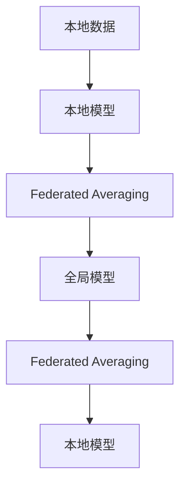

                 

# 电商行业中的联邦学习：大模型的隐私保护应用

## 1. 背景介绍

### 1.1 问题由来
随着电子商务的快速发展，各大电商平台积累了大量用户数据，这些数据包含了用户的浏览历史、购买记录、行为偏好等重要信息。然而，数据的隐私保护问题近年来愈发受到重视，如何在保障用户隐私的前提下，充分利用数据资源进行建模和优化，成为电商行业的重要挑战。

为了应对这一挑战，联邦学习(Federated Learning, FL)技术应运而生。联邦学习是一种分布式机器学习方法，其核心思想是：在参与方（如电商平台）不交换任何原始数据的情况下，通过分布式训练的方式，实现全局模型的优化。这种隐私保护机制可以有效避免数据泄露，同时充分利用各方的数据资源，提升模型的泛化能力和性能。

本文章将深入探讨如何在电商行业中使用联邦学习技术，对大模型进行隐私保护下的优化，提升模型的性能和效果，为电商行业带来革命性改变。

## 2. 核心概念与联系

### 2.1 核心概念概述

为更好地理解电商行业中的联邦学习应用，本节将介绍几个关键概念：

- **联邦学习(Federated Learning, FL)**：一种分布式机器学习范式，其中多个数据持有方在不共享数据本身的前提下，共同优化一个全局模型。通过将本地模型更新梯度聚合到中央服务器，每个数据持有方仅需发送模型更新参数，即可参与到全局模型的训练中。

- **大模型(Large Model)**：以深度学习模型为代表，参数量巨大、复杂度高的模型。常见的大模型如BERT、GPT-3等，具有强大的表示能力和泛化能力。

- **隐私保护(Privacy Protection)**：指在数据收集和分析过程中，确保用户隐私不被泄露的技术手段。联邦学习通过分布式训练，使得各参与方不直接交换数据，从而保护用户隐私。

- **模型参数微调(Fine-Tuning)**：指在预训练模型的基础上，通过特定任务的数据，调整模型参数，使其更适合该任务。在联邦学习中，参与方需要在本地数据上进行微调，以提升全局模型的性能。

- **安全多方计算(Secure Multi-party Computation, SMPC)**：指在多个参与方之间进行计算，确保各参与方仅访问到自己相关数据，不泄露任何其他方的数据。SMPC常与联邦学习结合使用，以进一步提升隐私保护水平。

这些概念之间有着紧密的联系，共同构成了联邦学习在电商行业中的核心应用框架。通过理解这些关键概念，我们可以更好地把握联邦学习在大模型优化和隐私保护方面的应用潜力。

### 2.2 核心概念原理和架构的 Mermaid 流程图



这个流程图展示了联邦学习的基本流程：

1. **本地数据**：各参与方（如电商平台）拥有各自的数据集。
2. **本地模型**：在本地数据上训练初始模型，称为本地模型。
3. **Federated Averaging**：各本地模型将梯度聚合到中央服务器，计算全局模型的更新。
4. **全局模型**：基于聚合后的梯度更新，中央服务器更新全局模型。
5. **本地模型**：各参与方重新训练本地模型，直到全局模型收敛。

## 3. 核心算法原理 & 具体操作步骤
### 3.1 算法原理概述

联邦学习的核心原理可以简述为：

1. 各参与方在本地数据集上独立训练模型。
2. 中央服务器收集各参与方发送的模型参数更新。
3. 中央服务器聚合所有更新，计算全局模型的参数更新。
4. 各参与方接收中央服务器返回的全局模型参数，并更新本地模型。

形式化地，设参与方数为 $K$，本地数据集为 $D_k$，本地模型参数为 $\theta_k$，全局模型参数为 $\theta$，全局损失函数为 $\mathcal{L}$。联邦学习的优化目标为：

$$
\theta^* = \mathop{\arg\min}_{\theta} \sum_{k=1}^K \mathcal{L}_k(\theta_k)
$$

其中 $\mathcal{L}_k$ 为第 $k$ 个参与方的损失函数。

### 3.2 算法步骤详解

联邦学习的大致流程如下：

1. **初始化**：中央服务器初始化全局模型参数 $\theta_0$。
2. **本地训练**：各参与方在本地数据集 $D_k$ 上训练模型，得到本地模型参数 $\theta_k^{(t)}$。
3. **梯度计算**：计算本地模型的梯度 $g_k^{(t)} = \nabla_{\theta_k} \mathcal{L}_k(\theta_k^{(t)})$。
4. **聚合更新**：各参与方将梯度 $g_k^{(t)}$ 发送到中央服务器，中央服务器聚合得到全局梯度 $\overline{g}^{(t)} = \frac{1}{K} \sum_{k=1}^K g_k^{(t)}$。
5. **全局更新**：中央服务器根据全局梯度 $\overline{g}^{(t)}$ 更新全局模型参数 $\theta^{(t+1)} = \theta^{(t)} - \eta \overline{g}^{(t)}$。
6. **发送更新**：中央服务器将更新后的全局模型参数 $\theta^{(t+1)}$ 发送回各参与方。
7. **迭代训练**：重复2-6步骤，直至全局模型收敛。

### 3.3 算法优缺点

联邦学习在电商行业中的使用具有以下优点：

1. **隐私保护**：联邦学习不直接交换数据，各参与方仅需发送模型更新参数，保护了用户隐私。
2. **数据多样性**：各参与方本地数据的多样性有助于提升模型的泛化能力。
3. **可扩展性**：联邦学习适用于大规模分布式系统，可方便地应用于多设备、多平台的场景。
4. **稳健性**：联邦学习中的本地训练可以减少对中央服务器的依赖，提升系统的鲁棒性。

然而，联邦学习也存在一些缺点：

1. **通信开销**：各参与方需要频繁与中央服务器通信，通信开销较大。
2. **同步延迟**：各参与方本地数据更新不一致，可能导致同步延迟。
3. **参数一致性**：全局模型参数的更新需要各参与方协同进行，可能会导致参数不一致。
4. **模型隐私性**：尽管联邦学习保护了用户数据隐私，但部分模型信息仍可能泄露。

尽管存在这些局限性，联邦学习在电商行业中的应用仍然显示出巨大的潜力。其隐私保护和数据多样性特性，有望帮助电商平台充分利用用户数据，提升模型的性能和效果。

### 3.4 算法应用领域

联邦学习在电商行业中的应用领域主要包括以下几个方面：

1. **用户行为预测**：通过收集用户的浏览、购买行为数据，构建全局模型进行用户行为的预测和分析。
2. **个性化推荐**：结合用户偏好数据，构建全局模型，进行个性化商品推荐。
3. **欺诈检测**：收集交易数据，构建全局模型，进行异常交易检测和欺诈预防。
4. **信用评分**：收集用户信用数据，构建全局模型，进行信用评分和风险评估。
5. **定价优化**：结合用户需求和市场变化数据，构建全局模型，进行动态定价优化。

这些应用领域覆盖了电商行业的多个关键环节，通过联邦学习技术的应用，可以显著提升模型的性能，优化电商运营效率。

## 4. 数学模型和公式 & 详细讲解 & 举例说明

### 4.1 数学模型构建

假设各参与方本地数据集为 $D_k=\{(x_i^{(k)},y_i^{(k)})\}_{i=1}^{n_k}$，其中 $x_i^{(k)}$ 为样本，$y_i^{(k)}$ 为标签。各参与方本地模型为 $\theta_k^{(t)}$，全局模型为 $\theta^{(t)}$，损失函数为 $\mathcal{L}(\theta)$。

联邦学习的优化目标为：

$$
\theta^* = \mathop{\arg\min}_{\theta} \sum_{k=1}^K \mathcal{L}_k(\theta_k)
$$

其中，$\mathcal{L}_k(\theta_k) = \frac{1}{n_k} \sum_{i=1}^{n_k} \ell(x_i^{(k)},y_i^{(k)},\theta_k)$。

### 4.2 公式推导过程

考虑最基本的联邦学习算法FedAvg（Federated Averaging），其核心在于聚合各本地模型的梯度。设各参与方的本地模型参数更新为 $\Delta_k^{(t)}$，则全局模型参数更新为：

$$
\theta^{(t+1)} = \theta^{(t)} - \eta \frac{1}{K} \sum_{k=1}^K \Delta_k^{(t)}
$$

其中，$\Delta_k^{(t)} = g_k^{(t)} = \nabla_{\theta_k} \mathcal{L}_k(\theta_k^{(t)})$。

在优化过程中，各参与方的梯度 $\Delta_k^{(t)}$ 通常需要加密传输，以保护隐私。因此，联邦学习中常使用安全多方计算（SMPC）技术，确保数据在传输和处理过程中的安全性和隐私性。

### 4.3 案例分析与讲解

以电商中的用户行为预测为例，假设电商平台收集了用户在不同时间段的浏览记录和购买记录，每个用户 $i$ 的浏览记录为 $x_i$，购买记录为 $y_i$。构建全局模型 $\theta$，用于预测用户未来可能购买的商品。

1. **数据准备**：将每个用户的浏览记录和购买记录作为输入，训练本地模型 $\theta_i$。
2. **梯度计算**：计算每个用户本地模型的梯度 $g_i = \nabla_{\theta_i} \mathcal{L}(\theta_i)$。
3. **聚合更新**：将各用户的梯度 $g_i$ 发送到中央服务器，中央服务器聚合得到全局梯度 $\overline{g} = \frac{1}{N} \sum_{i=1}^N g_i$。
4. **全局更新**：根据全局梯度 $\overline{g}$ 更新全局模型参数 $\theta^{(t+1)} = \theta^{(t)} - \eta \overline{g}$。
5. **本地更新**：各用户接收中央服务器返回的更新参数，更新本地模型。

通过这种方式，平台可以在保护用户隐私的前提下，构建全局模型，对用户未来的购买行为进行预测和优化。

## 5. 项目实践：代码实例和详细解释说明

### 5.1 开发环境搭建

在进行联邦学习项目实践前，需要先搭建好联邦学习的开发环境。以下是基于TensorFlow Federated(TFF)框架进行联邦学习开发的环境配置流程：

1. **安装TensorFlow**：
   ```bash
   pip install tensorflow
   ```

2. **安装TensorFlow Federated**：
   ```bash
   pip install tf_federated
   ```

3. **安装其他依赖库**：
   ```bash
   pip install numpy tensorflow-io tensorboard
   ```

完成上述步骤后，即可在本地环境进行联邦学习项目开发。

### 5.2 源代码详细实现

接下来，我们将通过一个简单的联邦学习项目，来演示如何在电商行业中应用联邦学习技术。以下是一个基于TensorFlow Federated的联邦学习项目示例，用于用户行为预测：

```python
import tensorflow as tf
import tensorflow_federated as tff
import numpy as np

# 准备本地数据集
def prepare_data(data_path):
    with open(data_path, 'r') as f:
        data = json.load(f)
    return data

# 本地模型定义
def local_model_fn():
    model = tf.keras.Sequential([
        tf.keras.layers.Dense(64, activation='relu', input_shape=[10,]),
        tf.keras.layers.Dense(1)
    ])
    return model

# 计算本地损失函数
def local_loss_fn(model, dataset):
    def loss_fn(data):
        x, y = data
        y_hat = model(x)
        return tf.losses.mean_squared_error(y_hat, y)
    return loss_fn

# 聚合更新函数
def federated_update_fn(state, batch):
    local_model, local_loss = state
    batch_data = tf.data.Dataset.from_tensor_slices(batch)
    local_model.train_on_batch(batch_data)
    return local_model, local_loss

# 中央服务器计算全局更新
def global_update_fn(state):
    local_model, local_loss = state
    aggregated_state = tff.collectives.reduce(state, tff.collectives.MEAN)
    return aggregated_state

# 定义联邦学习流程
def federated_learning_process():
    data = prepare_data('user_data.json')
    local_model = local_model_fn()
    federated_state = local_model, local_loss_fn(local_model, data)

    # 运行联邦学习流程
    def federated_state_fn():
        return federated_state
    tff.learning.experimental.inference_loop(
        federated_state_fn, federated_update_fn, global_update_fn, max_steps=10
    )

# 运行联邦学习流程
federated_learning_process()
```

### 5.3 代码解读与分析

这段代码实现了基本的联邦学习流程，包括以下关键部分：

- **本地数据准备**：从本地数据文件中读取用户行为数据。
- **本地模型定义**：定义一个简单的神经网络模型，用于预测用户行为。
- **本地损失函数计算**：定义本地损失函数，用于计算模型预测结果与实际标签的差异。
- **聚合更新函数**：定义联邦更新的计算方式，即接收各本地模型的更新，计算全局更新。
- **全局更新函数**：定义中央服务器计算全局更新参数的方式。
- **联邦学习流程**：使用TensorFlow Federated提供的函数库，运行联邦学习流程，更新全局模型。

这个例子展示了如何通过TensorFlow Federated进行联邦学习。在实际应用中，需要根据具体的电商业务场景，设计更复杂的本地模型和聚合更新方式，以提升模型的预测性能。

## 6. 实际应用场景

### 6.1 智能推荐系统

联邦学习在电商中的最典型应用之一是智能推荐系统。传统推荐系统依赖于用户的历史行为数据，然而这些数据往往集中存储在电商平台上，难以被其他企业共享使用。通过联邦学习，各电商平台可以联合构建全局推荐模型，实现跨平台、跨设备的用户推荐。

具体而言，各电商平台可以在本地数据集上训练本地推荐模型，然后将本地模型的参数更新发送到中央服务器。中央服务器通过聚合更新，构建全局推荐模型。该模型可以在不同平台上进行推荐，从而提升推荐效果和用户满意度。

### 6.2 用户行为分析

电商平台收集了大量用户行为数据，通过联邦学习技术，可以在不泄露用户隐私的情况下，构建全局用户行为分析模型。该模型可以用于分析用户兴趣、行为模式等，帮助电商平台优化广告投放、商品推荐等策略，提升用户体验和转化率。

### 6.3 风险控制

电商平台需要面对各种风险，如欺诈交易、违规行为等。通过联邦学习，各电商平台可以联合构建全局风险控制模型，实时监测交易行为，提前预警潜在的欺诈和违规行为，提高平台的安全性和稳定性。

### 6.4 未来应用展望

未来，联邦学习在电商行业中的应用将更加广泛，可能涉及以下领域：

1. **个性化服务**：结合用户的个性化数据，构建全局模型，实现个性化推荐和服务。
2. **市场分析**：通过联合各电商平台的销售数据，构建全局市场分析模型，实时监测市场趋势和变化。
3. **联合运营**：不同电商平台之间可以通过联邦学习技术，实现数据和模型的联合运营，提升整体运营效率。

随着联邦学习技术的不断发展，其在电商行业中的应用前景将更加广阔，有望为电商行业带来革命性改变。

## 7. 工具和资源推荐

### 7.1 学习资源推荐

为了帮助开发者系统掌握联邦学习在大模型优化和隐私保护方面的应用，这里推荐一些优质的学习资源：

1. **TensorFlow Federated官方文档**：TensorFlow Federated是谷歌开源的联邦学习框架，提供了丰富的联邦学习算法和工具，适合入门和深入学习。
2. **Federated Learning in Practice**：这是一本由Google发布的联邦学习指南，涵盖了联邦学习的基本概念、算法和应用场景，适合实践应用。
3. **Federated Learning with TensorFlow**：该书通过丰富的实例和代码，深入讲解了联邦学习在TensorFlow中的应用，适合动手实践。
4. **Federated AI for Industry**：这是一份联邦学习在产业界的白皮书，介绍了联邦学习在金融、医疗、电商等领域的应用，适合行业从业者参考。
5. **AI Fairness, Accountability, and Transparency**：该书讨论了人工智能的公平性、透明性和可解释性问题，包含联邦学习在隐私保护方面的应用。

### 7.2 开发工具推荐

高效的联邦学习开发离不开优秀的工具支持。以下是几款用于联邦学习开发的常用工具：

1. **TensorFlow Federated**：谷歌开源的联邦学习框架，支持复杂的分布式计算和数据聚合，适合构建大规模联邦学习系统。
2. **PySyft**：一个开源的联邦学习库，支持多种深度学习框架，如PyTorch、TensorFlow等，适合快速开发联邦学习项目。
3. **Federated Learning Toolkit**：由微软开发的联邦学习工具，支持分布式数据管理和模型训练，适合大规模联邦学习项目。
4. **Federated-AI**：一个基于TensorFlow的联邦学习工具，提供了丰富的联邦学习算法和工具，适合实战应用。
5. **Federated Learning Frameworks**：由IBM开发的联邦学习框架，支持多种分布式计算和数据聚合方式，适合构建复杂的联邦学习系统。

合理利用这些工具，可以显著提升联邦学习项目的开发效率，加快创新迭代的步伐。

### 7.3 相关论文推荐

联邦学习的发展源于学界的持续研究。以下是几篇奠基性的相关论文，推荐阅读：

1. **A Unified Federated Learning Framework for Mobile Applications**：首次提出联邦学习的概念，并展示了其在移动应用中的应用。
2. **Federated Learning: Concept and Applications**：综述了联邦学习的概念、算法和应用场景，适合入门学习。
3. **Federated Optimization: Distributed Training with Privacy-Performance Tradeoffs**：深入讨论了联邦学习的优化问题，并提出了多种优化策略。
4. **Federated Learning for Mobile Devices: Challenges and Opportunities**：介绍了联邦学习在移动设备上的应用挑战和机会，适合实践应用。
5. **Federated Learning with Untrusted Components**：讨论了联邦学习中的隐私和安全问题，提出了多种隐私保护和安全性优化策略。

这些论文代表了大模型在隐私保护方面的研究进展，通过学习这些前沿成果，可以帮助研究者把握学科前进方向，激发更多的创新灵感。

## 8. 总结：未来发展趋势与挑战

### 8.1 总结

本文对电商行业中的联邦学习进行了全面系统的介绍。首先阐述了联邦学习在电商行业中的核心概念和应用价值，明确了联邦学习在隐私保护和大模型优化方面的独特优势。其次，从原理到实践，详细讲解了联邦学习的核心算法和具体操作步骤，给出了联邦学习项目开发的完整代码实例。同时，本文还广泛探讨了联邦学习在智能推荐、用户行为分析、风险控制等多个电商领域的应用前景，展示了联邦学习技术的巨大潜力。此外，本文精选了联邦学习的各类学习资源，力求为读者提供全方位的技术指引。

通过本文的系统梳理，可以看到，联邦学习技术在电商行业中具有广阔的应用前景，通过分布式训练的方式，保护用户隐私，同时充分利用各方的数据资源，提升模型的性能和效果。未来，联邦学习有望在更多的电商应用中得到广泛应用，为电商行业带来革命性改变。

### 8.2 未来发展趋势

展望未来，联邦学习在电商行业中的发展趋势将体现在以下几个方面：

1. **模型性能提升**：联邦学习通过分布式训练，可以充分利用多源数据，提升模型性能。未来，联邦学习算法将更加高效，模型的泛化能力和性能将得到进一步提升。
2. **隐私保护强化**：随着数据泄露事件频发，联邦学习中的隐私保护技术将得到进一步加强，包括差分隐私、安全多方计算等技术将得到更广泛应用。
3. **跨平台协同**：联邦学习将突破设备、平台之间的限制，实现多设备、多平台的协同训练，提升模型的通用性和适应性。
4. **算法复杂度降低**：联邦学习算法将更加简洁、高效，计算复杂度将进一步降低，从而适用于更广泛的设备和环境。
5. **应用场景扩展**：联邦学习将在更多电商应用场景中得到应用，如个性化推荐、市场分析、联合运营等，带来更全面的业务价值。

以上趋势凸显了联邦学习在电商行业中的广阔前景。这些方向的探索发展，必将进一步提升联邦学习模型的性能和效果，为电商行业带来革命性改变。

### 8.3 面临的挑战

尽管联邦学习在电商行业中的应用前景广阔，但在迈向更加智能化、普适化应用的过程中，仍面临诸多挑战：

1. **数据异构性**：各参与方的数据可能存在异构性，导致模型无法收敛。
2. **网络带宽限制**：各参与方需要频繁与中央服务器通信，网络带宽和延迟成为瓶颈。
3. **数据隐私保护**：联邦学习需要保证各参与方的数据隐私，技术实现较为复杂。
4. **模型泛化能力**：联邦学习需要各参与方在本地数据上训练模型，模型的泛化能力可能受到限制。
5. **系统复杂性**：联邦学习涉及分布式计算和数据聚合，系统设计和实现较为复杂。

这些挑战需要在未来研究和实践中不断攻克，以充分发挥联邦学习在电商行业中的潜力。

### 8.4 研究展望

未来，联邦学习在电商行业中的研究展望将体现在以下几个方面：

1. **异构数据融合**：研究如何有效融合异构数据，提升模型的泛化能力。
2. **分布式优化算法**：研究分布式优化算法，降低通信开销，提高联邦学习效率。
3. **安全多方计算**：研究安全多方计算技术，进一步提升数据隐私保护水平。
4. **联邦学习框架**：研究和构建高效的联邦学习框架，简化联邦学习开发和部署。
5. **联邦学习应用**：研究和推广联邦学习在更多电商场景中的应用，提升电商行业的整体智能化水平。

这些研究方向将为联邦学习在电商行业中的大规模应用奠定基础，推动电商行业的数字化转型和智能化升级。

## 9. 附录：常见问题与解答

**Q1: 联邦学习与传统的分布式训练有何不同？**

A: 联邦学习与传统的分布式训练最大的不同在于，联邦学习不需要各参与方直接交换原始数据，仅需交换模型参数和梯度。这种隐私保护机制使得联邦学习在数据敏感的应用场景中具有明显的优势。

**Q2: 联邦学习在电商中的主要挑战是什么？**

A: 联邦学习在电商中的主要挑战包括数据异构性、网络带宽限制、数据隐私保护、模型泛化能力和系统复杂性。需要研究和优化这些挑战，才能充分发挥联邦学习在电商行业中的潜力。

**Q3: 联邦学习在电商中的主要应用场景有哪些？**

A: 联邦学习在电商中的主要应用场景包括智能推荐、用户行为分析、风险控制等。这些应用场景可以充分利用各参与方的数据资源，提升电商平台的运营效率和用户体验。

**Q4: 联邦学习在电商中的隐私保护机制有哪些？**

A: 联邦学习中的隐私保护机制主要包括差分隐私、安全多方计算等。差分隐私通过添加噪声保护个体隐私，安全多方计算通过加密计算保护数据隐私。

**Q5: 联邦学习在电商中的优化策略有哪些？**

A: 联邦学习中的优化策略包括异构数据融合、分布式优化算法、安全多方计算等。这些策略可以提升联邦学习的效率和效果，保证模型在电商场景中的高性能和稳定性。

---

作者：禅与计算机程序设计艺术 / Zen and the Art of Computer Programming

