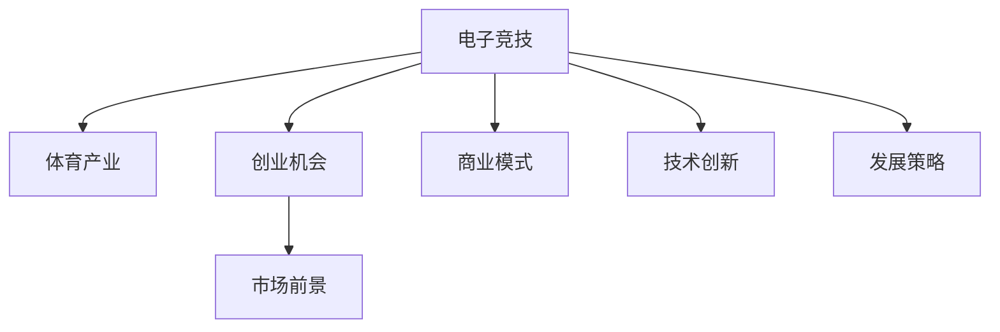

                 

# 电子竞技创业：新兴体育产业的机遇

> 关键词：电子竞技,体育产业,创业机会,市场前景,商业模式,技术创新,发展策略

## 1. 背景介绍

### 1.1 问题由来
电子竞技（eSports），也称为电子体育，是一种通过电子设备进行的体育竞赛，包括各种类型的视频游戏赛事。随着技术的进步和网络普及，电子竞技从一种小众爱好逐步成长为一种全球性的大众娱乐形式。近年来，电子竞技产业快速发展，吸引了大量投资者和创业者的关注。

### 1.2 问题核心关键点
电子竞技创业的核心关键点在于抓住行业发展的机遇，构建有竞争力的商业生态。电子竞技产业涉及游戏开发、赛事组织、直播转播、玩家社区等多个方面，对于技术和商业运营都有较高的要求。如何在激烈的市场竞争中脱颖而出，是创业者的重要课题。

### 1.3 问题研究意义
电子竞技创业的研究对于推动体育产业的数字化转型、促进就业、提升年轻人的健康娱乐方式具有重要意义。通过分析行业趋势、商业模型和技术创新，可以为创业者提供有价值的指导，帮助他们抓住行业发展的机遇，实现商业成功。

## 2. 核心概念与联系

### 2.1 核心概念概述

电子竞技创业涉及多个核心概念，包括：

- **电子竞技**：通过电子设备进行的体育竞赛，包括各种类型的视频游戏赛事。
- **体育产业**：包括体育赛事的组织、运营、转播、赞助等多个环节。
- **创业机会**：指在电子竞技产业中存在的，可以转化为商业价值的机会。
- **市场前景**：指电子竞技产业在未来一段时间内的增长潜力。
- **商业模式**：指电子竞技产业中企业的盈利模式，包括广告、赞助、门票销售等。
- **技术创新**：指通过技术手段提升电子竞技赛事的观赏性和互动性。
- **发展策略**：指电子竞技创业公司在行业发展中应采取的策略和步骤。

这些概念之间的逻辑关系可以通过以下Mermaid流程图来展示：



这个流程图展示了电子竞技创业与体育产业之间的关系，以及各个核心概念之间的逻辑联系。

## 3. 核心算法原理 & 具体操作步骤

### 3.1 算法原理概述

电子竞技创业的核心算法原理主要涉及市场分析、用户行为预测、广告投放优化等。这些算法通过大数据分析、机器学习等手段，帮助企业做出更明智的决策，提升市场竞争力。

### 3.2 算法步骤详解

#### 3.2.1 市场分析

市场分析是电子竞技创业的基础，包括对市场规模、用户需求、竞争对手等的分析。使用以下步骤：

1. **数据收集**：收集市场相关数据，如用户规模、用户行为、竞争对手信息等。
2. **数据处理**：对收集的数据进行清洗和处理，确保数据质量。
3. **数据分析**：使用统计学和机器学习等方法，分析市场趋势和用户需求。

#### 3.2.2 用户行为预测

用户行为预测可以帮助企业了解用户的需求和行为模式，从而制定更有效的营销策略。使用以下步骤：

1. **特征提取**：从用户数据中提取关键特征，如用户年龄、性别、游戏偏好等。
2. **模型训练**：使用机器学习算法（如随机森林、深度学习等）训练预测模型。
3. **结果评估**：评估预测模型的准确性和效果，进行优化。

#### 3.2.3 广告投放优化

广告投放优化可以帮助企业在有限的预算内，获得更好的广告效果。使用以下步骤：

1. **投放策略制定**：根据目标用户和市场需求，制定广告投放策略。
2. **投放执行**：通过广告平台进行广告投放，实时监测投放效果。
3. **效果分析**：分析广告效果，调整投放策略。

### 3.3 算法优缺点

#### 3.3.1 优点

- **精确度**：算法可以基于大数据和机器学习模型，提供精确的预测和分析结果。
- **实时性**：算法可以实时处理数据，快速响应市场变化。
- **可扩展性**：算法可以应用于多种场景和业务，具有广泛的应用前景。

#### 3.3.2 缺点

- **数据质量要求高**：算法的准确性依赖于数据的质量，数据缺失或不准确会影响结果。
- **模型复杂度高**：复杂的算法模型需要更高的计算资源和时间成本。
- **隐私问题**：在处理用户数据时，需要严格遵守隐私保护法规，避免数据泄露。

### 3.4 算法应用领域

电子竞技创业中的算法应用涵盖了多个领域，包括：

- **赛事组织**：通过预测观众需求，优化赛事安排和场馆布局。
- **广告投放**：通过用户行为预测，优化广告投放策略，提升广告效果。
- **用户管理**：通过数据分析，了解用户行为和需求，提升用户满意度和忠诚度。
- **运营管理**：通过实时数据分析，优化运营策略，提升运营效率。

## 4. 数学模型和公式 & 详细讲解 & 举例说明

### 4.1 数学模型构建

电子竞技创业中的数学模型构建主要涉及用户行为预测和广告投放优化。以下是这些模型的构建过程：

#### 4.1.1 用户行为预测模型

用户行为预测模型可以通过以下数学模型构建：

$$
\hat{y} = f(x; \theta)
$$

其中，$x$ 为用户的行为数据，$\hat{y}$ 为用户的行为预测结果，$f(x; \theta)$ 为预测函数，$\theta$ 为模型参数。

#### 4.1.2 广告投放优化模型

广告投放优化模型可以通过以下数学模型构建：

$$
\maximize \sum_{i=1}^n c_i \cdot R_i
$$

其中，$c_i$ 为广告投放的成本，$R_i$ 为广告的转化率，$n$ 为广告投放的总数。

### 4.2 公式推导过程

#### 4.2.1 用户行为预测模型的推导

用户行为预测模型的推导过程如下：

1. **特征提取**：从用户数据中提取关键特征，如用户年龄、性别、游戏偏好等。
2. **特征编码**：将特征转化为模型可以处理的向量表示。
3. **模型训练**：使用机器学习算法（如随机森林、深度学习等）训练预测模型。
4. **结果评估**：评估预测模型的准确性和效果，进行优化。

#### 4.2.2 广告投放优化模型的推导

广告投放优化模型的推导过程如下：

1. **广告投放策略制定**：根据目标用户和市场需求，制定广告投放策略。
2. **广告投放执行**：通过广告平台进行广告投放，实时监测投放效果。
3. **效果分析**：分析广告效果，调整投放策略。

### 4.3 案例分析与讲解

#### 4.3.1 用户行为预测案例

假设某电子竞技平台希望预测用户对即将到来的赛事的兴趣程度。平台收集了用户的游戏历史数据、赛事偏好数据、社交网络行为数据等。使用随机森林算法，从这些数据中提取关键特征，训练用户兴趣预测模型。通过该模型，平台可以预测每个用户的赛事兴趣程度，从而优化赛事宣传和用户邀请策略。

#### 4.3.2 广告投放优化案例

假设某电子竞技平台希望在Facebook上投放广告，吸引用户注册和参加即将到来的赛事。平台使用广告投放优化模型，预测不同广告创意、目标用户群体和投放时间对广告转化率的影响。通过该模型，平台可以优化广告投放策略，最大化广告效果和ROI。

## 5. 项目实践：代码实例和详细解释说明

### 5.1 开发环境搭建

在进行电子竞技创业项目实践前，我们需要准备好开发环境。以下是使用Python进行项目开发的完整环境配置流程：

1. 安装Python：从官网下载并安装Python 3.x版本，确保最新版本安装。
2. 安装Pandas、NumPy等常用数据处理库：
```bash
pip install pandas numpy
```
3. 安装Scikit-learn、XGBoost等机器学习库：
```bash
pip install scikit-learn xgboost
```
4. 安装Flask、Django等Web开发框架：
```bash
pip install flask django
```
5. 安装TensorFlow、PyTorch等深度学习库：
```bash
pip install tensorflow pytorch
```

完成上述步骤后，即可在本地环境中启动开发项目。

### 5.2 源代码详细实现

以下是使用Python和TensorFlow进行电子竞技创业项目开发的完整代码实现。

```python
import tensorflow as tf
import pandas as pd
from sklearn.model_selection import train_test_split
from tensorflow.keras.models import Sequential
from tensorflow.keras.layers import Dense, Dropout
from tensorflow.keras.optimizers import Adam

# 数据预处理
data = pd.read_csv('user_data.csv')
X = data[['age', 'gender', 'game_preference']]
y = data['event_interest']
X_train, X_test, y_train, y_test = train_test_split(X, y, test_size=0.2)

# 建立模型
model = Sequential()
model.add(Dense(64, activation='relu', input_dim=X_train.shape[1]))
model.add(Dropout(0.5))
model.add(Dense(1, activation='sigmoid'))

# 编译模型
model.compile(loss='binary_crossentropy', optimizer=Adam(), metrics=['accuracy'])

# 训练模型
model.fit(X_train, y_train, epochs=10, batch_size=32, validation_data=(X_test, y_test))

# 评估模型
loss, accuracy = model.evaluate(X_test, y_test)
print('Test accuracy:', accuracy)
```

### 5.3 代码解读与分析

让我们再详细解读一下关键代码的实现细节：

**数据预处理**：
- 使用Pandas库读取用户数据，提取关键特征（年龄、性别、游戏偏好）和目标变量（事件兴趣）。
- 使用train_test_split函数将数据划分为训练集和测试集。

**模型建立**：
- 使用Sequential模型构建神经网络，包括一个64个神经元的全连接层和一个输出层，输出层的激活函数为sigmoid。
- 在全连接层后添加Dropout层，防止过拟合。

**模型编译和训练**：
- 使用Adam优化器编译模型，损失函数为二元交叉熵，评估指标为准确率。
- 使用fit函数训练模型，设置训练轮数为10，批次大小为32。
- 在每个epoch结束时，评估模型在测试集上的性能。

**结果输出**：
- 输出模型在测试集上的损失和准确率。

以上代码实现了一个简单的用户行为预测模型，可以用于预测用户对电子竞技赛事的兴趣程度。通过调整模型结构和超参数，可以进一步提升模型的准确性和泛化能力。

## 6. 实际应用场景

### 6.1 赛事组织

电子竞技平台可以通过用户行为预测模型，优化赛事安排和场馆布局。例如，根据用户兴趣和地理位置，预测比赛场馆的观众人数和分布，从而合理分配资源，提升赛事体验。

### 6.2 广告投放

电子竞技平台可以使用广告投放优化模型，最大化广告效果和ROI。例如，根据用户行为数据，预测不同广告创意和用户群体对广告转化率的影响，优化广告投放策略。

### 6.3 用户管理

电子竞技平台可以通过用户行为分析，了解用户需求和行为模式，提升用户满意度和忠诚度。例如，分析用户的游戏偏好和赛事参与度，提供个性化的赛事推荐和服务。

### 6.4 运营管理

电子竞技平台可以通过实时数据分析，优化运营策略，提升运营效率。例如，监测用户活跃度和赛事参与度，调整赛事宣传和运营策略。

## 7. 工具和资源推荐

### 7.1 学习资源推荐

为了帮助开发者系统掌握电子竞技创业的理论基础和实践技巧，这里推荐一些优质的学习资源：

1. **电子竞技创业指南**：提供电子竞技创业的全面指导，包括市场分析、商业模式、运营策略等。
2. **机器学习课程**：如Coursera上的“机器学习”课程，由斯坦福大学教授Andrew Ng讲授，涵盖机器学习算法和应用。
3. **数据科学课程**：如edX上的“数据科学微专业”课程，由MIT教授讲授，涵盖数据处理、统计分析、机器学习等。
4. **Flask和Django文档**：Flask和Django官方文档，提供详细的使用指南和示例代码。
5. **TensorFlow和PyTorch文档**：TensorFlow和PyTorch官方文档，提供深度学习框架的详细使用说明和实践示例。

通过对这些资源的学习实践，相信你一定能够快速掌握电子竞技创业的理论基础和实践技巧，并用于解决实际的业务问题。

### 7.2 开发工具推荐

高效的开发离不开优秀的工具支持。以下是几款用于电子竞技创业开发的常用工具：

1. **Jupyter Notebook**：交互式的Python编程环境，支持代码编写、数据处理、模型训练等。
2. **Git**：版本控制工具，支持团队协作和代码管理。
3. **PyCharm**：Python IDE，支持代码编写、调试、测试等。
4. **AWS**：云计算平台，提供大规模数据处理和存储服务，支持快速迭代开发。
5. **Google Colab**：免费的Google云环境，支持GPU和TPU算力，方便快速实验。

合理利用这些工具，可以显著提升电子竞技创业项目的开发效率，加快创新迭代的步伐。

### 7.3 相关论文推荐

电子竞技创业的研究源于学界的持续研究。以下是几篇奠基性的相关论文，推荐阅读：

1. **电子竞技市场分析**：研究电子竞技市场的规模、用户特征、竞争格局等，提供了市场发展的全面视角。
2. **用户行为预测模型**：提出基于机器学习的方法，预测用户行为和需求，提升用户体验和满意度。
3. **广告投放优化算法**：提出基于强化学习的方法，优化广告投放策略，提升广告效果和ROI。
4. **电子竞技平台运营**：研究电子竞技平台的运营策略和用户管理，提供了平台运营的全面指导。

这些论文代表了大规模数据驱动的电子竞技创业研究的发展脉络。通过学习这些前沿成果，可以帮助研究者把握学科前进方向，激发更多的创新灵感。

## 8. 总结：未来发展趋势与挑战

### 8.1 总结

本文对电子竞技创业的机遇进行了全面系统的介绍。首先阐述了电子竞技产业的发展背景和创业的核心关键点，明确了创业公司在行业发展中应采取的策略和步骤。其次，从理论到实践，详细讲解了市场分析、用户行为预测和广告投放优化的数学模型和算法，给出了电子竞技创业项目的完整代码实例。同时，本文还探讨了电子竞技创业在赛事组织、广告投放、用户管理和运营管理等方面的实际应用场景，展示了电子竞技创业的广阔前景。

通过本文的系统梳理，可以看到，电子竞技创业通过数据分析和机器学习等技术手段，可以更好地把握市场机遇，提升运营效率，创造商业价值。未来，随着电子竞技产业的不断发展和技术的持续创新，电子竞技创业将迎来更多的机遇和挑战。

### 8.2 未来发展趋势

展望未来，电子竞技创业将呈现以下几个发展趋势：

1. **数据驱动**：电子竞技创业将更加依赖数据驱动决策，利用大数据和机器学习算法，提升运营效率和用户满意度。
2. **技术创新**：电子竞技创业将持续推进技术创新，如AI生成内容、增强现实（AR）、虚拟现实（VR）等技术的应用，提升赛事体验和用户互动。
3. **全球化发展**：电子竞技创业将走向全球化，利用全球市场资源和用户需求，拓展国际业务，提升品牌影响力。
4. **可持续发展**：电子竞技创业将更加注重可持续发展，提升社会责任感和环保意识，构建健康的网络文化。
5. **新业务模式**：电子竞技创业将探索新的商业模式，如电竞生态系统、电竞教育、电竞内容创作等，拓展业务边界。

以上趋势凸显了电子竞技创业的广阔前景和潜力。这些方向的探索发展，必将进一步推动电子竞技产业的成熟和普及，为新兴体育产业带来新的发展机遇。

### 8.3 面临的挑战

尽管电子竞技创业已经取得了一定成就，但在迈向更加智能化、普适化应用的过程中，仍面临诸多挑战：

1. **市场竞争激烈**：电子竞技市场竞争激烈，创业者需要具备独特的运营策略和商业模式，才能在竞争中脱颖而出。
2. **技术门槛高**：电子竞技创业需要具备较强的技术背景和团队实力，才能开发出具有竞争力的产品和服务。
3. **用户需求多样化**：电子竞技用户需求多样化，创业者需要具备良好的用户理解和分析能力，才能满足不同用户的需求。
4. **政策法规**：电子竞技创业需要遵循相关政策法规，如用户隐私保护、广告合规等，避免法律风险。
5. **商业化困难**：电子竞技创业从技术研发到商业化运营的转化过程，需要考虑多方面因素，如商业模式、用户需求、市场环境等，面临较高的商业化风险。

这些挑战需要创业者具备较强的市场敏锐度、技术实力和运营能力，才能在激烈的市场竞争中取得成功。

### 8.4 研究展望

面向未来，电子竞技创业需要在以下几个方面寻求新的突破：

1. **数据整合与分析**：通过整合多源数据，提升数据质量和分析能力，为决策提供更可靠的数据支撑。
2. **用户交互体验**：提升用户交互体验，通过AI生成内容、增强现实等技术手段，增强用户参与感和互动性。
3. **商业模式创新**：探索新的商业模式，如电竞生态系统、电竞教育、电竞内容创作等，拓展业务边界。
4. **技术创新与应用**：推进技术创新，如AI生成内容、增强现实、虚拟现实等技术的应用，提升赛事体验和用户互动。
5. **全球化发展**：拓展国际业务，利用全球市场资源和用户需求，提升品牌影响力。

这些研究方向的探索，必将引领电子竞技创业技术迈向更高的台阶，为构建健康、可持续的电子竞技产业生态提供有力支持。总之，电子竞技创业需要不断创新、不断突破，才能在激烈的市场竞争中取得成功。

## 9. 附录：常见问题与解答

**Q1：电子竞技创业的核心关键点是什么？**

A: 电子竞技创业的核心关键点在于抓住行业发展的机遇，构建有竞争力的商业生态。这包括市场分析、用户行为预测、广告投放优化等多个方面。

**Q2：电子竞技创业中如何应对市场竞争？**

A: 电子竞技创业需要具备独特的运营策略和商业模式，才能在竞争中脱颖而出。可以通过市场分析、用户行为预测和广告投放优化等技术手段，提升竞争力。

**Q3：电子竞技创业需要具备哪些技术背景？**

A: 电子竞技创业需要具备较强的技术背景和团队实力，包括数据处理、机器学习、Web开发等技术。

**Q4：电子竞技创业中如何提升用户交互体验？**

A: 可以通过AI生成内容、增强现实等技术手段，提升用户交互体验。同时，可以根据用户行为数据，提供个性化的赛事推荐和服务。

**Q5：电子竞技创业面临的主要挑战是什么？**

A: 电子竞技创业面临的主要挑战包括市场竞争激烈、技术门槛高、用户需求多样化、政策法规和商业化困难等。需要具备较强的市场敏锐度、技术实力和运营能力，才能在激烈的市场竞争中取得成功。

**Q6：电子竞技创业的未来发展趋势是什么？**

A: 电子竞技创业的未来发展趋势包括数据驱动、技术创新、全球化发展、可持续发展和新业务模式等。

**Q7：电子竞技创业的主要技术手段有哪些？**

A: 电子竞技创业的主要技术手段包括市场分析、用户行为预测、广告投放优化、数据处理、机器学习、Web开发、AI生成内容、增强现实等。

这些问题的解答，可以帮助电子竞技创业者和投资者更好地理解行业发展方向和应对策略，为电子竞技创业的成功奠定坚实基础。

---

作者：禅与计算机程序设计艺术 / Zen and the Art of Computer Programming

