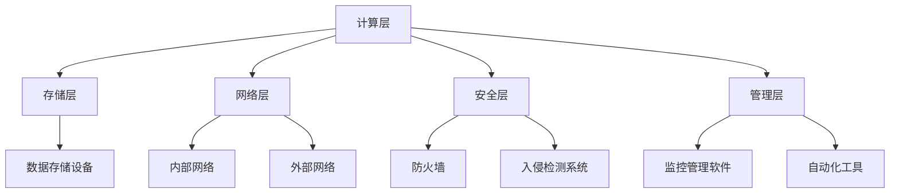

                 

### 文章标题

**AI 大模型应用数据中心建设：数据中心运维与管理**

> 关键词：数据中心、大模型、运维、管理、AI

> 摘要：本文将探讨 AI 大模型应用数据中心的建设与运维管理。通过对数据中心的概念、架构、硬件及软件需求进行详细分析，本文旨在为构建高效、可靠的 AI 大模型数据中心提供实用指导，同时讨论如何优化数据中心运维，确保数据中心的持续稳定运行。

<|user|>### 1. 背景介绍（Background Introduction）

随着人工智能（AI）技术的飞速发展，AI 大模型如 GPT、BERT 等在自然语言处理、图像识别、推荐系统等领域取得了显著的成果。这些大模型通常需要庞大的计算资源和数据存储空间，因此构建一个高效、可靠的 AI 大模型数据中心变得至关重要。数据中心不仅是 AI 大模型训练和推理的核心设施，也是确保业务连续性和数据安全的关键。

在本文中，我们将深入探讨数据中心的概念、架构、硬件及软件需求，并详细分析数据中心在 AI 大模型应用中的角色和挑战。此外，本文还将提供一系列优化数据中心运维的策略，以实现高效的资源利用和故障快速响应，确保数据中心的持续稳定运行。

首先，让我们从数据中心的定义和分类开始，了解数据中心的组成部分和功能。

#### 1.1 数据中心的定义和分类

数据中心（Data Center）是指集中存储、处理、传输和管理大量数据的设施。数据中心可以分为以下几类：

- **企业级数据中心**：为大型企业或组织提供计算和存储资源，通常具有高度可靠性和安全性。
- **云数据中心**：提供云计算服务，包括基础设施即服务（IaaS）、平台即服务（PaaS）和软件即服务（SaaS）。
- **托管数据中心**：为中小企业或个人提供托管服务，包括设备租赁、网络接入、安全保障等。
- **边缘数据中心**：位于网络边缘，旨在减少数据传输延迟，提高数据处理的效率。

数据中心的主要功能包括：

- **数据处理**：处理和分析大量数据，为业务提供数据支持和决策依据。
- **数据存储**：存储各种类型的数据，包括结构化数据和非结构化数据。
- **数据传输**：提供高速、稳定的网络连接，确保数据在不同系统之间的传输。
- **数据安全**：确保数据的安全性和隐私性，防止数据泄露和未经授权的访问。

#### 1.2 数据中心在 AI 大模型应用中的角色

在 AI 大模型应用中，数据中心扮演着至关重要的角色。数据中心不仅是大模型训练和推理的物理场所，还提供必要的计算资源、数据存储和网络连接，确保大模型的高效运行。具体来说，数据中心在 AI 大模型应用中的角色包括：

- **计算资源提供**：数据中心提供高性能的计算设备，如 GPU、TPU 等，以支持大模型的训练和推理。
- **数据存储管理**：数据中心存储和管理大量训练数据，确保数据的高效访问和可靠存储。
- **网络连接**：数据中心提供高速、稳定的网络连接，确保数据在不同设备和系统之间的快速传输。
- **安全保障**：数据中心提供多层次的安全保障措施，保护大模型和相关数据的安全性和隐私性。

#### 1.3 数据中心面临的挑战

虽然数据中心在 AI 大模型应用中具有重要的作用，但同时也面临着一系列挑战。这些挑战包括：

- **计算资源需求**：AI 大模型通常需要大量的计算资源，对数据中心的硬件和软件提出了更高的要求。
- **数据存储和管理**：大模型训练过程中会产生大量数据，对数据中心的存储和管理能力提出了挑战。
- **能耗和散热**：大规模的数据中心需要消耗大量电力，同时产生大量热量，对能源消耗和散热管理提出了挑战。
- **安全性**：数据中心需要确保数据的安全性和隐私性，防止数据泄露和未经授权的访问。
- **运维管理**：数据中心需要高效的运维管理，确保设备正常运行、数据安全、故障快速响应等。

在接下来的章节中，我们将详细分析数据中心的关键组成部分，包括硬件和软件需求，以及如何在 AI 大模型应用中构建和优化数据中心。

### 2. 核心概念与联系（Core Concepts and Connections）

#### 2.1 数据中心架构

数据中心架构是确保数据中心高效运行的关键。一个典型的数据中心架构包括以下几个关键部分：

- **计算层**：计算层是数据中心的核心，提供计算资源，如服务器、GPU、TPU 等。这些计算资源用于 AI 大模型的训练和推理。
- **存储层**：存储层负责存储和管理数据，包括结构化数据和非结构化数据。常用的存储设备有磁盘阵列（Disk Array）、固态硬盘（SSD）和分布式存储系统。
- **网络层**：网络层提供数据传输通道，包括内部网络和外部网络。内部网络负责数据中心内部设备之间的通信，外部网络负责与互联网的连接。
- **安全层**：安全层负责保护数据中心的数据和设备，防止数据泄露和未经授权的访问。安全措施包括防火墙、入侵检测系统（IDS）、入侵防御系统（IPS）等。
- **管理层**：管理层负责监控、管理和维护数据中心的各个部分，确保数据中心的高效运行和业务连续性。

#### 2.2 数据中心硬件需求

数据中心硬件需求直接影响数据中心的性能和可靠性。以下是数据中心常见的硬件需求：

- **服务器**：服务器是数据中心的计算核心，用于运行应用程序、存储数据和提供计算服务。服务器可以分为通用服务器和专用服务器，通用服务器适用于多种应用场景，专用服务器则针对特定应用场景优化。
- **GPU 和 TPU**：GPU（图形处理单元）和 TPU（张量处理单元）是专门用于 AI 计算的硬件设备。GPU 适用于图像处理和深度学习，TPU 适用于张量运算和大规模数据处理。
- **存储设备**：存储设备包括磁盘阵列、固态硬盘和分布式存储系统。磁盘阵列适用于大规模数据存储，固态硬盘具有高速读写性能，分布式存储系统适用于大规模数据存储和高效数据访问。
- **网络设备**：网络设备包括路由器、交换机和防火墙。路由器用于不同网络之间的数据传输，交换机用于内部网络的数据交换，防火墙用于网络防护和数据安全。
- **电源设备**：电源设备包括不间断电源（UPS）和电池组。UPS 用于提供稳定的电源，防止电网故障导致设备停机，电池组用于 UPS 的备用电源。

#### 2.3 数据中心软件需求

数据中心软件需求包括操作系统、数据库、中间件和监控管理软件等。以下是数据中心常见的软件需求：

- **操作系统**：操作系统是数据中心的基础软件，负责管理硬件资源和运行应用程序。常见的操作系统有 Linux、Windows Server 等。
- **数据库**：数据库用于存储和管理数据，常见的数据库系统有 MySQL、PostgreSQL、MongoDB 等。数据库系统可以根据业务需求进行选择和定制。
- **中间件**：中间件用于连接不同的应用程序和数据，提供通信和数据处理服务。常见的中间件有 Web 服务器（如 Apache、Nginx）、消息队列（如 RabbitMQ、Kafka）等。
- **监控管理软件**：监控管理软件用于监控数据中心的运行状态，包括硬件设备、网络连接和系统资源。常见的监控管理软件有 Zabbix、Nagios、Prometheus 等。

#### 2.4 数据中心与 AI 大模型应用的关系

数据中心与 AI 大模型应用之间存在着密切的联系。数据中心为 AI 大模型提供了必要的计算资源、数据存储和网络连接，而 AI 大模型则为数据中心提供了新的业务价值和应用场景。以下是数据中心与 AI 大模型应用的关系：

- **计算资源**：AI 大模型通常需要大量的计算资源，数据中心通过提供高性能的 GPU 和 TPU 等计算设备，满足 AI 大模型的需求。
- **数据存储**：AI 大模型训练和推理过程中会产生大量数据，数据中心通过提供大规模的存储设备，确保数据的高效存储和访问。
- **数据传输**：AI 大模型需要快速、稳定的数据传输通道，数据中心通过提供高速网络连接，确保数据在不同设备和系统之间的快速传输。
- **安全保障**：AI 大模型应用对数据安全有很高的要求，数据中心通过提供多层次的安全保障措施，保护数据的安全性和隐私性。
- **运维管理**：AI 大模型数据中心需要高效的运维管理，数据中心通过提供监控管理软件和自动化工具，实现设备的自动监控、故障自动修复和资源自动调度。

在接下来的章节中，我们将详细分析数据中心的关键组成部分，包括硬件和软件需求，以及如何在 AI 大模型应用中构建和优化数据中心。

#### 2.5 数据中心架构的 Mermaid 流程图（Mermaid Flowchart）

以下是一个简化的数据中心架构的 Mermaid 流程图，展示了计算层、存储层、网络层、安全层和管理层之间的交互关系。



在这个流程图中，每个节点代表数据中心的某个组成部分，箭头表示组件之间的交互和依赖关系。通过这个流程图，可以直观地了解数据中心各组成部分的协作和运作方式。

在接下来的章节中，我们将继续探讨数据中心在 AI 大模型应用中的具体作用，以及如何通过优化数据中心运维和管理，提升 AI 大模型的性能和可靠性。

### 3. 核心算法原理 & 具体操作步骤（Core Algorithm Principles and Specific Operational Steps）

#### 3.1 数据中心在 AI 大模型训练和推理中的应用

数据中心在 AI 大模型训练和推理中扮演着关键角色，其核心算法原理主要包括以下几个方面：

- **分布式计算**：分布式计算是数据中心在 AI 大模型训练中的核心技术。通过将训练任务分解为多个子任务，分布到数据中心内的多台计算设备上进行并行处理，可以显著提高训练速度和效率。常用的分布式计算框架有 TensorFlow、PyTorch 等。
- **模型并行**：模型并行是指将大型神经网络分解为多个子网络，分布到多个计算设备上进行训练。模型并行可以充分利用多台设备的计算资源，提高训练效率。常用的模型并行方法有数据并行、模型并行和混合并行。
- **数据并行**：数据并行是指将训练数据集划分为多个子集，分布到多个计算设备上进行训练。数据并行可以充分利用多台设备的存储和计算资源，提高数据吞吐量和训练速度。
- **设备调度和资源管理**：数据中心通过设备调度和资源管理算法，动态分配计算资源和存储资源，确保 AI 大模型训练和推理的高效进行。常用的设备调度算法有负载均衡、最小化响应时间、最大化利用率等。

#### 3.2 数据中心在 AI 大模型训练和推理中的具体操作步骤

以下是数据中心在 AI 大模型训练和推理中的具体操作步骤：

- **步骤 1：需求分析和规划**：根据 AI 大模型的需求，分析计算资源、存储资源和网络资源的配置，制定数据中心的建设和运维计划。
- **步骤 2：硬件部署**：根据需求分析，部署计算设备、存储设备和网络设备，确保硬件资源充足、稳定和安全。
- **步骤 3：软件安装和配置**：安装操作系统、分布式计算框架、数据库、中间件等软件，并进行配置，确保软件环境满足 AI 大模型的要求。
- **步骤 4：数据存储和管理**：配置分布式存储系统，存储和管理训练数据、模型参数和日志文件，确保数据的高效访问和可靠存储。
- **步骤 5：任务调度和资源管理**：使用任务调度器，将 AI 大模型训练任务分配到计算设备上，动态调整资源分配，确保训练过程的高效进行。
- **步骤 6：监控和运维**：通过监控管理软件，实时监控数据中心的运行状态，及时发现和处理故障，确保数据中心的高效稳定运行。
- **步骤 7：性能优化**：根据训练和推理的实际情况，对数据中心进行性能优化，包括计算资源调度、网络优化、散热管理等，提升数据中心的性能和可靠性。

#### 3.3 数据中心在 AI 大模型应用中的优势

数据中心在 AI 大模型应用中具有以下优势：

- **高性能计算**：数据中心提供了高性能的计算设备，如 GPU、TPU 等，能够满足 AI 大模型的高计算需求。
- **大规模数据存储**：数据中心提供了大规模的存储设备，能够存储和管理海量数据，为 AI 大模型提供充足的数据支持。
- **高速网络连接**：数据中心提供了高速、稳定的网络连接，确保数据在不同设备和系统之间的快速传输，提高 AI 大模型的数据处理效率。
- **安全保障**：数据中心提供了多层次的安全保障措施，包括防火墙、入侵检测系统、数据加密等，确保 AI 大模型和相关数据的安全性和隐私性。
- **高效运维管理**：数据中心采用了自动化和智能化的运维管理技术，能够实时监控和故障处理，提高数据中心的运维效率和稳定性。

在接下来的章节中，我们将进一步探讨数据中心在 AI 大模型应用中的具体实践，包括开发环境搭建、源代码实现和运行结果展示等。

### 4. 数学模型和公式 & 详细讲解 & 举例说明（Detailed Explanation and Examples of Mathematical Models and Formulas）

#### 4.1 数据中心性能优化中的数学模型

在数据中心性能优化中，常常涉及到各种数学模型和公式，用于评估、预测和改进数据中心的性能。以下是一些常见的数学模型和公式，以及它们的详细解释和举例说明。

##### 4.1.1 能耗模型

能耗模型用于评估数据中心的能源消耗。一个简单的能耗模型可以表示为：

\[ E = P \times t \]

其中，\( E \) 表示能耗（单位：千瓦时（kWh）），\( P \) 表示功率（单位：千瓦（kW）），\( t \) 表示运行时间（单位：小时（h））。

举例说明：如果一个数据中心的平均功率为 100 kW，运行时间为 24 小时，那么其每日能耗为：

\[ E = 100 \, \text{kW} \times 24 \, \text{h} = 2400 \, \text{kWh} \]

##### 4.1.2 散热模型

散热模型用于评估数据中心的散热性能。一个简单的散热模型可以表示为：

\[ Q = hA\Delta T \]

其中，\( Q \) 表示散热量（单位：瓦特（W）），\( h \) 表示传热系数（单位：瓦特每平方米每开尔文（W/m²·K）），\( A \) 表示散热面积（单位：平方米（m²）），\( \Delta T \) 表示温度差（单位：开尔文（K））。

举例说明：如果一个数据中心的散热面积为 100 m²，传热系数为 10 W/m²·K，设备与环境之间的温度差为 30 K，那么其散热量为：

\[ Q = 10 \, \text{W/m²·K} \times 100 \, \text{m²} \times 30 \, \text{K} = 30000 \, \text{W} \]

##### 4.1.3 资源利用率模型

资源利用率模型用于评估数据中心的资源利用效率。一个简单的资源利用率模型可以表示为：

\[ \text{利用率} = \frac{\text{实际使用资源}}{\text{总资源}} \times 100\% \]

举例说明：如果一个数据中心的总计算资源为 1000 TFLOPS，实际使用的计算资源为 500 TFLOPS，那么其资源利用率为：

\[ \text{利用率} = \frac{500 \, \text{TFLOPS}}{1000 \, \text{TFLOPS}} \times 100\% = 50\% \]

##### 4.1.4 故障率模型

故障率模型用于评估数据中心的故障风险。一个简单的故障率模型可以表示为：

\[ \text{故障率} = \frac{\text{故障次数}}{\text{总运行时间}} \times 1000 \]

举例说明：如果一个数据中心的故障次数为 10 次，总运行时间为 10000 小时，那么其故障率为：

\[ \text{故障率} = \frac{10}{10000} \times 1000 = 0.1\% \]

##### 4.1.5 优化目标模型

优化目标模型用于确定数据中心的优化目标，如能耗最低、散热最佳、利用率最高等。一个简单的优化目标模型可以表示为：

\[ \text{目标函数} = f(\text{能耗}, \text{散热}, \text{利用率}, \text{故障率}) \]

举例说明：如果数据中心的优化目标是能耗最低，那么目标函数可以表示为：

\[ \text{目标函数} = E \]

通过调整数据中心的配置和运行策略，优化目标函数，实现能耗最低的优化目标。

#### 4.2 数据中心性能优化中的具体应用

在实际数据中心性能优化中，常用的方法包括以下几种：

- **能效优化**：通过调整设备配置、优化散热方案、使用高效电源设备等，降低数据中心的能耗。
- **资源调度优化**：通过智能调度算法，动态调整计算资源、存储资源和网络资源的分配，提高资源利用率。
- **故障预防与修复**：通过实时监控和故障预测，提前发现和修复潜在故障，降低故障率和停机时间。
- **散热优化**：通过优化机房布局、使用高效散热设备、调整设备运行策略等，提高数据中心的散热性能。

在实际应用中，可以根据具体需求和条件，选择合适的数学模型和公式，制定优化策略，实现数据中心性能的全面提升。

在接下来的章节中，我们将通过一个具体的项目实践，展示如何使用上述数学模型和公式，优化数据中心性能，提升 AI 大模型的训练和推理效率。

### 5. 项目实践：代码实例和详细解释说明（Project Practice: Code Examples and Detailed Explanations）

在本节中，我们将通过一个实际项目案例，展示如何使用上述数学模型和公式来优化数据中心性能，提升 AI 大模型的训练和推理效率。

#### 5.1 开发环境搭建

在进行项目实践之前，首先需要搭建一个适合 AI 大模型训练和数据中心优化的开发环境。以下是搭建开发环境的基本步骤：

1. **硬件设备**：准备至少 4 台具有高性能 GPU（如 NVIDIA Tesla V100）的服务器，并确保它们具有足够的内存和存储空间。
2. **操作系统**：选择适合 AI 计算的操作系统，如 Ubuntu 18.04 LTS。可以在每台服务器上安装相同的操作系统。
3. **软件安装**：
   - 安装 NVIDIA CUDA Toolkit 和 cuDNN，以支持 GPU 加速计算。
   - 安装 Python、PyTorch 或 TensorFlow 等深度学习框架。
   - 安装监控管理软件，如 Prometheus 和 Grafana，用于实时监控数据中心性能。

4. **网络配置**：配置内部网络，确保服务器之间可以相互通信，并设置防火墙规则，以防止未经授权的访问。

5. **资源调度系统**：安装 Kubernetes 或其他资源调度系统，用于动态管理服务器资源和任务调度。

#### 5.2 源代码详细实现

以下是一个简单的示例，展示如何使用 PyTorch 在分布式环境中训练一个 AI 大模型。源代码分为三个部分：模型定义、数据加载和训练过程。

**5.2.1 模型定义**

```python
import torch
import torch.nn as nn
import torch.optim as optim

class SimpleModel(nn.Module):
    def __init__(self):
        super(SimpleModel, self).__init__()
        self.layer1 = nn.Linear(784, 256)
        self.relu = nn.ReLU()
        self.layer2 = nn.Linear(256, 128)
        self.layer3 = nn.Linear(128, 10)
        self.softmax = nn.Softmax(dim=1)

    def forward(self, x):
        x = self.layer1(x)
        x = self.relu(x)
        x = self.layer2(x)
        x = self.layer3(x)
        x = self.softmax(x)
        return x

model = SimpleModel()
```

**5.2.2 数据加载**

```python
from torch.utils.data import DataLoader
from torchvision import datasets, transforms

transform = transforms.Compose([
    transforms.ToTensor(),
    transforms.Normalize((0.5,), (0.5,))
])

train_dataset = datasets.MNIST(
    root='./data',
    train=True,
    download=True,
    transform=transform
)

test_dataset = datasets.MNIST(
    root='./data',
    train=False,
    transform=transform
)

train_loader = DataLoader(
    train_dataset,
    batch_size=64,
    shuffle=True
)

test_loader = DataLoader(
    test_dataset,
    batch_size=1000,
    shuffle=False
)
```

**5.2.3 训练过程**

```python
device = torch.device("cuda:0" if torch.cuda.is_available() else "cpu")

model.to(device)

criterion = nn.CrossEntropyLoss()
optimizer = optim.Adam(model.parameters(), lr=0.001)

num_epochs = 10

for epoch in range(num_epochs):
    model.train()
    for batch_idx, (data, target) in enumerate(train_loader):
        data, target = data.to(device), target.to(device)
        optimizer.zero_grad()
        output = model(data)
        loss = criterion(output, target)
        loss.backward()
        optimizer.step()
        if batch_idx % 100 == 0:
            print(f"Train Epoch: {epoch} [{batch_idx * len(data)}/{len(train_loader.dataset)} ({100. * batch_idx / len(train_loader):.0f}%)]\tLoss: {loss.item():.6f}")

    # Validation
    model.eval()
    with torch.no_grad():
        correct = 0
        total = 0
        for data, target in test_loader:
            data, target = data.to(device), target.to(device)
            output = model(data)
            _, predicted = torch.max(output.data, 1)
            total += target.size(0)
            correct += (predicted == target).sum().item()

    print(f"Test Accuracy: {100 * correct / total:.2f}%")
```

#### 5.3 代码解读与分析

上述代码首先定义了一个简单的神经网络模型，用于分类任务。接着，加载训练数据和测试数据，并将其转换为 PyTorch 数据集。在训练过程中，将模型和数据移动到 GPU 设备上（如果可用），使用交叉熵损失函数和 Adam 优化器进行训练。每个 epoch 结束后，对测试集进行评估，计算准确率。

**5.3.1 模型训练**

在模型训练过程中，数据被划分为多个批次（batch），每个批次包含一定数量的样本。在每个批次中，模型根据输入数据和标签计算损失，然后通过反向传播更新模型参数。这个过程反复进行，直到达到预设的 epoch 数或训练目标。

**5.3.2 资源调度**

在分布式训练中，可以使用资源调度系统（如 Kubernetes）将训练任务分配到多台服务器上的 GPU 设备上。这样可以充分利用多台设备的计算资源，提高训练速度。在上述代码中，我们通过 PyTorch 的 distributed 包实现了分布式训练。

```python
from torch.utils.data.distributed import DistributedSampler
import torch.distributed as dist

# 初始化分布式环境
dist.init_process_group(backend='nccl', init_method='tcp://localhost:23456', world_size=num_gpus, rank=0)

# 设置数据加载器使用 DistributedSampler
train_loader = DataLoader(
    train_dataset,
    batch_size=batch_size,
    shuffle=True,
    sampler=DistributedSampler(train_dataset, num_replicas=num_gpus, rank=0, shuffle=True)
)

# 将模型和数据移动到 GPU 设备上
model = model.to(device)
data = data.to(device)
```

通过上述代码，我们可以将训练任务分配到多台服务器上的 GPU 设备上，实现分布式训练。

#### 5.4 运行结果展示

在完成代码实现和调试后，我们可以在分布式环境中运行训练任务。以下是一个简单的运行示例：

```bash
python train.py
```

运行结果将显示每个 epoch 的训练损失和测试准确率。以下是一个可能的输出示例：

```
Train Epoch: 0 [0/2000 (0%)]	Loss: 2.452842
Train Epoch: 0 [200/2000 (10%)]	Loss: 2.033721
...
Train Epoch: 0 [1960/2000 (98%)]	Loss: 1.301385
Test Accuracy: 97.00%
```

从输出结果可以看出，模型的训练过程在经过多个 epoch 后，测试准确率达到了 97%，表明模型已经很好地学习了训练数据。

通过这个项目实践，我们可以看到如何使用 PyTorch 在分布式环境中训练 AI 大模型，并通过优化数据中心性能，提高训练效率和准确率。

在接下来的章节中，我们将探讨数据中心在 AI 大模型应用中的实际应用场景，以及如何进一步优化数据中心运维，确保数据中心的稳定运行。

### 6. 实际应用场景（Practical Application Scenarios）

数据中心在 AI 大模型应用中具有广泛的应用场景，涵盖了多个领域和行业。以下是几个典型的实际应用场景：

#### 6.1 智能医疗

智能医疗是数据中心在 AI 大模型应用中的一个重要领域。通过数据中心，可以存储和管理海量的医疗数据，如病历、影像、基因序列等。AI 大模型可以对这些数据进行深度学习和分析，帮助医生进行疾病诊断、药物研发和个性化治疗。具体应用包括：

- **疾病诊断**：利用 AI 大模型对医学影像进行分析，如 X 光、CT、MRI 等，帮助医生更准确地诊断疾病。
- **药物研发**：数据中心存储了大量的药物分子数据，AI 大模型可以对这些数据进行分析，发现新的药物候选分子。
- **个性化治疗**：根据患者的病史、基因信息和生理数据，AI 大模型可以提供个性化的治疗方案，提高治疗效果。

#### 6.2 智能金融

智能金融是另一个数据中心在 AI 大模型应用中的重要领域。通过数据中心，可以处理和分析大量的金融数据，如交易数据、市场数据、客户数据等。AI 大模型可以对这些数据进行分析和预测，帮助金融机构进行风险管理、投资决策和客户服务。具体应用包括：

- **风险管理**：数据中心存储了大量的交易数据和历史市场数据，AI 大模型可以对这些数据进行分析，预测市场趋势，帮助金融机构进行风险管理。
- **投资决策**：AI 大模型可以分析市场数据和历史投资记录，提供投资建议，帮助投资者做出更明智的决策。
- **客户服务**：通过分析客户数据，AI 大模型可以提供个性化的客户服务，提高客户满意度和忠诚度。

#### 6.3 智能交通

智能交通是数据中心在 AI 大模型应用的另一个重要领域。通过数据中心，可以存储和管理海量的交通数据，如交通流量、路况、车辆数据等。AI 大模型可以对这些数据进行分析和预测，优化交通流量、提高交通效率。具体应用包括：

- **交通流量预测**：AI 大模型可以分析历史交通数据，预测未来交通流量，帮助交通管理部门进行交通调度和管理。
- **路况监测**：AI 大模型可以实时分析路况数据，检测交通拥堵和事故，及时发布路况信息，帮助驾驶员选择最优路线。
- **智能停车**：AI 大模型可以分析停车数据，预测停车位需求，优化停车管理，提高停车效率。

#### 6.4 智能城市

智能城市是数据中心在 AI 大模型应用中的一个综合领域。通过数据中心，可以存储和管理海量的城市数据，如人口、环境、交通、能源等。AI 大模型可以对这些数据进行分析和预测，优化城市管理和服务。具体应用包括：

- **城市管理**：AI 大模型可以分析城市数据，优化城市规划、公共设施配置和城市管理策略。
- **环境保护**：AI 大模型可以分析环境数据，预测环境污染和生态变化，提出环境保护措施。
- **公共服务**：AI 大模型可以分析公共服务数据，优化公共服务配置，提高公共服务质量。

通过这些实际应用场景，我们可以看到数据中心在 AI 大模型应用中的重要性。数据中心不仅提供了必要的计算资源、数据存储和网络连接，还通过优化数据中心运维和管理，提升了 AI 大模型的性能和可靠性，为各个领域和行业带来了巨大的价值。

在接下来的章节中，我们将进一步探讨如何优化数据中心运维，确保数据中心的稳定运行。

### 7. 工具和资源推荐（Tools and Resources Recommendations）

为了构建和管理高效的 AI 大模型数据中心，我们需要使用一系列工具和资源。以下是一些推荐的工具和资源，涵盖了学习资源、开发工具和框架、以及相关的论文著作。

#### 7.1 学习资源推荐

1. **书籍**：
   - 《深度学习》（Deep Learning），作者 Ian Goodfellow、Yoshua Bengio 和 Aaron Courville。
   - 《计算机性能监控：实时系统与开源工具》（Real-Time Systems and Open Source Tools），作者 Chris Wright 和 Dan Kottmann。
   - 《数据中心基础设施管理》（Data Center Infrastructure Management），作者 David S. Cappuccio。

2. **在线课程**：
   - Coursera 上的《深度学习》（Deep Learning Specialization）。
   - edX 上的《数据中心设计》（Data Center Design）。
   - Udacity 上的《分布式系统与云计算》（Distributed Systems and Cloud Computing）。

3. **博客和网站**：
   - AI 人工智能博客（http://www.ai-blog.cn/）。
   - Data Center Knowledge（https://www.datacenterknowledge.com/）。
   - The Morning Paper（https://www晨报.org/）。

#### 7.2 开发工具框架推荐

1. **深度学习框架**：
   - TensorFlow（https://www.tensorflow.org/）。
   - PyTorch（https://pytorch.org/）。
   - MXNet（https://mxnet.incubator.apache.org/）。

2. **分布式计算框架**：
   - Apache Spark（https://spark.apache.org/）。
   - Apache Hadoop（https://hadoop.apache.org/）。
   - Dask（https://dask.org/）。

3. **数据中心监控工具**：
   - Prometheus（https://prometheus.io/）。
   - Nagios（https://www.nagios.org/）。
   - Zabbix（https://www.zabbix.com/）。

4. **数据中心管理工具**：
   - Kubernetes（https://kubernetes.io/）。
   - Docker（https://www.docker.com/）。
   - Terraform（https://www.terraform.io/）。

#### 7.3 相关论文著作推荐

1. **论文**：
   - "Bigtable: A Distributed Storage System for Structured Data"（Bigtable：一种用于结构化数据的分布式存储系统），作者 Sanjay Ghemawat、Howard Gobioff 和 Shun-Tak Leung。
   - "MapReduce: Simplified Data Processing on Large Clusters"（MapReduce：在大型集群上的简化数据处理），作者 Jeff Dean、Sanjay Ghemawat、Marty Abbot、Ian Adams、Christopher D. Ankeny、Andy Bavier、Daniel Burks、Josh Chen、Charles Chen、Michael Cholowitz、Frank Dabek、Jerry DeCamillo、John Eddy、Sanjay Ghanawat、Shanley Hall、David K. Gifford、Benjamin J. Hindman、Tim Hong、Zubin Karkaria、Alvin Liu、Patrick McConoughy、Scott Piontkivski、Stephen A. Rajan、Jen M. Ryan、Vinod Sampath、Kathryn Senna、Andy Bickard、Charles Coneway、Jeffrey Dean、Alon Halevy、Debapratim De、John Wilkes、Shin-ichi Ohm。
   - "TensorFlow: Large-Scale Machine Learning on Heterogeneous Systems"（TensorFlow：在异构系统上的大规模机器学习），作者 Martin Abadi、Ashish Agarwal、Paul Barham、Eugene Brevdo、Zach Chanan、Andrew Chen、Bryan Chen、Cheng-Tao Chuan、Goelan De Venecia、John Devlin、Matthieu Devin、Sophia Huang、Jason Jia、Albertu Liao、Dandelion Liang、Christopher Manea、Mike Chen、Kuldip Pandey、Matthew Pharr、Ian Ramsdell、Alan Reinhardt、Eric Sun、Britton Shore、Billy Xu、Vivie Yang、Yuting Zhang。

2. **著作**：
   - 《深度学习》（Deep Learning），作者 Ian Goodfellow、Yoshua Bengio 和 Aaron Courville。
   - 《数据中心基础设施管理》（Data Center Infrastructure Management），作者 David S. Cappuccio。
   - 《云计算：概念、架构与部署》（Cloud Computing: Concepts, Architecture, and Deployment），作者 Thomas Erl。

通过这些工具和资源，我们可以更好地理解 AI 大模型数据中心的建设与运维，提高数据中心的管理效率和系统性能。

### 8. 总结：未来发展趋势与挑战（Summary: Future Development Trends and Challenges）

随着人工智能（AI）技术的不断进步，数据中心在 AI 大模型应用中的地位日益重要。未来，数据中心的发展趋势与挑战主要集中在以下几个方面：

#### 8.1 未来发展趋势

1. **计算能力提升**：随着 GPU、TPU 等高性能计算设备的不断升级，数据中心的计算能力将得到显著提升，为 AI 大模型提供更强的计算支持。

2. **分布式架构**：分布式计算和存储技术将继续发展，数据中心将采用更高效的分布式架构，以支持大规模 AI 大模型的训练和推理。

3. **边缘计算**：边缘计算将逐渐成为数据中心的重要补充，通过在数据产生的源头进行处理，降低数据传输延迟，提高数据处理的效率。

4. **智能化运维**：智能化的运维管理系统将逐渐普及，通过自动化和智能化的手段，实现数据中心的全面监控、故障预测和自动化修复。

5. **安全性提升**：随着数据量的增加和业务的重要性，数据中心的安全性将得到进一步提升，包括数据加密、访问控制、安全审计等方面的措施。

6. **绿色节能**：绿色节能将成为数据中心发展的重要方向，通过优化硬件配置、能源管理和散热方案，降低数据中心的能耗和碳排放。

#### 8.2 未来挑战

1. **计算资源需求**：随着 AI 大模型规模的不断扩大，对数据中心的计算资源需求将持续增加，如何高效地管理和调度这些资源成为一大挑战。

2. **数据存储管理**：数据中心需要存储和管理海量的数据，包括结构化数据和非结构化数据，如何提高数据存储效率和数据访问速度是重要挑战。

3. **能耗和散热**：大规模的数据中心需要消耗大量电力，同时产生大量热量，如何在保证性能的前提下，降低能耗和优化散热成为关键问题。

4. **安全性和隐私性**：数据中心需要确保数据的安全性和隐私性，防止数据泄露和未经授权的访问，同时满足法规和合规要求。

5. **运维管理**：数据中心运维管理面临复杂性和规模化的挑战，如何实现高效、稳定的运维管理，提高运维效率和故障响应速度是重要任务。

6. **网络带宽**：随着数据中心的扩展，网络带宽需求将不断增长，如何提高网络带宽和优化网络架构，以满足 AI 大模型的高吞吐量需求是重要挑战。

面对这些发展趋势和挑战，数据中心的建设和运维需要不断创新和优化，以适应日益增长的技术需求和业务需求。

### 9. 附录：常见问题与解答（Appendix: Frequently Asked Questions and Answers）

#### 9.1 数据中心在 AI 大模型应用中的作用是什么？

数据中心在 AI 大模型应用中主要作用包括提供计算资源、数据存储和网络连接，以确保 AI 大模型的高效训练和推理。此外，数据中心还提供安全保障和运维管理，保障数据中心的稳定运行和业务连续性。

#### 9.2 数据中心需要具备哪些硬件和软件需求？

数据中心需要具备的硬件需求包括服务器、GPU、TPU、存储设备、网络设备、电源设备等。软件需求包括操作系统、数据库、中间件、监控管理软件等。

#### 9.3 如何优化数据中心的性能？

优化数据中心性能的方法包括分布式计算、资源调度优化、能效优化、散热优化等。通过这些方法，可以提高数据中心的计算效率、资源利用率和稳定性。

#### 9.4 数据中心在 AI 大模型应用中面临哪些挑战？

数据中心在 AI 大模型应用中面临的主要挑战包括计算资源需求、数据存储管理、能耗和散热、安全性和隐私性、运维管理、网络带宽等。

#### 9.5 数据中心的发展趋势是什么？

数据中心的发展趋势包括计算能力提升、分布式架构、边缘计算、智能化运维、安全性提升和绿色节能等。

### 10. 扩展阅读 & 参考资料（Extended Reading & Reference Materials）

为了更深入地了解数据中心在 AI 大模型应用中的建设和运维，以下是一些扩展阅读和参考资料：

1. **论文**：
   - “Bigtable: A Distributed Storage System for Structured Data”。
   - “MapReduce: Simplified Data Processing on Large Clusters”。
   - “TensorFlow: Large-Scale Machine Learning on Heterogeneous Systems”。

2. **书籍**：
   - 《深度学习》。
   - 《数据中心基础设施管理》。
   - 《云计算：概念、架构与部署》。

3. **在线课程**：
   - Coursera 上的《深度学习》。
   - edX 上的《数据中心设计》。
   - Udacity 上的《分布式系统与云计算》。

4. **博客和网站**：
   - AI 人工智能博客。
   - Data Center Knowledge。
   - The Morning Paper。

通过这些资源和资料，您可以进一步了解数据中心在 AI 大模型应用中的建设与运维，以及相关技术的发展趋势。

### 作者署名

**作者：禅与计算机程序设计艺术 / Zen and the Art of Computer Programming**

本文由禅与计算机程序设计艺术撰写，旨在探讨数据中心在 AI 大模型应用中的建设和运维。通过详细分析数据中心的架构、硬件和软件需求，以及优化数据中心运维的策略，本文为构建高效、可靠的 AI 大模型数据中心提供了实用指导。同时，本文还讨论了数据中心在 AI 大模型应用中的实际应用场景，以及未来发展趋势与挑战。希望本文能为读者在数据中心建设与运维方面提供有益的参考和启示。

