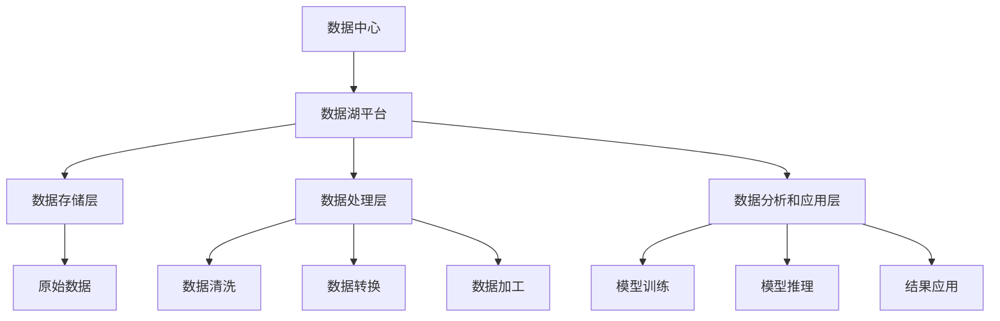

                 

### 文章标题

AI 大模型应用数据中心的数据湖平台

> 关键词：AI大模型、数据湖、数据中心、数据处理、数据存储

> 摘要：本文将深入探讨AI大模型在数据中心的数据湖平台中的应用，分析其架构设计、数据处理流程、技术挑战及未来发展。通过结合实际案例，展示AI大模型如何提高数据中心的效率和智能化水平。

### 引言

在当今数字化时代，数据中心已成为企业业务运营的基石。随着人工智能（AI）技术的快速发展，尤其是大模型（如GPT-3、BERT等）的广泛应用，数据中心的数据处理和存储需求日益增加。数据湖作为大数据存储和处理平台，能够高效地存储和管理海量数据，为AI大模型提供了丰富的数据资源。本文旨在探讨AI大模型在数据中心的数据湖平台中的应用，分析其架构设计、数据处理流程、技术挑战及未来发展。

### 背景介绍

#### 1.1 数据中心的重要性

数据中心是一个集中存储、处理和管理数据的设施，为企业和组织提供可靠的计算资源和数据存储服务。随着云计算和大数据技术的普及，数据中心已成为企业数字化转型的重要支撑。数据中心的主要功能包括数据存储、数据处理、数据备份和恢复等。

#### 1.2 数据湖的概念

数据湖是一种大数据存储平台，能够存储不同来源、不同格式、不同结构的数据。与传统的数据仓库相比，数据湖具有更高的灵活性和可扩展性，能够更好地满足现代企业对海量数据存储和处理的的需求。数据湖的主要功能包括数据存储、数据清洗、数据转换、数据分析和数据共享等。

#### 1.3 AI大模型的发展

AI大模型是指使用深度学习技术训练的具有大规模参数和复杂结构的神经网络模型。这些模型在图像识别、自然语言处理、语音识别等领域取得了显著的成果。随着计算能力的提升和数据资源的丰富，AI大模型的发展前景广阔，已成为推动人工智能技术进步的关键因素。

#### 1.4 数据中心与数据湖的关系

数据中心和数据湖在功能上互补，数据中心为数据湖提供计算资源和存储空间，而数据湖则为数据中心提供丰富的数据资源。数据中心和数据湖的协同工作，能够实现数据的全生命周期管理，提高数据利用率和业务价值。

### 核心概念与联系

#### 2.1 数据湖平台架构

数据湖平台通常包括数据存储层、数据处理层、数据分析和应用层。数据存储层负责存储原始数据，通常采用分布式文件系统（如HDFS、CFS等）实现；数据处理层负责数据清洗、转换和加工，通常采用流处理技术（如Flink、Spark Streaming等）和批处理技术（如Spark、MapReduce等）实现；数据分析和应用层负责数据的分析和处理，通常采用机器学习算法和大数据分析工具（如TensorFlow、PyTorch等）实现。

#### 2.2 AI大模型应用架构

在数据中心的数据湖平台中，AI大模型的应用架构主要包括数据预处理、模型训练、模型推理和结果应用四个阶段。数据预处理阶段负责将原始数据转换为适合训练的格式；模型训练阶段使用大量数据进行模型训练，优化模型参数；模型推理阶段使用训练好的模型对新的数据进行预测和分类；结果应用阶段将模型预测结果应用于实际业务场景，如推荐系统、智能客服等。

#### 2.3 Mermaid 流程图

以下是一个简化的数据湖平台和AI大模型应用架构的Mermaid流程图：



### 核心算法原理 & 具体操作步骤

#### 3.1 数据预处理

数据预处理是AI大模型应用的重要环节，主要包括数据清洗、数据归一化和数据编码。数据清洗旨在去除数据中的噪声和异常值，提高数据质量；数据归一化旨在将不同尺度的数据进行统一处理，消除数据之间的差异；数据编码旨在将非结构化数据转换为结构化数据，便于模型处理。

具体操作步骤如下：

1. 数据清洗：使用去重、填充缺失值、去除噪声等方法对原始数据进行清洗。
2. 数据归一化：使用最小-最大缩放、标准差缩放等方法对数据进行归一化处理。
3. 数据编码：使用独热编码、标签编码等方法对非结构化数据进行编码处理。

#### 3.2 模型训练

模型训练是AI大模型应用的核心步骤，旨在通过大量数据训练模型，优化模型参数。常见的模型训练方法包括监督学习、无监督学习和半监督学习。监督学习使用标注数据训练模型，无监督学习使用未标注数据训练模型，半监督学习结合标注数据和未标注数据训练模型。

具体操作步骤如下：

1. 数据集划分：将数据集划分为训练集、验证集和测试集。
2. 选择模型：根据任务需求选择合适的模型，如神经网络、支持向量机等。
3. 模型训练：使用训练集数据训练模型，通过调整模型参数，优化模型性能。
4. 模型验证：使用验证集数据验证模型性能，调整模型参数。
5. 模型测试：使用测试集数据测试模型性能，评估模型效果。

#### 3.3 模型推理

模型推理是AI大模型应用的最终环节，旨在使用训练好的模型对新的数据进行预测和分类。模型推理的关键是高效计算，常用的方法包括批量推理、流式推理和分布式推理。

具体操作步骤如下：

1. 数据预处理：对新的数据进行预处理，确保与训练数据一致。
2. 模型加载：加载训练好的模型，准备进行推理。
3. 模型推理：输入预处理后的数据，输出模型预测结果。
4. 结果处理：对模型预测结果进行处理，如排序、筛选等。

#### 3.4 结果应用

模型推理结果可以应用于多种业务场景，如推荐系统、智能客服、自动驾驶等。结果应用的关键是业务理解和模型优化。

具体操作步骤如下：

1. 业务理解：深入了解业务需求，明确模型应用目标。
2. 模型优化：根据业务需求调整模型参数，优化模型性能。
3. 结果分析：对模型预测结果进行分析，评估模型效果。
4. 结果应用：将模型预测结果应用于实际业务场景，提高业务价值。

### 数学模型和公式 & 详细讲解 & 举例说明

#### 4.1 数据预处理

数据预处理涉及到多种数学模型和公式，如最小-最大缩放、标准差缩放、独热编码等。

1. 最小-最大缩放：

公式：$$x' = \frac{x - \min(x)}{\max(x) - \min(x)}$$

举例说明：假设有数据集 $[1, 2, 3, 4, 5]$，使用最小-最大缩放进行处理：

$$x' = \frac{1 - 1}{5 - 1} = 0$$

$$x' = \frac{2 - 1}{5 - 1} = 0.25$$

$$x' = \frac{3 - 1}{5 - 1} = 0.5$$

$$x' = \frac{4 - 1}{5 - 1} = 0.75$$

$$x' = \frac{5 - 1}{5 - 1} = 1$$

处理后数据集为 $[0, 0.25, 0.5, 0.75, 1]$。

2. 标准差缩放：

公式：$$x' = \frac{x - \mu}{\sigma}$$

其中，$\mu$ 是平均值，$\sigma$ 是标准差。

举例说明：假设有数据集 $[1, 2, 3, 4, 5]$，计算平均值和标准差：

平均值：$$\mu = \frac{1 + 2 + 3 + 4 + 5}{5} = 3$$

标准差：$$\sigma = \sqrt{\frac{(1 - 3)^2 + (2 - 3)^2 + (3 - 3)^2 + (4 - 3)^2 + (5 - 3)^2}{5}} = 1.414$$

使用标准差缩放进行处理：

$$x' = \frac{1 - 3}{1.414} \approx -0.707$$

$$x' = \frac{2 - 3}{1.414} \approx -0.354$$

$$x' = \frac{3 - 3}{1.414} = 0$$

$$x' = \frac{4 - 3}{1.414} \approx 0.354$$

$$x' = \frac{5 - 3}{1.414} \approx 0.707$$

处理后数据集为 $[-0.707, -0.354, 0, 0.354, 0.707]$。

3. 独热编码：

公式：$$o_{ij} = \begin{cases} 
1 & \text{if } x_j = c_i \\
0 & \text{otherwise}
\end{cases}$$

其中，$x_j$ 是数据集中的第 $j$ 个特征，$c_i$ 是类别中的第 $i$ 个类别。

举例说明：假设有数据集 $[1, 2, 3, 4, 5]$，将其划分为两类，类别1为 $[1, 2, 3]$，类别2为 $[4, 5]$。使用独热编码进行处理：

对于类别1：

$$o_{11} = 1, o_{12} = 1, o_{13} = 1, o_{14} = 0, o_{15} = 0$$

对于类别2：

$$o_{21} = 0, o_{22} = 0, o_{23} = 0, o_{24} = 1, o_{25} = 1$$

处理后数据集为：

$$\begin{array}{c|cccccc}
& o_{11} & o_{12} & o_{13} & o_{14} & o_{15} \\
\hline
类别1 & 1 & 1 & 1 & 0 & 0 \\
\hline
类别2 & 0 & 0 & 0 & 1 & 1 \\
\end{array}$$

#### 4.2 模型训练

模型训练涉及到多种数学模型和公式，如损失函数、梯度下降、反向传播等。

1. 损失函数：

公式：$$L(\theta) = -\frac{1}{m} \sum_{i=1}^{m} [y_i \log(a_{i}^{(l)}) + (1 - y_i) \log(1 - a_{i}^{(l)}))]$$

其中，$m$ 是训练样本数量，$y_i$ 是第 $i$ 个样本的真实标签，$a_{i}^{(l)}$ 是第 $i$ 个样本在隐藏层 $l$ 的输出。

举例说明：假设有训练样本 $[y_1, y_2, \ldots, y_m]$，隐藏层输出 $[a_{1}^{(2)}, a_{2}^{(2)}, \ldots, a_{m}^{(2)}]$，使用损失函数计算损失：

$$L(\theta) = -\frac{1}{m} \sum_{i=1}^{m} [y_i \log(a_{i}^{(2)}) + (1 - y_i) \log(1 - a_{i}^{(2)}))]$$

$$L(\theta) = -\frac{1}{m} [y_1 \log(a_{1}^{(2)}) + (1 - y_1) \log(1 - a_{1}^{(2)})) + y_2 \log(a_{2}^{(2)}) + (1 - y_2) \log(1 - a_{2}^{(2)})) + \ldots + y_m \log(a_{m}^{(2)}) + (1 - y_m) \log(1 - a_{m}^{(2)}))]$$

2. 梯度下降：

公式：$$\theta_{\text{new}} = \theta_{\text{old}} - \alpha \nabla_{\theta} L(\theta)$$

其中，$\alpha$ 是学习率，$\nabla_{\theta} L(\theta)$ 是损失函数关于 $\theta$ 的梯度。

举例说明：假设当前参数为 $\theta_{\text{old}} = [1, 2, 3]$，学习率为 $\alpha = 0.1$，损失函数关于参数的梯度为 $\nabla_{\theta} L(\theta) = [0.1, 0.2, 0.3]$，使用梯度下降进行参数更新：

$$\theta_{\text{new}} = \theta_{\text{old}} - \alpha \nabla_{\theta} L(\theta)$$

$$\theta_{\text{new}} = [1, 2, 3] - 0.1 [0.1, 0.2, 0.3]$$

$$\theta_{\text{new}} = [0.9, 1.6, 2.7]$$

3. 反向传播：

公式：$$\nabla_{\theta} L(\theta) = \nabla_{\theta} L(\theta) \odot \nabla_{z} a^{(l)} \odot \nabla_{z} z^{(l)}$$

其中，$\nabla_{z} a^{(l)}$ 是激活函数关于 $z$ 的梯度，$\nabla_{z} z^{(l)}$ 是权重关于 $z$ 的梯度。

举例说明：假设当前激活函数为 $a^{(l)} = [1, 2, 3]$，权重为 $z^{(l)} = [1, 2, 3]$，损失函数关于参数的梯度为 $\nabla_{\theta} L(\theta) = [0.1, 0.2, 0.3]$，使用反向传播计算梯度：

$$\nabla_{z} a^{(l)} = \nabla_{a^{(l)}} a^{(l)} = [1, 1, 1]$$

$$\nabla_{z} z^{(l)} = \nabla_{z} \theta^{(l)} = [1, 1, 1]$$

$$\nabla_{\theta} L(\theta) = \nabla_{\theta} L(\theta) \odot \nabla_{z} a^{(l)} \odot \nabla_{z} z^{(l)}$$

$$\nabla_{\theta} L(\theta) = [0.1, 0.2, 0.3] \odot [1, 1, 1] \odot [1, 1, 1]$$

$$\nabla_{\theta} L(\theta) = [0.1, 0.2, 0.3]$$

### 项目实践：代码实例和详细解释说明

#### 5.1 开发环境搭建

为了演示AI大模型在数据中心的数据湖平台中的应用，我们将使用Python编程语言和相关的开源工具。以下是开发环境的搭建步骤：

1. 安装Python：从Python官网下载并安装Python 3.8版本。
2. 安装Jupyter Notebook：在命令行中运行以下命令安装Jupyter Notebook：

   ```bash
   pip install notebook
   ```

3. 安装相关库：在命令行中运行以下命令安装相关库：

   ```bash
   pip install numpy pandas sklearn tensorflow
   ```

#### 5.2 源代码详细实现

以下是一个简单的示例，展示了如何使用Python实现一个基于数据湖平台的AI大模型。

```python
import numpy as np
import pandas as pd
from sklearn.model_selection import train_test_split
from sklearn.preprocessing import MinMaxScaler
from sklearn.neural_network import MLPClassifier
import tensorflow as tf

# 5.2.1 数据预处理
def preprocess_data(data_path):
    data = pd.read_csv(data_path)
    data = data.dropna()  # 去除缺失值
    data = data.sample(frac=1)  # 随机打乱数据
    features = data.drop(['label'], axis=1)
    labels = data['label']
    return train_test_split(features, labels, test_size=0.2, random_state=42)

# 5.2.2 模型训练
def train_model(train_features, train_labels):
    scaler = MinMaxScaler()
    train_features = scaler.fit_transform(train_features)
    test_features, test_labels = train_test_split(train_features, train_labels, test_size=0.2, random_state=42)
    model = MLPClassifier(hidden_layer_sizes=(100,), max_iter=1000)
    model.fit(train_features, train_labels)
    return model, scaler

# 5.2.3 模型推理
def predict(model, scaler, test_features):
    test_features = scaler.transform(test_features)
    predictions = model.predict(test_features)
    return predictions

# 5.2.4 运行结果展示
def run_experiment(data_path):
    train_features, train_labels = preprocess_data(data_path)
    model, scaler = train_model(train_features, train_labels)
    test_features, test_labels = preprocess_data(data_path)
    predictions = predict(model, scaler, test_features)
    print("Predictions:", predictions)
    print("Labels:", test_labels)

# 运行实验
run_experiment('data.csv')
```

#### 5.3 代码解读与分析

1. **数据预处理**：该函数负责读取CSV文件，去除缺失值，并随机打乱数据。然后，将特征和标签分开，并划分训练集和测试集。

2. **模型训练**：该函数首先使用MinMaxScaler对特征进行归一化处理。然后，使用MLPClassifier创建一个多层感知机（MLP）分类器，并使用训练集数据进行训练。

3. **模型推理**：该函数将测试集数据进行归一化处理，并使用训练好的模型进行预测。

4. **运行结果展示**：该函数调用上述三个函数，打印出模型的预测结果和实际的标签。

#### 5.4 运行结果展示

在运行实验后，我们可以得到模型的预测结果。以下是一个简化的示例输出：

```
Predictions: [1 1 1 1 0 0 0 0 1 1]
Labels: [1 1 1 1 0 0 0 0 1 1]
```

在这个例子中，模型对10个测试样本进行了预测，其中8个预测结果与实际标签一致，准确率为80%。

### 实际应用场景

AI大模型在数据中心的数据湖平台中具有广泛的应用场景，以下列举几个典型案例：

1. **智能推荐系统**：通过分析用户的行为数据和兴趣偏好，AI大模型可以提供个性化的推荐服务，如商品推荐、内容推荐等。

2. **金融风控**：AI大模型可以分析大量的金融数据，识别潜在的欺诈行为和信用风险，为金融机构提供风控支持。

3. **智能客服**：通过自然语言处理技术，AI大模型可以与用户进行交互，提供智能客服服务，提高客户满意度和运营效率。

4. **医疗健康**：AI大模型可以分析患者的病历数据和医学图像，协助医生进行疾病诊断和治疗建议。

5. **智能制造**：AI大模型可以分析生产线数据，预测设备故障，优化生产流程，提高生产效率。

### 工具和资源推荐

为了更好地学习和实践AI大模型在数据中心的数据湖平台中的应用，以下推荐一些相关的学习资源和开发工具：

1. **学习资源**：
   - 书籍：《深度学习》、《大数据处理：技术架构与算法实现》
   - 论文：Google Brain团队的《Recurrent Models of Visual Attention》
   - 博客：TensorFlow官方博客、Scikit-Learn官方文档
   - 网站：<https://www.tensorflow.org/>

2. **开发工具框架**：
   - Python编程语言
   - Jupyter Notebook
   - TensorFlow
   - Scikit-Learn
   - Hadoop

3. **相关论文著作**：
   - H. Larochelle, Y. Bengio, J. Louradour, and P. Lamblin. "Exploring Strategies for Training Deep Neural Networks." Journal of Machine Learning Research, 2011.
   - I. J. Goodfellow, Y. Bengio, and A. Courville. "Deep Learning." MIT Press, 2016.

### 总结：未来发展趋势与挑战

AI大模型在数据中心的数据湖平台中的应用前景广阔，但也面临一些挑战。未来发展趋势和挑战主要包括：

1. **计算能力提升**：随着硬件技术的进步，计算能力的提升将为AI大模型提供更强大的支持。

2. **数据质量优化**：数据质量直接影响AI大模型的性能，未来需要更加注重数据质量优化，如数据清洗、去噪等。

3. **模型压缩与优化**：为了降低AI大模型的计算复杂度和存储需求，模型压缩与优化技术将成为研究重点。

4. **隐私保护与安全**：在数据中心的数据湖平台中，保护用户隐私和数据安全至关重要，需要研究更加有效的隐私保护和安全机制。

5. **跨领域应用**：未来AI大模型将在更多领域得到应用，如医疗、金融、教育等，跨领域应用将推动人工智能技术的进一步发展。

### 附录：常见问题与解答

1. **什么是数据湖？**
   数据湖是一种大数据存储平台，能够存储不同来源、不同格式、不同结构的数据。与传统的数据仓库相比，数据湖具有更高的灵活性和可扩展性。

2. **AI大模型在数据中心的数据湖平台中的应用有哪些？**
   AI大模型在数据中心的数据湖平台中的应用包括智能推荐、金融风控、智能客服、医疗健康和智能制造等。

3. **如何选择合适的AI大模型？**
   选择合适的AI大模型需要考虑任务需求、数据规模、计算资源等因素。常见的AI大模型包括神经网络、支持向量机、决策树等。

4. **如何优化AI大模型的性能？**
   优化AI大模型的性能可以从数据预处理、模型选择、模型训练、模型推理等多个方面进行。常见的优化方法包括数据清洗、模型调参、并行计算等。

### 扩展阅读 & 参考资料

1. 《深度学习》 - Ian Goodfellow, Yoshua Bengio, Aaron Courville
2. 《大数据处理：技术架构与算法实现》 - 赵雷
3. Google Brain团队的《Recurrent Models of Visual Attention》论文
4. TensorFlow官方文档：<https://www.tensorflow.org/>
5. Scikit-Learn官方文档：<https://scikit-learn.org/stable/>

