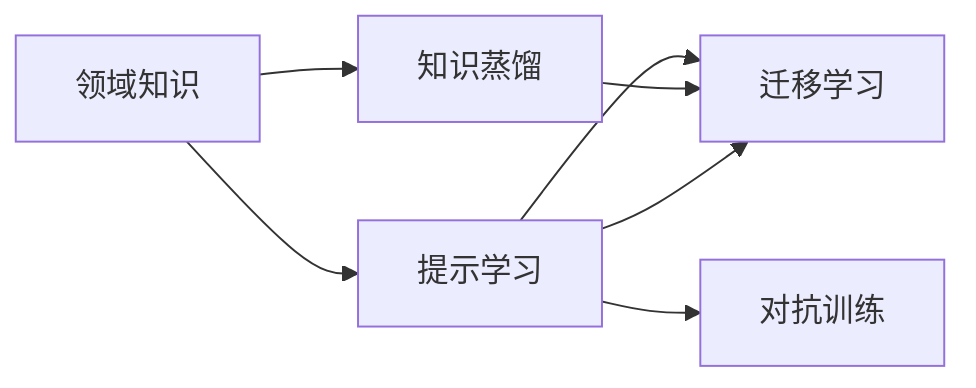

                 

# 直觉与理性：洞察力的双重来源

直觉与理性，是人类智慧的双翼。在复杂的科技世界中，二者相辅相成，为我们提供了洞察力和创造力的双重来源。本文将深入探讨直觉与理性的概念、联系及在人工智能领域的实践，并通过数学模型和代码实例进行详细讲解。

## 1. 背景介绍

### 1.1 问题由来

随着人工智能技术的飞速发展，直觉与理性的关系在人工智能的理论与实践中变得尤为重要。从早期的专家系统到当前的深度学习，直觉与理性的融合不仅提升了人工智能系统的性能，也拓展了其应用范围。

在传统的专家系统中，知识由领域专家手工构建和编码，依赖于专家的经验和理性思考。然而，专家系统往往难以处理非结构化数据，且需要大量的规则和案例支持，难以扩展到更多领域。

在深度学习中，直觉的融入主要通过迁移学习、知识蒸馏、提示学习等方式实现。这些技术不仅提升了模型的泛化能力，也在一定程度上弥补了深度学习系统的“黑盒”特性。

### 1.2 问题核心关键点

- **直觉**：指基于经验、感性的快速判断和决策能力，依赖于人类专家对领域知识的深度理解。
- **理性**：指基于数学、逻辑的严谨推导和分析，依赖于算法和模型的准确性和可解释性。
- **直觉与理性的融合**：通过设计合适的算法和技术，将人类专家的经验知识和机器学习的理性分析结合起来，提升系统的整体性能。

## 2. 核心概念与联系

### 2.1 核心概念概述

- **领域知识**：指特定领域内专家的知识和经验，是直觉的基础。
- **知识蒸馏**：指通过学习源模型和目标模型之间的知识关系，使目标模型在有限的标签下学习源模型的行为。
- **提示学习**：指在模型输入中引入特定的提示信息，引导模型进行特定任务的处理。
- **迁移学习**：指通过在多个任务间共享知识，提升模型在特定任务上的性能。
- **对抗训练**：指通过引入对抗样本，增强模型的鲁棒性和泛化能力。

### 2.2 Mermaid流程图

以下是一个简化的Mermaid流程图，展示了直觉与理性在人工智能中的联系：



这个流程图展示了领域知识如何通过知识蒸馏、提示学习、迁移学习和对抗训练等技术，与理性分析相结合，提升人工智能系统的整体性能。

## 3. 核心算法原理 & 具体操作步骤

### 3.1 算法原理概述

在人工智能中，直觉与理性的融合通常通过以下几个步骤实现：

1. **知识获取**：从领域专家那里获取知识，包括规则、案例和经验。
2. **知识编码**：将知识转化为算法或模型可用的形式，如规则库、特征提取器或数据增强技术。
3. **知识融合**：将知识与算法或模型结合，提升系统的性能和泛化能力。
4. **知识更新**：通过在线学习或持续训练，不断更新知识库和模型，以适应新的数据和任务。

### 3.2 算法步骤详解

以下是一个具体的知识蒸馏算法步骤：

1. **构建源模型**：使用有标签的数据训练一个高精度的源模型。
2. **构建目标模型**：使用无标签或少量标签数据训练一个低精度的目标模型。
3. **知识蒸馏**：通过将源模型的输出作为目标模型的训练标签，将源模型的知识传递给目标模型。
4. **优化目标模型**：使用目标模型训练数据和源模型的输出作为标签，优化目标模型。
5. **评估和迭代**：评估目标模型的性能，并根据需要对源模型和目标模型进行迭代优化。

### 3.3 算法优缺点

**优点**：
- 通过结合领域知识和机器学习算法，提升模型的泛化能力和性能。
- 可以减少对标注数据的依赖，降低开发成本。
- 可以提升模型的解释性和可理解性。

**缺点**：
- 知识获取和编码可能面临复杂性和成本问题。
- 知识融合和更新需要不断迭代和调整。
- 知识可能过时或无法覆盖所有情况。

### 3.4 算法应用领域

知识蒸馏和提示学习等技术已经在自然语言处理、计算机视觉、语音识别等多个领域得到了广泛应用。例如：

- **自然语言处理**：使用知识蒸馏提升语言模型在特定任务上的性能，如文本分类、情感分析等。
- **计算机视觉**：使用知识蒸馏提升图像分类、目标检测等任务的精度。
- **语音识别**：使用知识蒸馏提升语音识别系统的鲁棒性和泛化能力。

## 4. 数学模型和公式 & 详细讲解

### 4.1 数学模型构建

以知识蒸馏为例，定义源模型和目标模型的输出分别为 $y_s$ 和 $y_t$，目标模型的预测输出为 $\hat{y}_t$。知识蒸馏的目标是使得 $\hat{y}_t$ 与 $y_s$ 尽可能接近，公式如下：

$$
\min_{\theta_t} \mathcal{L}(\hat{y}_t, y_s) + \lambda \mathcal{L}(\hat{y}_t, y_t)
$$

其中 $\mathcal{L}$ 为损失函数，$\theta_t$ 为目标模型的参数。

### 4.2 公式推导过程

为了最小化知识蒸馏损失，通常采用最大似然估计或均方误差等损失函数。以下以最大似然估计为例，推导目标模型的损失函数：

$$
\mathcal{L}(\hat{y}_t, y_s) = -\sum_{i=1}^n \log \frac{e^{\hat{y}_{t,i}}}{\sum_{j=1}^n e^{\hat{y}_{t,j}}}
$$

目标模型的损失函数为：

$$
\mathcal{L}(\hat{y}_t, y_t) = \frac{1}{2}\sum_{i=1}^n (\hat{y}_{t,i} - y_{t,i})^2
$$

综合两个损失函数，得到总损失函数：

$$
\mathcal{L}(\hat{y}_t, y_s) + \lambda \mathcal{L}(\hat{y}_t, y_t)
$$

### 4.3 案例分析与讲解

以一个简单的文本分类任务为例，假设我们有一个有标签的数据集，其中每条数据包含一段文本和相应的标签。我们可以首先使用有标签的数据训练一个高精度的源模型（如BERT），然后使用无标签的数据训练一个低精度的目标模型（如一个小型线性分类器）。通过知识蒸馏，目标模型可以学习到源模型在特定任务上的知识，从而提升其性能。

## 5. 项目实践：代码实例和详细解释说明

### 5.1 开发环境搭建

为了进行知识蒸馏的实践，需要安装必要的深度学习框架和库。以下是Python环境下的环境配置步骤：

1. 安装Python 3.7以上版本，建议使用Anaconda或Miniconda。
2. 安装PyTorch、TensorFlow等深度学习框架。
3. 安装必要的库，如Numpy、Scikit-learn等。

```bash
conda create -n pytorch-env python=3.7
conda activate pytorch-env
conda install pytorch torchvision torchaudio cudatoolkit=11.1 -c pytorch -c conda-forge
conda install numpy scipy scikit-learn
```

### 5.2 源代码详细实现

以下是一个使用知识蒸馏的文本分类任务的代码实现：

```python
import torch
import torch.nn as nn
from torch.utils.data import DataLoader
from torch.optim import Adam
from transformers import BertForSequenceClassification, BertTokenizer

# 加载数据集
train_dataset = ...
val_dataset = ...
test_dataset = ...

# 定义模型
model = BertForSequenceClassification.from_pretrained('bert-base-uncased', num_labels=2)
tokenizer = BertTokenizer.from_pretrained('bert-base-uncased')

# 定义蒸馏模型
distill_model = BertForSequenceClassification.from_pretrained('bert-base-uncased', num_labels=2)
distill_model.train(False)

# 定义优化器
optimizer = Adam(model.parameters(), lr=1e-5)

# 定义训练函数
def train_epoch(model, dataset, distill_model, optimizer):
    model.train()
    dataloader = DataLoader(dataset, batch_size=32, shuffle=True)
    loss = 0
    for batch in dataloader:
        inputs, labels = batch
        inputs = tokenizer(inputs, return_tensors='pt', padding=True, truncation=True)
        with torch.no_grad():
            logits = distill_model(**inputs)[0]
        optimizer.zero_grad()
        loss = nn.CrossEntropyLoss()(model(**inputs)[0], labels)
        loss.backward()
        optimizer.step()
    return loss.item()

# 训练模型
epochs = 5
for epoch in range(epochs):
    train_loss = train_epoch(model, train_dataset, distill_model, optimizer)
    val_loss = evaluate(model, val_dataset, distill_model)
    print(f'Epoch {epoch+1}, train loss: {train_loss:.3f}, val loss: {val_loss:.3f}')

# 评估模型
def evaluate(model, dataset, distill_model):
    model.eval()
    dataloader = DataLoader(dataset, batch_size=32, shuffle=False)
    loss = 0
    for batch in dataloader:
        inputs, labels = batch
        inputs = tokenizer(inputs, return_tensors='pt', padding=True, truncation=True)
        logits = model(**inputs)[0]
        loss += nn.CrossEntropyLoss()(logits, labels).item()
    return loss / len(dataloader)

# 测试模型
test_loss = evaluate(model, test_dataset, distill_model)
print(f'Test loss: {test_loss:.3f}')
```

### 5.3 代码解读与分析

上述代码中，我们使用了BertForSequenceClassification模型进行文本分类任务。在训练函数中，我们首先通过无标签数据训练蒸馏模型，并将蒸馏模型的输出作为标签，用于优化目标模型。在评估函数中，我们同样使用蒸馏模型的输出作为标签，用于计算模型性能。

通过这种方式，目标模型能够有效地学习到源模型在特定任务上的知识，从而提升其性能。需要注意的是，为了保证蒸馏过程的有效性，源模型和目标模型需要具有相似的架构和参数设置。

## 6. 实际应用场景

### 6.1 智能客服系统

在智能客服系统中，直觉与理性可以相结合，提升系统的响应速度和准确性。通过收集历史对话数据，我们可以使用知识蒸馏方法将专家的经验知识传递给模型，提升其理解和回复的能力。例如，可以将专家编写的常见问题解答（FAQ）作为知识源，训练一个源模型，然后使用客户对话数据训练目标模型，通过知识蒸馏方法，目标模型可以学习到专家FAQ的回复逻辑，提高对客户问题的理解能力。

### 6.2 金融舆情监测

金融舆情监测中，直觉与理性可以结合使用，提升系统的实时性和准确性。例如，可以使用知识蒸馏方法将专家的金融知识传递给模型，提升其对市场动态的敏感性和预测能力。同时，通过持续训练，模型可以不断学习新的市场信息和金融知识，保持其时效性。

### 6.3 个性化推荐系统

个性化推荐系统中，直觉与理性可以结合使用，提升系统的个性化推荐效果。例如，可以使用知识蒸馏方法将专家的推荐策略传递给模型，提升其推荐能力。同时，通过持续训练，模型可以不断学习用户行为数据和市场信息，保持其推荐策略的动态性和个性化。

## 7. 工具和资源推荐

### 7.1 学习资源推荐

- **Coursera**：提供NLP和深度学习的课程，涵盖知识蒸馏、提示学习等主题。
- **arXiv**：提供最新的NLP和AI研究论文，了解前沿技术。
- **GitHub**：查找开源项目和代码实现，学习实践技巧。

### 7.2 开发工具推荐

- **PyTorch**：深度学习框架，支持动态计算图和多种模型架构。
- **TensorFlow**：深度学习框架，支持分布式计算和模型优化。
- **Keras**：高级深度学习框架，简化模型构建和训练过程。

### 7.3 相关论文推荐

- **Knowledge Distillation**：论文首次提出知识蒸馏的概念，奠定知识蒸馏的基础。
- **A Few-shot Learning with Mixture-of-Experts Pre-training**：提出基于专家混合预训练的知识蒸馏方法。
- **Prompt-based Few-shot Learning**：提出基于提示学习的少样本学习方法，实现零样本和少样本任务。

## 8. 总结：未来发展趋势与挑战

### 8.1 总结

本文通过实例详细探讨了直觉与理性在人工智能中的融合，并介绍了知识蒸馏等关键技术。通过这些技术，我们可以有效地结合领域知识和机器学习算法，提升模型的泛化能力和性能。

### 8.2 未来发展趋势

未来的发展趋势包括以下几个方向：

1. **自适应知识蒸馏**：通过动态调整知识蒸馏策略，适应不同领域和任务的需求。
2. **多模态知识蒸馏**：将不同模态的数据和知识结合，提升系统的综合性能。
3. **智能知识蒸馏**：通过引入智能算法，如强化学习、对抗学习等，提升知识蒸馏的效果。

### 8.3 面临的挑战

面临的挑战包括以下几个方面：

1. **知识获取和编码**：获取和编码领域知识是一个复杂且耗时的过程。
2. **知识更新**：需要持续更新知识库和模型，以保持其时效性和适应性。
3. **知识泛化**：模型需要能够在不同领域和任务中泛化，避免过拟合。
4. **知识蒸馏算法**：需要开发更高效和有效的知识蒸馏算法，提升模型性能。

### 8.4 研究展望

未来的研究可以从以下几个方向进行探索：

1. **自适应知识蒸馏算法**：开发能够自适应调整知识蒸馏策略的算法，提升模型性能。
2. **多模态知识蒸馏**：将不同模态的数据和知识结合，提升系统的综合性能。
3. **智能知识蒸馏**：通过引入智能算法，如强化学习、对抗学习等，提升知识蒸馏的效果。
4. **知识蒸馏与迁移学习的结合**：结合知识蒸馏和迁移学习，提升模型的泛化能力和性能。

## 9. 附录：常见问题与解答

**Q1: 知识蒸馏的原理是什么？**

A: 知识蒸馏的原理是将源模型的知识（如特征表示、决策逻辑等）传递给目标模型，使目标模型在有限的标签下学习源模型的行为，从而提升其性能。

**Q2: 知识蒸馏有哪些步骤？**

A: 知识蒸馏的基本步骤包括构建源模型、构建目标模型、知识蒸馏、优化目标模型和评估和迭代。

**Q3: 知识蒸馏有哪些优势？**

A: 知识蒸馏可以减少对标注数据的依赖，提升模型的泛化能力和性能，增强模型的解释性和可理解性。

**Q4: 知识蒸馏有哪些挑战？**

A: 知识获取和编码复杂，知识更新需要持续进行，模型需要具有泛化能力，知识蒸馏算法需要优化。

**Q5: 知识蒸馏有哪些应用？**

A: 知识蒸馏在自然语言处理、计算机视觉、语音识别等多个领域得到广泛应用，提升了模型在特定任务上的性能。

---

作者：禅与计算机程序设计艺术 / Zen and the Art of Computer Programming

