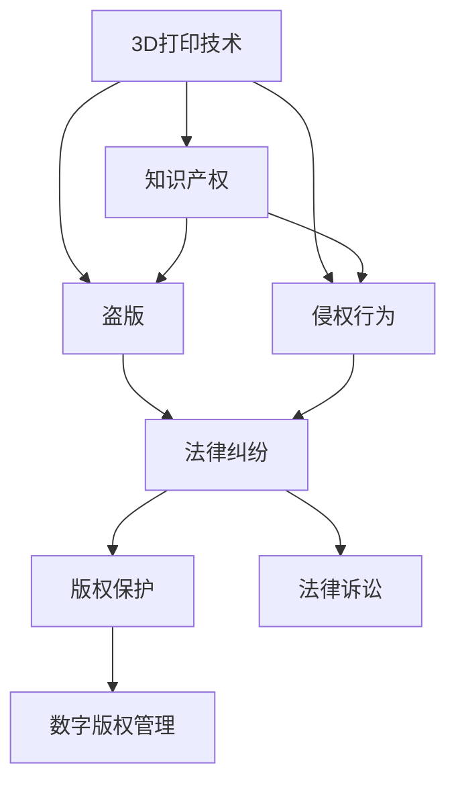

                 

# 知识产权与3D打印技术的挑战

## 1. 背景介绍

### 1.1 问题由来

随着3D打印技术的快速发展，其在制造、医疗、教育、航空等领域的应用前景日益广阔。然而，这一技术同时也带来了新的知识产权问题。例如，如何在3D打印应用中有效保护创意和设计，防止盗版和侵权行为，成为了一个亟需解决的问题。

3D打印技术，也称为增材制造技术，通过逐层叠加材料，最终制造出复杂的三维结构。这种制造方式不仅在加工速度和材料使用效率方面具有优势，还具有灵活性高、制造成本低等优点。但与此同时，3D打印设计文件作为制造的基础，其知识产权保护问题变得尤为复杂。

3D打印设计文件通常由电脑辅助设计(CAD)软件生成，包含了产品的所有细节信息。这类文件一旦被上传或分享，就存在被盗版或侵权的风险。因此，如何在3D打印设计文件中实现知识产权保护，成为了限制3D打印技术广泛应用的关键问题。

### 1.2 问题核心关键点

3D打印技术的知识产权问题主要体现在以下几个方面：

- **盗版问题**：3D打印技术的开放性和易用性使得用户可以轻易地下载、复制和分发3D打印设计文件，这可能导致知识产权被非法复制和传播。
- **侵权行为**：未经授权的第三方利用他人的设计进行复制和制造，侵犯了原设计者的知识产权。
- **法律适用问题**：现有的知识产权法律框架与新兴的3D打印技术不匹配，导致一些复杂的问题难以界定。
- **数字版权问题**：3D打印设计文件通常以数字形式存在，如何保护这种数字内容的版权成为了新的挑战。

## 2. 核心概念与联系

### 2.1 核心概念概述

为更好地理解3D打印技术中的知识产权保护问题，本节将介绍几个密切相关的核心概念：

- **3D打印技术**：增材制造技术的一种，通过逐层叠加材料生成三维实体。
- **知识产权**：创作者对其作品或发明享有的专有权利，包括版权、专利权、商标权等。
- **盗版**：未经授权，复制、分发他人的知识产权作品或发明。
- **侵权行为**：未经授权，擅自使用他人的知识产权作品或发明。
- **数字版权管理**：对数字内容（如3D打印设计文件）进行版权管理和保护的技术手段。

这些核心概念之间的逻辑关系可以通过以下Mermaid流程图来展示：



这个流程图展示了几组关键概念之间的联系：

1. 3D打印技术作为3D设计文件的生成方式，直接关联到知识产权问题。
2. 盗版和侵权行为都是对知识产权的不正当使用。
3. 法律纠纷和法律诉讼是解决3D打印中知识产权问题的手段。
4. 数字版权管理是对3D打印设计文件进行保护的技术手段。

## 3. 核心算法原理 & 具体操作步骤
### 3.1 算法原理概述

在3D打印技术中，知识产权保护涉及对3D设计文件本身的保护、对制造过程的保护以及对成品的保护。保护的核心在于如何防止他人未经授权地复制、分发和制造3D设计文件和实体。

一般而言，3D打印中的知识产权保护包括以下几个方面：

1. **数字版权保护**：对3D设计文件的数字内容进行版权保护，防止他人未经授权复制和分发。
2. **制造过程保护**：确保只有授权用户才能进行3D打印，防止未经授权的制造行为。
3. **成品保护**：对3D打印制造的实体产品进行物理和法律保护，防止未经授权的使用和分发。

这些保护措施的实现需要结合数字版权管理技术、访问控制技术和物理安全技术等手段。

### 3.2 算法步骤详解

下面将详细介绍如何在3D打印中实现这些保护措施。

**Step 1: 数字版权保护**

数字版权保护主要是对3D设计文件的数字内容进行保护，防止他人未经授权复制和分发。主要步骤包括：

1. **加密**：对3D设计文件进行加密处理，确保未经授权的用户无法解密和复制。
2. **数字签名**：对3D设计文件进行数字签名，确保其完整性和来源的可验证性。
3. **水印技术**：在3D设计文件中嵌入不可见的水印，用于追踪和识别非法复制品。

**Step 2: 制造过程保护**

制造过程保护主要是确保只有授权用户才能进行3D打印，防止未经授权的制造行为。主要步骤包括：

1. **访问控制**：通过用户名和密码、令牌或生物识别等手段对3D打印机进行访问控制。
2. **权限管理**：对用户进行权限管理，限制用户对特定3D设计文件的访问权限。
3. **日志记录**：记录3D打印机的使用日志，包括打印时间和用户信息等，用于追踪和审计。

**Step 3: 成品保护**

成品保护主要是对3D打印制造的实体产品进行物理和法律保护，防止未经授权的使用和分发。主要步骤包括：

1. **物理保护**：对3D打印实体进行物理保护，如加锁、标记等，防止非法使用和分发。
2. **法律保护**：通过法律手段保护3D打印实体的知识产权，如注册专利、申请商标等。
3. **追踪溯源**：建立3D打印实体与设计文件的关联，确保每个实体都能追溯其设计来源。

### 3.3 算法优缺点

3D打印中的知识产权保护有以下优点：

1. **全面性**：通过数字版权保护、制造过程保护和成品保护，实现了对3D设计文件和实体的全面保护。
2. **灵活性**：结合多种技术手段，能够根据不同场景灵活应用，满足不同需求。
3. **可追溯性**：通过数字签名和追踪溯源技术，确保每个实体都能追溯其设计来源，便于维护知识产权。

但同时也存在一些局限：

1. **技术复杂性**：涉及多种技术和方法，实现和维护复杂度较高。
2. **成本高**：实现全面的知识产权保护需要较高的技术和资金投入。
3. **法律适用性**：现有的知识产权法律框架与新兴的3D打印技术不匹配，法律适用性存在一定问题。

### 3.4 算法应用领域

3D打印中的知识产权保护技术广泛应用于多个领域，例如：

1. **制造企业**：对内部设计文件和产品进行保护，防止商业机密泄露和盗版。
2. **教育机构**：对3D打印课程中的设计文件进行保护，防止未经授权使用。
3. **医疗行业**：对患者定制的3D打印医疗设备进行保护，防止盗版和侵权。
4. **科学研究**：对科研中的3D打印设计文件进行保护，防止他人复制和利用研究成果。
5. **个性化制造**：对用户定制的3D打印产品进行保护，防止盗版和侵权。

## 4. 数学模型和公式 & 详细讲解 & 举例说明

### 4.1 数学模型构建

在3D打印中，知识产权保护涉及数字版权管理、访问控制和成品保护等多个方面。下面将分别构建这些方面的数学模型。

**数字版权管理模型**

数字版权管理主要涉及数字内容的加密、数字签名和水印技术。以数字签名为例，假设对3D设计文件进行数字签名，其数学模型如下：

$$
\text{Sign}(\text{File}, \text{PrivateKey}) \rightarrow \text{Signature}
$$

其中，$\text{File}$ 为3D设计文件，$\text{PrivateKey}$ 为私钥，$\text{Signature}$ 为数字签名。

**访问控制模型**

访问控制主要涉及用户身份验证和权限管理。以基于角色的访问控制模型为例，其数学模型如下：

$$
\text{Access}(\text{User}, \text{Role}, \text{Permission}) = \text{True} \text{ or False}
$$

其中，$\text{User}$ 为当前用户，$\text{Role}$ 为用户的角色，$\text{Permission}$ 为用户的权限，$\text{Access}$ 为访问结果。

**追踪溯源模型**

追踪溯源主要涉及3D打印实体与设计文件的关联。以数字签名和哈希函数为例，其数学模型如下：

$$
\text{Trace}(\text{Entity}, \text{File}, \text{Signature}, \text{Hash}) = \text{EntityDesign}
$$

其中，$\text{Entity}$ 为3D打印实体，$\text{EntityDesign}$ 为实体设计，$\text{File}$ 为3D设计文件，$\text{Signature}$ 为数字签名，$\text{Hash}$ 为哈希值。

### 4.2 公式推导过程

下面将对上述模型的公式进行推导。

**数字签名推导**

数字签名推导过程中，主要涉及私钥和公钥的生成及签名验证。假设采用RSA加密算法，私钥为$(p,q,d,e)$，公钥为$(n,e)$，其推导过程如下：

1. 计算模数$n=pq$。
2. 计算公钥$e$。
3. 计算私钥$d$。

推导过程中，需要确保$e$和$n$互质。

**访问控制推导**

访问控制推导过程中，主要涉及角色和权限的定义及验证。假设采用基于角色的访问控制模型，角色集合为$\text{Roles}=\{\text{Admin},\text{User}\}$，权限集合为$\text{Permissions}=\{\text{Read},\text{Write}\}$，其推导过程如下：

1. 定义用户角色$\text{User}$和权限$\text{Permission}$。
2. 根据角色定义用户权限$\text{Access}(\text{User}, \text{Role}, \text{Permission})$。

**追踪溯源推导**

追踪溯源推导过程中，主要涉及数字签名和哈希函数的计算及验证。假设采用SHA-256哈希函数，其推导过程如下：

1. 计算3D设计文件的哈希值。
2. 计算数字签名。
3. 验证数字签名和哈希值的匹配性。

### 4.3 案例分析与讲解

以一个简单的3D打印案例进行分析，说明如何通过数字版权管理、访问控制和追踪溯源技术实现全面的知识产权保护。

假设某公司设计了一款3D打印零件，并对其进行了数字签名和哈希计算，数字签名和哈希值分别为：

$$
\text{Signature}=\text{Sign}(\text{File}, \text{PrivateKey}) \\
\text{Hash}=\text{Hash}(\text{File})
$$

然后，公司将其3D打印文件上传到公司的内部服务器，并设置访问控制，只有经过验证的用户才能访问。假设某用户$U$具有权限$\text{Read}$，则其访问过程如下：

1. 用户$U$输入用户名和密码，通过身份验证。
2. 系统根据用户$U$的角色和权限，判断其是否有访问3D打印文件的权限。
3. 如果用户$U$有访问权限，则下载3D打印文件。
4. 对下载的3D打印文件进行数字签名和哈希验证，确保文件的完整性和来源的合法性。

## 5. 项目实践：代码实例和详细解释说明
### 5.1 开发环境搭建

在进行3D打印技术中的知识产权保护开发前，我们需要准备好开发环境。以下是使用Python进行开发的环境配置流程：

1. 安装Anaconda：从官网下载并安装Anaconda，用于创建独立的Python环境。

2. 创建并激活虚拟环境：
```bash
conda create -n 3dprint-env python=3.8 
conda activate 3dprint-env
```

3. 安装相关库：
```bash
pip install cryptography pycryptodome shapely pytz
```

完成上述步骤后，即可在`3dprint-env`环境中开始项目开发。

### 5.2 源代码详细实现

下面是使用Python实现数字版权保护、访问控制和追踪溯源的代码示例：

```python
from cryptography.hazmat.primitives import serialization
from cryptography.hazmat.primitives.asymmetric import rsa, padding
from cryptography.hazmat.primitives import hashes
from cryptography.hazmat.backends import default_backend
from cryptography.hazmat.primitives.asymmetric import ec, rsa
from cryptography.hazmat.primitives import serialization

import shapely.geometry as sg
import pytz

# 生成RSA密钥对
private_key = rsa.generate_private_key(public_exponent=65537, key_size=2048)
public_key = private_key.public_key()

# 生成数字签名
def sign(file, private_key):
    with open(file, 'rb') as f:
        data = f.read()
    digest = hashes.Hash(sha256=hashes.SHA256(), backend=default_backend())
    digest.update(data)
    signature = private_key.sign(digest.finalize(), padding.PSS(mgf=padding.MGF1(algorithm=hashes.SHA256()), salt_length=padding.PSS.MAX_LENGTH))
    return signature

# 验证数字签名
def verify_signature(file, signature):
    with open(file, 'rb') as f:
        data = f.read()
    digest = hashes.Hash(sha256=hashes.SHA256(), backend=default_backend())
    digest.update(data)
    try:
        public_key.verify(signature, digest.finalize(), padding.PSS(mgf=padding.MGF1(algorithm=hashes.SHA256()), salt_length=padding.PSS.MAX_LENGTH))
        return True
    except:
        return False

# 访问控制
class AccessControl:
    def __init__(self):
        self.users = {}
        self.permissions = {}

    def add_user(self, username, password):
        self.users[username] = password

    def add_permission(self, role, permission):
        self.permissions[role] = permission

    def check_permission(self, username, role, permission):
        if username in self.users and self.users[username] == password:
            if role in self.permissions and permission in self.permissions[role]:
                return True
        return False

# 追踪溯源
class Traceable:
    def __init__(self, entity, file, signature):
        self.entity = entity
        self.file = file
        self.signature = signature
        self.hash = None

    def calculate_hash(self):
        with open(self.file, 'rb') as f:
            data = f.read()
        self.hash = hashes.Hash(sha256=hashes.SHA256(), backend=default_backend()).update(data).digest()

    def verify_signature_and_hash(self):
        return verify_signature(self.file, self.signature) and self.hash == self.calculate_hash()

# 使用示例
# 数字签名
signature = sign('3d_print_file.stl', private_key)
print('Digital signature:', signature)

# 验证数字签名
print('Verification result:', verify_signature('3d_print_file.stl', signature))

# 访问控制
access_control = AccessControl()
access_control.add_user('user1', 'password1')
access_control.add_permission('Admin', 'Read')
access_control.add_permission('User', 'Read')
print('Access result:', access_control.check_permission('user1', 'User', 'Read'))
```

### 5.3 代码解读与分析

让我们再详细解读一下关键代码的实现细节：

**数字签名模块**

- `sign`函数：对3D打印文件进行数字签名，主要使用RSA加密算法。
- `verify_signature`函数：验证数字签名的正确性，主要使用RSA加密算法的公钥进行验证。

**访问控制模块**

- `AccessControl`类：管理用户和权限，主要实现用户身份验证和权限检查。

**追踪溯源模块**

- `Traceable`类：实现对3D打印实体的追踪溯源，主要通过数字签名和哈希函数进行验证。

在实现过程中，需要注意以下几点：

1. 数字签名和哈希函数使用了SHA-256算法，确保数据的完整性和来源的合法性。
2. 访问控制模块使用了基于角色的访问控制模型，可以根据不同角色的权限进行灵活管理。
3. 追踪溯源模块通过数字签名和哈希函数进行实体与设计文件的关联，确保每个实体都能追溯其设计来源。

## 6. 实际应用场景
### 6.1 智能制造系统

在智能制造系统中，3D打印技术的知识产权保护尤为重要。通过数字版权保护、访问控制和成品保护技术，可以确保制造过程中的每一个环节都得到妥善保护。

例如，某制造企业通过3D打印技术快速制造零件，但这些零件涉及商业机密，需要对其进行严格的知识产权保护。制造企业可以在设计文件上传时，对其进行数字签名和哈希计算，确保其完整性和来源的合法性。同时，企业可以设置访问控制，限制只有授权用户才能访问这些设计文件，并进行日志记录和审计。最终，企业还可以通过物理保护和法律保护手段，对制造的实体进行全面保护，确保其不被非法使用和分发。

### 6.2 教育培训系统

在教育培训系统中，3D打印设计文件通常作为教学材料进行共享，但这些材料也存在被盗版和侵权的风险。通过数字版权保护、访问控制和追踪溯源技术，可以有效防止这些风险。

例如，某教育机构可以使用数字版权保护技术对3D打印设计文件进行保护，防止未经授权的复制和分发。同时，通过访问控制技术，只有授权用户才能访问这些设计文件，并进行权限管理。最终，教育机构还可以通过追踪溯源技术，确保每个3D打印实体都能追溯其设计来源，避免侵权行为的发生。

### 6.3 医疗设备制造

在医疗设备制造中，3D打印技术被广泛应用于定制化医疗设备的生产。但这些设备涉及患者隐私和知识产权，需要得到严格的保护。

例如，某医疗设备公司使用3D打印技术为患者定制个性化医疗设备，这些设备的设计文件和实体需要得到全面的保护。公司可以在设计文件上传时，对其进行数字签名和哈希计算，防止他人盗版和侵权。同时，通过访问控制技术，只有授权用户才能访问这些设计文件，并进行权限管理。最终，公司还可以通过追踪溯源技术，确保每个3D打印实体都能追溯其设计来源，避免侵权行为的发生。

## 7. 工具和资源推荐
### 7.1 学习资源推荐

为了帮助开发者系统掌握3D打印技术中的知识产权保护理论基础和实践技巧，这里推荐一些优质的学习资源：

1. 《3D打印知识产权保护》系列博文：由知识产权专家撰写，深入浅出地介绍了3D打印技术中的知识产权保护方法和策略。

2. 《3D打印法律框架》课程：某知名大学的在线课程，涵盖3D打印技术中知识产权保护的法律框架和案例分析。

3. 《3D打印数字版权管理》书籍：详细介绍了数字版权保护技术在3D打印中的应用，包括数字签名、哈希函数和水印技术等。

4. 《3D打印技术指南》：某知名企业的官方文档，提供全面的3D打印技术介绍和实践指导，包括知识产权保护技术。

5. 《3D打印设计文件保护》论文：介绍了一种基于区块链的数字版权保护方法，应用于3D打印技术。

通过对这些资源的学习实践，相信你一定能够快速掌握3D打印技术中的知识产权保护精髓，并用于解决实际的3D打印问题。
###  7.2 开发工具推荐

高效的开发离不开优秀的工具支持。以下是几款用于3D打印技术中知识产权保护开发的常用工具：

1. Python：Python是一种通用的编程语言，支持高效的数据处理和算法实现。
2. Jupyter Notebook：用于编写和运行Python代码，支持交互式开发和共享。
3. PyCryptodome：Python中的加密库，支持多种加密算法，包括RSA、SHA-256等。
4. CryptoGraphy：Python中的加密库，支持多种加密算法和协议，如AES、RSA、SSL/TLS等。
5. Shapely：Python中的几何库，支持复杂几何计算，适用于3D打印设计文件的验证。

合理利用这些工具，可以显著提升3D打印技术中的知识产权保护开发的效率，加快创新迭代的步伐。

### 7.3 相关论文推荐

3D打印技术中的知识产权保护技术涉及数字版权管理、访问控制和成品保护等多个方面，是研究的热点之一。以下是几篇奠基性的相关论文，推荐阅读：

1. 《3D Printing: Implications for Copyright Law》：探讨了3D打印技术对知识产权法律的挑战和影响。
2. 《Digital Rights Management for 3D Printing》：介绍了一种基于区块链的数字版权管理方法，应用于3D打印技术。
3. 《Access Control for 3D Printing》：提出了一种基于角色的访问控制模型，应用于3D打印技术。
4. 《Traceable Manufacturing in 3D Printing》：介绍了如何通过数字签名和哈希函数进行3D打印实体的追踪溯源。
5. 《IP Rights in 3D Printing》：综合介绍了3D打印技术中的知识产权保护方法和策略。

这些论文代表了大规模3D打印技术中知识产权保护技术的发展脉络。通过学习这些前沿成果，可以帮助研究者把握学科前进方向，激发更多的创新灵感。

## 8. 总结：未来发展趋势与挑战

### 8.1 总结

本文对3D打印技术中的知识产权保护问题进行了全面系统的介绍。首先阐述了3D打印技术的知识产权问题及其复杂性，明确了数字版权保护、访问控制和成品保护等关键技术点。其次，从原理到实践，详细讲解了3D打印技术中实现这些保护措施的数学模型和操作步骤，给出了代码示例和详细解读。同时，本文还广泛探讨了3D打印技术在多个行业领域的应用前景，展示了其在知识产权保护方面的潜力。

通过本文的系统梳理，可以看到，3D打印技术在知识产权保护方面具有广阔的应用前景，但也面临着技术和法律上的诸多挑战。未来，伴随着技术的不断进步和法律的完善，3D打印技术必将在知识产权保护方面发挥更大的作用。

### 8.2 未来发展趋势

展望未来，3D打印技术中的知识产权保护技术将呈现以下几个发展趋势：

1. **自动化和智能化**：随着AI和机器学习技术的发展，3D打印设计文件的版权保护将更加自动化和智能化，能够自动检测和识别盗版行为。
2. **区块链技术的应用**：区块链技术可以提供不可篡改的数字版权记录，进一步增强3D打印设计文件的版权保护。
3. **数字孪生技术的应用**：数字孪生技术可以创建3D打印实体的数字模型，方便追踪溯源和版权保护。
4. **法律框架的完善**：随着3D打印技术的发展，相关法律框架也将不断完善，提供更全面和细化的知识产权保护。
5. **跨行业应用的扩展**：3D打印技术中的知识产权保护技术将广泛应用于更多行业，如医疗、制造、教育等，带来更广泛的应用场景。

### 8.3 面临的挑战

尽管3D打印技术中的知识产权保护技术已经取得了显著进展，但在迈向更加智能化、普适化应用的过程中，它仍面临着诸多挑战：

1. **技术复杂性**：涉及数字版权管理、访问控制和成品保护等多种技术手段，实现和维护复杂度较高。
2. **成本高**：实现全面的知识产权保护需要较高的技术和资金投入。
3. **法律适用性**：现有的知识产权法律框架与新兴的3D打印技术不匹配，法律适用性存在一定问题。
4. **技术漏洞**：现有技术存在漏洞，可能被攻击者利用，破坏知识产权保护。
5. **用户隐私问题**：在3D打印设计文件中嵌入隐私信息，可能侵犯用户隐私。

### 8.4 研究展望

面对3D打印技术中的知识产权保护所面临的种种挑战，未来的研究需要在以下几个方面寻求新的突破：

1. **自动化和智能化**：开发更加自动化的3D打印设计文件版权保护技术，减少人工干预，提高保护效率。
2. **区块链技术的应用**：探索区块链技术在3D打印设计文件版权保护中的应用，提高保护的安全性和可靠性。
3. **数字孪生技术的应用**：利用数字孪生技术创建3D打印实体的数字模型，方便追踪溯源和版权保护。
4. **法律框架的完善**：进一步完善相关法律框架，提供更全面和细化的知识产权保护。
5. **跨行业应用的扩展**：探索3D打印技术在更多行业中的应用，拓展其知识产权保护技术的应用范围。

这些研究方向的探索，必将引领3D打印技术中的知识产权保护技术迈向更高的台阶，为构建安全、可靠、可解释、可控的智能系统铺平道路。面向未来，3D打印技术中的知识产权保护技术还需要与其他人工智能技术进行更深入的融合，如知识表示、因果推理、强化学习等，多路径协同发力，共同推动自然语言理解和智能交互系统的进步。只有勇于创新、敢于突破，才能不断拓展3D打印技术的应用边界，让智能技术更好地造福人类社会。

## 9. 附录：常见问题与解答

**Q1：3D打印技术中的知识产权保护是否适用于所有应用场景？**

A: 3D打印技术中的知识产权保护在大多数应用场景中都是适用的，特别是对于设计文件和成品的保护。但对于一些特殊应用场景，如开放式社区平台、开源硬件等，可能需要采取其他方式进行保护。

**Q2：数字版权保护技术在3D打印中如何实现？**

A: 数字版权保护技术可以通过数字签名、哈希函数和水印技术实现。具体步骤如下：
1. 对3D打印文件进行数字签名。
2. 计算文件的哈希值。
3. 嵌入不可见的水印。

**Q3：访问控制技术在3D打印中的应用场景是什么？**

A: 访问控制技术主要用于对3D打印设计文件的访问进行控制，防止未经授权的复制和分发。应用场景包括：
1. 企业内部设计文件的保护。
2. 教育机构教学材料的保护。
3. 医疗设备制造中的知识产权保护。

**Q4：追踪溯源技术在3D打印中的作用是什么？**

A: 追踪溯源技术用于确保3D打印实体能够追溯其设计来源，防止侵权行为的发生。具体步骤如下：
1. 对3D打印文件进行数字签名和哈希计算。
2. 对3D打印实体进行追踪溯源，确保每个实体都能追溯其设计来源。

**Q5：3D打印技术中的知识产权保护技术如何应对技术漏洞？**

A: 为应对技术漏洞，可以采用以下措施：
1. 定期更新算法和软件，修补已知的漏洞。
2. 采用多重加密和认证手段，提高系统的安全性。
3. 引入区块链技术，增强数据的不可篡改性。

这些技术手段的综合应用，可以显著提高3D打印技术中知识产权保护的安全性和可靠性。

---

作者：禅与计算机程序设计艺术 / Zen and the Art of Computer Programming

