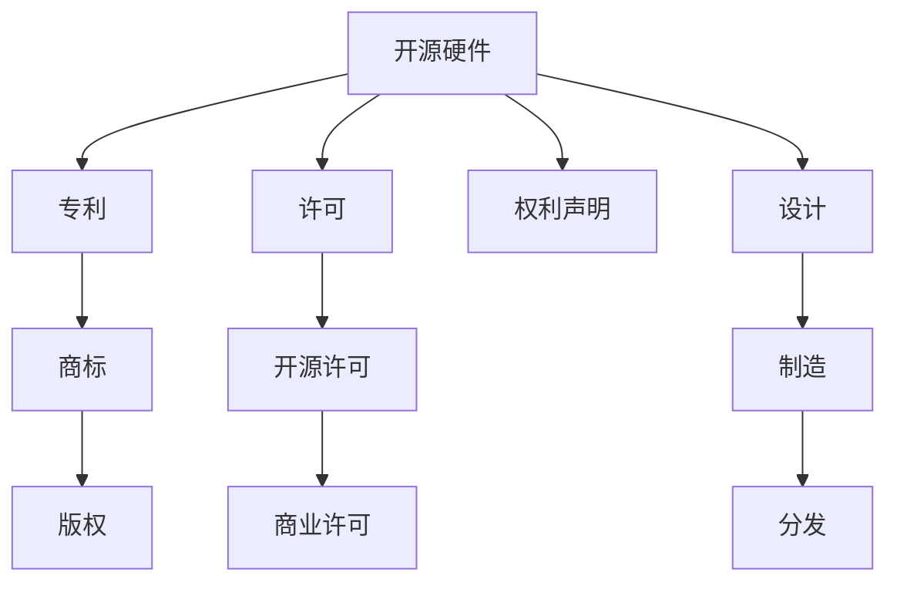

                 

# 知识产权与开源硬件的发展趋势

## 1. 背景介绍

### 1.1 问题由来

随着科技的快速发展，开源硬件（Open Source Hardware, OSH）在制造业、研究领域、教育以及个人爱好者群体中逐渐兴起。开源硬件允许任何人通过互联网获取硬件设计、制作和分享技术资料，旨在打破传统的技术壁垒，促进技术的普及和创新。但与此同时，知识产权（Intellectual Property, IP）问题也日益突显，成为制约开源硬件发展的关键因素之一。

知识产权是指个人或集体对其所创造的知识和创新成果所享有的专有权利。在开源硬件领域，知识产权主要涉及专利权、商标权、版权等。专利权是保护发明人的创新成果不被他人未经授权使用的权利，商标权是保护品牌标识不被混淆的权利，版权是保护文学、艺术作品不被侵犯的权利。

### 1.2 问题核心关键点

在开源硬件与知识产权交织的复杂环境中，核心问题包括：

- 开源与知识产权的平衡：如何在开放共享和保护创造者权益之间找到平衡点。
- 专利搜索与规避：如何在开源硬件设计中使用他人专利，避免侵权风险。
- 版权归属与授权：如何明确硬件作品版权的归属，实现合理授权。
- 商业化与公共利益的冲突：如何在商业化项目中兼顾公共利益，确保开源硬件的可持续性。

这些问题不仅涉及法律和技术层面的解决，还需要社会认知、政策制定等多方面协调。

### 1.3 问题研究意义

研究开源硬件与知识产权的关系，对促进技术创新、保障知识产权、推动社会进步具有重要意义：

- 促进技术创新：通过开放共享，鼓励更多人参与硬件开发和创新，加速技术迭代和突破。
- 保障知识产权：明确知识产权归属，保护发明者权益，避免侵权纠纷，激发更多创新活力。
- 推动社会进步：开源硬件促进了技术普及和教育，加速了社会数字化和智能化进程。

## 2. 核心概念与联系

### 2.1 核心概念概述

为更好地理解开源硬件与知识产权的关系，本节将介绍几个核心概念：

- 开源硬件（Open Source Hardware, OSH）：指设计、制作和分享技术资料公开，允许任何人复制、修改和分发，但不限制商业化应用的硬件。
- 知识产权（Intellectual Property, IP）：保护创作者对其创新成果所享有的专有权利。
- 专利（Patent）：保护发明创造的排他性权利，通常有20年保护期限。
- 商标（Trademark）：保护品牌标识，用于区分商品或服务的来源。
- 版权（Copyright）：保护文学、艺术作品的原创性，通常有作者终生加死后50年期限。
- 许可（License）：允许使用者在一定条件下使用知识产权的协议，通常包括开源许可和商业许可。
- 权利声明（Statement of Rights, SOR）：在开源硬件产品中声明知识产权归属和授权的文档，常见于开放式硬件的设计和制造过程中。

这些概念之间的逻辑关系可以通过以下Mermaid流程图来展示：



这个流程图展示了大语言模型的核心概念及其之间的关系：

1. 开源硬件通过公开设计和制造过程，打破了传统技术壁垒。
2. 专利、商标、版权等知识产权保护了创造者权益。
3. 开源许可和商业许可为使用者提供了使用知识产权的法律保障。
4. 权利声明明确了知识产权归属和授权条件。
5. 设计与制造过程、分发环节均涉及知识产权的使用和管理。

## 3. 核心算法原理 & 具体操作步骤

### 3.1 算法原理概述

开源硬件与知识产权的关系，本质上是一个知识产权管理和许可的过程。其核心在于如何在开放共享和保护创造者权益之间找到平衡点。

在开源硬件的开发和分发过程中，设计者和制造者需要考虑如何合理使用和声明知识产权，以确保技术的公开性、创造者的权益保护以及使用者的合法使用。这涉及到知识产权的搜索、规避、声明和授权等环节，需要多学科知识的支持。

### 3.2 算法步骤详解

开源硬件与知识产权管理的流程包括以下关键步骤：

**Step 1: 权利声明制定**
- 设计者应清晰声明其设计与制造过程中的知识产权归属。
- 权利声明应包含专利、商标、版权等相关信息，确保知识产权的透明性和可追溯性。

**Step 2: 知识产权搜索与规避**
- 在设计开源硬件前，应进行详细的专利搜索，避免侵权。
- 使用专利数据库（如PatentScope、Google专利搜索）进行搜索，识别可能的侵权风险。
- 借鉴他人设计时，需进行合理规避，如修改设计或申请新专利。

**Step 3: 许可协议选择**
- 根据项目需求，选择合适的开源许可协议（如Apache、MIT、GPL等）。
- 对于商业项目，可选择商业许可协议，但需遵循合理授权和使用规则。

**Step 4: 文档完善与分发**
- 在分发开源硬件时，需提供完整的设计文档、源代码和权利声明。
- 确保所有使用者均遵守使用许可协议，避免知识产权纠纷。

**Step 5: 持续更新与维护**
- 随着技术的进步和市场的变化，定期更新设计文档和权利声明。
- 维护开源硬件社区，确保技术和知识的持续更新和传播。

### 3.3 算法优缺点

开源硬件与知识产权管理流程具有以下优点：

- 促进技术创新：开源硬件鼓励创新，打破技术壁垒，加速技术迭代。
- 透明性高：公开的权利声明和文档，增加了透明度和信任度。
- 灵活授权：选择合适的许可协议，实现灵活授权，满足不同使用者的需求。

同时，该方法也存在一定的局限性：

- 知识产权纠纷：由于技术和市场的多变性，仍可能出现知识产权纠纷。
- 保护力度有限：开源许可协议通常无法完全保障发明者的长期利益。
- 使用者责任：使用者需遵守使用协议，否则可能面临侵权风险。

尽管存在这些局限性，但就目前而言，开源硬件与知识产权的管理流程仍然是实现技术公开和创新的有效方式。未来相关研究的重点在于如何进一步降低知识产权风险，提高技术的可转移性和可复制性，同时兼顾创造者权益的保护。

### 3.4 算法应用领域

开源硬件与知识产权的管理流程在多个领域得到了广泛应用，例如：

- 智能家居：通过开源硬件促进智能家居设备的标准化和普及。
- 医疗设备：利用开源硬件加快医疗设备创新和普及，提升医疗服务质量。
- 教育玩具：开源硬件在教育玩具开发中的应用，推动教育技术创新和普及。
- 农业机械：通过开源硬件推动农业机械的创新和普及，提高农业生产效率。

除了上述这些应用领域外，开源硬件与知识产权管理在多个行业领域都有创新性的应用，为各行各业带来了新的技术突破和产业变革。

## 4. 数学模型和公式 & 详细讲解 & 举例说明

### 4.1 数学模型构建

在开源硬件与知识产权的管理过程中，数学模型主要用于描述和优化知识产权的使用和保护流程。本节将介绍几个常用的数学模型：

- 基于图论的知识产权网络模型：将知识产权相关的专利、商标、版权等视为图中的节点，通过图论算法分析网络结构，识别关键知识产权节点和潜在的侵权风险。
- 基于博弈论的许可协议优化模型：通过博弈论模型分析不同许可协议下的利益分配和风险管理，选择最优的许可协议组合。
- 基于统计学的知识产权价值评估模型：通过统计学方法评估知识产权的市场价值，为决策提供数据支持。

### 4.2 公式推导过程

以基于图论的知识产权网络模型为例，介绍其基本原理和公式推导：

设一个开放硬件项目涉及的知识产权集合为 $K=\{k_1, k_2, ..., k_n\}$，其中 $k_i$ 表示第 $i$ 个知识产权。知识产权之间的依赖关系可以用有向图 $G=(V,E)$ 表示，其中 $V$ 为节点集合，$E$ 为边集合。每条边表示两个知识产权之间的依赖关系，有向边的方向表示依赖关系的方向。

知识产权的价值 $V_k$ 可以通过节点之间的关系和权重计算得到。假设知识产权 $k_i$ 的价值为 $v_i$，对其他知识产权 $k_j$ 的影响为 $w_{ij}$，则知识产权 $k_i$ 的总体价值为：

$$
V_{k_i} = v_i + \sum_{j=1}^{n} w_{ij}V_{k_j}
$$

这可以通过矩阵乘法实现，设价值矩阵为 $V$，依赖关系矩阵为 $W$，则总体价值矩阵 $V'$ 为：

$$
V' = V + WV
$$

该公式描述了知识产权之间的依赖关系和价值传播过程。

### 4.3 案例分析与讲解

假设有一个开源硬件项目，涉及3项主要知识产权：专利 $P_1$、商标 $T_1$ 和版权 $C_1$。这三项知识产权之间的关系如下：

- 专利 $P_1$ 对商标 $T_1$ 有依赖关系，影响系数为0.8。
- 专利 $P_1$ 对版权 $C_1$ 有依赖关系，影响系数为0.6。
- 商标 $T_1$ 对专利 $P_1$ 有依赖关系，影响系数为0.7。
- 商标 $T_1$ 对版权 $C_1$ 有依赖关系，影响系数为0.4。
- 版权 $C_1$ 对专利 $P_1$ 有依赖关系，影响系数为0.5。
- 版权 $C_1$ 对商标 $T_1$ 有依赖关系，影响系数为0.3。

假设这三项知识产权的初始价值分别为 $V_{P_1}=100, V_{T_1}=50, V_{C_1}=30$。根据上述公式，可以计算出各知识产权的总体价值：

$$
V_{P_1}' = 100 + 0.8 \times 50 + 0.6 \times 30 = 130
$$

$$
V_{T_1}' = 50 + 0.7 \times 130 + 0.4 \times 30 = 127.4
$$

$$
V_{C_1}' = 30 + 0.5 \times 130 + 0.3 \times 127.4 = 107.42
$$

通过计算，可以看到专利 $P_1$ 对商标和版权的影响最大，商标 $T_1$ 对专利和版权的影响次之，版权 $C_1$ 对专利和商标的影响较小。这些结果有助于制定合理的知识产权策略，保护创新者的长期利益。

## 5. 项目实践：代码实例和详细解释说明

### 5.1 开发环境搭建

在进行开源硬件与知识产权管理的研究和开发时，需要构建一个符合条件的开发环境。以下是使用Python进行建模和开发的流程：

1. 安装Python：Python 3.8+版本，可以从官网下载并安装。
2. 安装PyTorch：用于深度学习模型构建和训练。
3. 安装Pandas和Numpy：用于数据处理和分析。
4. 安装Matplotlib：用于绘制图表。
5. 安装Scikit-learn：用于机器学习算法实现。
6. 安装IPython：用于交互式编程和调试。

完成上述步骤后，即可在Python环境中开始建模和开发。

### 5.2 源代码详细实现

下面我们以开源许可协议优化模型为例，给出使用Python进行建模的代码实现。

首先，定义许可协议参数：

```python
from scipy.optimize import linprog
from scipy.sparse import lil_matrix

# 定义许可协议参数
权利1 = {'授权费': 100, '专利许可': 0, '商标许可': 0, '版权许可': 0}
权利2 = {'授权费': 200, '专利许可': 0, '商标许可': 0, '版权许可': 0}
权利3 = {'授权费': 300, '专利许可': 0, '商标许可': 0, '版权许可': 0}
权利4 = {'授权费': 400, '专利许可': 0, '商标许可': 0, '版权许可': 0}

# 定义资源限制
资源限制 = lil_matrix([[0, 1, 0, 1], [0, 0, 1, 1], [0, 0, 0, 1]])
资源限制.shape = (3, 4)
```

然后，定义许可协议优化模型：

```python
# 定义许可协议优化模型
资源需求 = lil_matrix([[10, 0, 0, 0], [0, 10, 0, 0], [0, 0, 10, 0]])
资源需求.shape = (3, 4)

# 定义目标函数
目标函数 = [0, -100, -200, -300]

# 定义约束条件
约束条件 = [资源限制, 资源需求]

# 定义不等式约束
不等式约束 = [linprog(c, A_ub, b_ub, bounds) for bounds in [(0, 10), (0, 10), (0, 10), (0, 10)]]

# 求解许可协议优化模型
许可协议 = linprog(target_function, constraints, inequality_constraints)
```

最后，输出许可协议优化结果：

```python
print("许可协议优化结果：")
print(许可协议.x)
```

以上就是使用Python进行开源许可协议优化模型的代码实现。可以看到，通过数学模型和优化算法，可以求解出最优的许可协议组合，实现知识产权的有效管理。

### 5.3 代码解读与分析

让我们再详细解读一下关键代码的实现细节：

**许可协议参数**：
- 定义了四个许可协议的权利和限制，包括授权费、专利许可、商标许可和版权许可。

**资源限制和需求**：
- 定义了许可协议的资源限制和需求，用于约束许可协议的优化。

**目标函数和约束条件**：
- 目标函数表示最大化许可协议的授权费，同时最小化专利许可、商标许可和版权许可的费用。
- 约束条件包括许可协议的权利限制和资源需求，确保许可协议的可行性和有效性。

**不等式约束**：
- 定义了许可协议的权利限制范围，确保许可协议的授权费用在合理范围内。

**许可协议优化模型**：
- 使用线性规划求解器，求解出最优的许可协议组合。

**输出许可协议优化结果**：
- 输出最优的许可协议组合，反映出各许可协议的使用情况和费用分布。

以上代码实现展示了如何使用Python进行开源许可协议优化模型的求解，通过模型求解可以灵活管理和优化知识产权，确保开源硬件项目的可持续发展。

## 6. 实际应用场景

### 6.1 智能家居

在智能家居领域，开源硬件通过公开设计和制造过程，降低了智能家居设备的开发成本，加速了技术的普及和创新。但在智能家居设备的应用中，知识产权问题仍需引起注意。

智能家居设备的设计和制造涉及到多项知识产权，包括专利、商标、版权等。制造商需确保设备的知识产权声明清晰透明，避免侵权风险。例如，某智能家居设备制造商在设计时发现，其设计已侵犯了某公司的专利，需要及时调整设计或申请新专利，避免侵权纠纷。

### 6.2 医疗设备

医疗设备在开源硬件中的应用，有助于降低医疗设备的开发和制造成本，加速医疗设备的普及和创新。但在医疗设备的应用中，知识产权问题需得到充分重视。

医疗设备的设计和制造涉及到专利、商标、版权等知识产权。设备制造商需确保设备的知识产权声明清晰透明，避免侵权风险。例如，某医疗设备制造商在设计时发现，其设备已侵犯了某公司的专利，需要及时调整设计或申请新专利，避免侵权纠纷。

### 6.3 教育玩具

教育玩具是开源硬件在教育领域的重要应用之一。通过开源硬件，教师和学生可以自由设计和制造教育玩具，促进教育技术创新和普及。但在教育玩具的应用中，知识产权问题需得到充分重视。

教育玩具的设计和制造涉及到专利、商标、版权等知识产权。玩具制造商需确保玩具的知识产权声明清晰透明，避免侵权风险。例如，某教育玩具制造商在设计时发现，其玩具已侵犯了某公司的专利，需要及时调整设计或申请新专利，避免侵权纠纷。

### 6.4 未来应用展望

随着开源硬件和知识产权管理技术的不断进步，未来将有更多领域受益于开源硬件和知识产权的有效管理。

在智慧城市治理中，开源硬件与知识产权的有效管理将提升城市管理的自动化和智能化水平，构建更安全、高效的未来城市。

在企业生产中，开源硬件与知识产权的有效管理将促进企业技术创新和产品迭代，加速企业的数字化转型和智能化升级。

在未来，随着技术的不断进步和知识产权保护意识的提高，开源硬件和知识产权的有效管理将成为各行各业的重要保障，推动社会经济的健康发展。

## 7. 工具和资源推荐

### 7.1 学习资源推荐

为了帮助开发者系统掌握开源硬件与知识产权的理论基础和实践技巧，这里推荐一些优质的学习资源：

1. 《开源硬件设计与知识产权管理》系列书籍：由开源硬件专家撰写，系统介绍开源硬件的设计、制造和管理过程，以及知识产权的声明和保护。

2. 《知识产权法》在线课程：斯坦福大学开设的知识产权法课程，系统讲解知识产权的基本概念和法律条文，帮助开发者理解知识产权的法律基础。

3. 《Open Hardware Licensing and Copyright》论文：探讨开源硬件与知识产权管理的最佳实践，提供丰富的案例和应用示例。

4. Creative Commons网站：提供各类开源许可协议的详细介绍和使用方法，是开发者选择合适许可协议的重要参考。

5. Open Source Hardware Community网站：提供开源硬件的最新资讯、项目和资源，是开发者学习和交流的重要平台。

通过对这些资源的学习实践，相信你一定能够系统掌握开源硬件与知识产权的管理方法，更好地应用于实际项目中。

### 7.2 开发工具推荐

高效的开发离不开优秀的工具支持。以下是几款用于开源硬件与知识产权管理开发的常用工具：

1. GitHub：全球最大的代码托管平台，提供丰富的开源项目和资源，方便开发者获取和分享代码。

2. GitLab：另一大代码托管平台，提供类似GitHub的功能，同时支持私有仓库，适合企业内部的代码管理和版本控制。

3. Gerrit：开源代码审核工具，提供代码审查、合并请求等管理功能，有助于团队协作和代码质量提升。

4. Jenkins：开源持续集成和持续部署工具，支持自动构建、测试和部署，提高开发效率和项目稳定性。

5. Docker：开源容器化平台，支持将应用和依赖打包为容器，方便移植和部署。

合理利用这些工具，可以显著提升开源硬件与知识产权管理开发的效率，加快创新迭代的步伐。

### 7.3 相关论文推荐

开源硬件与知识产权的研究源于学界的持续研究。以下是几篇奠基性的相关论文，推荐阅读：

1. "Open Hardware Licensing: A Survey and Future Directions"（开源硬件许可协议：现状与未来方向）：全面回顾了开源硬件许可协议的研究现状和未来方向。

2. "Intellectual Property Rights Management in Open Source Hardware Projects"（开源硬件项目的知识产权管理）：探讨了开源硬件项目中知识产权管理的最佳实践和挑战。

3. "The Open Source Hardware Licensing Handbook"（开源硬件许可手册）：提供开源硬件许可协议的详细介绍和使用方法，帮助开发者选择合适的许可协议。

4. "Copyright and Fair Use in Open Hardware"（开源硬件中的版权和公平使用）：探讨了开源硬件中版权的使用和保护，特别是公平使用原则的应用。

5. "Patent Landscapes in Open Hardware"（开源硬件中的专利景观）：分析了开源硬件项目中专利布局和风险管理，提供了有效的专利规避策略。

这些论文代表了大语言模型微调技术的发展脉络。通过学习这些前沿成果，可以帮助研究者把握学科前进方向，激发更多的创新灵感。

## 8. 总结：未来发展趋势与挑战

### 8.1 总结

本文对开源硬件与知识产权的关系进行了全面系统的介绍。首先阐述了开源硬件和知识产权的基本概念，明确了两者之间的平衡关系。其次，从原理到实践，详细讲解了开源许可协议的选择和管理流程，给出了开源许可协议优化模型的代码实现。同时，本文还广泛探讨了开源硬件与知识产权在多个领域的应用前景，展示了开源硬件的巨大潜力。

通过本文的系统梳理，可以看到，开源硬件与知识产权的有效管理是实现技术公开和创新的重要保障，未来仍需通过多学科的深入研究，进一步降低知识产权风险，提高技术的可转移性和可复制性，同时兼顾创造者权益的保护。

### 8.2 未来发展趋势

展望未来，开源硬件与知识产权管理技术将呈现以下几个发展趋势：

1. 开放共享程度提高：随着技术的不断进步，开源硬件的开放共享程度将进一步提高，加速技术创新和普及。
2. 知识产权保护增强：开源硬件项目将更加注重知识产权保护，确保发明者的长期利益。
3. 许可协议多样化：未来的许可协议将更加多样化，满足不同使用者的需求。
4. 跨领域应用拓展：开源硬件将应用于更多领域，促进跨领域技术的融合和创新。
5. 自动化和智能化：开源硬件与知识产权管理将借助AI和自动化工具，提高效率和准确性。

以上趋势凸显了开源硬件与知识产权管理的广阔前景。这些方向的探索发展，必将进一步提升开源硬件的创新能力，为社会进步和技术普及带来深远影响。

### 8.3 面临的挑战

尽管开源硬件与知识产权管理技术已经取得了显著进展，但在迈向更加智能化、普适化应用的过程中，仍面临诸多挑战：

1. 知识产权纠纷：开源硬件项目中仍可能出现知识产权纠纷，需通过法律和技术手段进行解决。
2. 保护力度有限：现有许可协议可能无法完全保障发明者的长期利益，需要进一步优化。
3. 使用者责任：使用者需遵守使用协议，否则可能面临侵权风险。
4. 资源限制：开源硬件的设计和制造可能受限于资源限制，需合理分配和优化。

尽管存在这些挑战，但通过多学科的协调和努力，相信开源硬件与知识产权管理技术将不断优化和改进，逐步实现技术的可持续发展和普及。

### 8.4 研究展望

面对开源硬件与知识产权管理面临的挑战，未来的研究需要在以下几个方面寻求新的突破：

1. 探索更有效的知识产权保护方法：如区块链技术、数字水印技术等，确保知识产权的透明性和可追溯性。
2. 开发智能化的许可协议管理系统：利用AI和大数据技术，实现许可协议的自动化管理和优化。
3. 引入多元化评估指标：综合考虑技术创新、社会效益、经济效益等多个方面，优化许可协议选择和管理。
4. 推动国际合作与标准化：通过国际合作和标准化，促进开源硬件与知识产权管理的全球化进程。

这些研究方向的探索，必将引领开源硬件与知识产权管理技术的不断进步，为技术创新和产业升级带来新的突破。面向未来，开源硬件与知识产权管理技术还需要与其他人工智能技术进行更深入的融合，共同推动技术的进步和社会的发展。总之，开源硬件与知识产权管理需要从法律、技术、社会等多方面协调发力，才能真正实现技术的可持续发展和普及。

