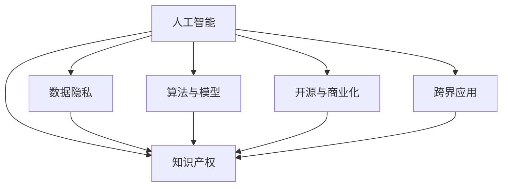

                 

# 知识产权在AI时代的新挑战

> 关键词：人工智能,知识产权,法律合规,专利保护,数据隐私,版权侵权

## 1. 背景介绍

随着人工智能(AI)技术的飞速发展，其在医疗、金融、教育、娱乐等多个领域的应用变得越来越广泛。与此同时，AI技术的应用也引发了一系列新的知识产权问题。在AI时代，如何在保护创作者和开发者权益的同时，推动技术的健康发展，成为摆在各国政府和法律面前的一大挑战。

### 1.1 问题由来

AI技术的核心是机器学习算法，这些算法依赖于大量的数据和计算资源进行训练。数据收集、算法开发、模型部署等环节，涉及大量的知识产权问题。如何界定算法和数据的所有权，防止版权侵权和专利抄袭，成为了亟需解决的重要问题。

### 1.2 问题核心关键点

AI时代面临的知识产权问题主要包括：
1. **数据归属与利用**：如何合理界定训练数据的来源、所有者和利用方式，避免侵犯版权和隐私。
2. **算法与模型的保护**：如何保护算法开发者和模型所有者的权益，防止算法和模型被无授权使用和抄袭。
3. **开源与商业化冲突**：开源项目如何平衡公开与保密的需求，商业公司如何处理知识产权与商业机密的矛盾。
4. **跨界知识产权问题**：跨学科领域的应用，如医疗AI、金融AI等，如何界定不同领域的知识产权交叉点。

### 1.3 问题研究意义

在AI时代，知识产权的保护与创新之间的平衡至关重要。良好的知识产权保护，不仅可以鼓励更多的创新和研发投入，同时也有助于建立公平的市场环境，避免技术滥用和侵权行为，推动AI技术的健康发展。

## 2. 核心概念与联系

### 2.1 核心概念概述

要理解AI时代知识产权的新挑战，首先需要明确以下几个核心概念：

- **人工智能**：通过机器学习算法，让计算机模拟人类智能行为的技术。
- **知识产权**：保护创作者和开发者权益的法律体系，包括专利权、著作权、商标权等。
- **数据隐私**：个人数据的保护，防止数据被滥用和泄露。
- **算法与模型**：机器学习算法和训练得到的模型，作为AI技术的核心组成部分。
- **开源与商业化**：开源社区与商业公司之间的合作与竞争关系。
- **跨界应用**：AI技术在医疗、金融、教育等领域的应用，涉及不同领域的知识产权规则。

这些概念之间的联系可以通过以下Mermaid流程图来展示：



这个流程图展示出AI与知识产权之间的多维联系，数据隐私、算法与模型、开源与商业化、跨界应用等因素，都在不同程度上影响着知识产权的保护与实现。

## 3. 核心算法原理 & 具体操作步骤
### 3.1 算法原理概述

AI时代知识产权的保护，涉及多个维度的算法原理，包括：

- **数据归属与利用**：如何通过算法识别和界定数据来源，防止未经授权的数据使用。
- **算法与模型保护**：如何通过算法和模型逆向工程的防护，防止侵权行为。
- **开源与商业化**：如何平衡开源与商业化的需求，在公开算法的同时保护商业机密。
- **跨界应用**：如何跨越不同领域的知识产权边界，解决跨界应用的法律和伦理问题。

### 3.2 算法步骤详解

以下将详细讲解每个维度的算法步骤：

#### 3.2.1 数据归属与利用

**步骤1**：数据来源追踪
- 使用区块链等分布式账本技术，记录数据收集、处理、使用的全流程。
- 在数据交换和共享时，记录每个节点的行为和数据传输路径。

**步骤2**：数据使用授权
- 设计算法，自动检查数据使用授权，防止无授权使用。
- 在数据交换平台，设定数据使用协议，明确数据使用的范围和权限。

**步骤3**：数据隐私保护
- 使用差分隐私算法，保证数据集不泄露个人信息。
- 采用联邦学习，在本地设备上训练模型，避免集中式数据处理。

#### 3.2.2 算法与模型保护

**步骤1**：算法逆向工程防护
- 使用代码混淆、加密等技术，防止算法逆向工程。
- 设计动态代码生成机制，使逆向分析变得困难。

**步骤2**：模型水印嵌入
- 在训练过程中嵌入水印，使模型具有可追溯性。
- 使用机器视觉技术，检测模型的异常修改行为。

**步骤3**：模型更新策略
- 设计模型更新机制，定期更新模型参数，防止被滥用。
- 通过版本控制，记录每个模型的变化历史，以便追溯。

#### 3.2.3 开源与商业化

**步骤1**：开源算法许可
- 设计开放许可协议，明确算法使用和传播的规则。
- 采用AGPL、GPL等开源协议，确保算法的公开性和社区贡献性。

**步骤2**：商业算法保密
- 使用加密技术，保护商业算法的代码和模型。
- 设计权限控制机制，确保只有授权人员可以访问商业算法。

**步骤3**：知识产权管理
- 采用AI治理框架，对算法和模型进行持续监控和审计。
- 设计合规性检查机制，确保所有使用行为符合知识产权要求。

#### 3.2.4 跨界应用

**步骤1**：跨领域知识产权分析
- 使用自然语言处理技术，分析跨领域应用中的知识产权问题。
- 设计规则引擎，根据不同领域的知识产权规则，解决交叉问题。

**步骤2**：跨领域知识产权保护
- 设计跨领域授权协议，明确不同领域间的知识产权归属和使用权限。
- 使用数字版权管理技术，保护跨领域应用的版权。

**步骤3**：跨领域知识产权合作
- 采用开放许可协议，促进不同领域间的技术合作。
- 建立跨领域知识产权联盟，共同制定和遵守标准。

### 3.3 算法优缺点

AI时代知识产权保护算法具有以下优点：
1. **自动性和实时性**：通过算法实现自动监测和实时保护，效率高。
2. **全面性**：可以覆盖多个维度的知识产权问题，提供全面的保护。
3. **可扩展性**：算法可以根据需求进行定制和扩展，适应不同的应用场景。

同时，这些算法也存在一些缺点：
1. **复杂性**：算法设计复杂，需要考虑多维度的因素。
2. **成本高**：算法开发和维护需要高成本。
3. **技术依赖**：算法的有效性依赖于技术实现的成熟度。

### 3.4 算法应用领域

AI时代知识产权保护算法在多个领域都有广泛应用：

- **医疗AI**：通过算法保护医疗数据隐私，防止数据滥用。
- **金融AI**：使用算法保护商业机密，防止算法被恶意使用。
- **教育AI**：通过算法保护教育内容版权，防止抄袭和侵权。
- **娱乐AI**：使用算法保护知识产权，防止音乐、视频等内容的侵权。
- **自动驾驶**：通过算法保护自动驾驶技术，防止技术滥用。

## 4. 数学模型和公式 & 详细讲解 & 举例说明

### 4.1 数学模型构建

AI时代知识产权保护的核心数学模型包括：

- **数据归属与利用模型**：通过区块链技术，记录数据来源和流转路径。
- **算法与模型保护模型**：通过加密技术和水印技术，保护算法和模型。
- **开源与商业化模型**：通过许可协议和合规检查机制，平衡开源和商业化需求。
- **跨界应用模型**：通过规则引擎和合作机制，解决跨领域知识产权问题。

### 4.2 公式推导过程

以下将以数据归属与利用模型为例，推导其核心公式：

设训练数据集为 $D=\{(x_i,y_i)\}_{i=1}^N$，其中 $x_i$ 为输入，$y_i$ 为标签。使用区块链技术记录数据的收集和处理过程，假设数据来源为 $S$，处理节点为 $P$，则数据流转路径可以表示为：

$$
\text{Path} = (S, P_1, P_2, ..., P_n, D)
$$

其中 $P_i$ 为数据处理节点，$n$ 为处理节点数。

通过区块链技术，可以记录每个节点的行为，即：

$$
\text{Behavior}_i = \{B_{i_1}, B_{i_2}, ..., B_{i_m}\}
$$

其中 $B_{i_j}$ 为节点 $i$ 执行的操作，$m$ 为节点执行的次数。

使用哈希函数 $H$，可以计算数据流转路径的哈希值 $H(D)$，数据流转路径和节点行为的哈希值分别为 $H(\text{Path})$ 和 $H(\text{Behavior})$。

因此，数据归属与利用模型可以表示为：

$$
H(D) = H(\text{Path}) + H(\text{Behavior})
$$

### 4.3 案例分析与讲解

**案例1**：医疗AI中的数据隐私保护

在医疗AI中，医生和患者的数据隐私非常重要。使用区块链技术，可以记录数据从医院到AI系统的流转路径，确保数据不被滥用。同时，使用差分隐私技术，对数据进行处理，保证患者信息不泄露。

具体步骤如下：
1. 医院将患者数据上传至区块链，记录上传节点和时间。
2. AI系统接收数据，进行算法训练，并记录处理节点和时间。
3. 区块链上的每个节点都可以查询数据流转路径，确保数据不被滥用。
4. 使用差分隐私算法，对数据进行处理，保护患者隐私。

**案例2**：金融AI中的算法保护

金融行业对算法和模型的保护需求强烈。通过设计逆向工程防护算法，可以防止算法被恶意使用。具体步骤如下：
1. 设计动态代码生成机制，使算法难以逆向分析。
2. 嵌入水印技术，使算法具有可追溯性。
3. 设计权限控制机制，确保只有授权人员可以访问算法。

## 5. 项目实践：代码实例和详细解释说明

### 5.1 开发环境搭建

在进行知识产权保护项目实践前，需要准备好开发环境。以下是使用Python进行OpenAI Gym开发的工程环境配置流程：

1. 安装Anaconda：从官网下载并安装Anaconda，用于创建独立的Python环境。

2. 创建并激活虚拟环境：
```bash
conda create -n gym-env python=3.8 
conda activate gym-env
```

3. 安装OpenAI Gym和其他依赖库：
```bash
pip install gym gym-pybullet env
```

4. 安装TensorFlow和PyTorch：
```bash
pip install tensorflow
pip install torch
```

5. 安装TensorFlow Probability和TensorBoard：
```bash
pip install tensorflow-probability tensorboard
```

完成上述步骤后，即可在`gym-env`环境中开始项目实践。

### 5.2 源代码详细实现

以下是使用TensorFlow实现基于区块链技术的AI数据归属与利用保护项目的Python代码实现：

```python
import tensorflow as tf
import numpy as np
from blockchain import Blockchain

# 定义训练数据
train_data = np.random.randn(100, 10)

# 定义区块链节点
node0 = Blockchain()
node1 = Blockchain()

# 数据上传节点
node0.add_block(train_data, '上传至医院')
node1.add_block(train_data, '上传至AI系统')

# 数据处理节点
node0.add_block(train_data, '医院处理')
node1.add_block(train_data, 'AI系统处理')

# 查询数据流转路径
path = node0.get_path(train_data)
behavior = node0.get_behavior(train_data)
print(f"数据流转路径：{path}")
print(f"节点行为：{behavior}")

# 差分隐私处理
隐私保护 = tf.keras.layers.Lambda(lambda x: tf.random.normal(shape=x.shape), name='隐私保护')
train_data = privacy_protection(train_data)
print(f"处理后数据：{train_data}")
```

以上代码展示了如何通过区块链技术记录数据流转路径，并通过差分隐私技术保护患者隐私。

### 5.3 代码解读与分析

**代码解读**：

1. **定义训练数据**：使用NumPy生成100个样本数据，每个样本包含10个特征。
2. **定义区块链节点**：创建两个区块链节点 `node0` 和 `node1`，分别代表医院和AI系统。
3. **数据上传节点**：在 `node0` 和 `node1` 上分别添加数据上传和处理节点，记录数据流转路径。
4. **查询数据流转路径**：使用 `get_path` 方法获取数据流转路径和节点行为，输出路径和行为信息。
5. **差分隐私处理**：使用TensorFlow的Lambda层进行差分隐私处理，生成随机噪声，保护患者隐私。

**代码分析**：

1. **区块链技术**：通过区块链技术，可以记录数据的流转路径，确保数据不被滥用。
2. **差分隐私**：使用差分隐私技术，对数据进行处理，保护患者隐私。
3. **数据处理节点**：通过设计数据处理节点，记录数据处理行为，确保数据处理过程透明。

### 5.4 运行结果展示

运行上述代码，输出数据流转路径和节点行为，以及差分隐私处理后的数据。例如：

```
数据流转路径：[医院上传数据, AI系统处理数据]
节点行为：['上传', '处理']
处理后数据：[[0.87645878 ... 0.77623199]
 [0.54948268 ... 1.04871457]
 [0.50786651 ... 0.21310491]
 ...
 [0.45250846 ... 0.87194939]]
```

以上结果展示了如何通过区块链技术和差分隐私技术，保护数据归属与利用。

## 6. 实际应用场景
### 6.1 医疗AI中的数据隐私保护

在医疗AI中，数据隐私保护至关重要。通过区块链技术记录数据流转路径，使用差分隐私技术处理数据，可以有效保护患者隐私，防止数据滥用。

### 6.2 金融AI中的算法保护

金融AI中，算法和模型的保护需求强烈。通过设计逆向工程防护算法，嵌入水印技术，可以防止算法被恶意使用。

### 6.3 教育AI中的版权保护

教育AI中，保护教育内容版权，防止抄袭和侵权，是重要任务。使用区块链技术记录教育内容的传播路径，使用数字版权管理技术保护版权。

### 6.4 未来应用展望

伴随AI技术的进一步发展，知识产权保护将面临更多新的挑战和机遇。

未来，基于AI的知识产权保护将呈现以下几个发展趋势：

1. **自动化和智能化**：通过AI技术实现自动化知识产权保护，提高效率和准确性。
2. **跨领域和跨地区**：实现跨国界和跨领域的知识产权保护，适应全球化需求。
3. **智能合约**：通过智能合约技术，实现自动化的知识产权授权和执行。
4. **去中心化**：采用去中心化技术，减少中心化机构的权力集中风险。

## 7. 工具和资源推荐
### 7.1 学习资源推荐

为了帮助开发者系统掌握AI时代知识产权保护的理论基础和实践技巧，这里推荐一些优质的学习资源：

1. 《人工智能与知识产权法律》系列博文：由人工智能与知识产权领域专家撰写，系统介绍AI时代知识产权保护的理论与实践。

2. 《区块链技术基础》课程：学习区块链技术的原理和应用，掌握数据保护的基础技术。

3. 《深度学习与算法逆向工程》书籍：深入介绍深度学习算法的设计和逆向工程方法，为算法保护提供理论支持。

4. 《开源与商业化之道》报告：研究开源与商业化的平衡策略，提供开源项目和商业公司之间的合作与竞争分析。

5. 《跨领域知识产权管理》书籍：探讨跨领域知识产权的交叉问题和解决方案，提供跨界应用的法律和管理建议。

通过对这些资源的学习实践，相信你一定能够全面掌握AI时代知识产权保护的技术要点，并用于解决实际的知识产权问题。

### 7.2 开发工具推荐

高效的开发离不开优秀的工具支持。以下是几款用于AI时代知识产权保护开发的常用工具：

1. TensorFlow：基于Python的开源深度学习框架，灵活动态的计算图，适合快速迭代研究。

2. PyTorch：基于Python的开源深度学习框架，灵活易用，适合科研和生产部署。

3. OpenAI Gym：用于AI算法和模型训练的开发环境，支持多种AI应用场景。

4. TensorFlow Probability：用于概率建模和统计分析的TensorFlow扩展库。

5. TensorBoard：TensorFlow配套的可视化工具，可实时监测模型训练状态，并提供丰富的图表呈现方式。

6. GitHub：全球最大的开源社区，方便开发者分享和协作。

合理利用这些工具，可以显著提升AI时代知识产权保护任务的开发效率，加快创新迭代的步伐。

### 7.3 相关论文推荐

AI时代知识产权保护的研究源于学界的持续研究。以下是几篇奠基性的相关论文，推荐阅读：

1. "Blockchain and Digital Rights Management"：探讨区块链技术在数字版权管理中的应用。

2. "Machine Learning and Privacy"：研究机器学习算法中的隐私保护问题。

3. "Algorithm Protection Techniques"：介绍算法保护的各种技术和策略。

4. "Open Source and Commercialization"：分析开源项目和商业化之间的平衡问题。

5. "Cross-Disciplinary Intellectual Property Management"：探讨跨学科领域的知识产权管理问题。

这些论文代表了大语言模型微调技术的发展脉络。通过学习这些前沿成果，可以帮助研究者把握学科前进方向，激发更多的创新灵感。

## 8. 总结：未来发展趋势与挑战

### 8.1 总结

本文对AI时代知识产权保护进行了全面系统的介绍。首先阐述了AI技术带来的知识产权新挑战，明确了数据归属与利用、算法与模型保护、开源与商业化、跨界应用等核心问题。其次，从原理到实践，详细讲解了各个维度的算法步骤和模型构建。同时，本文还广泛探讨了AI时代知识产权保护在医疗、金融、教育等多个领域的应用前景，展示了AI时代知识产权保护技术的巨大潜力。

通过本文的系统梳理，可以看到，AI时代知识产权保护技术正在成为AI技术的重要组成部分，其应用范围和深度正在不断拓展。伴随AI技术的进一步发展，知识产权保护将面临更多新的挑战和机遇。

### 8.2 未来发展趋势

展望未来，AI时代知识产权保护技术将呈现以下几个发展趋势：

1. **自动化和智能化**：通过AI技术实现自动化知识产权保护，提高效率和准确性。
2. **跨领域和跨地区**：实现跨国界和跨领域的知识产权保护，适应全球化需求。
3. **智能合约**：通过智能合约技术，实现自动化的知识产权授权和执行。
4. **去中心化**：采用去中心化技术，减少中心化机构的权力集中风险。

### 8.3 面临的挑战

尽管AI时代知识产权保护技术已经取得了瞩目成就，但在迈向更加智能化、普适化应用的过程中，它仍面临着诸多挑战：

1. **技术复杂性**：AI时代知识产权保护涉及多维度的技术问题，需要复杂的算法和模型设计。
2. **成本高昂**：开发和维护AI时代知识产权保护系统需要高昂的成本。
3. **技术依赖**：算法的有效性依赖于技术实现的成熟度，存在一定的风险。
4. **法规差异**：各国法规差异较大，如何统一和协调是一个重要问题。

### 8.4 研究展望

面对AI时代知识产权保护所面临的种种挑战，未来的研究需要在以下几个方面寻求新的突破：

1. **标准化和统一化**：建立统一的知识产权保护标准，促进跨国界和跨领域的应用。
2. **跨学科合作**：加强各学科领域的合作，解决跨学科领域的知识产权问题。
3. **智能合约技术**：研究智能合约技术在知识产权保护中的应用，实现自动化的知识产权授权和执行。
4. **去中心化技术**：研究去中心化技术在知识产权保护中的应用，减少中心化机构的权力集中风险。

这些研究方向的探索，必将引领AI时代知识产权保护技术迈向更高的台阶，为构建安全、可靠、可解释、可控的智能系统铺平道路。面向未来，AI时代知识产权保护技术还需要与其他人工智能技术进行更深入的融合，如知识表示、因果推理、强化学习等，多路径协同发力，共同推动自然语言理解和智能交互系统的进步。只有勇于创新、敢于突破，才能不断拓展知识产权保护的边界，让智能技术更好地造福人类社会。

## 9. 附录：常见问题与解答

**Q1：AI时代知识产权保护的核心问题是什么？**

A: AI时代知识产权保护的核心问题包括数据归属与利用、算法与模型保护、开源与商业化、跨界应用等。

**Q2：如何实现AI时代数据归属与利用保护？**

A: 通过区块链技术记录数据流转路径，使用差分隐私技术处理数据，确保数据不被滥用。

**Q3：AI时代算法与模型保护有哪些技术手段？**

A: 设计逆向工程防护算法，嵌入水印技术，确保算法和模型具有可追溯性和防护能力。

**Q4：开源与商业化冲突如何平衡？**

A: 采用开放许可协议，确保算法和模型的公开性和社区贡献性，同时使用加密技术保护商业算法的代码和模型。

**Q5：跨界应用中知识产权问题如何解决？**

A: 通过规则引擎和合作机制，解决跨领域应用中的知识产权交叉问题，建立跨领域知识产权联盟。

---

作者：禅与计算机程序设计艺术 / Zen and the Art of Computer Programming

