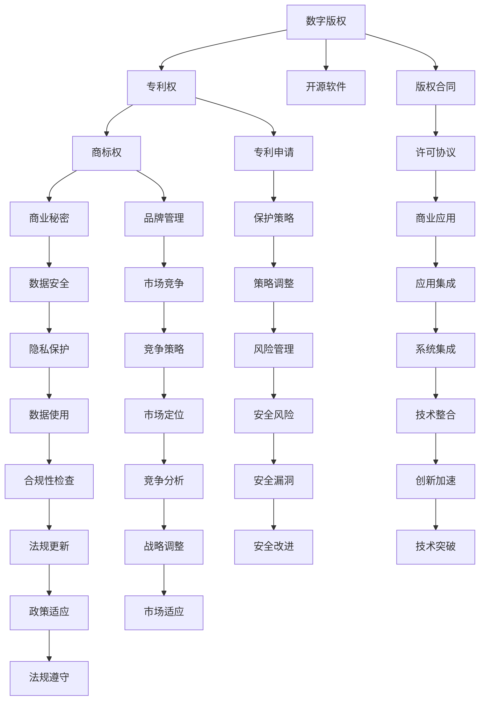

                 

# 知识产权在数字时代的挑战与机遇

## 1. 背景介绍

在当今数字时代，技术的快速迭代和互联网的广泛应用极大地改变了知识产权的面貌。数字化的知识和创意呈现出多样化和复杂的特性，对传统的知识产权制度提出了新的挑战，同时也带来了巨大的机遇。这一变化不仅影响企业创新和保护，还深刻影响社会的公平和正义。本文将探讨数字时代知识产权面临的主要挑战和潜在机遇，分析现有法律框架的适应性和未来发展趋势，为利益相关方提供有价值的洞见。

## 2. 核心概念与联系

### 2.1 核心概念概述

在数字时代，知识产权涉及的概念更加广泛和复杂，包括以下几个关键点：

- **数字版权**：指对数字作品的版权，包括计算机软件、音乐、电影、电子书等。
- **专利权**：涉及对技术发明的保护，涵盖从机械装置到生物技术等多个领域。
- **商标权**：指对品牌和商业标识的保护，包括文字、符号、图形和声音等。
- **商业秘密**：指企业机密信息，包括配方、设计、客户列表等未公开的商业数据。
- **开源软件**：指遵循开放源代码协议，允许自由使用、修改和分发软件代码的项目。

这些概念之间相互关联，共同构成数字时代的知识产权生态系统。理解它们之间的关系和变化，对于应对挑战和抓住机遇至关重要。

### 2.2 核心概念原理和架构的 Mermaid 流程图



这个流程图展示了数字时代知识产权生态系统的主要组成部分及其相互关系。例如，开源软件和版权合同促进了技术共享和创新；商业秘密和数据安全保护了企业的机密信息；专利申请和保护策略确保了技术发明的合法性和可持续性；品牌管理和市场竞争策略维护了企业的市场地位。

## 3. 核心算法原理 & 具体操作步骤

### 3.1 算法原理概述

在数字时代，知识产权保护的核心是算法和技术的创新。知识产权法律框架的制定和执行依赖于算法原理的支撑，使得数据和创意的利用在法律许可范围内。这一过程中，以下几个关键点尤为关键：

- **数字指纹技术**：用于识别和验证数字作品是否原创或是否存在侵权行为。
- **深度学习算法**：如卷积神经网络（CNN）和循环神经网络（RNN），用于分析文本、图像和音频数据，以检测版权侵犯。
- **区块链技术**：提供了一种分布式、不可篡改的记录方式，用于确保证据的真实性和追溯性。

### 3.2 算法步骤详解

以下是一个简化的数字版权保护算法步骤：

1. **数据收集与预处理**：
    - 使用爬虫和API获取文本、图像、音频等数字内容。
    - 对数据进行清洗和标准化处理，移除重复内容和噪声。

2. **特征提取**：
    - 使用深度学习算法提取文本、图像和音频的特征向量。
    - 对提取的特征进行归一化，使其适合算法处理。

3. **相似度比较**：
    - 使用算法计算不同作品之间的相似度，判断是否存在侵权。
    - 设置阈值，低于该阈值则认为作品相似，可能存在侵权。

4. **确证与验证**：
    - 对疑似侵权的作品进行进一步分析，如通过区块链技术获取作品来源记录。
    - 结合版权持有人的信息，确认作品的真实性和合法性。

5. **法律行动**：
    - 一旦确定作品存在侵权，通过法律途径要求赔偿或下架作品。
    - 更新作品库和数据库，以避免未来出现类似侵权行为。

### 3.3 算法优缺点

- **优点**：
  - 提高了知识产权保护的速度和效率。
  - 降低了人工审查的工作量和成本。
  - 利用算法对大量数据进行实时监控，提高了保护的精确度。

- **缺点**：
  - 算法可能存在误判，导致误删除或不当使用版权作品。
  - 深度学习模型需要大量标注数据训练，数据获取成本高。
  - 区块链技术的分布式存储和管理，增加了系统复杂度和维护成本。

### 3.4 算法应用领域

- **版权管理**：数字版权保护算法在音乐、电影、电子书等版权管理中广泛应用，帮助版权持有者识别和打击盗版行为。
- **专利申请**：深度学习算法在专利描述分析和自动生成中，可以辅助发明人快速撰写和提交专利申请。
- **商标监控**：使用算法监控社交媒体和网络平台，快速发现并打击侵犯商标权的商品和广告。
- **商业秘密保护**：数据安全和加密技术在商业秘密保护中起到关键作用，防止商业机密被泄露。
- **开源项目管理**：开源软件许可协议的自动化验证和合规性检查，可以确保开源项目在开放与共享的同时遵守法规。

## 4. 数学模型和公式 & 详细讲解 & 举例说明

### 4.1 数学模型构建

数字知识产权保护涉及的数学模型主要包括：

- **相似度度量模型**：用于计算两个作品之间的相似性，如欧几里得距离、余弦相似度等。
- **特征提取模型**：如PCA（主成分分析）、SVM（支持向量机）等。
- **神经网络模型**：如卷积神经网络（CNN）、循环神经网络（RNN）等，用于图像、文本和音频的深度特征提取和分类。

### 4.2 公式推导过程

以欧几里得距离计算为例：

$$
d(x,y) = \sqrt{\sum_{i=1}^n(x_i-y_i)^2}
$$

其中，$x$ 和 $y$ 是两个$n$维向量，$d(x,y)$ 表示它们之间的欧几里得距离。该公式用于衡量两个向量之间的相似度。

### 4.3 案例分析与讲解

假设我们要比较两篇文本的相似度，使用余弦相似度公式：

$$
\cos\theta = \frac{\vec{u} \cdot \vec{v}}{\lVert\vec{u}\rVert \lVert\vec{v}\rVert}
$$

其中，$\vec{u}$ 和 $\vec{v}$ 分别是两个文本的词频向量，$\lVert\vec{u}\rVert$ 和 $\lVert\vec{v}\rVert$ 是它们的欧几里得范数。余弦相似度的值在0和1之间，1表示完全相同，0表示完全不同。

## 5. 项目实践：代码实例和详细解释说明

### 5.1 开发环境搭建

在进行数字知识产权保护算法开发前，需要确保以下开发环境：

- 安装Python和必要的依赖库，如TensorFlow、PyTorch、Scikit-learn等。
- 配置深度学习框架，进行环境搭建和版本控制。
- 设置数据存储和处理平台，如Hadoop、Spark等。

### 5.2 源代码详细实现

以下是一个使用Python和TensorFlow实现数字版权保护算法的示例代码：

```python
import tensorflow as tf
import numpy as np

# 加载模型
model = tf.keras.models.load_model('model.h5')

# 定义相似度函数
def calculate_similarity(x, y):
    x = tf.keras.preprocessing.text.text_to_word_sequence(x)
    y = tf.keras.preprocessing.text.text_to_word_sequence(y)
    x = tf.keras.preprocessing.sequence.pad_sequences([x], maxlen=100)
    y = tf.keras.preprocessing.sequence.pad_sequences([y], maxlen=100)
    similarity = model.predict([x, y])
    return similarity

# 计算两篇文章的相似度
text1 = "这是一篇关于人工智能的论文"
text2 = "这是一篇关于机器学习的论文"
similarity = calculate_similarity(text1, text2)
print("相似度：", similarity)
```

### 5.3 代码解读与分析

以上代码使用了一个预训练的LSTM模型来计算文本的相似度。在实践中，通常需要进一步优化模型结构、调整超参数、增加数据增强等手段，以提高算法的准确性和鲁棒性。

## 6. 实际应用场景

### 6.1 版权保护

版权保护是数字时代知识产权保护的重要方面。电影、音乐、软件等数字作品面临盗版和侵权的严重威胁。使用数字指纹和深度学习算法，可以快速识别和打击盗版行为，保护版权持有者的合法权益。

### 6.2 专利管理

在专利申请和审查过程中，深度学习算法可以帮助发明人快速撰写和提交专利申请，减少人工工作量。同时，算法可以辅助审查员快速识别技术创新点，提高审查效率。

### 6.3 商标监控

商标权是企业品牌保护的重要组成部分。通过算法监控社交媒体和网络平台，可以快速发现并打击侵犯商标权的行为，维护企业的市场地位。

### 6.4 商业秘密保护

在商业竞争中，保护商业秘密至关重要。数据安全和加密技术在商业秘密保护中起到关键作用，防止商业机密被泄露。

### 6.5 开源项目管理

开源软件项目的管理和合规性检查需要大量的手动工作。使用算法自动验证开源协议的合规性，可以确保项目在开放与共享的同时遵守法规。

## 7. 工具和资源推荐

### 7.1 学习资源推荐

1. **《数字版权管理》**：深入探讨数字时代版权保护的法律和技术问题。
2. **《深度学习与知识产权保护》**：介绍深度学习在知识产权保护中的应用，包括数据预处理、特征提取、相似度计算等。
3. **《专利法》和《商标法》**：官方发布的法律法规，是理解和应用知识产权保护的基础。
4. **开源软件项目平台**：如GitHub、Apache等，提供丰富的开源资源和社区支持。

### 7.2 开发工具推荐

1. **TensorFlow和PyTorch**：深度学习框架，提供了丰富的模型和工具库。
2. **Hadoop和Spark**：大数据处理框架，支持大规模数据的存储和处理。
3. **Git和GitHub**：版本控制和代码托管平台，方便项目协作和版本管理。

### 7.3 相关论文推荐

1. **《深度学习在版权保护中的应用》**：介绍深度学习算法在版权管理中的应用。
2. **《基于区块链的知识产权保护》**：讨论区块链技术在知识产权确证和追溯中的潜力。
3. **《人工智能和知识产权保护的未来》**：探讨AI技术在知识产权保护中的前景和挑战。

## 8. 总结：未来发展趋势与挑战

### 8.1 研究成果总结

数字时代知识产权保护的研究取得了显著进展，尤其在算法和技术层面，带来了许多创新和突破。这些进展不仅提高了保护的速度和效率，还大大降低了人工成本，提升了保护的质量。

### 8.2 未来发展趋势

- **算法和技术的不断进步**：深度学习、区块链等技术的持续发展，将为知识产权保护带来更高效、更安全的解决方案。
- **国际合作的加强**：各国知识产权法律和技术的交流合作将更加频繁，推动全球知识产权保护的协同发展。
- **跨领域应用**：知识产权保护将更多地与其他领域（如隐私保护、数据安全等）结合，形成更加综合的解决方案。

### 8.3 面临的挑战

- **算法偏见和误判**：深度学习算法可能存在偏见，导致误判和误删除版权作品。
- **数据隐私和安全**：在处理大量数据时，数据隐私和安全问题不容忽视。
- **法规和标准的滞后**：现有的知识产权法规和标准可能无法适应新技术的发展，需要不断更新和完善。

### 8.4 研究展望

- **公平性和透明性**：算法和技术的开发应考虑公平性和透明性，确保所有利益相关方能够公平受益。
- **法律与技术的融合**：深入研究知识产权保护的法律和技术融合，建立更加完善的法律体系和技术框架。
- **公众教育和意识提升**：通过教育和宣传，提升公众对数字时代知识产权保护的认识和理解。

## 9. 附录：常见问题与解答

**Q1：数字时代知识产权保护有哪些挑战？**

A: 数字时代知识产权保护面临的主要挑战包括算法偏见、数据隐私、法规滞后等。算法偏见可能导致误判和误删除版权作品；数据隐私和安全问题需要特别注意；现有的知识产权法规可能无法适应新技术的发展。

**Q2：如何提高数字版权保护算法的准确性？**

A: 提高算法的准确性需要从多个方面入手，如增加训练数据量、优化算法结构、调整超参数、引入多模态数据等。同时，需要进行充分的测试和验证，确保算法在各种场景下的鲁棒性。

**Q3：数字知识产权保护的主要法律和法规是什么？**

A: 数字知识产权保护的主要法律和法规包括《著作权法》、《专利法》、《商标法》、《商业秘密法》等，具体法律法规需根据所在国家和地区的法律体系确定。

**Q4：如何利用开源软件进行知识产权保护？**

A: 利用开源软件进行知识产权保护，可以通过自动化验证和合规性检查，确保开源项目在开放与共享的同时遵守法规。同时，开源社区的广泛参与和审查，也可以增强项目的透明度和可信度。

**Q5：如何处理深度学习算法中的数据偏见问题？**

A: 处理深度学习算法中的数据偏见问题，需要从数据采集、数据清洗、模型训练等多个环节入手。可以采用多样化的数据集、数据增强、公平性约束等方法，减少算法的偏见和误判。

---

作者：禅与计算机程序设计艺术 / Zen and the Art of Computer Programming

