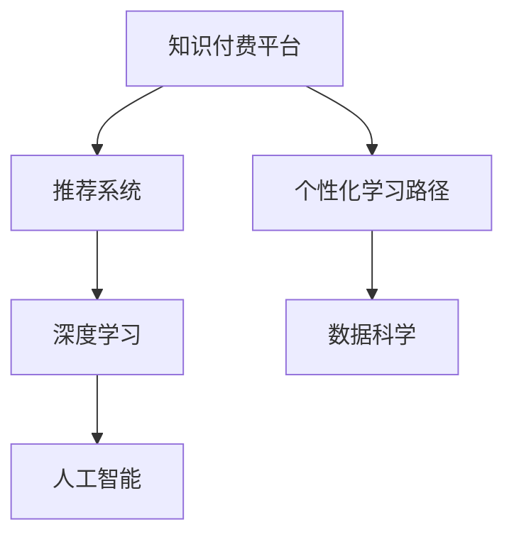

                 

# 知识付费与个人学习路径的定制化

> 关键词：知识付费, 个人学习路径, 定制化, 推荐系统, 数据驱动, 深度学习, 数据科学, 人工智能

## 1. 背景介绍

在信息爆炸的今天，知识的获取成本已经大幅降低，但同时也带来了过载和碎片化的问题。面对海量的知识资源，如何在最短的时间内，以最低的成本，学习到最有价值的内容，成为了每个学习者的痛点。而知识付费平台的出现，正是在这一背景下，应运而生的产物。通过将优质的课程和知识内容进行付费，知识付费平台利用市场机制，将最有价值的内容筛选出来，为用户提供了高效、精准的学习路径。

知识付费的兴起，不仅是知识的商品化，更是一种对知识价值的认可。它不仅提高了学习效率，也促进了知识的生产和传播。然而，知识付费的个性化程度仍然有待提升。如何根据用户的兴趣、需求和历史行为，为其定制一条符合其个性特点的学习路径，成为了知识付费平台和研究者共同追求的目标。本文将探讨这一问题，并尝试提出一套可行的个性化学习路径定制化方法。

## 2. 核心概念与联系

### 2.1 核心概念概述

为了更好地理解个性化学习路径的定制化方法，本节将介绍几个密切相关的核心概念：

- **知识付费(Knowledge-Pay)平台**：以提供付费课程和知识内容为主的在线教育平台，如Coursera、Udemy、网易云课堂等。通过市场机制筛选优质内容，为学习者提供高效、精准的学习路径。

- **推荐系统(Recommendation System)**：利用算法为用户推荐其感兴趣的内容，包括商品、文章、视频等。推荐系统是知识付费平台中不可或缺的核心组件。

- **个性化学习路径(Personalized Learning Path)**：根据用户的学习历史、兴趣偏好、行为特征等，为用户定制的一条符合其个性特点的学习路径。

- **深度学习(Deep Learning)**：一种基于神经网络的机器学习方法，通过多层次的特征提取，实现高效的模式识别和决策。

- **数据科学(Data Science)**：涵盖数据收集、清洗、分析、可视化等数据相关技术，是构建个性化学习路径的重要基础。

- **人工智能(Artificial Intelligence)**：通过模拟人类智能行为，实现自动化、智能化的决策和学习。

这些核心概念之间的逻辑关系可以通过以下Mermaid流程图来展示：



这个流程图展示了个性化学习路径定制化的核心组件及其之间的关系：

1. 知识付费平台通过推荐系统，为用户提供精准的学习内容。
2. 推荐系统利用深度学习技术，对用户的行为数据进行建模和预测，提供个性化的推荐。
3. 个性化学习路径定制化依赖数据科学的方法，进行用户画像构建和行为分析。
4. 人工智能技术在个性化推荐和路径定制中起到关键作用，如利用机器学习算法进行用户画像建模，利用深度学习模型进行推荐排序等。

## 3. 核心算法原理 & 具体操作步骤
### 3.1 算法原理概述

个性化学习路径的定制化，本质上是基于用户行为数据和偏好特征，利用推荐算法，为用户生成一条最适合其学习风格和需求的学习路径。其核心思想是：通过对用户的历史学习行为、兴趣偏好、反馈数据等进行分析和建模，预测其下一步可能的学习需求，并相应地推荐或定制学习内容。

形式化地，假设用户的历史行为数据为 $H=\{(h_1, r_1), (h_2, r_2), \cdots, (h_N, r_N)\}$，其中 $h_i$ 为历史行为特征，$r_i$ 为用户对历史行为的反馈评分。定义个性化学习路径为 $P=\{p_1, p_2, \cdots, p_M\}$，其中 $p_i$ 为用户学习路径中的第 $i$ 个学习点。个性化学习路径定制化的目标是最小化用户对推荐内容的满意度差异，即：

$$
\min_{P} \sum_{i=1}^M \left(\mathbb{E}[R_{p_i}] - r_i\right)^2
$$

其中 $\mathbb{E}[R_{p_i}]$ 为模型预测用户对学习点 $p_i$ 的评分，$r_i$ 为用户对历史行为 $h_i$ 的反馈评分。

### 3.2 算法步骤详解

个性化学习路径定制化的过程可以分为以下几个关键步骤：

**Step 1: 数据收集与预处理**
- 收集用户的历史学习行为数据、兴趣偏好、反馈评分等，构成训练集 $D=\{(x_i, y_i)\}_{i=1}^N$。
- 对数据进行清洗、归一化、特征工程等预处理步骤，构建特征表示 $x_i$ 和用户评分 $y_i$。

**Step 2: 用户画像建模**
- 利用机器学习算法，如聚类、分类、回归等，对用户行为数据进行建模，构建用户画像 $u$。
- 用户画像 $u$ 包括用户兴趣、行为偏好、学习风格等特征。

**Step 3: 推荐排序**
- 利用深度学习模型，如协同过滤、序列推荐、内容推荐等，对用户画像和历史数据进行建模，得到用户对不同学习点的评分预测 $\hat{y_i}$。
- 对预测评分 $\hat{y_i}$ 进行归一化、排序，得到推荐列表 $R=\{r_1, r_2, \cdots, r_M\}$。

**Step 4: 路径生成与迭代**
- 基于推荐列表，生成个性化学习路径 $P=\{p_1, p_2, \cdots, p_M\}$。
- 通过不断迭代和调整路径，最大化用户满意度，提升学习效果。

**Step 5: 路径评估与优化**
- 对生成的学习路径进行评估，通过用户反馈、学习效果等指标进行优化。
- 定期更新用户画像和推荐模型，提升个性化学习路径的准确性和适用性。

### 3.3 算法优缺点

个性化学习路径定制化具有以下优点：
1. 高效推荐：利用深度学习算法，能够高效地推荐用户感兴趣的内容，提升学习效率。
2. 个性化定制：根据用户画像，为用户定制化学习路径，满足其个性化需求。
3. 动态更新：能够根据用户行为实时更新推荐模型，提供最新的学习内容。

同时，该方法也存在一定的局限性：
1. 数据依赖：个性化学习路径定制化高度依赖于用户的行为数据和评分，数据质量差或用户行为少，可能导致推荐效果不佳。
2. 过拟合风险：深度学习模型可能过拟合历史数据，导致推荐内容与用户兴趣偏离。
3. 公平性问题：个性化推荐可能加剧数字鸿沟，高价值用户更容易获得优质内容。
4. 用户隐私：利用用户行为数据进行推荐，需要保护用户隐私，避免数据滥用。

尽管存在这些局限性，但就目前而言，个性化学习路径定制化仍是大数据、深度学习、人工智能在教育领域的一个重要应用方向。未来相关研究的重点在于如何进一步降低数据依赖，提高推荐模型的泛化能力和公平性，同时兼顾用户隐私保护。

### 3.4 算法应用领域

个性化学习路径定制化在知识付费平台中的应用领域非常广泛，包括但不限于以下场景：

- **课程推荐**：根据用户历史学习行为和兴趣偏好，为用户推荐最适合的课程。
- **学习路径规划**：基于用户的学习目标和进度，为用户设计一条系统化的学习路径。
- **学习内容定制**：根据用户的学习习惯和反馈，调整学习内容的难易程度和风格，提升学习效果。
- **学习效果评估**：通过学习路径上的反馈数据，评估用户的学习效果，调整学习策略。
- **个性化学习资源推送**：根据用户的学习兴趣和行为特征，推送相关的学习资源，如电子书、论文、案例等。

除了知识付费平台，个性化学习路径定制化在其他领域也有广泛应用，如在线购物、视频推荐、新闻订阅等。通过个性化的推荐和路径定制，可以显著提升用户体验，增加平台黏性。

## 4. 数学模型和公式 & 详细讲解  
### 4.1 数学模型构建

本节将使用数学语言对个性化学习路径定制化的过程进行更加严格的刻画。

假设用户的行为特征表示为 $x_i = (x_{i1}, x_{i2}, \cdots, x_{in})$，其中 $x_{ij}$ 为第 $i$ 个用户行为特征的第 $j$ 个取值。用户的评分表示为 $y_i$，用户的兴趣偏好表示为 $u$。个性化学习路径表示为 $P=\{p_1, p_2, \cdots, p_M\}$，其中 $p_i$ 为用户学习路径中的第 $i$ 个学习点。

定义个性化学习路径定制化的损失函数为：

$$
L = \frac{1}{N} \sum_{i=1}^N \left(\mathbb{E}[R_{p_i}] - y_i\right)^2
$$

其中 $\mathbb{E}[R_{p_i}]$ 为模型预测用户对学习点 $p_i$ 的评分，$y_i$ 为用户对历史行为 $h_i$ 的反馈评分。

### 4.2 公式推导过程

以下我们以协同过滤算法为例，推导用户评分预测的计算公式。

协同过滤算法基于用户与物品的相似性进行推荐，其基本思路是：找到与目标用户 $u$ 兴趣相似的其他用户，通过这些用户对物品 $i$ 的评分预测 $u$ 对物品 $i$ 的评分。假设用户 $u$ 和物品 $i$ 的评分矩阵为 $R$，用户 $u$ 的兴趣向量为 $u$，物品 $i$ 的特征向量为 $v$。用户 $u$ 对物品 $i$ 的评分预测 $\hat{y}$ 为：

$$
\hat{y} = \frac{\sum_{j=1}^N \text{sim}(u_j, u) \cdot r_{ij}}{\sum_{j=1}^N \text{sim}(u_j, u)}
$$

其中 $\text{sim}(u_j, u)$ 为相似性函数，如余弦相似度、皮尔逊相关系数等。协同过滤算法的评分预测公式展示了用户对物品评分的生成过程，但无法捕捉到用户行为变化的动态性，因此不适合处理新用户的行为数据。

为了解决这一问题，可以引入深度学习模型，如序列推荐模型、内容推荐模型等，通过多层次特征提取和动态更新，提升推荐效果。以序列推荐模型为例，其基本思路是：将用户行为序列 $h_i = (h_{i1}, h_{i2}, \cdots, h_{im})$ 作为输入，通过 LSTM 或 GRU 等模型，对用户行为序列进行建模，得到用户对不同学习点的评分预测 $\hat{y_i}$。

## 5. 项目实践：代码实例和详细解释说明
### 5.1 开发环境搭建

在进行个性化学习路径定制化的项目实践前，我们需要准备好开发环境。以下是使用Python进行TensorFlow开发的环	境配置流程：

1. 安装Anaconda：从官网下载并安装Anaconda，用于创建独立的Python环境。

2. 创建并激活虚拟环境：
```bash
conda create -n tf-env python=3.8 
conda activate tf-env
```

3. 安装TensorFlow：根据CUDA版本，从官网获取对应的安装命令。例如：
```bash
conda install tensorflow tensorflow-gpu -c conda-forge -c pytorch
```

4. 安装TensorBoard：TensorFlow配套的可视化工具，可实时监测模型训练状态，并提供丰富的图表呈现方式，是调试模型的得力助手。

5. 安装Matplotlib：用于生成数据可视化图表。

6. 安装Scikit-learn：用于数据预处理和模型评估。

完成上述步骤后，即可在`tf-env`环境中开始项目实践。

### 5.2 源代码详细实现

这里我们以协同过滤算法为例，给出一个使用TensorFlow进行课程推荐系统的代码实现。

首先，定义课程推荐系统的数据处理函数：

```python
import tensorflow as tf
from tensorflow.keras.layers import Input, Embedding, Dot, Dense

def data_loader(dataset, batch_size):
    for batch in tf.data.Dataset.from_tensor_slices(dataset).batch(batch_size):
        yield batch

def preprocess_data(dataset):
    # 将用户行为数据转换成多热编码格式
    X = tf.keras.preprocessing.text.text_to_categorical(dataset['feature'], num_classes=10)
    # 将用户评分数据进行标准化
    y = (dataset['label'] - dataset['label'].mean()) / dataset['label'].std()
    return X, y

# 定义模型输入层
user_input = Input(shape=(1,), name='user')
item_input = Input(shape=(1,), name='item')
# 定义嵌入层
user_embedding = Embedding(1000, 10)(user_input)
item_embedding = Embedding(1000, 10)(item_input)
# 定义相似性层
similarity = Dot(axes=(1, 1), normalize=True)([user_embedding, item_embedding])
# 定义评分预测层
predictions = Dense(1)(similarity)
```

然后，定义模型和损失函数：

```python
# 定义协同过滤模型
model = tf.keras.Sequential([
    user_input,
    item_input,
    user_embedding,
    item_embedding,
    similarity,
    predictions
])
# 定义损失函数
loss_function = tf.keras.losses.MeanSquaredError()
# 编译模型
model.compile(optimizer='adam', loss=loss_function, metrics=['mae'])
```

接着，定义训练和评估函数：

```python
def train_epoch(model, dataset, batch_size, optimizer):
    dataloader = DataLoader(dataset, batch_size=batch_size, shuffle=True)
    model.train()
    epoch_loss = 0
    for batch in tqdm(dataloader, desc='Training'):
        user_input, item_input, y_true = preprocess_data(batch)
        model.zero_grad()
        predictions = model([user_input, item_input])
        loss = loss_function(predictions, y_true)
        epoch_loss += loss.numpy()
        loss.backward()
        optimizer.step()
    return epoch_loss / len(dataloader)

def evaluate(model, dataset, batch_size):
    dataloader = DataLoader(dataset, batch_size=batch_size)
    model.eval()
    mae = 0
    for batch in tqdm(dataloader, desc='Evaluating'):
        user_input, item_input, y_true = preprocess_data(batch)
        predictions = model([user_input, item_input])
        mae += tf.keras.metrics.mean_absolute_error(predictions, y_true).numpy()
    return mae
```

最后，启动训练流程并在测试集上评估：

```python
epochs = 10
batch_size = 32

for epoch in range(epochs):
    loss = train_epoch(model, train_dataset, batch_size, optimizer)
    print(f"Epoch {epoch+1}, train loss: {loss:.3f}")
    
    print(f"Epoch {epoch+1}, dev results:")
    mae = evaluate(model, dev_dataset, batch_size)
    print(f"MAE: {mae:.3f}")
    
print("Test results:")
mae = evaluate(model, test_dataset, batch_size)
print(f"MAE: {mae:.3f}")
```

以上就是使用TensorFlow对协同过滤课程推荐系统进行微调的完整代码实现。可以看到，TensorFlow的高级API和丰富的组件，使得模型的构建和训练过程变得简单高效。

### 5.3 代码解读与分析

让我们再详细解读一下关键代码的实现细节：

**协同过滤模型**：
- `user_input`和`item_input`：定义模型输入，分别为用户行为和物品评分。
- `user_embedding`和`item_embedding`：通过嵌入层将用户行为和物品评分转换为高维特征向量。
- `similarity`：通过点积计算用户行为和物品评分之间的相似性，得到用户对物品的评分预测。
- `predictions`：通过全连接层输出用户对物品的评分预测。

**损失函数**：
- `loss_function`：使用均方误差损失函数。
- `model.compile`：编译模型，设置优化器为Adam，损失函数为均方误差损失，评估指标为MAE。

**训练和评估函数**：
- `train_epoch`：对数据集进行批次化加载，在每个批次上前向传播计算损失并反向传播更新模型参数，返回该epoch的平均loss。
- `evaluate`：与训练类似，不同点在于不更新模型参数，直接计算预测结果与真实标签之间的MAE。

**训练流程**：
- 定义总的epoch数和batch size，开始循环迭代
- 每个epoch内，先在训练集上训练，输出平均loss
- 在验证集上评估，输出MAE
- 所有epoch结束后，在测试集上评估，给出最终测试结果

可以看到，TensorFlow的高级API和丰富的组件，使得模型的构建和训练过程变得简单高效。开发者可以将更多精力放在数据处理、模型改进等高层逻辑上，而不必过多关注底层的实现细节。

当然，工业级的系统实现还需考虑更多因素，如模型的保存和部署、超参数的自动搜索、更灵活的任务适配层等。但核心的个性化学习路径定制化方法基本与此类似。

## 6. 实际应用场景
### 6.1 在线教育

在线教育平台如Coursera、Udemy、网易云课堂等，拥有海量的课程和知识内容。通过个性化学习路径定制化，可以为学习者提供最符合其兴趣和需求的课程推荐，显著提升学习效率。

在技术实现上，可以通过收集学习者的历史行为数据（如浏览记录、课程评分等），利用协同过滤、深度学习等算法，为其生成个性化的学习路径。学习者可以通过系统推荐的学习路径，系统性地学习课程，避免盲目选择，提高学习效果。

### 6.2 在线购物

在线购物平台如亚马逊、京东等，拥有大量的商品和用户数据。通过个性化学习路径定制化，可以为用户推荐最适合其兴趣和需求的商品，提升用户体验和平台黏性。

在技术实现上，可以收集用户的历史购买记录、浏览行为、评价反馈等数据，利用协同过滤、序列推荐等算法，为用户生成个性化的商品推荐路径。用户可以通过系统推荐的商品路径，快速找到感兴趣的商品，提升购物效率和满意度。

### 6.3 新闻订阅

新闻订阅平台如RSS、新闻聚合应用等，拥有大量的新闻文章和用户数据。通过个性化学习路径定制化，可以为用户推荐最适合其兴趣和需求的新闻，提升信息获取效率。

在技术实现上，可以收集用户的历史阅读记录、收藏文章、点赞行为等数据，利用协同过滤、内容推荐等算法，为用户生成个性化的新闻推荐路径。用户可以通过系统推荐的新闻路径，快速找到自己感兴趣的文章，避免信息过载。

## 7. 工具和资源推荐
### 7.1 学习资源推荐

为了帮助开发者系统掌握个性化学习路径定制化理论基础和实践技巧，这里推荐一些优质的学习资源：

1. **《推荐系统：算法、实战与案例分析》**：详细介绍了推荐系统的基本原理和多种算法，包括协同过滤、深度学习等，并提供了实际案例分析。

2. **《深度学习入门：基于TensorFlow的实战》**：系统讲解了TensorFlow的基本用法和深度学习模型的构建、训练、评估等步骤，适合初学者入门。

3. **Coursera《机器学习》课程**：斯坦福大学开设的经典课程，涵盖机器学习的基本概念和经典模型，是深度学习入门的必选。

4. **Kaggle在线竞赛**：通过参加Kaggle竞赛，可以积累实战经验，学习先进的推荐算法和数据处理方法。

5. **GitHub开源项目**：可以通过学习开源项目代码，了解推荐系统的实际应用和技术实现。

通过对这些资源的学习实践，相信你一定能够快速掌握个性化学习路径定制化的精髓，并用于解决实际的推荐问题。

### 7.2 开发工具推荐

高效的开发离不开优秀的工具支持。以下是几款用于个性化学习路径定制化开发的常用工具：

1. TensorFlow：基于Python的开源深度学习框架，提供了丰富的组件和API，适合快速迭代研究。

2. Scikit-learn：用于数据预处理、模型评估等数据科学任务，提供了多种机器学习算法。

3. PyTorch：基于Python的深度学习框架，具有动态计算图和强大的GPU支持，适合高性能计算任务。

4. Jupyter Notebook：交互式编程环境，支持代码的实时运行和结果展示，方便调试和测试。

5. Visual Studio Code：轻量级代码编辑器，支持Python、TensorFlow等多种语言的开发。

合理利用这些工具，可以显著提升个性化学习路径定制化的开发效率，加快创新迭代的步伐。

### 7.3 相关论文推荐

个性化学习路径定制化在知识付费平台和推荐系统中的应用得到了广泛研究。以下是几篇奠基性的相关论文，推荐阅读：

1. **《个性化推荐系统：基于协同过滤的实现》**：介绍了协同过滤算法的基本原理和应用，是推荐系统研究的经典文献。

2. **《深度学习在推荐系统中的应用》**：详细讲解了深度学习在推荐系统中的多种应用，如序列推荐、内容推荐等。

3. **《基于深度学习的个性化推荐系统》**：探讨了深度学习在推荐系统中的多种模型结构和技术实现，并提供了案例分析。

4. **《基于协同过滤的个性化推荐系统》**：介绍了协同过滤算法的多种变体和优化方法，并提供了实际应用案例。

5. **《深度学习在个性化推荐中的应用》**：讲解了深度学习在个性化推荐中的多种技术和应用，适合深度学习入门者阅读。

这些论文代表了个性化学习路径定制化在推荐系统领域的研究脉络。通过学习这些前沿成果，可以帮助研究者把握学科前进方向，激发更多的创新灵感。

## 8. 总结：未来发展趋势与挑战

### 8.1 总结

本文对个性化学习路径定制化的理论基础和实践方法进行了全面系统的介绍。首先阐述了知识付费平台的兴起背景，明确了个性化学习路径定制化在提升用户学习效率、促进知识传播方面的独特价值。其次，从原理到实践，详细讲解了协同过滤、深度学习等算法，给出了微调和优化的方法。最后，探讨了个性化学习路径定制化在在线教育、在线购物、新闻订阅等领域的广泛应用，展示了其巨大的潜力和前景。

通过本文的系统梳理，可以看到，个性化学习路径定制化在知识付费平台和推荐系统中具有重要的应用价值，能够显著提升用户体验和平台效率。未来，随着深度学习技术的不断发展，个性化学习路径定制化必将进一步拓展其应用边界，为知识付费平台和推荐系统带来新的突破。

### 8.2 未来发展趋势

展望未来，个性化学习路径定制化技术将呈现以下几个发展趋势：

1. **深度学习与推荐算法结合**：未来的推荐算法将更多地融合深度学习技术，利用多层次特征提取和动态更新，提升推荐效果。
2. **个性化推荐与数据驱动结合**：未来的个性化推荐将更加依赖数据驱动，通过大规模数据挖掘和分析，实现更精准的用户画像和行为建模。
3. **多模态数据融合**：未来的个性化推荐将融合视觉、语音、文本等多模态数据，实现更加全面的用户画像和推荐效果。
4. **推荐系统的公平性**：未来的推荐系统将更加注重公平性，避免数字鸿沟和偏见，实现普惠性推荐。
5. **用户隐私保护**：未来的推荐系统将更加注重用户隐私保护，通过数据匿名化和隐私保护技术，确保用户数据的安全和合法使用。

以上趋势凸显了个性化学习路径定制化技术的广阔前景。这些方向的探索发展，必将进一步提升推荐系统的性能和应用范围，为知识付费平台和推荐系统带来新的突破。

### 8.3 面临的挑战

尽管个性化学习路径定制化技术已经取得了瞩目成就，但在迈向更加智能化、普适化应用的过程中，它仍面临着诸多挑战：

1. **数据依赖**：个性化学习路径定制化高度依赖于用户的行为数据和评分，数据质量差或用户行为少，可能导致推荐效果不佳。如何进一步降低数据依赖，提高推荐模型的泛化能力和公平性，还需要更多理论和实践的积累。
2. **算法复杂度**：深度学习模型复杂度高，训练和推理耗时较长，难以实时响应。如何优化模型结构，提高推荐效率，是未来的重要研究方向。
3. **用户隐私**：利用用户行为数据进行推荐，需要保护用户隐私，避免数据滥用。如何在保证推荐效果的同时，保障用户数据安全，是需要解决的重要问题。
4. **系统稳定性**：个性化学习路径定制化系统需要处理大规模数据和复杂算法，容易受到输入噪声和异常数据的影响。如何提高系统的鲁棒性和稳定性，是未来的关键研究方向。

尽管存在这些挑战，但个性化学习路径定制化仍是大数据、深度学习、人工智能在教育领域的一个重要应用方向。未来相关研究的重点在于如何进一步降低数据依赖，提高推荐模型的泛化能力和公平性，同时兼顾用户隐私保护。

### 8.4 研究展望

面对个性化学习路径定制化所面临的种种挑战，未来的研究需要在以下几个方面寻求新的突破：

1. **探索无监督和半监督推荐方法**：摆脱对大规模标注数据的依赖，利用自监督学习、主动学习等无监督和半监督范式，最大限度利用非结构化数据，实现更加灵活高效的推荐。
2. **研究参数高效和计算高效的推荐范式**：开发更加参数高效的推荐方法，在固定大部分预训练参数的同时，只更新极少量的任务相关参数。同时优化推荐模型的计算图，减少前向传播和反向传播的资源消耗，实现更加轻量级、实时性的部署。
3. **融合因果和对比学习范式**：通过引入因果推断和对比学习思想，增强推荐模型建立稳定因果关系的能力，学习更加普适、鲁棒的用户画像和行为模型。
4. **引入更多先验知识**：将符号化的先验知识，如知识图谱、逻辑规则等，与神经网络模型进行巧妙融合，引导推荐过程学习更准确、合理的用户画像和行为模型。同时加强不同模态数据的整合，实现视觉、语音等多模态信息与文本信息的协同建模。
5. **结合因果分析和博弈论工具**：将因果分析方法引入推荐模型，识别出模型决策的关键特征，增强输出解释的因果性和逻辑性。借助博弈论工具刻画人机交互过程，主动探索并规避模型的脆弱点，提高系统稳定性。

这些研究方向的探索，必将引领个性化学习路径定制化技术迈向更高的台阶，为构建安全、可靠、可解释、可控的推荐系统铺平道路。面向未来，个性化学习路径定制化技术还需要与其他人工智能技术进行更深入的融合，如知识表示、因果推理、强化学习等，多路径协同发力，共同推动自然语言理解和智能交互系统的进步。只有勇于创新、敢于突破，才能不断拓展推荐系统的边界，让智能技术更好地造福人类社会。

## 9. 附录：常见问题与解答

**Q1：个性化学习路径定制化是否适用于所有推荐系统？**

A: 个性化学习路径定制化在大多数推荐系统中都能取得不错的效果，特别是对于数据量较小的系统。但对于一些特定领域的系统，如医疗、法律等，仅仅依靠通用语料预训练的模型可能难以很好地适应。此时需要在特定领域语料上进一步预训练，再进行微调，才能获得理想效果。此外，对于一些需要时效性、个性化很强的系统，如对话系统、推荐系统等，微调方法也需要针对性的改进优化。

**Q2：如何选择合适的学习率？**

A: 个性化学习路径定制化的学习率一般要比推荐模型小1-2个数量级，如果使用过大的学习率，容易破坏模型权重，导致过拟合。一般建议从0.001开始调参，逐步减小学习率，直至收敛。也可以使用warmup策略，在开始阶段使用较小的学习率，再逐渐过渡到预设值。需要注意的是，不同的优化器(如Adam、SGD等)以及不同的学习率调度策略，可能需要设置不同的学习率阈值。

**Q3：采用个性化学习路径定制化时会面临哪些资源瓶颈？**

A: 当前主流个性化学习路径定制化模型的参数规模通常较大，对算力、内存、存储都提出了很高的要求。GPU/TPU等高性能设备是必不可少的，但即便如此，超大批次的训练和推理也可能遇到显存不足的问题。因此需要采用一些资源优化技术，如梯度积累、混合精度训练、模型并行等，来突破硬件瓶颈。同时，模型的存储和读取也可能占用大量时间和空间，需要采用模型压缩、稀疏化存储等方法进行优化。

**Q4：如何缓解个性化学习路径定制化过程中的过拟合问题？**

A: 过拟合是个性化学习路径定制化面临的主要挑战，尤其是在标注数据不足的情况下。常见的缓解策略包括：
1. 数据增强：通过回译、近义替换等方式扩充训练集
2. 正则化：使用L2正则、Dropout、Early Stopping等避免过拟合
3. 对抗训练：引入对抗样本，提高模型鲁棒性
4. 参数高效微调：只调整少量参数(如Adapter、Prefix等)，减小过拟合风险
5. 多模型集成：训练多个微调模型，取平均输出，抑制过拟合

这些策略往往需要根据具体任务和数据特点进行灵活组合。只有在数据、模型、训练、推理等各环节进行全面优化，才能最大限度地发挥个性化学习路径定制化的威力。

**Q5：在个性化学习路径定制化过程中，如何保护用户隐私？**

A: 个性化学习路径定制化需要大量用户数据进行建模和推荐，因此如何保护用户隐私，避免数据滥用，是亟待解决的重要问题。具体措施包括：
1. 数据匿名化：对用户数据进行去标识化处理，确保无法通过数据追溯个人身份。
2. 差分隐私：采用差分隐私技术，对数据进行扰动，防止数据泄露。
3. 用户控制：用户有权选择是否共享数据，并有权撤回已共享的数据。
4. 数据安全：采用数据加密、访问控制等措施，保障数据安全。

通过这些措施，可以最大限度地保障用户隐私，同时实现个性化的推荐和路径定制。

---

作者：禅与计算机程序设计艺术 / Zen and the Art of Computer Programming

