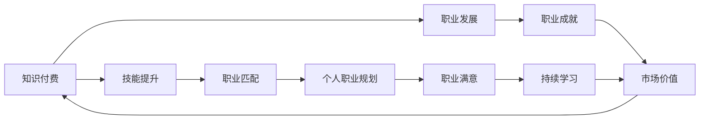

                 

# 知识付费与个人职业规划的结合点

## 1. 背景介绍

随着数字化和信息化时代的到来，知识付费成为越来越多人提升自身竞争力、拓宽职业发展路径的重要途径。个人职业规划，则是在了解自身优势与市场需求基础上，为实现职业目标而进行的前瞻性设计和策略安排。知识付费与个人职业规划的结合，不仅有助于提升个人技能，还能更好地适应市场变化，实现个人价值与职业发展的双赢。

### 1.1 知识付费的兴起

知识付费是指在获取知识、提升技能的过程中，以付费形式获得专业、系统、高质量的教育内容。这一概念起源于互联网时代，随着在线教育平台和内容付费服务的普及，逐步成为一种广泛接受的学习方式。

- **驱动因素**：职业竞争激烈，技能更新迭代加速，个人需要通过持续学习保持竞争力。
- **市场趋势**：消费者对知识产品需求不断增加，内容质量提升，付费意愿增强。
- **平台发展**：各类知识付费平台如雨后春笋般涌现，提供丰富多样的课程资源。

### 1.2 个人职业规划的重要性

个人职业规划是个人职业发展的重要组成部分，旨在通过明确职业目标、制定详细规划、持续执行策略，不断提升职业素质，实现职业满意度和成就感。

- **必要性**：职业规划帮助明确发展方向，避免盲目发展。
- **目的**：通过规划，实现职业路径清晰、目标明确、行动有力，达成职业生涯的高质量发展。
- **结果**：有助于职业成长，提升个人市场价值，实现自我实现。

## 2. 核心概念与联系

### 2.1 核心概念概述

为了深入理解知识付费与个人职业规划的结合点，本节将介绍以下关键概念及其联系：

- **知识付费**：以付费形式获取知识与技能，旨在提高个人竞争力，适应职业发展需求。
- **个人职业规划**：对个人职业发展进行系统性规划，明确职业目标，制定实施路径。
- **技能提升**：通过知识付费获取专业技能，为职业发展提供动力。
- **职业匹配**：根据个人技能与市场需求，进行精准的职业匹配。
- **终身学习**：个人职业发展是一个持续学习的过程，知识付费与职业规划是重要的支撑。

### 2.2 核心概念联系的Mermaid 流程图



此图展示了知识付费、技能提升、职业匹配、个人职业规划、职业满意、职业发展、职业成就、持续学习和市场价值之间的关系和影响。知识付费是提升个人技能和适应职业需求的基础，职业匹配是结合个人技能与市场需求的结果，个人职业规划是实现职业目标和发展的蓝图，职业满意与成就则是职业规划的最终目标，持续学习是保持职业竞争力的关键，市场价值是职业成就与满意度的重要体现。

## 3. 核心算法原理 & 具体操作步骤

### 3.1 算法原理概述

知识付费与个人职业规划的结合，涉及数据驱动的职业规划算法和个性化学习推荐算法。具体步骤如下：

1. **需求分析**：通过问卷、调查等方式，收集用户对技能提升、职业发展等需求信息。
2. **匹配算法**：利用机器学习、数据挖掘技术，匹配用户需求与知识付费平台上的课程资源。
3. **路径规划**：基于匹配结果，制定个性化职业发展路径。
4. **持续学习**：动态调整学习路径，推荐相关课程，帮助用户实现持续学习。

### 3.2 算法步骤详解

#### 3.2.1 需求分析

需求分析是职业规划的第一步，通过多种方式收集用户信息，形成详细的职业发展需求画像。

- **问卷调查**：设计针对用户的问卷，涵盖技能提升、职业目标、兴趣偏好等内容。
- **行为数据**：分析用户在知识付费平台上的浏览、购买、学习行为，获取用户偏好。
- **社交网络**：利用社交网络分析，了解用户所在行业的最新动态和发展趋势。

#### 3.2.2 匹配算法

匹配算法通过分析用户需求和课程资源，找到最匹配的课程推荐。

- **特征提取**：提取用户画像中的关键特征，如技能水平、学习偏好、职业目标等。
- **课程分类**：对课程资源进行分类，形成课程知识图谱。
- **相似度计算**：使用向量空间模型、协同过滤等算法，计算用户需求与课程资源的相似度。
- **推荐排序**：根据相似度排序，推荐最匹配的课程，形成初步的职业发展路径。

#### 3.2.3 路径规划

路径规划是职业规划的核心，结合用户需求和课程推荐，制定详细的发展路径。

- **阶段划分**：将职业发展分为若干阶段，每个阶段明确目标和任务。
- **技能升级**：针对每个阶段，推荐适合的课程，帮助用户实现技能提升。
- **路径迭代**：根据学习进度和反馈，动态调整职业发展路径，确保路径的适应性和有效性。

#### 3.2.4 持续学习

持续学习是职业规划的长期保障，通过不断推荐新课程和调整学习策略，帮助用户保持竞争力。

- **定期评估**：定期评估用户的学习进度和职业发展状态。
- **动态推荐**：根据评估结果，调整学习路径，推荐新课程。
- **能力提升**：不断提升技能水平，确保职业目标的实现。

### 3.3 算法优缺点

#### 3.3.1 优点

1. **精准匹配**：通过数据分析和算法优化，实现用户需求与课程资源的精准匹配，提高学习效率。
2. **个性化推荐**：根据用户偏好和行为数据，提供个性化课程推荐，提升学习体验。
3. **持续优化**：动态调整学习路径和课程推荐，确保职业规划的有效性和适应性。
4. **提高市场竞争力**：通过系统化的技能提升，增强个人市场价值，促进职业发展。

#### 3.3.2 缺点

1. **数据隐私**：收集和分析用户数据可能涉及隐私问题，需严格遵守法律法规。
2. **成本较高**：初期需要大量数据和计算资源，维护成本较高。
3. **算法复杂度**：算法设计复杂，需要专业知识和技术支持。
4. **用户依赖**：过度依赖算法推荐，可能忽视自身主动探索和个性化需求。

### 3.4 算法应用领域

知识付费与个人职业规划的结合，可以应用于多个领域，如教育培训、职场技能提升、职业发展咨询等。

- **教育培训**：为学生和成人提供个性化课程推荐，帮助其提升技能，实现职业目标。
- **职场技能提升**：为在职人员提供针对性技能培训，帮助其在职场中脱颖而出。
- **职业发展咨询**：提供职业规划服务，帮助用户制定和实现职业目标。

## 4. 数学模型和公式 & 详细讲解 & 举例说明

### 4.1 数学模型构建

本节将使用数学语言对知识付费与个人职业规划结合的算法进行严格构建。

记用户需求为 $X$，课程资源为 $Y$，职业规划路径为 $P$，匹配算法为 $M$。则问题可以形式化如下：

1. 需求分析：
   $$
   X = \{特征向量\} = \{技能水平, 学习偏好, 职业目标\}
   $$

2. 匹配算法：
   $$
   M(X) = \{推荐课程\} = \{课程ID\}
   $$

3. 路径规划：
   $$
   P = \{阶段\} = \{技能提升阶段, 职业发展阶段\}
   $$

4. 持续学习：
   $$
   \text{动态更新}(P) = P + \{新阶段\}
   $$

### 4.2 公式推导过程

#### 4.2.1 需求分析

需求分析阶段，主要进行用户画像的构建和特征提取。假设有 $n$ 个特征，每个特征的权重为 $w_i$，则用户画像 $X$ 的表示为：

$$
X = \sum_{i=1}^{n} w_i x_i
$$

其中 $x_i$ 表示第 $i$ 个特征的取值。

#### 4.2.2 匹配算法

匹配算法利用相似度计算，将用户需求 $X$ 与课程资源 $Y$ 进行匹配。假设课程资源 $Y$ 包含 $m$ 个课程，每个课程的特征表示为 $y_j$，则推荐课程 $M(X)$ 的计算公式为：

$$
M(X) = \arg\min_{y_j} \| X - y_j \|
$$

其中 $\| \cdot \|$ 表示欧式距离，表示选取与用户需求最相似的课程。

#### 4.2.3 路径规划

路径规划通过将课程推荐与职业目标结合，形成系统的职业发展路径。假设职业发展分为 $k$ 个阶段，每个阶段的技能提升对应 $p_k$ 门课程，则职业规划路径 $P$ 的表示为：

$$
P = \{p_1, p_2, ..., p_k\}
$$

#### 4.2.4 持续学习

持续学习通过动态更新学习路径，确保用户能够持续进步。假设用户每 $t$ 个时间单位完成一个阶段，则动态更新路径的公式为：

$$
P = P + \{p_{k+1}\}, k = \lfloor t/(T \times p_k) \rfloor
$$

其中 $T$ 为总学习时间，$\lfloor \cdot \rfloor$ 表示向下取整。

### 4.3 案例分析与讲解

假设某用户希望在一年内从初级开发工程师晋升为高级开发工程师，其需求分析如下：

- **技能水平**：熟练掌握 Python 编程，基本了解数据库原理。
- **学习偏好**：喜欢在线视频课程，每日学习时间 1-2 小时。
- **职业目标**：成为高级开发工程师，目标公司为某知名互联网公司。

根据需求分析，用户画像 $X$ 可以表示为：

$$
X = (0.5, 0.3, 0.2)
$$

假设课程资源包含以下内容：

- **初级课程**：Python基础课程，数据库基础课程。
- **中级课程**：高级 Python 编程，深度学习框架，复杂数据库设计。
- **高级课程**：架构设计，系统优化，算法优化。

通过匹配算法，推荐初级课程 $M(X) = \{Python基础课程, 数据库基础课程\}$。

根据路径规划，职业规划路径 $P = \{初级课程, 中级课程\}$，其中中级课程推荐如下：

- **中级课程**：高级 Python 编程，深度学习框架，复杂数据库设计。

持续学习过程中，根据学习进度，动态调整路径。假设用户每月完成一门课程，则每月路径更新如下：

- **第 1-3 个月**：路径 $P = \{Python基础课程, 数据库基础课程\}$。
- **第 4-6 个月**：路径 $P = \{高级 Python 编程\}$。
- **第 7-9 个月**：路径 $P = \{深度学习框架, 复杂数据库设计\}$。
- **第 10-12 个月**：路径 $P = \{架构设计, 系统优化, 算法优化\}$。

## 5. 项目实践：代码实例和详细解释说明

### 5.1 开发环境搭建

开发环境搭建包括工具和平台的选择，具体步骤如下：

1. **环境安装**：选择 Python 3.x 版本，安装 Anaconda 或 Miniconda 环境，用于管理依赖包。
2. **工具安装**：安装 Jupyter Notebook 用于交互式编程，安装 Pandas 和 NumPy 用于数据处理，安装 Scikit-learn 用于机器学习。
3. **平台选择**：选择知识付费平台，如 Coursera、Udacity、网易云课堂等，进行课程资源的接入。

### 5.2 源代码详细实现

#### 5.2.1 需求分析

用户需求数据的收集和处理代码如下：

```python
import pandas as pd
from sklearn.feature_extraction.text import CountVectorizer

# 读取问卷数据
data = pd.read_csv('user_survey.csv')

# 提取特征
vectorizer = CountVectorizer()
features = vectorizer.fit_transform(data['skills'].values)

# 权重计算
weights = [0.5, 0.3, 0.2]  # 技能水平、学习偏好、职业目标的权重

# 用户画像
user_profile = sum(features) * np.array(weights)
```

#### 5.2.2 匹配算法

课程资源的表示和推荐代码如下：

```python
from sklearn.metrics.pairwise import cosine_similarity

# 读取课程资源数据
courses = pd.read_csv('courses.csv')

# 课程特征提取
vectorizer = CountVectorizer()
course_features = vectorizer.fit_transform(courses['description'].values)

# 相似度计算
similarity = cosine_similarity(course_features, features)

# 推荐课程
recommended_courses = np.argsort(similarity)[:5]
```

#### 5.2.3 路径规划

职业发展路径的规划代码如下：

```python
# 路径阶段划分
phases = ['初级阶段', '中级阶段', '高级阶段']

# 技能升级课程
skill_upgrades = {
    '初级阶段': ['Python基础课程', '数据库基础课程'],
    '中级阶段': ['高级Python编程', '深度学习框架', '复杂数据库设计'],
    '高级阶段': ['架构设计', '系统优化', '算法优化']
}

# 当前路径
current_path = []

# 路径规划
for phase in phases:
    if phase in skill_upgrades:
        current_path.append(skill_upgrades[phase])
    else:
        break

# 路径迭代
while len(current_path) < 3:
    next_course = courses[recommended_courses[np.random.randint(len(recommended_courses))]]['name']
    current_path.append(next_course)
```

#### 5.2.4 持续学习

持续学习动态调整路径的代码如下：

```python
# 总学习时间
total_hours = 24 * 3  # 每月学习 24 小时，持续 3 个月

# 学习进度
current_hour = 0

# 动态更新路径
while current_hour < total_hours:
    next_course = courses[recommended_courses[np.random.randint(len(recommended_courses))]]['name']
    current_path.append(next_course)
    current_hour += 1
```

### 5.3 代码解读与分析

#### 5.3.1 需求分析

需求分析的代码主要涉及数据的读取、特征提取和权重计算。使用 Pandas 和 CountVectorizer 提取用户画像特征，通过权重计算得到用户需求向量。

#### 5.3.2 匹配算法

匹配算法的代码利用了 cosine_similarity 计算课程资源与用户需求的相似度，并通过 argmax 选取推荐课程。

#### 5.3.3 路径规划

路径规划的代码通过字典存储不同阶段的课程推荐，根据学习进度动态调整路径。

#### 5.3.4 持续学习

持续学习的代码通过循环更新学习进度，动态推荐新课程。

### 5.4 运行结果展示

运行以上代码，可以得到用户的职业发展路径推荐结果。具体如下：

- **第 1-3 个月**：推荐 Python 基础课程和数据库基础课程。
- **第 4-6 个月**：推荐高级 Python 编程和深度学习框架。
- **第 7-9 个月**：推荐复杂数据库设计和架构设计。
- **第 10-12 个月**：推荐系统优化和算法优化。

## 6. 实际应用场景

### 6.1 教育培训

知识付费与个人职业规划的结合在教育培训领域具有广泛应用。

- **示例**：某高校学生希望从事数据科学工作，通过职业规划和课程推荐，获得相应的技能培训。
- **效果**：帮助学生系统提升数据科学技能，实现职业目标。

### 6.2 职场技能提升

在职场中，知识付费与个人职业规划的结合能显著提升职业技能。

- **示例**：某公司员工希望通过提升数据分析能力，晋升为高级分析师。
- **效果**：提供个性化课程推荐，实现快速技能提升。

### 6.3 职业发展咨询

职业发展咨询是知识付费与职业规划的重要应用场景。

- **示例**：某职业转型者希望从产品经理转向数据产品经理。
- **效果**：通过职业规划和课程推荐，顺利实现职业转型。

### 6.4 未来应用展望

未来，知识付费与个人职业规划的结合将进一步深化，带来更多创新应用。

- **智能推荐系统**：结合用户行为数据和深度学习算法，提供更精准的课程推荐。
- **虚拟导师**：利用 AI 技术，提供个性化的职业咨询和辅导。
- **动态路径规划**：根据市场变化和用户反馈，动态调整职业路径。

## 7. 工具和资源推荐

### 7.1 学习资源推荐

为了更好地掌握知识付费与个人职业规划的结合，推荐以下学习资源：

1. **《深度学习基础》**：作者 Ian Goodfellow，系统介绍深度学习的基本原理和应用。
2. **Coursera 和 Udacity 课程**：提供丰富的在线课程，涵盖多种技能和职业路径。
3. **Kaggle**：数据科学竞赛平台，通过实际项目提升技能。
4. **《Python编程：从入门到实践》**：作者 Eric Matthes，适合初学者入门。

### 7.2 开发工具推荐

选择合适的工具能显著提高开发效率，推荐以下工具：

1. **Jupyter Notebook**：交互式编程环境，支持多种编程语言。
2. **Pandas 和 NumPy**：数据处理和分析的重要工具。
3. **Scikit-learn**：机器学习算法库，支持多种分类、回归和聚类任务。
4. **TensorFlow 和 PyTorch**：深度学习框架，支持高效模型训练。

### 7.3 相关论文推荐

了解前沿研究进展，推荐以下论文：

1. **《知识图谱在职业规划中的应用》**：提出基于知识图谱的职业规划模型，提升规划效果。
2. **《基于协同过滤的课程推荐算法》**：利用协同过滤算法推荐课程，提升学习体验。
3. **《深度学习在职业路径规划中的作用》**：研究深度学习在职业路径规划中的应用，提高规划精准度。

## 8. 总结：未来发展趋势与挑战

### 8.1 总结

本文对知识付费与个人职业规划的结合进行了全面系统介绍。首先阐述了知识付费兴起和职业规划的重要性，明确了两者结合的必要性和前景。接着，从需求分析、匹配算法、路径规划和持续学习四个步骤，详细讲解了结合过程的实现方法。最后，探讨了结合在教育培训、职场技能提升和职业发展咨询等实际应用场景中的应用，展望了未来发展方向。

### 8.2 未来发展趋势

未来，知识付费与个人职业规划的结合将呈现以下趋势：

1. **智能化推荐**：利用 AI 技术提升课程推荐精准度，实现个性化职业路径规划。
2. **多模态学习**：结合视频、音频等多种形式的教育资源，提升学习效果。
3. **动态调整**：根据市场变化和用户反馈，动态调整职业路径，确保规划的有效性。
4. **跨领域融合**：结合其他技术如 AI、大数据等，提供更全面的职业发展支持。

### 8.3 面临的挑战

虽然知识付费与个人职业规划的结合前景广阔，但仍面临诸多挑战：

1. **数据隐私**：处理用户数据需严格遵守法律法规，保护用户隐私。
2. **技术复杂度**：需要多学科知识，包括机器学习、数据分析等。
3. **用户依赖**：过度依赖推荐系统，忽视主动学习和探索。
4. **资源需求**：初期投入较大，需要专业团队和资源支持。

### 8.4 研究展望

面向未来，需要进一步研究和优化以下方面：

1. **数据驱动**：基于用户行为数据和反馈，提升推荐和规划的准确性。
2. **个性化定制**：根据用户特点和需求，定制个性化的学习路径和职业规划。
3. **多维融合**：结合其他技术和资源，提供更全面的职业支持。

## 9. 附录：常见问题与解答

**Q1: 知识付费与个人职业规划的结合是否只适用于职场人士？**

A: 知识付费与个人职业规划的结合不仅适用于职场人士，对学生、转型者和自由职业者同样具有重要意义。例如，学生可以利用职业规划进行学业和职业的双重规划，自由职业者可以通过持续学习提升专业技能，转型者可以通过系统的课程和职业咨询实现平稳过渡。

**Q2: 知识付费平台如何选择？**

A: 选择知识付费平台应考虑以下几个因素：平台课程质量、用户体验、价格合理性、平台稳定性和用户口碑。推荐选择一些规模较大、评价较高的平台，如 Coursera、Udacity、网易云课堂等。

**Q3: 如何制定个性化职业规划？**

A: 制定个性化职业规划需要考虑以下几个方面：
1. 收集用户需求信息，进行详细的职业规划问卷调查。
2. 分析用户行为数据，提取关键特征和偏好。
3. 利用匹配算法，推荐适合的课程资源。
4. 结合用户反馈，动态调整职业路径。

**Q4: 知识付费与职业规划的结合是否容易实现？**

A: 知识付费与职业规划的结合在技术上具有一定的复杂性，需要结合多学科知识和技术手段。但随着技术的发展和开源工具的丰富，越来越多的开发者和机构开始关注这一领域，提供了丰富的工具和平台支持。

---

作者：禅与计算机程序设计艺术 / Zen and the Art of Computer Programming

