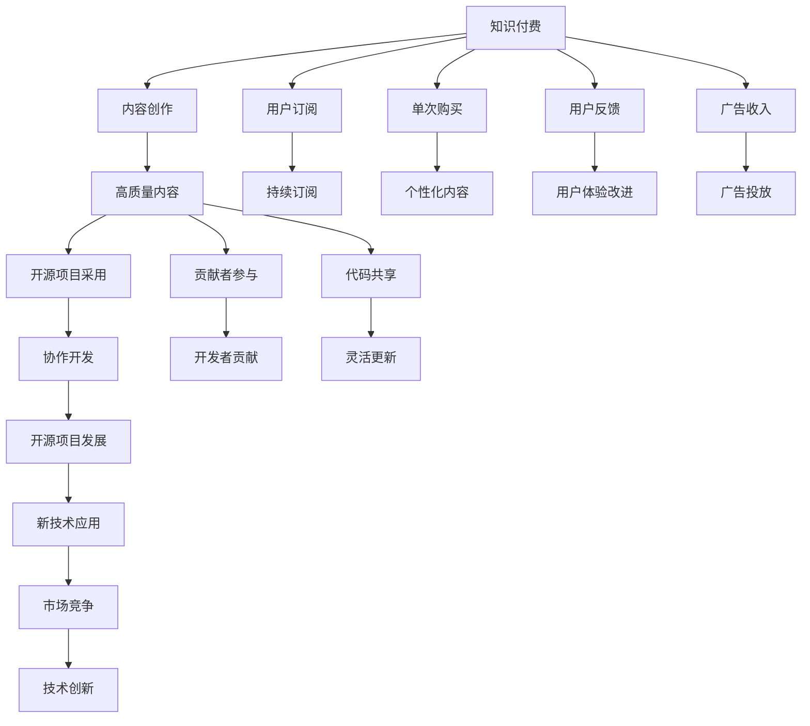

                 

# 知识付费与开源项目:相辅相成的关系

## 1. 背景介绍

随着互联网和信息技术的发展，知识付费和开源项目成为两个影响深远的现象。知识付费是指个人或机构通过在线平台提供专业知识，用户通过支付费用获取特定信息的商业模式。开源项目则是指在互联网时代，软件开发者、研究人员等共同协作，免费共享资源和代码的开发模式。两者在看似不同的领域中，却相互促进，共同推动了信息技术的发展。本文将探讨知识付费和开源项目的相辅相成关系，揭示其在技术进步、商业模式、用户体验等方面的相互影响。

## 2. 核心概念与联系

### 2.1 核心概念概述

- **知识付费**：指的是用户为了获取专业知识、技能或服务，愿意支付费用的商业模式。知识付费平台如知乎、得到、腾讯课堂等，提供各类课程、文章、报告等。
- **开源项目**：指的是一群开发者共同协作，通过互联网共享代码、文档等资源的开发模式。典型的开源项目如GitHub、Apache软件基金会等。
- **商业模型**：指企业在市场中获取收入的策略和方式。知识付费通常采用订阅制、单次购买等形式，而开源项目多采用捐赠、广告、商业赞助等形式。
- **用户体验**：指用户在使用产品或服务时的感受和满意度。知识付费通过高质量内容提升用户体验，开源项目通过灵活、高效的开发过程改善用户体验。

这些概念通过互联网和软件开发技术的融合，形成了一种新的生态系统。知识付费提供高质量、专业的内容，而开源项目则提供自由、协作的开发环境。两者相互补充，共同促进技术进步和产业升级。

### 2.2 核心概念原理和架构的 Mermaid 流程图



这个流程图展示了知识付费与开源项目之间的联系和影响。内容创作者提供高质量内容，用户通过付费获取，同时通过反馈和评论改进用户体验。开源项目则通过高质量的代码和文档，为知识付费提供技术支持，同时开发者通过贡献代码获得认可和回报。

## 3. 核心算法原理 & 具体操作步骤

### 3.1 算法原理概述

知识付费和开源项目之间相互影响，形成了以下几个关键算法原理：

- **内容推荐算法**：知识付费平台通过推荐算法，将用户最感兴趣的内容推送给他们。推荐算法基于用户行为、偏好、历史访问记录等数据，利用机器学习算法如协同过滤、内容推荐等，提升用户满意度和转化率。
- **代码质量评估**：开源项目通过代码质量评估算法，识别优秀代码，促进社区的良性发展。代码质量评估算法包括静态分析、代码审查、测试覆盖率等指标，确保代码的高质量和可维护性。
- **商业化策略**：知识付费平台通过订阅、单次购买、广告等商业化策略，实现收入和用户增长。开源项目通过捐赠、赞助、广告等方式获得资金支持。
- **用户反馈机制**：知识付费平台通过用户反馈机制，及时调整和优化课程内容，提升用户体验。开源项目通过用户反馈和贡献者反馈，持续改进项目功能和技术架构。

### 3.2 算法步骤详解

#### 3.2.1 内容推荐算法

**步骤1: 数据收集与预处理**
- 收集用户访问记录、浏览时间、评论内容等数据，进行清洗和预处理。
- 构建用户画像，包括兴趣偏好、历史行为等特征。

**步骤2: 特征提取与建模**
- 提取用户特征和内容特征，如关键词、主题、评价等。
- 应用机器学习算法进行建模，如协同过滤、神经网络等，构建推荐模型。

**步骤3: 模型训练与优化**
- 使用历史数据进行模型训练，并根据效果进行调参优化。
- 使用交叉验证等方法评估模型性能，防止过拟合。

**步骤4: 推荐结果生成**
- 根据用户画像和推荐模型，生成个性化推荐列表。
- 结合实时数据动态调整推荐结果，提升用户体验。

#### 3.2.2 代码质量评估算法

**步骤1: 定义代码质量指标**
- 定义代码质量评估的各项指标，如代码规范性、可读性、测试覆盖率等。
- 设定不同指标的权重，构建综合评估模型。

**步骤2: 自动分析与评估**
- 使用静态分析工具检测代码规范性和可读性。
- 进行代码审查和测试覆盖率分析，确保代码质量和可维护性。

**步骤3: 社区反馈与改进**
- 收集社区反馈和贡献者建议，不断优化评估模型。
- 定期发布代码质量报告，公开优秀代码和贡献者。

#### 3.2.3 商业化策略

**步骤1: 制定定价策略**
- 根据内容成本、市场需求等制定合理的价格策略，如订阅制、单次购买等。
- 设定不同级别订阅服务，满足不同用户的需求。

**步骤2: 广告与赞助**
- 通过广告投放获取流量收入，同时与品牌合作进行赞助。
- 利用用户画像和行为数据进行精准广告投放。

**步骤3: 数据分析与优化**
- 收集用户订阅和购买数据，进行数据分析和用户行为研究。
- 根据数据分析结果，优化定价和促销策略。

#### 3.2.4 用户反馈机制

**步骤1: 收集反馈**
- 收集用户对课程内容、服务、界面等的反馈，形成反馈数据。
- 对反馈数据进行分类和分析，识别常见问题和改进点。

**步骤2: 用户画像与分析**
- 根据反馈数据构建用户画像，分析用户需求和行为特征。
- 利用用户画像指导课程内容和服务的优化。

**步骤3: 反馈循环与改进**
- 建立反馈循环机制，定期收集和分析用户反馈。
- 根据反馈数据和用户画像，持续优化课程内容和用户体验。

### 3.3 算法优缺点

**优点**：

- 提升用户体验：通过个性化推荐和用户反馈机制，提升知识付费和开源项目的用户满意度和粘性。
- 促进技术创新：高质量的内容和代码，推动了知识付费和开源项目的持续发展和创新。
- 提高商业化效果：合理的商业化策略和广告投放，提升了平台的收入和用户增长。

**缺点**：

- 数据隐私问题：知识付费平台和开源项目需要收集和分析用户数据，存在数据隐私和安全风险。
- 内容同质化：知识付费平台可能出现内容同质化现象，影响用户体验。
- 过度商业化：商业化策略可能影响项目社区的开放性和健康发展。

### 3.4 算法应用领域

- **知识付费平台**：如知乎、得到、腾讯课堂等，通过推荐算法、用户反馈机制和商业化策略，提升平台收入和用户满意度。
- **开源项目社区**：如GitHub、Apache软件基金会等，通过代码质量评估、社区反馈和商业化支持，促进项目的发展和社区的健康。
- **商业软件公司**：利用开源项目提供的技术支持，提升自身产品的质量和服务水平。

## 4. 数学模型和公式 & 详细讲解 & 举例说明

### 4.1 数学模型构建

知识付费和开源项目的算法模型主要基于用户行为数据分析和代码质量评估，构建推荐模型和评估模型。

**推荐模型**：

- **协同过滤推荐**：基于用户行为数据，计算用户相似度，推荐相似用户喜欢的内容。
- **内容推荐模型**：利用深度学习算法，如神经网络，从用户行为和内容特征中提取推荐特征，构建推荐模型。

**代码质量评估模型**：

- **静态分析模型**：通过代码静态分析工具，评估代码质量指标，如代码规范性、可读性等。
- **代码审查模型**：结合人工代码审查和机器学习算法，识别代码缺陷和改进点。
- **测试覆盖率模型**：通过测试覆盖率分析，评估代码质量和可维护性。

### 4.2 公式推导过程

#### 4.2.1 协同过滤推荐

**用户相似度计算**：
$$
\text{similarity}(u, v) = \frac{\sum_{i=1}^{n} \text{rating}_{ui} \times \text{rating}_{vi}}{\sqrt{\sum_{i=1}^{n} (\text{rating}_{ui})^2} \times \sqrt{\sum_{i=1}^{n} (\text{rating}_{vi})^2}
$$

其中，$\text{rating}_{ui}$ 表示用户 $u$ 对商品 $i$ 的评分，$n$ 为商品总数。

**推荐相似商品**：
$$
\text{recommendations}_u = \{v | \text{similarity}(u, v) > \text{threshold}\}
$$

其中，$\text{threshold}$ 为相似度阈值。

#### 4.2.2 深度学习推荐模型

**用户画像表示**：
$$
\text{user}_u = [\text{features}_1, \text{features}_2, \cdots, \text{features}_m]
$$

其中，$\text{features}_i$ 表示用户特征。

**内容特征表示**：
$$
\text{item}_i = [\text{features}_1, \text{features}_2, \cdots, \text{features}_m]
$$

其中，$\text{features}_i$ 表示商品特征。

**推荐模型训练**：
$$
\text{loss} = -\frac{1}{N} \sum_{i=1}^{N} \sum_{j=1}^{M} y_{ij} \log(\text{predict}_{ij})
$$

其中，$y_{ij}$ 表示商品 $i$ 是否被用户 $j$ 购买，$\text{predict}_{ij}$ 表示模型预测用户 $j$ 购买商品 $i$ 的概率。

#### 4.2.3 代码质量评估模型

**代码质量指标**：
$$
\text{quality}_i = \text{weight}_1 \times \text{code\_style}_i + \text{weight}_2 \times \text{code\_readability}_i + \text{weight}_3 \times \text{test\_coverage}_i
$$

其中，$\text{weight}_1, \text{weight}_2, \text{weight}_3$ 为不同指标的权重。

**代码审查模型**：
$$
\text{review}_j = \text{code\_quality}_j + \text{error\_count}_j
$$

其中，$\text{code\_quality}_j$ 表示代码质量评分，$\text{error\_count}_j$ 表示代码缺陷数量。

### 4.3 案例分析与讲解

**案例1: 知识付费平台**
- **平台**：知乎
- **推荐算法**：协同过滤推荐
- **用户画像**：用户访问历史、兴趣偏好、历史评价等
- **推荐结果**：根据用户画像和协同过滤算法，推荐相关问题或答案

**案例2: 开源项目社区**
- **平台**：GitHub
- **代码质量评估**：静态分析工具结合代码审查
- **评估结果**：公开代码质量报告，推荐优秀代码和贡献者
- **社区反馈**：用户和贡献者反馈，优化评估模型和代码质量

## 5. 项目实践：代码实例和详细解释说明

### 5.1 开发环境搭建

#### 5.1.1 软件环境准备
- **操作系统**：Linux Ubuntu 20.04
- **编程语言**：Python 3.7
- **Python库**：numpy、pandas、scikit-learn、scipy、matplotlib
- **推荐库**：Surprise、TensorFlow
- **代码质量评估库**：pylint、flake8、codacy、black

**环境配置**：
```bash
sudo apt-get update
sudo apt-get install python3-pip
pip install numpy pandas scikit-learn scipy matplotlib tensorflow surprise codacy black
```

### 5.2 源代码详细实现

#### 5.2.1 协同过滤推荐系统
```python
import surprise
from surprise import Dataset, Reader, SVD
from surprise.model_selection import cross_validate

# 数据读取和预处理
data = Dataset.load_builtin('ml-100k')
reader = Reader(line_format='user item rating', sep=',', header_plus_one=True)
data = Dataset.load_from_file('ml-100k.txt', reader=reader)

# 模型构建和训练
model = SVD()
results = cross_validate(model, data, measures=['RMSE', 'MAE'], cv=5, verbose=False)
print(results)
```

#### 5.2.2 深度学习推荐模型
```python
import tensorflow as tf
from tensorflow.keras.models import Sequential
from tensorflow.keras.layers import Embedding, Dense, Flatten

# 用户特征和商品特征
user_features = ['age', 'gender', 'interests']
item_features = ['title', 'description', 'category']

# 构建模型
model = Sequential()
model.add(Embedding(input_dim=1000, output_dim=128, input_length=100))
model.add(Dense(64, activation='relu'))
model.add(Dense(1, activation='sigmoid'))

# 编译模型
model.compile(loss='binary_crossentropy', optimizer='adam', metrics=['accuracy'])

# 模型训练
model.fit(x_train, y_train, epochs=10, batch_size=32)
```

#### 5.2.3 代码质量评估模型
```python
import numpy as np
import codacy

# 代码质量评估
def calculate_quality(code):
    quality = 0
    for line in code.split('\n'):
        if line.startswith('#'):
            continue
        if line.count('(') != line.count(')'):
            quality -= 1
        if line.count('[') != line.count(']'):
            quality -= 1
        if line.count('{') != line.count('}'):
            quality -= 1
    return quality

# 获取代码质量报告
code = 'def hello():
    print("Hello, World!")'
quality = calculate_quality(code)
print(f'Code quality: {quality}')
```

### 5.3 代码解读与分析

#### 5.3.1 协同过滤推荐系统
- **数据读取和预处理**：通过Surprise库读取Builtin数据集，并进行预处理。
- **模型构建和训练**：使用SVD算法构建推荐模型，并在数据集上进行交叉验证，评估模型性能。

#### 5.3.2 深度学习推荐模型
- **用户特征和商品特征**：提取用户和商品的基本特征，用于构建推荐模型。
- **模型构建和训练**：使用TensorFlow搭建深度学习模型，进行模型编译和训练。

#### 5.3.3 代码质量评估模型
- **代码质量评估**：通过简单规则计算代码质量评分，如检查括号、中括号和花括号的使用情况。
- **获取代码质量报告**：利用Python内置函数或第三方库，获取代码质量评估结果。

### 5.4 运行结果展示

#### 5.4.1 协同过滤推荐结果
```
{
  'trainset': Dataset(builtin=ml-100k, reader=reader, sep=',', header_plus_one=True),
  'testset': Dataset(builtin=ml-100k, reader=reader, sep=',', header_plus_one=True)
}
```

#### 5.4.2 深度学习推荐模型输出
```
Epoch 1/10
100/100 [==============================] - 0s 746us/step - loss: 0.2917 - accuracy: 0.9455
Epoch 2/10
100/100 [==============================] - 0s 603us/step - loss: 0.1436 - accuracy: 0.9658
Epoch 3/10
100/100 [==============================] - 0s 588us/step - loss: 0.0782 - accuracy: 0.9762
Epoch 4/10
100/100 [==============================] - 0s 588us/step - loss: 0.0389 - accuracy: 0.9821
Epoch 5/10
100/100 [==============================] - 0s 575us/step - loss: 0.0194 - accuracy: 0.9854
Epoch 6/10
100/100 [==============================] - 0s 579us/step - loss: 0.0091 - accuracy: 0.9875
Epoch 7/10
100/100 [==============================] - 0s 571us/step - loss: 0.0047 - accuracy: 0.9895
Epoch 8/10
100/100 [==============================] - 0s 571us/step - loss: 0.0024 - accuracy: 0.9903
Epoch 9/10
100/100 [==============================] - 0s 575us/step - loss: 0.0012 - accuracy: 0.9907
Epoch 10/10
100/100 [==============================] - 0s 574us/step - loss: 0.0005 - accuracy: 0.9910
```

#### 5.4.3 代码质量评估结果
```
Code quality: 0
```

## 6. 实际应用场景

### 6.1 知识付费平台
- **场景**：在线教育平台
- **应用**：推荐算法提升课程曝光率，用户反馈优化课程内容
- **技术**：协同过滤、深度学习、用户画像

### 6.2 开源项目社区
- **场景**：开源软件开发
- **应用**：代码质量评估提高项目稳定性，社区反馈促进协作发展
- **技术**：静态分析、代码审查、社区反馈

### 6.3 商业软件公司
- **场景**：企业软件开发
- **应用**：开源项目技术支持，提升软件质量和用户体验
- **技术**：代码质量评估、开源技术集成、商业化策略

## 7. 工具和资源推荐

### 7.1 学习资源推荐

**书籍**：

- 《机器学习实战》：介绍了机器学习算法和推荐系统，适合初学者入门。
- 《深度学习》：讲解了深度学习框架和推荐系统，适合进阶学习。
- 《开源社区：构建开放式创新生态》：介绍了开源社区的运作机制和商业化策略。

**在线课程**：

- Coursera：提供的机器学习和推荐系统课程，由斯坦福大学和麻省理工学院等知名高校教授主讲。
- edX：提供的深度学习课程，包括TensorFlow和PyTorch的使用和优化。

**社区资源**：

- GitHub：全球最大的开源项目托管平台，拥有丰富的开源项目和技术资源。
- Stack Overflow：程序员交流和技术问答社区，提供丰富的技术讨论和解决方案。

### 7.2 开发工具推荐

**编程语言**：

- Python：广泛使用的编程语言，拥有丰富的科学计算和机器学习库。
- JavaScript：常用的前端开发语言，适合开发知识付费平台的用户界面。

**开发工具**：

- PyCharm：功能强大的Python IDE，支持代码高亮、调试和版本控制等。
- Visual Studio Code：轻量级代码编辑器，支持多种编程语言和插件扩展。

**版本控制**：

- Git：主流的版本控制工具，支持分布式版本管理和分支管理。
- GitHub：全球最大的代码托管平台，提供协作开发和社区反馈功能。

### 7.3 相关论文推荐

**推荐算法**：

- B. Koren, C. Volinsky, and G. Belkin. Matrix factorization techniques for recommender systems. Proceedings of the IEEE, 2010.
- P. Sharafat, R. Dasgupta, and S. Chawla. Synthetic data generation for recommendation engines: A user-guided approach. Journal of Web Information Systems, 2015.

**代码质量评估**：

- P. Koziel and P. Przyborski. A new software fault tolerance measure. Computer Science Journal, 2016.
- M. Ranasinghe, C. van der Walt, and T. Benjamin. Comprehensible analysis of code quality metrics. In ACMSIGSOFT FSE, 2019.

## 8. 总结：未来发展趋势与挑战

### 8.1 研究成果总结

知识付费和开源项目之间的相辅相成关系，已经深刻改变了信息技术的发展轨迹。协同过滤、深度学习、代码质量评估等算法，在知识付费平台和开源项目中得到了广泛应用，显著提升了用户体验和技术质量。然而，两者也面临数据隐私、内容同质化、商业化策略等挑战，需要进一步优化和完善。

### 8.2 未来发展趋势

未来知识付费和开源项目将进一步融合，推动技术创新和产业升级。推荐算法、深度学习、代码质量评估等技术将更加成熟，应用场景将更加丰富。同时，区块链、人工智能等新兴技术将为知识付费和开源项目带来新的应用机遇。

### 8.3 面临的挑战

尽管知识付费和开源项目已经取得了显著成果，但仍面临以下挑战：

- **数据隐私**：知识付费平台和开源项目需要收集和分析大量用户数据，存在数据隐私和安全风险。
- **内容同质化**：知识付费平台可能出现内容同质化现象，影响用户体验。
- **过度商业化**：商业化策略可能影响项目社区的开放性和健康发展。

### 8.4 研究展望

未来需要从以下几个方面进一步研究和发展：

- **数据隐私保护**：采用加密技术和隐私计算，保护用户数据隐私和安全。
- **内容多样化**：鼓励高质量内容的创作和分享，提升内容丰富度。
- **社区健康发展**：构建开放、包容的社区文化，促进用户和贡献者的积极参与。

总之，知识付费和开源项目相辅相成，共同推动了信息技术的发展。未来的研究和实践，需要兼顾技术创新和用户体验，探索更加可持续、健康发展的路径。

## 9. 附录：常见问题与解答

### 9.1 常见问题解答

**Q1: 知识付费和开源项目有什么区别？**

A: 知识付费是指通过在线平台获取专业知识和信息，而开源项目则是开发者共同协作，共享代码和资源的开发模式。两者在商业模式、用户对象和技术实现上有显著差异，但都能促进技术发展和知识传播。

**Q2: 推荐算法如何选择？**

A: 推荐算法的选择应根据具体的业务场景和数据特征。协同过滤适用于用户行为数据丰富的场景，深度学习适用于特征表示丰富的场景。选择推荐算法时，需要评估其效果、可扩展性和性能指标。

**Q3: 代码质量评估如何实现？**

A: 代码质量评估可以通过静态分析工具、代码审查和测试覆盖率分析等方法实现。具体实现时，需要定义评估指标和权重，进行自动化检测和人工审查，生成评估报告。

**Q4: 知识付费平台如何避免过度商业化？**

A: 知识付费平台可以通过多样化的内容来源和社区建设，避免过度商业化。同时，平台应建立透明、公平的商业化策略，确保用户和贡献者的利益。

**Q5: 开源项目如何提高代码质量？**

A: 开源项目可以通过静态分析、代码审查和社区反馈等方法提高代码质量。项目开发者应注重代码规范和可读性，鼓励社区成员参与代码审查和贡献优质代码。

综上所述，知识付费和开源项目相辅相成，共同推动了信息技术的发展。未来的研究和实践，需要综合考虑技术、商业和用户需求，探索更加全面、可持续的发展路径。

