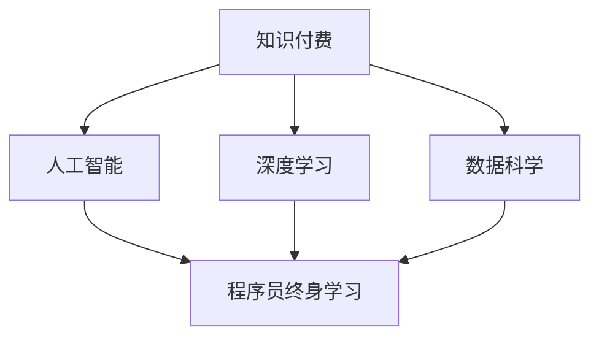

                 

# 知识付费与程序员终身学习的关系

## 1. 背景介绍

### 1.1 问题由来

在信息化快速发展的今天，知识获取的渠道变得前所未有的丰富，信息大爆炸带来了机遇，也带来了挑战。程序员作为信息时代最活跃的人群之一，不仅要应对日新月异的技术更新，还要保持终身学习的热情和能力。在这样一个充满竞争和变化的环境中，知识付费成为了一种新的趋势和手段，影响着程序员的学习方式和职业发展。

### 1.2 问题核心关键点

知识付费的兴起，本质上源于知识经济时代的到来。随着人工智能、大数据、区块链等技术的迅猛发展，程序员面临的技能需求也日益多样化，这使得终身学习变得至关重要。但同时，快速变化的知识体系和海量的学习资源，也给传统的学习和获取知识的方式带来了巨大的挑战。因此，如何高效地获取和利用知识，成为程序员们面临的重要课题。

## 2. 核心概念与联系

### 2.1 核心概念概述

为更好地理解知识付费与程序员终身学习的关系，本节将介绍几个核心概念：

- **知识付费（Knowledge Paywall）**：指通过付费获取知识或服务的过程。形式包括在线课程、订阅服务、电子书、专业讲座等。知识付费不仅仅是知识传输的一种方式，更是一种促使人们持续学习的机制。
- **程序员终身学习（Life-Long Learning）**：指程序员在其职业生涯中不断学习新知识和技能，以适应技术发展的需求。终身学习是程序员在动态变化的职业环境中保持竞争力的重要手段。
- **深度学习（Deep Learning）**：一种模拟人脑神经网络的工作机制的机器学习方法，在图像识别、语音识别、自然语言处理等领域取得了巨大成功。
- **人工智能（AI）**：指通过计算机程序和算法实现人类智能过程的模拟和扩展。AI的应用涵盖了从自动驾驶到智能客服等多个领域，是未来技术发展的重要方向。
- **数据科学（Data Science）**：涉及数据收集、处理、分析和建模等多个环节，以挖掘数据中的价值和知识。数据科学在金融、电商、医疗等诸多领域具有广泛应用。

这些核心概念之间的关系可以通过以下Mermaid流程图来展示：



这个流程图展示出知识付费如何与深度学习、人工智能、数据科学等技术发展相互促进，共同推动程序员终身学习的进程。

## 3. 核心算法原理 & 具体操作步骤

### 3.1 算法原理概述

知识付费与程序员终身学习的关系，可以从知识获取和知识利用的两个方面进行探讨。

在知识获取层面，知识付费提供了一种高效且专业化的学习路径。通过付费订阅优质的在线课程和资源，程序员可以快速掌握新技术、新知识，跟上技术发展的步伐。

在知识利用层面，程序员通过不断学习和应用新技术，可以提高自身的技术能力和职业竞争力，实现职业发展。

### 3.2 算法步骤详解

**Step 1: 选择合适的知识付费平台**

知识付费平台种类繁多，有基于订阅的，如Udemy、Coursera、EdX等；有基于单次购买的，如网易云课堂、腾讯课堂等。选择合适的平台，需要考虑课程内容、师资力量、用户评价等因素。

**Step 2: 制定学习计划**

明确学习的目标和方向，根据个人职业发展需求，选择合适的课程。制定详细的学习计划，合理分配学习时间，平衡工作与学习。

**Step 3: 实践与反馈**

学习新知识后，通过实践项目、参加技术交流等方式进行应用和巩固。同时，获取同行的反馈和建议，不断改进和优化学习策略。

**Step 4: 持续迭代**

技术更新迭代快，知识学习是一个持续的过程。需要定期回顾和更新学习计划，跟踪最新技术和趋势，保持学习的新鲜感和动力。

### 3.3 算法优缺点

**优点：**
1. **高效获取知识**：知识付费平台集成了大量优质资源，程序员可以快速获取所需知识。
2. **个性化学习**：可以根据个人需求和兴趣，选择合适课程，实现个性化学习。
3. **提升职业竞争力**：通过不断学习新技术，提高技术水平，增强职业竞争力。

**缺点：**
1. **费用较高**：高质量的付费课程往往价格不菲，对部分程序员来说可能负担较重。
2. **质量参差不齐**：市场上课程质量参差不齐，有时可能遇到劣质课程，浪费时间和金钱。
3. **缺乏实践机会**：部分课程偏重理论，缺乏实践机会，难以掌握实际应用技能。

### 3.4 算法应用领域

知识付费技术主要应用于以下几个领域：

- **在线教育**：如Udemy、Coursera等平台提供各类课程，覆盖编程、数据科学、人工智能等多个领域。
- **技能培训**：如Lynda、Skillshare等平台提供专业技能培训，如UI/UX设计、项目管理等。
- **软件开发**：如Pluralsight、Codecademy等平台提供编程语言、框架等软件开发相关课程。

## 4. 数学模型和公式 & 详细讲解 & 举例说明

### 4.1 数学模型构建

在知识付费和程序员终身学习的场景中，可以使用以下数学模型来描述知识获取和利用过程：

- **知识获取模型**：$K_{获取}=K_{订阅}+K_{单次购买}+K_{自学习}$，其中 $K_{获取}$ 表示获取的知识总量，$K_{订阅}$ 表示通过订阅平台获取的知识量，$K_{单次购买}$ 表示通过单次购买获取的知识量，$K_{自学习}$ 表示通过自学习获取的知识量。
- **知识利用模型**：$U_{利用}=L_{实践}+L_{反馈}+L_{迭代}$，其中 $U_{利用}$ 表示知识利用的效果，$L_{实践}$ 表示通过实践项目获取的知识量，$L_{反馈}$ 表示通过技术交流获取的知识量，$L_{迭代}$ 表示通过定期更新学习计划获取的知识量。

### 4.2 公式推导过程

以知识获取模型为例，推导 $K_{获取}$ 的计算公式。

设 $K_{订阅}$ 表示通过订阅平台获取的知识量，$K_{单次购买}$ 表示通过单次购买获取的知识量，$K_{自学习}$ 表示通过自学习获取的知识量，则：

$$
K_{获取} = K_{订阅} + K_{单次购买} + K_{自学习}
$$

其中，$K_{订阅}$ 与订阅课程数量、课程时长等因素有关，可以通过 $N_{订阅} \times T_{订阅}$ 计算。$K_{单次购买}$ 与单次课程数量、课程时长等因素有关，可以通过 $N_{单次} \times T_{单次}$ 计算。$K_{自学习}$ 与自学习投入时间、学习效率等因素有关，可以通过 $T_{自学习} \times E_{自学习}$ 计算。

### 4.3 案例分析与讲解

以某程序员为例，分析其通过知识付费平台和自学获得知识的路径。

该程序员订阅了Coursera上的Python编程课程，共计200门，每门课程时长60小时，共花费1200小时进行学习。此外，他还购买了Udemy上的机器学习课程，共计3门，每门课程时长150小时，共花费450小时进行学习。在完成课程学习后，他每周花费10小时进行自我学习，共计52周，共花费520小时进行自学。

根据公式，计算该程序员在知识获取方面的总量：

$$
K_{获取} = 200 \times 60 + 3 \times 150 + 520 = 14220 \text{ 小时}
$$

## 5. 项目实践：代码实例和详细解释说明

### 5.1 开发环境搭建

为了进行知识付费和学习计划的管理，我们需要开发一个应用程序。可以使用Python和Flask框架进行开发，开发环境搭建步骤如下：

1. 安装Python和Flask：
```bash
pip install flask
```

2. 创建Flask应用程序：
```python
from flask import Flask, render_template, request

app = Flask(__name__)

@app.route('/')
def index():
    return render_template('index.html')
```

3. 创建数据库：
```python
from flask_sqlalchemy import SQLAlchemy

db = SQLAlchemy(app)
```

### 5.2 源代码详细实现

下面是一个简单的知识付费平台和自学计划管理系统的代码实现：

**app.py**

```python
from flask import Flask, render_template, request, redirect, url_for
from flask_sqlalchemy import SQLAlchemy

app = Flask(__name__)

app.config['SQLALCHEMY_DATABASE_URI'] = 'sqlite:////tmp/test.db'
db = SQLAlchemy(app)

class User(db.Model):
    id = db.Column(db.Integer, primary_key=True)
    name = db.Column(db.String(50))
    courses = db.relationship('Course', backref='users')

class Course(db.Model):
    id = db.Column(db.Integer, primary_key=True)
    name = db.Column(db.String(50))
    duration = db.Column(db.Integer)
    cost = db.Column(db.Float)

@app.route('/')
def index():
    users = User.query.all()
    return render_template('index.html', users=users)

@app.route('/add_user', methods=['GET', 'POST'])
def add_user():
    if request.method == 'POST':
        name = request.form['name']
        user = User(name=name)
        db.session.add(user)
        db.session.commit()
        return redirect(url_for('index'))
    return render_template('add_user.html')

@app.route('/add_course', methods=['GET', 'POST'])
def add_course():
    if request.method == 'POST':
        name = request.form['name']
        duration = request.form['duration']
        cost = float(request.form['cost'])
        course = Course(name=name, duration=duration, cost=cost)
        db.session.add(course)
        db.session.commit()
        return redirect(url_for('index'))
    return render_template('add_course.html')

if __name__ == '__main__':
    app.run(debug=True)
```

**templates/index.html**

```html
<html>
    <body>
        <h1>知识付费平台</h1>
        <ul>
            
                <li>{{ user.name }} 购买了以下课程：</li>
                <ul>
                    
                        <li>{{ course.name }} - {{ course.duration }}小时 - ￥{{ course.cost }}元</li>
                    
                </ul>
            
            <h2>添加新用户</h2>
            <form method="POST" action="{{ url_for('add_user') }}">
                <label>Name:</label>
                <input type="text" name="name" required>
                <button type="submit">提交</button>
            </form>
            <h2>添加新课程</h2>
            <form method="POST" action="{{ url_for('add_course') }}">
                <label>Name:</label>
                <input type="text" name="name" required>
                <label>Duration:</label>
                <input type="text" name="duration" required>
                <label>Cost:</label>
                <input type="number" name="cost" required>
                <button type="submit">提交</button>
            </form>
        </ul>
    </body>
</html>
```

### 5.3 代码解读与分析

**app.py**

- 使用Flask框架创建Web应用程序，定义用户和课程的模型，并实现增删查改功能。
- 在index路由中查询所有用户，并在模板中展示其购买的课程。
- 在add_user和add_course路由中分别实现用户和课程的添加功能。

**templates/index.html**

- 在模板中使用Flask提供的循环和条件语句，动态展示用户和课程信息。
- 通过表单实现用户和课程的添加功能。

### 5.4 运行结果展示

运行程序后，在浏览器中访问http://127.0.0.1:5000/，即可看到首页。点击“添加新用户”和“添加新课程”按钮，即可添加新用户和课程。

## 6. 实际应用场景

### 6.1 知识付费平台

知识付费平台为程序员提供了丰富的学习资源和专业的课程服务，帮助程序员快速掌握新技术和工具，提高编程能力。

**应用场景：**
- **在线编程培训**：如LeetCode、HackerRank等平台，提供算法和数据结构的在线练习，帮助程序员提升编程技能。
- **技术课程学习**：如Udemy、Coursera等平台，提供系统化的课程，涵盖从初级到高级的技术知识点，覆盖前端、后端、全栈等多个方向。
- **实践项目**：如Kaggle、GitHub等平台，提供开源项目和数据集，帮助程序员通过实践项目学习新技术，积累经验。

### 6.2 自学计划管理系统

自学计划管理系统帮助程序员制定合理的学习计划，跟踪学习进度，提高学习效率。

**应用场景：**
- **学习路径规划**：根据个人职业需求和学习目标，制定详细的学习路径，包括课程选择、时间安排、评估标准等。
- **进度跟踪**：实时记录学习进度，生成学习报告，帮助程序员了解自己的学习效果和不足之处。
- **资源推荐**：根据学习计划和进度，推荐相关的学习资源和课程，提高学习效率。

### 6.3 编程社区和问答平台

编程社区和问答平台为程序员提供了一个交流学习和解决问题的平台，促进技术共享和知识传播。

**应用场景：**
- **技术交流**：如Stack Overflow、知乎等平台，程序员可以分享技术经验，交流编程心得，解决疑难问题。
- **开源项目协作**：如GitHub、GitLab等平台，程序员可以参与开源项目的开发和维护，积累实战经验。
- **知识共享**：如CSDN、博客园等平台，程序员可以撰写技术文章，分享学习心得，提升个人品牌影响力。

## 7. 工具和资源推荐

### 7.1 学习资源推荐

为了帮助程序员系统掌握知识付费和终身学习的理论基础和实践技巧，这里推荐一些优质的学习资源：

1. **《Python编程：从入门到实践》**：介绍了Python的基础语法、数据结构、网络编程等内容，适合初学者入门。
2. **《深入浅出大数据》**：介绍了大数据的基本概念、处理技术、应用场景等，适合有一定编程基础的学习者。
3. **《深度学习入门与实践》**：介绍了深度学习的基本原理、算法、工具等内容，适合希望深入学习深度学习的学习者。
4. **《人工智能：一种现代的方法》**：介绍了人工智能的基本概念、历史、现状和未来发展方向，适合对人工智能有兴趣的学习者。
5. **《数据科学实战》**：介绍了数据科学的基本流程、工具、算法等内容，适合希望学习数据科学的应用者。

通过对这些资源的学习实践，相信你一定能够快速掌握知识付费和程序员终身学习的精髓，并用于解决实际的NLP问题。

### 7.2 开发工具推荐

高效的开发离不开优秀的工具支持。以下是几款用于知识付费和学习计划开发的常用工具：

1. **Jupyter Notebook**：免费的Web应用程序，支持Python、R等编程语言，提供了可视化的代码执行和数据展示功能。
2. **Google Colab**：由Google推出的免费Jupyter Notebook服务，支持GPU和TPU加速，适合深度学习和大数据开发。
3. **PyCharm**：Google开源的Python集成开发环境，支持代码高亮、调试、测试等功能，适合Python开发。
4. **Visual Studio Code**：微软推出的轻量级代码编辑器，支持多种编程语言，适合快速开发和调试。
5. **GitHub**：全球最大的代码托管平台，支持版本控制、协作开发等功能，适合开源项目和代码共享。

合理利用这些工具，可以显著提升知识付费和学习计划的开发效率，加快创新迭代的步伐。

### 7.3 相关论文推荐

知识付费和程序员终身学习的相关论文，主要涉及在线学习、课程推荐、学习效果评估等方面。以下是几篇具有代表性的论文：

1. **《推荐系统——理论、算法与应用》**：介绍了推荐系统的发展历史、基本原理、算法实现等内容，适合希望了解推荐系统技术的学习者。
2. **《深度学习与自然语言处理》**：介绍了深度学习在NLP中的应用，如文本分类、机器翻译、情感分析等，适合对NLP有兴趣的学习者。
3. **《在线教育中的学习行为分析与建模》**：介绍了在线教育中的学习行为分析和建模方法，适合希望了解在线教育技术的学习者。
4. **《自适应学习系统设计》**：介绍了自适应学习系统的设计原理和实现方法，适合希望开发自适应学习系统的开发者。
5. **《机器学习中的正则化和优化算法》**：介绍了机器学习中的正则化和优化算法，适合希望了解机器学习基础技术的开发者。

这些论文代表了知识付费和程序员终身学习的最新研究成果，为相关技术的研究和开发提供了重要的理论支持。

## 8. 总结：未来发展趋势与挑战

### 8.1 研究成果总结

本文对知识付费与程序员终身学习的关系进行了全面系统的介绍。首先阐述了知识付费的兴起背景和程序员终身学习的必要性，明确了知识付费在程序员学习中的重要地位。其次，从知识获取和知识利用的两个方面，详细讲解了知识付费的学习过程和优化策略。最后，介绍了知识付费平台、自学计划管理系统、编程社区等实际应用场景，并推荐了相关学习资源和工具。

通过本文的系统梳理，可以看到，知识付费技术在程序员终身学习中扮演了重要的角色，极大地促进了程序员的学习效率和职业发展。未来，知识付费将与人工智能、大数据等技术进一步融合，为程序员提供更加个性化、智能化的学习体验。

### 8.2 未来发展趋势

展望未来，知识付费与程序员终身学习的关系将呈现以下几个发展趋势：

1. **个性化学习**：随着人工智能和大数据技术的发展，知识付费平台将能够提供更加个性化的学习路径和推荐，帮助程序员更高效地掌握新知识。
2. **混合学习**：知识付费平台将结合在线学习和线下培训，提供混合式学习模式，帮助程序员在多种学习场景中提升技能。
3. **虚拟现实（VR）和增强现实（AR）**：VR和AR技术将为知识付费和学习提供更加沉浸式、交互式的学习体验，提高学习效率和效果。
4. **在线协作学习**：知识付费平台将支持多人在线协作学习，促进技术共享和知识传播，提高团队学习效率。
5. **智能导师系统**：结合人工智能技术，知识付费平台将提供智能导师系统，为程序员提供个性化的学习建议和指导。

这些趋势将推动知识付费和学习平台的进一步发展，为程序员提供更加智能、高效的学习环境。

### 8.3 面临的挑战

尽管知识付费和学习技术已经取得了显著进展，但在迈向更加智能化、普适化应用的过程中，仍面临诸多挑战：

1. **课程质量和资源更新**：市场上课程质量和资源更新速度参差不齐，如何确保高质量和及时更新的资源供给，将是知识付费平台的重要挑战。
2. **用户行为分析与推荐**：用户行为分析需要大量数据和算法支持，如何在保证隐私和安全的前提下，实现个性化推荐，将是知识付费平台的技术难点。
3. **交互式学习体验**：VR和AR等技术需要高成本的硬件支持，如何降低技术门槛，实现更加广泛的应用，将是知识付费平台面临的现实挑战。
4. **在线协作学习的环境**：多人协作学习需要良好的沟通和协作工具支持，如何构建一个高效、便捷的在线协作平台，将是知识付费平台的发展方向。
5. **智能导师系统的设计**：智能导师系统的设计和实现需要复杂的算法和数据支持，如何确保其准确性和实用性，将是知识付费平台的重要研究方向。

### 8.4 研究展望

面对知识付费和学习平台面临的挑战，未来的研究需要在以下几个方面寻求新的突破：

1. **知识图谱与推荐系统结合**：将知识图谱引入推荐系统，实现更加精准的知识推荐，提升学习效果。
2. **用户行为建模与预测**：利用机器学习和深度学习技术，对用户行为进行建模和预测，实现更加个性化的推荐和学习路径规划。
3. **虚拟现实与增强现实应用**：结合VR和AR技术，开发更加沉浸式、交互式的学习工具，提升学习体验。
4. **混合式学习模式探索**：结合在线学习和线下培训，探索混合式学习模式，满足不同学习场景和需求。
5. **智能导师系统的优化**：结合自然语言处理和机器学习技术，开发智能导师系统，提供更加个性化的学习指导。

这些研究方向将推动知识付费和学习技术的进一步发展，为程序员提供更加智能、高效的学习环境。未来，知识付费和学习技术将继续与人工智能、大数据等技术深度融合，为程序员终身学习提供更加全面、智能的支持。

## 9. 附录：常见问题与解答

**Q1：知识付费是否真的能提高程序员的学习效率？**

A: 知识付费作为一种高效的学习方式，能够帮助程序员快速获取高质量的学习资源，掌握新技术和工具。同时，知识付费平台提供了系统的学习路径和评估标准，能够指导程序员制定合理的学习计划，提升学习效果。因此，知识付费在一定程度上可以提高程序员的学习效率，加速职业发展。

**Q2：如何选择合适的知识付费平台？**

A: 选择合适的知识付费平台需要考虑课程内容、师资力量、用户评价等因素。具体来说，可以关注以下几个方面：
1. 平台提供的课程内容是否全面、深入，是否覆盖了当前热门和前沿技术。
2. 平台提供的师资力量是否强大，是否具有丰富的教学经验和实际项目经验。
3. 平台的用户评价如何，是否存在大量高质量的课程和用户反馈。
4. 平台的学习社区是否活跃，是否提供技术交流和讨论的空间。

**Q3：如何制定合理的学习计划？**

A: 制定合理的学习计划需要考虑个人职业目标和当前技能水平。具体来说，可以遵循以下几个步骤：
1. 明确学习目标，确定需要掌握的技术和工具。
2. 评估当前技能水平，确定需要提升的技能和不足的地方。
3. 选择合适的课程和资源，制定详细的时间安排和学习路径。
4. 设定评估标准，定期回顾和调整学习计划，确保学习效果。

**Q4：如何利用知识付费平台进行自学？**

A: 利用知识付费平台进行自学需要遵循以下几个步骤：
1. 选择合适的课程和资源，制定详细的学习计划。
2. 按照学习计划逐步学习，做好笔记和总结。
3. 通过实践项目和开源项目进行应用和巩固，提高实战能力。
4. 参加技术交流和社区讨论，获取反馈和建议，不断改进学习策略。

**Q5：如何评估知识付费平台的教学效果？**

A: 评估知识付费平台的教学效果需要考虑以下几个方面：
1. 课程内容和师资力量是否符合预期，是否能够帮助提升技能。
2. 学习过程中是否遇到问题，平台是否提供了及时的技术支持和帮助。
3. 学习效果是否显著，是否能够满足职业发展的需求。
4. 平台的用户评价和学习社区是否活跃，是否能够提供持续的学习资源和交流机会。

通过对这些问题的回答，相信你一定能够更加全面地了解知识付费与程序员终身学习的关系，并在实际应用中取得更好的效果。

---

作者：禅与计算机程序设计艺术 / Zen and the Art of Computer Programming

