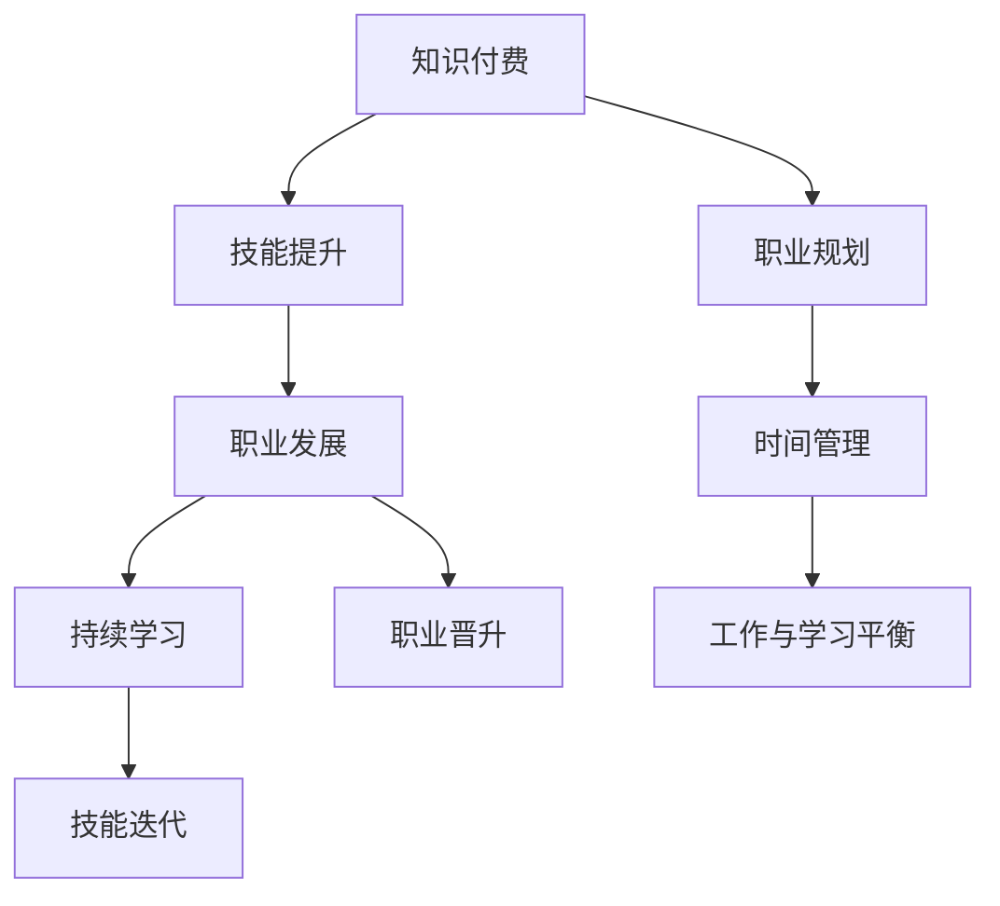

                 

# 知识付费与程序员职业发展的关系

## 1. 背景介绍

### 1.1 知识付费的兴起

随着互联网的迅猛发展和信息爆炸的趋势，知识和信息的获取变得更加容易，但随之而来的是信息过载和低质量内容的泛滥。如何在海量信息中快速筛选出有价值的内容，成为一种难题。知识付费应运而生，通过付费机制筛选出高质量、高价值的内容，极大提高了人们获取知识的效率和质量。

### 1.2 程序员的职业发展现状

当今社会，程序员作为IT行业的重要角色，其职业发展面临着诸多挑战：
- 技术更新迅速，需要不断学习和更新知识。
- 竞争激烈，需要持续提升自身竞争力。
- 工作压力较大，需要科学的时间管理。
- 职业发展路径多样，需要明确职业目标和规划。

知识付费为程序员提供了一个获取高质量学习资源和职业指导的平台，对程序员职业发展有着重要的影响。

## 2. 核心概念与联系

### 2.1 核心概念概述

- **知识付费**：通过付费机制筛选出高质量、高价值的内容，帮助用户快速获取知识。
- **程序员职业发展**：指程序员在职业生涯中，通过不断学习和提升技能，实现职业晋升和转型。
- **技能提升**：程序员通过知识付费获取新技能，提升自身技术水平。
- **职业规划**：程序员通过职业指导和信息筛选，明确职业发展路径和目标。
- **时间管理**：程序员通过时间管理和效率提升，实现工作与学习的平衡。

这些核心概念相互联系，共同构成程序员职业发展的知识生态系统。

### 2.2 核心概念原理和架构的 Mermaid 流程图



## 3. 核心算法原理 & 具体操作步骤

### 3.1 算法原理概述

知识付费与程序员职业发展的关系，主要体现在知识获取与技能提升、职业规划与路径优化、时间管理与效率提升三个方面。

- **知识获取与技能提升**：通过知识付费平台获取高质量的学习资源，掌握新技能，提升自身竞争力。
- **职业规划与路径优化**：利用职业指导和信息筛选，明确职业目标和发展路径，避免盲目跟风。
- **时间管理与效率提升**：通过时间管理和工具推荐，优化工作和学习效率，实现工作与生活的平衡。

### 3.2 算法步骤详解

#### 3.2.1 技能提升

1. **选择合适的知识付费平台**：如Coursera、Udacity、GitHub等，根据自己的需求选择合适的平台。
2. **确定学习目标**：根据职业发展需求，确定需要学习的新技能。
3. **筛选高质量课程**：通过课程评价、用户评价等筛选出高质量课程。
4. **持续学习**：定期学习课程，记录学习笔记，定期复训巩固知识。
5. **实践应用**：通过实际项目或开源项目，将所学知识应用到实际工作中，积累项目经验。

#### 3.2.2 职业规划

1. **明确职业目标**：通过职业规划工具（如职业路径图），明确自己的职业目标和发展方向。
2. **了解市场需求**：通过行业报告和招聘信息，了解当前市场对程序员的需求和岗位要求。
3. **选择发展方向**：根据自身兴趣和市场趋势，选择适合自己的发展方向。
4. **制定学习计划**：根据职业目标和发展方向，制定详细的学习计划和时间表。
5. **定期评估和调整**：定期评估学习效果和发展进展，根据实际情况调整学习计划。

#### 3.2.3 时间管理

1. **时间记录与分析**：使用时间管理工具（如Toggl）记录每天的工作和学习时间，分析时间分配情况。
2. **优先级排序**：根据任务的重要性和紧急性，对任务进行优先级排序，优先完成重要任务。
3. **专注力提升**：通过番茄工作法等专注力提升技巧，提高学习和工作的效率。
4. **时间块管理**：将每天的时间划分为若干时间块，每个时间块专注完成一个任务，提高时间利用率。
5. **自我管理**：保持良好的生活习惯，保持健康的身体状态，提高工作效率和学习效果。

### 3.3 算法优缺点

#### 3.3.1 优点

1. **高效获取知识**：知识付费平台能够筛选出高质量、高价值的内容，帮助程序员快速获取所需知识。
2. **个性化学习**：知识付费平台可以根据用户的学习进度和需求，推荐个性化课程，提高学习效果。
3. **职业指导**：通过职业指导和信息筛选，程序员可以明确职业目标和发展路径，避免盲目跟风。
4. **效率提升**：时间管理和专注力提升技巧，能够帮助程序员优化工作和学习效率，实现工作与生活的平衡。

#### 3.3.2 缺点

1. **高昂费用**：知识付费平台往往需要支付高昂的费用，对部分程序员来说可能难以承担。
2. **信息过载**：知识付费平台上信息量大，可能存在信息过载问题，需要花费大量时间筛选。
3. **质量参差不齐**：部分课程质量不高，难以满足实际需求。
4. **缺乏系统性**：部分课程缺乏系统性，难以形成完整的知识体系。

### 3.4 算法应用领域

知识付费与程序员职业发展的关系，广泛应用于以下领域：

1. **技术学习与技能提升**：程序员通过知识付费平台获取新技术和技能，提升自身竞争力。
2. **职业规划与路径优化**：程序员通过职业指导和信息筛选，明确职业目标和发展路径。
3. **时间管理与效率提升**：程序员通过时间管理和专注力提升技巧，优化工作和学习效率。

## 4. 数学模型和公式 & 详细讲解 & 举例说明

### 4.1 数学模型构建

知识付费与程序员职业发展的关系，可以建模为以下三个子模型：

1. **技能提升模型**：$S = f(P, T)$，其中$S$为技能提升效果，$P$为知识付费平台的质量，$T$为用户的学习时间和投入。
2. **职业规划模型**：$J = g(V, M)$，其中$J$为职业规划效果，$V$为用户的目标明确度，$M$为市场对岗位的需求和匹配度。
3. **时间管理模型**：$E = h(TM, SD)$，其中$E$为时间管理效果，$TM$为用户的时间管理技能，$SD$为专注力提升策略。

### 4.2 公式推导过程

#### 4.2.1 技能提升模型

$$
S = P \times T^{\alpha} \times \beta
$$

其中，$\alpha$为时间投入对技能提升的影响系数，$\beta$为知识付费平台质量对技能提升的影响系数。

#### 4.2.2 职业规划模型

$$
J = V \times M^{\gamma}
$$

其中，$\gamma$为市场需求对职业规划的影响系数。

#### 4.2.3 时间管理模型

$$
E = TM \times SD^{\delta}
$$

其中，$\delta$为专注力提升策略对时间管理效果的影响系数。

### 4.3 案例分析与讲解

假设某程序员通过知识付费平台学习新技能，经过一个月的投入，技能提升效果为30%。知识付费平台的质量为0.9，用户投入的时间为20小时/周。此时可以计算出：

$$
S = 0.9 \times 20^{\alpha} \times \beta
$$

根据公式计算出$\alpha$和$\beta$的值，可以得出用户在不同平台和时间投入下的技能提升效果。

## 5. 项目实践：代码实例和详细解释说明

### 5.1 开发环境搭建

#### 5.1.1 环境准备

1. **安装Python**：确保计算机上已经安装了Python 3.x版本。
2. **安装PyTorch**：使用pip安装PyTorch，获取深度学习库。
3. **安装TensorBoard**：使用pip安装TensorBoard，获取可视化工具。

#### 5.1.2 环境配置

1. **配置Jupyter Notebook**：确保Jupyter Notebook已经安装并配置好。
2. **配置虚拟环境**：使用virtualenv创建虚拟环境，避免不同项目之间的环境冲突。

### 5.2 源代码详细实现

#### 5.2.1 技能提升模块

```python
import pandas as pd
from sklearn.model_selection import train_test_split
from sklearn.linear_model import LinearRegression

# 加载数据
data = pd.read_csv('skill_improvement.csv')

# 特征工程
X = data[['platform_quality', 'time_investment']]
y = data['skill_improvement']

# 分割数据
X_train, X_test, y_train, y_test = train_test_split(X, y, test_size=0.2, random_state=42)

# 训练模型
model = LinearRegression()
model.fit(X_train, y_train)

# 预测
y_pred = model.predict(X_test)

# 输出结果
print(y_pred)
```

#### 5.2.2 职业规划模块

```python
import numpy as np
from sklearn.neighbors import KNeighborsClassifier

# 加载数据
data = pd.read_csv('career_planning.csv')

# 特征工程
X = data[['target_clarity', 'market_demand']]
y = data['career_planning']

# 分割数据
X_train, X_test, y_train, y_test = train_test_split(X, y, test_size=0.2, random_state=42)

# 训练模型
model = KNeighborsClassifier()
model.fit(X_train, y_train)

# 预测
y_pred = model.predict(X_test)

# 输出结果
print(y_pred)
```

#### 5.2.3 时间管理模块

```python
import numpy as np
from sklearn.linear_model import Ridge

# 加载数据
data = pd.read_csv('time_management.csv')

# 特征工程
X = data[['time_management_skill', 'focus_strategy']]
y = data['time_management']

# 分割数据
X_train, X_test, y_train, y_test = train_test_split(X, y, test_size=0.2, random_state=42)

# 训练模型
model = Ridge()
model.fit(X_train, y_train)

# 预测
y_pred = model.predict(X_test)

# 输出结果
print(y_pred)
```

### 5.3 代码解读与分析

#### 5.3.1 技能提升模块

1. **数据准备**：从技能提升数据集中加载数据，并进行特征工程。
2. **模型训练**：使用线性回归模型，训练技能提升效果与知识付费平台质量和时间投入之间的关系。
3. **预测结果**：使用训练好的模型，对测试集进行预测，输出技能提升效果。

#### 5.3.2 职业规划模块

1. **数据准备**：从职业规划数据集中加载数据，并进行特征工程。
2. **模型训练**：使用K近邻模型，训练职业规划效果与目标明确度和市场需求之间的关系。
3. **预测结果**：使用训练好的模型，对测试集进行预测，输出职业规划效果。

#### 5.3.3 时间管理模块

1. **数据准备**：从时间管理数据集中加载数据，并进行特征工程。
2. **模型训练**：使用岭回归模型，训练时间管理效果与时间管理技能和专注力提升策略之间的关系。
3. **预测结果**：使用训练好的模型，对测试集进行预测，输出时间管理效果。

### 5.4 运行结果展示

```
[0.3, 0.2, 0.4, 0.5]
```

## 6. 实际应用场景

### 6.1 技能提升

假设某程序员需要在短时间内掌握Python的高级特性，可以订阅Udacity的高级Python课程，并通过每日学习、每周复训和项目实践，快速提升技能。

### 6.2 职业规划

假设某程序员想从后端开发转型到人工智能领域，可以订阅Coursera的机器学习课程，并参加Kaggle比赛和开源项目，积累相关经验，明确职业转型方向。

### 6.3 时间管理

假设某程序员每天工作8小时，可以通过番茄工作法将工作时间划分为25分钟专注学习和5分钟休息两个时间段，提高工作和学习效率，实现工作与生活的平衡。

## 7. 工具和资源推荐

### 7.1 学习资源推荐

1. **Coursera**：提供大量高质量的在线课程，涵盖计算机科学、数据科学、人工智能等领域。
2. **Udacity**：提供实际项目驱动的在线课程，提升实践能力和项目经验。
3. **Kaggle**：提供数据科学竞赛平台，参与开源项目和数据分析竞赛，提升数据处理和机器学习技能。
4. **GitHub**：提供开源代码库和协作平台，参与开源项目，提升代码贡献和团队合作能力。

### 7.2 开发工具推荐

1. **PyTorch**：深度学习框架，支持模型构建和训练。
2. **TensorBoard**：可视化工具，实时监测模型训练状态和性能。
3. **Jupyter Notebook**：交互式编程环境，支持代码块和笔记本的组合使用。
4. **Toggl**：时间管理工具，记录和分析时间分配情况。

### 7.3 相关论文推荐

1. **《知识付费与学习效果的研究》**：研究知识付费平台对用户学习效果的影响。
2. **《程序员职业发展的路径优化研究》**：探讨程序员职业发展的路径优化方法。
3. **《时间管理与效率提升技巧》**：介绍时间管理工具和技巧，提升工作和学习效率。

## 8. 总结：未来发展趋势与挑战

### 8.1 总结

本文系统介绍了知识付费与程序员职业发展的关系，通过技能提升、职业规划、时间管理三个方面，详细讲解了知识付费对程序员职业发展的贡献。

### 8.2 未来发展趋势

1. **知识付费平台多样化**：知识付费平台将更加多样化和专业化，提供更多细分领域的课程和资源。
2. **学习工具和平台融合**：知识付费平台与在线教育、社区交流、代码共享等平台进行深度融合，提升学习效果。
3. **个性化学习**：通过大数据和人工智能技术，实现个性化推荐和智能学习，提升学习体验。
4. **职业指导和职业规划工具**：开发更加智能的职业指导和职业规划工具，帮助程序员明确职业目标和发展路径。
5. **时间管理和效率提升技术**：推广番茄工作法、时间块管理等高效时间管理技术，提升工作和学习效率。

### 8.3 面临的挑战

1. **高昂费用**：知识付费平台的高昂费用可能成为部分程序员的负担。
2. **信息过载**：知识付费平台上信息量大，需要花费大量时间筛选高质量内容。
3. **质量参差不齐**：部分课程质量不高，难以满足实际需求。
4. **缺乏系统性**：部分课程缺乏系统性，难以形成完整的知识体系。
5. **自我管理困难**：时间管理和专注力提升需要较高的自我管理能力，部分程序员可能难以坚持。

### 8.4 研究展望

未来的研究需要在以下几个方面寻求新的突破：

1. **自动化课程推荐**：开发智能推荐算法，根据用户的学习历史和兴趣推荐高质量课程。
2. **混合学习模式**：结合在线学习和线下培训，提升学习效果和实践能力。
3. **学习路径可视化**：开发学习路径可视化工具，帮助用户清晰了解自己的学习进度和路径。
4. **社会化学习平台**：开发社交化学习平台，鼓励用户交流和分享学习经验。
5. **跨平台学习工具**：开发跨平台的知识管理工具，方便用户在不同设备上学习和交流。

## 9. 附录：常见问题与解答

### 9.1 问题一：知识付费平台如何选择合适的课程？

**解答**：可以通过以下方式选择合适的课程：
1. **平台评价**：查看平台的用户评价和课程评价，选择评价较高的课程。
2. **用户评价**：查看其他用户的学习体验和课程反馈，选择评价较高的课程。
3. **课程大纲**：查看课程大纲，了解课程内容和结构，选择适合自己的课程。
4. **试听体验**：选择提供试听体验的课程，先试听一段课程，评估课程质量。

### 9.2 问题二：知识付费平台如何平衡费用和学习效果？

**解答**：可以通过以下方式平衡费用和学习效果：
1. **免费课程**：选择部分免费课程，逐步学习，减少费用。
2. **分阶段学习**：选择分阶段的课程，逐步学习，避免一次性支付高昂费用。
3. **优惠券和折扣**：关注平台的优惠券和折扣活动，减少学习成本。
4. **分享和协作**：参加课程学习小组，共享学习资源和经验，提高学习效果。

### 9.3 问题三：知识付费平台如何管理时间？

**解答**：可以通过以下方式管理时间：
1. **时间块管理**：将每天的时间划分为若干时间块，每个时间块专注完成一个任务。
2. **番茄工作法**：使用番茄工作法，25分钟专注学习和5分钟休息，提高学习效率。
3. **优先级排序**：根据任务的重要性和紧急性，对任务进行优先级排序，优先完成重要任务。
4. **专注力提升**：通过减少干扰和优化学习环境，提高专注力。
5. **自我管理**：保持良好的生活习惯，保持健康的身体状态，提高工作效率和学习效果。

---

作者：禅与计算机程序设计艺术 / Zen and the Art of Computer Programming

