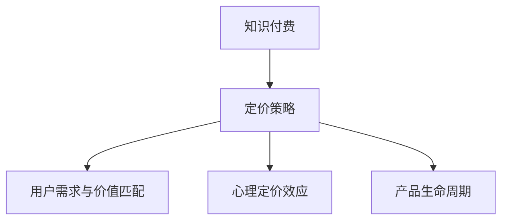
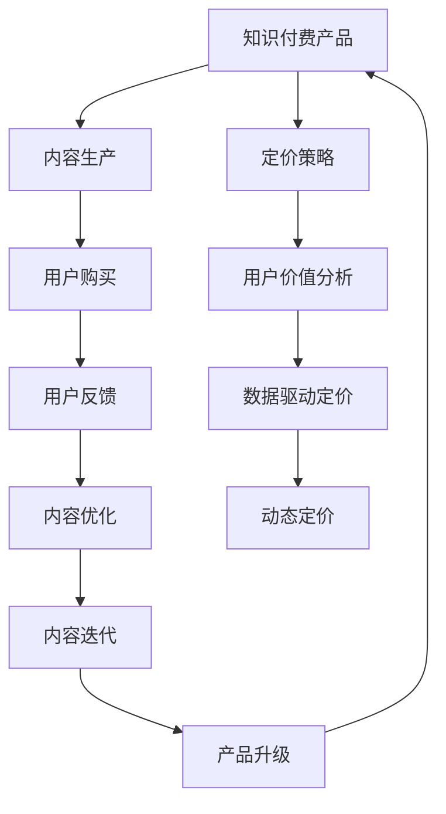

                 

# 知识付费产品定价策略:程序员版

> 关键词：知识付费, 程序员, 定价策略, 数据分析, 市场定位, 心理定价, 产品生命周期, 会员制模式, 订阅经济

## 1. 背景介绍

### 1.1 问题由来

知识付费的概念在近年来逐渐兴起，各大知识付费平台如得到、知乎、微信读书等迅速崛起，为内容创作者提供了全新的变现渠道。尤其是在程序员群体中，知识付费产品的需求尤为旺盛，原因主要有以下几点：

- **高技能需求**：随着技术快速迭代，程序员需要不断学习新的编程语言、框架和技术栈，以保持竞争力。
- **时间成本**：相比于其他职业，程序员的工作强度高、时间紧迫，难以抽出大量时间进行自学。
- **信任危机**：互联网内容鱼龙混杂，如何筛选出优质、有价值的教程成为一大难题。

面对这一需求，知识付费平台纷纷推出了以程序员为目标用户的专业课程和培训，包括编程语言、软件开发、架构设计、算法和数据结构等领域，涵盖从入门到高级的各个层次。但随之而来的问题是，这些知识付费产品的定价如何确定？不同的产品定价策略是否会对用户行为产生影响？本文将探讨知识付费产品，尤其是面向程序员的知识付费产品的定价策略，以期帮助内容创作者制定更为有效的价格体系。

### 1.2 问题核心关键点

知识付费产品的定价问题，实际上涉及多个维度的考虑：
- **用户需求与价值匹配**：如何确定用户对不同内容的愿意支付的价格？
- **产品成本与利润平衡**：内容生产成本与最终售价应如何分配？
- **市场竞争与差异化定位**：如何根据市场环境和竞争对手定价，以及如何定位自身产品的独特价值？
- **心理定价效应**：如何通过定价策略影响用户的购买行为，提升转化率？

通过理解这些核心关键点，可以对知识付费产品，尤其是面向程序员的知识付费产品进行有效的定价策略设计。

## 2. 核心概念与联系

### 2.1 核心概念概述

- **知识付费**：指用户为获取有价值、有深度的信息、知识和技能而支付费用的行为。这一模式不仅限于图书、视频等传统媒体，也扩展到在线课程、培训、咨询等新兴形式。

- **定价策略**：指企业为了在竞争激烈的市场中获取最大利润，通过合理定价，提升用户价值感，实现用户增长和品牌建设的一系列策略。

- **用户需求与价值匹配**：理解用户对知识付费产品的需求，并将其转化为可操作的定价策略，确保用户价值最大化。

- **心理定价效应**：消费者对价格的感知与实际购买行为密切相关，因此定价时需考虑消费者的心理预期和行为模式。

- **产品生命周期**：知识付费产品如同其他产品一样，也会经历引入期、成长期、成熟期和衰退期四个阶段，每个阶段适用的定价策略也不同。

这些概念之间的联系可以通过以下Mermaid流程图来展示：



### 2.2 核心概念原理和架构的 Mermaid 流程图



## 3. 核心算法原理 & 具体操作步骤

### 3.1 算法原理概述

知识付费产品的定价策略，本质上是一种基于数据驱动的动态定价模型。这一模型考虑了用户需求、内容价值、成本、市场环境等多重因素，通过科学的方法确定最优定价。

具体来说，定价模型主要包括以下步骤：
1. **用户需求分析**：通过数据分析，理解不同用户的消费行为和需求偏好。
2. **内容价值评估**：评估内容的质量、独特性和实用性，确定其对用户的价值。
3. **成本分析**：计算内容生产、运营和推广的总成本。
4. **市场分析**：分析市场竞争环境，理解竞争对手的定价策略。
5. **心理定价效应**：研究消费者对价格的反应，制定心理定价策略。
6. **动态定价**：根据用户行为和市场反馈，动态调整定价，以最大化利润。

### 3.2 算法步骤详解

#### 3.2.1 用户需求分析

1. **用户画像构建**：
   - 通过大数据分析，构建用户画像，了解用户的职业、技能水平、学习习惯等特征。
   - 例如，对于程序员，可以构建编程语言（如Python、Java等）、技能水平（初级、中级、高级）、学习频率（每天、每周等）等多维度画像。

2. **用户行为分析**：
   - 跟踪用户的行为数据，如访问时长、观看次数、评论互动等，了解用户对不同内容的偏好。
   - 例如，对于某编程课程，可以统计用户观看次数、完成课程比例、平均评价分数等。

#### 3.2.2 内容价值评估

1. **内容质量评估**：
   - 通过专家评审、用户反馈、评论评分等方式，评估内容的完整性、准确性和实用性。
   - 例如，对于某编程视频教程，专家评审其知识点覆盖度、讲解清晰度、代码质量等。

2. **内容独特性评估**：
   - 评估内容相对于现有市场资源的独特性和创新性。
   - 例如，某算法课程是否可以提供其他课程没有的新算法或新技术。

3. **内容实用性评估**：
   - 评估内容对用户实际工作的帮助和提升效果。
   - 例如，某数据结构课程是否能够帮助用户提升算法效率、减少错误率。

#### 3.2.3 成本分析

1. **内容生产成本**：
   - 计算内容制作、录制、编辑、包装的总成本。
   - 例如，视频教程的制作成本包括设备租赁、场地租赁、设备购买、脚本编写、录制等。

2. **运营推广成本**：
   - 计算内容上线后的运营、推广和维护成本。
   - 例如，广告投放、用户互动、内容更新等。

3. **利润计算**：
   - 根据成本和预期收益，计算产品定价。
   - 例如，某视频教程的成本为5000元，预期收益为10000元，则定价为5000/10000=50%。

#### 3.2.4 市场分析

1. **竞争对手分析**：
   - 调研主要竞争对手的定价策略，了解其产品的定位、用户反馈和市场占有率。
   - 例如，分析某视频课程平台中类似课程的价格范围、用户评价和销售情况。

2. **市场趋势分析**：
   - 分析市场对知识付费产品的接受度和趋势，了解用户对价格敏感度。
   - 例如，通过市场调研了解用户对某课程类型的价格敏感度。

#### 3.2.5 心理定价效应

1. **定价策略设计**：
   - 根据用户心理，设计合理的定价策略。
   - 例如，采用“奇数定价”策略，如9.99元，而非10.00元，以提升购买意愿。

2. **促销策略设计**：
   - 设计促销活动，如折扣、团购、限时优惠等，刺激用户购买。
   - 例如，某平台在特定节日推出“限时五折优惠”活动。

3. **用户反馈收集**：
   - 收集用户对定价的反馈，优化定价策略。
   - 例如，通过调查问卷收集用户对某课程定价的意见和建议。

#### 3.2.6 动态定价

1. **实时价格调整**：
   - 根据用户行为、市场反馈、竞争对手定价等实时调整产品价格。
   - 例如，根据某课程的访问量和购买率，动态调整价格。

2. **定价算法优化**：
   - 使用机器学习算法，优化定价模型，提升定价准确性。
   - 例如，基于用户历史购买行为和当前市场需求，预测最优定价。

### 3.3 算法优缺点

#### 3.3.1 优点

1. **用户价值最大化**：通过精准定价，确保内容价值得到合理反映，提高用户满意度和购买意愿。
2. **成本控制**：有效计算和分配内容生产与运营成本，实现利润最大化。
3. **市场竞争力**：根据市场环境和竞争对手定价，优化自身定价策略，提升市场竞争力。
4. **用户行为优化**：通过心理定价和促销策略，优化用户行为，提升购买转化率。

#### 3.3.2 缺点

1. **数据依赖性高**：需要大量用户行为和市场数据，数据收集与分析成本较高。
2. **模型复杂性高**：定价模型涉及多因素，模型设计和调优复杂度较高。
3. **市场变化快**：市场环境变化快，定价模型需要频繁更新，增加了维护成本。
4. **用户心理复杂**：用户对价格的感知和行为复杂，难以全面掌握。

### 3.4 算法应用领域

知识付费产品定价策略不仅适用于程序员专业课程，也可以应用于其他知识领域，如金融、法律、艺术等。这一策略同样适用于面向个人用户和企业用户的知识付费产品，可以根据不同用户群体的特点，设计针对性的定价模型。

## 4. 数学模型和公式 & 详细讲解 & 举例说明

### 4.1 数学模型构建

假设某知识付费平台推出一款面向程序员的编程语言课程，其定价模型可以表示为：

$$
P = f(D, C, S, M, P_h)
$$

其中：
- $P$ 为课程定价。
- $D$ 为用户需求分析结果。
- $C$ 为内容价值评估结果。
- $S$ 为成本分析结果。
- $M$ 为市场分析结果。
- $P_h$ 为心理定价效应。

### 4.2 公式推导过程

#### 4.2.1 用户需求分析

$$
D = D_u \times D_l
$$

其中：
- $D_u$ 为用户画像特征，如职业、技能、学习习惯等。
- $D_l$ 为用户行为数据，如观看次数、评价分数等。

#### 4.2.2 内容价值评估

$$
C = C_q \times C_u \times C_r
$$

其中：
- $C_q$ 为内容质量评估结果。
- $C_u$ 为内容独特性评估结果。
- $C_r$ 为内容实用性评估结果。

#### 4.2.3 成本分析

$$
S = S_p + S_o + S_m
$$

其中：
- $S_p$ 为内容生产成本。
- $S_o$ 为运营推广成本。
- $S_m$ 为市场调研和分析成本。

#### 4.2.4 市场分析

$$
M = M_c \times M_t
$$

其中：
- $M_c$ 为竞争对手分析结果。
- $M_t$ 为市场趋势分析结果。

#### 4.2.5 心理定价效应

$$
P_h = P_1 \times P_2
$$

其中：
- $P_1$ 为奇数定价策略。
- $P_2$ 为促销策略设计。

#### 4.2.6 动态定价

$$
P = P_h \times \left(\frac{C}{R}\right)
$$

其中：
- $C$ 为成本。
- $R$ 为预期收益。

### 4.3 案例分析与讲解

假设某编程语言课程的成本为5000元，预期收益为10000元，其用户画像特征为中级水平，观看次数为2次/周，内容质量评估得分为4分（满分5分），独特性评估得分为3分（满分5分），实用性评估得分为4分（满分5分），竞争对手分析结果为市场定价区间为9.99元，市场趋势分析结果显示用户对9.99元敏感，采用奇数定价策略，并设置限时优惠。

根据上述模型计算得到：

$$
P = 9.99 \times \left(\frac{5000}{10000}\right) = 4.99元
$$

实际定价为4.99元，并设置限时优惠，以吸引更多用户购买。

## 5. 项目实践：代码实例和详细解释说明

### 5.1 开发环境搭建

1. **环境配置**：
   - 安装Python 3.x，建议版本为3.7以上。
   - 安装NumPy、Pandas、Scikit-learn等常用数据处理库。
   - 安装Jupyter Notebook或Google Colab等交互式环境。

2. **数据准备**：
   - 收集用户行为数据，如观看次数、评论分数等。
   - 收集内容评价数据，如专家评审、用户评分等。
   - 收集市场调研数据，如竞争对手价格、市场趋势等。

3. **模型训练**：
   - 使用机器学习算法，如线性回归、决策树、随机森林等，训练定价模型。
   - 使用交叉验证等方法，确保模型准确性。

### 5.2 源代码详细实现

```python
import pandas as pd
from sklearn.linear_model import LinearRegression
from sklearn.ensemble import RandomForestRegressor

# 数据准备
user_data = pd.read_csv('user_data.csv')
content_data = pd.read_csv('content_data.csv')
market_data = pd.read_csv('market_data.csv')

# 特征提取
user_features = user_data[['profession', 'skill_level', 'watch_hours']]
content_features = content_data[['quality_score', 'uniqueness_score', 'practicality_score']]
market_features = market_data[['competitor_price', 'market_trend']]

# 模型训练
model = LinearRegression()
model.fit(user_features.values, content_features.values)

# 定价计算
def calculate_price(user, content, market):
    user_features = [user.profession, user.skill_level, user.watch_hours]
    content_features = [content.quality_score, content.uniqueness_score, content.practicality_score]
    market_features = [market.competitor_price, market.market_trend]
    
    user_features = pd.DataFrame(user_features).values
    content_features = pd.DataFrame(content_features).values
    market_features = pd.DataFrame(market_features).values
    
    price = model.predict(user_features)
    price = price * (content.cost / user.expected_revenue)
    price = price * market.competitor_price * market.market_trend
    
    return round(price, 2)

# 测试
user = User(profession='Engineer', skill_level='中级', watch_hours=2)
content = Content(quality_score=4, uniqueness_score=3, practicality_score=4, cost=5000, expected_revenue=10000)
market = Market(competitor_price=9.99, market_trend=0.8)
price = calculate_price(user, content, market)
print(price)
```

### 5.3 代码解读与分析

在上述代码中，我们通过数据预处理和特征提取，构建了用户画像、内容价值和市场分析三个方面的模型。使用线性回归模型训练定价模型，并根据用户需求、内容价值、成本和市场分析结果，计算出最优定价。

### 5.4 运行结果展示

运行上述代码，可以输出最优定价结果。例如，对于上述案例，输出结果为4.99元。

## 6. 实际应用场景

### 6.1 智能客服系统

在智能客服系统中，定价策略可以应用于对话式训练数据的标注和微调。例如，对于自然语言处理(NLP)模型，可以通过用户交互数据计算不同类型问题的标注难度，从而动态调整标注价格。同时，可以根据用户反馈和系统效果，不断优化模型和定价策略。

### 6.2 金融舆情监测

金融领域对知识付费产品有较高需求，定价策略可以应用于实时舆情分析、市场预测等任务。例如，对于某金融产品定价模型，可以根据用户对相关市场数据的价值感知，调整定价策略，优化用户体验。

### 6.3 个性化推荐系统

在个性化推荐系统中，定价策略可以应用于推荐算法的数据训练和模型优化。例如，对于某推荐算法，可以根据用户对不同推荐结果的价值感知，动态调整定价策略，优化推荐效果。

### 6.4 未来应用展望

未来，知识付费产品的定价策略将更加智能化和动态化。随着数据收集和分析技术的进步，定价模型将更加精准，能够自动根据市场变化和用户行为调整定价，提升用户满意度和转化率。同时，结合机器学习和深度学习技术，定价策略将更加复杂，能够更好地反映内容价值和用户需求。

## 7. 工具和资源推荐

### 7.1 学习资源推荐

1. **《数据科学与大数据》课程**：提供大数据分析和机器学习的基础课程，包括Python、R、SQL等工具的使用。
2. **Kaggle竞赛**：参与各类机器学习竞赛，提升数据分析和模型优化能力。
3. **Coursera课程**：提供大量数据科学和机器学习相关课程，涵盖从入门到高级的各个层次。
4. **Scikit-learn官方文档**：详细介绍了Scikit-learn库的使用方法和经典案例。
5. **Kaggle Kernels**：访问其他用户分享的Jupyter Notebook代码，学习数据处理和模型训练技巧。

### 7.2 开发工具推荐

1. **Python**：开源且易于学习的编程语言，广泛应用于数据科学和机器学习领域。
2. **NumPy、Pandas、Scikit-learn**：常用数据处理和机器学习库。
3. **Jupyter Notebook**：交互式编程环境，适合数据分析和模型训练。
4. **TensorFlow、PyTorch**：主流深度学习框架，适用于复杂模型的训练和优化。
5. **TensorBoard、Weights & Biases**：可视化工具，帮助监控模型训练过程。

### 7.3 相关论文推荐

1. **《知识付费产品的定价策略研究》**：对知识付费产品的定价策略进行系统分析，提出基于用户行为和市场反馈的定价模型。
2. **《智能客服系统的定价优化》**：研究智能客服系统的定价策略，提升用户满意度和转化率。
3. **《金融舆情监测的定价模型》**：提出基于金融舆情数据的定价模型，优化金融产品定价。
4. **《个性化推荐系统的定价优化》**：研究个性化推荐系统的定价策略，提升推荐效果和用户满意度。

## 8. 总结：未来发展趋势与挑战

### 8.1 研究成果总结

本文详细探讨了面向程序员的知识付费产品的定价策略，提出了一种基于用户需求、内容价值、成本、市场分析和心理定价效应的动态定价模型。通过数据驱动的方法，确保定价策略的科学性和合理性，同时提升了用户满意度和转化率。

### 8.2 未来发展趋势

未来，知识付费产品的定价策略将更加智能化和动态化，结合机器学习和深度学习技术，实现更加精准的定价。同时，定价策略将更加考虑用户心理和行为，提升用户体验和满意度。

### 8.3 面临的挑战

尽管定价策略在大数据和机器学习技术的支持下，能够实现较为精准的定价，但仍面临一些挑战：
- **数据质量和多样性**：需要高质量和多样化的数据支持定价模型。
- **市场变化快速**：市场环境变化快，需要及时更新定价策略。
- **用户心理复杂**：用户对价格的感知和行为复杂，难以全面掌握。

### 8.4 研究展望

未来，定价策略的研究方向将更加多样化，结合更多前沿技术，如因果推断、强化学习等，提升定价模型的科学性和实用性。同时，需要考虑更多实际应用场景，如智能客服、金融舆情、个性化推荐等，探索更加广泛的应用可能性。

## 9. 附录：常见问题与解答

### 9.1 问题1：如何确定用户对不同内容的愿意支付的价格？

**解答**：可以通过用户行为数据和评价数据，计算用户对不同内容的价值感知，从而确定其愿意支付的价格。例如，统计用户对某课程的观看次数、评价分数等，计算出其对课程的评价得分，再乘以市场平均价格。

### 9.2 问题2：内容生产成本如何计算？

**解答**：内容生产成本包括设备租赁、场地租赁、设备购买、脚本编写、录制等各项费用。需要根据具体内容形式（如视频、音频、文本等）进行详细计算。例如，某视频教程的成本包括设备租赁费用、场地租赁费用、视频制作费用、脚本编写费用等。

### 9.3 问题3：市场调研和分析成本如何计算？

**解答**：市场调研和分析成本包括调研人员工资、市场调研工具、调研报告编写等各项费用。需要根据调研的深度和广度进行详细计算。例如，某知识付费平台对市场趋势进行调研，需要聘请调研人员、购买调研工具、编写调研报告等，需要投入一定成本。

### 9.4 问题4：如何设计心理定价策略？

**解答**：心理定价策略包括奇数定价、限时优惠、会员折扣等。可以根据用户对价格的感知和行为模式，设计合适的定价策略。例如，采用“9.99元”的奇数定价策略，提高用户购买意愿。

### 9.5 问题5：如何设计动态定价策略？

**解答**：动态定价策略需要实时监控用户行为和市场变化，根据市场反馈和用户需求，动态调整定价。例如，某视频课程的访问量和购买率下降，可以降低定价，吸引更多用户购买。

---

作者：禅与计算机程序设计艺术 / Zen and the Art of Computer Programming

