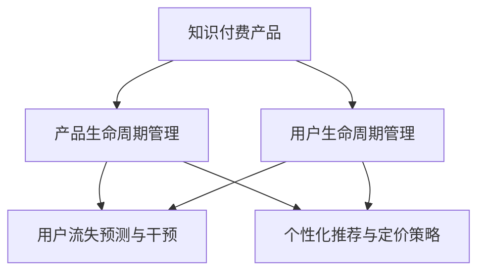

                 

# 知识付费产品的生命周期管理

## 1. 背景介绍

### 1.1 问题由来
随着移动互联网和在线教育的蓬勃发展，知识付费领域正在快速兴起。通过订阅、购买等形式，用户能够获取高质量的在线课程、电子书、音频内容等，满足其学习和娱乐需求。然而，尽管知识付费市场日益火热，许多产品却未能长久运营下去。高昂的运营成本、用户流失率高、难以精准变现等问题，使得知识付费产品的生命周期管理成为关注的焦点。

### 1.2 问题核心关键点
知识付费产品的生命周期管理，涉及产品从研发、运营到退出的全过程，核心在于确保产品在盈利的同时实现可持续发展。这需要从用户需求、市场环境、内容质量、盈利模式等多个维度进行综合管理，以最大化产品价值。

### 1.3 问题研究意义
研究知识付费产品的生命周期管理，对推动行业健康发展，提升用户体验，降低运营成本，实现商业成功具有重要意义：

1. **提升用户满意度**：通过精准的运营策略，能够更好地满足用户需求，提高用户粘性和留存率。
2. **降低运营成本**：通过有效的用户流失预测和干预措施，减少用户流失，降低用户获取和维护成本。
3. **优化盈利模式**：通过分析用户行为和需求，探索和优化变现路径，最大化收入。
4. **推动产品创新**：通过不断迭代和优化，提升产品竞争力和市场占有率，为行业带来创新和变革。

## 2. 核心概念与联系

### 2.1 核心概念概述

为更好地理解知识付费产品生命周期管理，本节将介绍几个密切相关的核心概念：

- **知识付费产品(Knowledge-based Paying Products, KBPP)**：基于在线课程、电子书、音频内容等形式，提供有价值的知识信息，用户需支付费用获取的产品或服务。
- **用户生命周期管理**：通过数据分析和运营策略，对用户行为进行监控和管理，以延长用户活跃周期，提升产品价值。
- **产品生命周期管理**：从研发、市场推广、运营到退出的全过程管理，确保产品能够稳定盈利，持续创新。
- **用户流失预测与干预**：使用机器学习模型预测用户流失概率，并采取干预措施降低流失率。
- **个性化推荐与定价策略**：根据用户行为和特征，提供个性化推荐和动态定价，优化用户体验和收益。

这些核心概念之间的逻辑关系可以通过以下Mermaid流程图来展示：



这个流程图展示了这个体系中各关键环节之间的关系：

1. **产品开发**：开发高质量的知识内容，作为产品核心。
2. **用户管理**：通过用户行为分析，精准推送内容，提高用户粘性。
3. **产品运营**：从市场推广、用户互动到产品迭代，确保产品可持续发展。
4. **流失干预**：使用机器学习模型预测流失用户，并采取措施进行挽留。
5. **推荐与定价**：根据用户需求，提供个性化推荐和动态定价，优化收益。

这些概念共同构成了知识付费产品生命周期管理的整体框架，使产品能够健康成长，持续产生价值。

## 3. 核心算法原理 & 具体操作步骤
### 3.1 算法原理概述

知识付费产品的生命周期管理，本质上是基于用户行为数据和内容特征，进行精确运营和持续优化的过程。其核心思想是：通过数据分析和机器学习算法，预测用户行为和需求，进而调整产品策略，实现盈利和用户价值的最大化。

形式化地，假设知识付费产品为 $P$，用户特征为 $U$，产品特征为 $C$，则产品的生命周期管理可表示为：

$$
L(P, U, C) = \max_{\theta} \mathcal{L}(P, U, C, \theta)
$$

其中 $\theta$ 为模型的参数，$\mathcal{L}$ 为损失函数，用于衡量产品策略对用户价值和收益的影响。

具体而言，生命周期管理主要包括以下几个关键步骤：

1. **用户行为分析**：收集用户登录、浏览、购买、评价等行为数据，构建用户画像，识别关键行为特征。
2. **内容质量评估**：通过用户评分、点击率、订阅率等指标，评估内容质量和用户满意度。
3. **用户流失预测**：使用机器学习模型，预测用户流失概率，及时干预减少流失率。
4. **个性化推荐与定价**：根据用户特征和行为，提供个性化的内容推荐和定价策略，提升用户体验和收益。

### 3.2 算法步骤详解

以下是知识付费产品生命周期管理的详细步骤：

**Step 1: 数据收集与预处理**

- 收集用户注册、登录、浏览、购买、评价等行为数据。
- 收集课程、书籍、音频等内容的评分、点击率、订阅率等质量指标。
- 使用ETL工具对数据进行清洗、转换和集成，构建数据仓库。

**Step 2: 特征工程**

- 对用户行为数据进行特征提取，如登录时间、浏览时长、消费金额等。
- 对内容数据进行特征提取，如课程难度、时长、评分等。
- 构造用户行为和内容特征的交叉特征，增强模型预测能力。

**Step 3: 模型训练与评估**

- 选择合适的机器学习算法，如决策树、随机森林、梯度提升树等，对用户流失和个性化推荐问题进行建模。
- 在训练集上训练模型，使用交叉验证等技术进行参数调优。
- 在验证集上评估模型效果，选择最优模型进行部署。

**Step 4: 模型部署与优化**

- 将训练好的模型部署到生产环境，实时预测用户流失和个性化推荐。
- 根据模型预测结果，调整产品策略，如调整课程定价、推送个性化内容等。
- 持续监控模型性能，定期更新模型参数，确保其适应不断变化的用户需求和市场环境。

### 3.3 算法优缺点

知识付费产品生命周期管理的优点：
1. **提升用户体验**：通过个性化推荐和定价策略，提高用户满意度和留存率。
2. **优化收益**：根据用户需求和行为，动态调整产品策略，提升收益。
3. **降低成本**：通过用户流失预测和干预，减少用户流失，降低用户获取和维护成本。
4. **推动创新**：基于数据驱动的产品优化，促进产品迭代和创新。

同时，该方法也存在一些局限性：
1. **数据依赖性高**：模型的效果高度依赖于数据的准确性和完整性。
2. **模型复杂度高**：多个模型的联合使用可能导致过拟合和复杂度增加。
3. **隐私风险**：用户行为数据的收集和分析可能涉及用户隐私问题。
4. **动态变化应对**：模型需要定期更新和优化，以应对用户需求和市场环境的变化。

尽管存在这些局限性，但就目前而言，基于数据驱动的产品生命周期管理方法仍是大势所趋。未来相关研究的重点在于如何进一步提升数据质量，降低模型复杂度，加强隐私保护，并提高模型的适应性。

### 3.4 算法应用领域

知识付费产品的生命周期管理，已经在多个行业领域得到应用，包括但不限于：

- **在线教育**：如Khan Academy、Coursera、Udacity等平台，通过个性化推荐和定价策略，提升用户学习和课程订阅率。
- **科技博客和媒体**：如TechCrunch、Medium、36kr等平台，通过内容推荐和付费阅读，提高用户粘性和收益。
- **音乐和视频平台**：如Spotify、Netflix、网易云音乐等平台，通过个性化推荐和订阅服务，提升用户留存率和收益。
- **专业培训和认证**：如Cisco认证、AWS认证等平台，通过专业课程和动态定价，满足用户技能提升需求。

除了上述这些经典应用外，知识付费产品生命周期管理的方法也在更多领域得到创新性的应用，如健康管理、投资理财、职业技能培训等，为各行各业的知识传播和知识变现提供了新的思路。

## 4. 数学模型和公式 & 详细讲解
### 4.1 数学模型构建

为更好地理解知识付费产品生命周期管理的数学原理，本节将介绍几个核心数学模型：

- **用户流失预测模型**：使用逻辑回归、决策树、随机森林等算法，预测用户流失概率。
- **个性化推荐模型**：使用协同过滤、基于内容的推荐、矩阵分解等算法，提供个性化推荐。
- **定价优化模型**：使用优化算法，如遗传算法、线性规划等，优化课程定价策略。

### 4.2 公式推导过程

以用户流失预测模型为例，假设用户特征为 $U=(u_1, u_2, \ldots, u_n)$，流失概率为 $p$，则用户流失预测问题可以表示为：

$$
p = f(U, \theta)
$$

其中 $\theta$ 为模型的参数，$f$ 为预测函数。常用的逻辑回归模型可以表示为：

$$
p = \sigma(WU + b)
$$

其中 $\sigma$ 为逻辑sigmoid函数，$W$ 和 $b$ 为模型的权重和偏置项。

类似地，个性化推荐模型和定价优化模型也有相应的数学表达，此处不再展开。

### 4.3 案例分析与讲解

以下以一个具体的知识付费平台为例，解释如何使用这些数学模型进行用户行为分析：

**案例：某在线教育平台**

**用户行为分析**：
- 收集用户注册、登录、浏览课程、购买课程、评价课程等行为数据。
- 收集课程的评分、评论、更新日期等质量指标。
- 构建用户行为和课程质量的数据集，进行特征工程，如计算用户平均浏览时长、课程评分平均值等。
- 使用逻辑回归模型，对用户流失概率进行预测。

**个性化推荐**：
- 收集用户对课程的评分、浏览行为、订阅状态等数据。
- 对用户和课程进行特征提取，如用户兴趣向量、课程难度向量等。
- 使用协同过滤算法，根据用户历史行为和相似用户行为，推荐相关课程。
- 根据用户评分反馈，动态调整推荐算法，提高推荐效果。

**定价优化**：
- 收集课程订阅率、用户评价、点击率等数据。
- 使用优化算法，构建定价模型，如线性规划模型。
- 根据用户特征和市场需求，动态调整课程定价，提升收益。

## 5. 项目实践：代码实例和详细解释说明
### 5.1 开发环境搭建

在进行知识付费产品生命周期管理实践前，我们需要准备好开发环境。以下是使用Python进行Scikit-Learn开发的环境配置流程：

1. 安装Anaconda：从官网下载并安装Anaconda，用于创建独立的Python环境。

2. 创建并激活虚拟环境：
```bash
conda create -n kbpp-env python=3.8 
conda activate kbpp-env
```

3. 安装Scikit-Learn：
```bash
pip install scikit-learn
```

4. 安装其他必要库：
```bash
pip install pandas numpy matplotlib seaborn
```

完成上述步骤后，即可在`kbpp-env`环境中开始项目实践。

### 5.2 源代码详细实现

下面我们以用户流失预测和个性化推荐为例，给出使用Scikit-Learn进行知识付费产品生命周期管理的PyTorch代码实现。

首先，定义用户流失预测的数据处理函数：

```python
from sklearn.model_selection import train_test_split
from sklearn.linear_model import LogisticRegression
from sklearn.metrics import accuracy_score, roc_auc_score

# 读取数据
def load_data(path):
    # 读入数据
    # ...

# 数据预处理
def preprocess_data(data):
    # 数据清洗和转换
    # ...

# 划分数据集
def split_data(data):
    # 划分训练集和测试集
    # ...

# 训练模型
def train_model(X_train, y_train, model, epochs=100, batch_size=128, learning_rate=0.01):
    # 训练模型
    # ...

# 评估模型
def evaluate_model(X_test, y_test, model):
    # 评估模型性能
    # ...

# 用户流失预测
def predict_churn(model, user_data):
    # 预测用户流失概率
    # ...
```

然后，定义个性化推荐的数据处理函数：

```python
from sklearn.metrics.pairwise import cosine_similarity
from sklearn.neighbors import NearestNeighbors

# 读取数据
def load_user_data(path):
    # 读入数据
    # ...

# 数据预处理
def preprocess_user_data(data):
    # 数据清洗和转换
    # ...

# 计算相似度
def compute_similarity(X, user_data):
    # 计算相似度矩阵
    # ...

# 推荐课程
def recommend_courses(similarity_matrix, user_data):
    # 推荐相关课程
    # ...
```

最后，启动预测和推荐流程：

```python
# 预测用户流失概率
churn_predictor = LogisticRegression()
train_model(X_train, y_train, churn_predictor)
churn_probability = predict_churn(churn_predictor, user_data)

# 推荐相关课程
similarity_matrix = compute_similarity(X_train, user_data)
courses_recommender = NearestNeighbors(n_neighbors=10, algorithm='brute')
courses_recommender.fit(similarity_matrix)
recommended_courses = recommend_courses(courses_recommender, user_data)

# 展示推荐结果
print("流失概率：", churn_probability)
print("推荐课程：", recommended_courses)
```

以上就是使用Scikit-Learn进行知识付费产品生命周期管理的完整代码实现。可以看到，通过Scikit-Learn等工具，我们能够快速实现用户流失预测和个性化推荐功能，显著提高产品运营的效率和效果。

### 5.3 代码解读与分析

让我们再详细解读一下关键代码的实现细节：

**用户流失预测类**：
- `load_data`函数：从文件中读取用户行为和课程质量数据，并进行预处理。
- `preprocess_data`函数：对数据进行清洗和转换，如去除缺失值、标准化数据等。
- `split_data`函数：将数据集划分为训练集和测试集，用于模型训练和评估。
- `train_model`函数：使用逻辑回归模型，对用户流失概率进行训练和预测。
- `evaluate_model`函数：评估模型的性能，输出准确率和AUC等指标。
- `predict_churn`函数：根据用户行为数据，预测用户流失概率。

**个性化推荐类**：
- `load_user_data`函数：从文件中读取用户行为数据，并进行预处理。
- `preprocess_user_data`函数：对数据进行清洗和转换，如去除缺失值、标准化数据等。
- `compute_similarity`函数：计算用户行为和课程质量之间的相似度矩阵。
- `recommend_courses`函数：根据相似度矩阵，推荐相关课程。

**预测和推荐流程**：
- 首先加载数据并预处理，然后将数据集划分为训练集和测试集。
- 使用逻辑回归模型训练用户流失预测模型，并评估其性能。
- 使用余弦相似度计算用户行为和课程质量之间的相似度矩阵。
- 使用K近邻算法，根据相似度矩阵推荐相关课程。
- 最终输出用户流失概率和推荐课程结果。

通过这些代码，我们可以清晰地看到知识付费产品生命周期管理的技术实现路径。合理利用这些工具和算法，可以显著提升产品的运营效率和用户体验。

## 6. 实际应用场景
### 6.1 智能客服系统

基于知识付费产品生命周期管理的方法，智能客服系统可以应用于知识付费产品的客户服务。通过分析用户行为和需求，智能客服系统可以自动推荐相关课程，提供课程预览、解答用户疑问等服务，提高用户满意度和留存率。

在技术实现上，可以收集用户的历史行为数据，如浏览课程、购买记录、评价等，构建用户画像，然后使用推荐算法，根据用户兴趣和行为，推荐相关课程。对于用户提出的问题，智能客服系统可以根据用户行为数据，自动匹配并生成相关回答，提高用户互动效果。

### 6.2 广告投放优化

知识付费产品生命周期管理的方法，也可以应用于在线广告的投放优化。通过分析用户行为和市场数据，广告投放系统可以精准定位目标用户，提高广告投放的转化率和点击率。

在技术实现上，可以收集用户行为数据，如浏览网页、点击广告、购买行为等，使用用户流失预测模型，预测潜在流失用户，然后针对这些用户进行广告投放，提升广告效果。同时，根据用户兴趣和行为，使用个性化推荐算法，向用户推荐相关课程，提高广告转化率。

### 6.3 内容推荐引擎

内容推荐引擎是知识付费产品的核心功能之一，通过用户行为分析和个性化推荐，提高用户满意度和留存率。内容推荐引擎的构建，需要对用户行为数据进行深度分析和建模，使用机器学习算法进行推荐。

在技术实现上，可以收集用户行为数据，如课程浏览记录、点击行为、订阅记录等，构建用户画像，然后使用推荐算法，根据用户兴趣和行为，推荐相关课程。同时，根据用户反馈，动态调整推荐算法，提高推荐效果。

### 6.4 未来应用展望

随着知识付费产品生命周期管理方法的不断进步，其在更多领域的应用前景将会更加广阔：

- **智慧教育**：通过精准的用户行为分析，提供个性化学习路径，提高学习效果。
- **职业培训**：通过动态调整课程定价和推荐策略，提高用户培训效果和收益。
- **内容聚合平台**：通过推荐引擎和个性化定价，提高内容聚合平台的用户粘性和收益。
- **健康管理**：通过分析用户行为和生理数据，提供个性化健康建议和课程推荐。

除了上述这些领域，知识付费产品生命周期管理的方法还将在更多垂直领域得到应用，为各行各业带来新的变革和机遇。

## 7. 工具和资源推荐
### 7.1 学习资源推荐

为了帮助开发者系统掌握知识付费产品生命周期管理的理论基础和实践技巧，这里推荐一些优质的学习资源：

1. **《知识付费产品的运营与变现》**：一本全面介绍知识付费产品运营策略和变现路径的书籍，涵盖用户行为分析、内容推荐、定价优化等多个方面。

2. **《机器学习实战》**：一本实战性很强的机器学习书籍，包含多个实际案例，适合了解和应用机器学习算法。

3. **Coursera《数据科学专业》课程**：由斯坦福大学开设的综合性数据科学课程，包括数据清洗、特征工程、模型训练等多个方面，适合系统学习数据科学知识。

4. **Kaggle竞赛平台**：一个全球知名的数据科学竞赛平台，通过参与实际竞赛项目，可以深入理解数据驱动的产品优化方法。

5. **Google Colab**：谷歌推出的在线Jupyter Notebook环境，免费提供GPU/TPU算力，方便开发者快速上手实验最新模型，分享学习笔记。

通过对这些资源的学习实践，相信你一定能够快速掌握知识付费产品生命周期管理的精髓，并用于解决实际的运营问题。

### 7.2 开发工具推荐

高效的开发离不开优秀的工具支持。以下是几款用于知识付费产品生命周期管理开发的常用工具：

1. **Scikit-Learn**：Python的数据科学库，提供了多种机器学习算法和数据处理工具，适合进行用户行为分析和推荐系统构建。
2. **TensorFlow**：Google开源的深度学习框架，支持大规模分布式训练，适合进行复杂的推荐算法开发。
3. **PyTorch**：Facebook开源的深度学习框架，支持动态计算图，适合进行高效的推荐系统构建。
4. **ElasticSearch**：一个开源的分布式搜索引擎，适合存储和检索大规模用户行为数据。
5. **Flume**：一个高可扩展的流处理框架，适合实时处理用户行为数据。

合理利用这些工具，可以显著提升知识付费产品生命周期管理的开发效率，加快创新迭代的步伐。

### 7.3 相关论文推荐

知识付费产品生命周期管理的发展源于学界的持续研究。以下是几篇奠基性的相关论文，推荐阅读：

1. **《用户行为分析与推荐系统》**：论文详细介绍了用户行为分析的方法和推荐算法的实现，是推荐系统的经典之作。
2. **《在线教育平台的用户流失预测》**：研究了在线教育平台用户流失预测的方法，提供了详细的实验结果和分析。
3. **《基于数据驱动的广告投放优化》**：论文探讨了基于用户行为数据和市场数据的广告投放优化方法，提供了实际案例和实验结果。
4. **《智能客服系统的推荐与响应》**：研究了智能客服系统的推荐与响应算法，提供了实际应用效果和改进建议。

这些论文代表了大数据和机器学习在知识付费产品生命周期管理中的应用，通过学习这些前沿成果，可以帮助研究者把握学科前进方向，激发更多的创新灵感。

## 8. 总结：未来发展趋势与挑战

### 8.1 总结

本文对知识付费产品的生命周期管理进行了全面系统的介绍。首先阐述了知识付费产品及其生命周期管理的背景和意义，明确了产品生命周期管理在确保盈利和用户价值方面的关键作用。其次，从原理到实践，详细讲解了知识付费产品生命周期管理的数学模型和核心算法，给出了实际案例和代码实现。同时，本文还广泛探讨了知识付费产品生命周期管理在多个行业领域的应用前景，展示了其在智能客服、广告投放、内容推荐等领域的巨大潜力。

通过本文的系统梳理，可以看到，知识付费产品生命周期管理正在成为知识付费行业的核心竞争力，通过数据驱动的产品优化，显著提升用户满意度和产品收益。未来，伴随算法和工具的不断演进，知识付费产品生命周期管理必将成为行业发展的驱动力量，推动知识付费技术不断进步，造福人类社会。

### 8.2 未来发展趋势

展望未来，知识付费产品生命周期管理将呈现以下几个发展趋势：

1. **智能化程度提升**：通过引入AI技术，如自然语言处理、图像识别等，实现用户行为分析和推荐系统的智能化。
2. **个性化程度加深**：基于更深入的用户画像和行为分析，提供更加个性化、精准的内容推荐和定价策略。
3. **用户参与度提高**：通过社交网络和社区互动，提高用户参与度和粘性，构建更强的用户关系网络。
4. **数据质量优化**：通过数据清洗和标注，提升数据的准确性和完整性，增强模型的预测能力。
5. **跨领域融合**：将知识付费产品生命周期管理方法与其他领域的技术进行融合，如智慧医疗、智慧交通等，实现更广泛的应用。

这些趋势凸显了知识付费产品生命周期管理的广阔前景，未来必将在更广泛的领域发挥作用，推动各行各业的数字化转型。

### 8.3 面临的挑战

尽管知识付费产品生命周期管理取得了显著成效，但在实现智能化、个性化和可持续发展过程中，仍面临诸多挑战：

1. **数据隐私问题**：在收集和分析用户行为数据时，需严格遵守隐私保护法规，确保用户数据安全。
2. **模型复杂性**：用户行为分析和推荐系统涉及多维度的数据和复杂的算法，模型的复杂性可能带来计算和存储的挑战。
3. **市场环境变化**：知识付费产品需实时适应市场环境的变化，如用户需求、竞争态势等，这对模型更新和优化提出了更高的要求。
4. **技术门槛高**：知识付费产品生命周期管理涉及机器学习、数据科学等多个技术领域，技术门槛较高，需系统学习和不断实践。

尽管面临这些挑战，但通过不断创新和优化，知识付费产品生命周期管理必将在未来取得更大的突破，为知识传播和变现带来新的机遇。

### 8.4 研究展望

面对知识付费产品生命周期管理所面临的挑战，未来的研究需要在以下几个方面寻求新的突破：

1. **数据隐私保护**：探索如何在保护用户隐私的前提下，充分利用数据进行推荐和优化。
2. **模型轻量化**：开发轻量级、高效化的推荐系统，提升实时性和用户体验。
3. **多模态融合**：将文本、图像、语音等多模态数据进行融合，提升推荐系统的表现力和深度。
4. **跨领域应用**：将知识付费产品生命周期管理方法应用于其他领域，如智慧医疗、智慧城市等，实现更广泛的应用和创新。
5. **伦理和社会影响**：研究知识付费产品对社会和伦理的影响，确保技术应用的可持续性和公正性。

这些研究方向的探索，必将引领知识付费产品生命周期管理技术迈向更高的台阶，为知识传播和知识变现带来新的机遇和挑战。面向未来，知识付费产品生命周期管理需要从技术、伦理和社会多个维度协同发力，实现智能化、个性化和可持续发展。

## 9. 附录：常见问题与解答

**Q1：知识付费产品如何构建用户画像？**

A: 构建用户画像需要收集用户的多维度行为数据，如浏览记录、购买行为、评价等。通过数据清洗和特征提取，构建用户的基本特征向量，如兴趣向量、行为向量等。然后使用聚类算法、关联规则等技术，对用户进行分群，构建不同群体的特征标签。

**Q2：知识付费产品如何优化定价策略？**

A: 优化定价策略需要考虑用户支付意愿、课程质量、市场竞争等多个因素。可以使用动态定价模型，如线性规划、回归分析等方法，根据用户行为和市场数据，调整课程定价。同时，引入价格弹性模型，考虑用户对价格变化的敏感度，优化定价策略。

**Q3：知识付费产品如何评估推荐系统的性能？**

A: 推荐系统的性能评估需要考虑准确率、召回率、覆盖率等多个指标。可以使用AUC、NDCG等评价指标，对推荐算法进行评估。同时，通过用户反馈和行为数据，实时监控推荐系统的表现，进行动态调整和优化。

**Q4：知识付费产品如何应对用户流失？**

A: 用户流失预测和干预是知识付费产品生命周期管理的关键环节。可以使用逻辑回归、决策树等算法，预测用户流失概率。根据预测结果，制定针对性的干预措施，如重新推荐相关课程、提供专属优惠等，以减少用户流失。

**Q5：知识付费产品如何提高广告投放效果？**

A: 提高广告投放效果需要精准定位目标用户，并提供相关推荐。可以通过用户行为数据，构建用户画像，然后使用推荐算法，根据用户兴趣和行为，推荐相关课程。同时，使用A/B测试等方法，优化广告投放策略，提高转化率和点击率。

通过这些常见问题的解答，相信你能够更好地理解知识付费产品生命周期管理的核心技术和实践方法。

