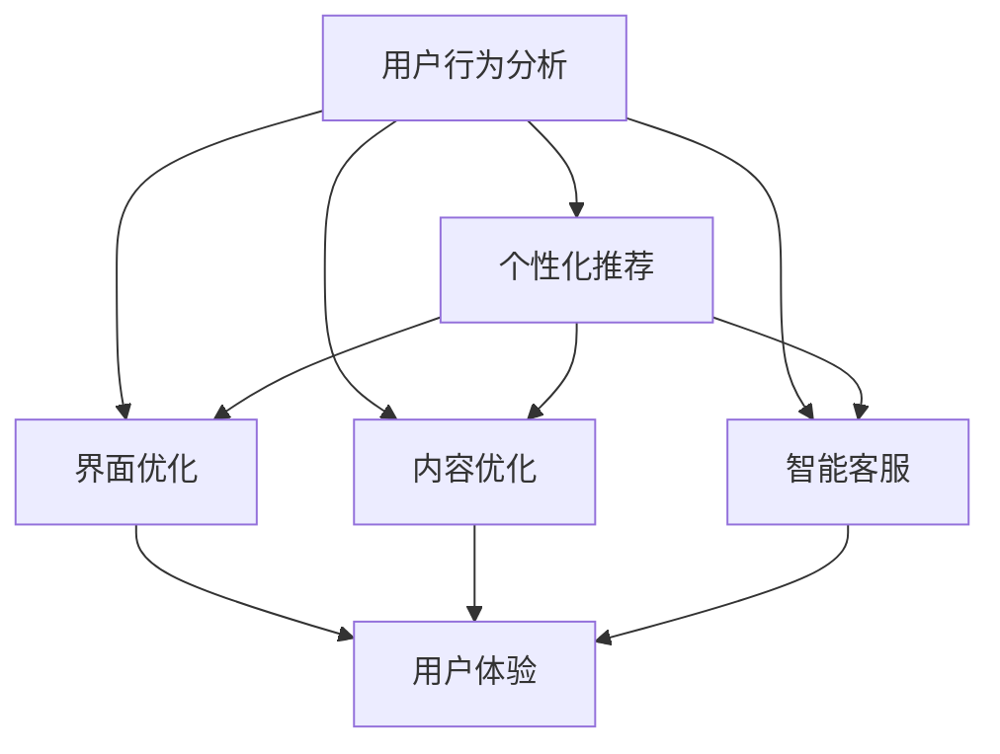
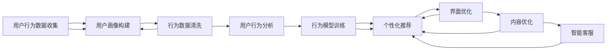

                 

# 知识付费产品的用户行为分析与优化

## 1. 背景介绍

随着互联网的快速发展和数字经济的崛起，知识付费市场正呈现出蓬勃的发展态势。用户对个性化、专业化的知识需求日益增加，知识付费产品（如在线课程、订阅专栏、专业咨询等）作为连接知识生产者与消费者的桥梁，受到广大用户的热烈追捧。然而，面对日益激烈的市场竞争和不断变化的用户需求，知识付费平台如何提升用户体验，优化产品设计，已成为当前面临的重要课题。本文将从用户行为分析的角度出发，探讨知识付费产品的优化策略。

## 2. 核心概念与联系

### 2.1 核心概念概述

为更好理解知识付费产品的用户行为分析与优化方法，本文将介绍几个核心概念：

- **用户行为分析(User Behavior Analysis, UBA)**：通过对用户行为数据（如点击率、购买率、学习时长等）的收集和分析，了解用户的使用习惯和偏好，从而为产品优化提供依据。
- **个性化推荐(Recommendation System, RS)**：基于用户行为数据，构建推荐模型，对不同用户推荐符合其兴趣和需求的内容，提升用户满意度。
- **界面优化(User Interface Optimization, UIO)**：通过改进产品界面设计，提升用户体验，增强用户粘性。
- **内容优化(Content Optimization, CO)**：调整产品内容布局、更新频率和质量，提升用户对产品的使用价值。
- **智能客服(Intelligent Customer Service, ICS)**：引入智能客服技术，提升用户互动体验，及时解答用户疑问，改善客户关系。

这些核心概念之间的逻辑关系可以通过以下Mermaid流程图来展示：



这个流程图展示了用户行为分析如何与其他产品优化环节相互影响，共同提升用户满意度。

### 2.2 核心概念原理和架构的 Mermaid 流程图



该图展示了用户行为数据从收集到最终个性化推荐的全过程，以及各个环节的相互依赖关系。

## 3. 核心算法原理 & 具体操作步骤

### 3.1 算法原理概述

基于用户行为分析的个性化推荐算法主要分为两个步骤：用户画像构建和个性化推荐模型训练。

**用户画像构建**：通过分析用户的行为数据，生成用户画像，即描述用户兴趣、偏好和行为特征的概貌。用户画像通常包括基本信息（如年龄、性别、职业等）、行为数据（如点击、购买、学习时长等）、兴趣标签等。

**个性化推荐模型训练**：构建推荐模型，如协同过滤、基于内容的推荐、深度学习等，通过分析用户画像和物品特征，预测用户对物品的偏好，从而生成个性化推荐列表。

### 3.2 算法步骤详解

**步骤一：数据收集**

收集用户行为数据，包括但不限于：
- 点击数据：用户在页面上的点击行为记录。
- 购买数据：用户对商品或课程的购买行为记录。
- 学习数据：用户在学习平台上的学习行为记录，如观看视频、阅读文章等。
- 互动数据：用户在平台上的互动行为记录，如评论、点赞、分享等。

**步骤二：数据清洗**

对收集到的数据进行清洗，去除无效和噪声数据，保证数据的准确性和完整性。清洗过程包括：
- 去除重复数据：通过唯一标识符去重，避免数据冗余。
- 处理缺失值：使用均值、中位数、众数等方法填补缺失数据。
- 去除异常值：检测并去除异常值，保证数据的合理性。

**步骤三：用户画像构建**

基于清洗后的数据，构建用户画像，描述用户的兴趣和行为特征。常用的用户画像描述方法包括：
- 统计分析：通过统计方法描述用户行为特征，如点击次数、购买频率等。
- 聚类分析：使用聚类算法（如K-means）将用户分为不同群体，分析各群体的特点。
- 关联分析：使用关联规则算法（如Apriori）挖掘用户行为中的关联规则，识别用户的兴趣点。

**步骤四：个性化推荐模型训练**

选择合适的推荐算法，如协同过滤、基于内容的推荐、深度学习等，进行个性化推荐模型训练。训练过程包括：
- 特征工程：提取和选择用于模型训练的特征，如用户ID、物品ID、行为特征等。
- 模型训练：选择合适的算法和参数，训练推荐模型。
- 模型评估：使用交叉验证、AUC、RMSE等指标评估模型的性能。
- 模型优化：根据评估结果，调整模型参数，优化模型性能。

**步骤五：个性化推荐**

将训练好的推荐模型应用到用户行为分析中，根据用户画像生成个性化推荐列表，提升用户满意度。推荐列表可以包括但不限于：
- 课程推荐：根据用户历史学习行为，推荐相关课程。
- 商品推荐：根据用户购买行为，推荐相关商品。
- 内容推荐：根据用户浏览和互动行为，推荐相关文章、视频等。

### 3.3 算法优缺点

基于用户行为分析的个性化推荐算法具有以下优点：
- 精准度高：通过分析用户行为数据，生成个性化推荐，精准度较高。
- 用户粘性强：个性化推荐能够满足用户需求，提升用户满意度，增强用户粘性。
- 扩展性强：推荐算法可以扩展到多种应用场景，如电商、社交、教育等。

同时，该算法也存在以下局限性：
- 数据依赖强：推荐效果很大程度上依赖于数据质量和数量，数据收集和清洗工作量大。
- 隐私问题：收集和分析用户行为数据涉及隐私问题，需要严格遵守相关法律法规。
- 动态性差：用户行为数据具有时效性，推荐模型需要定期更新才能保持推荐效果。

### 3.4 算法应用领域

基于用户行为分析的个性化推荐算法在多个领域都有广泛应用，例如：

- 电商推荐系统：通过分析用户购买行为，推荐相关商品。
- 在线教育平台：根据用户学习行为，推荐相关课程和资料。
- 社交媒体平台：根据用户互动行为，推荐相关内容和用户。
- 视频流媒体平台：根据用户观看行为，推荐相关视频内容。
- 新闻推荐平台：根据用户阅读行为，推荐相关新闻和文章。

这些应用场景证明了个性化推荐在提升用户体验和增加用户粘性方面的重要作用。

## 4. 数学模型和公式 & 详细讲解 & 举例说明

### 4.1 数学模型构建

假设用户行为数据集为 $D=\{(x_i, y_i)\}_{i=1}^N$，其中 $x_i$ 为用户行为特征，$y_i$ 为行为标签（如购买、学习等）。用户画像 $P=\{(u_j)\}_{j=1}^M$，其中 $u_j$ 为用户特征。个性化推荐模型 $M$ 为：

$$ M: \{u_j\} \rightarrow \{r_k\} $$

其中 $r_k$ 为用户对物品 $k$ 的评分或推荐概率。

### 4.2 公式推导过程

以协同过滤算法为例，推导用户行为分析和个性化推荐的数学模型。

假设用户 $i$ 对物品 $j$ 的评分矩阵为 $R$，用户行为数据集为 $D=\{(x_i, y_i)\}_{i=1}^N$。用户画像 $P=\{(u_j)\}_{j=1}^M$ 可以通过用户行为数据集 $D$ 生成，其中 $u_j$ 为用户特征。

协同过滤算法的目标是最小化预测评分与真实评分之间的差距，即最小化均方误差：

$$ \min_{R} \sum_{i,j} (R_{ij} - \hat{R}_{ij})^2 $$

其中 $\hat{R}_{ij}$ 为预测评分，可以通过模型 $M$ 计算得到。

协同过滤算法的求解步骤如下：
1. 计算用户间的相似度矩阵 $S$。
2. 使用用户间相似度矩阵 $S$ 进行用户间的评分预测，生成预测评分矩阵 $\hat{R}$。
3. 使用均方误差对预测评分矩阵 $\hat{R}$ 进行调整，生成最终评分矩阵 $R$。

### 4.3 案例分析与讲解

以在线教育平台为例，用户行为数据集包括用户的学习行为和成绩数据。通过分析用户的学习行为，生成用户画像，使用协同过滤算法进行个性化推荐，推荐相关课程和资料。具体步骤如下：

1. 收集用户的学习行为数据，包括观看视频、阅读文章、完成作业等。
2. 对收集到的数据进行清洗，去除重复和异常数据。
3. 使用K-means算法对用户进行聚类，生成用户画像。
4. 使用协同过滤算法，构建个性化推荐模型 $M$，生成个性化推荐列表。
5. 根据个性化推荐列表，对用户进行推荐，提升用户满意度。

## 5. 项目实践：代码实例和详细解释说明

### 5.1 开发环境搭建

在进行项目实践前，需要先准备好开发环境。以下是使用Python进行Keras开发的环境配置流程：

1. 安装Anaconda：从官网下载并安装Anaconda，用于创建独立的Python环境。

2. 创建并激活虚拟环境：
```bash
conda create -n pytorch-env python=3.8 
conda activate pytorch-env
```

3. 安装TensorFlow：根据CUDA版本，从官网获取对应的安装命令。例如：
```bash
conda install tensorflow=2.4
```

4. 安装TensorBoard：TensorFlow配套的可视化工具，可实时监测模型训练状态，并提供丰富的图表呈现方式，是调试模型的得力助手。

5. 安装Keras：Keras是一个高级神经网络API，与TensorFlow无缝集成，可以方便地进行模型构建和训练。

6. 安装Pandas和NumPy：用于数据处理和分析。

完成上述步骤后，即可在`pytorch-env`环境中开始项目实践。

### 5.2 源代码详细实现

下面我们以在线教育平台个性化推荐为例，给出使用Keras和TensorFlow进行个性化推荐模型的PyTorch代码实现。

首先，定义数据集和模型：

```python
import tensorflow as tf
from tensorflow.keras import layers
import pandas as pd
import numpy as np

# 加载用户行为数据集
data = pd.read_csv('user_behavior.csv')

# 构建特征和标签
features = data[['user_id', 'item_id', 'behavior']]
labels = data['label']

# 分割训练集和测试集
train_features, test_features = features.sample(frac=0.8, random_state=42)
train_labels, test_labels = labels.sample(frac=0.8, random_state=42)

# 构建用户画像
user_profiles = features.groupby('user_id').mean()

# 构建训练数据集
train_dataset = tf.data.Dataset.from_tensor_slices((train_features.values, train_labels.values))
train_dataset = train_dataset.shuffle(buffer_size=10000).batch(batch_size=32)

# 构建测试数据集
test_dataset = tf.data.Dataset.from_tensor_slices((test_features.values, test_labels.values))
test_dataset = test_dataset.batch(batch_size=32)

# 构建深度学习模型
model = tf.keras.Sequential([
    layers.Dense(64, activation='relu', input_shape=(features.shape[1],)),
    layers.Dense(64, activation='relu'),
    layers.Dense(1, activation='sigmoid')
])
```

然后，定义训练函数和评估函数：

```python
@tf.function
def train_step(inputs, labels):
    with tf.GradientTape() as tape:
        predictions = model(inputs, training=True)
        loss = tf.losses.mean_squared_error(labels, predictions)
    gradients = tape.gradient(loss, model.trainable_variables)
    optimizer.apply_gradients(zip(gradients, model.trainable_variables))
    return loss

@tf.function
def evaluate_step(inputs, labels):
    predictions = model(inputs, training=False)
    mse = tf.reduce_mean(tf.square(predictions - labels))
    return mse.numpy()

# 定义训练函数
def train_model(model, train_dataset, test_dataset, epochs, batch_size, learning_rate):
    for epoch in range(epochs):
        epoch_loss = 0
        epoch_correct = 0
        for batch in train_dataset:
            inputs, labels = batch
            loss = train_step(inputs, labels)
            epoch_loss += loss
        test_mse = evaluate_step(test_features, test_labels)
        print(f'Epoch {epoch+1}, train loss: {epoch_loss/n}, test MSE: {test_mse}')
```

最后，启动模型训练并评估：

```python
epochs = 10
batch_size = 32
learning_rate = 0.001

train_model(model, train_dataset, test_dataset, epochs, batch_size, learning_rate)
```

以上就是使用Keras和TensorFlow对在线教育平台个性化推荐模型进行开发的完整代码实现。可以看到，Keras和TensorFlow的深度学习框架使得模型构建和训练过程变得简洁高效。开发者可以将更多精力放在模型优化和业务逻辑上，而不必过多关注底层的实现细节。

## 6. 实际应用场景

### 6.1 在线教育平台

在线教育平台通过分析用户学习行为，生成用户画像，使用个性化推荐模型为用户推荐相关课程和资料。具体场景包括：
- 推荐热门课程：根据用户浏览和点击数据，推荐热门课程。
- 推荐相关资料：根据用户学习进度和成绩，推荐相关教材和习题。
- 推荐课程计划：根据用户学习历史，推荐合理的课程计划。

### 6.2 电商平台

电商平台通过分析用户购买行为，生成用户画像，使用个性化推荐模型为用户推荐相关商品。具体场景包括：
- 推荐热门商品：根据用户浏览和点击数据，推荐热门商品。
- 推荐相关商品：根据用户购买历史，推荐相关商品。
- 推荐优惠活动：根据用户消费行为，推荐优惠活动和促销信息。

### 6.3 社交媒体平台

社交媒体平台通过分析用户互动行为，生成用户画像，使用个性化推荐模型为用户推荐相关内容和用户。具体场景包括：
- 推荐热门内容：根据用户点赞和评论数据，推荐热门内容。
- 推荐相关用户：根据用户互动数据，推荐相关用户。
- 推荐互动话题：根据用户兴趣和行为，推荐互动话题和群组。

### 6.4 未来应用展望

随着大数据和人工智能技术的发展，基于用户行为分析的个性化推荐将会在更多领域得到应用，为用户带来更精准、个性化的服务体验。未来，基于用户行为分析的推荐系统可能还会结合更多前沿技术，如增强学习、生成对抗网络等，进一步提升推荐效果。

## 7. 工具和资源推荐

### 7.1 学习资源推荐

为了帮助开发者系统掌握用户行为分析与优化技术，这里推荐一些优质的学习资源：

1. **《用户行为分析与优化》书籍**：系统介绍了用户行为分析的基本概念、方法和技术，适合初学者和进阶开发者阅读。
2. **Coursera《推荐系统》课程**：斯坦福大学开设的推荐系统课程，涵盖了推荐系统设计、算法实现和案例分析，有助于深入理解推荐系统的核心原理。
3. **Kaggle推荐系统竞赛**：参加Kaggle推荐系统竞赛，通过实践和比赛，积累推荐系统优化经验。
4. **DataCamp《Python数据科学》课程**：通过Python数据科学课程，学习数据清洗、数据分析和数据可视化等技术，为推荐系统开发打下坚实基础。

### 7.2 开发工具推荐

高效的开发离不开优秀的工具支持。以下是几款用于推荐系统开发的常用工具：

1. **TensorFlow**：由Google主导开发的深度学习框架，生产部署方便，适合大规模工程应用。
2. **PyTorch**：基于Python的开源深度学习框架，灵活动态的计算图，适合快速迭代研究。
3. **Keras**：高级神经网络API，与TensorFlow和PyTorch无缝集成，方便快速构建和训练深度学习模型。
4. **TensorBoard**：TensorFlow配套的可视化工具，可实时监测模型训练状态，提供丰富的图表呈现方式。
5. **Jupyter Notebook**：交互式编程环境，方便开发者快速迭代实验和撰写技术文档。
6. **Github**：代码托管平台，方便开发者协作和版本控制。

合理利用这些工具，可以显著提升推荐系统开发的效率和质量，加速创新迭代的步伐。

### 7.3 相关论文推荐

用户行为分析与个性化推荐技术的发展源于学界的持续研究。以下是几篇奠基性的相关论文，推荐阅读：

1. **《基于协同过滤的推荐系统》**：介绍了协同过滤算法的原理和实现方法，是推荐系统领域的经典文献。
2. **《深度学习推荐系统》**：探讨了深度学习在推荐系统中的应用，包括深度矩阵分解、深度神经网络等方法。
3. **《个性化推荐系统中的用户画像建模》**：介绍了用户画像构建的方法和应用，为推荐系统提供了用户行为分析的基础。
4. **《推荐系统的最新进展》**：综述了推荐系统领域的研究进展和应用实践，帮助开发者把握学科发展方向。

这些论文代表了推荐系统技术的最新进展，通过学习这些前沿成果，可以帮助研究者把握推荐系统的前沿动态，激发更多的创新灵感。

## 8. 总结：未来发展趋势与挑战

### 8.1 研究成果总结

本文对基于用户行为分析的个性化推荐进行了全面系统的介绍。首先阐述了用户行为分析的基本概念和重要性，明确了个性化推荐在提升用户体验、增加用户粘性方面的独特价值。其次，从原理到实践，详细讲解了推荐算法的数学模型和操作步骤，给出了推荐任务开发的完整代码实例。同时，本文还探讨了推荐算法在多个领域的应用场景，展示了个性化推荐在提升用户满意度方面的巨大潜力。

### 8.2 未来发展趋势

展望未来，基于用户行为分析的个性化推荐技术将呈现以下几个发展趋势：

1. **推荐效果提升**：随着数据质量和算法的改进，推荐系统的精准度和效果将不断提高，能够更好地满足用户需求。
2. **多模态融合**：将视觉、语音、文本等多模态数据进行融合，提升推荐系统的表现力。
3. **隐私保护强化**：在推荐系统设计中引入隐私保护技术，确保用户数据的安全性。
4. **个性化推荐优化**：通过强化学习、生成对抗网络等方法，提升个性化推荐系统的适应性和灵活性。
5. **实时推荐系统**：结合流式数据处理技术，实现实时个性化推荐，提升用户体验。

### 8.3 面临的挑战

尽管基于用户行为分析的个性化推荐技术已经取得了显著成效，但在迈向更加智能化、普适化应用的过程中，它仍面临诸多挑战：

1. **数据质量和隐私问题**：推荐系统依赖高质量数据和隐私保护技术，数据收集和处理过程中的隐私保护和数据质量控制至关重要。
2. **模型复杂性和可解释性**：深度学习模型虽然效果好，但模型复杂性高，缺乏可解释性，难以解释模型的内部工作机制。
3. **算法实时性和稳定性**：推荐算法需要在保证推荐效果的同时，兼顾实时性和稳定性，实时处理大规模数据流。
4. **用户需求多样性**：用户需求具有多样性，推荐系统需要适应不同用户群体的需求，提升系统的灵活性。

### 8.4 研究展望

面对推荐系统面临的挑战，未来的研究需要在以下几个方面寻求新的突破：

1. **多任务学习**：将推荐任务与其他任务（如用户画像构建、情感分析等）结合，实现多任务优化。
2. **深度强化学习**：引入深度强化学习技术，提升推荐系统的智能性和适应性。
3. **协同过滤算法改进**：改进协同过滤算法，提升推荐系统的精准度和鲁棒性。
4. **隐私保护技术**：研究隐私保护技术，确保用户数据的安全性和隐私保护。
5. **跨领域推荐**：研究跨领域推荐技术，提升推荐系统的普适性和应用范围。

这些研究方向的探索发展，必将引领个性化推荐技术迈向更高的台阶，为构建更加智能化、普适化的推荐系统铺平道路。总之，基于用户行为分析的个性化推荐技术还需要与其他人工智能技术进行更深入的融合，如知识表示、因果推理、强化学习等，多路径协同发力，共同推动推荐系统技术的进步。只有勇于创新、敢于突破，才能不断拓展推荐系统的边界，让推荐系统更好地服务于用户。

## 9. 附录：常见问题与解答

**Q1：什么是用户行为分析？**

A: 用户行为分析是指通过对用户行为数据的收集、清洗和分析，了解用户的行为特征和需求，从而优化产品设计和用户体验。用户行为数据包括但不限于点击数据、购买数据、学习数据等。

**Q2：个性化推荐算法有哪些？**

A: 个性化推荐算法主要包括协同过滤、基于内容的推荐、深度学习推荐等。协同过滤算法通过分析用户行为数据，生成用户画像和物品画像，计算用户和物品之间的相似度，生成个性化推荐。基于内容的推荐算法通过分析用户行为和物品特征，构建推荐模型。深度学习推荐算法使用深度神经网络，提升推荐系统的精准度和效果。

**Q3：如何提升推荐系统的推荐效果？**

A: 提升推荐系统推荐效果的方法包括：
1. 数据清洗和预处理：去除重复和异常数据，保证数据的准确性和完整性。
2. 用户画像构建：通过聚类、关联规则等方法，生成用户画像，描述用户兴趣和行为特征。
3. 推荐算法选择：选择合适的推荐算法，如协同过滤、基于内容的推荐、深度学习等。
4. 模型优化和评估：使用交叉验证、AUC、RMSE等指标评估模型性能，根据评估结果调整模型参数，优化模型性能。

**Q4：推荐系统开发需要哪些工具？**

A: 推荐系统开发需要以下工具：
1. TensorFlow：深度学习框架，适合大规模工程应用。
2. PyTorch：开源深度学习框架，灵活动态的计算图，适合快速迭代研究。
3. Keras：高级神经网络API，与TensorFlow和PyTorch无缝集成，方便快速构建和训练深度学习模型。
4. TensorBoard：TensorFlow配套的可视化工具，可实时监测模型训练状态，提供丰富的图表呈现方式。
5. Jupyter Notebook：交互式编程环境，方便开发者快速迭代实验和撰写技术文档。
6. Github：代码托管平台，方便开发者协作和版本控制。

通过合理利用这些工具，可以显著提升推荐系统开发的效率和质量，加速创新迭代的步伐。

**Q5：推荐系统开发中需要注意哪些问题？**

A: 推荐系统开发中需要注意以下问题：
1. 数据质量和隐私问题：推荐系统依赖高质量数据和隐私保护技术，数据收集和处理过程中的隐私保护和数据质量控制至关重要。
2. 模型复杂性和可解释性：深度学习模型虽然效果好，但模型复杂性高，缺乏可解释性，难以解释模型的内部工作机制。
3. 算法实时性和稳定性：推荐算法需要在保证推荐效果的同时，兼顾实时性和稳定性，实时处理大规模数据流。
4. 用户需求多样性：用户需求具有多样性，推荐系统需要适应不同用户群体的需求，提升系统的灵活性。

合理规避这些问题的挑战，将使推荐系统开发更加顺利，提升用户体验和产品价值。

---

作者：禅与计算机程序设计艺术 / Zen and the Art of Computer Programming

