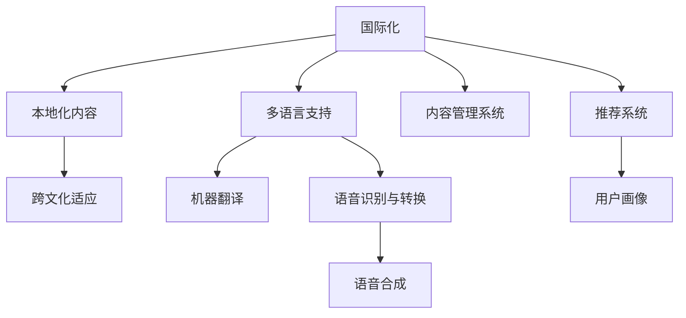

                 

# 知识付费内容的国际化与本地化策略

在数字化时代，知识付费平台成为了个人获取高质量知识的重要途径。随着全球化趋势的加速，越来越多的用户寻求多元化的知识来源，知识的国际化传播变得愈发重要。同时，内容本地化也是提升用户体验、增强用户粘性的关键策略。本文将探讨知识付费内容的国际化与本地化策略，通过实例分析、技术手段和应用场景，全面阐述这一话题。

## 1. 背景介绍

### 1.1 问题由来
随着互联网的全球化，知识付费行业迅速发展，涵盖了教育、技术、生活等多个领域。越来越多的用户跨越国界，寻求各类专业知识和技能提升。知识付费内容如何在全球范围内有效传播，同时满足本地用户的多样化需求，成为了知识付费平台亟待解决的问题。

### 1.2 问题核心关键点
知识付费内容的国际化与本地化主要包括以下几个关键点：

- **多语言支持**：知识付费平台需要提供多语言版本，以便于不同语言的用户都能方便地获取知识内容。
- **本地化内容**：根据不同地区用户的特点和需求，定制本地化的知识内容，提升用户粘性。
- **跨文化适应**：考虑到不同文化背景下的用户对知识内容的接受度和需求差异，设计适宜的文化适应策略。
- **技术保障**：采用高效的技术手段，实现内容的智能翻译、语音转换和本地化适配，提升用户体验。

### 1.3 问题研究意义
知识付费内容的国际化与本地化对于平台的全球扩展和用户满意度的提升具有重要意义：

1. **扩大用户基数**：多语言支持和本地化内容可以吸引更多的国际用户，提升平台的全球影响力。
2. **提升用户粘性**：通过本地化内容定制，增强用户对平台的认同感和忠诚度。
3. **优化用户体验**：跨文化适应策略和高效技术手段可以提升内容的可访问性和易用性。
4. **增强竞争力**：在全球市场中的差异化竞争优势，有助于知识付费平台在激烈的市场竞争中脱颖而出。
5. **推动教育普及**：不同国家和地区的教育需求各异，本地化内容有助于实现全球知识普及。

## 2. 核心概念与联系

### 2.1 核心概念概述

为了更好地理解知识付费内容的国际化与本地化策略，本节将介绍几个核心概念：

- **国际化(国际化)和本地化(本地化)**：国际化涉及将知识内容从一种语言翻译或转换为另一种语言，使内容能在全球范围内传播。本地化则进一步考虑文化、习惯等因素，使内容更贴合本地用户的偏好和需求。
- **机器翻译(Machine Translation, MT)**：利用自然语言处理(NLP)技术，将一种语言的文本自动转换为另一种语言的文本。
- **语音识别与转换(Speech Recognition & Synthesis)**：通过语音识别技术，将用户的语音转换为文本；通过语音合成技术，将文本转换为可听的语言。
- **内容管理系统(Content Management System, CMS)**：用于管理内容创建、编辑、发布和分发的系统，支持多语言和多版本的内容管理。
- **推荐系统(Recommendation System)**：基于用户行为数据和偏好，推荐最适合用户的内容，增强用户粘性。
- **用户画像(User Persona)**：描述目标用户的特征和需求，指导内容定制和本地化策略。

这些核心概念之间的逻辑关系可以通过以下Mermaid流程图来展示：



这个流程图展示了大语言模型的核心概念及其之间的关系：

1. 国际化涉及多语言支持、机器翻译和语音识别与转换。
2. 本地化内容包括跨文化适应、内容管理系统、推荐系统和用户画像。

这些概念共同构成了知识付费内容的国际化与本地化策略的基础框架，指导平台在跨文化场景中为用户提供高质量的知识内容。

## 3. 核心算法原理 & 具体操作步骤

### 3.1 算法原理概述

知识付费内容的国际化与本地化主要依赖于自然语言处理(NLP)和机器学习技术。核心算法原理如下：

- **机器翻译**：利用统计机器翻译(SMT)或神经机器翻译(NMT)算法，将一种语言的文本自动翻译为另一种语言。
- **内容推荐**：基于用户行为数据和偏好，通过协同过滤、基于内容的推荐等算法，推荐适合用户的内容。
- **语音识别与转换**：利用隐马尔可夫模型(HMM)、循环神经网络(RNN)等技术，实现语音识别和转换。
- **用户画像构建**：通过数据分析和机器学习算法，建立用户特征模型，用于指导内容定制和本地化策略。

### 3.2 算法步骤详解

知识付费内容的国际化与本地化流程主要包括以下步骤：

**Step 1: 数据准备**
- 收集不同语言和地区的用户数据，包括内容访问记录、用户评论、反馈等。
- 收集和标注本地化语料库，用于训练和优化机器翻译模型。

**Step 2: 多语言支持**
- 选择合适的机器翻译技术，如统计机器翻译或神经机器翻译，建立多语言翻译模型。
- 集成翻译API，支持用户选择不同的语言版本。

**Step 3: 本地化内容定制**
- 根据用户画像和地区特征，定制本地化的知识内容。例如，针对不同地区的学习需求，提供相关的案例分析和实践指南。
- 引入本地化的语言风格和文化元素，使内容更贴合用户习惯。

**Step 4: 跨文化适应**
- 设计文化适应策略，避免文化冲突和不适应。例如，在推荐系统中加入文化因素，筛选出符合用户文化背景的内容。
- 定期收集用户反馈，不断优化和调整内容策略。

**Step 5: 技术实现**
- 采用先进的技术手段，实现内容的智能翻译、语音转换和本地化适配。例如，利用深度学习技术进行语言模型训练，提升翻译质量。
- 设计友好的用户界面，使用户能够轻松切换语言和版本。

**Step 6: 内容发布与监控**
- 通过内容管理系统，发布和维护多语言和本地化内容。
- 实时监控用户行为和反馈，不断优化推荐算法和内容策略。

### 3.3 算法优缺点

知识付费内容的国际化与本地化具有以下优点：

- **全球覆盖**：多语言支持和本地化内容可以覆盖更多国际用户，提升平台的用户基数。
- **用户粘性**：本地化内容定制和跨文化适应策略可以增强用户对平台的认同感和忠诚度。
- **提升体验**：高效的机器翻译、语音识别与转换和内容管理系统，可以提升内容的可访问性和易用性。

同时，该方法也存在以下局限性：

- **高成本**：多语言支持和本地化内容定制需要大量资源和技术投入，成本较高。
- **翻译质量**：机器翻译技术虽然进步显著，但仍有局限性，特别是面对长句和专业术语时。
- **文化差异**：跨文化适应策略需要深入了解不同文化的特性，难度较大。
- **动态调整**：随着用户需求的不断变化，内容定制和本地化策略需要不断调整和优化。

尽管存在这些局限性，但通过合理设计，知识付费内容的国际化与本地化仍可实现较理想的效果。

### 3.4 算法应用领域

知识付费内容的国际化与本地化技术已经广泛应用于多个领域，例如：

- **在线教育**：通过多语言支持和本地化内容定制，提供全球教育资源，覆盖不同地区和语言的学生。
- **技术培训**：针对不同地区和行业的需求，提供定制化的技术培训课程。
- **职业发展**：根据不同地区的职业发展需求，提供相应的职业技能培训和认证。
- **健康与福祉**：提供多语言的健康知识和医疗指导，满足不同地区用户的需求。
- **个人成长**：提供多语言和个人成长相关的知识内容，如心理健康、个人财务管理等。

除了这些领域外，知识付费内容的国际化与本地化技术还被创新性地应用到更多场景中，如电子商务、旅游导览、文化艺术等，为用户带来更丰富、更具针对性的知识服务。

## 4. 数学模型和公式 & 详细讲解  
### 4.1 数学模型构建

本节将使用数学语言对知识付费内容的国际化与本地化策略进行更加严格的刻画。

假设知识付费平台有 $N$ 种语言，其中语言 $i$ 的内容数量为 $C_i$，用户数量为 $U_i$。平台的目标是最大化整体用户的满意度和参与度，模型可表示为：

$$
\max \sum_{i=1}^N \alpha_i \log U_i - \beta_i \log C_i
$$

其中，$\alpha_i$ 和 $\beta_i$ 分别为内容质量和用户满意度的权重。

### 4.2 公式推导过程

为了求解上述优化问题，可以引入拉格朗日乘子法，构建拉格朗日函数：

$$
\mathcal{L}(\alpha_i, \beta_i, \lambda) = \sum_{i=1}^N \alpha_i \log U_i - \beta_i \log C_i + \lambda (\sum_{i=1}^N C_i - \sum_{i=1}^N \alpha_i U_i)
$$

求导并令导数为0，解得：

$$
\alpha_i = \frac{\log U_i}{\log C_i}
$$

$$
\beta_i = \frac{\log C_i}{\log U_i}
$$

通过求解上述方程，可以得到内容质量和用户满意度的最佳权重分配，从而指导平台优化内容策略。

### 4.3 案例分析与讲解

假设某知识付费平台在英语和中文市场的用户和内容数量分别为：

- 英语：$U_E = 200000, C_E = 5000$
- 中文：$U_Z = 300000, C_Z = 10000$

通过上述公式，计算得：

$$
\alpha_E = \frac{\log 200000}{\log 5000} \approx 1.27
$$

$$
\alpha_Z = \frac{\log 300000}{\log 10000} \approx 1.74
$$

$$
\beta_E = \frac{\log 5000}{\log 200000} \approx 0.67
$$

$$
\beta_Z = \frac{\log 10000}{\log 300000} \approx 0.31
$$

因此，平台应该更注重中文市场的用户满意度和内容质量，同时优化英语市场的用户参与度。

## 5. 项目实践：代码实例和详细解释说明

### 5.1 开发环境搭建

在进行国际化与本地化实践前，我们需要准备好开发环境。以下是使用Python进行Django开发的环境配置流程：

1. 安装Python：从官网下载并安装Python 3.x。
2. 安装Django：通过命令行`pip install django`进行安装。
3. 安装多语言支持库：例如，使用`python-multilingual`库进行多语言支持。
4. 安装本地化库：例如，使用`gettext`库进行本地化处理。
5. 配置开发环境：创建Django项目和应用，设置多语言和本地化设置。

完成上述步骤后，即可在开发环境中开始国际化与本地化实践。

### 5.2 源代码详细实现

下面以一个简单的知识付费平台为例，给出使用Django实现多语言支持和本地化处理的Python代码实现。

```python
# settings.py
MIDDLEWARE = [
    'django.middleware.locale.LocaleMiddleware',
    # 其他中间件
]

LANGUAGE_CODE = 'zh-CN'
USE_I18N = True
USE_L10N = True
LANGUAGES = [
    ('en', 'English'),
    ('zh', '简体中文'),
]

# urls.py
from django.conf.urls.i18n import i18n_patterns
from django.urls import path, include

urlpatterns = [
    path('home/', include('home.urls')),
    # 其他路由
]

urlpatterns += i18n_patterns(
    path('home/', include('home.urls')),
    # 其他路由
)

# views.py
from django.views.i18n import javascript_catalog
from django.utils.translation import gettext as _

def home(request):
    context = {
        'title': _('Welcome'),
        'message': _('This is a welcome message'),
    }
    return render(request, 'home/home.html', context)

# home/templates/home/home.html
<html>
<head>
    <title>{{ title }}</title>
</head>
<body>
    <h1>{{ message }}</h1>
</body>
</html>
```

### 5.3 代码解读与分析

让我们再详细解读一下关键代码的实现细节：

**settings.py文件**：
- `MIDDLEWARE`列表：定义了Django中间件，使用`LocaleMiddleware`实现多语言支持。
- `LANGUAGE_CODE`和`USE_I18N`和`USE_L10N`：设置语言代码和启用国际化功能。
- `LANGUAGES`列表：定义了平台支持的语言和语言代码。

**urls.py文件**：
- `i18n_patterns`：引入国际化URL，自动根据语言环境渲染不同语言的模板。
- 定义了主页路由，包含国际化支持。

**views.py文件**：
- `home(request)`视图函数：使用`gettext`库进行多语言字符串的获取。
- `home/home.html`模板：使用`{{ title }}`和`{{ message }}`动态渲染多语言内容。

**home/templates/home/home.html**：
- `{{ title }}`和`{{ message }}`使用多语言字符串动态渲染页面内容。

通过以上代码，可以实现简单的多语言支持和本地化处理。开发者可以根据具体需求，进一步扩展和优化多语言和本地化功能。

## 6. 实际应用场景

### 6.1 在线教育

在线教育平台通过多语言支持和本地化内容定制，提供全球教育资源，覆盖不同地区和语言的学生。例如，某在线教育平台通过收集不同地区的用户数据，定制符合地区特点的教学内容，同时引入本地化的语言风格和文化元素，使课程内容更贴合用户习惯，提升了用户粘性和满意度。

### 6.2 技术培训

针对不同地区和行业的需求，提供定制化的技术培训课程。例如，某技术培训机构在推出新的编程课程时，根据不同地区的技术和语言基础，设计适宜的课程难度和内容结构，同时提供多语言版本的教程和培训资料，吸引了全球各地的学习者。

### 6.3 职业发展

根据不同地区的职业发展需求，提供相应的职业技能培训和认证。例如，某职业发展平台提供全球性的职业认证课程，包括英语和中文版本，满足了全球用户的职业提升需求。

### 6.4 健康与福祉

提供多语言的健康知识和医疗指导，满足不同地区用户的需求。例如，某健康平台提供多语言的健康知识库和医疗咨询服务，覆盖全球用户，提升用户健康意识和医疗水平。

### 6.5 个人成长

提供多语言和个人成长相关的知识内容，如心理健康、个人财务管理等。例如，某个人成长平台提供多语言的心理健康课程和财务管理课程，帮助全球用户提升生活质量和财务管理能力。

## 7. 工具和资源推荐

### 7.1 学习资源推荐

为了帮助开发者系统掌握知识付费内容的国际化与本地化技术，这里推荐一些优质的学习资源：

1. **《Python Web Development with Django》**：详细介绍使用Django进行Web开发的流程，包括多语言和本地化支持。
2. **《Natural Language Processing with Python》**：详细介绍NLP技术的实现，涵盖多语言翻译和本地化处理的算法和实践。
3. **《Machine Translation: Volume I: Probabilistic and Statistical Models》**：深度介绍机器翻译技术，适合进一步了解和研究。
4. **《Multilingual Web Applications with Django》**：详细介绍使用Django实现多语言Web应用的方法和技巧。
5. **《Content Management Systems: Architectures, Practices, and Performance》**：详细介绍内容管理系统(CMS)的架构和实践，包括多语言和本地化管理。

通过学习这些资源，相信你一定能够掌握知识付费内容的国际化与本地化技术的精髓，并用于解决实际的NLP问题。

### 7.2 开发工具推荐

高效的开发离不开优秀的工具支持。以下是几款用于知识付费内容国际化与本地化开发的常用工具：

1. **Django**：基于Python的Web框架，支持多语言和本地化功能，适合快速开发Web应用。
2. **Flask**：轻量级的Web框架，支持多语言和本地化扩展，适合中小型Web应用开发。
3. **React**：流行的前端框架，支持多语言和本地化国际化库，适合构建国际化Web应用。
4. **Bootstrap**：流行的前端UI库，提供多语言和本地化支持，适合快速开发响应式Web应用。
5. **Lingua**：多语言扩展库，支持Python和Django，用于实现多语言和本地化功能。

合理利用这些工具，可以显著提升知识付费内容国际化与本地化开发的效率，加快创新迭代的步伐。

### 7.3 相关论文推荐

知识付费内容的国际化与本地化技术的发展源于学界的持续研究。以下是几篇奠基性的相关论文，推荐阅读：

1. **"Statistical Machine Translation as a Learner" by Christopher D. Manning et al.**：提出统计机器翻译模型，通过学习已有对齐规则来翻译文本。
2. **"Neural Machine Translation by Jointly Learning to Align and Translate" by Ilya Sutskever et al.**：提出神经机器翻译模型，通过端到端的神经网络学习文本对齐和翻译。
3. **"Sequence to Sequence Learning with Neural Networks" by Ilya Sutskever et al.**：提出序列到序列学习模型，适用于机器翻译、文本生成等任务。
4. **"Personalization and Knowledge Sharing in Online Learning" by Lars Relbaek Stoustrup et al.**：讨论在线学习中的个性化和知识共享问题，适合进一步研究知识付费内容的本地化策略。
5. **"User-Centered Design for Multilingual Online Courses" by Yang Yang et al.**：讨论多语言在线课程的设计，适合进一步研究知识付费内容的国际化策略。

这些论文代表了大语言模型国际化与本地化技术的发展脉络。通过学习这些前沿成果，可以帮助研究者把握学科前进方向，激发更多的创新灵感。

## 8. 总结：未来发展趋势与挑战

### 8.1 总结

本文对知识付费内容的国际化与本地化技术进行了全面系统的介绍。首先阐述了知识付费内容的国际化与本地化的研究背景和意义，明确了国际化与本地化在提升用户体验、拓展市场等方面的独特价值。其次，从原理到实践，详细讲解了知识付费内容的国际化与本地化数学模型和算法，给出了具体的代码实例和详细解释。同时，本文还广泛探讨了国际化与本地化技术在在线教育、技术培训、职业发展、健康与福祉、个人成长等多个行业领域的应用前景，展示了国际化与本地化技术的巨大潜力。此外，本文精选了国际化与本地化技术的各类学习资源，力求为读者提供全方位的技术指引。

通过本文的系统梳理，可以看到，知识付费内容的国际化与本地化技术正在成为互联网行业的重要范式，极大地拓展了知识内容的传播范围，提升了用户满意度。未来，伴随技术的不断进步和创新，知识付费内容的国际化与本地化技术必将带来更加多样化和个性化的知识服务，为全球用户提供更加丰富、高质量的知识内容。

### 8.2 未来发展趋势

展望未来，知识付费内容的国际化与本地化技术将呈现以下几个发展趋势：

1. **技术进步**：随着自然语言处理技术的不断进步，机器翻译、语音识别和转换、本地化处理等技术将进一步提升，用户体验将得到大幅提升。
2. **多模态融合**：知识付费内容将结合文本、图像、语音等多种形式，提供更加丰富和立体化的知识服务。
3. **个性化推荐**：基于用户行为和偏好的推荐系统将更加智能化，实现更精准的内容推荐。
4. **本地化深度定制**：本地化内容将更深入地结合不同地区的文化和社会背景，提升内容的适应性和接受度。
5. **跨文化交流**：国际化内容将促进不同文化间的交流与理解，推动全球知识共享和协同创新。

这些趋势凸显了知识付费内容的国际化与本地化技术的广阔前景。这些方向的探索发展，必将进一步提升知识付费平台的用户基数和满意度，推动全球知识服务水平的提升。

### 8.3 面临的挑战

尽管知识付费内容的国际化与本地化技术已经取得了显著进展，但在迈向更加智能化、普适化应用的过程中，仍面临诸多挑战：

1. **数据隐私**：多语言和本地化处理需要大量用户数据，数据隐私和安全问题需要引起重视。
2. **技术复杂性**：实现高质量的机器翻译和本地化处理，需要深入理解自然语言处理技术和文化差异，技术复杂性较高。
3. **成本投入**：多语言和本地化处理需要大量的资源和技术投入，成本较高。
4. **文化差异**：跨文化适应策略需要深入了解不同文化的特性，难度较大。
5. **动态调整**：随着用户需求的不断变化，内容定制和本地化策略需要不断调整和优化。

尽管存在这些挑战，但通过合理设计，知识付费内容的国际化与本地化仍可实现较理想的效果。

### 8.4 未来突破

面对知识付费内容的国际化与本地化所面临的挑战，未来的研究需要在以下几个方面寻求新的突破：

1. **提升翻译质量**：开发更加高效和准确的机器翻译算法，提升翻译质量。
2. **减少资源消耗**：采用高效的计算图和优化策略，降低资源消耗，提升系统性能。
3. **增强跨文化适应**：设计更加智能和灵活的跨文化适应策略，提升内容的适应性。
4. **用户隐私保护**：设计更加安全的数据管理和隐私保护机制，保障用户数据安全。
5. **多模态内容融合**：结合文本、图像、语音等多种形式的内容，提升知识服务的丰富度。
6. **动态内容优化**：实现动态内容优化和实时推荐，提升内容的即时性和个性化。

这些研究方向的探索，必将引领知识付费内容的国际化与本地化技术迈向更高的台阶，为全球用户提供更加丰富、高质量的知识内容。面向未来，知识付费内容的国际化与本地化技术还需要与其他人工智能技术进行更深入的融合，如知识表示、因果推理、强化学习等，多路径协同发力，共同推动知识付费平台的全球扩展和用户满意度提升。总之，国际化与本地化需要开发者根据具体任务，不断迭代和优化模型、数据和算法，方能得到理想的效果。

---

作者：禅与计算机程序设计艺术 / Zen and the Art of Computer Programming

