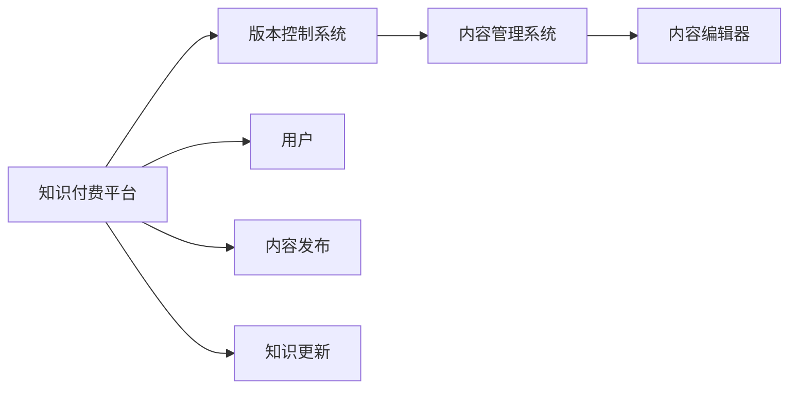

                 

## 1. 背景介绍

随着知识付费业务的蓬勃发展，内容创作者逐渐从个体向专业化、团队化转变。如何有效管理知识内容的版本和更新，确保知识内容的时效性、准确性和一致性，成为知识付费平台关注的重点。版本控制技术作为一种重要的内容管理手段，能够确保知识内容的健康有序更新，促进内容的长期迭代和优化。本文旨在详细探讨知识付费内容的版本控制与更新策略，为知识付费平台提供可行的解决方案。

## 2. 核心概念与联系

### 2.1 核心概念概述

- **版本控制**：一种软件工程技术，通过记录和追踪代码库的变动历史，实现多人协作编辑和管理。
- **知识付费**：用户为获取知识、技能、经验等内容而支付费用的服务模式。
- **内容管理系统**：一种软件工具，用于管理、发布和维护网站或应用程序的内容，包括文章、图片、视频等。
- **知识更新**：定期或不定期地对知识内容进行更新和优化，确保其时效性和准确性。
- **知识版本**：根据创建时间和版本变化，为知识内容生成的不同版本，便于管理和追踪。

### 2.2 核心概念原理和架构的 Mermaid 流程图



此 Mermaid 流程图展示了知识付费平台中版本控制与内容管理的核心组件和流程。用户通过内容编辑器创作和编辑知识内容，并由内容管理系统负责存储和展示。同时，版本控制系统记录内容的变化历史，确保版本一致性和内容更新。

## 3. 核心算法原理 & 具体操作步骤

### 3.1 算法原理概述

版本控制的核心算法包括差异计算、合并冲突解决和分支管理。其中：

- **差异计算**：通过计算前后版本的差异，实现快速更新和回滚。
- **合并冲突解决**：在多人协作时，解决不同分支或版本之间的冲突。
- **分支管理**：通过创建和管理分支，实现不同版本和更新任务的隔离和并发管理。

### 3.2 算法步骤详解

#### 3.2.1 差异计算

差异计算的核心算法包括**增量计算**和**三向合并**：

1. **增量计算**：计算前后版本的内容差异，生成diff。
   - 以文件形式保存，如`file.diff`。
   - 对于大型文件，采用**二进制差分算法**，计算差异后只存储修改部分。

2. **三向合并**：合并前后版本和新编辑内容，生成最终版本。
   - 采用**三路归并排序**算法，分别记录前后版本和新内容的差异。
   - 如`diff1`、`diff2`、`diff3`，合并后为`diff4`。

#### 3.2.2 合并冲突解决

合并冲突的解决过程包括**拉取-合并**和**手动解决**：

1. **拉取-合并**：
   - 从远程仓库拉取最新代码，自动合并到本地分支。
   - 如`git merge`命令，使用**快速合并算法**，若冲突则使用**递归合并算法**。

2. **手动解决**：
   - 对于复杂的冲突，手动解决并更新代码。
   - 使用`git rebase`命令，将冲突内容重新应用到新分支上。

#### 3.2.3 分支管理

分支管理的主要算法包括**创建分支**和**合并分支**：

1. **创建分支**：
   - 通过`git branch`命令创建新分支。
   - 常见分支类型包括`master`、`dev`、`feature`、`bugfix`等。

2. **合并分支**：
   - 使用`git merge`命令合并分支。
   - 如`git merge dev-branch master-branch`，将`dev-branch`合并到`master-branch`。

### 3.3 算法优缺点

#### 3.3.1 优点

1. **易于协作**：多人可以同时编辑同一内容，通过版本控制实现同步更新。
2. **版本一致**：每个版本都有记录，便于回溯和修复。
3. **快速部署**：通过差异计算和增量更新，减少资源消耗，提高部署速度。

#### 3.3.2 缺点

1. **复杂度较高**：对于大型项目，分支管理复杂，需不断协调合并。
2. **学习成本高**：初学者可能需要较长时间掌握版本控制的基本操作。
3. **性能开销**：增量计算和差异存储可能占用较大空间和计算资源。

### 3.4 算法应用领域

版本控制技术不仅在软件开发中广泛应用，也广泛应用于知识付费平台的内容管理。具体应用场景包括：

1. **内容更新**：定期或不定期更新内容，确保时效性和准确性。
2. **多人协作**：多个编辑者协同更新同一内容，实现高效协作。
3. **内容回溯**：通过版本记录，查看历史版本，便于故障排查和修复。
4. **数据备份**：定期备份内容数据，避免数据丢失。

## 4. 数学模型和公式 & 详细讲解 & 举例说明

### 4.1 数学模型构建

版本控制的核心数学模型包括差异计算模型和冲突解决模型：

- **差异计算模型**：计算前后版本的内容差异，生成diff。
  - 假设前后版本分别为$V_1$和$V_2$，差异计算模型表示为$\Delta(V_1, V_2)$。

- **冲突解决模型**：合并前后版本和新编辑内容，生成最终版本。
  - 假设前后版本为$V_1$和$V_2$，新编辑内容为$V_3$，合并结果为$V_4$，冲突解决模型表示为$M(V_1, V_2, V_3, V_4)$。

### 4.2 公式推导过程

#### 4.2.1 增量计算模型

假设前后版本分别为$V_1$和$V_2$，计算差异$\Delta(V_1, V_2)$：

$$
\Delta(V_1, V_2) = V_2 - V_1
$$

#### 4.2.2 三向合并模型

假设前后版本为$V_1$和$V_2$，新编辑内容为$V_3$，合并结果为$V_4$：

$$
V_4 = M(V_1, V_2, V_3)
$$

### 4.3 案例分析与讲解

#### 4.3.1 实例1：增量计算

假设有一篇文章$V_1$和$V_2$，部分内容变化如下：

| 行号 | 内容 |
| --- | --- |
| 10 | "知识付费" -> "知识共享" |
| 15 | 删除一行 |

计算差异$\Delta(V_1, V_2)$：

$$
\Delta(V_1, V_2) = V_2 - V_1 = \text{"知识共享", "10", "15"} - \text{"知识付费", "10"}
$$

#### 4.3.2 实例2：三向合并

假设有一篇文章$V_1$和$V_2$，新编辑内容$V_3$如下：

| 行号 | 内容 |
| --- | --- |
| 10 | "知识付费" -> "知识付费2.0" |
| 20 | 添加一行 |

计算合并结果$V_4$：

$$
V_4 = M(V_1, V_2, V_3) = \text{"知识付费2.0", "10", "20"} 
$$

## 5. 项目实践：代码实例和详细解释说明

### 5.1 开发环境搭建

#### 5.1.1 环境准备

1. **安装Git**：
   - 下载并安装Git，配置环境变量。
   ```bash
   wget https://git-scm.com/downloads/Git-2.29.2-x86_64.exe
   ```

2. **安装GitHub Desktop**：
   - 下载并安装GitHub Desktop。

3. **配置SSH登录**：
   - 生成SSH密钥，配置git config。
   ```bash
   ssh-keygen -t rsa -b 4096
   ```

#### 5.1.2 代码管理工具

- **GitHub**：使用GitHub Desktop创建仓库，配置GitHub登录。
- **Git LFS**：安装并配置Git LFS，支持大文件存储。

### 5.2 源代码详细实现

#### 5.2.1 GitHub仓库管理

1. **创建仓库**：
   - 在GitHub上创建仓库，克隆到本地。
   ```bash
   git clone https://github.com/example/repo.git
   ```

2. **分支管理**：
   - 创建新分支。
   ```bash
   git checkout -b feature-branch
   ```

3. **合并分支**：
   - 将`feature-branch`合并到`master`分支。
   ```bash
   git merge feature-branch master
   ```

#### 5.2.2 内容管理系统

1. **内容编辑器**：
   - 使用如Visual Studio Code、Atom等编辑器。
   - 编辑知识内容，保存变化。

2. **内容发布**：
   - 在GitHub上通过pull request提交代码。
   ```bash
   git commit -am "更新内容"
   git push origin master
   ```

3. **版本控制**：
   - 查看版本记录，使用`git log`命令。
   - 回滚到指定版本，使用`git checkout`命令。

### 5.3 代码解读与分析

#### 5.3.1 GitHubDesktop

GitHub Desktop是一个用户友好的界面工具，支持代码的提交、合并、版本管理等操作。

- **仓库管理**：创建、克隆、推送和拉取仓库。
- **分支管理**：创建新分支，合并分支，查看分支历史。
- **提交管理**：提交代码，生成pull request，合并代码。

#### 5.3.2 Git LFS

Git LFS（Large File Storage）用于存储大文件，如PDF、视频等，支持Git版本控制。

- **安装配置**：下载并安装Git LFS插件，配置仓库。
- **大文件管理**：使用`git lfs install`命令安装，`git lfs install`命令配置，`git lfs track`命令标记大文件。
- **版本控制**：提交大文件时，使用`git lfs push`命令推送到Git LFS服务器，拉取时使用`git lfs pull`命令。

### 5.4 运行结果展示

#### 5.4.1 分支管理

1. **创建分支**：
   ```bash
   git branch feature-branch
   ```
   ```bash
   git checkout feature-branch
   ```

2. **合并分支**：
   ```bash
   git merge feature-branch master
   ```

#### 5.4.2 版本控制

1. **查看版本记录**：
   ```bash
   git log
   ```

2. **回滚到指定版本**：
   ```bash
   git checkout <version-id>
   ```

## 6. 实际应用场景

### 6.1 知识付费内容管理

#### 6.1.1 实例1：更新文章

1. **创建新分支**：
   ```bash
   git checkout -b feature-article
   ```

2. **编辑文章**：
   - 使用内容编辑器编辑文章，保存变化。

3. **提交pull request**：
   ```bash
   git commit -am "更新文章"
   git push origin feature-article
   ```

4. **合并分支**：
   ```bash
   git checkout master
   git merge feature-article master
   ```

#### 6.1.2 实例2：新增文章

1. **创建新分支**：
   ```bash
   git checkout -b new-article
   ```

2. **编辑新文章**：
   - 使用内容编辑器编辑新文章，保存变化。

3. **提交pull request**：
   ```bash
   git commit -am "新增文章"
   git push origin new-article
   ```

4. **合并分支**：
   ```bash
   git checkout master
   git merge new-article master
   ```

## 7. 工具和资源推荐

### 7.1 学习资源推荐

1. **《Pro Git》**：Git官方文档，全面介绍Git命令和基本概念。
2. **《GitHub Handbook》**：GitHub官方文档，涵盖GitHub Desktop的使用和GitHub的高级特性。
3. **《Git LFS User Guide》**：Git LFS官方文档，详细介绍Git LFS的安装和配置。
4. **《Git Version Control》**：Coursera课程，介绍Git的基本原理和常用操作。

### 7.2 开发工具推荐

1. **Visual Studio Code**：轻量级、功能强大的代码编辑器，支持Git、Git LFS等。
2. **GitHub Desktop**：GitHub的桌面版工具，方便管理GitHub仓库。
3. **Git LFS**：Git LFS插件，支持大文件存储和版本控制。

### 7.3 相关论文推荐

1. **《版本控制系统的发展现状与未来趋势》**：介绍版本控制技术的发展历史和未来方向。
2. **《GitHub平台的设计与实现》**：介绍GitHub平台的设计思想和技术架构。
3. **《Git LFS：大文件存储技术》**：介绍Git LFS技术的设计思路和实现方法。

## 8. 总结：未来发展趋势与挑战

### 8.1 研究成果总结

版本控制技术在知识付费平台中具有重要的应用价值，其核心算法包括差异计算、合并冲突解决和分支管理。通过版本控制，可以有效管理知识内容的版本和更新，确保内容的时效性、准确性和一致性。

### 8.2 未来发展趋势

#### 8.2.1 自动化分支管理

未来版本控制将更多采用自动化分支管理技术，通过机器学习算法优化分支合并策略，减少人工干预，提高效率。

#### 8.2.2 云端协同编辑

云端协同编辑工具将进一步提升知识内容的协作效率，实现多人同时编辑同一内容，实时更新。

#### 8.2.3 知识图谱集成

将知识图谱与版本控制技术结合，实现知识的深度整合和智能推荐。

### 8.3 面临的挑战

#### 8.3.1 版本冲突

版本冲突是版本控制中的常见问题，特别是在多人协作的场景下，解决冲突需要复杂的操作和协调。

#### 8.3.2 大文件存储

大文件存储和传输是版本控制中的性能瓶颈，Git LFS等技术虽有改进，但仍有优化空间。

#### 8.3.3 知识版本一致性

如何在知识内容的多个版本间保持一致性，是一个复杂的问题，需要在技术和管理上综合考虑。

### 8.4 研究展望

未来的版本控制技术将在以下几个方面进行研究：

#### 8.4.1 分布式版本控制

分布式版本控制技术将进一步提升版本管理的灵活性和可扩展性，支持更多节点协同编辑和版本同步。

#### 8.4.2 智能版本推荐

利用机器学习和自然语言处理技术，智能推荐知识内容的最新版本，提升用户体验。

#### 8.4.3 版本控制与知识图谱

将知识图谱与版本控制技术结合，实现知识的深度整合和智能推荐，提升内容的管理和利用效率。

## 9. 附录：常见问题与解答

### 9.1 问题1：什么是版本控制？

**解答**：版本控制是一种软件工程技术，通过记录和追踪代码库的变动历史，实现多人协作编辑和管理。常见的版本控制工具包括Git、SVN等。

### 9.2 问题2：版本控制在知识付费平台中有什么应用？

**解答**：版本控制可以在知识付费平台中用于管理知识内容的版本和更新，确保内容的时效性、准确性和一致性。通过版本控制，可以轻松管理多个版本，进行版本回溯和修复，提高内容管理和发布的效率。

### 9.3 问题3：什么是差异计算？

**解答**：差异计算是版本控制中的核心算法之一，用于计算前后版本的差异，生成diff。常见的差异计算算法包括增量计算和三向合并。

### 9.4 问题4：什么是分支管理？

**解答**：分支管理是版本控制中的另一个核心算法，通过创建和管理分支，实现不同版本和更新任务的隔离和并发管理。常见的分支类型包括`master`、`dev`、`feature`、`bugfix`等。

### 9.5 问题5：什么是三向合并？

**解答**：三向合并是版本控制中的合并冲突解决算法，用于合并前后版本和新编辑内容，生成最终版本。常见的三向合并算法包括快速合并算法和递归合并算法。

---

作者：禅与计算机程序设计艺术 / Zen and the Art of Computer Programming

