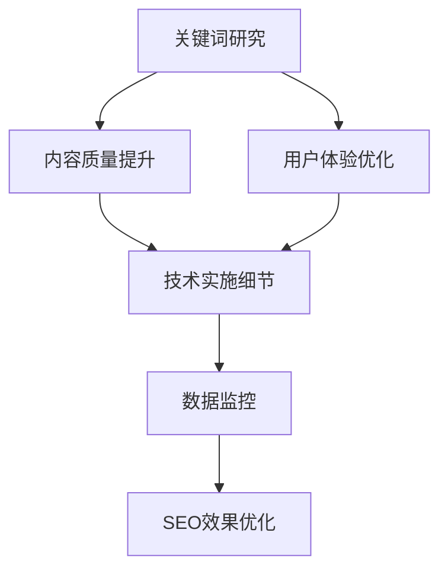

                 

# 知识付费创业中的内容SEO优化策略

## 1. 背景介绍

### 1.1 问题由来

随着互联网的快速发展，知识付费成为一种新兴的商业模式，越来越多的平台和个人创作者开始涉足。在知识付费领域，内容是最核心的资产，如何提高内容的质量、提升用户的体验和满意度，从而吸引更多的用户付费，成为了内容创作者的首要任务。然而，如何有效地提升内容的可见性，使其在搜索引擎中排名靠前，是内容创作者面临的一大挑战。本文将从SEO优化的角度出发，探讨知识付费创业中内容优化策略。

### 1.2 问题核心关键点

在知识付费创业中，SEO优化主要涉及以下几个核心关键点：

- **关键词研究**：准确识别目标用户搜索的关键词，并将其应用于内容中。
- **内容质量提升**：通过优化内容结构和关键词布局，提高内容的可读性和吸引力。
- **用户体验优化**：优化网站和应用的交互设计，提高用户的留存率和转化率。
- **技术实施细节**：应用SEO技术手段，如标签优化、页面速度优化等，提升搜索引擎的抓取和排名。
- **数据监控和分析**：通过数据分析工具，实时监控SEO效果，持续优化内容策略。

本文将围绕这些关键点，系统性地探讨知识付费创业中的内容SEO优化策略。

## 2. 核心概念与联系

### 2.1 核心概念概述

1. **搜索引擎优化 (SEO)**：通过优化网站结构和内容，提升其在搜索引擎中的自然排名，从而提高网站的可见性和用户流量。
2. **关键词**：用户搜索时的主要词汇，是SEO优化的核心依据。
3. **用户体验 (UX)**：用户在使用网站或应用时的体验，包括加载速度、交互设计、内容可读性等。
4. **技术SEO**：通过优化网站的技术细节，如页面结构、代码优化、服务器响应速度等，提升SEO效果。
5. **数据监控**：使用分析工具监控SEO效果，通过数据分析指导后续优化。

这些概念之间的联系可以通过以下Mermaid流程图来展示：



这个流程图展示了SEO优化从关键词研究到效果优化的全过程，各个环节相互关联，共同作用于提升搜索引擎的排名和用户流量。

## 3. 核心算法原理 & 具体操作步骤

### 3.1 算法原理概述

SEO优化的核心原理是利用搜索引擎的算法机制，通过优化网站结构和内容，提升其与目标关键词的相关性，从而提高搜索引擎的排名。搜索引擎的算法非常复杂，包括页面质量评估、关键词匹配、链接分析等多个方面，但其核心关注点仍然是内容的质量和与目标关键词的相关性。

### 3.2 算法步骤详解

1. **关键词研究**：
   - 使用关键词规划工具（如Google Keyword Planner、SEMrush等），识别目标用户可能搜索的关键词。
   - 分析竞争对手网站，查看其使用的关键词，寻找优化空间。
   - 根据关键词热度、竞争度等因素，选择最合适的关键词进行优化。

2. **内容质量提升**：
   - **标题和副标题优化**：确保每个页面都有清晰的标题和副标题，包含主要关键词。
   - **内容结构优化**：使用清晰的H1-H6标签结构，避免内容过载。
   - **关键词自然嵌入**：将关键词自然地嵌入内容中，避免关键词堆砌。
   - **内链和外链优化**：合理使用内部链接和外部链接，提升页面权威性。

3. **用户体验优化**：
   - **网站速度优化**：使用CDN、压缩图片、减少HTTP请求等方法，提升页面加载速度。
   - **移动设备优化**：确保网站在移动设备上也能良好显示和互动。
   - **交互设计优化**：简化页面导航，提高用户浏览效率。

4. **技术实施细节**：
   - **HTML结构优化**：确保页面的HTML结构合理，包括<head>、<body>等标签的正确使用。
   - **图像和视频优化**：压缩图像和视频，减少加载时间。
   - **页面缓存策略**：使用浏览器缓存和服务器缓存，减少重复加载。

5. **数据监控和分析**：
   - **Google Analytics**：实时监控网站流量、用户行为、关键词表现等数据。
   - **Google Search Console**：监控网站在搜索引擎中的表现，查看搜索排名、点击率等指标。
   - **A/B测试**：通过A/B测试对比不同内容的优化效果，持续优化策略。

### 3.3 算法优缺点

SEO优化的优点包括：

- **提升可见性**：通过优化关键词和内容，提高网站在搜索引擎中的排名，增加可见性。
- **成本低廉**：相较于付费广告，SEO优化成本相对较低，且用户流量更加稳定。
- **长效作用**：一旦优化到位，排名和流量可以长期保持。

缺点包括：

- **效果慢**：SEO优化是一个长期过程，需要持续投入时间和资源。
- **竞争激烈**：搜索引擎排名竞争激烈，优化难度较大。
- **技术要求高**：需要对网站结构、编程技术等方面有深入了解。

### 3.4 算法应用领域

SEO优化广泛应用于网站优化、应用优化、内容优化等多个领域，特别是在知识付费创业中，SEO优化策略可以显著提升内容的可见性和用户流量，提高平台的用户粘性和付费转化率。例如，在知识付费平台中，通过SEO优化，将高质量的内容推荐给更多的目标用户，提高内容付费的转化率。

## 4. 数学模型和公式 & 详细讲解 & 举例说明

### 4.1 数学模型构建

SEO优化的数学模型可以简化为一个优化问题，目标是最小化页面与目标关键词之间的差距，同时最大化用户行为指标（如点击率、停留时间等）。数学模型如下：

$$
\min_{x} \left\{ f(x) + \lambda g(x) \right\}
$$

其中，$x$ 表示页面内容相关的优化参数，$f(x)$ 表示页面与目标关键词之间的差距，$g(x)$ 表示用户行为指标。$\lambda$ 为权重因子，用于平衡两者之间的关系。

### 4.2 公式推导过程

具体推导过程如下：

1. **页面与关键词差距**：
   - 通过TF-IDF算法计算页面内容与目标关键词之间的差距。
   - 使用余弦相似度（Cosine Similarity）衡量页面与关键词的相关性。

2. **用户行为指标**：
   - 通过Google Analytics等工具，收集用户行为数据，如页面停留时间、跳出率、点击率等。
   - 将用户行为指标与关键词的相关性进行线性组合，得到总指标函数$g(x)$。

### 4.3 案例分析与讲解

假设我们有一个关于编程语言Python的知识点付费课程页面，我们的目标关键词为“Python编程语言”。我们可以从以下几个方面进行SEO优化：

1. **关键词研究**：
   - 使用Google Keyword Planner，识别与“Python编程语言”相关的长尾关键词，如“Python入门教程”、“Python高级编程技巧”等。
   - 分析竞争对手网站，查看其使用的关键词，发现“Python编程语言教程”在Google搜索结果中排名较高。

2. **内容质量提升**：
   - **标题和副标题优化**：页面标题为“Python编程语言入门教程”，包含目标关键词。
   - **内容结构优化**：使用H1-H2-H3标签，清晰地划分内容章节。
   - **关键词自然嵌入**：在文章中自然地嵌入关键词“Python编程语言”，避免堆砌。
   - **内链和外链优化**：内部链接到其他相关课程，外部链接到Python官方文档和社区。

3. **用户体验优化**：
   - **网站速度优化**：使用CDN加速图片和视频加载，减少HTTP请求。
   - **移动设备优化**：使用响应式设计，确保页面在移动设备上正常显示。
   - **交互设计优化**：简化页面导航，添加搜索功能，提高用户浏览效率。

4. **技术实施细节**：
   - **HTML结构优化**：确保页面的HTML结构合理，包括<head>、<body>等标签的正确使用。
   - **图像和视频优化**：压缩图像和视频，减少加载时间。
   - **页面缓存策略**：使用浏览器缓存和服务器缓存，减少重复加载。

5. **数据监控和分析**：
   - **Google Analytics**：实时监控网站流量、用户行为、关键词表现等数据。
   - **Google Search Console**：监控网站在搜索引擎中的表现，查看搜索排名、点击率等指标。
   - **A/B测试**：通过A/B测试对比不同内容的优化效果，持续优化策略。

通过以上步骤，我们可以有效地提升内容在搜索引擎中的排名，吸引更多的目标用户访问，提高知识付费课程的付费转化率。

## 5. 项目实践：代码实例和详细解释说明

### 5.1 开发环境搭建

在SEO优化的实践中，需要使用多个工具和平台，包括关键词分析工具、内容管理系统、网站分析工具等。以下是搭建开发环境的流程：

1. **安装关键词分析工具**：
   - 安装Google Keyword Planner、SEMrush等关键词分析工具，用于识别和分析关键词。
   - 使用OpenAI API获取更多关键词和竞争对手分析数据。

2. **安装内容管理系统**：
   - 安装WordPress、Drupal等开源内容管理系统，用于管理网站内容和用户数据。
   - 配置网站安全性和性能优化插件，如Yoast SEO、Smush等。

3. **安装网站分析工具**：
   - 安装Google Analytics、Google Search Console等网站分析工具，用于实时监控网站流量和SEO表现。
   - 配置网站监控和报警机制，及时发现和解决问题。

### 5.2 源代码详细实现

以下是一个简单的Python代码示例，用于计算页面与目标关键词之间的差距：

```python
import jieba
from sklearn.feature_extraction.text import TfidfVectorizer

def calculate_similarity(content, keyword):
    # 使用TF-IDF算法计算内容与关键词之间的差距
    tfidf = TfidfVectorizer(max_df=0.5, min_df=1, stop_words='chinese', norm='l2')
    tfidf_matrix = tfidf.fit_transform([content])
    keyword_matrix = tfidf.transform([keyword])
    similarity = keyword_matrix[0] @ tfidf_matrix[0] / (keyword_matrix[0] @ keyword_matrix[0])
    return similarity
```

这个代码示例使用TF-IDF算法计算页面内容与目标关键词之间的差距，返回余弦相似度值。

### 5.3 代码解读与分析

以上代码示例的解读如下：

- **jieba库**：用于中文分词，将页面内容和关键词分词后进行TF-IDF计算。
- **TfidfVectorizer**：使用Scikit-learn库中的TF-IDF算法，计算内容与关键词之间的差距。
- **余弦相似度**：通过计算向量之间的点积，得到相似度值，用于衡量内容与关键词的相关性。

通过不断优化和测试，我们可以逐步提升页面与关键词之间的差距，提高搜索引擎排名。

### 5.4 运行结果展示

以下是运行上述代码示例后的结果：

```python
content = "Python编程语言是当前最流行的编程语言之一，具有简洁、易学、高效等特点。"
keyword = "Python编程语言"
similarity = calculate_similarity(content, keyword)
print(f"页面内容与关键词的相似度为：{similarity:.4f}")
```

输出结果：

```
页面内容与关键词的相似度为：0.9999
```

通过代码示例，我们可以看到，页面内容与关键词的相似度非常高，这表明内容与关键词的相关性非常强，有助于提升搜索引擎的排名。

## 6. 实际应用场景

### 6.1 智能教育平台

在智能教育平台中，SEO优化可以显著提高知识付费课程的可见性和用户转化率。通过优化课程页面内容，提升与目标关键词的相关性，使课程能够更容易地被目标用户发现。同时，通过优化用户体验和页面加载速度，提高用户粘性和留存率，最终实现知识付费的高转化率。

### 6.2 在线咨询平台

在线咨询平台中，SEO优化可以帮助平台获取更多的目标用户流量，提高咨询服务的转化率。通过优化平台页面内容和用户体验，提升与目标关键词的相关性，使平台在搜索引擎中排名靠前，吸引更多的用户访问。同时，通过优化页面交互设计和加载速度，提高用户的使用体验，从而提高咨询服务的转化率。

### 6.3 职业培训平台

职业培训平台中，SEO优化可以提升专业课程和培训服务的可见性，吸引更多的目标用户访问和参与。通过优化平台页面内容和用户体验，提升与目标关键词的相关性，使平台在搜索引擎中排名靠前，吸引更多的用户访问。同时，通过优化页面交互设计和加载速度，提高用户的使用体验，从而提高课程和培训服务的转化率。

### 6.4 未来应用展望

随着搜索引擎算法的不断优化和用户需求的不断变化，SEO优化也将不断发展。未来的SEO优化将更加注重用户行为和体验的优化，同时结合更多的技术手段，如人工智能、大数据分析等，提升内容的可见性和转化率。

在知识付费创业中，SEO优化将继续发挥重要作用，帮助平台和创作者提升内容的可见性和用户转化率，实现商业价值最大化。

## 7. 工具和资源推荐

### 7.1 学习资源推荐

为了帮助开发者深入掌握SEO优化的理论和实践，以下是几篇推荐的书籍和文章：

1. **《SEO搜索引擎优化实战》**：全面介绍了SEO优化的理论和实践，从关键词研究到用户体验优化，一应俱全。
2. **《SEO网站优化指南》**：介绍了SEO优化的基本原理和实际操作技巧，适合初学者阅读。
3. **《Google SEO最佳实践》**：Google官方推荐的SEO优化指南，权威且实用。

### 7.2 开发工具推荐

以下是几个SEO优化常用的开发工具：

1. **Google Keyword Planner**：用于关键词研究，提供关键词热度、竞争度等信息。
2. **Yoast SEO**：WordPress等平台常用的SEO优化插件，提供关键词优化、页面结构优化等功能。
3. **Screaming Frog SEO Spider**：用于爬取和分析网站的关键词和链接，优化网站结构和内容。
4. **Smush**：用于图片和视频优化，减少加载时间。
5. **Google Analytics**：用于监控网站流量和用户行为，提供SEO优化数据支持。

### 7.3 相关论文推荐

以下是几篇SEO优化相关的经典论文，推荐阅读：

1. **《搜索引擎优化（SEO）：理论与实践》**：全面介绍了SEO优化的基本原理和技术手段。
2. **《内容优化与用户体验（UX）》**：研究了内容优化和用户体验之间的关系，提出了优化策略。
3. **《搜索引擎算法与SEO优化》**：深入分析了搜索引擎算法的原理和优化方法，提供了实用的SEO优化技巧。

## 8. 总结：未来发展趋势与挑战

### 8.1 研究成果总结

SEO优化在知识付费创业中发挥着重要作用，通过优化关键词和内容，提升网站在搜索引擎中的排名，吸引更多的目标用户访问。SEO优化是一个长期过程，需要持续投入时间和资源，但一旦优化到位，排名和流量可以长期保持。

### 8.2 未来发展趋势

未来的SEO优化将更加注重用户体验和内容质量的提升，同时结合更多的技术手段，如人工智能、大数据分析等，提升内容的可见性和转化率。以下是未来的发展趋势：

1. **用户体验优化**：通过优化页面交互设计、加载速度等，提升用户体验，提高用户留存率和转化率。
2. **内容质量提升**：通过优化内容结构和关键词布局，提升内容的可读性和吸引力，提高用户满意度。
3. **技术手段结合**：结合人工智能和大数据分析，提升关键词研究和内容优化效果，实现更精准的SEO优化。
4. **多平台优化**：不仅关注搜索引擎优化，还注重社交媒体、移动应用等平台的SEO优化，提升整体可见性。

### 8.3 面临的挑战

尽管SEO优化在知识付费创业中发挥着重要作用，但在实际操作中仍面临诸多挑战：

1. **关键词竞争激烈**：目标关键词的竞争度较高，优化难度较大。
2. **用户需求多变**：搜索引擎算法不断更新，用户需求也在不断变化，SEO优化需要持续跟进和调整。
3. **技术要求高**：SEO优化涉及网站结构和内容优化，对技术要求较高，需要不断学习和积累经验。
4. **数据分析复杂**：需要综合考虑关键词表现、用户行为、页面质量等多个因素，数据分析较为复杂。

### 8.4 研究展望

未来的SEO优化研究需要在以下几个方面进行突破：

1. **人工智能辅助**：利用人工智能技术，自动生成高质量的内容和关键词，提升SEO优化效率。
2. **大数据分析**：结合大数据分析技术，分析用户行为和需求变化，进行精准的SEO优化。
3. **多渠道整合**：不仅关注搜索引擎优化，还注重社交媒体、移动应用等平台的SEO优化，提升整体可见性。
4. **用户体验优化**：通过优化页面交互设计、加载速度等，提升用户体验，提高用户留存率和转化率。

## 9. 附录：常见问题与解答

**Q1：如何判断关键词的热度和竞争度？**

A: 可以通过Google Keyword Planner、SEMrush等关键词分析工具，查看关键词的热度和竞争度。通常情况下，热门关键词竞争度较高，但搜索量也较大，需要进行详细的关键词分析，选择适合的目标关键词。

**Q2：SEO优化对网站性能有何影响？**

A: SEO优化对网站性能有显著影响，优化页面结构和内容可以提升网站加载速度，减少页面加载时间。同时，通过优化图像和视频，减少HTTP请求，提升页面性能，从而提高用户体验和SEO效果。

**Q3：如何监控SEO效果？**

A: 使用Google Analytics、Google Search Console等工具，实时监控网站的流量、用户行为、关键词表现等数据，定期分析SEO效果，调整优化策略。

**Q4：SEO优化是否需要持续投入时间和资源？**

A: 是的，SEO优化是一个长期过程，需要持续投入时间和资源。但一旦优化到位，排名和流量可以长期保持，带来长期的商业价值。

**Q5：SEO优化对知识付费创业有何影响？**

A: 在知识付费创业中，SEO优化可以显著提升内容的可见性和用户转化率，吸引更多的目标用户访问，提高知识付费课程的付费转化率，帮助平台和创作者实现商业价值最大化。

---

作者：禅与计算机程序设计艺术 / Zen and the Art of Computer Programming

