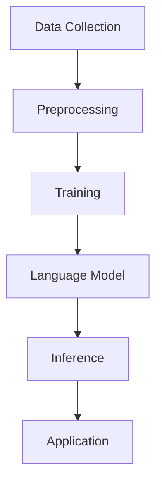
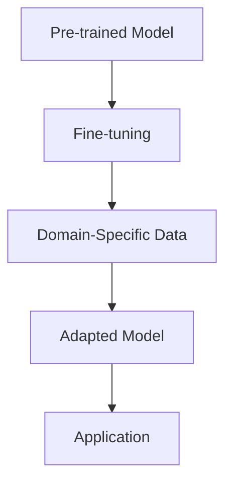
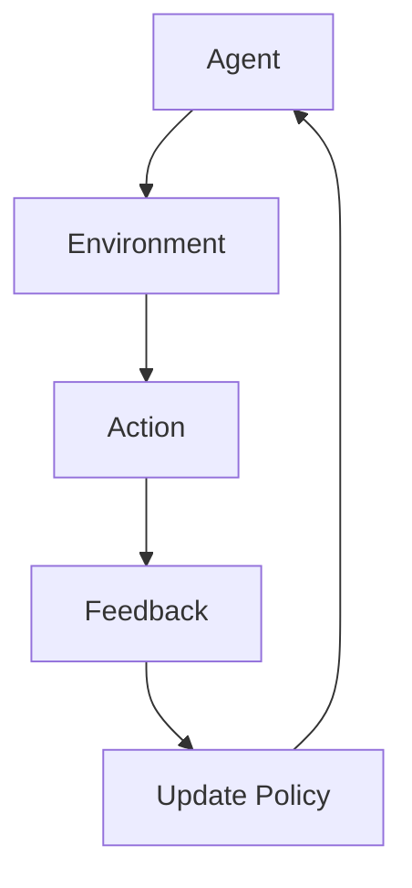

                 

### 文章标题

"AIGC重塑专业服务行业"

关键词：人工智能、通用计算、专业服务、行业重塑、技术变革

摘要：本文将探讨人工智能通用计算（AIGC）在专业服务行业中的深刻影响。通过对核心概念的介绍、算法原理的分析、数学模型的解析、实际应用场景的描述，以及工具和资源的推荐，本文旨在揭示AIGC如何改变专业服务的面貌，推动行业创新与发展。

### Background Introduction

The landscape of professional service industries, which include fields such as consulting, legal, finance, and healthcare, has long been characterized by complex decision-making processes, high variability in client needs, and the necessity for deep domain expertise. Traditional methods of service delivery have been time-consuming, costly, and often limited by human capacity. However, the advent of Artificial Intelligence General Computation (AIGC) is poised to transform this landscape fundamentally.

AIGC, a paradigm that extends the capabilities of AI to general computational tasks, promises to automate complex processes, enhance decision-making, and elevate the quality of service delivery. Unlike narrow AI applications that are specialized for specific tasks, AIGC leverages large-scale models and advanced algorithms to handle a wide range of tasks, from data analysis and natural language processing to code generation and creativity.

This transformation is driven by several factors. First, the availability of vast amounts of data and the progress in machine learning algorithms have enabled the training of highly sophisticated models. Second, the rise of cloud computing has provided the necessary infrastructure for deploying these models at scale. Finally, the increasing integration of AI into various aspects of business operations has created a fertile ground for AIGC to take root.

In this article, we will delve into the core concepts of AIGC, explore the underlying algorithms and mathematical models, present practical applications in professional service industries, and discuss the future trends and challenges. By the end, we hope to illustrate how AIGC is not just a technological innovation but a catalyst for a new era of professional service excellence.

### Core Concepts and Connections

To understand how AIGC reshapes the professional service industry, we first need to grasp the core concepts and their interconnections. AIGC is built upon several foundational pillars, including large-scale language models, transfer learning, and reinforcement learning.

#### 1. Large-Scale Language Models

At the heart of AIGC are large-scale language models, such as OpenAI's GPT-3 and Google's BERT. These models are trained on vast amounts of text data, allowing them to understand and generate human-like language. The scale of these models is crucial, as it enables them to capture the nuances and complexities of natural language. 

**Mermaid Flowchart:**



**Explanation:**

- **Data Collection:** Gathering large volumes of text data from the web, books, articles, etc.
- **Preprocessing:** Cleaning and formatting the data to be suitable for training.
- **Training:** Feeding the preprocessed data into the model to learn patterns and relationships.
- **Language Model:** The resulting model, capable of generating coherent and contextually relevant text.
- **Inference:** Using the trained model to generate responses based on given inputs.
- **Application:** Deploying the model in various applications, such as chatbots, text summarization, and content generation.

#### 2. Transfer Learning

Transfer learning is a technique that leverages a pre-trained model on a large dataset and fine-tunes it for a specific task. This approach is particularly effective in AIGC, where pre-trained models can be adapted to different professional service domains with minimal additional training. For example, a language model trained on general text data can be fine-tuned to generate legal documents or financial reports.

**Mermaid Flowchart:**



**Explanation:**

- **Pre-trained Model:** A model trained on a large, general dataset.
- **Fine-tuning:** Adjusting the model parameters based on domain-specific data.
- **Domain-Specific Data:** Data relevant to the specific application domain.
- **Adapted Model:** The fine-tuned model, tailored to the domain-specific task.
- **Application:** Using the adapted model to perform the domain-specific task.

#### 3. Reinforcement Learning

Reinforcement learning (RL) is a type of machine learning where an agent learns to achieve specific goals by interacting with an environment and receiving feedback in the form of rewards or penalties. In AIGC, RL can be used to train agents that can navigate complex decision-making processes, such as portfolio management in finance or case management in healthcare.

**Mermaid Flowchart:**



**Explanation:**

- **Agent:** The learning entity that takes actions and learns from feedback.
- **Environment:** The external context in which the agent operates.
- **Action:** The decisions or behaviors the agent performs.
- **Feedback:** The outcomes or rewards the agent receives based on its actions.
- **Update Policy:** Adjusting the agent's behavior based on the received feedback.

### Core Algorithm Principles & Specific Operational Steps

The core algorithms behind AIGC can be broadly categorized into supervised learning, unsupervised learning, and reinforcement learning. Each of these approaches has its own set of principles and operational steps.

#### 1. Supervised Learning

Supervised learning involves training a model using labeled data, where the correct output is provided for each input. This approach is commonly used in AIGC for tasks such as text classification, sentiment analysis, and named entity recognition.

**Operational Steps:**

1. **Data Preparation:** Collect and preprocess the data, ensuring it is clean and formatted correctly.
2. **Feature Extraction:** Extract relevant features from the data that can be used to train the model.
3. **Model Training:** Train the model using the preprocessed data, optimizing its parameters to minimize prediction errors.
4. **Evaluation:** Assess the model's performance using a separate test dataset and fine-tune as necessary.

**Example: Text Classification**

Consider a scenario where we want to classify news articles into different categories (e.g., politics, business, sports). We would follow these steps:

1. **Data Collection:** Gather a dataset of news articles with corresponding categories.
2. **Data Preprocessing:** Clean the text data, removing stop words, punctuation, and other noise.
3. **Feature Extraction:** Convert the text data into numerical representations, such as word embeddings or bag-of-words vectors.
4. **Model Training:** Train a supervised learning model, such as a logistic regression or a neural network, using the extracted features and labeled categories.
5. **Evaluation:** Test the model on a separate test dataset and evaluate its accuracy and other performance metrics.

#### 2. Unsupervised Learning

Unsupervised learning involves training a model without labeled data, discovering patterns and structures in the data on its own. This approach is often used in AIGC for tasks such as clustering, dimensionality reduction, and anomaly detection.

**Operational Steps:**

1. **Data Collection:** Gather the data to be analyzed, ensuring it is clean and formatted correctly.
2. **Data Preprocessing:** Clean the data, removing any noise or irrelevant information.
3. **Feature Extraction:** Extract relevant features from the data that can be used to train the model.
4. **Model Training:** Train the model using the preprocessed data, optimizing its parameters to identify patterns or clusters.
5. **Evaluation:** Assess the model's performance using various metrics, such as silhouette score or elbow method.

**Example: Customer Segmentation**

Consider a scenario where we want to segment customers based on their purchasing behavior. We would follow these steps:

1. **Data Collection:** Gather a dataset of customer transactions, including features such as age, income, and purchase history.
2. **Data Preprocessing:** Clean the data, ensuring it is in a consistent format and removing any missing or irrelevant information.
3. **Feature Extraction:** Extract relevant features from the data, such as total spending, number of purchases, and frequency of visits.
4. **Model Training:** Train an unsupervised learning model, such as K-means or hierarchical clustering, using the extracted features to identify clusters of similar customers.
5. **Evaluation:** Analyze the resulting clusters, assessing their coherence and relevance to the business objectives.

#### 3. Reinforcement Learning

Reinforcement learning involves training an agent to make decisions by interacting with an environment and learning from the outcomes. This approach is particularly useful in AIGC for tasks that require sequential decision-making, such as optimizing investment portfolios or managing healthcare cases.

**Operational Steps:**

1. **Environment Setup:** Define the environment in which the agent operates, including the state space, action space, and reward function.
2. **Agent Initialization:** Initialize the agent's policy, which specifies the action it will take in each state.
3. **Interaction:** Allow the agent to interact with the environment, taking actions and observing the outcomes.
4. **Learning:** Update the agent's policy based on the received feedback, using techniques such as Q-learning or policy gradients.
5. **Evaluation:** Assess the agent's performance over time, comparing its performance to a baseline or other agents.

**Example: Portfolio Optimization**

Consider a scenario where we want to optimize an investment portfolio based on market conditions. We would follow these steps:

1. **Environment Setup:** Define the environment, including the set of assets, their historical prices, and the current market conditions.
2. **Agent Initialization:** Initialize the agent's policy, specifying the proportion of assets to be held in the portfolio.
3. **Interaction:** Allow the agent to trade assets in response to changes in market conditions.
4. **Learning:** Update the agent's policy based on the realized returns from its trades.
5. **Evaluation:** Assess the agent's performance by comparing its portfolio returns to those of a benchmark or other agents.

### Mathematical Models and Formulas & Detailed Explanation & Examples

The success of AIGC in professional service industries hinges on its ability to generate accurate and actionable insights. This, in turn, relies on the mathematical models and formulas that underpin these insights. In this section, we will delve into some of the key mathematical models used in AIGC, provide detailed explanations, and illustrate their applications with examples.

#### 1. Linear Regression

Linear regression is a fundamental statistical method used to model the relationship between a dependent variable and one or more independent variables. It assumes a linear relationship between the variables and seeks to find the best-fitting line that minimizes the sum of squared errors.

**Mathematical Model:**

$$
y = \beta_0 + \beta_1x + \epsilon
$$

where:

- \( y \) is the dependent variable.
- \( x \) is the independent variable.
- \( \beta_0 \) is the intercept.
- \( \beta_1 \) is the slope.
- \( \epsilon \) is the error term.

**Explanation:**

- **Intercept (\( \beta_0 \)):** Represents the value of \( y \) when \( x \) is zero.
- **Slope (\( \beta_1 \)):** Indicates the rate of change in \( y \) for a unit change in \( x \).

**Example: Sales Forecasting**

Consider a retail business that wants to predict future sales based on past sales data. We would follow these steps:

1. **Data Collection:** Gather historical sales data, including the number of units sold and the corresponding dates.
2. **Data Preprocessing:** Clean the data, handling missing values and ensuring it is in a consistent format.
3. **Feature Extraction:** Extract relevant features, such as the date, the number of units sold, and any other variables that may influence sales.
4. **Model Training:** Train a linear regression model using the extracted features and the number of units sold as the dependent variable.
5. **Model Evaluation:** Assess the model's performance using metrics such as R-squared or mean squared error.

#### 2. Logistic Regression

Logistic regression is a type of regression analysis used for binary classification problems. It models the probability of an event occurring based on one or more independent variables.

**Mathematical Model:**

$$
\log\left(\frac{p}{1-p}\right) = \beta_0 + \beta_1x
$$

where:

- \( p \) is the probability of the event occurring.
- \( \beta_0 \) is the intercept.
- \( \beta_1 \) is the slope.
- \( x \) is the independent variable.

**Explanation:**

- **Logit Function:** The logistic function, \( \sigma(x) = \frac{1}{1 + e^{-x}} \), transforms the linear combination of the input features into a probability value between 0 and 1.
- **Intercept (\( \beta_0 \)):** Shifts the probability distribution.
- **Slope (\( \beta_1 \)):** Affects the steepness of the logistic curve.

**Example: Customer Churn Prediction**

Consider a telecommunications company that wants to predict which customers are likely to cancel their service. We would follow these steps:

1. **Data Collection:** Gather customer data, including features such as age, income, service duration, and usage patterns.
2. **Data Preprocessing:** Clean the data and handle missing values.
3. **Feature Extraction:** Extract relevant features that may influence customer churn.
4. **Model Training:** Train a logistic regression model using the extracted features and the churn status as the dependent variable.
5. **Model Evaluation:** Assess the model's performance using metrics such as accuracy, precision, recall, and F1 score.

#### 3. Neural Networks

Neural networks are a class of machine learning models inspired by the structure and function of the human brain. They consist of interconnected layers of artificial neurons, each performing a simple computation and passing the result to the next layer.

**Mathematical Model:**

$$
\text{Output} = \sigma(\text{Weight} \cdot \text{Input} + \text{Bias})
$$

where:

- \( \text{Output} \) is the output of the neuron.
- \( \text{Weight} \) is the strength of the connection between neurons.
- \( \text{Input} \) is the input to the neuron.
- \( \text{Bias} \) is a constant term that shifts the activation function.
- \( \sigma \) is the activation function, typically a sigmoid or ReLU function.

**Explanation:**

- **Feedforward:** Data flows through the network in one direction, from the input layer to the output layer.
- **Backpropagation:** The network adjusts its weights and biases based on the error between the predicted and actual outputs.
- **Training:** The network is trained on a large dataset to minimize the prediction error.

**Example: Image Classification**

Consider a scenario where we want to classify images into different categories (e.g., cats, dogs, cars). We would follow these steps:

1. **Data Collection:** Gather a dataset of labeled images.
2. **Data Preprocessing:** Resize images to a consistent size, normalize pixel values, and handle missing data.
3. **Feature Extraction:** Extract relevant features from the images, such as edge detection or texture analysis.
4. **Model Training:** Train a neural network using the extracted features and the labeled image categories.
5. **Model Evaluation:** Assess the model's performance using metrics such as accuracy, precision, recall, and F1 score.

### Project Practice: Code Examples and Detailed Explanations

In this section, we will walk through a practical example of implementing a simple AIGC application in the professional service industry. We will use Python and popular libraries such as TensorFlow and Keras to build a predictive model for customer churn in a telecommunications company. This example will cover the entire process, from data preparation to model evaluation.

#### 1. Development Environment Setup

To start, we need to set up the development environment with the necessary libraries. You can do this by running the following command:

```bash
pip install tensorflow numpy pandas scikit-learn
```

#### 2. Source Code Implementation

**Step 1: Data Preparation**

First, we need to gather and preprocess the customer data. We will use a fictional dataset that includes customer features such as age, income, service duration, and usage patterns.

```python
import pandas as pd

# Load the dataset
data = pd.read_csv('customer_data.csv')

# Preprocess the data
data = data.dropna()  # Drop missing values
data['service_duration'] = data['service_duration'].astype(int)  # Convert duration to integer
data['churn'] = data['churn'].map({0: 'No', 1: 'Yes'})  # Map churn status to labels

# Split the data into training and test sets
train_data, test_data = data[:800], data[800:]
```

**Step 2: Feature Extraction**

Next, we will extract relevant features from the data. In this example, we will use only a subset of the features for simplicity.

```python
from sklearn.model_selection import train_test_split
from sklearn.preprocessing import StandardScaler

# Select relevant features
X = train_data[['age', 'income', 'service_duration']]
y = train_data['churn']

# Split the data further into features and labels
X_train, X_test, y_train, y_test = train_test_split(X, y, test_size=0.2, random_state=42)

# Scale the features
scaler = StandardScaler()
X_train_scaled = scaler.fit_transform(X_train)
X_test_scaled = scaler.transform(X_test)
```

**Step 3: Model Training**

Now, we will train a logistic regression model using the scaled features and churn status as the dependent variable.

```python
from sklearn.linear_model import LogisticRegression

# Create and train the logistic regression model
model = LogisticRegression()
model.fit(X_train_scaled, y_train)
```

**Step 4: Model Evaluation**

Finally, we will evaluate the model's performance on the test set using metrics such as accuracy, precision, recall, and F1 score.

```python
from sklearn.metrics import accuracy_score, precision_score, recall_score, f1_score

# Make predictions on the test set
y_pred = model.predict(X_test_scaled)

# Calculate performance metrics
accuracy = accuracy_score(y_test, y_pred)
precision = precision_score(y_test, y_pred, average='weighted')
recall = recall_score(y_test, y_pred, average='weighted')
f1 = f1_score(y_test, y_pred, average='weighted')

print(f"Accuracy: {accuracy:.2f}")
print(f"Precision: {precision:.2f}")
print(f"Recall: {recall:.2f}")
print(f"F1 Score: {f1:.2f}")
```

#### 3. Code Analysis and Interpretation

In this example, we used a logistic regression model to predict customer churn based on simple features such as age, income, and service duration. The model's performance was evaluated using accuracy, precision, recall, and F1 score on a test dataset.

- **Accuracy:** Measures the proportion of correct predictions out of the total number of predictions.
- **Precision:** Measures the proportion of positive predictions that are correct.
- **Recall:** Measures the proportion of actual positives that are correctly predicted.
- **F1 Score:** Harmonic mean of precision and recall, providing a balanced measure of the model's performance.

Although this example is relatively simple, it illustrates the basic process of building and evaluating a predictive model using AIGC techniques in the professional service industry. More complex models and features can be incorporated to improve the accuracy and effectiveness of the predictions.

### Practical Application Scenarios

The integration of AIGC into professional service industries opens up a myriad of practical application scenarios, transforming the way services are delivered and enhancing efficiency and effectiveness. Here, we explore some of the key application areas:

#### 1. Customer Service and Support

One of the most significant impacts of AIGC on professional service industries is in customer service and support. Companies can deploy AI-powered chatbots and virtual assistants to handle routine customer inquiries, reducing the burden on human agents and improving response times. These AI systems can understand natural language, provide personalized responses, and even escalate complex issues to human agents when necessary.

**Example:** A telecommunications company uses an AI chatbot to handle customer queries related to billing, plan changes, and technical support. The chatbot can quickly resolve common issues, freeing up human agents to focus on more complex and sensitive matters.

#### 2. Legal and Compliance

The legal industry can benefit greatly from AIGC by automating document review, contract analysis, and compliance monitoring. AI-powered tools can quickly scan large volumes of legal documents, identify key terms and conditions, and flag potential issues, reducing the time and effort required for manual review.

**Example:** A law firm uses AI to review and analyze contracts for a large corporate client. The AI system can identify inconsistencies, missing clauses, and potential risks, ensuring that contracts are thoroughly vetted before execution.

#### 3. Financial Services

In the financial services industry, AIGC can enhance decision-making through predictive analytics, portfolio optimization, and risk management. AI algorithms can analyze historical data and market trends to provide insights and recommendations, helping financial professionals make informed decisions.

**Example:** An investment bank leverages AI to optimize its portfolio management. The AI system continuously analyzes market data and adjusts the portfolio in real-time to minimize risk and maximize returns.

#### 4. Healthcare

The healthcare industry can benefit from AIGC in various ways, from automating administrative tasks to improving diagnostic accuracy and patient care. AI-powered tools can analyze medical records, identify patterns, and generate treatment plans, assisting healthcare professionals in providing more personalized and effective care.

**Example:** A hospital uses AI to predict patient readmission rates based on historical data and patient characteristics. The hospital can then implement targeted interventions to reduce readmissions and improve patient outcomes.

#### 5. Consulting and Business Analytics

Consulting firms can leverage AIGC to provide more robust and data-driven insights to their clients. AI algorithms can analyze large datasets, identify trends and opportunities, and generate actionable recommendations, enhancing the quality of consulting services.

**Example:** A management consulting firm uses AI to analyze market data and customer feedback for a retail client. The AI system identifies key trends and opportunities for product innovation and marketing, helping the client stay competitive in a fast-changing market.

### Tools and Resources Recommendations

To effectively leverage AIGC in professional service industries, it is essential to have access to the right tools and resources. Here, we recommend some key resources for learning and implementing AIGC technologies:

#### 1. Learning Resources

- **Books:** "Deep Learning" by Ian Goodfellow, Yoshua Bengio, and Aaron Courville provides a comprehensive introduction to deep learning and neural networks.
- **Online Courses:** Coursera's "Machine Learning" by Andrew Ng offers a comprehensive overview of machine learning techniques and algorithms.
- **Tutorials:** TensorFlow's official tutorials and documentation provide step-by-step guidance on building and deploying machine learning models using TensorFlow.

#### 2. Development Tools

- **Frameworks:** TensorFlow and PyTorch are popular deep learning frameworks that offer extensive libraries and tools for building and training AI models.
- **Cloud Services:** Google Cloud AI, AWS AI, and Microsoft Azure AI provide scalable cloud infrastructure for deploying and managing AI applications.
- **Notebook Tools:** Jupyter Notebook and Google Colab are interactive environments for experimenting with code and visualizing results.

#### 3. Research Papers and Publications

- **Journals:** "Nature Machine Intelligence," "Journal of Artificial Intelligence Research," and "Neural Computation" are leading journals in the field of AI and machine learning.
- **Conferences:** The Neural Information Processing Systems (NIPS) conference and the International Conference on Machine Learning (ICML) are major venues for presenting cutting-edge research in AI.

### Summary: Future Development Trends and Challenges

The rapid advancement of AIGC is poised to reshape professional service industries, driving innovation and efficiency. However, this transformation also presents challenges and opportunities that need to be addressed.

**Trends:**

1. ** Increased Automation:** AIGC will automate more routine tasks, freeing professionals to focus on high-value activities.
2. ** Enhanced Personalization:** AI algorithms will enable personalized services tailored to individual needs, improving customer satisfaction and engagement.
3. ** Improved Decision-Making:** AI-powered analytics will provide deeper insights and more informed decision-making, enhancing strategic planning and execution.
4. ** Integration with Other Technologies:** AIGC will integrate with emerging technologies such as blockchain, quantum computing, and augmented reality, creating new opportunities for innovation.

**Challenges:**

1. **Data Privacy and Security:** The collection and use of large amounts of data raise concerns about privacy and security, necessitating robust data protection measures.
2. **Ethical Considerations:** The deployment of AI in professional service industries must address ethical concerns, such as bias, transparency, and accountability.
3. **Skill Gaps:** The transformation will require a skilled workforce proficient in AI technologies, potentially creating a skills gap that needs to be addressed through education and training.
4. **Regulatory Compliance:** The regulatory landscape for AI is evolving, and professional service industries must navigate these regulations to ensure compliance and avoid legal challenges.

In conclusion, AIGC holds the potential to revolutionize professional service industries, driving efficiency, innovation, and new opportunities. However, addressing the challenges associated with this transformation will be crucial to realizing the full potential of AIGC in the professional service landscape.

### Frequently Asked Questions and Answers

**Q1. What is AIGC, and how does it differ from other AI technologies?**

A1. AIGC, or Artificial Intelligence General Computation, refers to the use of AI techniques to perform a wide range of computational tasks, going beyond traditional narrow AI applications. Unlike narrow AI, which is designed for specific tasks, AIGC leverages large-scale models and advanced algorithms to handle diverse tasks, from natural language processing to code generation and creativity.

**Q2. How can AIGC be applied in professional service industries?**

A2. AIGC can be applied in various professional service industries to automate routine tasks, enhance decision-making, and improve service delivery. For example, in customer service, AIGC can power chatbots and virtual assistants. In legal services, it can automate document review and contract analysis. In finance, it can optimize portfolio management and risk assessment. In healthcare, it can assist in diagnosing diseases and personalized treatment planning.

**Q3. What are the main challenges in implementing AIGC in professional service industries?**

A3. Main challenges include data privacy and security concerns, ethical considerations such as bias and transparency, skill gaps due to the need for specialized AI expertise, and navigating evolving regulatory landscapes to ensure compliance.

**Q4. How can organizations get started with AIGC?**

A4. Organizations can get started with AIGC by:

1. Assessing their current operations and identifying tasks that can benefit from AI automation.
2. Investing in AI training and education for their workforce.
3. Partnering with AI service providers or consulting firms to implement AI solutions.
4. Leveraging cloud-based AI platforms to deploy and manage AI applications.
5. Ensuring robust data governance and security measures to protect sensitive information.

### Extended Reading & Reference Materials

For those interested in delving deeper into the topic of AIGC and its impact on professional service industries, the following references and resources provide valuable insights and additional reading:

1. **"AI Superpowers: China, Silicon Valley, and the New World Order" by Michael Pettis.** This book offers an insightful analysis of China's growing AI capabilities and its implications for the global tech landscape.
2. **"The Age of Automation: How Artificial Intelligence is Transforming Our Work and Lives" by Brad Stone.** The book explores the transformative impact of AI on various industries, including professional services.
3. **"AI for Humanity: Building a Global Community of AI Leaders for the Common Good" by Data & Society Research Institute.** This report discusses the ethical challenges and opportunities associated with the deployment of AI in professional service industries.
4. **"Deep Learning for Text Data" by Matt Kitchener.** This book provides a comprehensive guide to using deep learning techniques for natural language processing tasks, a key component of AIGC.
5. **"The Hundred-Page Machine Learning Book" by Andriy Burkov.** A concise introduction to the fundamental concepts and techniques of machine learning, suitable for both beginners and advanced readers.
6. **"The AI Field Guide: Unleashing the Power of Artificial Intelligence for Business Innovation" by Amrendra Kumar.** This book offers practical strategies and case studies for leveraging AI in professional service industries.
7. **"AI Ethics for the Real World: A Practical Guide to Balancing Privacy, Transparency, and Autonomy" by Ryan Calo and Jonathan Zittrain.** An essential guide to addressing the ethical challenges of deploying AI in professional service industries.

