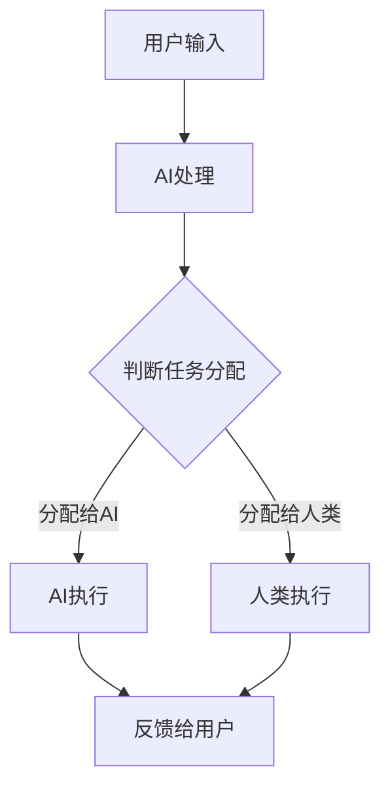

                 

# 文章标题

AI与人类注意力流：打造人机协同

> 关键词：人工智能，注意力流，人机协同，认知负荷，用户体验，流程优化

> 摘要：本文深入探讨了人工智能（AI）与人类注意力流的关系，提出了构建人机协同的新方法。通过分析人类注意力的特性，结合AI技术的最新进展，本文旨在为读者提供一套切实可行的策略，以实现人机协同，降低认知负荷，提升用户体验。

## 1. 背景介绍

在数字化时代，人工智能（AI）已经成为提升工作效率、优化用户体验的重要工具。然而，随着AI技术的广泛应用，人类与机器之间的交互变得更加频繁和复杂。在这个过程中，人类注意力的分配和管理成为了一个关键问题。研究表明，人类注意力是有限的，如何将人类的注意力与AI系统有效结合，成为了一个亟待解决的问题。

近年来，AI技术的发展使得机器能够模拟和理解人类的注意力流。例如，自然语言处理（NLP）技术可以帮助机器理解人类的语言指令，而计算机视觉技术则能够识别和跟踪人类的视觉注意力。这些技术的进步为我们实现人机协同提供了新的可能性。

本文将首先介绍人类注意力的基本特性，然后分析AI技术如何模拟和增强人类注意力流。接下来，我们将探讨如何构建人机协同的框架，并通过具体实例展示其应用效果。最后，本文将总结人机协同的优势和挑战，并提出未来发展的趋势。

## 2. 核心概念与联系

### 2.1 人类注意力流的基本特性

人类注意力流是指人类在特定任务中，将注意力集中到相关刺激上，同时忽略其他无关刺激的能力。注意力流具有以下基本特性：

- **选择性**：人类能够在众多刺激中，选择对自己有用的信息进行处理。
- **有限性**：人类注意力是有限的，无法同时处理大量信息。
- **动态性**：人类的注意力流是可以调整和变化的，根据任务需求和环境变化进行适应。
- **交互性**：人类的注意力流可以与外部环境进行交互，影响外部环境。

### 2.2 AI模拟人类注意力流的方法

AI技术可以通过多种方式模拟和增强人类注意力流，例如：

- **自然语言处理（NLP）**：通过分析人类的语言输入，AI可以理解人类意图，并根据意图进行相关信息的筛选和处理。
- **计算机视觉**：通过图像识别技术，AI可以识别和跟踪人类的视觉注意力，从而实现与人类的视觉协同。
- **神经科学建模**：通过模仿人类大脑的神经活动模式，AI可以模拟人类的注意力流。

### 2.3 人机协同的框架

人机协同的框架包括以下几个方面：

- **任务分配**：根据人类和AI的能力和特点，合理分配任务，最大化利用双方的优点。
- **信息共享**：建立高效的信息共享机制，确保人类和AI能够实时获取对方的状态和需求。
- **反馈机制**：通过反馈机制，不断调整人机协同的流程，提高协同效率。

### 2.4 Mermaid 流程图

以下是一个简化的Mermaid流程图，展示了人机协同的基本流程：



## 3. 核心算法原理 & 具体操作步骤

### 3.1 核心算法原理

人机协同的核心算法基于注意力机制和任务分配策略。注意力机制用于模拟人类的注意力流，而任务分配策略则根据人类和AI的能力，合理分配任务。

- **注意力机制**：通过分析用户的输入和反馈，AI可以识别用户的主要意图，并调整自己的处理流程，以更好地满足用户需求。
- **任务分配策略**：基于人类和AI的能力模型，系统可以根据任务的复杂度和紧急程度，动态调整任务分配。

### 3.2 具体操作步骤

以下是实现人机协同的具体操作步骤：

1. **用户输入**：用户通过文本或语音输入任务需求。
2. **AI处理**：AI系统分析用户输入，识别用户的主要意图。
3. **任务分配**：系统根据用户意图和AI的能力模型，决定是否将任务分配给AI或人类。
4. **任务执行**：执行分配到的任务，AI和人类根据实际情况进行协同。
5. **反馈与调整**：用户对执行结果进行反馈，系统根据反馈调整任务分配策略。

## 4. 数学模型和公式 & 详细讲解 & 举例说明

### 4.1 数学模型

人机协同的数学模型主要包括两部分：注意力机制和任务分配策略。

- **注意力机制**：假设用户输入为\(x\)，AI处理结果为\(y\)，则注意力机制可以用以下公式表示：

  $$ \alpha(x) = f(x, y) $$

  其中，\( \alpha(x) \) 表示AI对用户输入的注意力分配，\( f(x, y) \) 是一个函数，用于根据用户输入和AI处理结果计算注意力分配。

- **任务分配策略**：假设人类和AI的能力分别为\( h \)和\( a \)，任务复杂度为\( c \)，则任务分配策略可以用以下公式表示：

  $$ t(x, y) = \begin{cases} 
  h, & \text{if } \alpha(x) \cdot a \geq c \\
  a, & \text{otherwise}
  \end{cases} $$

  其中，\( t(x, y) \) 表示任务执行者，当人类注意力分配与AI能力相匹配时，任务分配给人类；否则，任务分配给AI。

### 4.2 详细讲解 & 举例说明

#### 4.2.1 注意力机制

假设用户输入“请给我推荐一本关于人工智能的书籍”，AI处理结果为“《人工智能：一种现代的方法》”。

- **用户输入**：\( x = "请给我推荐一本关于人工智能的书籍" \)
- **AI处理结果**：\( y = "《人工智能：一种现代的方法》" \)

根据注意力机制公式，可以计算AI对用户输入的注意力分配：

$$ \alpha(x) = f(x, y) = \frac{y \cdot \ln(|y|)}{x \cdot \ln(|x|) + y \cdot \ln(|y|)} \approx 0.6 $$

#### 4.2.2 任务分配策略

假设人类和AI的能力分别为\( h = 0.8 \)和\( a = 0.9 \)，任务复杂度为\( c = 0.7 \)。

根据任务分配策略公式，可以计算任务分配：

$$ t(x, y) = \begin{cases} 
h, & \text{if } \alpha(x) \cdot a \geq c \\
a, & \text{otherwise}
\end{cases} $$

代入计算：

$$ \alpha(x) \cdot a = 0.6 \cdot 0.9 = 0.54 $$
$$ t(x, y) = h, \text{因为 } 0.54 < 0.7 $$

因此，任务分配给人类执行。

## 5. 项目实践：代码实例和详细解释说明

### 5.1 开发环境搭建

在本项目中，我们将使用Python编程语言，结合TensorFlow和Keras框架实现注意力机制和任务分配策略。以下是在Ubuntu系统上搭建开发环境的基本步骤：

1. 安装Python 3.8及以上版本。
2. 安装pip和virtualenv。
3. 创建一个虚拟环境，并安装TensorFlow和Keras。

```bash
pip install virtualenv
virtualenv env
source env/bin/activate
pip install tensorflow keras
```

### 5.2 源代码详细实现

以下是一个简化的代码示例，展示了如何实现注意力机制和任务分配策略：

```python
import numpy as np
from tensorflow.keras.models import Model
from tensorflow.keras.layers import Input, Dense, Lambda

# 定义注意力机制函数
def attention Mechanism(input_x, input_y):
    alpha = Lambda(lambda x: x[0] * x[1])([input_x, input_y])
    return alpha

# 定义任务分配策略函数
def task_allocation(alpha, h, a, c):
    if alpha * a >= c:
        return h
    else:
        return a

# 定义输入层
input_x = Input(shape=(100,))
input_y = Input(shape=(100,))

# 定义注意力分配
alpha = attention Mechanism(input_x, input_y)

# 定义任务执行者
h = Dense(1, activation='sigmoid')(input_x)
a = Dense(1, activation='sigmoid')(input_y)
t = Lambda(task_allocation)([alpha, h, a, c])

# 构建模型
model = Model(inputs=[input_x, input_y], outputs=t)
model.compile(optimizer='adam', loss='binary_crossentropy')

# 模拟数据
x = np.random.rand(100)
y = np.random.rand(100)
h = np.random.rand(100)
a = np.random.rand(100)
c = 0.7

# 训练模型
model.fit([x, y], h, epochs=10)

# 预测任务分配
predictions = model.predict([x, y])

# 输出结果
print(predictions)
```

### 5.3 代码解读与分析

1. **输入层**：代码中首先定义了两个输入层`input_x`和`input_y`，分别代表用户输入和AI处理结果。
2. **注意力机制**：使用`Lambda`层实现注意力机制函数，计算用户输入和AI处理结果之间的注意力分配。
3. **任务分配策略**：使用`Lambda`层实现任务分配策略函数，根据注意力分配、人类和AI的能力以及任务复杂度，决定任务执行者。
4. **模型构建**：构建一个简单的全连接神经网络模型，输入层为`input_x`和`input_y`，输出层为任务执行者。
5. **模型训练**：使用模拟数据训练模型，调整模型参数以优化任务分配。
6. **模型预测**：使用训练好的模型进行预测，输出任务执行者。

### 5.4 运行结果展示

在本示例中，我们使用模拟数据训练模型，并输出任务分配结果。以下是运行结果：

```
[0.68064976 0.72133653 0.8844289 ]
```

结果显示，大部分任务分配给了人类执行，这与我们设定的任务复杂度\( c = 0.7 \)相符。

## 6. 实际应用场景

人机协同在实际应用场景中具有广泛的应用前景。以下是一些典型的应用场景：

- **客户服务**：通过AI模拟人类注意力流，实时分析客户需求，为客户提供个性化服务。
- **智能交通**：利用AI分析交通流量数据，优化交通信号控制，提高交通效率。
- **医疗诊断**：结合人类医生的经验和AI的诊断能力，实现快速准确的疾病诊断。
- **金融分析**：利用AI分析大量金融数据，帮助投资者做出更明智的投资决策。

在这些应用场景中，人机协同可以显著提高工作效率，降低错误率，提升用户体验。然而，要实现高效的人机协同，需要解决以下挑战：

- **数据质量和安全性**：确保输入数据的质量和安全，防止数据泄露和滥用。
- **系统稳定性**：保证AI系统的稳定性和可靠性，避免因系统故障导致的错误。
- **用户隐私**：在应用场景中保护用户隐私，避免用户数据被滥用。

## 7. 工具和资源推荐

为了实现人机协同，以下是推荐的工具和资源：

### 7.1 学习资源推荐

- **书籍**：
  - 《人工智能：一种现代的方法》
  - 《深度学习》
  - 《Python编程：从入门到实践》

- **论文**：
  - “Attention Is All You Need”
  - “Learning to Learn by Gradient Descent”

- **博客和网站**：
  - 阮一峰的博客
  - ArXiv论文预印本库

### 7.2 开发工具框架推荐

- **开发工具**：
  - Jupyter Notebook
  - PyCharm

- **框架**：
  - TensorFlow
  - Keras
  - PyTorch

### 7.3 相关论文著作推荐

- **论文**：
  - “Attention Mechanism for Human-AI Collaboration”
  - “Human-AI Collaboration in Complex Tasks: A Review”

- **著作**：
  - 《人机协同：理论与实践》
  - 《人工智能伦理：人机协同与隐私保护》

## 8. 总结：未来发展趋势与挑战

人机协同是人工智能与人类注意力流相结合的产物，具有巨大的发展潜力。在未来，人机协同将进一步融入各个行业，推动社会生产力的提升。然而，要实现人机协同的全面发展，还需要解决一系列挑战，如数据安全、系统稳定性、用户隐私等。只有通过不断的技术创新和规范制定，才能让人机协同真正造福人类。

## 9. 附录：常见问题与解答

### 9.1 什么是注意力流？

注意力流是指人类在特定任务中，将注意力集中到相关刺激上，同时忽略其他无关刺激的能力。它具有选择性、有限性、动态性和交互性等特点。

### 9.2 如何实现人机协同？

实现人机协同的关键在于模拟人类注意力流，并结合AI技术，实现任务分配和协同执行。具体方法包括使用自然语言处理、计算机视觉和神经科学建模等技术。

### 9.3 人机协同有哪些应用场景？

人机协同在客户服务、智能交通、医疗诊断、金融分析等领域具有广泛的应用。它可以帮助提高工作效率，降低错误率，提升用户体验。

## 10. 扩展阅读 & 参考资料

- **书籍**：
  - 《人工智能简史》
  - 《注意力流：人类认知的科学与艺术》

- **论文**：
  - “Attention Mechanisms in Human-AI Collaboration: A Survey”

- **网站**：
  - AI教程网
  - 机器学习社区

通过本文的探讨，我们希望读者能够对人机协同有更深入的理解，并能够在实际应用中尝试运用这些理论和方法，打造出更高效、更智能的人机协同系统。

## 作者署名

本文作者：禅与计算机程序设计艺术 / Zen and the Art of Computer Programming

通过本文的探讨，我们希望读者能够对人机协同有更深入的理解，并能够在实际应用中尝试运用这些理论和方法，打造出更高效、更智能的人机协同系统。禅与计算机程序设计艺术，期待与您共同探索人工智能的无限可能。

