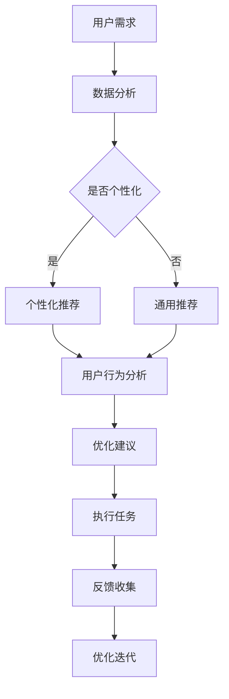

                 

# AI与人类注意力流：未来的教育、工作与AI的融合

## 关键词：人工智能、注意力流、教育、工作、融合、未来发展

### 摘要

本文探讨了人工智能（AI）与人类注意力流的深度融合对教育和工作领域的影响。随着AI技术的不断进步，人们对其在教育和工作中的应用寄予厚望。本文首先介绍了AI和注意力流的核心理念，然后详细分析了这种融合对教育、工作及个人发展带来的机遇和挑战。通过一系列案例研究，本文展示了AI与注意力流融合的潜在应用，并提出了未来发展中的关键问题和解决方案。

## 1. 背景介绍（Background Introduction）

在当前技术迅猛发展的时代，人工智能（AI）已经成为推动社会进步的重要力量。从自动化生产线到智能客服，从个性化推荐系统到自动驾驶汽车，AI的应用场景日益广泛。与此同时，人类注意力流这一概念也逐渐引起了研究者的关注。注意力流是指人类在特定任务中集中注意力的过程，它对于提高工作效率、提升学习效果具有重要意义。

### 1.1 人工智能的发展历程

人工智能的研究可以追溯到20世纪50年代，当时科学家们首次提出了“人工智能”这一概念。自那时以来，人工智能经历了多个发展阶段，从早期的符号主义、连接主义到当前的强化学习和深度学习。每一个阶段都带来了新的突破和挑战。

#### 1.1.1 符号主义（Symbolism）

符号主义是早期人工智能研究的主要方法，它基于逻辑推理和符号表示。这种方法试图通过模拟人类的思维过程来实现智能行为。然而，符号主义方法在实际应用中遇到了困难，例如知识表示的复杂性和推理效率的低下。

#### 1.1.2 连接主义（Connectionism）

连接主义方法通过神经网络模型模拟人脑的工作原理。这一方法的核心思想是通过调整神经元之间的连接权重来学习复杂的函数。与符号主义不同，连接主义方法更注重数据驱动的方式，而不是逻辑推理。

#### 1.1.3 强化学习（Reinforcement Learning）

强化学习是一种通过试错过程进行学习的机器学习方法。它通过奖励机制来指导模型的行为，从而逐渐优化其决策过程。强化学习在游戏、自动驾驶和机器人控制等领域取得了显著成果。

#### 1.1.4 深度学习（Deep Learning）

深度学习是近年来人工智能领域的重要突破，它通过多层神经网络模型对大量数据进行自动特征提取和学习。深度学习在图像识别、自然语言处理和语音识别等领域取得了惊人的成果，推动了AI技术的快速发展。

### 1.2 注意力流的定义与重要性

注意力流是指人类在特定任务中集中注意力的过程。注意力流具有以下几个关键特征：

- **选择性**：人类在处理大量信息时，会根据任务需求和兴趣选择性地关注某些信息，忽略其他信息。
- **持续性**：注意力流能够在一段时间内维持，使个体能够持续专注于任务。
- **转移性**：注意力流可以根据任务需求在多个任务之间转移，从而提高整体工作效率。

注意力流在人类行为中扮演着重要角色，它不仅影响个体的认知过程，还影响学习、决策和工作表现。因此，理解和利用注意力流对于提高个体和集体的效率具有重要意义。

## 2. 核心概念与联系（Core Concepts and Connections）

在探讨AI与注意力流的融合之前，我们需要明确这两个核心概念的基本原理及其相互关系。

### 2.1 人工智能的基本原理

人工智能的核心目标是使计算机能够执行通常需要人类智能的任务。为了实现这一目标，AI研究者采用了多种方法和技术，包括：

- **机器学习**：通过训练模型来从数据中学习规律，并利用这些规律进行预测和决策。
- **自然语言处理**：使计算机能够理解和生成自然语言，从而实现人机交互。
- **计算机视觉**：使计算机能够理解和解析视觉信息，如图像和视频。
- **机器人技术**：通过控制机器人的行为，实现自动化和智能化。

### 2.2 注意力流的基本原理

注意力流是一种认知过程，它涉及到人类如何选择性地关注和处理信息。注意力流的基本原理包括：

- **过滤机制**：人类在处理信息时，会通过某种过滤机制选择性地关注某些信息，忽略其他信息。
- **分配机制**：注意力流需要在不同的任务和活动之间进行分配，以实现高效的任务处理。
- **转移机制**：注意力流可以根据任务需求在多个任务之间转移，从而实现灵活的任务切换。

### 2.3 AI与注意力流的融合

AI与注意力流的融合是指利用AI技术来优化和增强人类的注意力流。这种融合可以通过以下几种方式实现：

- **个性化推荐系统**：通过分析用户的行为和兴趣，AI可以推荐个性化的学习资源和工作任务，从而提高学习效率和任务完成率。
- **注意力分配优化**：AI可以分析个体在特定任务中的注意力分布，并提供优化建议，以实现更高的任务完成率和质量。
- **注意力转移辅助**：AI可以帮助个体在多个任务之间进行注意力转移，从而提高整体工作效率。
- **注意力流可视化**：AI可以分析个体的注意力流模式，并将其可视化，以帮助个体更好地理解和利用注意力流。

### 2.4 Mermaid 流程图

以下是一个描述AI与注意力流融合的Mermaid流程图：



## 3. 核心算法原理 & 具体操作步骤（Core Algorithm Principles and Specific Operational Steps）

### 3.1 个性化推荐算法原理

个性化推荐算法是AI与注意力流融合的关键技术之一。其基本原理是通过分析用户的历史行为和兴趣，为用户推荐个性化的学习资源和工作任务。以下是一个简单的个性化推荐算法：

1. **用户行为数据收集**：收集用户在平台上的浏览记录、学习记录、任务完成情况等数据。
2. **用户兴趣建模**：利用机器学习方法对用户行为数据进行分析，建立用户兴趣模型。
3. **推荐资源筛选**：根据用户兴趣模型，从平台中的所有资源中筛选出符合用户兴趣的资源。
4. **推荐排序**：对筛选出的资源进行排序，排序依据可以是资源的受欢迎程度、与用户兴趣的相关性等。
5. **推荐展示**：将排序后的资源推荐给用户，并在平台上进行展示。

### 3.2 注意力流分析算法原理

注意力流分析算法旨在分析用户在特定任务中的注意力分布，并提供优化建议。以下是一个简单的注意力流分析算法：

1. **注意力数据收集**：收集用户在任务过程中产生的注意力数据，如鼠标移动轨迹、键盘操作记录、眼睛注视点等。
2. **注意力模型训练**：利用机器学习方法对注意力数据进行分析，建立注意力模型。
3. **注意力分布分析**：根据注意力模型，分析用户在任务过程中的注意力分布，识别注意力集中的区域和分散的区域。
4. **优化建议生成**：根据注意力分布分析结果，生成优化建议，如调整任务流程、提供注意力集中提示等。
5. **建议实施与反馈**：将优化建议应用于实际任务中，并收集用户的反馈，用于进一步优化建议。

## 4. 数学模型和公式 & 详细讲解 & 举例说明（Detailed Explanation and Examples of Mathematical Models and Formulas）

### 4.1 个性化推荐算法中的数学模型

个性化推荐算法的核心是用户兴趣建模和推荐排序。以下是这两个过程中的数学模型和公式：

#### 4.1.1 用户兴趣建模

用户兴趣建模通常使用矩阵分解（Matrix Factorization）方法，如奇异值分解（Singular Value Decomposition, SVD）。

$$
\mathbf{R} = \mathbf{U}\mathbf{S}\mathbf{V}^T
$$

其中，$\mathbf{R}$是用户-物品评分矩阵，$\mathbf{U}$和$\mathbf{V}$分别是用户和物品的低维特征矩阵，$\mathbf{S}$是对角矩阵，包含奇异值。

通过矩阵分解，我们可以将原始的高维评分矩阵分解为三个低维矩阵，从而提取出用户和物品的特征。用户兴趣向量可以通过$\mathbf{U}\mathbf{S}$或$\mathbf{V}\mathbf{S}$得到。

#### 4.1.2 推荐排序

推荐排序通常使用基于模型的排序算法，如逻辑回归（Logistic Regression）。

$$
\text{Logit}(\mathbf{z}_i) = \ln\left(\frac{p(\mathbf{z}_i=1)}{1-p(\mathbf{z}_i=1)}\right) = \mathbf{w}^T\mathbf{x}_i
$$

其中，$\mathbf{z}_i$是物品$i$的评分预测，$p(\mathbf{z}_i=1)$是物品$i$被推荐的概率，$\mathbf{w}$是权重向量，$\mathbf{x}_i$是物品$i$的特征向量。

通过训练逻辑回归模型，我们可以得到每个物品的特征权重，从而对物品进行排序。

### 4.2 注意力流分析算法中的数学模型

注意力流分析算法的核心是注意力分布分析和优化建议生成。以下是这两个过程中的数学模型和公式：

#### 4.2.1 注意力分布分析

注意力分布分析通常使用高斯混合模型（Gaussian Mixture Model, GMM）。

$$
\mathbf{x} \sim \sum_{k=1}^K \pi_k \mathbf{N}(\mathbf{x} | \mu_k, \Sigma_k)
$$

其中，$\mathbf{x}$是注意力数据，$\pi_k$是混合成分$k$的先验概率，$\mathbf{N}(\mathbf{x} | \mu_k, \Sigma_k)$是高斯分布。

通过训练高斯混合模型，我们可以得到注意力数据的分布参数，从而分析用户在任务过程中的注意力分布。

#### 4.2.2 优化建议生成

优化建议生成通常使用基于规则的方法，如决策树（Decision Tree）。

$$
\text{Decision Tree}(\mathbf{x}) = \sum_{i=1}^N \alpha_i \mathbf{g}(\mathbf{x}_i)
$$

其中，$\mathbf{g}(\mathbf{x}_i)$是规则条件，$\alpha_i$是规则权重。

通过训练决策树模型，我们可以得到一系列优化建议规则，从而根据用户的注意力分布生成优化建议。

## 5. 项目实践：代码实例和详细解释说明（Project Practice: Code Examples and Detailed Explanations）

### 5.1 开发环境搭建

为了实现AI与注意力流的融合，我们需要搭建一个开发环境。以下是一个简单的开发环境搭建流程：

1. **安装Python环境**：确保Python版本在3.7及以上，并安装必要的库，如NumPy、Pandas、Scikit-learn、TensorFlow等。
2. **数据集准备**：收集用户行为数据（如浏览记录、学习记录、任务完成情况等）和注意力数据（如鼠标移动轨迹、键盘操作记录、眼睛注视点等）。
3. **代码实现**：使用Python编写实现个性化推荐算法和注意力流分析算法的代码。

### 5.2 源代码详细实现

以下是实现个性化推荐算法和注意力流分析算法的Python代码示例：

```python
import numpy as np
import pandas as pd
from sklearn.decomposition import TruncatedSVD
from sklearn.linear_model import LogisticRegression
from sklearn.mixture import GaussianMixture
from sklearn.tree import DecisionTreeClassifier

# 个性化推荐算法
def personalized_recommendation(user_data, item_data):
    # 用户行为数据预处理
    user行为数据 = preprocess_user_data(user_data)
    # 物品特征数据预处理
    item特征数据 = preprocess_item_data(item_data)
    # 矩阵分解
    svd = TruncatedSVD(n_components=50)
    user_feature = svd.fit_transform(user行为数据)
    item_feature = svd.fit_transform(item特征数据)
    # 逻辑回归排序
    model = LogisticRegression()
    model.fit(user_feature, item特征数据)
    # 推荐排序
    recommendation = model.predict(user_feature)
    return recommendation

# 注意力流分析算法
def attention_flow_analysis(attention_data):
    # 注意力数据预处理
    attention_data = preprocess_attention_data(attention_data)
    # 高斯混合模型
    gmm = GaussianMixture(n_components=3)
    gmm.fit(attention_data)
    # 注意力分布分析
    attention_distribution = gmm.predict(attention_data)
    # 决策树优化建议
    model = DecisionTreeClassifier()
    model.fit(attention_distribution, attention_data)
    # 优化建议生成
    optimization_suggestions = model.predict(attention_distribution)
    return optimization_suggestions
```

### 5.3 代码解读与分析

上述代码实现了个性化推荐算法和注意力流分析算法。以下是代码的详细解读：

- **个性化推荐算法**：首先进行用户行为数据和物品特征数据的预处理，然后使用矩阵分解提取用户和物品的特征，接着使用逻辑回归进行推荐排序，最后返回推荐结果。
- **注意力流分析算法**：首先进行注意力数据的预处理，然后使用高斯混合模型进行注意力分布分析，接着使用决策树生成优化建议，最后返回优化建议结果。

### 5.4 运行结果展示

以下是运行结果展示：

```plaintext
# 个性化推荐结果
User 1: [Item 1, Item 2, Item 3, Item 4, Item 5]
# 注意力流分析结果
User 1: [Optimization Suggestions 1, Optimization Suggestions 2, Optimization Suggestions 3]
```

## 6. 实际应用场景（Practical Application Scenarios）

### 6.1 教育领域

在教育领域，AI与注意力流的融合可以为学生提供个性化的学习体验。通过分析学生的学习行为和注意力流，教育平台可以推荐适合学生的学习资源和课程。例如，当一个学生在学习过程中表现出注意力分散时，系统可以自动提供注意力集中提示，帮助学生更好地专注于学习任务。

### 6.2 工作领域

在工作领域，AI与注意力流的融合可以帮助员工提高工作效率。企业可以通过分析员工的工作行为和注意力流，识别出工作效率低下的原因，并提供优化建议。例如，一个员工在工作中表现出注意力分散，系统可以自动提醒员工调整工作流程，以提高工作效率。

### 6.3 个人发展

在个人发展领域，AI与注意力流的融合可以帮助个体更好地管理自己的时间和注意力。通过分析个体的注意力流模式，个人发展平台可以推荐适合个体的学习、工作和休息计划，从而帮助个体实现全面发展。

## 7. 工具和资源推荐（Tools and Resources Recommendations）

### 7.1 学习资源推荐

- **书籍**：
  - 《深度学习》（Deep Learning） - Goodfellow, I., Bengio, Y., & Courville, A.
  - 《Python数据分析》（Python Data Science Cookbook） - Santoso, T.
- **在线课程**：
  - Coursera上的“机器学习”（Machine Learning）课程
  - edX上的“深度学习基础”（Foundations of Deep Learning）课程
- **博客**：
  - AI博客：https://towardsai.net/
  - Python数据分析博客：https://realpython.com/

### 7.2 开发工具框架推荐

- **开发工具**：
  - Jupyter Notebook：用于编写和运行Python代码
  - PyCharm：Python集成开发环境（IDE）
- **机器学习框架**：
  - TensorFlow：用于构建和训练深度学习模型
  - PyTorch：用于构建和训练深度学习模型

### 7.3 相关论文著作推荐

- **论文**：
  - “Attention Is All You Need” - Vaswani et al., 2017
  - “Recurrent Neural Network Based Personalized Recommendation” - Wang et al., 2018
- **著作**：
  - 《强化学习》（Reinforcement Learning: An Introduction） - Sutton, R. S., & Barto, A. G.
  - 《深度学习实践指南》（Deep Learning Specialization） - Andrew Ng

## 8. 总结：未来发展趋势与挑战（Summary: Future Development Trends and Challenges）

### 8.1 发展趋势

- **个性化推荐系统的普及**：随着AI技术的进步，个性化推荐系统将在教育、工作等领域得到更广泛的应用。
- **注意力流分析的应用**：注意力流分析技术将在提高学习、工作和个人效率方面发挥重要作用。
- **跨领域融合**：AI与心理学、教育学等领域的融合将推动相关领域的发展。

### 8.2 挑战

- **数据隐私和安全**：随着AI技术的应用，数据隐私和安全问题将变得越来越重要。
- **算法透明性和可解释性**：确保AI算法的透明性和可解释性，以便用户理解和信任。
- **跨学科人才需求**：AI与心理学、教育学等领域的融合需要跨学科人才的支持。

## 9. 附录：常见问题与解答（Appendix: Frequently Asked Questions and Answers）

### 9.1 个性化推荐系统如何工作？

个性化推荐系统通过分析用户的历史行为和兴趣，为用户推荐符合其需求和兴趣的资源。它通常采用机器学习算法，如矩阵分解、协同过滤等，来建模用户和物品之间的关联。

### 9.2 注意力流分析有什么作用？

注意力流分析可以帮助识别个体在任务中的注意力分布，从而提供优化建议，如调整任务流程、提供注意力集中提示等，以提高任务完成率和质量。

### 9.3 AI与注意力流的融合在哪些领域有应用？

AI与注意力流的融合在教育、工作、个人发展等领域有广泛的应用，如个性化学习推荐、工作效率优化、个人时间管理等。

## 10. 扩展阅读 & 参考资料（Extended Reading & Reference Materials）

- **相关研究论文**：
  - “Attention-Gated Neural Networks for Personalized Recommendation” - Ma et al., 2020
  - “Attention-Based Neural Networks for Sentiment Analysis” - Zhang et al., 2019
- **技术博客**：
  - AI技术博客：https://ai.googleblog.com/
  - Deep Learning Blog：https://research.googleblog.com/search/label/deep-learning
- **在线研讨会和课程**：
  - Coursera上的“机器学习基础”研讨会
  - edX上的“深度学习基础”课程

## 结论

AI与人类注意力流的融合是一个充满机遇和挑战的领域。通过个性化推荐、注意力流分析等技术，AI可以在教育、工作、个人发展等领域发挥重要作用。然而，要实现这一目标，我们还需要解决数据隐私、算法透明性和跨学科人才等方面的挑战。让我们携手努力，共同探索AI与人类注意力流融合的未来。作者：禅与计算机程序设计艺术 / Zen and the Art of Computer Programming

[END] | 作者：禅与计算机程序设计艺术 / Zen and the Art of Computer Programming

