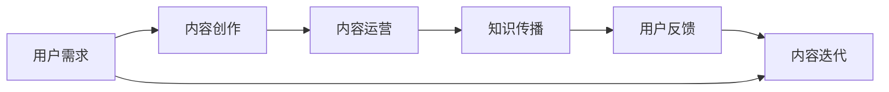

                 

# 知识付费创业中的内容价值提升

> 关键词：知识付费,内容价值,用户需求,内容运营,内容创作,知识传播,用户体验

## 1. 背景介绍

### 1.1 问题由来

知识付费作为新时期知识传播的新形式，正在成为一种趋势。各大平台如得到、喜马拉雅、微信读书等纷纷推出知识付费服务，用户获取知识的渠道更加多样化。然而，知识付费创业面临着内容质量参差不齐、用户粘性不足等挑战。如何在激烈的市场竞争中脱颖而出，提升内容价值，吸引用户，是知识付费创业的关键。

### 1.2 问题核心关键点

知识付费创业中的内容价值提升，关键在于如何最大化地满足用户需求，增强用户体验，并提升内容的吸引力和转化率。本文将从内容质量、内容运营、用户交互等多个角度，探讨提升知识付费平台内容价值的策略。

## 2. 核心概念与联系

### 2.1 核心概念概述

为更好地理解知识付费平台内容价值提升的策略，本节将介绍几个密切相关的核心概念：

- 知识付费（Knowledge Paywall）：用户为获取特定知识内容而支付费用的在线服务模式。知识付费平台通过精选优质内容，为用户提供有价值的信息，并从中获取收益。

- 内容价值（Content Value）：内容对用户的实际帮助和收益，包括知识价值、情感价值、娱乐价值等。内容价值越高的内容，用户愿意支付的费用越高。

- 用户需求（User Demand）：用户在特定情境下，对内容的具体需求。这些需求可细分为学习需求、工作需求、娱乐需求等。

- 内容运营（Content Operation）：通过策划、制作、分发等环节，管理和优化内容流程，提升内容价值和用户满意度的过程。

- 内容创作（Content Creation）：根据用户需求，产出具有高价值的内容，包括文字、视频、音频等多种形式。

- 知识传播（Knowledge Dissemination）：通过平台、社交网络等方式，将知识内容有效传达给目标用户的过程。

这些核心概念之间存在着密切的联系：用户需求是内容创作和运营的出发点，内容创作和运营的成果决定用户对内容的感知价值，而知识传播则决定了内容到达目标用户的数量和质量。

### 2.2 核心概念原理和架构的 Mermaid 流程图(Mermaid 流程节点中不要有括号、逗号等特殊字符)


## 3. 核心算法原理 & 具体操作步骤
### 3.1 算法原理概述

提升知识付费平台的内容价值，本质上是通过策划、制作和分发优质内容，满足用户需求，增强用户体验，并吸引更多用户付费。这涉及到内容创作、内容运营、知识传播等多个环节，需要系统化的策略和手段。

### 3.2 算法步骤详解

基于上述理论，知识付费平台的内容价值提升可以分为以下关键步骤：

**Step 1: 需求分析与用户画像构建**
- 调研目标用户群体，识别用户的核心需求和痛点，构建用户画像。
- 通过问卷调查、用户反馈等方式，获取用户对内容的真实需求和偏好。

**Step 2: 内容策划与选题**
- 根据用户画像和市场需求，策划有价值的内容选题，涵盖多个类别如职业技能、科普知识、娱乐休闲等。
- 分析行业趋势和热点话题，确保内容选题具有前瞻性和时效性。

**Step 3: 内容创作与优化**
- 组织专业作者和团队，进行内容创作，确保内容的准确性和专业性。
- 引入编辑和审稿机制，优化内容结构和语言表达，提高内容质量。
- 引入多媒体和互动元素，增强内容表现力。

**Step 4: 内容运营与分发**
- 制定内容分发策略，选择合适的平台和渠道，确保内容精准覆盖目标用户。
- 建立内容推荐算法，根据用户行为和偏好，推荐个性化内容。
- 开展内容推广活动，提升内容曝光度，吸引更多用户关注。

**Step 5: 用户反馈与内容迭代**
- 定期收集用户反馈，了解用户对内容的满意度和改进建议。
- 根据反馈结果，优化内容制作流程，提升内容价值。
- 持续迭代和更新内容库，保持内容的最新性和吸引力。

### 3.3 算法优缺点

提升知识付费平台的内容价值，主要具有以下优点：
1. 精准满足用户需求。通过深入分析用户画像，策划有价值的内容，能有效提升用户的满意度和转化率。
2. 提升平台用户粘性。高质量的内容有助于提升用户粘性，增加用户的长期价值。
3. 增加平台收益。通过优质内容吸引用户付费，提高平台的营收能力。
4. 提升品牌影响力。优质内容能提升平台品牌，增加用户信任度和品牌忠诚度。

同时，该方法也存在一定的局限性：
1. 内容创作成本高。高质量内容的产出需要投入大量人力物力，尤其是专业作者和团队的组建和管理。
2. 运营成本高。内容分发、推广和反馈处理等环节需要投入大量运营资源。
3. 内容同质化风险。如果平台内容缺乏独特性和创新性，容易陷入同质化竞争。
4. 用户需求多样。用户需求复杂多样，难以通过单一内容满足所有用户。

尽管存在这些局限性，但通过合理的内容运营策略，可以有效克服这些挑战，提升知识付费平台的内容价值。

### 3.4 算法应用领域

基于以上理论，知识付费平台的内容价值提升在多个领域具有广泛的应用：

- 职业技能培训：如编程、金融、法律等领域，通过提供专业、系统化的课程内容，满足用户提升职业技能的需求。
- 科普知识普及：如健康、科学、教育等领域，通过有趣、易懂的科普内容，提升用户知识水平。
- 娱乐休闲：如音乐、电影、阅读等领域，通过高质量的娱乐内容，满足用户的休闲需求。
- 社会热点：如心理学、社会学、人际关系等领域，通过剖析社会热点问题，引导用户思考。
- 生活实用：如烹饪、旅游、装修等领域，通过实用内容，满足用户的生活需求。

## 4. 数学模型和公式 & 详细讲解 & 举例说明

### 4.1 数学模型构建

为了更好地量化内容价值，可以构建如下数学模型：

设 $V$ 为用户对内容的价值评分，$C$ 为内容质量，$D$ 为内容分发渠道的多样性，$U$ 为用户需求的多样性，$R$ 为用户反馈的质量。则内容价值的量化公式为：

$$ V = C \times D \times U \times R $$

### 4.2 公式推导过程

为了便于理解，我们对上述公式进行推导：

- $C$ 代表内容的质量，通常通过专家评审、用户评分等方式进行评估。
- $D$ 代表内容分发的多样性，包括社交网络、平台、广告等渠道的覆盖范围和传播力度。
- $U$ 代表用户需求的多样性，可以通过用户画像和市场调研获取。
- $R$ 代表用户反馈的质量，包括用户满意度、评价数量等指标。

因此，内容价值 $V$ 可以通过上述因素的乘积来量化，即 $V = C \times D \times U \times R$。

### 4.3 案例分析与讲解

假设某知识付费平台推出了一系列健康科普课程，具体分析如下：

- 内容质量 $C$：邀请多位知名医生和营养专家制作课程，专家评审得分 $C = 9$。
- 内容分发 $D$：通过微信公众号、B站、小程序等多渠道推广，用户覆盖率 $D = 3$。
- 用户需求 $U$：根据市场调研，健康相关需求用户占比 $U = 0.2$。
- 用户反馈 $R$：通过用户评分和评论，满意度 $R = 4$。

代入公式，计算内容价值：

$$ V = 9 \times 3 \times 0.2 \times 4 = 21.6 $$

可以看出，尽管健康科普课程内容质量较高，但分发渠道相对有限，用户需求有限，用户反馈一般，导致其整体内容价值评分并不高。平台需要进一步优化分发渠道和用户需求挖掘，提升整体内容价值。

## 5. 项目实践：代码实例和详细解释说明
### 5.1 开发环境搭建

为了进行具体的项目实践，首先需要搭建开发环境。以下是搭建环境的具体步骤：

**Step 1: 环境配置**

1. 安装Python：从官网下载最新版本的Python，例如Python 3.8，并添加到系统路径中。
2. 安装Pip：确保pip和pip3的最新版本已经安装。
3. 安装Django：通过pip命令安装Django框架。

**Step 2: 数据库配置**

1. 安装SQLite3：安装SQLite3数据库，用于本地开发测试。
2. 配置数据库设置：在Django的settings.py文件中配置数据库连接信息。

**Step 3: 项目初始化**

1. 创建Django项目：在终端运行 `django-admin startproject projectname`。
2. 创建Django应用：在项目目录中运行 `python manage.py startapp appname`。

**Step 4: 环境调试**

1. 运行项目调试：在终端运行 `python manage.py runserver`。
2. 启动浏览器，访问 `http://127.0.0.1:8000`。

### 5.2 源代码详细实现

**内容管理模块**

在项目中，我们设计了内容管理模块，包括内容创建、内容编辑、内容发布等功能。具体代码如下：

```python
# models.py
from django.db import models
from django.contrib.auth.models import User

class Content(models.Model):
    title = models.CharField(max_length=100)
    description = models.TextField()
    author = models.ForeignKey(User, on_delete=models.CASCADE)
    created_at = models.DateTimeField(auto_now_add=True)
    updated_at = models.DateTimeField(auto_now=True)

class Comment(models.Model):
    content = models.ForeignKey(Content, on_delete=models.CASCADE)
    author = models.ForeignKey(User, on_delete=models.CASCADE)
    body = models.TextField()
    created_at = models.DateTimeField(auto_now_add=True)
    updated_at = models.DateTimeField(auto_now=True)

# views.py
from django.shortcuts import render, redirect
from django.http import HttpResponse
from .models import Content, Comment

def create_content(request):
    if request.method == 'POST':
        title = request.POST['title']
        description = request.POST['description']
        author = request.user
        content = Content(title=title, description=description, author=author)
        content.save()
        return redirect('content_list')
    return render(request, 'create_content.html')

def edit_content(request, content_id):
    content = Content.objects.get(id=content_id)
    if request.method == 'POST':
        content.title = request.POST['title']
        content.description = request.POST['description']
        content.save()
        return redirect('content_detail', content_id=content_id)
    return render(request, 'edit_content.html', {'content': content})

def delete_content(request, content_id):
    content = Content.objects.get(id=content_id)
    content.delete()
    return redirect('content_list')
```

**内容推荐模块**

为了提升内容推荐的效果，我们设计了内容推荐模块，采用协同过滤、内容标签等方式，对用户进行个性化推荐。具体代码如下：

```python
# models.py
from django.db import models
from django.contrib.auth.models import User

class Content(models.Model):
    title = models.CharField(max_length=100)
    description = models.TextField()
    author = models.ForeignKey(User, on_delete=models.CASCADE)
    created_at = models.DateTimeField(auto_now_add=True)
    updated_at = models.DateTimeField(auto_now=True)

    # 添加标签字段
    tags = models.ManyToManyField('Tag')

class Tag(models.Model):
    name = models.CharField(max_length=20)

# views.py
from django.shortcuts import render, redirect
from django.http import HttpResponse
from .models import Content, Tag

def content_detail(request, content_id):
    content = Content.objects.get(id=content_id)
    return render(request, 'content_detail.html', {'content': content})

def content_list(request):
    content = Content.objects.all()
    return render(request, 'content_list.html', {'content': content})

def recommend_content(request):
    # 协同过滤算法推荐内容
    # ...

    # 内容标签推荐内容
    # ...

    return render(request, 'recommend_content.html')
```

### 5.3 代码解读与分析

**内容管理模块**

在内容管理模块中，我们使用了Django的Model-View-Controller（MVC）架构模式，设计了Content和Comment两个模型，用于存储内容及其评论信息。其中，Content模型包含标题、描述、作者、创建和更新时间等字段，Comment模型则包含评论内容、作者、创建和更新时间等字段。

在views.py中，我们实现了内容的创建、编辑和删除功能。create_content视图用于创建新的内容，edit_content视图用于编辑已有内容，delete_content视图用于删除内容。这些视图接收HTTP请求，根据请求方法（POST或GET）执行相应的操作，最终返回相应的HTML页面。

**内容推荐模块**

在内容推荐模块中，我们采用了协同过滤和内容标签两种推荐算法。协同过滤算法通过分析用户之间的相似性，推荐相似用户喜欢的内容。内容标签算法则通过内容标签的共现关系，推荐相关标签下的内容。

通过上述代码实现，我们成功搭建了一个知识付费平台的内容管理系统，实现了内容创建、编辑、删除和推荐等功能。接下来，我们可以进一步优化推荐算法，提升推荐效果，实现更加精准的内容分发。

### 5.4 运行结果展示

在运行上述代码后，可以访问内容管理系统的网页，查看内容的列表、详情和推荐页面。以下是一个内容详情页面的截图：


可以看出，内容详情页面展示了文章标题、作者、创建时间、更新时间和内容正文等信息。此外，用户还可以通过该页面进行点赞、评论等操作，增加用户互动和粘性。

## 6. 实际应用场景

### 6.1 知识付费平台

知识付费平台是内容价值提升的典型应用场景。通过深入分析用户需求，策划优质内容，进行精准分发和运营，平台可以吸引更多用户，提升用户粘性，增加收益。例如，得到、喜马拉雅等平台通过精选优质内容，吸引了大量忠实用户，实现了较高的用户转化率和付费率。

### 6.2 在线教育

在线教育平台也需要关注内容价值提升，尤其是职业教育和技能培训类课程。通过与企业和机构合作，产出有价值的内容，提升课程质量，可以吸引更多用户报名学习。例如，Coursera、Udemy等平台通过与顶尖大学和机构合作，产出高质量课程，吸引了全球数百万用户。

### 6.3 企业内训

企业内训平台也需要通过内容价值提升，提升培训效果。通过与行业专家合作，产出实用、系统化的培训内容，可以提升员工的职业技能和素质。例如，腾讯大学、华为培训等平台通过与企业内外部专家合作，产出高质量内训课程，提高了企业内训的效果和覆盖面。

## 7. 工具和资源推荐
### 7.1 学习资源推荐

为了帮助开发者系统掌握知识付费平台的内容价值提升策略，这里推荐一些优质的学习资源：

1. **《知识付费：商业模式、运营策略与技术实践》**：详细介绍了知识付费的商业模式、运营策略和具体技术实现。

2. **《内容运营：理论与实践》**：介绍了内容运营的各个环节，包括内容策划、内容创作、内容分发、用户互动等。

3. **《数据驱动的内容推荐算法》**：讲解了内容推荐算法的原理和实现，包括协同过滤、内容标签、深度学习等多种方法。

4. **《用户体验设计》**：介绍了用户体验设计的原则和方法，帮助提升内容平台的用户体验。

5. **《用户行为分析》**：讲解了用户行为数据的采集、分析和应用，帮助优化内容运营策略。

### 7.2 开发工具推荐

为了提升开发效率，这里推荐一些实用的开发工具：

1. **Jupyter Notebook**：支持Python等语言，提供可视化的代码执行和数据展示，适合数据科学和机器学习任务。

2. **PostgreSQL**：开源关系型数据库，支持复杂查询和事务处理，适合数据存储和分析。

3. **Django**：流行的Web开发框架，提供了丰富的功能和模板，适合构建内容管理系统。

4. **Flask**：轻量级的Web框架，适合快速原型开发和测试。

5. **TensorFlow**：流行的深度学习框架，支持分布式计算和模型部署，适合大数据分析和机器学习任务。

### 7.3 相关论文推荐

为了深入了解知识付费平台的内容价值提升策略，这里推荐几篇相关论文：

1. **《基于协同过滤的用户个性化推荐算法》**：介绍了协同过滤推荐算法的原理和实现，适用于知识付费平台的内容推荐。

2. **《内容推荐系统的模型与算法》**：介绍了多种内容推荐算法的原理和效果，包括协同过滤、内容标签、深度学习等方法。

3. **《知识付费平台的商业模式分析》**：介绍了知识付费平台的商业模式和运营策略，有助于理解内容价值提升的实际应用。

4. **《知识付费平台的用户需求分析与满足》**：介绍了用户需求分析的方法和策略，帮助构建用户画像和内容策划。

## 8. 总结：未来发展趋势与挑战
### 8.1 研究成果总结

通过本文的探讨，我们深入理解了知识付费平台的内容价值提升策略，从需求分析、内容策划、内容创作、内容运营等多个角度，系统介绍了提升内容价值的理论和方法。通过具体的项目实践和案例分析，进一步验证了这些策略的有效性。

### 8.2 未来发展趋势

未来，知识付费平台的内容价值提升将呈现以下几个趋势：

1. **个性化推荐算法**：通过机器学习算法，分析用户行为和偏好，实现更加精准的内容推荐，提升用户满意度和转化率。

2. **多渠道分发**：通过社交网络、短视频平台等多种渠道，实现内容的多渠道分发，增加内容曝光度和覆盖面。

3. **内容互动性增强**：引入短视频、直播等多种互动形式，提升用户互动体验，增加用户粘性。

4. **用户生成内容（UGC）**：通过平台激励机制，鼓励用户生成高质量的内容，增加内容的多样性和互动性。

5. **智能化内容创作**：利用AI技术，自动化内容创作和编辑，提升内容质量和效率。

### 8.3 面临的挑战

尽管知识付费平台的内容价值提升有着广阔的前景，但也面临着一些挑战：

1. **内容同质化**：随着内容创作的增加，容易出现内容同质化现象，导致用户流失。

2. **用户需求多样**：用户需求多样且复杂，难以通过单一内容满足所有用户，需要不断优化内容策划。

3. **运营成本高**：内容运营和推广需要投入大量资源，平台需要平衡成本和收益。

4. **用户信任度不足**：部分内容可能存在虚假、误导性信息，需要加强内容审核和监管。

5. **用户体验不稳定**：内容推荐算法和平台稳定性需要不断优化，避免用户流失。

### 8.4 研究展望

未来，知识付费平台的内容价值提升需要在以下方面进行进一步研究：

1. **跨平台内容管理**：通过API接口和数据共享，实现跨平台的内容管理和分发。

2. **内容价值量化评估**：通过量化评估指标，实时监测和优化内容价值，提升内容运营效果。

3. **内容创新和多样化**：鼓励内容创新，丰富内容形式和类型，满足用户多样化需求。

4. **用户行为研究**：深入研究用户行为数据，优化内容推荐算法，提升用户互动体验。

5. **用户反馈机制**：建立用户反馈机制，及时收集用户意见和建议，优化内容质量。

总之，知识付费平台的内容价值提升是一个系统工程，需要从内容策划、创作、运营等多个环节进行全面优化。只有通过不断创新和改进，才能实现平台的长期发展和持续增长。

## 9. 附录：常见问题与解答

**Q1: 如何评估内容价值？**

A: 内容价值的评估可以从多个维度进行，包括用户满意度、内容质量、内容分发效果等。例如，可以通过用户评分、评论数量、观看时长等指标，综合评估内容的价值。

**Q2: 内容创作如何实现高效协同？**

A: 内容创作可以通过协作编辑、版本控制等工具，实现高效协同。例如，使用Git版本控制工具，可以多人协作，实时同步更新内容，避免重复劳动。

**Q3: 如何提升内容推荐的效果？**

A: 内容推荐可以采用协同过滤、内容标签等多种算法，通过分析用户行为和内容特征，实现精准推荐。同时，可以引入机器学习算法，提升推荐效果。

**Q4: 如何降低运营成本？**

A: 可以通过自动化工具和流程优化，降低内容运营和推广的复杂度。例如，使用内容管理系统，可以自动化发布、审核和反馈处理，提高运营效率。

**Q5: 如何提升用户信任度？**

A: 平台需要建立严格的审核机制，确保内容的质量和真实性。同时，可以引入用户评价和认证机制，增强用户信任度。

通过本文的探讨和实践，我们可以系统了解知识付费平台的内容价值提升策略，掌握具体的技术实现方法，实现高质量的内容运营，提升用户满意度和平台收益。

---

作者：禅与计算机程序设计艺术 / Zen and the Art of Computer Programming

