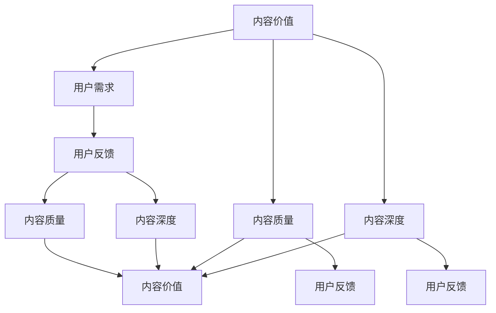

                 

# 知识付费创业中的内容价值评估体系

## 1. 背景介绍

### 1.1 问题由来
随着知识付费市场的兴起，内容创业成为了许多创业者的首选方向。然而，内容创业的成功不仅依赖于优质内容的生产，更依赖于对内容价值的科学评估。如何制定合理的内容价值评估体系，是每一个知识付费平台都面临的重要挑战。内容价值评估体系不仅决定了内容的价值，还直接影响到用户的购买决策和平台收益，是内容创业的基石。

### 1.2 问题核心关键点
内容价值评估的核心在于确定内容的付费价值，即内容对于用户的学习和工作的实际帮助。常见的问题包括：

1. 如何确定内容的质量和实用性？
2. 如何考虑内容的难度、深度、复杂度等特征？
3. 如何综合考虑用户反馈、阅读量、付费意愿等因素？
4. 如何平衡平台收益和用户需求？

这些问题需要从多个维度进行考量，构建一个全面的内容价值评估体系。

### 1.3 问题研究意义
构建科学合理的内容价值评估体系，对知识付费创业具有重要意义：

1. 优化内容生产：明确内容价值标准，指导内容创作者优化内容质量，提升用户满意度。
2. 精准定价：基于内容价值评估，合理定价，增加平台收益。
3. 提高用户粘性：高质量、有价值的内容能够更好地吸引用户，提高用户粘性和续费率。
4. 市场竞争：合理的评估体系有助于区分内容价值，提升平台的竞争力。

本文将从内容价值评估的核心概念出发，结合实际应用场景，构建一个适用于知识付费创业的内容价值评估体系。

## 2. 核心概念与联系

### 2.1 核心概念概述

构建内容价值评估体系，需要理解以下核心概念：

1. **内容价值**：内容对用户的学习和工作的实际帮助程度，包括知识的获取、技能的提升、解决问题的能力等。
2. **用户需求**：用户在学习、工作中的具体需求，包括兴趣、目标、时间、地点等。
3. **内容质量**：内容的清晰度、准确性、逻辑性、结构性等。
4. **内容深度**：内容的难易程度、覆盖深度、复杂度等。
5. **用户反馈**：用户对内容的评价、评分、评论等。

这些概念相互关联，共同构成了内容价值评估体系的基础。

### 2.2 核心概念原理和架构的 Mermaid 流程图



### 2.3 核心概念的联系

- **内容价值**：由**内容质量**和**内容深度**决定，同时受**用户需求**和**用户反馈**影响。
- **用户需求**：决定了内容生产和选择的方向，直接影响到内容价值。
- **内容质量**：直接影响用户对内容的感知，是内容价值的核心因素之一。
- **内容深度**：与用户的学习目标、时间成本等因素密切相关，影响内容的实用性和价值。
- **用户反馈**：是内容价值的直接体现，反映用户对内容的满意度，是评估内容价值的重要依据。

## 3. 核心算法原理 & 具体操作步骤

### 3.1 算法原理概述

内容价值评估体系的构建需要从数据和模型两个方面进行设计：

1. **数据采集与处理**：收集用户反馈、阅读量、付费意愿、内容质量、内容深度等数据，并进行预处理和标准化。
2. **模型训练与评估**：构建评估模型，训练模型，并用实验数据验证其效果。

### 3.2 算法步骤详解

**Step 1: 数据采集与预处理**
- **用户反馈数据**：收集用户对内容的评价、评分、评论等。
- **阅读量数据**：统计内容的访问量、页面停留时间、分享次数等。
- **付费意愿数据**：收集用户的付费历史、支付意愿等。
- **内容质量数据**：通过自然语言处理(NLP)技术，评估内容的清晰度、准确性、逻辑性、结构性等。
- **内容深度数据**：通过专家评估和算法模型，确定内容的难易程度、覆盖深度、复杂度等。

**Step 2: 特征工程**
- **特征提取**：将采集的数据转化为模型可以使用的特征。
- **特征选择**：选择对内容价值评估有用的特征，去除冗余和噪音特征。
- **特征标准化**：对特征进行标准化处理，统一数据格式。

**Step 3: 模型训练**
- **选择合适的模型**：根据数据特点和业务需求，选择合适的机器学习模型。
- **设置模型参数**：根据经验或先验知识，设置模型参数。
- **模型训练**：使用历史数据训练模型，优化模型参数。
- **模型评估**：使用测试集评估模型效果，选择最优模型。

**Step 4: 模型应用与调整**
- **内容价值评估**：根据用户需求和反馈，对新内容进行价值评估。
- **内容定价**：基于内容价值，制定合理的价格策略。
- **内容推荐**：根据用户需求和内容价值，推荐适合用户的内容。
- **模型调整**：根据用户反馈和评估结果，调整模型参数，优化模型效果。

### 3.3 算法优缺点

构建内容价值评估体系的方法有以下优点：
1. **数据驱动**：通过大量数据驱动模型训练，能够更加客观、准确地评估内容价值。
2. **动态调整**：根据用户反馈和业务需求，动态调整模型参数，保持模型效果。
3. **覆盖广泛**：考虑了多种因素，能够全面评估内容价值。

但该方法也存在一些局限性：
1. **数据质量要求高**：需要高质量的数据来训练模型，数据采集和处理成本较高。
2. **模型复杂度**：构建复杂的模型，需要较多的计算资源和专业知识。
3. **用户多样性**：用户需求和反馈多样，模型难以全面覆盖所有用户。

### 3.4 算法应用领域

内容价值评估体系在知识付费创业中有广泛的应用场景，例如：

1. **内容定价**：根据内容价值，制定合理的价格策略，吸引用户购买。
2. **内容推荐**：根据用户需求和内容价值，推荐最适合的内容，提高用户满意度和粘性。
3. **课程优化**：根据内容价值评估结果，优化课程内容和结构，提升课程质量。
4. **用户分析**：通过用户反馈和内容价值评估，了解用户需求和行为，提升用户体验。
5. **市场竞争**：评估内容价值，区分平台内容优势，提升市场竞争力。

## 4. 数学模型和公式 & 详细讲解

### 4.1 数学模型构建

构建内容价值评估体系，需要建立数学模型，将各种数据转化为数值计算。

设 $X$ 为用户反馈评分，$Y$ 为阅读量，$Z$ 为付费意愿，$W$ 为内容质量评分，$V$ 为内容深度评分。构建如下数学模型：

$$
P = f(X, Y, Z, W, V)
$$

其中 $P$ 为内容价值，$f$ 为评估函数。

### 4.2 公式推导过程

以二元回归模型为例，进行内容价值评估的公式推导。假设 $X$ 和 $Y$ 是线性相关的，推导如下：

$$
P = \alpha + \beta_1X + \beta_2Y + \epsilon
$$

其中 $\alpha$ 为截距，$\beta_1$ 和 $\beta_2$ 为权重系数，$\epsilon$ 为误差项。

### 4.3 案例分析与讲解

以某知识付费平台的课程内容价值评估为例，分析模型的应用。

**数据准备**：
- 收集课程的评分数据 $X$，阅读量数据 $Y$，付费意愿数据 $Z$，内容质量评分数据 $W$，内容深度评分数据 $V$。

**特征工程**：
- 将数据标准化处理，转化为模型需要的数值特征。
- 选择对课程价值评估有用的特征，去除冗余和噪音特征。

**模型训练**：
- 选择二元回归模型作为评估模型，设置权重系数 $\beta_1$ 和 $\beta_2$ 的初始值。
- 使用历史数据训练模型，优化权重系数，选择最优模型。

**模型应用**：
- 对新课程的内容价值进行评估，根据评估结果制定价格策略。
- 根据用户需求和内容价值，推荐适合用户的内容。
- 定期调整模型参数，优化模型效果。

## 5. 项目实践：代码实例和详细解释说明

### 5.1 开发环境搭建

**环境准备**：
- 安装Python和相关依赖库，如Pandas、Scikit-Learn、TensorFlow等。
- 准备训练数据和测试数据。

**环境配置**：
- 配置数据路径和模型参数，确保数据读取和模型训练顺畅。
- 使用虚拟环境管理工具，如Anaconda或Virtualenv，避免依赖冲突。

### 5.2 源代码详细实现

以Scikit-Learn的二元回归模型为例，给出内容价值评估的代码实现。

```python
from sklearn.linear_model import LinearRegression
import pandas as pd

# 读取数据
data = pd.read_csv('data.csv')

# 特征选择和标准化
X = data[['X', 'Y']]
y = data['P']
X = (X - X.mean()) / X.std()

# 模型训练
model = LinearRegression()
model.fit(X, y)

# 模型评估
y_pred = model.predict(X)
```

### 5.3 代码解读与分析

**数据读取**：
- 使用Pandas库读取数据，确保数据格式正确，能够转化为模型需要的格式。

**特征选择和标准化**：
- 选择有用的特征 $X$，去除冗余和噪音特征。
- 对特征进行标准化处理，统一数据格式，提高模型的准确性。

**模型训练**：
- 使用Scikit-Learn库中的LinearRegression模型进行训练。
- 设置模型参数，并使用训练数据进行拟合。

**模型评估**：
- 使用测试数据对模型进行评估，验证模型效果。

### 5.4 运行结果展示

展示模型在测试数据上的预测结果，并对比实际值和预测值，评估模型效果。

## 6. 实际应用场景

### 6.1 知识付费平台的内容推荐

知识付费平台可以利用内容价值评估体系，进行个性化推荐，提升用户粘性和满意度。

- **用户画像**：通过用户行为数据和内容价值评估，构建用户画像，了解用户的学习兴趣和需求。
- **内容推荐**：根据用户画像和内容价值，推荐适合用户的内容。
- **用户反馈**：收集用户对推荐的反馈，进一步优化推荐算法。

### 6.2 在线教育平台的内容定价

在线教育平台可以利用内容价值评估体系，制定合理的价格策略，提高用户购买意愿。

- **课程评估**：根据内容价值评估结果，对课程进行分类和定价。
- **用户分析**：通过用户反馈和内容价值评估，了解用户需求和购买行为。
- **动态定价**：根据市场需求和用户反馈，动态调整课程价格，提升平台收益。

### 6.3 企业的员工培训内容评估

企业可以利用内容价值评估体系，评估员工培训内容的效果，优化培训方案。

- **培训评估**：根据员工反馈和内容价值评估，评估培训内容的效果。
- **课程优化**：根据评估结果，优化培训内容和结构，提升培训质量。
- **员工反馈**：收集员工对培训的反馈，进一步优化培训方案。

## 7. 工具和资源推荐

### 7.1 学习资源推荐

为了帮助开发者系统掌握内容价值评估体系的理论基础和实践技巧，以下是一些优质的学习资源：

1. **《数据科学基础》课程**：Coursera上的基础课程，涵盖数据采集、特征工程、模型训练等基础知识。
2. **《机器学习实战》书籍**：介绍机器学习的基础知识和实用技能，适合初学者入门。
3. **Scikit-Learn官方文档**：详细解释Scikit-Learn库的使用方法和参数设置，是开发实践的必备资料。
4. **TensorFlow官方文档**：提供TensorFlow的最新功能和使用方法，适合深度学习开发。
5. **Kaggle数据科学竞赛平台**：通过参与实际数据竞赛，积累实践经验，提升技能水平。

### 7.2 开发工具推荐

高效的工具支持是开发内容价值评估体系的关键。以下是一些推荐的开发工具：

1. **Python**：通用的编程语言，有丰富的科学计算和数据分析库支持。
2. **Pandas**：数据分析和处理的工具，支持多种数据格式。
3. **Scikit-Learn**：机器学习库，提供简单易用的算法和模型。
4. **TensorFlow**：深度学习框架，适合构建复杂的评估模型。
5. **Jupyter Notebook**：数据科学和机器学习的交互式开发环境。

### 7.3 相关论文推荐

内容价值评估体系的研究源于学界的持续探索，以下是几篇具有代表性的论文，推荐阅读：

1. **《机器学习：理论与算法》**：周志华教授的经典教材，详细介绍机器学习的基本原理和算法。
2. **《深度学习》**：Ian Goodfellow等作者编写的深度学习教材，涵盖深度学习的基础知识和应用。
3. **《自然语言处理综述》**：Jurgen Schmid.de报告，综述自然语言处理领域的研究进展和应用。
4. **《内容推荐系统：算法与实现》**：Yue Li等作者编写的推荐系统书籍，详细介绍推荐系统的理论和实践。
5. **《在线教育平台的个性化推荐系统》**：张广宁等作者的研究论文，探讨在线教育平台的内容推荐策略。

## 8. 总结：未来发展趋势与挑战

### 8.1 研究成果总结

本文对内容价值评估体系进行了系统性的介绍和分析，主要内容包括：

1. 内容价值评估的核心概念和联系。
2. 内容价值评估的算法原理和具体操作步骤。
3. 内容价值评估的实际应用场景和未来展望。
4. 内容价值评估的工具和资源推荐。

通过本文的系统梳理，可以看出，构建科学合理的内容价值评估体系，对于知识付费创业具有重要意义。

### 8.2 未来发展趋势

内容价值评估体系将呈现以下几个发展趋势：

1. **多模态数据融合**：结合文本、音频、视频等多模态数据，全面评估内容价值。
2. **个性化推荐**：利用用户行为数据和内容价值评估，实现更加个性化的内容推荐。
3. **动态调整**：根据用户反馈和需求变化，动态调整内容价值评估模型。
4. **深度学习**：引入深度学习技术，提高内容价值评估的精度和鲁棒性。
5. **分布式计算**：使用分布式计算技术，提高内容价值评估的效率和可扩展性。

### 8.3 面临的挑战

构建内容价值评估体系，仍面临一些挑战：

1. **数据质量**：需要高质量、大规模的数据，数据采集和处理成本较高。
2. **模型复杂性**：评估模型需要考虑多种因素，模型复杂度较高，开发和优化难度较大。
3. **用户多样性**：用户需求和反馈多样，模型难以全面覆盖所有用户。
4. **隐私保护**：内容价值评估涉及用户隐私，需要合理保护用户数据。

### 8.4 研究展望

未来的研究需要在以下几个方面寻求新的突破：

1. **多模态数据融合**：结合文本、音频、视频等多模态数据，全面评估内容价值。
2. **个性化推荐**：利用用户行为数据和内容价值评估，实现更加个性化的内容推荐。
3. **动态调整**：根据用户反馈和需求变化，动态调整内容价值评估模型。
4. **深度学习**：引入深度学习技术，提高内容价值评估的精度和鲁棒性。
5. **分布式计算**：使用分布式计算技术，提高内容价值评估的效率和可扩展性。

## 9. 附录：常见问题与解答

**Q1：如何选择合适的特征？**

A: 根据业务需求和数据特点，选择对内容价值评估有用的特征。可以使用特征选择算法，如递归特征消除(RFE)、Lasso回归等，去除冗余和噪音特征。

**Q2：如何处理缺失数据？**

A: 对于缺失数据，可以使用插值法、均值填补等方法进行处理。在模型训练时，可以引入缺失值处理机制，确保模型的鲁棒性。

**Q3：如何评估模型的效果？**

A: 可以使用交叉验证、AUC、R-squared等指标评估模型效果。根据评估结果，调整模型参数，优化模型效果。

**Q4：如何保护用户隐私？**

A: 在数据采集和使用过程中，需要遵循用户隐私保护原则。对用户数据进行匿名化处理，确保数据安全。

**Q5：如何优化模型性能？**

A: 可以通过特征工程、模型优化、参数调整等方式优化模型性能。定期评估模型效果，调整模型参数，保持模型的高效和准确。

---

作者：禅与计算机程序设计艺术 / Zen and the Art of Computer Programming

