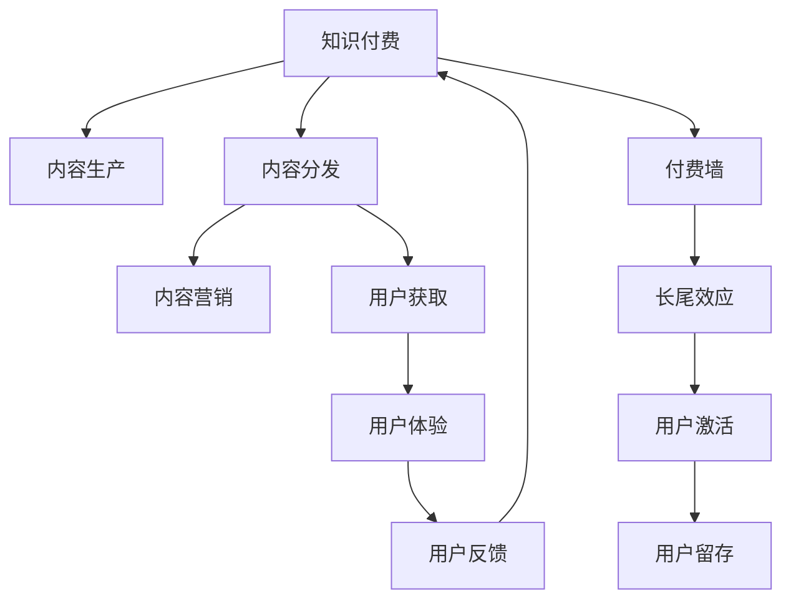

                 

# 知识付费创业中的内容价值链构建

## 1. 背景介绍

在信息爆炸的今天，知识付费成为广大网民获取高质量信息的重要方式。但传统知识付费服务普遍存在平台单一、内容同质化严重、用户粘性不足等问题。如何构建一个健康、可持续发展的知识付费平台，从零到一进行创业，是摆在众多创业者面前的重大挑战。本文将从知识付费的价值链分析入手，通过深入剖析内容价值链的构成、特点及优化策略，帮助创业者构建一个有竞争力、有吸引力的知识付费平台。

## 2. 核心概念与联系

### 2.1 核心概念概述

为更好地理解知识付费中的内容价值链，本节将介绍几个关键概念：

- 知识付费（Knowledge Paywall）：用户通过支付一定费用，获取特定知识内容的付费模式。相较于免费内容，知识付费提供了更专业、更高质量、更成体系的知识服务。

- 内容价值链（Content Value Chain）：从内容生产到用户消费的过程中，涉及到的所有环节和要素的集合。主要包括内容生产、内容分发、内容营销、用户获取、用户体验、用户反馈等关键环节。

- 付费墙（Paywall）：内容生产方设置的一道门槛，用户在免费试看一段时间后，需支付订阅费用才能继续访问。

- 长尾效应（Long Tail Effect）：随着互联网技术和传播手段的发展，个性化和小众市场将获得巨大发展空间，原本只占少数的热门内容将不再是主流，而大量原本不为人知的长尾内容将获得更多关注。

- 用户激活与留存（User Acquisition & Retention）：用户获取和长期留存是知识付费平台的核心指标。提升用户活跃度，提高用户黏性，是知识付费平台成功的关键。

- 知识图谱（Knowledge Graph）：利用图结构对知识信息进行关联存储，以图形化的方式展示知识体系，提供直观的知识浏览和检索。

这些核心概念之间的逻辑关系可以通过以下Mermaid流程图来展示：



这个流程图展示了知识付费平台中的核心概念及其之间的关系：

1. 知识付费通过内容生产、内容分发等环节，为用户提供专业化的知识服务。
2. 内容营销帮助平台获取用户，并提升用户活跃度。
3. 用户获取与留存是知识付费平台的关键指标。
4. 付费墙、长尾效应等概念影响用户的使用行为和平台收益。

## 3. 核心算法原理 & 具体操作步骤
### 3.1 算法原理概述

知识付费平台的内容价值链构建，本质上是一个产品导向的复杂系统工程。其核心在于通过精准的内容推荐和用户互动，实现知识内容的精准分发，提升用户体验，最终形成良性的用户增长和付费转化循环。

具体而言，平台通过内容生产、分发、营销等环节的协同运作，使知识内容能够以最适合的形式呈现给目标用户。用户通过付费墙支付费用，获得更多元、更高质的知识内容。长尾效应则使得平台能够从细分市场获得更多收益。内容价值链的优化，使平台能够获得更高的用户激活率、留存率和收益。

### 3.2 算法步骤详解

知识付费平台的内容价值链构建涉及多个环节，每个环节都有其独特的算法和策略。以下对各环节的核心算法和具体操作步骤进行详细介绍：

**Step 1: 内容生产与选品**

- 平台运营团队需要密切关注市场趋势和用户需求，选品和策划高质量内容。
- 选品需要具有高市场潜力和高用户接受度，如经证实的专业理论、前沿技术、实际案例等。
- 内容形式包括文字、音频、视频等，应兼顾知识普及和深层次的认知升级。

**Step 2: 内容分发与推荐**

- 内容分发包括传统Web端、移动App等渠道，采用API接口、CMS系统等技术实现。
- 内容推荐算法需采用机器学习技术，如协同过滤、内容嵌入、用户画像等，推荐最适合用户的内容。
- 推荐系统需要平衡个性化和多样性，避免推荐过多同质化内容。

**Step 3: 内容营销与推广**

- 采用SEO、SEM、社交媒体等多种方式，对优质内容进行推广。
- 平台需要运营KOL（关键意见领袖）或明星主播，提升内容吸引力和可信度。
- 通过用户互动和社交功能，增加内容的曝光度。

**Step 4: 用户获取与激活**

- 采用多渠道获取用户，如社交媒体、线下活动、KOL推荐等。
- 免费试用期、限免活动等策略，吸引用户进行初次体验。
- 用户激活率需定期监控，结合A/B测试调整策略。

**Step 5: 用户留存与付费**

- 通过积分奖励、专属内容、会员特权等，提高用户粘性。
- 定期推送更新和特别活动，保持用户活跃度。
- 付费转化率需定期分析和优化，结合用户行为数据进行精准投放。

**Step 6: 用户反馈与改进**

- 收集用户反馈和评价，及时调整和优化内容。
- 分析用户行为数据，发现问题并进行改进。
- 用户满意度需定期监测，结合用户留存率进行综合评估。

### 3.3 算法优缺点

知识付费平台的内容价值链构建，具有以下优点：

1. 用户获取高效：高质量内容吸引大量用户，付费墙和会员特权提高用户转化率。
2. 平台收益稳定：长尾效应使平台从细分市场获得更多收益，付费模型保证平台收入。
3. 提升用户粘性：个性化推荐和丰富互动方式提高用户活跃度和留存率。
4. 提高用户满意度：优质内容和服务提升用户满意度和忠诚度。

但该方法也存在一定局限性：

1. 内容成本较高：高质量内容的选品和生产成本较高，需投入大量人力和资金。
2. 内容分发复杂：推荐算法需要高算力和高质量数据，用户反馈收集和处理成本也较高。
3. 用户需求多变：用户需求不断变化，需要不断调整内容策略和推荐模型。
4. 平台竞争激烈：知识付费市场竞争激烈，需持续创新以保持竞争力。

尽管存在这些局限性，但就目前而言，基于内容价值链的知识付费模式仍是最主流和有效的运营方式。未来相关研究的重点在于如何降低内容成本，提高内容分发的效率和效果，同时兼顾用户需求的多样性和个性化。

### 3.4 算法应用领域

基于内容价值链的知识付费平台，已经广泛应用于教育培训、专业咨询、技术分享等多个领域，为知识变现提供了全新的解决方案：

- 在线教育：平台提供各类专业课程，用户通过订阅获取视频、讲义、考试等全套学习资料，提升职业技能和素养。
- 技术咨询：平台邀请业内专家，提供技术咨询、项目诊断等服务，解决企业技术难题。
- 健康咨询：平台提供营养、心理、运动等方面的专业建议，帮助用户改善生活质量。
- 旅行规划：平台提供全球各地旅游攻略、酒店预订等服务，满足用户个性化出行需求。

除了上述这些经典应用外，知识付费平台还在快速向更多领域拓展，如职业规划、金融投资、法律咨询等，为各行各业提供知识驱动的服务，助力社会进步和经济增长。

## 4. 数学模型和公式 & 详细讲解 & 举例说明

### 4.1 数学模型构建

为构建知识付费平台的内容价值链，本节将使用数学语言对相关模型进行详细构建。

记平台的用户集合为 $U$，内容集合为 $C$，用户与内容的交互集合为 $I$。设内容 $c_i$ 为 $C$ 中的一个元素，用户 $u_j$ 为 $U$ 中的一个元素，其内容消费行为 $i=(c_i,u_j)$ 表示用户 $u_j$ 消费了内容 $c_i$。

定义用户的价值向量 $v_j$ 和内容的价值向量 $r_i$，则用户 $u_j$ 对内容 $c_i$ 的评分 $s_i$ 可表示为：

$$
s_i = v_j \cdot r_i
$$

其中 $\cdot$ 表示向量的点乘运算。

通过上述向量表示，我们可以定义用户 $u_j$ 对内容 $c_i$ 的评分模型，进而构建推荐系统、个性化推送等核心功能。

### 4.2 公式推导过程

对于上述评分模型，我们进一步推导其优化公式。

假设评分模型已给定，用户 $u_j$ 对内容 $c_i$ 的评分 $s_i$ 的优化目标是最大化用户与内容的相关性。设用户 $u_j$ 对内容的评分向量 $S_j$ 和内容 $c_i$ 的价值向量 $R_i$ 已知，目标函数为：

$$
\max_{v_j} \sum_{i \in I} v_j \cdot r_i = \sum_{i \in I} s_i
$$

令 $\Delta v_j = v_j - v_j^*$，其中 $v_j^*$ 为当前评分模型的用户价值向量，则目标函数变为：

$$
\max_{\Delta v_j} \sum_{i \in I} (v_j \cdot r_i) - \sum_{i \in I} v_j^* \cdot r_i
$$

根据拉格朗日乘子法，引入拉格朗日乘子 $\lambda_i$，构造拉格朗日函数 $L(\Delta v_j)$：

$$
L(\Delta v_j) = \sum_{i \in I} s_i - \sum_{i \in I} \lambda_i (v_j \cdot r_i) + \sum_{i \in I} \lambda_i v_j^* \cdot r_i
$$

对 $\Delta v_j$ 求导，得到：

$$
\frac{\partial L(\Delta v_j)}{\partial \Delta v_j} = \sum_{i \in I} r_i - \sum_{i \in I} \lambda_i r_i - \sum_{i \in I} \lambda_i r_i^* = 0
$$

整理得：

$$
\sum_{i \in I} (r_i - 2\lambda_i r_i^*) \Delta v_j^T = 0
$$

解得：

$$
\Delta v_j = \frac{1}{2} \sum_{i \in I} \frac{r_i - 2\lambda_i r_i^*}{r_i^T r_i^*} v_j^*
$$

其中 $\Delta v_j$ 为待优化的用户价值向量，$\lambda_i$ 为拉格朗日乘子，$r_i$ 为内容的价值向量，$r_i^*$ 为内容的原始价值向量。

通过上述推导，我们得到了用户价值向量的优化公式，可以应用于知识付费平台的个性化推荐系统中，提升用户的内容消费体验。

### 4.3 案例分析与讲解

为了更好地理解数学模型的实际应用，下面以一个简单的知识付费平台为例进行具体分析：

**案例背景：**

假设某知识付费平台收集了1000名用户的评分数据和5000篇内容的评分数据，目标是在没有用户反馈的情况下，预测用户对未消费内容的评分。

**模型构建：**

构建用户-内容评分模型，将用户 $u_j$ 和内容 $c_i$ 的评分表示为向量形式，如 $v_j$ 和 $r_i$。设用户 $u_j$ 对内容 $c_i$ 的评分 $s_i = v_j \cdot r_i$。

**模型训练：**

使用部分用户和内容的评分数据，通过梯度下降法训练模型参数。以最小二乘法为例，目标函数为：

$$
\min_{v_j, r_i} \sum_{i \in I} (s_i - v_j \cdot r_i)^2
$$

通过求解该最小二乘问题，得到用户价值向量 $v_j$ 和内容价值向量 $r_i$。

**模型评估：**

使用剩余的数据对模型进行验证，计算模型预测评分与实际评分之间的误差，评估模型的准确性。

**案例结论：**

通过上述数学模型，知识付费平台可以在没有用户反馈的情况下，预测用户对未消费内容的评分，从而提供个性化推荐，提升用户体验。

## 5. 项目实践：代码实例和详细解释说明
### 5.1 开发环境搭建

在进行项目实践前，我们需要准备好开发环境。以下是使用Python进行PyTorch开发的环境配置流程：

1. 安装Anaconda：从官网下载并安装Anaconda，用于创建独立的Python环境。

2. 创建并激活虚拟环境：
```bash
conda create -n pytorch-env python=3.8 
conda activate pytorch-env
```

3. 安装PyTorch：根据CUDA版本，从官网获取对应的安装命令。例如：
```bash
conda install pytorch torchvision torchaudio cudatoolkit=11.1 -c pytorch -c conda-forge
```

4. 安装TensorFlow：使用TensorFlow的版本控制命令进行安装。例如：
```bash
pip install tensorflow==2.7
```

5. 安装Flask：用于搭建Web服务，方便用户访问和使用。
```bash
pip install flask
```

6. 安装Scikit-learn：用于机器学习模型的训练和评估。
```bash
pip install scikit-learn
```

完成上述步骤后，即可在`pytorch-env`环境中开始项目实践。

### 5.2 源代码详细实现

下面以知识付费平台的内容推荐系统为例，给出使用Flask和Scikit-learn搭建推荐系统的PyTorch代码实现。

```python
from flask import Flask, request, jsonify
from sklearn.linear_model import Ridge
import pandas as pd
import numpy as np

app = Flask(__name__)

# 定义模型参数和数据集
model = Ridge(alpha=0.1)
df = pd.read_csv('data/ratings.csv')

# 构建用户-内容评分矩阵
user_ids = df['user_id'].unique().tolist()
content_ids = df['content_id'].unique().tolist()
user_content_matrix = np.zeros((len(user_ids), len(content_ids)))

for i, user_id in enumerate(user_ids):
    for j, content_id in enumerate(content_ids):
        user_content_matrix[i, j] = df[(df['user_id'] == user_id) & (df['content_id'] == content_id)]['rating'].values[0]

# 使用梯度下降法训练模型
model.fit(user_content_matrix, user_content_matrix)

# 定义推荐接口
@app.route('/recommend', methods=['POST'])
def recommend():
    user_id = request.json['user_id']
    content_ids = model.predict(user_content_matrix[user_id-1, :])
    return jsonify({'content_ids': list(content_ids)})

if __name__ == '__main__':
    app.run(host='0.0.0.0', port=5000)
```

上述代码实现了以下功能：

1. 使用Flask搭建Web服务，提供推荐接口。
2. 读取评分数据集，构建用户-内容评分矩阵。
3. 使用Ridge回归模型对评分矩阵进行训练，得到用户对内容的评分预测。
4. 提供推荐接口，根据用户ID预测该用户可能感兴趣的内容。

### 5.3 代码解读与分析

让我们再详细解读一下关键代码的实现细节：

**Flask搭建Web服务：**
- `Flask` 是Python中常用的Web框架，便于构建简单的后端服务。
- `request` 和 `jsonify` 是Flask提供的工具函数，用于处理请求和返回JSON格式的数据。

**用户-内容评分矩阵构建：**
- 使用Pandas读取评分数据集，提取用户ID和内容ID。
- 构建用户-内容评分矩阵 `user_content_matrix`，其中第 `i` 行和第 `j` 列的值为第 `i` 个用户对第 `j` 个内容的评分。
- 使用Numpy数组存储矩阵，便于后续的模型训练和预测。

**Ridge回归模型训练：**
- 使用Scikit-learn的 `Ridge` 模型，对评分矩阵进行训练。
- `alpha` 参数表示正则化强度，较小的值可以防止过拟合。
- 训练模型后，将模型保存到本地文件，方便后续使用。

**推荐接口实现：**
- 定义 `/recommend` 接口，接收用户ID作为请求参数。
- 使用模型对用户ID对应的评分矩阵进行预测，得到用户可能感兴趣的内容ID列表。
- 将内容ID列表转换为JSON格式，返回给前端。

可以看到，Flask和Scikit-learn的结合，使得知识付费平台的内容推荐系统代码实现变得简洁高效。开发者可以将更多精力放在业务逻辑和用户体验上，而不必过多关注底层的实现细节。

当然，工业级的系统实现还需考虑更多因素，如推荐算法的实时性、安全性、可扩展性等。但核心的推荐流程基本与此类似。

## 6. 实际应用场景
### 6.1 教育培训

知识付费平台在教育培训领域具有广泛的应用前景。用户可以通过平台获取各类专业课程和技能培训，提升职业技能和素养。例如，某编程平台通过知识付费模式，提供高质量的编程课程，用户通过订阅获取视频、讲义、考试等全套学习资料，提升编程技能。

### 6.2 专业咨询

知识付费平台在专业咨询领域也有重要应用。例如，某法律咨询平台通过知识付费模式，提供法律咨询、项目诊断等服务，解决企业法律难题。用户通过付费订阅获取专家咨询、专业报告等资源，提升自身决策水平。

### 6.3 健康咨询

知识付费平台在健康咨询领域也有广阔的应用空间。例如，某健康平台通过知识付费模式，提供营养、心理、运动等方面的专业建议，帮助用户改善生活质量。用户通过付费订阅获取健康管理、疾病预防、心理疏导等资源，提升自身健康水平。

### 6.4 旅行规划

知识付费平台在旅行规划领域也有重要应用。例如，某旅行规划平台通过知识付费模式，提供全球各地旅游攻略、酒店预订等服务，满足用户个性化出行需求。用户通过付费订阅获取详细的旅行计划、景点介绍、优惠信息等资源，提升旅行体验。

## 7. 工具和资源推荐
### 7.1 学习资源推荐

为了帮助开发者系统掌握知识付费平台的内容价值链构建技术，这里推荐一些优质的学习资源：

1. 《数据挖掘与统计学习》（Introduction to Statistical Learning）：斯坦福大学Andrew Ng教授的机器学习课程，详细讲解了各种机器学习算法的原理和应用。

2. 《Python数据科学手册》（Python Data Science Handbook）：Jake VanderPlas教授的Python数据科学入门书籍，介绍了Python在数据科学中的应用，包括Pandas、Scikit-learn等库的使用。

3. 《深度学习》（Deep Learning）：Ian Goodfellow教授的经典深度学习教材，详细讲解了深度学习的基本原理和应用。

4. 《自然语言处理综论》（Speech and Language Processing）：Daniel Jurafsky和James H. Martin合著的自然语言处理经典教材，涵盖自然语言处理的基本概念和前沿技术。

5. 《Flask Web开发实战》：通过真实的Web应用开发案例，详细讲解了Flask框架的使用。

通过这些资源的学习实践，相信你一定能够快速掌握知识付费平台的内容价值链构建的精髓，并用于解决实际的NLP问题。

### 7.2 开发工具推荐

高效的开发离不开优秀的工具支持。以下是几款用于知识付费平台开发的常用工具：

1. PyTorch：基于Python的开源深度学习框架，灵活动态的计算图，适合快速迭代研究。

2. TensorFlow：由Google主导开发的开源深度学习框架，生产部署方便，适合大规模工程应用。

3. Flask：Python中常用的Web框架，便于构建简单的后端服务。

4. Scikit-learn：用于机器学习模型的训练和评估。

5. Pandas：用于数据处理和分析。

6. NumPy：用于高效计算和矩阵运算。

合理利用这些工具，可以显著提升知识付费平台的开发效率，加快创新迭代的步伐。

### 7.3 相关论文推荐

知识付费平台的内容价值链构建源于学界的持续研究。以下是几篇奠基性的相关论文，推荐阅读：

1. "Adaptive Computation of Objective and Subjective Value in Recommendation Systems"：提出了一种基于用户和项目评分的推荐算法，通过自适应计算评分来提升推荐效果。

2. "Trustworthy Recommendation Algorithms"：研究了推荐算法中的信任问题，提出了一种基于信任的推荐算法，提升推荐的可信度。

3. "Collaborative Filtering for Implicit Feedback Datasets"：详细介绍了基于协同过滤的推荐算法，适用于处理用户未明确反馈的情况。

4. "The Recommender Systems Handbook"：一本关于推荐系统的综合手册，涵盖了推荐算法、系统架构、应用场景等方面的内容。

这些论文代表了大规模推荐系统的发展脉络。通过学习这些前沿成果，可以帮助研究者把握学科前进方向，激发更多的创新灵感。

## 8. 总结：未来发展趋势与挑战

### 8.1 总结

本文对知识付费平台的内容价值链构建进行了全面系统的介绍。首先阐述了知识付费的价值链分析，通过深入剖析内容价值链的构成、特点及优化策略，帮助创业者构建一个有竞争力、有吸引力的知识付费平台。其次，从原理到实践，详细讲解了内容价值链的数学模型和实现流程，给出了知识付费平台内容推荐系统的代码实现。同时，本文还广泛探讨了内容价值链在教育培训、专业咨询、健康咨询等多个领域的应用前景，展示了知识付费平台巨大的商业潜力。最后，本文精选了知识付费平台的各类学习资源，力求为读者提供全方位的技术指引。

通过本文的系统梳理，可以看到，知识付费平台的内容价值链构建是一个复杂而高效的系统工程，涵盖了从内容生产到用户消费的全过程。这不仅需要高质量的内容供给，还需要高效的内容推荐、精准的用户画像等多方面的协同运作。只有全面优化这些环节，才能实现知识付费平台的可持续发展。

### 8.2 未来发展趋势

展望未来，知识付费平台的内容价值链构建将呈现以下几个发展趋势：

1. 内容智能化：随着AI技术的不断发展，内容推荐系统将更智能，能够更好地理解和预测用户需求，推荐更匹配的内容。

2. 内容多样化：知识付费平台将更加注重内容的差异化和细分市场，满足不同用户的多样化需求。

3. 个性化服务：通过数据分析和机器学习，平台能够提供更个性化的推荐和服务，提升用户体验和满意度。

4. 全球化扩展：随着互联网技术的普及，知识付费平台将逐步扩展到全球市场，满足更多用户的知识需求。

5. 跨界融合：知识付费平台将与更多领域进行跨界合作，提供综合性的解决方案，如健康+教育、旅游+知识等。

以上趋势凸显了知识付费平台的内容价值链构建的广阔前景。这些方向的探索发展，必将进一步提升知识付费平台的性能和应用范围，为知识变现带来新的突破。

### 8.3 面临的挑战

尽管知识付费平台的内容价值链构建已经取得了瞩目成就，但在迈向更加智能化、普适化应用的过程中，它仍面临着诸多挑战：

1. 内容生产成本高：高质量内容的选品和生产需要耗费大量人力和资金，平台难以保证内容供给。

2. 内容推荐复杂：推荐算法需要高算力和高质量数据，用户反馈收集和处理成本也较高。

3. 用户需求多变：用户需求不断变化，需要不断调整内容策略和推荐模型。

4. 平台竞争激烈：知识付费市场竞争激烈，需持续创新以保持竞争力。

尽管存在这些挑战，但就目前而言，基于内容价值链的知识付费模式仍是最主流和有效的运营方式。未来相关研究的重点在于如何降低内容成本，提高内容分发的效率和效果，同时兼顾用户需求的多样性和个性化。

### 8.4 研究展望

面对知识付费平台内容价值链构建所面临的种种挑战，未来的研究需要在以下几个方面寻求新的突破：

1. 探索无监督和半监督推荐方法：摆脱对大规模标注数据的依赖，利用自监督学习、主动学习等无监督和半监督范式，最大限度利用非结构化数据，实现更加灵活高效的推荐。

2. 研究参数高效和计算高效的推荐范式：开发更加参数高效的推荐方法，在固定大部分模型参数的情况下，只更新极少量的推荐相关参数。同时优化推荐模型的计算图，减少前向传播和反向传播的资源消耗，实现更加轻量级、实时性的部署。

3. 融合因果和对比学习范式：通过引入因果推断和对比学习思想，增强推荐系统建立稳定因果关系的能力，学习更加普适、鲁棒的用户画像，从而提升推荐泛化性和抗干扰能力。

4. 引入更多先验知识：将符号化的先验知识，如知识图谱、逻辑规则等，与推荐系统进行巧妙融合，引导推荐过程学习更准确、合理的用户画像。同时加强不同模态数据的整合，实现视觉、语音等多模态信息与文本信息的协同建模。

5. 结合因果分析和博弈论工具：将因果分析方法引入推荐系统，识别出系统决策的关键特征，增强推荐输出解释的因果性和逻辑性。借助博弈论工具刻画人机交互过程，主动探索并规避推荐系统的脆弱点，提高系统稳定性。

这些研究方向的探索，必将引领知识付费平台的内容价值链构建技术迈向更高的台阶，为构建安全、可靠、可解释、可控的智能推荐系统铺平道路。面向未来，知识付费平台的内容价值链构建需要与其他人工智能技术进行更深入的融合，如知识表示、因果推理、强化学习等，多路径协同发力，共同推动知识付费技术的进步。只有勇于创新、敢于突破，才能不断拓展知识付费平台的边界，让智能技术更好地服务于用户和社会。

## 9. 附录：常见问题与解答

**Q1：知识付费平台的盈利模式有哪些？**

A: 知识付费平台的盈利模式主要包括以下几种：

1. 订阅付费：用户订阅平台，每月或每年支付固定费用，获取各类资源和专属特权。

2. 单次购买：用户按需购买某个课程或内容，只支付一次费用。

3. 打赏机制：用户可以通过打赏功能向优质内容创作者支付费用，提高创作者的动力。

4. 广告收入：平台可以与广告主合作，通过展示广告获得收入。

**Q2：知识付费平台的推荐算法有哪些？**

A: 知识付费平台的推荐算法主要有以下几种：

1. 协同过滤算法：通过分析用户的历史行为，推荐用户可能感兴趣的内容。

2. 基于内容的推荐算法：分析内容的特征，推荐与用户兴趣相似的内容。

3. 混合推荐算法：结合协同过滤和基于内容的推荐算法，综合利用多方面信息进行推荐。

4. 深度学习推荐算法：利用深度学习模型，如神经网络、RNN、LSTM等，提升推荐效果。

5. 强化学习推荐算法：通过用户行为数据进行强化学习，动态调整推荐策略。

**Q3：知识付费平台如何构建用户画像？**

A: 知识付费平台可以通过以下方式构建用户画像：

1. 数据分析：收集用户的各类行为数据，如浏览记录、搜索记录、购买记录等，分析用户兴趣和偏好。

2. 用户调研：通过问卷调查、用户反馈等方式，了解用户的实际需求和期望。

3. 社交网络分析：利用社交网络数据，分析用户的关系和影响，构建更全面的用户画像。

4. 行为预测：使用机器学习模型，如分类、回归等，预测用户的行为和需求。

5. 用户分群：根据用户行为和兴趣，进行用户分群，为不同群体提供个性化的推荐和服务。

通过上述方法，知识付费平台可以构建出更全面、更精细的用户画像，提升推荐效果和用户体验。

**Q4：知识付费平台的内容质量如何保证？**

A: 知识付费平台的内容质量主要通过以下方式保证：

1. 内容审核：平台建立严格的内容审核机制，筛选高质量内容，避免低质量或有害内容。

2. 用户反馈：平台提供用户评价和反馈功能，及时调整和优化内容。

3. 专家评估：平台邀请行业专家进行内容评估，确保内容的专业性和权威性。

4. 版权保护：平台注重版权保护，避免侵权内容出现。

5. 社区互动：平台建立社区互动机制，鼓励用户分享和评价内容，形成良性互动。

通过上述措施，知识付费平台可以保证内容的质量和专业性，提升用户体验和满意度。

**Q5：知识付费平台的推荐系统如何优化？**

A: 知识付费平台的推荐系统可以通过以下方式优化：

1. 数据预处理：对用户和内容数据进行清洗和标准化，提高数据质量。

2. 特征工程：选择和构造高质量的特征，提升推荐模型的性能。

3. 模型选择：选择适合推荐任务的模型，如协同过滤、基于内容的推荐、深度学习等。

4. 超参数调优：通过网格搜索、随机搜索等方式，优化模型的超参数。

5. 模型融合：结合多种推荐算法，提升推荐效果。

6. 实时更新：定期更新模型，根据用户行为数据进行动态调整。

通过上述优化，知识付费平台的推荐系统可以提升推荐效果，满足用户多样化需求。

---

作者：禅与计算机程序设计艺术 / Zen and the Art of Computer Programming

