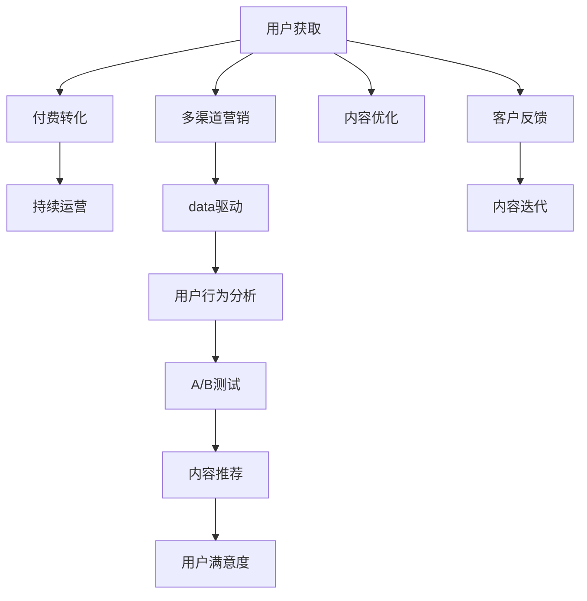

                 

# 知识付费创业中的内容营销策略

> 关键词：知识付费, 内容营销, 用户获取, 付费转化, 持续运营, 多渠道营销, 数据驱动, 用户行为分析

## 1. 背景介绍

在知识付费行业，内容是核心竞争力，营销是转化的关键手段。然而，单纯的内容营销往往难以实现预期的用户转化和持续运营效果。本文将详细探讨知识付费创业中的内容营销策略，从用户获取、付费转化、持续运营等多方面入手，深入分析有效策略，并提出切实可行的建议。

## 2. 核心概念与联系

### 2.1 核心概念概述

在知识付费创业中，以下核心概念构成了内容营销的基石：

- **知识付费**：通过付费形式获取有价值的知识和服务。
- **内容营销**：以内容为主要工具，吸引潜在用户并转化为客户，实现商业目标。
- **用户获取**：通过各种渠道吸引潜在用户，提高品牌知名度。
- **付费转化**：将潜在用户转化为付费用户，实现盈利。
- **持续运营**：通过持续提供有价值的内容，维持用户粘性，提高复购率。
- **多渠道营销**：在多个渠道（如社交媒体、邮件、SEO等）上进行营销推广。
- **数据驱动**：利用数据分析来指导内容制作和营销策略，实现精准营销。
- **用户行为分析**：通过分析用户行为，优化内容推荐和营销策略，提升用户体验和满意度。

这些概念之间存在紧密联系：用户获取是基础，付费转化是核心，持续运营是目标，而数据驱动和多渠道营销则提供了方法和手段，用户行为分析则提供了优化方向。

### 2.2 核心概念原理和架构的 Mermaid 流程图



此图展示了用户获取、付费转化、持续运营等核心概念及其关联，强调了数据驱动和用户行为分析在优化策略中的作用。

## 3. 核心算法原理 & 具体操作步骤

### 3.1 算法原理概述

知识付费中的内容营销，本质上是一种基于用户行为的数据驱动策略。其核心在于通过分析用户行为数据，识别用户需求和偏好，精准推送相关内容，提高用户参与度和付费转化率。

形式化地，设 $U$ 为潜在用户集，$F$ 为付费用户集，$C$ 为内容推荐策略。内容营销的目标是通过策略 $C$，最大化 $F$ 的数量。即：

$$
\maximize |F| = |\{u \in U | u \in C(U)\}|
$$

其中 $C(U)$ 表示策略 $C$ 在用户集 $U$ 上的付费用户子集。

### 3.2 算法步骤详解

基于上述目标，内容营销的具体步骤如下：

**Step 1: 用户数据收集与分析**
- 收集潜在用户的各种行为数据，如浏览历史、购买记录、评论反馈等。
- 使用数据分析工具（如Google Analytics、Mixpanel等）进行用户行为分析，识别潜在用户特征和需求。

**Step 2: 内容策略设计**
- 根据用户行为分析结果，设计符合用户需求的内容推荐策略。
- 例如，对于偏好科技内容的年轻用户，推荐最新科技资讯和深度技术文章；对于职场人士，则推荐管理、职业发展相关内容。

**Step 3: 内容推送与优化**
- 将推荐策略应用到不同用户群体，通过电子邮件、社交媒体、APP推送等多种渠道推送相关内容。
- 实时监控内容推送效果，使用A/B测试评估不同策略的效果，不断迭代优化内容推荐。

**Step 4: 付费转化与客户维护**
- 在内容推荐的基础上，设计优惠活动和促转化方案，引导用户完成付费。
- 提供优质的用户服务和持续的内容更新，提高用户满意度和忠诚度，实现持续运营。

### 3.3 算法优缺点

内容营销策略具有以下优点：
1. 精准性高：通过数据分析，可以准确识别用户需求，提供符合预期的内容，提高用户转化率。
2. 可操作性强：内容营销策略易于设计和实施，适合中小型企业快速落地。
3. 用户粘性强：通过持续提供有价值的内容，维持用户粘性，提高复购率。

但同时，内容营销也存在以下缺点：
1. 数据隐私问题：用户行为数据的收集和使用可能涉及隐私保护问题。
2. 内容制作成本高：高质量内容的制作需要较高成本，短期内可能难以见效。
3. 市场竞争激烈：知识付费市场竞争激烈，内容差异化难度大，需要不断创新才能保持竞争力。

### 3.4 算法应用领域

内容营销策略广泛应用于各种知识付费平台和品牌推广中，例如：

- **在线教育平台**：通过分析学生学习行为，推荐个性化课程和学习资源，提升学习效果和平台粘性。
- **企业培训**：收集员工培训反馈，定制培训内容，提升员工技能和满意度。
- **数字出版**：分析读者阅读偏好，推荐相关书籍和文章，增加销量和读者粘性。
- **技术社区**：通过分析用户发帖和讨论行为，推荐技术文章和资源，提高社区活跃度和用户参与度。

## 4. 数学模型和公式 & 详细讲解 & 举例说明

### 4.1 数学模型构建

在知识付费中，用户行为数据可以表示为 $\mathcal{D} = \{(x_i, y_i)\}_{i=1}^N$，其中 $x_i$ 为行为特征向量，$y_i$ 为行为标签（如是否购买、是否浏览等）。

假设存在一个线性模型 $f(x; \theta) = \theta^T \phi(x)$，其中 $\phi(x)$ 为特征映射函数，$\theta$ 为模型参数。内容推荐策略的目标是最大化 $y_i$ 的预测准确率，即：

$$
\maximize \frac{1}{N} \sum_{i=1}^N \ell(f(x_i; \theta), y_i)
$$

其中 $\ell$ 为损失函数，如均方误差损失。

### 4.2 公式推导过程

以线性回归为例，推导内容推荐模型的参数更新公式。

设训练集为 $\mathcal{D} = \{(x_1, y_1), (x_2, y_2), \ldots, (x_N, y_N)\}$，目标为最小化均方误差损失：

$$
L(\theta) = \frac{1}{N} \sum_{i=1}^N (y_i - f(x_i; \theta))^2
$$

对 $\theta$ 求导，得：

$$
\nabla_{\theta} L(\theta) = - \frac{2}{N} \sum_{i=1}^N (y_i - f(x_i; \theta))x_i
$$

因此，梯度下降更新公式为：

$$
\theta \leftarrow \theta - \eta \nabla_{\theta} L(\theta)
$$

其中 $\eta$ 为学习率。

### 4.3 案例分析与讲解

**案例1：在线教育平台的用户推荐**

某在线教育平台收集了学生登录、观看视频、完成测验等行为数据，使用这些数据训练线性回归模型。通过分析行为数据，模型识别出学生的兴趣偏好，例如编程、数学、语言学习等。然后，根据学生行为数据，推荐相关的视频和测验，显著提高了学生学习效果和平台粘性。

**案例2：数字出版的书籍推荐**

一家在线数字出版平台收集了用户的阅读行为数据，包括浏览次数、停留时间、购买书籍等信息。通过分析这些数据，平台训练了内容推荐模型，根据用户阅读偏好，推荐相关书籍和文章。推荐结果显示，用户的复购率提高了30%，平台活跃度显著提升。

## 5. 项目实践：代码实例和详细解释说明

### 5.1 开发环境搭建

为实现内容推荐策略，需要进行以下环境搭建：

1. **安装Python和相关库**：
```bash
conda create -n content-recommend python=3.8
conda activate content-recommend
pip install numpy pandas sklearn scikit-learn transformers
```

2. **准备数据集**：
```bash
mkdir data
cd data
wget https://example.com/data.csv
```

3. **创建虚拟环境**：
```bash
virtualenv env
source env/bin/activate
```

### 5.2 源代码详细实现

以下是一个简单的基于线性回归的推荐系统代码实现：

```python
import pandas as pd
from sklearn.linear_model import LinearRegression

# 读取数据集
data = pd.read_csv('data.csv')

# 数据预处理
X = data.drop('label', axis=1)
y = data['label']

# 构建模型
model = LinearRegression()
model.fit(X, y)

# 预测新用户的行为标签
new_user = pd.DataFrame({...})
pred_label = model.predict(new_user)

# 输出预测结果
print(pred_label)
```

### 5.3 代码解读与分析

- **数据预处理**：使用 `drop` 方法去除标签列，剩余特征作为输入特征。
- **模型构建**：使用 `LinearRegression` 类构建线性回归模型，调用 `fit` 方法进行训练。
- **预测新用户**：使用训练好的模型，对新用户进行预测，输出预测结果。

### 5.4 运行结果展示

- 在实际运行中，可以使用 `evaluate` 方法评估模型性能：
```python
from sklearn.metrics import mean_squared_error

# 预测结果
y_pred = model.predict(X)

# 计算均方误差
mse = mean_squared_error(y_true, y_pred)
print(f'Mean Squared Error: {mse:.2f}')
```

## 6. 实际应用场景

### 6.1 在线教育平台

在线教育平台是内容营销的重要应用场景之一。通过分析学生行为数据，平台可以设计个性化的学习推荐，提升学习效果和平台粘性。例如：

- **学习路径推荐**：分析学生完成课程、测验等行为数据，推荐适合的学习路径，提高学习效率。
- **个性化视频推荐**：根据学生的学习偏好，推荐相关视频课程，提升学习体验。
- **互动式学习内容**：提供互动式练习、小测验等，增强学习参与度。

### 6.2 企业培训

企业培训也适合应用内容营销策略。通过收集员工培训反馈，定制个性化培训内容，提高员工技能和满意度。例如：

- **技能培训推荐**：根据员工的工作岗位和学习偏好，推荐相关培训课程，提高职业技能。
- **案例学习**：提供真实案例分析，帮助员工学习解决问题的实际方法。
- **知识分享**：鼓励员工分享自己的学习心得和经验，构建学习社区，促进知识共享。

### 6.3 数字出版

数字出版平台通过分析读者行为数据，可以提供个性化的书籍和文章推荐，提高销量和读者粘性。例如：

- **内容推荐算法**：使用协同过滤、内容推荐等算法，推荐相关书籍和文章。
- **阅读行为分析**：分析读者的阅读行为，优化内容推荐算法，提升推荐效果。
- **读者互动**：提供评论、点赞、分享等功能，增加读者互动，提高平台活跃度。

### 6.4 技术社区

技术社区可以通过分析用户行为数据，推荐技术文章和资源，提高社区活跃度和用户参与度。例如：

- **文章推荐**：根据用户浏览行为，推荐相关技术文章和博客。
- **技术讨论**：提供技术讨论区，鼓励用户分享技术问题和学习心得。
- **技术问答**：提供技术问答平台，帮助用户解决问题，促进技术交流。

## 7. 工具和资源推荐

### 7.1 学习资源推荐

1. **《Python数据科学手册》**：一本全面介绍Python数据分析和机器学习的书籍，适合初学者和进阶者。
2. **Coursera**：提供大量数据分析和机器学习的在线课程，涵盖从入门到高级的内容。
3. **Kaggle**：提供数据科学竞赛和数据集，可以练习和验证算法模型。
4. **Google Analytics**：用于网站流量分析，帮助了解用户行为。
5. **Mixpanel**：提供用户行为分析工具，帮助优化内容推荐策略。

### 7.2 开发工具推荐

1. **Python**：作为一种高效的数据分析语言，Python适合进行数据分析和内容推荐系统的开发。
2. **Jupyter Notebook**：一个交互式编程环境，适合进行数据探索和模型实验。
3. **TensorFlow**：一个强大的机器学习框架，适合进行复杂模型的训练和优化。
4. **Dask**：一个分布式计算库，适合处理大数据量，提高模型训练和推荐效率。
5. **Hadoop**：一个大数据处理框架，适合处理海量数据，进行高效的内容推荐。

### 7.3 相关论文推荐

1. **《用户行为数据挖掘与分析》**：介绍用户行为数据的采集、分析和应用，提供详细的算法实现。
2. **《内容推荐系统》**：介绍内容推荐算法的原理和实现，提供多维度的内容推荐策略。
3. **《数据驱动的营销策略》**：介绍数据驱动营销的核心思想和具体实现，提供实际的营销案例。
4. **《在线教育平台的用户行为分析》**：介绍在线教育平台的用户行为分析方法和策略。
5. **《企业培训中的数据驱动策略》**：介绍企业培训中的数据驱动策略和应用效果。

## 8. 总结：未来发展趋势与挑战

### 8.1 研究成果总结

本文详细探讨了知识付费创业中的内容营销策略，从用户获取、付费转化、持续运营等多方面入手，介绍了核心概念、算法原理和具体操作步骤，并通过实际案例和代码实现，展示了内容营销的实际应用。

### 8.2 未来发展趋势

未来，知识付费中的内容营销将呈现以下几个发展趋势：

1. **数据驱动与算法优化**：随着数据量的增加和算法的进步，内容推荐系统将更加精准和智能，用户转化率和复购率将进一步提升。
2. **多渠道整合**：内容营销将更加注重多渠道整合，通过社交媒体、邮件、APP等多渠道进行营销推广，提升品牌知名度和用户参与度。
3. **个性化推荐**：随着个性化算法的不断发展，内容推荐将更加贴合用户需求，提高用户满意度和平台粘性。
4. **人工智能技术**：人工智能技术，如自然语言处理、计算机视觉等，将进一步应用于内容推荐和营销，提升系统智能化水平。
5. **用户体验优化**：用户界面设计和交互体验将更加注重用户体验，提高用户使用便捷性和满意度。

### 8.3 面临的挑战

尽管内容营销策略具有诸多优点，但在实际应用中也面临一些挑战：

1. **数据隐私问题**：用户行为数据的收集和使用可能涉及隐私保护问题，需要在合规的前提下进行数据处理。
2. **内容制作成本高**：高质量内容的制作需要较高成本，短期内可能难以见效。
3. **市场竞争激烈**：知识付费市场竞争激烈，内容差异化难度大，需要不断创新才能保持竞争力。
4. **算法复杂性**：复杂的内容推荐算法需要大量的计算资源和时间，可能影响系统实时性。
5. **用户体验瓶颈**：用户界面设计和交互体验需要不断优化，以提升用户使用便捷性和满意度。

### 8.4 研究展望

未来，内容营销策略将在知识付费中发挥更加重要的作用，具体展望如下：

1. **数据隐私保护**：研发更加安全、高效的数据处理技术，保障用户数据隐私。
2. **内容自动化生成**：引入AI技术，自动化生成内容，降低内容制作成本。
3. **跨领域应用**：将内容营销应用于更多领域，如医疗、金融等，拓展市场应用范围。
4. **用户行为分析**：通过深度学习等技术，更深入地分析用户行为，优化内容推荐算法。
5. **智能推荐系统**：开发智能推荐系统，结合用户历史数据和实时行为，提供个性化推荐。

## 9. 附录：常见问题与解答

**Q1：如何评估内容营销策略的效果？**

A: 可以通过以下指标来评估内容营销策略的效果：

- **用户增长率**：评估新用户获取的速度和数量。
- **付费转化率**：评估用户从潜在用户到付费用户的转化效率。
- **用户粘性**：评估用户使用频率和平台活跃度。
- **用户满意度**：通过调查问卷、反馈等方式，评估用户对内容和服务的满意度。

**Q2：如何处理用户行为数据？**

A: 处理用户行为数据需要遵循以下步骤：

- **数据清洗**：去除无关数据，处理缺失值和异常值。
- **特征工程**：提取有意义的特征，如浏览次数、停留时间、购买金额等。
- **数据建模**：选择合适的算法模型，如线性回归、决策树等，进行数据建模和预测。

**Q3：如何选择合适的推荐算法？**

A: 选择合适的推荐算法需要考虑以下因素：

- **数据类型**：根据数据的类型，选择不同的算法，如协同过滤、内容推荐等。
- **用户规模**：根据用户规模，选择不同的算法，如基于矩阵分解的推荐系统适用于大规模用户。
- **推荐效果**：通过实验和评估，选择效果最优的算法。

**Q4：如何提高用户参与度？**

A: 提高用户参与度可以通过以下方法：

- **互动性设计**：设计互动性强的界面和功能，增加用户互动。
- **个性化内容**：根据用户偏好，提供个性化内容，提高用户满意度。
- **奖励机制**：引入奖励机制，鼓励用户参与和分享。

**Q5：如何提升内容推荐系统的准确性？**

A: 提升内容推荐系统的准确性可以通过以下方法：

- **数据丰富度**：增加数据量和特征维度，提高模型的准确性。
- **模型优化**：选择合适的算法模型，并进行参数调优。
- **反馈机制**：引入用户反馈机制，不断优化推荐策略。

通过不断优化和创新，内容营销策略将在知识付费中发挥更大的作用，帮助企业实现商业目标。

