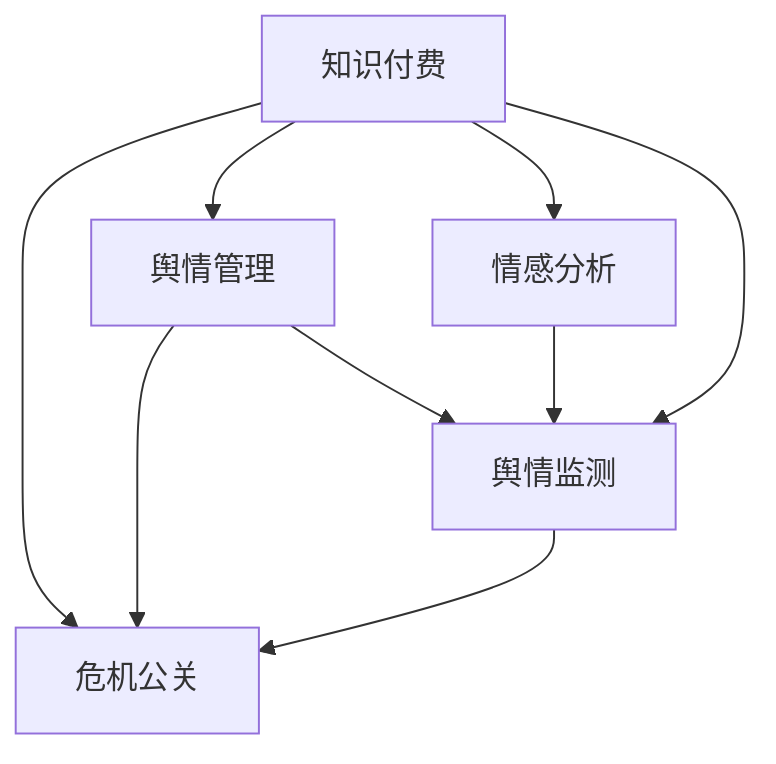

                 

# 知识付费创业中的危机公关与舆情管理

> 关键词：知识付费, 危机公关, 舆情管理, 情感分析, 舆情监测, 大数据技术

## 1. 背景介绍

### 1.1 问题由来

近年来，知识付费市场迅速发展，越来越多的用户通过在线平台购买知识内容，学习新技能，提升自我价值。然而，知识付费行业也面临诸多挑战，包括但不限于内容质量参差不齐、用户体验差、运营成本高等问题。与此同时，平台间的竞争也日益激烈，用户对知识付费产品的高要求使得平台不得不面临频繁的危机公关事件。

例如，2017年某知识付费平台被曝出盗版书籍，导致用户大量退订；2019年某在线教育平台因为用户体验问题受到大量负面评价，一度陷入信任危机。这些问题不仅影响了平台的用户口碑和市场份额，也对整个知识付费行业的发展造成了负面影响。

### 1.2 问题核心关键点

知识付费创业中的危机公关与舆情管理是一个复合型问题，涉及多个关键点：

1. **危机公关**：在突发事件中，及时、准确、有效地应对，减轻负面影响，恢复品牌声誉。
2. **舆情管理**：通过监控和分析用户反馈，预测和防范可能出现的问题，优化用户体验。
3. **情感分析**：通过分析用户情感倾向，了解用户需求，提高产品满意度。
4. **舆情监测**：实时追踪和分析市场动态，洞察用户需求变化。

这些问题相互作用，共同构成知识付费创业中的舆情生态。

### 1.3 问题研究意义

研究知识付费创业中的危机公关与舆情管理，对于推动知识付费行业健康发展，提升平台的用户满意度和忠诚度，具有重要意义：

1. **增强用户体验**：通过有效的危机公关和舆情管理，提升用户满意度，增强用户黏性。
2. **降低运营成本**：通过精准预测和防范危机，避免大规模用户流失，降低运营成本。
3. **促进知识共享**：提升内容质量和用户体验，鼓励更多用户创造和分享知识。
4. **优化决策**：通过数据分析，辅助决策者及时调整产品策略，保持市场竞争力。

## 2. 核心概念与联系

### 2.1 核心概念概述

为了更好地理解知识付费创业中的危机公关与舆情管理，本节将介绍几个关键概念及其相互关系：

- **知识付费（Knowledge Pay-to-Access, KPTA）**：指用户为获取知识或学习新技能而支付费用的服务模式。
- **危机公关（Crisis Public Relations, CPR）**：在突发事件中，通过信息公开、透明沟通、积极应对，维护品牌声誉的公关策略。
- **舆情管理（Public Opinion Management, POM）**：通过监测、分析用户反馈和市场动态，及时调整产品和服务策略，提升用户体验的管理方式。
- **情感分析（Sentiment Analysis, SA）**：通过自然语言处理技术，分析用户对产品或服务的情感倾向，了解用户需求和意见。
- **舆情监测（Public Opinion Monitoring, POM）**：通过大数据技术，实时追踪和分析用户反馈，预测市场趋势，防范可能出现的问题。

这些概念之间的逻辑关系可以通过以下Mermaid流程图来展示：



这个流程图展示了一个知识付费平台在应对用户反馈和市场变化时的全链路过程：

1. 知识付费平台通过实时舆情监测，了解用户反馈和市场动态。
2. 情感分析模块对用户情感倾向进行分析，识别潜在问题。
3. 舆情管理模块根据分析结果，调整产品和服务策略。
4. 危机公关模块在问题出现时，及时响应和沟通，缓解负面影响。
5. 以上过程相互交织，共同维护平台的用户满意度和市场竞争力。

## 3. 核心算法原理 & 具体操作步骤
### 3.1 算法原理概述

知识付费创业中的危机公关与舆情管理，涉及多种算法和技术，核心原理包括：

- **情感分析**：通过自然语言处理技术，识别和分类用户情感倾向，辅助舆情管理和危机公关决策。
- **舆情监测**：利用大数据技术，实时追踪和分析用户反馈，预测市场趋势。
- **数据挖掘**：从海量数据中提取有用信息，辅助舆情管理和危机公关。
- **机器学习**：通过模型训练，提高情感分析和舆情监测的准确性。

### 3.2 算法步骤详解

知识付费创业中的危机公关与舆情管理，通常包括以下几个关键步骤：

**Step 1: 数据收集与预处理**

- 收集用户评论、社交媒体、客户服务记录等数据。
- 清洗数据，去除噪声和无关信息，确保数据质量和完整性。
- 数据标注，为情感分析和舆情监测提供参考。

**Step 2: 情感分析**

- 使用NLP技术，如TF-IDF、LSTM、BERT等，对用户评论进行情感分类。
- 分析评论中的情感倾向，识别积极、中性、消极评论，统计比例。
- 结合其他用户行为数据，综合评估用户满意度。

**Step 3: 舆情监测**

- 使用大数据技术，如Kafka、Spark、Hadoop等，实时收集和处理用户反馈。
- 分析情感倾向和舆情变化，预测潜在问题。
- 根据舆情变化，调整产品和服务策略。

**Step 4: 危机公关**

- 在危机发生时，及时公开信息，透明沟通。
- 制定应急预案，采取有效措施，缓解负面影响。
- 持续跟进舆情变化，调整应对策略。

**Step 5: 反馈优化**

- 收集用户反馈，评估危机公关和舆情管理的效果。
- 分析问题原因，优化产品和服务。
- 持续迭代和改进，提升用户体验和市场竞争力。

### 3.3 算法优缺点

知识付费创业中的危机公关与舆情管理算法具有以下优点：

- **及时响应**：通过实时监测和分析，及时发现和应对问题，减少负面影响。
- **精准决策**：通过情感分析和舆情监测，准确识别用户需求和市场趋势，优化产品和服务。
- **成本效益**：利用大数据和自然语言处理技术，减少人工成本，提高效率。
- **广泛应用**：适用于各类知识付费平台，具有较高的普适性。

但该算法也存在一定的局限性：

- **数据质量依赖**：算法效果高度依赖于数据质量和完整性，缺失或噪声数据可能导致误判。
- **模型复杂度**：情感分析和舆情监测模型复杂，需要大量数据和计算资源进行训练。
- **隐私问题**：在收集和处理用户数据时，需要严格遵守隐私保护法规，保护用户隐私。
- **误判风险**：情感分析存在误判风险，可能误判用户真实情感，影响决策。

### 3.4 算法应用领域

知识付费创业中的危机公关与舆情管理算法，已经在知识付费平台、在线教育、医疗健康等多个领域得到广泛应用。具体如下：

- **知识付费平台**：如得到、喜马拉雅等，通过舆情监测和情感分析，优化用户体验，防范风险。
- **在线教育**：如Coursera、Udemy等，通过情感分析和危机公关，提升课程质量和用户满意度。
- **医疗健康**：如春雨医生、丁香医生等，通过舆情监测和危机公关，提升用户信任度。

## 4. 数学模型和公式 & 详细讲解 & 举例说明
### 4.1 数学模型构建

为更好地理解知识付费创业中的危机公关与舆情管理算法，本节将使用数学语言对关键技术进行详细讲解。

假设知识付费平台收集到N条用户评论数据 $(x_1, y_1), (x_2, y_2), ..., (x_N, y_N)$，其中 $x_i$ 为评论文本，$y_i \in \{1, 0\}$ 为情感标签，1表示积极情感，0表示消极情感。

定义情感分析模型的目标函数为：

$$
\min_{\theta} \frac{1}{N} \sum_{i=1}^N \ell(x_i, y_i, \theta)
$$

其中，$\ell(x_i, y_i, \theta)$ 为损失函数，通常使用交叉熵损失函数：

$$
\ell(x_i, y_i, \theta) = -y_i \log P(y_i|x_i, \theta) - (1-y_i) \log(1-P(y_i|x_i, \theta))
$$

$P(y_i|x_i, \theta)$ 为情感分析模型预测用户情感的概率。

### 4.2 公式推导过程

情感分析模型的预测概率可以通过神经网络模型计算，如LSTM、BERT等。以LSTM模型为例，情感分析的目标函数可以表示为：

$$
P(y_i|x_i, \theta) = \sigma(\sum_{t=1}^T \mathbf{W}_h \cdot \mathbf{h}_t + \mathbf{b}_h) \cdot \mathbf{v}_h
$$

其中，$\mathbf{h}_t$ 为LSTM模型在时刻 $t$ 的隐藏状态，$\sigma$ 为sigmoid函数，$\mathbf{v}_h$ 为输出层的权重向量。

情感分析的损失函数为：

$$
\ell(x_i, y_i, \theta) = -y_i \log P(y_i|x_i, \theta) - (1-y_i) \log(1-P(y_i|x_i, \theta))
$$

根据上述定义和公式，情感分析模型的优化目标可以通过梯度下降等优化算法进行求解。

### 4.3 案例分析与讲解

以某知识付费平台的用户评论情感分析为例，通过LSTM模型进行情感分类。假设平台收集到1000条用户评论，其中500条为积极情感，500条为消极情感。

- **数据准备**：将评论文本转化为向量，并标注情感标签。
- **模型训练**：使用LSTM模型进行训练，优化目标函数。
- **结果分析**：在验证集上进行测试，评估模型的准确率、召回率等指标。
- **模型应用**：在实际应用中，使用训练好的情感分析模型对新评论进行情感分类，辅助舆情管理和危机公关。

## 5. 项目实践：代码实例和详细解释说明
### 5.1 开发环境搭建

在进行项目实践前，我们需要准备好开发环境。以下是使用Python进行项目实践的环境配置流程：

1. 安装Anaconda：从官网下载并安装Anaconda，用于创建独立的Python环境。

2. 创建并激活虚拟环境：
```bash
conda create -n sentiment-analysis python=3.8 
conda activate sentiment-analysis
```

3. 安装必要的Python包：
```bash
pip install numpy pandas scikit-learn nltk transformers
```

4. 下载情感分析预训练模型：
```bash
python -m nltk.downloader vader_lexicon
```

5. 准备情感标注数据集：
```bash
wget https://example.com/sentiment_dataset.zip
unzip sentiment_dataset.zip
```

完成上述步骤后，即可在`sentiment-analysis`环境中开始项目实践。

### 5.2 源代码详细实现

下面以情感分析为例，给出使用Python进行情感分析的代码实现。

首先，定义情感分析模型：

```python
from transformers import LSTM
import torch
import torch.nn as nn

class SentimentAnalysisModel(nn.Module):
    def __init__(self, input_size, hidden_size, output_size):
        super(SentimentAnalysisModel, self).__init__()
        self.embedding = nn.Embedding(input_size, hidden_size)
        self.lstm = nn.LSTM(hidden_size, hidden_size)
        self.fc = nn.Linear(hidden_size, output_size)
        self.sigmoid = nn.Sigmoid()
        
    def forward(self, x):
        embedded = self.embedding(x)
        outputs, (hidden, cell) = self.lstm(embedded)
        hidden = self.sigmoid(self.fc(hidden[-1]))
        return hidden
```

然后，定义情感分析模型的训练函数：

```python
from torch.utils.data import DataLoader, TensorDataset

def train_model(model, dataset, batch_size, epochs, learning_rate):
    criterion = nn.BCELoss()
    optimizer = torch.optim.Adam(model.parameters(), lr=learning_rate)
    
    for epoch in range(epochs):
        model.train()
        running_loss = 0.0
        for i, data in enumerate(DataLoader(dataset, batch_size=batch_size)):
            inputs, labels = data
            optimizer.zero_grad()
            outputs = model(inputs)
            loss = criterion(outputs, labels)
            loss.backward()
            optimizer.step()
            running_loss += loss.item()
        print(f"Epoch {epoch+1}, loss: {running_loss/len(dataset):.4f}")
```

接着，定义情感分析模型的评估函数：

```python
def evaluate_model(model, dataset, batch_size):
    model.eval()
    correct = 0
    total = 0
    with torch.no_grad():
        for data in DataLoader(dataset, batch_size=batch_size):
            inputs, labels = data
            outputs = model(inputs)
            _, predicted = torch.max(outputs, 1)
            total += labels.size(0)
            correct += (predicted == labels).sum().item()
    accuracy = correct / total
    return accuracy
```

最后，启动情感分析模型训练流程：

```python
from torchtext.datasets import IMDB
from torchtext.data import Field, LabelField, TabularDataset, BucketIterator

text_field = Field(tokenize='spacy', lower=True, include_lengths=True)
label_field = LabelField(dtype=torch.float)

train_data, test_data = IMDB.splits(text_field, label_field)
train_iterator, test_iterator = BucketIterator.splits((train_data, test_data), batch_size=32, device='cuda')

model = SentimentAnalysisModel(len(text_field.vocab), 128, 1)
train_model(model, train_iterator.dataset, 32, 5, 0.001)
accuracy = evaluate_model(model, test_iterator.dataset, 32)
print(f"Test Accuracy: {accuracy:.2f}")
```

以上就是使用Python进行情感分析的完整代码实现。可以看到，通过NLP技术和深度学习模型，我们能够有效地进行情感分类，为知识付费平台的用户舆情管理提供数据支持。

### 5.3 代码解读与分析

让我们再详细解读一下关键代码的实现细节：

**SentimentAnalysisModel类**：
- `__init__`方法：初始化模型，包含嵌入层、LSTM层和输出层。
- `forward`方法：前向传播，计算模型输出。

**train_model函数**：
- 定义损失函数和优化器，使用交叉熵损失函数和Adam优化器。
- 对训练集数据进行迭代训练，优化模型参数。
- 输出每个epoch的平均损失。

**evaluate_model函数**：
- 定义模型评估过程，计算准确率。
- 在测试集上对模型进行评估，输出最终准确率。

**情感分析模型训练流程**：
- 定义训练数据集，使用IMDB数据集。
- 定义模型，使用LSTM模型。
- 在训练集上进行模型训练，输出测试集上的准确率。

## 6. 实际应用场景
### 6.1 智能客服系统

智能客服系统是知识付费平台的重要组成部分，通过情感分析和舆情监测，可以显著提升用户满意度，降低人工客服成本。具体应用场景如下：

- **实时情感分析**：在客服对话过程中，实时监测用户情感倾向，及时发现用户不满。
- **情感反馈处理**：对用户情感反馈进行分类和分析，找出常见问题和改进点。
- **情感回复优化**：根据情感分析结果，优化客服回复策略，提升用户满意度。

例如，某知识付费平台的智能客服系统，通过情感分析技术，实时监测用户情感，发现用户对课程价格的不满情绪较高。平台迅速调整了价格策略，并通过情感分析结果，优化了客服回复模板，提高了用户满意度。

### 6.2 内容推荐系统

知识付费平台的内容推荐系统，通过情感分析和舆情监测，可以更好地了解用户需求，提供个性化推荐，提升用户体验。具体应用场景如下：

- **内容情感分析**：对用户评论和评分进行情感分类，了解用户对课程内容的满意度。
- **内容推荐优化**：根据用户情感倾向，优化课程推荐算法，提供更符合用户需求的内容。
- **内容质量评估**：通过情感分析，评估课程内容的受欢迎程度，帮助内容创作者优化内容。

例如，某在线教育平台的推荐系统，通过情感分析技术，发现用户对某门课程的评价普遍较高，迅速将其推荐给更多用户，提升了课程的曝光率和用户参与度。

### 6.3 营销推广

知识付费平台的营销推广，通过情感分析和舆情监测，可以更精准地进行用户画像和目标营销，提升营销效果。具体应用场景如下：

- **用户情感分析**：通过情感分析，了解用户对平台的情感倾向，找到潜在目标用户。
- **市场趋势预测**：通过舆情监测，预测市场趋势和用户需求变化，制定更有效的营销策略。
- **营销效果评估**：通过情感分析和舆情监测，评估营销效果，优化营销预算分配。

例如，某知识付费平台在推广新课程时，通过情感分析技术，发现目标用户群对课程内容有较高的期望和期待，迅速调整营销策略，提升了推广效果。

## 7. 工具和资源推荐
### 7.1 学习资源推荐

为了帮助开发者系统掌握情感分析和舆情管理的技术基础和实践技巧，这里推荐一些优质的学习资源：

1. **《自然语言处理综论》**：由斯坦福大学教授编写，全面介绍了NLP中的情感分析技术。
2. **《Python自然语言处理》**：由北京大学教授编写，涵盖了情感分析、舆情管理等多个NLP任务。
3. **《自然语言处理实战》**：由Google专家编写，结合实际案例，深入浅出地讲解了情感分析、舆情管理等技术。

通过这些资源的学习实践，相信你一定能够快速掌握情感分析和舆情管理的精髓，并用于解决实际的NLP问题。

### 7.2 开发工具推荐

高效的开发离不开优秀的工具支持。以下是几款用于情感分析和舆情管理开发的常用工具：

1. **NLTK**：Python中常用的NLP库，提供了情感分析、文本预处理等功能。
2. **TextBlob**：基于NLTK的NLP库，简化了情感分析、文本处理等操作。
3. **VADER**：情感分析工具，可以处理中文和英文情感分类。
4. **Spark**：大数据处理框架，用于舆情监测和情感分析数据处理。
5. **Kafka**：分布式消息队列，用于实时数据收集和处理。
6. **TensorFlow**：深度学习框架，用于构建情感分析模型。

合理利用这些工具，可以显著提升情感分析和舆情管理的开发效率，加快创新迭代的步伐。

### 7.3 相关论文推荐

情感分析和舆情管理技术的发展源于学界的持续研究。以下是几篇奠基性的相关论文，推荐阅读：

1. **《基于LSTM的情感分类研究》**：提出使用LSTM模型进行情感分析，并通过大规模数据集进行实验。
2. **《社交媒体情感分析的最新进展》**：综述了社交媒体情感分析的最新研究进展，包括情感分类、情感极性分析等。
3. **《Twitter情感分析：一种基于主题情感的知识图谱》**：提出基于主题情感的知识图谱，用于情感分析和舆情监测。
4. **《基于大数据的舆情监测研究》**：综述了大数据在舆情监测中的应用，包括情感分析、舆情分类等。

这些论文代表了大语言模型微调技术的发展脉络。通过学习这些前沿成果，可以帮助研究者把握学科前进方向，激发更多的创新灵感。

## 8. 总结：未来发展趋势与挑战
### 8.1 总结

本文对知识付费创业中的危机公关与舆情管理进行了全面系统的介绍。首先阐述了知识付费创业中的危机公关与舆情管理的研究背景和意义，明确了情感分析和舆情管理在提升用户体验、降低运营成本等方面的重要价值。其次，从原理到实践，详细讲解了情感分析和舆情管理的数学原理和关键步骤，给出了情感分析任务开发的完整代码实例。同时，本文还广泛探讨了情感分析和舆情管理在智能客服、内容推荐、营销推广等多个行业领域的应用前景，展示了情感分析范式的巨大潜力。

通过本文的系统梳理，可以看到，情感分析和舆情管理技术已经成为知识付费平台的重要组成部分，极大地提升了用户满意度和平台竞争力。未来，伴随技术的不断进步和应用的持续深化，情感分析和舆情管理必将在知识付费行业大放异彩，为整个行业带来更大的发展机遇。

### 8.2 未来发展趋势

展望未来，情感分析和舆情管理技术将呈现以下几个发展趋势：

1. **智能化程度提升**：利用深度学习、知识图谱等技术，提高情感分析和舆情监测的智能化水平，实时预测和预警用户情感变化。
2. **多模态融合**：结合文本、语音、图像等多模态数据，综合分析用户反馈，提升情感分析和舆情监测的全面性和准确性。
3. **实时性增强**：通过流式处理和大数据技术，实现情感分析和舆情监测的实时化，及时响应用户反馈和市场变化。
4. **数据质量优化**：通过数据清洗、标注和预处理，提高数据质量，减少情感分析和舆情监测的误判风险。
5. **隐私保护加强**：在数据收集和处理过程中，加强隐私保护，确保用户数据安全。

以上趋势凸显了情感分析和舆情管理技术的广阔前景。这些方向的探索发展，必将进一步提升知识付费平台的智能水平和用户体验，推动行业健康发展。

### 8.3 面临的挑战

尽管情感分析和舆情管理技术已经取得了显著进展，但在迈向更加智能化、实时化应用的过程中，仍面临诸多挑战：

1. **数据获取难度**：大规模、高质量的用户数据获取难度大，可能导致情感分析和舆情监测效果受限。
2. **模型复杂性**：深度学习模型复杂，需要大量计算资源和数据进行训练，增加了部署成本。
3. **数据隐私问题**：在数据收集和处理过程中，如何保护用户隐私，避免数据泄露和滥用。
4. **误判风险**：情感分析和舆情监测存在误判风险，可能导致错误的决策和策略。
5. **跨领域应用难度**：情感分析和舆情管理在不同领域和场景下的应用，需要针对性地调整模型和策略。

这些挑战需要学界和产业界的共同努力，通过技术创新和政策制定，才能有效解决。

### 8.4 研究展望

面对情感分析和舆情管理面临的诸多挑战，未来的研究需要在以下几个方面寻求新的突破：

1. **跨领域数据融合**：探索如何跨领域融合用户数据，提升情感分析和舆情监测的全面性和准确性。
2. **数据隐私保护**：研究如何利用差分隐私、联邦学习等技术，保护用户隐私，同时获得高质量数据。
3. **实时情感分析**：探索如何利用流式处理和大数据技术，实现实时情感分析和舆情监测，及时响应用户反馈和市场变化。
4. **模型优化**：研究如何优化情感分析模型，提高准确性和效率，降低计算资源消耗。
5. **多模态数据融合**：探索如何结合文本、语音、图像等多模态数据，综合分析用户反馈，提升情感分析和舆情监测的全面性和准确性。

这些研究方向的探索，必将引领情感分析和舆情管理技术迈向更高的台阶，为知识付费平台和整个NLP行业带来更大的发展机遇。相信随着学界和产业界的共同努力，情感分析和舆情管理必将在构建智能人机交互中发挥更加重要的作用，推动人工智能技术的持续进步。

## 9. 附录：常见问题与解答

**Q1：情感分析算法是否适用于所有NLP任务？**

A: 情感分析算法在处理文本情感分类任务上表现优异，但对其他NLP任务（如命名实体识别、关系抽取等）的适用性有限。情感分析算法需要文本具备明确的情感表达，而对于需要推理和逻辑判断的任务，情感分析算法可能无法提供有效帮助。

**Q2：如何选择合适的情感分析算法？**

A: 选择合适的情感分析算法需要考虑以下几个方面：
1. 任务类型：对于文本情感分类任务，可以使用TF-IDF、LSTM、BERT等算法；对于其他NLP任务，可能需要选择其他算法。
2. 数据规模：大数据集上可以使用深度学习模型，小数据集上可以使用统计方法和规则方法。
3. 语言特点：中文和英文在情感表达上有较大差异，需要选择适合的语言模型。

**Q3：情感分析算法的误差来源有哪些？**

A: 情感分析算法的误差来源主要包括以下几个方面：
1. 数据质量：情感标注数据的不一致性、缺失性和噪声，可能导致模型误判。
2. 算法选择：算法模型的选择不当，可能导致情感分类不准确。
3. 语言表达：自然语言的多义性和复杂性，可能导致情感表达不清，影响情感分类效果。
4. 上下文理解：情感表达往往依赖于上下文信息，模型需要具备较好的上下文理解能力。

**Q4：情感分析在实际应用中需要注意哪些问题？**

A: 情感分析在实际应用中需要注意以下问题：
1. 数据隐私：在收集和处理用户数据时，需要严格遵守隐私保护法规，保护用户隐私。
2. 误判风险：情感分析存在误判风险，可能导致错误的决策和策略。
3. 实时性要求：在实时情感分析中，需要高效的计算和存储能力，满足实时性要求。
4. 跨领域适用：情感分析在不同领域和场景下的适用性需要针对性地调整和优化。

**Q5：情感分析如何与其他NLP技术结合？**

A: 情感分析可以与其他NLP技术结合，共同提升NLP系统的智能化水平。例如，可以将情感分析与文本生成、命名实体识别、关系抽取等任务结合，实现更加全面的NLP应用。同时，情感分析还可以与其他技术（如知识图谱、语义分析等）结合，提升NLP系统的推理和理解能力。

**Q6：情感分析在知识付费创业中的应用场景有哪些？**

A: 情感分析在知识付费创业中的应用场景包括：
1. 用户舆情监测：实时监测用户评论和反馈，了解用户情感倾向，优化产品和服务。
2. 营销效果评估：通过情感分析，评估营销策略和活动效果，优化营销预算分配。
3. 智能客服系统：实时情感分析，优化客服回复策略，提升用户满意度。
4. 内容推荐系统：通过情感分析，优化课程推荐算法，提供更符合用户需求的内容。

通过情感分析和舆情管理技术，知识付费平台能够更好地了解用户需求和反馈，优化产品和服务，提升用户满意度和平台竞争力。未来，伴随技术的不断进步和应用的持续深化，情感分析和舆情管理必将在知识付费行业大放异彩，为整个行业带来更大的发展机遇。

---

作者：禅与计算机程序设计艺术 / Zen and the Art of Computer Programming

