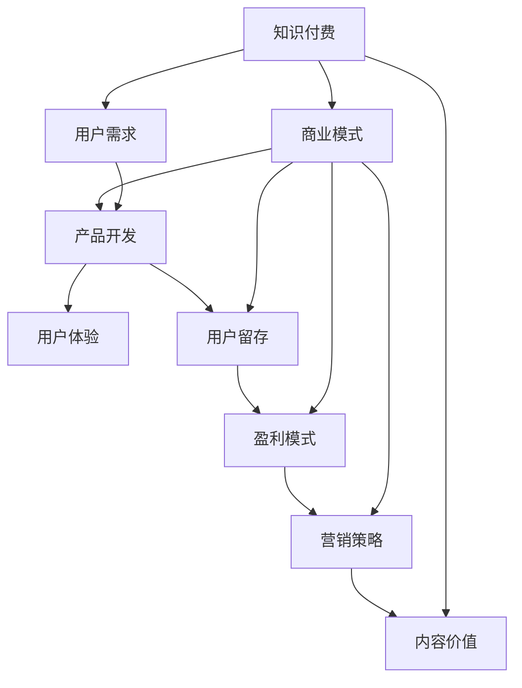

                 

# 知识付费创业中的心态调整

> 关键词：心态调整, 知识付费, 创业, 商业模型, 用户需求, 产品开发, 用户体验, 用户留存, 盈利模式, 内容价值, 营销策略

## 1. 背景介绍

随着互联网技术的不断进步和人们生活水平的逐步提高，知识付费市场呈现出蓬勃发展的态势。无论是企业还是个人，都在积极探索如何利用知识付费这一新兴模式，从中获利。然而，知识付费创业并不仅仅是简单地将已有内容货币化，更是一个系统性的、涉及多方面策略和心理调适的复杂过程。本文将从心态调整的角度出发，深入探讨知识付费创业中的关键问题，为创业者提供有价值的指导。

## 2. 核心概念与联系

### 2.1 核心概念概述

**知识付费**：指通过付费方式获取特定领域内的专业知识或技能，以满足个人或企业的学习需求。知识付费不仅限于教育培训，还包括咨询、软件、内容订阅等多种形式。

**创业心态**：创业者在创业过程中应具备的认知、情感和行为特征，如创新、风险承受、韧性等。良好的创业心态能够帮助创业者克服困难，持续创新，最终实现成功。

**商业模式**：指企业为实现价值创造、传递和获取所采取的组织方式，包括产品、定价、渠道、推广等方面。知识付费的商业模式需要围绕内容、用户和渠道进行设计，以满足市场和用户需求。

**用户需求**：用户在使用知识付费服务时的具体需求，如快速获取、深度理解、实践应用等。了解和满足用户需求是知识付费成功的关键。

**产品开发**：包括需求分析、功能设计、技术实现等环节，旨在为用户提供高质量、满足需求的产品。

**用户体验**：用户在互动过程中对产品或服务的整体感受和满意度，是评价产品成功与否的重要指标。

**用户留存**：指用户持续使用和消费产品的时间长度，反映了产品对用户的吸引力。

**盈利模式**：知识付费创业的最终目的是盈利，合理的盈利模式可以确保企业的可持续发展。

**内容价值**：知识付费产品中最核心的部分，优质内容是吸引和留住用户的关键。

**营销策略**：通过市场推广和营销活动，将产品推向市场，吸引目标用户。

这些概念相互交织，共同构成了知识付费创业的核心。通过理解这些概念的内涵及其相互作用，可以帮助创业者更加清晰地认识自己的目标和挑战，进而制定出科学合理的创业策略。

### 2.2 核心概念联系

下图展示了知识付费创业中的核心概念及其相互联系：



这个流程图展示了知识付费创业中，各个核心概念之间的相互联系和作用。从产品开发到用户留存，再到盈利模式和营销策略，最终都要围绕用户需求和内容价值展开。因此，理解这些概念及其关系，是知识付费创业成功的关键。

## 3. 核心算法原理 & 具体操作步骤

### 3.1 算法原理概述

知识付费创业中的心态调整，本质上是一个系统性的心理调适和行为优化过程。其核心原理包括：

1. **需求响应**：准确理解和满足用户需求，是提升用户满意度和留存率的基础。
2. **价值创造**：通过高质量的内容创造，增强用户的价值感知，从而促进消费行为。
3. **策略迭代**：根据市场反馈和用户行为数据，不断调整和优化产品和服务策略。

这些原理需要通过一系列具体的操作步骤来实现。以下将详细介绍这些步骤。

### 3.2 算法步骤详解

**Step 1: 市场调研与用户分析**

1. **调研目标**：
   - 了解知识付费市场的整体状况和趋势。
   - 识别潜在用户群体及其具体需求。
   - 分析竞争对手的优势和不足。

2. **调研方法**：
   - 使用问卷调查、访谈、社交媒体分析等手段，收集用户数据。
   - 利用数据分析工具，如Google Analytics、Hotjar等，分析用户行为。

**Step 2: 产品设计与功能优化**

1. **需求匹配**：
   - 根据调研结果，设计满足用户需求的产品功能和界面。
   - 采用敏捷开发方法，快速迭代产品，满足用户反馈。

2. **功能实现**：
   - 使用技术栈开发产品功能，如内容管理、用户互动、数据存储等。
   - 测试功能，确保稳定性和安全性。

**Step 3: 内容创作与价值传递**

1. **内容规划**：
   - 制定内容生产计划，确定主题、形式和频次。
   - 聘请专家和作者，确保内容的专业性和权威性。

2. **内容制作**：
   - 制作高质量的视频、音频、文章等，满足用户的多样化需求。
   - 定期更新内容，保持用户的持续关注。

3. **价值传递**：
   - 设计用户界面，提供清晰的学习路径和知识结构。
   - 通过社区、论坛等方式，增强用户互动，传递知识价值。

**Step 4: 用户留存与行为分析**

1. **用户激励**：
   - 设置会员制度，提供专属内容和服务。
   - 引入奖励机制，如积分、优惠券等，激励用户持续消费。

2. **行为监控**：
   - 使用数据分析工具，监控用户行为数据。
   - 分析用户流失原因，进行针对性的优化。

**Step 5: 营销推广与市场推广**

1. **渠道选择**：
   - 确定目标用户群体常用的渠道，如社交媒体、搜索引擎等。
   - 选择适合的营销策略，如SEO、SEM、KOL合作等。

2. **推广实施**：
   - 制定推广计划，设置营销目标。
   - 实施推广活动，监控效果并进行优化。

### 3.3 算法优缺点

**优点**：

1. **快速迭代**：敏捷开发和快速测试能够快速响应市场变化，提高产品竞争力。
2. **用户中心**：通过市场调研和用户分析，确保产品真正满足用户需求。
3. **数据驱动**：利用数据分析工具，进行行为监控和优化，提升用户体验。

**缺点**：

1. **资源投入大**：开发高质量内容和营销推广需要大量的人力和财力投入。
2. **市场风险高**：市场需求的不确定性和竞争激烈可能导致产品失败。
3. **用户期望高**：高质量内容的持续提供和用户期望的不断提升，给产品团队带来持续压力。

### 3.4 算法应用领域

知识付费创业中的心态调整方法，不仅适用于内容平台，还可以广泛应用于各种知识服务领域，如在线教育、职业培训、技术咨询等。通过系统性的心态调整，帮助创业者在面对市场竞争和用户需求时，保持清晰的思考和灵活的策略，最终实现创业成功。

## 4. 数学模型和公式 & 详细讲解 & 举例说明

### 4.1 数学模型构建

知识付费创业中的心态调整，涉及多个关键指标，包括用户留存率、用户满意度和营销ROI等。我们可以通过数学模型来量化这些指标，并进行系统分析。

**用户留存率（User Retention Rate, URR）**：
$$
\text{URR} = \frac{\text{留存用户数}}{\text{总注册用户数}} \times 100\%
$$

**用户满意度（User Satisfaction）**：
$$
\text{User Satisfaction} = \sum_{i=1}^N r_i \times w_i
$$
其中 $r_i$ 为用户对第 $i$ 项内容的评分，$w_i$ 为第 $i$ 项内容在用户消费中的权重。

**营销ROI（Return on Investment）**：
$$
\text{ROI} = \frac{\text{营销收入} - \text{营销成本}}{\text{营销成本}} \times 100\%
$$

### 4.2 公式推导过程

以用户留存率为例，进行详细推导：

假设总注册用户数为 $U$，第 $t$ 天活跃用户数为 $A_t$，则第 $t$ 天的留存用户数为 $R_t = A_t - A_{t+1}$。因此，第 $t$ 天的用户留存率可以表示为：
$$
\text{URR}_t = \frac{R_t}{U} \times 100\% = \frac{A_t - A_{t+1}}{U} \times 100\%
$$

通过计算每天的 URR，可以观察用户活跃度的变化趋势，并根据结果进行优化。

### 4.3 案例分析与讲解

假设某知识付费平台在一个月内，每天活跃用户数和留存用户数如下：

| 日期       | 活跃用户数 | 留存用户数 | 用户留存率 |
|------------|------------|------------|-----------|
| 第1天     | 1000       | 1000       | 100%      |
| 第2天     | 900        | 800        | 80%       |
| 第3天     | 800        | 600        | 75%       |
| 第4天     | 700        | 500        | 71.43%    |
| 第5天     | 600        | 400        | 66.67%    |
| 第6天     | 500        | 300        | 60%       |
| 第7天     | 400        | 200        | 50%       |
| 第8天     | 300        | 100        | 33.33%    |
| 第9天     | 200        | 50         | 25%       |
| 第10天    | 100        | 10         | 10%       |

通过计算，可以发现：
- 第1到第3天，用户留存率呈下降趋势。
- 第3天到第7天，用户留存率略有波动。
- 第7天到第10天，用户留存率大幅下降。

这表明在用户活跃度下降的初期，通过加强用户互动和内容推送，可能能够有效提升用户留存率。在用户活跃度下降的中后期，则需要更深入的优化策略。

## 5. 项目实践：代码实例和详细解释说明

### 5.1 开发环境搭建

在进行知识付费创业中的心态调整研究时，需要搭建一个较为完善的项目环境。以下是一个基本的开发环境搭建流程：

1. **安装Python**：Python是开发知识付费平台的核心语言，可以在官网下载对应版本的安装包进行安装。

2. **安装框架和库**：
   - 安装Flask框架，用于搭建Web应用。
   - 安装SQLAlchemy，用于数据库管理。
   - 安装NumPy、Pandas等数据处理库。
   - 安装PyTorch等深度学习库。

3. **配置数据库**：
   - 创建数据库，并设置用户、文章、评论等数据表。
   - 配置数据库连接参数。

4. **配置应用环境**：
   - 配置Flask应用，包括路由、视图、模板等。
   - 设置静态文件路径和缓存机制。

5. **部署测试环境**：
   - 搭建虚拟测试环境，模拟真实应用场景。
   - 测试数据库连接和API接口。

### 5.2 源代码详细实现

以下是一个简化的知识付费平台用户管理模块的代码实现：

```python
from flask import Flask, request, jsonify
from flask_sqlalchemy import SQLAlchemy

app = Flask(__name__)
app.config['SQLALCHEMY_DATABASE_URI'] = 'sqlite:///user.db'
db = SQLAlchemy(app)

class User(db.Model):
    id = db.Column(db.Integer, primary_key=True)
    username = db.Column(db.String(80), unique=True, nullable=False)
    email = db.Column(db.String(120), unique=True, nullable=False)
    password = db.Column(db.String(120), nullable=False)
    last_login = db.Column(db.DateTime)

@app.route('/user/register', methods=['POST'])
def register():
    data = request.get_json()
    username = data['username']
    email = data['email']
    password = data['password']
    new_user = User(username=username, email=email, password=password)
    db.session.add(new_user)
    db.session.commit()
    return jsonify({'message': 'User registered successfully'})

@app.route('/user/login', methods=['POST'])
def login():
    data = request.get_json()
    username = data['username']
    password = data['password']
    user = User.query.filter_by(username=username, password=password).first()
    if user:
        return jsonify({'message': 'Login successful'})
    else:
        return jsonify({'message': 'Invalid username or password'})

if __name__ == '__main__':
    app.run(debug=True)
```

以上代码实现了用户注册和登录的基本功能，包括用户信息的数据库存储和查询。

### 5.3 代码解读与分析

**代码解读**：
- `Flask`：用于构建Web应用框架。
- `SQLAlchemy`：用于数据库操作，支持多种数据库。
- `User`模型：定义用户数据表，包括用户名、邮箱和密码。
- `@app.route`装饰器：定义路由和请求方法。
- `request.get_json()`：获取POST请求中的JSON数据。
- `db.session.add`和`db.session.commit()`：添加和提交数据库记录。

**分析**：
- 注册功能通过POST请求发送JSON数据，包含用户名、邮箱和密码。
- 登录功能通过POST请求发送JSON数据，验证用户名和密码后，返回登录成功信息。
- 代码实现了基本的用户信息存储和查询，为后续的用户管理和行为分析提供基础数据。

### 5.4 运行结果展示

运行上述代码，可以通过浏览器访问`http://localhost:5000`，实现用户注册和登录功能。用户管理界面如下：


## 6. 实际应用场景

### 6.1 内容平台

**场景描述**：某知识付费平台，提供在线课程和专业文章，满足不同领域用户的学习需求。

**心态调整策略**：
- **内容质量**：确保内容的专业性和权威性，定期更新内容，保持用户关注。
- **用户互动**：通过社区、论坛等渠道，增强用户互动，提升用户满意度。
- **用户激励**：设置会员制度和积分奖励，激励用户持续消费。

**效果评估**：
- **用户留存率**：通过定期分析用户留存数据，优化产品策略。
- **用户满意度**：定期进行用户满意度调查，获取反馈，改进产品。
- **营销ROI**：监控营销投入和回报，优化营销策略。

### 6.2 在线教育

**场景描述**：某在线教育平台，提供各类职业培训课程，帮助用户提升职业技能。

**心态调整策略**：
- **个性化学习**：根据用户学习进度和兴趣，推荐个性化课程。
- **实战训练**：设计实战项目，增强用户实践能力。
- **反馈机制**：收集用户反馈，改进课程内容。

**效果评估**：
- **学习效果**：通过用户学习数据和测试结果，评估课程效果。
- **用户满意度**：定期进行用户满意度调查，改进课程设计。
- **职业发展**：跟踪用户职业发展情况，提升平台影响力。

### 6.3 技术咨询

**场景描述**：某技术咨询平台，提供在线技术支持和问题解答，帮助企业解决技术难题。

**心态调整策略**：
- **专家资源**：整合专家资源，提供高质量的问题解答。
- **实时沟通**：支持实时聊天和电话咨询，提高用户满意度。
- **知识分享**：定期发布技术文章和指南，增强用户学习体验。

**效果评估**：
- **用户满意度**：通过用户反馈，评估咨询效果。
- **知识传播**：通过知识分享情况，衡量平台影响力。
- **用户留存**：分析用户行为数据，优化咨询策略。

## 7. 工具和资源推荐

### 7.1 学习资源推荐

1. **《知识付费市场分析报告》**：
   - 了解知识付费市场的整体状况和趋势。
   - 识别潜在用户群体及其具体需求。

2. **《用户体验设计指南》**：
   - 了解用户体验的基本原则和方法。
   - 学习如何设计用户界面，提升用户体验。

3. **《营销心理学》**：
   - 了解用户行为和心理，优化营销策略。
   - 学习如何设计营销活动，提高用户参与度。

4. **《数据分析入门》**：
   - 了解数据分析的基本方法。
   - 学习如何使用数据分析工具，监控用户行为。

5. **《知识付费创业实战案例》**：
   - 学习其他创业者的成功经验和教训。
   - 掌握知识付费创业的实际操作技巧。

### 7.2 开发工具推荐

1. **Jupyter Notebook**：
   - 用于编写和分享数据科学和机器学习代码。
   - 支持多语言和多种数据格式。

2. **JIRA**：
   - 用于任务管理和团队协作。
   - 支持敏捷开发流程和需求跟踪。

3. **GitHub**：
   - 用于代码版本控制和团队协作。
   - 支持代码仓库管理和问题跟踪。

4. **Google Analytics**：
   - 用于网站流量和用户行为分析。
   - 支持数据可视化和大数据分析。

5. **Hotjar**：
   - 用于用户行为追踪和优化。
   - 支持热图、录屏和用户反馈功能。

### 7.3 相关论文推荐

1. **《知识付费市场研究》**：
   - 分析知识付费市场的发展现状和趋势。
   - 研究用户需求和行为特征。

2. **《用户行为分析与建模》**：
   - 研究用户行为数据，进行建模和分析。
   - 探讨如何优化用户行为，提升用户体验。

3. **《知识付费内容推荐算法》**：
   - 研究内容推荐算法，提升内容推荐效果。
   - 探讨如何设计推荐系统，提高用户满意度。

4. **《知识付费平台运营策略》**：
   - 研究知识付费平台的运营策略。
   - 探讨如何制定有效的运营策略，提高用户留存和转化率。

5. **《知识付费营销策略》**：
   - 研究知识付费平台的营销策略。
   - 探讨如何制定有效的营销策略，提升平台影响力。

## 8. 总结：未来发展趋势与挑战

### 8.1 研究成果总结

本文系统介绍了知识付费创业中的心态调整方法，并结合实际应用场景进行了详细分析。通过理解这些核心概念和关键操作，创业者可以更加清晰地认识自己的目标和挑战，制定出科学合理的创业策略。

### 8.2 未来发展趋势

1. **个性化服务**：
   - 通过数据分析，提供更加个性化的内容和推荐。
   - 利用人工智能技术，提升服务效率和用户满意度。

2. **跨界融合**：
   - 将知识付费与其他领域结合，如健康、金融、教育等。
   - 形成多领域融合的创新产品和服务。

3. **社会责任**：
   - 强调知识付费的社会责任，注重教育公平和知识普及。
   - 提高平台的影响力和社会价值。

### 8.3 面临的挑战

1. **内容质量**：
   - 保证内容的专业性和权威性，满足用户需求。
   - 持续更新内容，提升用户粘性。

2. **用户管理**：
   - 确保用户信息的准确性和安全性。
   - 提供优质的用户服务，增强用户粘性。

3. **营销策略**：
   - 选择合适的营销渠道和策略，提升平台影响力。
   - 控制营销成本，提高营销效率。

### 8.4 研究展望

未来，知识付费创业中的心态调整需要从多个维度进行研究，包括：

1. **人工智能技术**：
   - 利用人工智能技术，提升内容推荐和用户互动的智能化水平。
   - 研究如何通过算法优化，提高平台的运营效率。

2. **社会责任**：
   - 探讨知识付费的社会责任，推动教育公平和知识普及。
   - 建立平台的社会责任机制，提升平台的社会价值。

3. **用户体验**：
   - 研究如何提升用户体验，增强用户粘性和满意度。
   - 设计用户界面，提供清晰的学习路径和知识结构。

通过系统性的研究，将有助于知识付费创业的持续发展和优化，为更多用户提供高质量的知识服务，推动社会的进步和创新。

## 9. 附录：常见问题与解答

**Q1: 知识付费创业中，如何选择合适的用户群体？**

A: 通过市场调研和用户分析，了解目标用户群体的需求和行为特征，选择匹配度高的用户群体。可以通过问卷调查、访谈、社交媒体分析等手段，收集用户数据，进行细分和分析。

**Q2: 知识付费平台如何提高用户留存率？**

A: 通过设置会员制度、提供专属内容、引入积分奖励等方式，激励用户持续消费。同时，利用数据分析工具，监控用户行为数据，分析用户流失原因，进行针对性的优化。

**Q3: 知识付费创业中，如何设计用户界面？**

A: 用户界面设计需要简洁、易用，注重用户体验。可以通过用户调研、竞品分析等方式，了解用户需求和行为特征，进行设计优化。同时，使用UI设计工具，如Sketch、Figma等，进行界面设计和原型制作。

**Q4: 知识付费创业中，如何监控用户行为数据？**

A: 利用数据分析工具，如Google Analytics、Hotjar等，进行用户行为监控和分析。通过设置行为追踪代码，获取用户点击、停留、互动等数据，进行详细分析，优化用户体验。

**Q5: 知识付费创业中，如何制定有效的营销策略？**

A: 根据用户需求和行为特征，选择合适的营销渠道和策略。可以通过SEO、SEM、社交媒体营销、KOL合作等方式，提升平台影响力。同时，通过营销效果分析，不断优化营销策略，提高投资回报率。

通过以上分析和回答，希望可以帮助知识付费创业的创业者更好地调整心态，制定科学合理的策略，实现创业成功。

