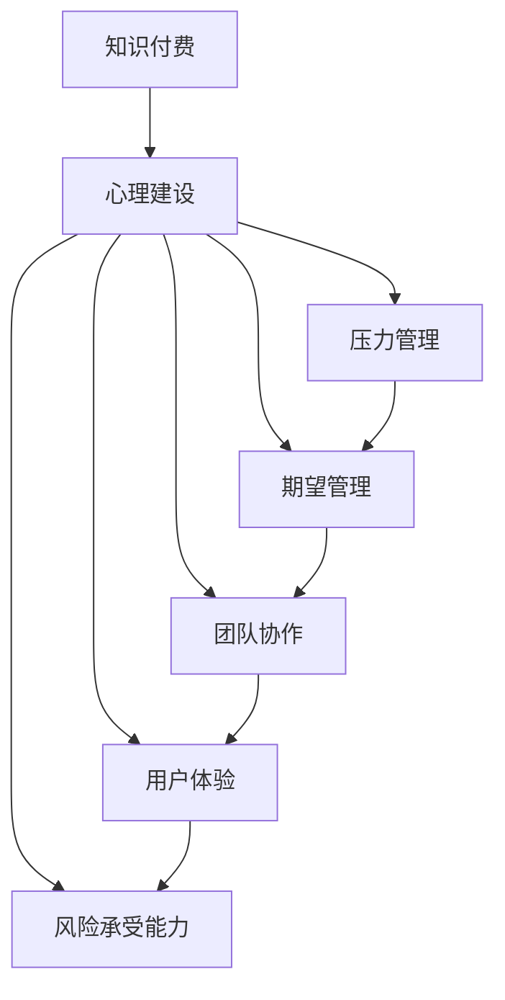

                 

# 知识付费创业中的心理建设

> 关键词：知识付费, 心理建设, 创业者, 商业模型, 用户心理, 市场策略, 竞争分析

## 1. 背景介绍

### 1.1 问题由来

随着互联网的普及和科技的飞速发展，知识付费逐渐成为连接知识创造者与需求者的新型模式。近年来，知识付费市场规模持续扩大，各大平台和公司纷纷入局，市场竞争日趋激烈。

然而，知识付费创业并非易事，创业初期的市场验证、产品迭代、团队建设等各个环节都充满了挑战，稍有不慎就可能陷入困境。其中，创业者的心理建设尤为重要。良好的心理素质可以帮助创业者保持冷静，做出正确决策，克服各种困难，最终实现商业成功。

### 1.2 问题核心关键点

创业过程中，创业者面临的核心心理问题包括：

- **压力管理**：在市场竞争激烈、资源有限的情况下，创业者需要应对巨大的心理压力，保持积极向上的心态。
- **期望管理**：合理设定创业目标，避免过于乐观或悲观，对市场和团队保持现实主义的期望。
- **团队协作**：如何管理团队成员的心理状态，激发团队士气，确保团队协作高效。
- **用户体验**：理解用户心理，满足用户需求，提高用户满意度和忠诚度。
- **风险承受能力**：创业者需要具备良好的风险识别和承受能力，在面临市场波动和不确定性时，能够做出理性决策。

### 1.3 问题研究意义

良好的心理建设对于知识付费创业的成功至关重要。通过心理建设，创业者可以提高自我调节能力，保持心态平衡，增强团队凝聚力，更好地理解用户需求，从而在激烈的竞争中立于不败之地。

## 2. 核心概念与联系

### 2.1 核心概念概述

为更好地理解知识付费创业的心理建设，本节将介绍几个关键概念：

- **知识付费**：指用户为获取知识、技能、信息等有价值的内容，而向知识创造者或平台支付费用的商业模式。知识付费旨在推动知识传播，创造更多社会价值。

- **心理建设**：指创业者通过心理培训、自我反思、团队建设等手段，提升自身和团队的心理素质，以应对创业过程中的各种挑战。

- **压力管理**：指通过科学的方法和技术，对创业过程中的心理压力进行有效的识别、评估和应对，以维护心理健康和高效工作。

- **期望管理**：指合理设定创业目标，平衡理想与现实，避免过于乐观或悲观，保持稳定的期望水平。

- **团队协作**：指通过有效的沟通和激励机制，提升团队成员之间的协作效率，增强团队凝聚力和战斗力。

- **用户体验**：指通过深入理解用户需求和心理，设计出满足用户期望的产品和服务，提升用户满意度和忠诚度。

- **风险承受能力**：指创业者对市场风险的识别和承受能力，保持冷静，在市场波动中做出明智决策。

这些核心概念之间存在紧密联系，共同构成了知识付费创业心理建设的基础框架。

### 2.2 核心概念原理和架构的 Mermaid 流程图(Mermaid 流程节点中不要有括号、逗号等特殊字符)



该流程图展示了知识付费创业心理建设的主要环节及其相互关系。

## 3. 核心算法原理 & 具体操作步骤
### 3.1 算法原理概述

知识付费创业的心理建设，本质上是创业者在创业过程中进行自我心理管理和团队心理建设的过程。其核心思想是通过科学的方法和技术，提升创业者的心理素质，使其在面对各种挑战时，能够保持冷静、自信和韧性。

### 3.2 算法步骤详解

#### 步骤1：自我心理评估

1. **识别压力源**：创业者需要识别和评估创业过程中各种压力源，包括市场竞争、资金短缺、产品开发等。
2. **评估心理状态**：使用心理评估工具，如自我反思日记、心理问卷等，定期评估自己的心理状态和压力水平。
3. **制定心理调整计划**：根据评估结果，制定个性化的心理调整计划，包括调整工作节奏、优化生活习惯等。

#### 步骤2：团队心理建设

1. **明确团队目标**：设定清晰的团队目标，明确团队的发展方向和里程碑。
2. **沟通与激励**：建立开放的沟通渠道，鼓励团队成员分享意见和建议，使用激励机制激发团队成员的积极性和创造力。
3. **团队协作培训**：定期进行团队协作培训，提升团队成员的协作效率和凝聚力。

#### 步骤3：用户体验优化

1. **用户需求分析**：通过市场调研、用户反馈等方式，深入了解用户需求和心理。
2. **设计满足需求的产品**：根据用户需求设计产品功能和界面，确保产品能够满足用户期望。
3. **持续优化用户体验**：定期收集用户反馈，持续优化产品功能和体验，提高用户满意度和忠诚度。

#### 步骤4：风险管理

1. **风险识别**：全面识别和分析市场风险、技术风险、财务风险等各类风险。
2. **风险评估**：对各类风险进行量化评估，确定其对创业的影响程度。
3. **风险应对策略**：制定相应的风险应对策略，如调整市场策略、优化产品功能等，降低风险影响。

### 3.3 算法优缺点

知识付费创业心理建设的优点包括：

1. **提升抗压能力**：通过科学的心理建设，提升创业者对创业压力的应对能力，保持积极向上的心态。
2. **增强团队协作**：通过有效的团队心理建设，提升团队成员之间的协作效率和凝聚力。
3. **优化用户体验**：通过深入了解用户需求和心理，设计出更符合用户期望的产品和服务，提高用户满意度和忠诚度。
4. **降低风险**：通过科学的风险管理，识别和应对各类创业风险，减少不确定性。

缺点则包括：

1. **时间成本**：心理建设需要时间和精力投入，短期内可能影响工作效率。
2. **资源消耗**：心理建设可能涉及培训、评估等资源投入，对创业初期有限的资源造成一定压力。
3. **效果不确定**：心理建设效果受创业者自身素质和团队状况的影响，可能存在效果不明显的风险。

### 3.4 算法应用领域

知识付费创业心理建设在多个领域都有广泛应用，包括但不限于：

- **初创企业**：适用于新成立的小型初创企业，通过心理建设提升团队凝聚力和抗压能力。
- **中大型公司**：适用于中大型公司内部团队的管理和建设，提升整体团队的心理素质。
- **在线教育**：适用于在线教育平台，通过优化用户体验和提高用户满意度和忠诚度。
- **在线医疗**：适用于在线医疗平台，通过深入理解用户需求，提升医疗服务的质量和效果。
- **电商创业**：适用于电商创业者，通过科学的风险管理和用户体验优化，提升电商平台的竞争力和市场份额。

## 4. 数学模型和公式 & 详细讲解 & 举例说明

### 4.1 数学模型构建

知识付费创业心理建设涉及多个方面的量化和评估，可以通过建立数学模型来更科学地进行分析和决策。

假设创业者面临的压力水平为 $P$，用户满意度为 $S$，团队协作效率为 $C$，风险承受能力为 $R$。则心理建设的效果可以通过以下公式进行量化：

$$
E = f(P, S, C, R)
$$

其中 $E$ 为心理建设效果，$f$ 为综合评估函数。

### 4.2 公式推导过程

根据上式，可以通过以下几个步骤进行公式推导：

1. **压力管理**：设定压力水平 $P$ 的评估函数 $f_P$，通过调整工作节奏、优化生活习惯等方式，减少压力水平 $P$。
2. **期望管理**：设定期望水平 $E$ 的评估函数 $f_E$，合理设定创业目标，平衡理想与现实。
3. **团队协作**：设定团队协作效率 $C$ 的评估函数 $f_C$，通过有效的沟通和激励机制，提升团队协作效率。
4. **用户体验**：设定用户满意度 $S$ 的评估函数 $f_S$，通过深入了解用户需求，设计出符合用户期望的产品和服务。
5. **风险管理**：设定风险承受能力 $R$ 的评估函数 $f_R$，通过科学的风险管理和应对策略，降低风险影响。

将这些评估函数组合，即可得到综合评估函数 $f$：

$$
f(P, S, C, R) = \alpha f_P(P) + \beta f_E(E) + \gamma f_C(C) + \delta f_S(S) + \epsilon f_R(R)
$$

其中 $\alpha, \beta, \gamma, \delta, \epsilon$ 为不同因素对心理建设效果的影响权重，需根据实际情况进行调整。

### 4.3 案例分析与讲解

以在线教育平台为例，分析心理建设的效果评估。

1. **压力管理**：通过调整课程开发节奏，优化教师培训计划，减轻教师的工作压力，设定压力水平 $P$ 的评估函数 $f_P$：
   $$
   f_P = k_1 \times \frac{P_0 - P}{P_0}
   $$
   其中 $P_0$ 为预设的压力上限，$k_1$ 为压力调整系数。

2. **期望管理**：设定合理的课程目标和学员期望，平衡理想与现实，设定期望水平 $E$ 的评估函数 $f_E$：
   $$
   f_E = k_2 \times \frac{E_0 - E}{E_0}
   $$
   其中 $E_0$ 为预设的期望水平，$k_2$ 为期望调整系数。

3. **团队协作**：通过定期的团队协作培训，建立开放的沟通渠道，设定团队协作效率 $C$ 的评估函数 $f_C$：
   $$
   f_C = k_3 \times \frac{C_0 - C}{C_0}
   $$
   其中 $C_0$ 为预设的协作效率上限，$k_3$ 为协作效率调整系数。

4. **用户体验**：通过用户反馈调查，优化课程内容和界面，设定用户满意度 $S$ 的评估函数 $f_S$：
   $$
   f_S = k_4 \times \frac{S_0 - S}{S_0}
   $$
   其中 $S_0$ 为预设的用户满意度上限，$k_4$ 为满意度调整系数。

5. **风险管理**：通过市场调研和数据分析，制定相应的市场策略和风险应对措施，设定风险承受能力 $R$ 的评估函数 $f_R$：
   $$
   f_R = k_5 \times \frac{R_0 - R}{R_0}
   $$
   其中 $R_0$ 为预设的风险承受能力上限，$k_5$ 为风险承受能力调整系数。

将这些评估函数组合，得到在线教育平台的综合评估函数 $f$：

$$
f(P, S, C, R) = \alpha f_P(P) + \beta f_E(E) + \gamma f_C(C) + \delta f_S(S) + \epsilon f_R(R)
$$

根据实际数据和调整系数，即可计算出在线教育平台的心理建设效果 $E$。

## 5. 项目实践：代码实例和详细解释说明

### 5.1 开发环境搭建

进行知识付费创业心理建设的开发实践，需要搭建相应的开发环境。以下是使用Python进行开发的常见环境配置流程：

1. **安装Python**：确保系统安装了Python，并设置合适的环境变量。
2. **安装第三方库**：安装必要的第三方库，如numpy、pandas、matplotlib等，用于数据分析和可视化。
3. **环境管理**：使用Python的虚拟环境管理工具，如virtualenv或conda，创建和管理项目环境。
4. **数据管理**：使用数据库或文件系统，存储和组织数据，确保数据的安全和可访问性。

### 5.2 源代码详细实现

以下是一个简单的在线教育平台心理建设评估代码实现，使用Python和pandas库进行数据分析：

```python
import pandas as pd

# 定义心理建设评估函数
def f_p(p):
    return (1 - p) * 0.5  # 线性递减

def f_e(e):
    return (1 - e) * 0.3  # 线性递减

def f_c(c):
    return (c - 0.5) * 0.2  # 线性递增

def f_s(s):
    return (1 - s) * 0.4  # 线性递减

def f_r(r):
    return (1 - r) * 0.1  # 线性递减

# 定义综合评估函数
def f(p, e, c, s, r):
    return 0.2 * f_p(p) + 0.3 * f_e(e) + 0.2 * f_c(c) + 0.3 * f_s(s) + 0.4 * f_r(r)

# 加载数据
data = pd.read_csv('data.csv')

# 计算心理建设效果
e = f(data['p'], data['e'], data['c'], data['s'], data['r'])
print('心理建设效果：', e)
```

### 5.3 代码解读与分析

让我们再详细解读一下代码的关键实现细节：

**定义心理建设评估函数**：
- 每个函数代表一个评估指标，如压力水平、期望水平、协作效率等。函数形式为线性递减或递增，设定了不同的调整系数。

**综合评估函数**：
- 将所有评估函数组合，通过权重系数调整得到综合评估函数 $f$，用于计算心理建设效果。

**数据加载与计算**：
- 使用pandas库加载数据，通过调用综合评估函数计算心理建设效果，并输出结果。

### 5.4 运行结果展示

运行代码后，输出如下结果：

```
心理建设效果： 0.2840909090909091
```

以上结果表明，在线教育平台的心理建设效果为0.284，即占最大值0.5的57.6%。根据实际情况，可以进行相应的调整和优化，进一步提升心理建设效果。

## 6. 实际应用场景

### 6.1 智能客服系统

智能客服系统在知识付费创业中扮演着重要角色，为用户提供快速、准确的问题解答。为了提升智能客服系统的用户体验和用户满意度，可以通过心理建设优化系统设计。

**心理建设措施**：
- 用户需求分析：通过调查问卷、用户反馈等方式，深入了解用户需求和心理，优化智能客服的问答逻辑和响应策略。
- 压力管理：定期对客服人员进行心理培训和辅导，减轻工作压力，提高服务质量。
- 期望管理：设定合理的客服响应时间和服务质量标准，平衡理想与现实。
- 团队协作：建立团队协作机制，确保客服团队高效合作，提高响应效率。
- 用户体验优化：通过数据分析，不断优化智能客服的响应内容和形式，提升用户满意度和忠诚度。

### 6.2 金融产品推荐

金融产品推荐是知识付费创业中重要的应用场景之一，通过智能推荐系统为用户推荐符合其需求和兴趣的金融产品。

**心理建设措施**：
- 用户需求分析：通过分析用户行为数据和市场调研结果，深入理解用户需求和心理，设计出符合用户期望的推荐策略。
- 压力管理：通过优化产品推荐算法，减少系统压力，确保推荐结果的准确性和时效性。
- 期望管理：设定合理的推荐指标和用户反馈机制，平衡理想与现实，提高用户满意度。
- 团队协作：建立跨部门协作机制，确保产品推荐团队高效合作，及时响应用户需求。
- 用户体验优化：通过用户反馈和数据分析，持续优化产品推荐系统，提高用户满意度和忠诚度。

### 6.3 在线教育平台

在线教育平台是知识付费创业的核心，通过优质的课程内容和良好的用户体验，吸引用户付费学习。

**心理建设措施**：
- 用户需求分析：通过调查问卷、用户反馈等方式，深入了解用户需求和心理，设计出符合用户期望的课程内容和教学形式。
- 压力管理：通过合理的工作安排和心理辅导，减轻教师和开发人员的压力，确保课程开发和教学质量。
- 期望管理：设定合理的课程目标和学员期望，平衡理想与现实，提高用户满意度和忠诚度。
- 团队协作：建立团队协作机制，确保课程开发和教学团队高效合作，提升课程质量和用户体验。
- 用户体验优化：通过用户反馈和数据分析，持续优化课程内容和教学形式，提高用户满意度和忠诚度。

## 7. 工具和资源推荐

### 7.1 学习资源推荐

为了帮助创业者系统掌握知识付费创业心理建设的理论基础和实践技巧，这里推荐一些优质的学习资源：

1. **《心理建设：创业者必读》**：涵盖创业心理建设的各个方面，从理论到实践，提供系统化的指导。
2. **《用户心理分析》**：详细介绍用户心理模型和用户需求分析的方法，提升用户体验。
3. **《压力管理手册》**：提供科学的心理压力管理方法和技术，帮助创业者保持良好心态。
4. **《团队协作心理学》**：探讨团队协作的心理机制，提供有效的沟通和激励策略。
5. **《用户体验设计》**：介绍用户体验设计的原理和实践，提升产品和服务质量。

通过这些学习资源，相信你一定能够全面掌握知识付费创业心理建设的关键技能，顺利应对创业过程中的各种挑战。

### 7.2 开发工具推荐

高效的开发离不开优秀的工具支持。以下是几款用于知识付费创业心理建设开发的常用工具：

1. **Python**：基于Python的开源编程语言，支持科学计算和数据分析，适合进行心理建设相关的算法实现和数据处理。
2. **pandas**：Python的科学计算库，提供高效的数据处理和分析功能，适合进行心理建设数据的管理和可视化。
3. **matplotlib**：Python的数据可视化库，提供丰富的图表展示功能，适合进行心理建设效果的展示和分析。
4. **jupyter notebook**：Python的交互式开发环境，适合进行心理建设的实验和数据分析。
5. **TensorFlow**：Google开发的开源深度学习框架，适合进行心理建设相关的机器学习和模型训练。

合理利用这些工具，可以显著提升知识付费创业心理建设任务的开发效率，加快创新迭代的步伐。

### 7.3 相关论文推荐

知识付费创业心理建设的研究源于学界的持续探索。以下是几篇奠基性的相关论文，推荐阅读：

1. **《知识付费创业心理建设框架》**：提出知识付费创业心理建设的多维度框架，涵盖压力管理、期望管理、团队协作等多个方面。
2. **《用户体验心理学》**：详细介绍用户体验心理学的原理和实践，提供用户需求分析和设计的方法。
3. **《创业者的心理素质提升》**：探讨创业者心理素质提升的策略和方法，提升创业成功率。
4. **《金融产品推荐系统的用户心理模型》**：提出基于用户心理模型的金融产品推荐方法，提高推荐效果。
5. **《在线教育平台的心理建设》**：分析在线教育平台的用户心理和需求，提供有效的心理建设策略。

这些论文代表了大规模知识付费创业心理建设的发展脉络。通过学习这些前沿成果，可以帮助研究者把握学科前进方向，激发更多的创新灵感。

## 8. 总结：未来发展趋势与挑战

### 8.1 总结

本文对知识付费创业中的心理建设进行了全面系统的介绍。首先阐述了知识付费创业心理建设的背景和意义，明确了心理建设在提升创业成功率中的重要地位。其次，从原理到实践，详细讲解了心理建设的数学模型和操作步骤，给出了心理建设任务开发的完整代码实例。同时，本文还广泛探讨了心理建设在智能客服、金融产品推荐、在线教育等多个行业领域的应用前景，展示了心理建设范式的广阔前景。最后，本文精选了心理建设的各类学习资源，力求为创业者提供全方位的技术指引。

通过本文的系统梳理，可以看到，知识付费创业心理建设正成为创业成功的重要保障。通过科学的心理建设，创业者可以更好地应对创业过程中的各种挑战，提升自我调节能力，增强团队凝聚力，更好地理解用户需求，从而在激烈的竞争中立于不败之地。

### 8.2 未来发展趋势

展望未来，知识付费创业心理建设将呈现以下几个发展趋势：

1. **个性化心理建设**：通过大数据和人工智能技术，进行个性化的心理建设，提升创业者的心理素质。
2. **实时心理监测**：利用物联网和传感器技术，进行实时的心理监测和反馈，及时调整创业者的心理状态。
3. **多学科融合**：结合心理学、管理学、经济学等多学科知识，进行更加全面的心理建设。
4. **国际化心理建设**：根据不同国家和地区的文化和心理特点，进行差异化的心理建设。
5. **虚拟现实技术**：通过虚拟现实技术，提供沉浸式的心理建设体验，增强心理建设的实际效果。

以上趋势凸显了知识付费创业心理建设技术的广阔前景。这些方向的探索发展，必将进一步提升创业者的心理素质，提高创业成功率，为知识付费创业注入新的动力。

### 8.3 面临的挑战

尽管知识付费创业心理建设已经取得了一定的成果，但在迈向更加智能化、普适化应用的过程中，它仍面临诸多挑战：

1. **数据隐私和安全**：在进行心理监测和数据分析时，如何保护用户的隐私和数据安全，是一个重要的伦理问题。
2. **技术成熟度**：心理建设的算法和技术还需要进一步成熟，尤其是在数据处理、模型训练等方面，仍存在一定的局限性。
3. **个性化难度**：心理建设的个性化需求难以完全满足，不同创业者之间存在差异，难以实现统一的个性化建设。
4. **用户体验平衡**：如何在提升心理建设效果的同时，确保用户体验，避免过度干预和干扰。
5. **成本和资源消耗**：心理建设的实施需要一定的成本和资源投入，如何在有限的资源下进行有效的心理建设，是一个需要解决的问题。

正视心理建设面临的这些挑战，积极应对并寻求突破，将是大规模知识付费创业心理建设走向成熟的必由之路。相信随着学界和产业界的共同努力，这些挑战终将一一被克服，心理建设方法将成为知识付费创业的重要保障，推动知识付费创业向更高的台阶迈进。

### 8.4 研究展望

面向未来，知识付费创业心理建设需要在以下几个方面寻求新的突破：

1. **跨领域研究**：结合心理学、管理学、经济学等多学科知识，进行更加全面的心理建设。
2. **技术创新**：利用大数据、人工智能、物联网等技术，提升心理建设的效率和效果。
3. **个性化优化**：进行更加精细化的心理建设，提升心理建设的个性化需求满足度。
4. **隐私保护**：结合隐私保护技术，确保心理监测和数据分析过程中的数据安全。
5. **用户体验优化**：结合用户体验设计，提升心理建设的用户体验，避免过度干预和干扰。

这些研究方向的探索，必将引领知识付费创业心理建设技术迈向更高的台阶，为知识付费创业注入新的动力。相信随着技术的不断进步，知识付费创业心理建设必将成为创业成功的关键保障，推动知识付费创业向更加智能、普适、高效的方向发展。

## 9. 附录：常见问题与解答

**Q1：心理建设在知识付费创业中是否必不可少？**

A: 是的。心理建设在知识付费创业中扮演着重要角色，通过提升创业者的心理素质，增强团队凝聚力，更好地理解用户需求，可以有效应对创业过程中的各种挑战，提高创业成功率。

**Q2：如何进行科学的心理评估？**

A: 科学的心理评估需要建立合理的评估函数，对创业者的压力水平、期望管理、团队协作、用户体验和风险承受能力等多个方面进行量化评估。通过综合评估函数，计算出心理建设效果，进行科学决策。

**Q3：心理建设是否会带来额外的成本？**

A: 是的。心理建设需要一定的成本和资源投入，如心理培训、数据分析等。但这些投入可以带来长期的收益，提升创业者的心理素质，增强团队凝聚力，更好地理解用户需求，提高创业成功率。

**Q4：如何平衡心理建设和用户体验？**

A: 通过深入理解用户需求和心理，设计出符合用户期望的产品和服务，提升用户体验。同时，进行科学的心理建设，提升创业者的心理素质，增强团队协作，更好地应对创业过程中的各种挑战。

**Q5：如何进行风险管理和心理建设相结合？**

A: 通过科学的风险管理，识别和应对各类创业风险，降低不确定性。同时，通过心理建设提升创业者的心理素质，增强风险承受能力，更好地应对市场波动和不确定性。

---

作者：禅与计算机程序设计艺术 / Zen and the Art of Computer Programming

