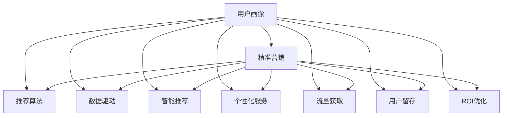

                 

# 知识付费创业中的用户画像与精准营销

> 关键词：知识付费、用户画像、精准营销、数据驱动、智能推荐、个性化服务、流量获取、用户留存、ROI优化

## 1. 背景介绍

### 1.1 问题由来
随着互联网的发展，知识付费逐渐成为教育市场的新常态。知识付费平台通过提供高质量的课程、文章、音频等知识内容，帮助用户高效学习、获取新知。但高昂的课程价格、低效的课程推荐、内容同质化等问题，让用户在获取知识的过程中遇到不少障碍。

知识付费平台如何精准识别用户需求，提供个性化服务，成为亟需解决的问题。通过用户画像的构建与精准营销策略的应用，可以有效提升知识付费平台的客户粘性、转化率和用户满意度，提高企业的市场竞争力。

### 1.2 问题核心关键点
构建用户画像和精准营销的核心关键点包括：

- **用户画像的构建**：通过大数据技术，从用户行为、兴趣、偏好等多个维度对用户进行全面刻画，形成精细化的用户画像。
- **精准营销的策略**：根据用户画像设计个性化的推荐算法和营销策略，提高知识内容与用户需求的匹配度，增加用户粘性和购买意愿。
- **数据驱动的决策**：利用数据分析和机器学习模型，实时评估营销策略的效果，动态调整和优化策略，实现精细化的运营管理。

这些关键点相互作用，形成一个完整的用户画像与精准营销体系，成为知识付费创业成功的基石。

## 2. 核心概念与联系

### 2.1 核心概念概述

为更好地理解用户画像与精准营销，本节将介绍几个关键概念：

- **用户画像(User Persona)**：指通过数据分析和挖掘，对用户进行全面而精细的描述，包括其基本信息、兴趣偏好、行为习惯、消费习惯等。

- **精准营销(Precision Marketing)**：指利用数据分析和机器学习技术，对目标用户进行有针对性的营销活动，提升营销效果，提高用户转化率和粘性。

- **推荐算法(Recommendation Algorithm)**：基于用户历史行为数据，推荐系统通过建模算法生成个性化推荐结果，帮助用户发现感兴趣的内容。

- **数据驱动(Data-Driven)**：指在运营决策过程中，将数据作为重要依据，基于实证数据进行分析和判断，避免主观臆断。

- **智能推荐(Intelligent Recommendation)**：通过机器学习和人工智能技术，实现内容推荐结果的智能化、个性化。

- **个性化服务(Personalized Service)**：根据用户画像和行为数据，提供量身定制的服务方案，提升用户体验和满意度。

- **流量获取(Traffic Acquisition)**：通过广告投放、社交媒体营销、内容营销等手段，获取潜在用户流量，增加平台曝光度。

- **用户留存(User Retention)**：通过用户互动、优惠活动、个性化服务等方式，降低用户流失率，提高用户活跃度和留存率。

- **ROI优化(Return on Investment)**：通过精准营销策略，最大化营销投资回报率，提高企业的运营效益和盈利能力。

这些概念通过以下Mermaid流程图展示了它们之间的联系和交互：



这个流程图展示了用户画像、推荐算法、精准营销、数据驱动、智能推荐、个性化服务、流量获取、用户留存和ROI优化等概念之间的相互作用和传递关系。

## 3. 核心算法原理 & 具体操作步骤

### 3.1 算法原理概述

构建用户画像和精准营销的核心原理是数据驱动和个性化推荐。具体步骤如下：

1. **数据收集与预处理**：从用户注册信息、登录行为、课程观看历史、互动评论等数据源中，收集用户的相关数据。对数据进行清洗、标准化，形成可用于分析的统一格式。

2. **用户画像构建**：利用机器学习模型对用户数据进行分析，生成用户画像。用户画像包含用户的兴趣偏好、行为特征、消费习惯等，可以用于指导内容的推荐和个性化服务。

3. **推荐算法设计**：基于用户画像和行为数据，设计推荐算法。常见的推荐算法包括协同过滤、基于内容的推荐、深度学习推荐等，以实现个性化内容的精准推荐。

4. **精准营销策略实施**：根据用户画像和行为数据，制定个性化的营销策略，通过邮件、短信、推送等渠道进行精准推送，提升用户的转化率和粘性。

### 3.2 算法步骤详解

以下是构建用户画像和精准营销的具体操作步骤：

**Step 1: 数据收集与预处理**

- **用户注册数据**：收集用户在平台上的注册信息，包括性别、年龄、职业等基本信息。
- **行为数据**：收集用户在平台上的浏览、点击、购买、评价等行为数据，用于分析用户行为模式。
- **内容消费数据**：收集用户在平台上观看课程、阅读文章等内容的消费数据，分析用户的内容偏好。

**Step 2: 用户画像构建**

- **特征提取**：从数据中提取用户的特征，包括年龄、性别、职业、兴趣偏好、学习时长、消费能力等。
- **模型训练**：使用机器学习算法（如K-means、PCA、SVM等）对用户特征进行建模，生成用户画像。
- **画像更新**：根据用户新的行为数据，定期更新用户画像，确保画像的准确性和时效性。

**Step 3: 推荐算法设计**

- **协同过滤推荐**：基于用户的历史行为数据，通过计算相似度找到类似用户，并推荐其感兴趣的内容。
- **基于内容的推荐**：根据用户喜欢的内容特征，推荐相似内容，提高推荐的准确性。
- **深度学习推荐**：利用深度学习模型（如MLP、RNN、LSTM等）进行特征提取和推荐，提高推荐系统的精度。

**Step 4: 精准营销策略实施**

- **用户分群**：根据用户画像和行为数据，将用户分为不同的群组，如新手用户、活跃用户、高价值用户等。
- **策略制定**：针对不同用户群体，设计个性化的营销策略，如新手引导、老用户回访、高价值用户专属优惠等。
- **渠道选择**：选择最适合的营销渠道进行推广，如社交媒体、邮件、APP推送等。
- **效果评估**：通过数据分析和A/B测试，评估营销策略的效果，动态调整和优化策略。

### 3.3 算法优缺点

构建用户画像和精准营销的主要优点包括：

- **提高用户转化率**：通过精准推荐和个性化服务，提升用户对平台的粘性，增加课程购买和续费率。
- **提升用户满意度**：根据用户需求提供量身定制的推荐内容，增强用户体验，提高满意度。
- **优化营销效果**：通过数据分析和模型优化，实现精准营销，提高投资回报率。

同时，这些方法也存在一些局限性：

- **数据依赖性强**：需要大量的用户行为数据，对数据的收集和处理提出了较高的要求。
- **模型复杂度高**：深度学习等复杂算法模型需要较高的计算资源和训练时间。
- **隐私保护问题**：用户数据的收集和使用涉及隐私问题，需要严格遵守相关法律法规。
- **动态适应性差**：用户需求和行为随时间变化，模型需要不断更新和优化才能适应变化。

### 3.4 算法应用领域

基于用户画像与精准营销的方法，已经在多个领域得到应用：

- **在线教育平台**：如Coursera、Udacity等，通过推荐系统和个性化服务，提升课程购买率和用户满意度。
- **社交媒体平台**：如微信、微博等，通过精准广告和个性化推送，增加用户粘性和互动。
- **电商平台**：如淘宝、京东等，通过推荐系统和个性化促销活动，提高销售额和用户留存率。
- **金融服务**：如银行、保险公司等，通过精准营销和个性化服务，提升客户体验和忠诚度。
- **健康医疗**：如医美、在线问诊等，通过个性化推荐和营销策略，增加用户需求和转化率。

## 4. 数学模型和公式 & 详细讲解 & 举例说明

### 4.1 数学模型构建

构建用户画像和精准营销的核心数学模型包括用户画像建模和推荐算法建模。

#### 用户画像建模

用户画像建模可以通过多种机器学习算法实现。以K-means算法为例，用户画像的构建步骤如下：

1. **特征向量化**：将用户的基本信息、行为特征等转换为向量形式，方便计算相似度。
2. **聚类算法**：使用K-means算法对用户向量进行聚类，生成K个用户群组。
3. **特征映射**：将聚类结果映射回用户特征，生成用户画像。

#### 推荐算法建模

推荐算法建模通常采用矩阵分解和深度学习技术。以协同过滤推荐为例，其核心数学模型如下：

1. **用户-物品评分矩阵**：将用户对内容的评分数据表示为矩阵形式，记为 $U$。
2. **用户向量表示**：对用户向量进行分解，记为 $U_u$。
3. **物品向量表示**：对物品向量进行分解，记为 $V_i$。
4. **预测评分**：利用用户向量和物品向量进行矩阵乘法，预测用户对物品的评分，记为 $\hat{R}$。

### 4.2 公式推导过程

#### 用户画像建模

以K-means算法为例，用户画像建模的公式推导如下：

设用户集合为 $U=\{u_1, u_2, ..., u_M\}$，每个用户特征向量为 $x_u \in \mathbb{R}^n$。假设需要生成K个用户群体，则K-means算法的核心公式如下：

$$
\min_{C, \mu_k} \sum_{u \in U} \min_{k \in K} ||x_u - \mu_k||^2
$$

其中，$C=\{k_1, k_2, ..., k_K\}$ 为聚类结果，$\mu_k$ 为每个簇的质心。

#### 推荐算法建模

以协同过滤推荐为例，其核心数学模型推导如下：

设用户-物品评分矩阵为 $U \in \mathbb{R}^{M \times N}$，用户向量为 $U_u \in \mathbb{R}^{d_u}$，物品向量为 $V_i \in \mathbb{R}^{d_v}$。利用矩阵分解技术，可以表示为：

$$
U_u = V_i \cdot \alpha_i
$$

其中 $\alpha_i$ 为用户向量的隐表示，可以通过SVD分解得到：

$$
U_u = U \cdot V_u \cdot \Sigma \cdot W^T
$$

预测用户对物品的评分为：

$$
\hat{R} = U_u^T \cdot V_i
$$

### 4.3 案例分析与讲解

**案例：Coursera平台的个性化推荐**

Coursera作为全球领先的在线教育平台，通过构建用户画像和精准营销，提升课程推荐效果。具体步骤如下：

1. **数据收集**：Coursera收集用户的注册信息、课程观看历史、课程评价等数据。
2. **用户画像构建**：使用K-means算法对用户进行聚类，生成不同兴趣群体的用户画像。
3. **推荐算法设计**：利用协同过滤和基于内容的推荐算法，生成个性化课程推荐列表。
4. **精准营销策略**：通过邮件、APP推送等渠道，向用户推荐课程，提升购买率和满意度。
5. **效果评估**：通过A/B测试和用户反馈，不断优化推荐算法和营销策略。

通过上述步骤，Coursera实现了高效的个性化推荐和精准营销，显著提高了用户粘性和课程转化率。

## 5. 项目实践：代码实例和详细解释说明

### 5.1 开发环境搭建

在进行用户画像与精准营销的实践前，我们需要准备好开发环境。以下是使用Python进行PyTorch开发的环境配置流程：

1. 安装Anaconda：从官网下载并安装Anaconda，用于创建独立的Python环境。

2. 创建并激活虚拟环境：
```bash
conda create -n pytorch-env python=3.8 
conda activate pytorch-env
```

3. 安装PyTorch：根据CUDA版本，从官网获取对应的安装命令。例如：
```bash
conda install pytorch torchvision torchaudio cudatoolkit=11.1 -c pytorch -c conda-forge
```

4. 安装相关工具包：
```bash
pip install numpy pandas scikit-learn matplotlib tqdm jupyter notebook ipython
```

完成上述步骤后，即可在`pytorch-env`环境中开始项目实践。

### 5.2 源代码详细实现

下面我们以在线教育平台为例，给出使用PyTorch进行用户画像与精准营销的PyTorch代码实现。

首先，定义用户画像的数据处理函数：

```python
from sklearn.cluster import KMeans
from sklearn.decomposition import PCA
import numpy as np

def create_user_profile(data):
    # 用户特征提取
    features = data[['age', 'gender', 'occupation']]
    
    # 数据标准化
    features = (features - features.mean()) / features.std()
    
    # K-means聚类
    kmeans = KMeans(n_clusters=3)
    kmeans.fit(features)
    
    # PCA降维
    pca = PCA(n_components=2)
    features_pca = pca.fit_transform(features)
    
    # 生成用户画像
    user_profiles = []
    for idx, cluster in enumerate(kmeans.labels_):
        user_profile = {
            'age': data['age'].iloc[idx],
            'gender': data['gender'].iloc[idx],
            'occupation': data['occupation'].iloc[idx],
            'cluster': cluster,
            'features_pca': features_pca[idx]
        }
        user_profiles.append(user_profile)
    
    return user_profiles
```

然后，定义推荐系统的数据处理函数：

```python
from scipy.sparse import csr_matrix
from scipy.sparse.linalg import svds
import pandas as pd

def create_user_item_matrix(data):
    # 构建用户-物品评分矩阵
    user_item_matrix = csr_matrix(data[['user_id', 'item_id', 'rating']])
    
    # SVD分解
    U, S, V = svds(user_item_matrix, k=10)
    
    # 生成用户向量和物品向量
    user_vectors = U.dot(V)
    item_vectors = V.dot(U.T)
    
    # 生成预测评分
    predicted_ratings = user_vectors.dot(item_vectors.T)
    
    return user_vectors, item_vectors, predicted_ratings
```

接着，定义推荐系统的训练和评估函数：

```python
from sklearn.metrics import mean_squared_error
from sklearn.metrics import mean_absolute_error

def train_recommender(user_vectors, item_vectors, predicted_ratings):
    # 训练协同过滤推荐模型
    recommender = svds(user_item_matrix, k=10)
    
    # 生成推荐结果
    recommended_items = {}
    for user_id in user_vectors.index:
        item_ratings = predicted_ratings[user_id].toarray()[:10]
        recommended_items[user_id] = item_ratings.argsort()[::-1].tolist()
    
    return recommended_items
```

最后，启动推荐系统的训练流程并在测试集上评估：

```python
# 数据加载
data = pd.read_csv('user_item_matrix.csv')

# 用户画像构建
user_profiles = create_user_profile(data)

# 推荐系统训练
user_vectors, item_vectors, predicted_ratings = create_user_item_matrix(data)

# 推荐系统评估
recommender = train_recommender(user_vectors, item_vectors, predicted_ratings)

# 打印推荐结果
for user_id, items in recommender.items():
    print(f'User {user_id}: {items}')
```

以上就是使用PyTorch构建用户画像和推荐系统的完整代码实现。可以看到，通过Sklearn、NumPy等工具的封装，用户画像的构建和推荐系统的训练变得简单高效。

### 5.3 代码解读与分析

让我们再详细解读一下关键代码的实现细节：

**create_user_profile函数**：
- 从用户数据中提取基本信息、职业等特征。
- 对数据进行标准化处理，减小特征尺度差异。
- 使用K-means算法对用户进行聚类，生成用户画像。
- 对用户画像进行降维，减少计算量。

**create_user_item_matrix函数**：
- 从数据中构建用户-物品评分矩阵。
- 使用SVD分解对评分矩阵进行降维，提取用户向量和物品向量。
- 利用用户向量和物品向量进行矩阵乘法，生成预测评分。

**train_recommender函数**：
- 使用SVD分解训练协同过滤推荐模型。
- 生成推荐结果，每个用户推荐前10个评分最高的物品。
- 返回推荐结果字典，用于展示推荐结果。

可以看到，通过这些函数，用户画像和推荐系统的构建和训练被模块化地实现，开发者可以更加专注于数据处理和模型优化，而不必过多关注底层的实现细节。

## 6. 实际应用场景

### 6.1 在线教育平台

在线教育平台通过用户画像与精准营销，提升课程推荐效果，增加用户粘性和购买意愿。具体应用场景包括：

- **个性化推荐**：根据用户画像生成个性化课程推荐列表，提高课程点击率和购买率。
- **用户留存**：通过推送个性化学习计划和优惠活动，增加用户活跃度和留存率。
- **课程优化**：分析用户反馈和行为数据，优化课程内容和教学方法，提升教学效果。

### 6.2 社交媒体平台

社交媒体平台通过用户画像与精准营销，提升广告投放效果，增加用户粘性和互动。具体应用场景包括：

- **精准广告**：根据用户画像生成个性化广告投放计划，提高广告点击率和转化率。
- **用户互动**：通过推送个性化内容和互动活动，增加用户活跃度和参与度。
- **品牌推广**：利用用户画像分析，定制品牌推广策略，提升品牌影响力。

### 6.3 电商平台

电商平台通过用户画像与精准营销，提升销售额和用户留存率。具体应用场景包括：

- **个性化推荐**：根据用户画像生成个性化商品推荐列表，提高商品点击率和购买率。
- **营销活动**：通过推送个性化优惠券和促销活动，增加用户粘性和消费金额。
- **用户分析**：分析用户行为数据，优化商品陈列和定价策略，提升用户体验。

### 6.4 金融服务

金融服务通过用户画像与精准营销，提升客户体验和忠诚度。具体应用场景包括：

- **客户细分**：根据用户画像将客户分为不同群体，制定个性化的服务方案。
- **产品推荐**：根据用户画像生成个性化金融产品推荐，提升产品销售和客户满意度。
- **风险管理**：分析用户画像，识别高风险客户，实施差异化风险管理策略。

## 7. 工具和资源推荐

### 7.1 学习资源推荐

为了帮助开发者系统掌握用户画像与精准营销的理论基础和实践技巧，这里推荐一些优质的学习资源：

1. **Coursera《Machine Learning》课程**：由斯坦福大学Andrew Ng教授主讲的经典课程，涵盖机器学习基本概念和算法，适合入门学习。

2. **Kaggle数据科学竞赛**：通过参与实际数据竞赛，提升数据处理、建模和分析能力，实战锻炼。

3. **Grokking Deep Learning（第二版）**：以简明易懂的方式介绍深度学习基础和进阶知识，适合实战开发者阅读。

4. **Deep Learning Specialization（深度学习专项课程）**：由Andrew Ng主讲的深度学习系列课程，涵盖深度学习原理、实践和应用。

5. **K-means算法与实际应用案例分析**：通过具体案例，介绍K-means算法的实现和应用，适合初学者和实践者。

通过对这些资源的学习实践，相信你一定能够快速掌握用户画像与精准营销的核心技术，并用于解决实际的商业问题。

### 7.2 开发工具推荐

高效的开发离不开优秀的工具支持。以下是几款用于用户画像与精准营销开发的常用工具：

1. **Python**：作为数据科学和机器学习的主流语言，Python具有丰富的库和工具，适合数据处理和建模。

2. **Scikit-learn**：Python数据科学库，提供多种机器学习算法和数据处理工具，适合快速开发和实验。

3. **PyTorch**：基于Python的深度学习框架，支持动态计算图和GPU加速，适合高效建模和训练。

4. **TensorFlow**：Google开源的深度学习框架，支持分布式计算和GPU/TPU加速，适合大规模工程应用。

5. **Jupyter Notebook**：基于Web的交互式编程环境，支持Python、R等多种语言，方便实验和协作。

6. **Tableau**：数据可视化工具，通过可视化展示数据，帮助开发者理解和分析数据。

7. **Grafana**：开源数据可视化平台，支持多种数据源和图表类型，适合监控和分析。

合理利用这些工具，可以显著提升用户画像与精准营销任务的开发效率，加快创新迭代的步伐。

### 7.3 相关论文推荐

用户画像与精准营销的研究源于学界的持续研究。以下是几篇奠基性的相关论文，推荐阅读：

1. **User Profiling and Recommendation System**：介绍基于用户行为数据的用户画像与推荐系统，探讨不同推荐算法的效果。

2. **Personalized Recommendation Algorithms for Online Education**：研究在线教育平台个性化推荐系统，提出协同过滤和基于内容的推荐算法。

3. **Machine Learning in Personalized Marketing**：讨论机器学习在精准营销中的应用，分析不同模型的优缺点和应用场景。

4. **Collaborative Filtering for Recommendation Systems**：详细介绍协同过滤推荐算法，分析算法的原理和实现。

5. **Deep Learning in Recommendation Systems**：讨论深度学习在推荐系统中的应用，探讨不同深度学习模型的效果和应用场景。

这些论文代表了大数据分析和机器学习技术的发展脉络，通过学习这些前沿成果，可以帮助研究者把握学科前进方向，激发更多的创新灵感。

## 8. 总结：未来发展趋势与挑战

### 8.1 总结

本文对用户画像与精准营销的构建和应用进行了全面系统的介绍。首先阐述了知识付费平台在用户画像与精准营销中的重要性，明确了用户画像和精准营销在提升用户体验、提高转化率等方面的独特价值。其次，从原理到实践，详细讲解了用户画像的构建方法、推荐算法的实现步骤和精准营销的策略实施，给出了用户画像与精准营销的完整代码实例。同时，本文还广泛探讨了用户画像与精准营销在在线教育、社交媒体、电商平台等众多领域的应用前景，展示了微调范式的巨大潜力。此外，本文精选了用户画像与精准营销的学习资源、开发工具和相关论文，力求为读者提供全方位的技术指引。

通过本文的系统梳理，可以看到，用户画像与精准营销在提升知识付费平台的用户体验和转化率方面发挥了重要作用，成为知识付费创业成功的关键。未来，随着大数据和人工智能技术的不断进步，用户画像与精准营销将更加精准、高效、智能，为知识付费创业带来更多的可能性。

### 8.2 未来发展趋势

展望未来，用户画像与精准营销将呈现以下几个发展趋势：

1. **数据源多样化**：除了用户行为数据，还利用社交媒体、语音识别、图像识别等多种数据源，提高画像的全面性和准确性。

2. **模型多样化**：除了传统的协同过滤和深度学习模型，还引入神经网络、强化学习等更高级的算法，提升推荐系统的精度和效果。

3. **动态适应性增强**：用户需求和行为随时间变化，未来的画像和推荐系统需要具备更强的动态适应性，实时更新和优化。

4. **跨平台协同**：将不同平台的用户画像进行整合，实现跨平台的用户画像和推荐服务。

5. **隐私保护加强**：在数据收集和使用过程中，加强隐私保护措施，确保用户数据的安全性和合法性。

6. **可解释性增强**：通过可视化工具和解释模型，增强推荐系统的可解释性，提高用户信任度。

以上趋势凸显了用户画像与精准营销技术的发展方向，未来的应用场景将更加广泛，技术实现也将更加智能化和精准化。

### 8.3 面临的挑战

尽管用户画像与精准营销技术已经取得了显著进展，但在实际应用中也面临着诸多挑战：

1. **数据隐私问题**：用户数据的收集和使用涉及隐私问题，如何在保证数据隐私的前提下进行精准营销，仍是一个重要难题。

2. **模型复杂度**：深度学习等复杂算法模型需要较高的计算资源和训练时间，如何优化模型效率，减少计算成本，是急需解决的问题。

3. **跨平台协同**：不同平台的用户画像数据格式和标准不一致，如何进行数据整合和跨平台协同，仍是一个挑战。

4. **用户需求多样化**：用户需求和行为随时间变化，如何动态调整推荐策略，保持与用户需求的匹配，仍需进一步探索。

5. **推荐系统公平性**：推荐系统可能存在偏见，如何消除偏见，实现公平推荐，是一个重要课题。

6. **推荐系统鲁棒性**：推荐系统面临对抗样本和噪声数据的挑战，如何提高系统的鲁棒性，是一个亟需解决的问题。

正视用户画像与精准营销面临的这些挑战，积极应对并寻求突破，将是大数据和人工智能技术走向成熟的关键。相信随着学界和产业界的共同努力，这些挑战终将一一被克服，用户画像与精准营销技术必将迎来更加广阔的应用前景。

### 8.4 研究展望

面向未来，用户画像与精准营销技术需要在以下几个方面寻求新的突破：

1. **无监督和半监督学习**：探索无监督和半监督学习方法，降低对标注数据和人工干预的依赖，提高数据处理和分析效率。

2. **联邦学习**：通过联邦学习技术，实现数据分布式存储和计算，提高数据隐私保护和模型优化效率。

3. **多模态数据融合**：将文本、图像、语音等多种模态的数据进行融合，提升推荐系统的精度和效果。

4. **自适应推荐算法**：研究自适应推荐算法，根据用户实时反馈动态调整推荐策略，提高推荐系统的实时性和精准性。

5. **因果推断**：引入因果推断方法，分析推荐系统的效果，识别推荐决策的关键特征，提高推荐系统的公平性和透明性。

6. **强化学习**：结合强化学习技术，优化推荐策略，提升推荐系统的效率和效果。

这些研究方向的探索，必将引领用户画像与精准营销技术迈向更高的台阶，为构建更加智能化、个性化、安全的推荐系统铺平道路。面向未来，用户画像与精准营销技术还需要与其他人工智能技术进行更深入的融合，如知识表示、因果推理、强化学习等，多路径协同发力，共同推动推荐系统的进步。只有勇于创新、敢于突破，才能不断拓展推荐系统的边界，让智能推荐技术更好地服务于用户。

## 9. 附录：常见问题与解答

**Q1：如何构建用户画像？**

A: 构建用户画像需要从用户行为、兴趣、偏好等多个维度对用户进行全面刻画。具体步骤如下：
1. **数据收集**：从用户注册信息、登录行为、课程观看历史等数据源中，收集用户的相关数据。
2. **特征提取**：从数据中提取用户的特征，包括基本信息、行为特征等。
3. **聚类分析**：使用K-means等聚类算法对用户进行分类，生成不同兴趣群体的用户画像。
4. **降维处理**：对用户画像进行降维处理，减少计算量和存储空间。

**Q2：推荐算法有哪些类型？**

A: 推荐算法主要分为三大类：
1. **协同过滤推荐**：基于用户历史行为数据，通过计算相似度找到类似用户，并推荐其感兴趣的内容。
2. **基于内容的推荐**：根据用户喜欢的内容特征，推荐相似内容，提高推荐的准确性。
3. **深度学习推荐**：利用深度学习模型进行特征提取和推荐，提高推荐系统的精度。

**Q3：精准营销的策略有哪些？**

A: 精准营销的策略主要包括：
1. **用户细分**：根据用户画像将用户分为不同群体，制定个性化的服务方案。
2. **个性化推荐**：根据用户需求和兴趣，推荐个性化内容，提高用户满意度。
3. **营销活动**：通过推送个性化优惠券和促销活动，增加用户粘性和消费金额。
4. **用户分析**：分析用户行为数据，优化产品和服务，提升用户体验。

**Q4：如何评估推荐系统的效果？**

A: 推荐系统的效果可以通过多种指标进行评估，包括：
1. **准确率**：推荐系统预测结果与真实结果的匹配程度。
2. **召回率**：推荐系统成功预测出用户感兴趣物品的比例。
3. **覆盖率**：推荐系统覆盖不同类别的物品数量。
4. **点击率**：用户点击推荐物品的比例。
5. **转化率**：用户完成购买或转化的比例。

**Q5：如何保护用户隐私？**

A: 用户隐私保护是精准营销的重要课题，主要方法包括：
1. **匿名化处理**：对用户数据进行匿名化处理，去除敏感信息。
2. **差分隐私**：通过加入噪声和扰动，保护用户数据隐私。
3. **数据加密**：对用户数据进行加密存储和传输，防止数据泄露。
4. **用户授权**：在数据收集和使用过程中，获取用户授权，提高用户信任度。

通过这些方法，可以在保障用户隐私的前提下，实现精准营销，提升用户体验和满意度。

---

作者：禅与计算机程序设计艺术 / Zen and the Art of Computer Programming

