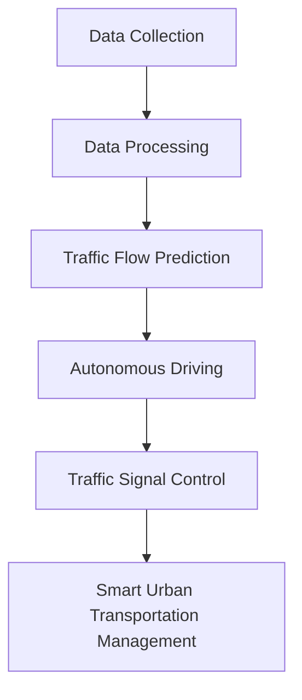

                 

### 文章标题

**AI与人类计算：打造可持续发展的城市交通管理系统与基础设施建设规划**

在当今快速发展的社会，城市交通问题已经成为全球范围内的共同挑战。交通拥堵、空气污染、能源消耗等问题不仅影响城市的可持续发展，还对居民的生活质量产生了深远的影响。为了应对这些挑战，人工智能（AI）技术被广泛引入到城市交通管理中，与人类计算相结合，以构建更加高效、环保和可持续的城市交通系统。本文将探讨如何利用AI与人类计算的优势，制定并实施可持续发展的城市交通管理系统与基础设施建设规划。

**Keywords**: AI, 城市交通管理, 可持续发展, 交通拥堵, 能源消耗, 基础设施建设

**Abstract**: 
本文首先介绍了城市交通管理面临的挑战和现状，分析了人工智能在解决这些问题中的潜力。随后，详细探讨了AI与人类计算在交通管理中的应用，包括数据收集、交通流量预测、交通信号控制、自动驾驶等。接着，文章提出了一个综合性的城市交通管理系统框架，并讨论了基础设施建设的关键要素。最后，总结了未来的发展趋势和面临的挑战，为城市交通管理的可持续发展提供了启示。

---

<|assistant|>## 1. 背景介绍（Background Introduction）

城市交通系统是一个复杂的动态网络，涉及众多因素，包括道路布局、交通流量、交通参与者行为、交通基础设施等。随着城市规模的不断扩大，交通拥堵现象愈发严重，这不仅浪费了时间和资源，还导致空气污染和能源消耗的增加。传统的方法往往依赖于经验性的管理和控制策略，但在应对日益复杂的交通问题时显得力不从心。

### 1.1 城市交通管理面临的挑战

1. **交通拥堵**：城市交通拥堵已经成为全球城市普遍面临的问题。交通拥堵不仅降低了交通效率，还增加了居民的出行时间和成本。
   
2. **空气污染**：汽车尾气排放是城市空气污染的主要来源之一，对居民健康产生严重影响。

3. **能源消耗**：交通活动消耗大量能源，导致碳排放量增加，加剧全球气候变化问题。

4. **交通基础设施不足**：许多城市的基础设施建设滞后，无法满足不断增长的交通需求。

5. **交通参与者行为复杂**：驾驶员、行人、非机动车等交通参与者的行为多样且难以预测。

### 1.2 现状分析

尽管传统的方法在一定程度上缓解了交通拥堵和污染问题，但效果有限。随着人工智能技术的发展，利用AI进行城市交通管理成为了一个新的发展方向。AI可以通过大数据分析、机器学习算法等手段，实现对交通流量的实时监测和预测，从而提供更智能的交通信号控制和道路管理策略。

---

## 1. Background Introduction

Urban transportation systems are complex dynamic networks involving numerous factors such as road layout, traffic flow, traffic participant behavior, and transportation infrastructure. As cities continue to expand, traffic congestion has become a common problem worldwide. Traffic congestion not only wastes time and resources but also leads to increased air pollution and energy consumption. Traditional methods often rely on empirical management and control strategies, which have proven inadequate in addressing increasingly complex transportation challenges.

### 1.1 Challenges in Urban Transportation Management

1. **Traffic Congestion**: Urban traffic congestion has become a widespread problem in many cities. Traffic congestion reduces traffic efficiency and increases residents' travel time and costs.

2. **Air Pollution**: Vehicle exhaust emissions are one of the primary sources of urban air pollution, posing serious health risks to residents.

3. **Energy Consumption**: Traffic activities consume a significant amount of energy, contributing to increased carbon emissions and exacerbating global climate change.

4. **Insufficient Transportation Infrastructure**: Many cities' infrastructure construction lags behind, unable to meet the growing demand for transportation.

5. **Complex Behavior of Traffic Participants**: The behavior of drivers, pedestrians, and non-motorized vehicles is diverse and difficult to predict.

### 1.2 Current Situation Analysis

While traditional methods have somewhat alleviated traffic congestion and pollution, their effectiveness is limited. With the development of artificial intelligence (AI) technology, using AI for urban transportation management has emerged as a new direction. AI can analyze big data and use machine learning algorithms to monitor and predict traffic flow in real-time, providing smarter traffic signal control and road management strategies.

---

<|assistant|>## 2. 核心概念与联系（Core Concepts and Connections）

在构建可持续发展的城市交通管理系统时，我们需要理解并应用一些核心概念和技术。以下将介绍这些核心概念，并通过Mermaid流程图展示它们之间的关系。

### 2.1 数据收集（Data Collection）

数据收集是城市交通管理系统的基础。通过传感器、摄像头、手机信号塔等设备，我们可以收集到大量的交通数据，如车辆速度、流量、位置等。

### 2.2 数据处理（Data Processing）

收集到的数据需要进行处理，以便提取有用的信息。数据处理包括数据清洗、数据整合、特征提取等步骤。

### 2.3 交通流量预测（Traffic Flow Prediction）

交通流量预测是城市交通管理的关键环节。通过历史数据和机器学习算法，我们可以预测未来的交通流量，以便提前采取调控措施。

### 2.4 自动驾驶（Autonomous Driving）

自动驾驶技术是城市交通系统发展的重要方向。自动驾驶车辆可以减少交通事故、提高交通效率，并减少对环境的影响。

### 2.5 交通信号控制（Traffic Signal Control）

交通信号控制是城市交通管理的重要组成部分。通过优化交通信号灯的时序，我们可以提高交通流量，减少拥堵。

### 2.6 Mermaid 流程图

下面是一个Mermaid流程图，展示了这些核心概念之间的联系：

---

## 2. Core Concepts and Connections

In building a sustainable urban transportation management system, we need to understand and apply some core concepts and technologies. The following section introduces these core concepts and uses a Mermaid flowchart to illustrate their relationships.

### 2.1 Data Collection

Data collection is the foundation of urban transportation management systems. Through sensors, cameras, cell phone towers, and other devices, we can collect a vast amount of traffic data, such as vehicle speed, traffic flow, and location.

### 2.2 Data Processing

The collected data needs to be processed to extract useful information. Data processing includes steps such as data cleaning, data integration, and feature extraction.

### 2.3 Traffic Flow Prediction

Traffic flow prediction is a critical component of urban transportation management. By analyzing historical data and using machine learning algorithms, we can predict future traffic flow, allowing us to take preemptive measures.

### 2.4 Autonomous Driving

Autonomous driving technology is an important direction for the development of urban transportation systems. Autonomous vehicles can reduce traffic accidents, improve traffic efficiency, and minimize the impact on the environment.

### 2.5 Traffic Signal Control

Traffic signal control is a vital part of urban transportation management. By optimizing the timing of traffic signals, we can increase traffic flow and reduce congestion.

### 2.6 Mermaid Flowchart

Below is a Mermaid flowchart illustrating the relationships among these core concepts:

---

<|assistant|>## 3. 核心算法原理 & 具体操作步骤（Core Algorithm Principles and Specific Operational Steps）

在实现可持续发展的城市交通管理系统时，核心算法的选择和具体操作步骤至关重要。以下将介绍几个关键算法及其应用场景。

### 3.1 交通流量预测算法

交通流量预测是城市交通管理的重要环节。常用的预测算法包括时间序列分析、回归分析、神经网络等。

#### 3.1.1 时间序列分析

时间序列分析是一种基于历史数据预测未来趋势的方法。常用的模型有ARIMA、SARIMA等。

- **具体步骤**：

  1. 数据预处理：清洗、填充缺失值、平滑噪声等。
  2. 模型选择：根据数据特性选择合适的ARIMA或SARIMA模型。
  3. 参数估计：通过最大化似然估计或最小二乘法估计模型参数。
  4. 预测：使用估计的模型进行预测。

#### 3.1.2 回归分析

回归分析是一种通过建立自变量与因变量之间的关系来预测目标变量的方法。常用的模型有线性回归、多项式回归等。

- **具体步骤**：

  1. 数据预处理：同时间序列分析。
  2. 特征选择：选择对预测有显著影响的自变量。
  3. 模型建立：建立线性回归或多项式回归模型。
  4. 模型评估：通过交叉验证等方法评估模型性能。
  5. 预测：使用训练好的模型进行预测。

#### 3.1.3 神经网络

神经网络是一种基于生物神经元的计算模型。在交通流量预测中，常用的神经网络模型有前馈神经网络、卷积神经网络等。

- **具体步骤**：

  1. 数据预处理：同时间序列分析和回归分析。
  2. 网络架构设计：设计合适的神经网络架构。
  3. 模型训练：使用训练数据训练神经网络模型。
  4. 模型评估：评估模型性能，如通过交叉验证、测试集评估等。
  5. 预测：使用训练好的模型进行预测。

### 3.2 自动驾驶算法

自动驾驶技术是实现智能交通管理的重要手段。自动驾驶算法主要包括感知、规划和控制三个部分。

#### 3.2.1 感知算法

感知算法负责收集环境信息，包括车辆位置、速度、道路状况等。常用的感知算法有雷达、激光雷达、摄像头等。

- **具体步骤**：

  1. 数据收集：通过传感器收集环境数据。
  2. 数据预处理：去除噪声、填充缺失值等。
  3. 特征提取：提取有用的环境特征。
  4. 状态估计：使用滤波算法（如卡尔曼滤波）估计车辆状态。

#### 3.2.2 规划算法

规划算法负责制定行驶路径，包括避障、路径优化等。常用的规划算法有基于图论的A*算法、Dijkstra算法等。

- **具体步骤**：

  1. 建立环境模型：构建表示环境的图或网格。
  2. 选择路径规划算法：根据环境模型选择合适的路径规划算法。
  3. 计算路径：使用规划算法计算最佳行驶路径。

#### 3.2.3 控制算法

控制算法负责控制车辆的速度和方向，使车辆沿着规划路径行驶。常用的控制算法有PID控制、模型预测控制等。

- **具体步骤**：

  1. 状态预测：预测车辆的下一状态。
  2. 控制量计算：计算调整速度和方向的控制量。
  3. 执行控制：根据控制量调整车辆状态。

---

## 3. Core Algorithm Principles and Specific Operational Steps

In implementing a sustainable urban transportation management system, the choice of core algorithms and their specific operational steps are crucial. The following section introduces several key algorithms and their applications.

### 3.1 Traffic Flow Prediction Algorithms

Traffic flow prediction is a critical component of urban transportation management. Common prediction algorithms include time series analysis, regression analysis, and neural networks.

#### 3.1.1 Time Series Analysis

Time series analysis is a method that predicts future trends based on historical data. Common models include ARIMA and SARIMA.

- **Specific Steps**:

  1. Data Preprocessing: Clean, fill missing values, and smooth noise.
  2. Model Selection: Choose an appropriate ARIMA or SARIMA model based on the data characteristics.
  3. Parameter Estimation: Estimate model parameters using maximum likelihood estimation or least squares method.
  4. Prediction: Use the estimated model for prediction.

#### 3.1.2 Regression Analysis

Regression analysis is a method that establishes a relationship between independent and dependent variables to predict the target variable. Common models include linear regression and polynomial regression.

- **Specific Steps**:

  1. Data Preprocessing: Same as time series analysis.
  2. Feature Selection: Select variables that have a significant impact on prediction.
  3. Model Building: Build a linear regression or polynomial regression model.
  4. Model Evaluation: Evaluate model performance using cross-validation or test sets.
  5. Prediction: Use the trained model for prediction.

#### 3.1.3 Neural Networks

Neural networks are computing models inspired by biological neurons. In traffic flow prediction, common neural network models include feedforward neural networks and convolutional neural networks.

- **Specific Steps**:

  1. Data Preprocessing: Same as time series analysis and regression analysis.
  2. Network Architecture Design: Design an appropriate neural network architecture.
  3. Model Training: Train the neural network model using training data.
  4. Model Evaluation: Evaluate model performance using cross-validation or test sets.
  5. Prediction: Use the trained model for prediction.

### 3.2 Autonomous Driving Algorithms

Autonomous driving technology is an important means of achieving smart urban transportation management. Autonomous driving algorithms primarily consist of perception, planning, and control.

#### 3.2.1 Perception Algorithms

Perception algorithms are responsible for collecting environmental information, including vehicle positions, velocities, and road conditions. Common perception algorithms include radar, LiDAR, and cameras.

- **Specific Steps**:

  1. Data Collection: Collect environmental data through sensors.
  2. Data Preprocessing: Remove noise, fill missing values.
  3. Feature Extraction: Extract useful environmental features.
  4. State Estimation: Estimate vehicle states using filtering algorithms (e.g., Kalman filtering).

#### 3.2.2 Planning Algorithms

Planning algorithms are responsible for determining driving paths, including obstacle avoidance and path optimization. Common planning algorithms include graph-based algorithms like A* and Dijkstra.

- **Specific Steps**:

  1. Environment Modeling: Build a graph or grid representation of the environment.
  2. Path Planning Algorithm Selection: Choose an appropriate path planning algorithm based on the environment model.
  3. Path Calculation: Use the planning algorithm to calculate the optimal driving path.

#### 3.2.3 Control Algorithms

Control algorithms are responsible for controlling vehicle speed and direction to keep the vehicle on the planned path. Common control algorithms include PID control and model predictive control.

- **Specific Steps**:

  1. State Prediction: Predict the next state of the vehicle.
  2. Control Quantity Calculation: Calculate the control quantities for adjusting speed and direction.
  3. Execution of Control: Adjust the vehicle state based on the control quantities.

