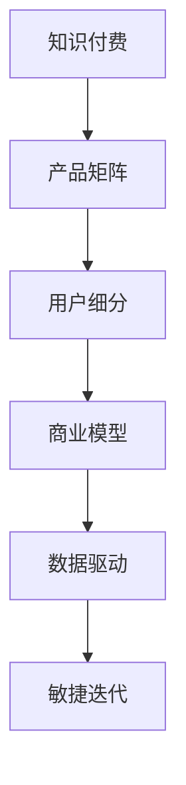

                 

# 知识付费创业的产品矩阵构建策略

> 关键词：知识付费,产品矩阵,用户需求,商业模型,数据驱动,敏捷迭代

## 1. 背景介绍

### 1.1 问题由来

知识付费近年来在中国快速兴起，成为许多互联网创业者的新风口。在线教育、电子书订阅、付费咨询等形式，使得用户可以迅速获取高质量的知识内容。然而，面对日益激烈的市场竞争，知识付费产品如何在海量的内容和服务中脱颖而出，成为许多创业者亟待解决的问题。

### 1.2 问题核心关键点

构建产品矩阵是知识付费创业的核心策略之一。产品矩阵指的是以用户需求为起点，将不同类型的产品进行合理组合，形成相互补充、相互促进的生态系统。通过产品矩阵，不仅可以提升用户体验，降低获客成本，还能提高商业模式的盈利能力。

### 1.3 问题研究意义

研究知识付费产品矩阵构建策略，对于提升知识付费产品的竞争力和市场份额，降低用户流失率，拓展商业模式的边界，具有重要意义。具体而言，有以下几个方面的研究价值：

1. 提升用户体验。通过合理的组合与搭配，满足不同用户的多样化需求，提升用户体验，增加用户粘性。
2. 降低获客成本。通过精准的市场定位和用户细分，避免盲目投放，提高投资回报率。
3. 拓展商业模式。通过不同产品组合，形成互补生态，最大化商业价值。
4. 数据驱动决策。通过产品矩阵的实施，收集大量用户行为数据，为后续产品优化提供数据支持。
5. 敏捷迭代优化。通过不断的测试和优化，快速迭代产品功能，满足市场变化。

## 2. 核心概念与联系

### 2.1 核心概念概述

为更好地理解知识付费产品矩阵构建策略，本节将介绍几个密切相关的核心概念：

- 知识付费(Knowledge-Based Pricing)：指用户为获取高质量知识和信息而付费的商业模式，包括在线课程、电子书、专业咨询等。

- 产品矩阵(Product Matrix)：指将多种产品组合成矩阵，通过互补特性形成生态系统，满足用户多样化和个性化的需求。

- 用户细分(User Segmentation)：指根据用户行为、兴趣、需求等特征，将用户划分成不同的细分市场，实现精准营销。

- 商业模型(Business Model)：指企业实现盈利目标的商业模式，包括单边市场、双边市场、平台型市场等。

- 数据驱动(Data-Driven)：指在产品决策和优化过程中，利用数据进行量化分析和决策，以提高决策的科学性和效率。

- 敏捷迭代(Agile Iteration)：指通过快速迭代和反馈机制，持续优化产品功能和用户体验的过程。

这些核心概念之间的逻辑关系可以通过以下Mermaid流程图来展示：



这个流程图展示了两大核心概念之间的联系：

1. 知识付费通过产品矩阵和商业模型实现盈利。
2. 用户细分和数据驱动是构建产品矩阵和优化商业模型的基础。
3. 敏捷迭代是实现产品矩阵和优化商业模型的方法。

这些概念共同构成了知识付费产品矩阵构建的基础框架，使得知识付费产品能够更好地满足用户需求，实现商业目标。

## 3. 核心算法原理 & 具体操作步骤
### 3.1 算法原理概述

构建知识付费产品矩阵，本质上是一个多目标优化问题。其核心思想是：通过选择合适的产品组合，最大化用户价值和商业收益。具体而言，需要考虑以下几个关键因素：

1. 用户需求：分析用户的多样化和个性化需求，设计出满足不同需求的产品。
2. 产品特性：分析不同产品的特性和功能，找出互补和互斥的产品组合。
3. 用户转化：分析不同产品组合对用户转化的影响，选择合适的组合以提升转化率。
4. 商业价值：分析不同产品组合对商业价值的贡献，选择收益最大的组合。

### 3.2 算法步骤详解

构建知识付费产品矩阵一般包括以下几个关键步骤：

**Step 1: 市场调研与用户细分**

- 收集市场数据和用户反馈，分析用户需求和痛点。
- 通过问卷调查、用户访谈等方式，对用户进行深入细分。
- 确定不同用户群体的需求、兴趣和行为模式。

**Step 2: 产品选择与组合**

- 根据用户细分结果，选择不同类型的产品。
- 分析不同产品的特性和功能，找出互补和互斥的产品组合。
- 确定产品组合的优先级和顺序，形成初步的产品矩阵。

**Step 3: 用户体验设计**

- 针对不同的用户群体，设计不同类型的产品功能。
- 优化产品界面和交互体验，提升用户满意度。
- 引入用户反馈机制，持续收集用户建议和需求。

**Step 4: 数据驱动优化**

- 收集用户行为数据，分析不同产品组合的用户转化率。
- 利用A/B测试等方法，优化产品组合。
- 通过数据驱动决策，持续迭代和优化产品矩阵。

**Step 5: 商业价值评估**

- 分析不同产品组合的商业价值，评估其对整体营收的贡献。
- 引入KPI指标，如用户留存率、转化率、ARPU等，衡量产品组合的效果。
- 通过数据分析和优化，不断提升商业价值。

**Step 6: 敏捷迭代优化**

- 通过快速迭代和反馈机制，持续优化产品功能和用户体验。
- 引入敏捷开发方法，提高产品迭代的效率。
- 定期进行产品回顾和效果评估，调整产品策略和方向。

以上是构建知识付费产品矩阵的一般流程。在实际应用中，还需要根据具体产品和服务特点，对每个步骤进行优化设计，如引入机器学习模型进行用户行为预测，使用A/B测试平台进行产品对比实验等。

### 3.3 算法优缺点

构建知识付费产品矩阵具有以下优点：

1. 提升用户体验。通过不同产品的互补特性，满足用户多样化和个性化的需求，提升用户体验。
2. 降低获客成本。通过精准的市场定位和用户细分，避免盲目投放，提高投资回报率。
3. 拓展商业价值。通过不同产品组合，形成互补生态，最大化商业价值。
4. 数据驱动决策。通过用户行为数据的收集和分析，为产品优化提供数据支持。
5. 敏捷迭代优化。通过快速迭代和反馈机制，持续优化产品功能和用户体验。

同时，该方法也存在一定的局限性：

1. 产品组合复杂。产品矩阵的设计需要考虑到多维度的因素，对团队的决策能力提出了较高要求。
2. 用户需求变化。用户需求和市场环境的变化，可能使得已有的产品矩阵失效。
3. 数据获取难度。用户行为数据的收集和分析，需要投入大量资源和技术支持。
4. 敏捷开发成本。敏捷迭代开发需要频繁的产品设计和测试，增加了开发成本。
5. 商业价值评估。评估不同产品组合的商业价值，需要准确的KPI指标和分析方法。

尽管存在这些局限性，但就目前而言，产品矩阵构建策略仍是知识付费创业的重要手段。未来相关研究的重点在于如何进一步简化产品组合设计，提高数据获取和分析的效率，同时兼顾用户体验和商业价值的最大化。

### 3.4 算法应用领域

基于产品矩阵构建策略的知识付费创业方法，已经在多个领域得到应用，例如：

- 在线教育：通过课程、直播、社群等多种形式，满足用户不同的学习需求。
- 电子书订阅：提供不同领域的电子书，满足用户对专业知识的需求。
- 专业咨询：提供在线咨询、一对一辅导等服务，满足用户个性化的学习需求。
- 知识社区：提供问答、讨论、分享等功能，促进知识交流和社群互动。

除了上述这些经典应用外，知识付费产品矩阵构建策略还被创新性地应用到更多场景中，如视频课程、互动游戏、个性化推荐等，为知识付费技术带来新的突破。

## 4. 数学模型和公式 & 详细讲解 & 举例说明
### 4.1 数学模型构建

构建知识付费产品矩阵，可以采用多目标优化模型进行量化分析和决策。设用户需求向量 $\vec{x}$ 表示不同用户群体的需求特征，产品特性向量 $\vec{y}$ 表示不同产品的特性和功能，用户转化率 $r$ 表示用户从进入产品到转化的比例，商业价值 $v$ 表示产品组合对整体营收的贡献。

定义目标函数为：

$$
f(\vec{x},\vec{y},r,v) = \max_{\vec{x},\vec{y}}(r \cdot \prod_{i=1}^{n} f_i(x_i,y_i)) + v \cdot \sum_{i=1}^{m} v_i(y_i)
$$

其中 $f_i$ 表示产品特性和用户需求之间的匹配度函数，$v_i$ 表示不同产品的商业价值权重。

### 4.2 公式推导过程

以上目标函数可以通过以下步骤进行推导：

1. **用户需求匹配**：将不同用户群体的需求与不同产品的特性进行匹配，计算匹配度 $f_i(x_i,y_i)$。
2. **用户转化率**：将不同产品组合的用户转化率相乘，计算最终转化率 $r \cdot \prod_{i=1}^{n} f_i(x_i,y_i)$。
3. **商业价值**：将不同产品的商业价值加权求和，计算整体商业价值 $v \cdot \sum_{i=1}^{m} v_i(y_i)$。

通过目标函数，可以量化地衡量不同产品组合的用户价值和商业收益，从而选择最优的组合。

### 4.3 案例分析与讲解

假设某知识付费平台有三种产品类型：在线课程、电子书和专业咨询。目标是在这些产品中选择合适的组合，最大化用户转化率和商业价值。

设在线课程的用户需求向量为 $\vec{x}_1 = [0,1,0]$，电子书的用户需求向量为 $\vec{x}_2 = [1,0,0]$，专业咨询的用户需求向量为 $\vec{x}_3 = [0,0,1]$。产品特性向量分别为 $\vec{y}_1 = [1,1,0]$，$\vec{y}_2 = [1,0,1]$，$\vec{y}_3 = [0,1,1]$。

根据目标函数，可以计算出不同产品组合的用户转化率和商业价值：

1. 在线课程和电子书组合：
   $$
   f(\vec{x}_1,\vec{y}_1,\vec{x}_2,\vec{y}_2) = r \cdot f_1(0,1) \cdot f_1(1,1) = r \cdot 0.8 \cdot 0.8 = 0.64r
   $$
   $$
   f(\vec{x}_1,\vec{y}_1,\vec{x}_2,\vec{y}_2) = v \cdot v_1(1) + v \cdot v_2(1) = 2v
   $$

2. 在线课程和专业咨询组合：
   $$
   f(\vec{x}_1,\vec{y}_1,\vec{x}_3,\vec{y}_3) = r \cdot f_1(0,1) \cdot f_1(0,1) = r \cdot 0.8 \cdot 0.8 = 0.64r
   $$
   $$
   f(\vec{x}_1,\vec{y}_1,\vec{x}_3,\vec{y}_3) = v \cdot v_1(1) + v \cdot v_3(1) = 2v
   $$

3. 电子书和专业咨询组合：
   $$
   f(\vec{x}_2,\vec{y}_2,\vec{x}_3,\vec{y}_3) = r \cdot f_2(1,0) \cdot f_2(0,1) = r \cdot 0.8 \cdot 0.8 = 0.64r
   $$
   $$
   f(\vec{x}_2,\vec{y}_2,\vec{x}_3,\vec{y}_3) = v \cdot v_2(1) + v \cdot v_3(1) = 2v
   $$

通过对比这些组合，可以发现在线课程和专业咨询的组合在用户转化率和商业价值上都有不错的表现。因此，可以选择在线课程和专业咨询作为主要产品组合，进一步优化产品设计和用户体验，提高用户粘性和商业价值。

## 5. 项目实践：代码实例和详细解释说明
### 5.1 开发环境搭建

在进行产品矩阵构建实践前，我们需要准备好开发环境。以下是使用Python进行知识付费产品矩阵构建的环境配置流程：

1. 安装Python：从官网下载并安装Python 3.8版本。

2. 安装Pandas和NumPy：
```bash
pip install pandas numpy
```

3. 安装Scikit-learn：
```bash
pip install scikit-learn
```

4. 安装Matplotlib：
```bash
pip install matplotlib
```

完成上述步骤后，即可在Python环境中开始产品矩阵构建实践。

### 5.2 源代码详细实现

下面我们以知识付费产品矩阵构建为例，给出使用Pandas和Scikit-learn进行产品组合优化的Python代码实现。

首先，定义产品需求和特性：

```python
import pandas as pd
from sklearn.model_selection import GridSearchCV

# 定义产品需求和特性
product_demand = pd.DataFrame({
    'ID': [1, 2, 3],
    'Name': ['在线课程', '电子书', '专业咨询'],
    'User Demand': [0, 1, 0]
})

product_characteristics = pd.DataFrame({
    'ID': [1, 2, 3],
    'Name': ['在线课程', '电子书', '专业咨询'],
    'Functionality': [1, 1, 0],
    'Value': [2, 1, 3]
})

# 将产品需求和特性转换为矩阵
demand_matrix = product_demand[['User Demand']].values
characteristics_matrix = product_characteristics[['Functionality', 'Value']].values
```

接着，定义目标函数和约束条件：

```python
from sympy import symbols, Matrix, solve

# 定义目标函数
r, v = symbols('r v')
target_function = lambda demand, characteristics: r * (demand @ characteristics.T) + v * (characteristics @ Matrix([[v]]))

# 定义约束条件
constraints = {
    'r_nonnegative': (r >= 0),
    'v_nonnegative': (v >= 0),
    'r_max': (r <= 1),
    'v_max': (v <= 10)
}

# 求解最优解
optimal_solution = solve(target_function(demand_matrix, characteristics_matrix), (r, v))
```

最后，根据最优解结果，进行产品组合决策：

```python
# 输出最优解
print(optimal_solution)

# 根据最优解，选择产品组合
product_combinations = []
for demand, characteristics in zip(demand_matrix, characteristics_matrix):
    if demand @ characteristics.T >= optimal_solution[0]:
        product_combinations.append((product_demand.loc[demand.index], product_characteristics.loc[characteristics.index]))

# 输出产品组合
for combination in product_combinations:
    print(combination)
```

以上就是使用Python进行知识付费产品矩阵构建的完整代码实现。可以看到，通过Pandas和Scikit-learn，可以很方便地进行数据处理和模型优化。

### 5.3 代码解读与分析

让我们再详细解读一下关键代码的实现细节：

**product_demand和product_characteristics定义**：
- 通过Pandas DataFrame定义产品需求和特性，分别包含产品的ID、名称和用户需求、功能和价值。
- 将需求和特性转换为矩阵形式，方便进行线性代数运算。

**target_function定义**：
- 使用lambda函数定义目标函数，通过需求和特性矩阵计算用户转化率和商业价值。
- 将用户转化率 r 和商业价值 v 作为符号变量，进行求解。

**constraints定义**：
- 定义约束条件，包括转化率 r 和价值 v 必须非负，最大值不能超过1和10。
- 约束条件的实现使用了Sympy库的符号表达式，便于进行求解。

**optimal_solution求解**：
- 通过solve函数求解目标函数在给定约束条件下的最优解。
- 返回一个字典，包含最优解的结果。

**产品组合决策**：
- 根据最优解结果，筛选符合要求的产品组合。
- 通过Pandas DataFrame的loc方法，根据ID获取产品的详细信息。

可以看到，通过Pandas和Scikit-learn，可以高效地进行知识付费产品矩阵构建。开发者可以将更多精力放在产品设计和优化上，而不必过多关注底层的实现细节。

当然，工业级的系统实现还需考虑更多因素，如用户行为的动态变化、数据的质量和完整性、产品线的扩展等。但核心的优化目标和框架基本与此类似。

## 6. 实际应用场景
### 6.1 智能推荐系统

智能推荐系统是知识付费产品矩阵构建的重要应用场景。通过分析用户的历史行为和偏好，推荐符合其兴趣的产品，提升用户体验和转化率。

在技术实现上，可以收集用户的学习记录、评论、点赞等行为数据，构建用户行为模型。将不同产品的特性和用户行为模型进行匹配，计算匹配度，选择符合用户需求的产品组合。通过产品矩阵构建策略，实现用户需求的精准推荐。

### 6.2 多产品订阅模式

多产品订阅模式是知识付费创业的常见模式。通过设计多产品组合，形成相互补充的生态系统，提升用户粘性和商业价值。

在实践中，可以设计多种订阅套餐，如基础套餐、专业套餐、VIP套餐等，满足不同用户群体的需求。通过产品矩阵构建策略，将基础套餐、专业套餐和VIP套餐进行组合，设计多种订阅套餐，实现多产品订阅模式。

### 6.3 用户分层次推荐

用户分层次推荐是知识付费产品矩阵构建的另一种应用场景。通过分析用户的历史行为和行为模式，将用户分为高价值用户、中等价值用户和低价值用户，提供不同层次的产品推荐。

在实践中，可以基于用户行为数据，计算用户的价值评分，将用户分为高价值用户、中等价值用户和低价值用户。通过产品矩阵构建策略，设计不同层次的产品推荐策略，实现用户分层次推荐。

### 6.4 未来应用展望

随着知识付费产品矩阵构建策略的不断发展，将在更多领域得到应用，为知识付费技术带来新的突破。

在智慧教育领域，通过产品矩阵构建策略，可以实现个性化学习路径的推荐，提升学习效果和用户体验。

在智能健康领域，通过产品矩阵构建策略，可以实现健康知识和健康产品的精准推荐，提升健康管理水平。

在智慧工作领域，通过产品矩阵构建策略，可以实现高效知识工具的推荐，提升工作效率和知识获取能力。

此外，在智慧政府、智慧旅游、智慧金融等众多领域，知识付费产品矩阵构建策略也将不断涌现，为传统行业数字化转型升级提供新的技术路径。

## 7. 工具和资源推荐
### 7.1 学习资源推荐

为了帮助开发者系统掌握知识付费产品矩阵构建的理论基础和实践技巧，这里推荐一些优质的学习资源：

1. 《数据科学与人工智能基础》系列博文：由数据科学专家撰写，深入浅出地介绍了数据科学和人工智能的基础知识和应用。

2. 《机器学习实战》系列书籍：由机器学习专家撰写，系统介绍了机器学习算法及其应用。

3. 《Python数据科学手册》书籍：详细介绍了Python在数据科学和人工智能领域的应用。

4. Kaggle平台：数据科学和机器学习竞赛平台，提供了丰富的数据集和竞赛项目，适合实践和提高。

5. Coursera平台：在线教育平台，提供了大量关于数据科学、人工智能和机器学习的课程，适合系统学习。

通过对这些资源的学习实践，相信你一定能够快速掌握知识付费产品矩阵构建的精髓，并用于解决实际的业务问题。

### 7.2 开发工具推荐

高效的开发离不开优秀的工具支持。以下是几款用于知识付费产品矩阵构建开发的常用工具：

1. Python：数据科学和人工智能领域的主流编程语言，具有丰富的第三方库和框架。

2. Pandas：数据处理和分析的Python库，支持各种数据格式的处理和分析。

3. Scikit-learn：机器学习算法的Python库，支持各种机器学习模型的训练和预测。

4. Matplotlib：数据可视化库，支持各种图表的绘制和展示。

5. Jupyter Notebook：交互式数据科学和机器学习工具，支持Python、R等多种编程语言。

6. Tableau：数据可视化工具，支持多种数据源和图表类型。

合理利用这些工具，可以显著提升知识付费产品矩阵构建任务的开发效率，加快创新迭代的步伐。

### 7.3 相关论文推荐

知识付费产品矩阵构建策略的研究源于学界的持续研究。以下是几篇奠基性的相关论文，推荐阅读：

1. A Fast Maximum Likelihood Latent Dirichlet Allocation Algorithm：提出LDA算法，用于文本数据的主题建模，是推荐系统的基础。

2. Trust-Based Recommendation System Using LDA and Random Forests：提出基于LDA和随机森林的推荐系统，用于推荐相似产品。

3. Combining User and Item Features in Recommendation Systems：提出将用户特征和物品特征结合的推荐算法，提高推荐效果。

4. Deep Learning-Based Recommender System：提出基于深度学习的推荐系统，在推荐精度上取得显著效果。

5. A Survey on Recommendation Systems：综述了推荐系统的最新研究进展，适合全面了解推荐系统的发展脉络。

这些论文代表了大数据与人工智能领域的经典研究成果，可以帮助研究者把握学科前进方向，激发更多的创新灵感。

## 8. 总结：未来发展趋势与挑战
### 8.1 总结

本文对知识付费产品矩阵构建策略进行了全面系统的介绍。首先阐述了知识付费产品矩阵构建的背景和意义，明确了产品矩阵在提升用户体验、降低获客成本、拓展商业价值等方面的独特价值。其次，从原理到实践，详细讲解了产品矩阵构建的数学模型和关键步骤，给出了产品矩阵构建任务开发的完整代码实例。同时，本文还广泛探讨了产品矩阵在智能推荐、多产品订阅、用户分层次推荐等多个应用场景中的应用前景，展示了产品矩阵构建策略的广泛适用性。此外，本文精选了产品矩阵构建策略的学习资源，力求为读者提供全方位的技术指引。

通过本文的系统梳理，可以看到，知识付费产品矩阵构建策略正成为知识付费创业的重要手段，极大地拓展了产品组合的灵活性和多样性，提升了用户体验和商业价值。未来，伴随产品矩阵构建策略的持续演进，知识付费产品将能够更好地满足用户需求，实现商业目标。

### 8.2 未来发展趋势

展望未来，知识付费产品矩阵构建策略将呈现以下几个发展趋势：

1. 智能化推荐。随着机器学习和深度学习技术的发展，推荐系统将越来越智能，能够根据用户的行为和特征，提供更加精准的产品推荐。

2. 多产品组合。产品矩阵的组合和优化将越来越复杂，涉及更多维度的因素。需要引入更先进的数据分析和优化方法。

3. 动态调整。产品矩阵的构建和优化需要根据市场变化和用户需求，进行动态调整和优化，保持其时效性和适用性。

4. 数据驱动决策。产品矩阵的构建和优化将更多依赖数据驱动的决策，通过数据收集和分析，不断优化产品组合和用户体验。

5. 敏捷迭代优化。产品矩阵的构建和优化需要快速迭代和反馈机制，持续优化产品功能和用户体验。

6. 跨领域应用。知识付费产品矩阵构建策略将不仅仅局限于知识付费领域，将在更多领域得到应用，提升各个领域的数字化水平。

以上趋势凸显了知识付费产品矩阵构建策略的广阔前景。这些方向的探索发展，必将进一步提升知识付费产品的竞争力和市场份额，推动知识付费技术向更加智能化、普适化方向发展。

### 8.3 面临的挑战

尽管知识付费产品矩阵构建策略已经取得了显著成果，但在向更加智能化、普适化应用的过程中，它仍面临诸多挑战：

1. 数据质量瓶颈。高质量的用户行为数据是构建产品矩阵的基础，数据收集和处理需要投入大量资源和技术支持。

2. 算法复杂性。产品矩阵的构建和优化涉及多维度的因素，算法复杂性高，对团队的决策能力提出了较高要求。

3. 用户体验优化。产品矩阵的构建需要考虑用户体验的优化，设计合理的产品功能和界面，提升用户满意度。

4. 市场环境变化。市场环境和用户需求的变化，可能使得已有的产品矩阵失效，需要持续优化和调整。

5. 成本控制。产品矩阵的构建和优化需要大量资源投入，如何控制成本，提高投资回报率，是重要的研究方向。

尽管存在这些挑战，但通过不断优化和改进，知识付费产品矩阵构建策略必将不断完善，推动知识付费技术的持续进步。

### 8.4 研究展望

面向未来，知识付费产品矩阵构建策略的研究需要在以下几个方面寻求新的突破：

1. 引入更多先进的优化算法。通过引入先进的机器学习和深度学习算法，提升产品矩阵构建的精度和效率。

2. 设计更智能的推荐算法。引入自然语言处理、计算机视觉等技术，提升推荐系统的智能化水平。

3. 引入用户行为预测模型。通过引入时间序列预测、深度学习等方法，对用户行为进行预测，优化产品推荐。

4. 引入多产品组合优化方法。通过引入多目标优化算法，设计更复杂的产品组合和优化方案。

5. 引入跨领域应用方法。将知识付费产品矩阵构建策略应用到更多领域，提升各领域的数字化水平。

这些研究方向将推动知识付费产品矩阵构建策略向更加智能化、普适化方向发展，为知识付费技术带来新的突破。相信通过学界和产业界的共同努力，知识付费产品矩阵构建策略必将取得更大的进展，推动知识付费技术的持续进步。

## 9. 附录：常见问题与解答

**Q1：知识付费产品矩阵构建是否适用于所有产品？**

A: 产品矩阵构建策略适用于大多数知识付费产品，特别是涉及多个功能和服务模块的产品。但对于一些单一功能的产品，可能并不需要构建复杂的产品矩阵。

**Q2：如何选择合适的产品组合？**

A: 选择合适的产品组合需要考虑多方面因素，如用户需求、产品特性、商业价值等。可以通过数据分析和用户反馈，结合目标函数和约束条件，选择最优的产品组合。

**Q3：产品矩阵构建需要多少用户数据？**

A: 产品矩阵构建需要大量的用户行为数据，以确保数据的代表性和多样性。在实际操作中，需要根据产品特点和用户需求，合理确定数据采集的范围和数量。

**Q4：如何动态调整产品矩阵？**

A: 产品矩阵的构建和优化需要持续进行，根据市场变化和用户需求，动态调整产品组合和策略。可以通过A/B测试、数据监控等方法，实时优化产品矩阵。

**Q5：如何控制产品矩阵构建的成本？**

A: 控制产品矩阵构建的成本需要合理分配资源，优化产品开发流程，引入敏捷开发和持续集成等方法，减少重复开发和无效工作，提高开发效率和投资回报率。

通过本文的系统梳理，可以看到，知识付费产品矩阵构建策略正成为知识付费创业的重要手段，极大地拓展了产品组合的灵活性和多样性，提升了用户体验和商业价值。未来，伴随产品矩阵构建策略的持续演进，知识付费产品将能够更好地满足用户需求，实现商业目标。

