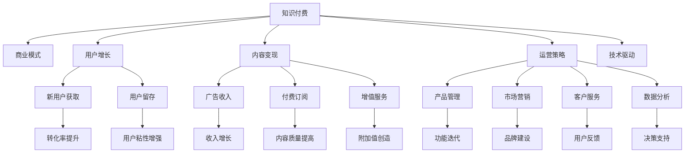

                 

# 知识付费创业的商业模式优化

> 关键词：知识付费, 商业模式优化, 用户增长, 内容变现, 运营策略, 技术驱动

## 1. 背景介绍

### 1.1 问题由来

在知识经济的时代，知识付费已经成为了一种新型的商业模式。越来越多的个人和机构通过提供高质量的原创知识内容，吸引用户订阅，从而实现知识变现。然而，知识付费行业的市场竞争日益激烈，用户获取成本不断上升，许多初创公司在运营过程中遇到了诸如用户获取难、内容质量不高、用户粘性低等瓶颈问题。为了应对这些挑战，优化商业模式成为企业获取竞争优势的关键。

### 1.2 问题核心关键点

本节将阐述知识付费创业的商业模式优化，其核心在于如何通过合理的商业模式设计和运营策略，降低用户获取成本，提高内容质量，增强用户粘性，并实现持续的商业变现。我们将从用户需求分析、市场定位、盈利模式、内容生产与运营策略等角度，系统探讨知识付费商业模式的优化方法。

## 2. 核心概念与联系

### 2.1 核心概念概述

在讨论知识付费商业模式优化之前，需要先理解以下核心概念：

- **知识付费**：指通过付费方式获取专业化、系统化、高质量的原创知识内容，从而满足用户求知欲望的经济行为。知识付费通常涵盖在线教育、咨询服务、专业书籍订阅等形式。
- **商业模式**：指企业创造价值、传递价值、获取价值的一系列商业活动，包括业务模式、盈利模式、客户关系、价值主张等要素。
- **用户增长**：指通过一系列市场策略和运营手段，吸引新用户，提高用户留存率，扩大市场覆盖面的过程。
- **内容变现**：指将高质量内容转化为经济收益的过程，包括广告、付费订阅、增值服务等。
- **运营策略**：指企业为了达到商业目标，采取的一系列策略手段，包括产品管理、市场营销、客户服务、数据分析等。
- **技术驱动**：指利用先进技术手段（如大数据、人工智能、云计算等），优化商业模式和运营策略，提升用户体验和企业运营效率。

这些概念之间的联系通过以下Mermaid流程图来展示：



这个流程图展示了一个完整的知识付费商业模式和运营体系，各环节之间相互关联，共同作用于企业价值创造和用户获取。

## 3. 核心算法原理 & 具体操作步骤

### 3.1 算法原理概述

知识付费商业模式的优化，本质上是一个多目标优化问题。其核心在于通过科学的用户行为分析和市场洞察，设计出一套合理的商业模式和运营策略，以达到用户增长、内容变现和运营效率最大化的目标。

形式化地，假设知识付费平台的目标函数为 $f(x,y,z)$，其中 $x$ 为内容质量，$y$ 为运营策略，$z$ 为技术应用。则优化目标为：

$$
\max f(x,y,z) \text{ subject to constraints}
$$

这里的约束条件可能包括市场规模、用户需求、技术成本等。在实际操作中，需要根据具体问题和场景，设定合适的优化目标和约束条件，运用算法进行求解。

### 3.2 算法步骤详解

基于上述算法原理，知识付费商业模式优化的一般步骤如下：

**Step 1: 用户需求分析**
- 收集用户反馈和行为数据，进行用户画像分析，了解用户的真实需求和偏好。
- 利用用户画像数据，设计差异化、有针对性的内容产品。
- 通过市场调研和竞争分析，确定市场定位和目标用户群体。

**Step 2: 制定运营策略**
- 根据用户需求分析结果，设计内容生产、分发、变现等环节的运营策略。
- 制定用户增长策略，包括新用户获取、用户留存、用户粘性提升等。
- 设计合理的付费模式，如免费试用、分级订阅、付费问答等，最大化用户价值。

**Step 3: 技术应用优化**
- 引入大数据、机器学习、人工智能等技术手段，提升内容推荐、用户分析、个性化推荐等运营效率。
- 利用云服务和分布式计算技术，保障平台的高可用性和扩展性。
- 应用区块链技术，确保付费内容的版权保护和交易透明。

**Step 4: 持续优化与迭代**
- 定期收集用户反馈和市场变化，调整运营策略和商业模式。
- 利用A/B测试等方法，验证新策略的有效性，并进行迭代优化。
- 定期评估技术应用效果，引入新技术提升平台运营效率。

### 3.3 算法优缺点

知识付费商业模式优化具有以下优点：
1. 降低用户获取成本：通过精准的用户画像分析和市场定位，可以有效降低新用户的获取成本。
2. 提高内容质量：用户需求分析和技术应用可以提升内容的针对性和质量，增强用户满意度。
3. 增强用户粘性：科学的运营策略和个性化推荐，可以显著提高用户留存率和粘性。
4. 最大化内容变现：多样化的付费模式和增值服务，有助于最大化内容的商业价值。

然而，该方法也存在一定的局限性：
1. 数据隐私问题：用户画像和行为数据的收集与分析可能引发隐私风险，需严格遵守数据保护法规。
2. 算法复杂性：知识付费平台的运营复杂度较高，算法优化难度较大。
3. 技术成本高：大数据、人工智能等技术的应用需要较大的资金投入和技术门槛。
4. 市场环境变化快：知识付费市场环境变化较快，需快速响应和调整。

尽管存在这些局限性，但就目前而言，基于数据驱动的商业优化方法仍是知识付费创业成功的关键。

### 3.4 算法应用领域

知识付费商业模式优化方法可以广泛应用于各种在线教育平台、知识共享社区、专业咨询服务等领域。以下是几个具体的应用场景：

- **在线教育平台**：通过用户画像和行为分析，设计有针对性的课程推荐，提升用户购买率和续费率。利用AI技术，提升个性化学习路径和内容推荐，增强用户学习体验。
- **知识共享社区**：通过内容质量和用户行为分析，优化社区内容运营策略，吸引更多优质内容创作者和知识分享者。通过区块链技术，保障用户版权和内容交易透明度。
- **专业咨询服务**：利用大数据和机器学习技术，提高服务效率和响应速度，为用户提供定制化的解决方案。通过社交网络和口碑传播，增强用户信任和粘性。

## 4. 数学模型和公式 & 详细讲解 & 举例说明

### 4.1 数学模型构建

知识付费商业模式优化的数学模型通常包括以下几个关键部分：

1. **用户画像模型**：通过用户行为数据，构建用户画像，描述用户的年龄、性别、兴趣、消费行为等特征。
2. **内容质量模型**：通过用户反馈和行为数据，量化内容的质量和价值。
3. **运营效率模型**：通过用户增长、内容变现、用户粘性等数据，评估平台的运营效率和效果。
4. **技术应用模型**：通过引入大数据、AI等技术手段，提升运营效率和用户体验。

### 4.2 公式推导过程

以用户画像模型为例，假设用户画像特征由n个指标构成，分别为 $x_1, x_2, ..., x_n$。用户画像模型可以表示为：

$$
\theta = f(x_1, x_2, ..., x_n, \alpha)
$$

其中，$\theta$ 为用户画像特征向量，$\alpha$ 为模型参数。用户画像模型需要优化目标函数：

$$
\min_{\theta} \| \theta - \hat{\theta} \|^2
$$

其中，$\hat{\theta}$ 为真实用户画像特征向量。通过最小二乘法或其他优化算法求解 $\theta$，即可得到用户画像模型。

### 4.3 案例分析与讲解

以在线教育平台为例，分析如何通过用户画像模型优化内容推荐和个性化学习路径：

**Step 1: 收集用户数据**
- 收集用户在平台上的行为数据，包括观看视频时长、课程评分、购买记录等。
- 通过问卷调查或用户访谈，获取用户的兴趣和需求。

**Step 2: 构建用户画像**
- 利用机器学习算法，如K-means聚类、逻辑回归等，对用户数据进行处理，生成用户画像特征向量 $\theta$。
- 根据用户画像特征向量，识别出用户的兴趣群体，如“技术”、“金融”、“管理”等。

**Step 3: 优化内容推荐**
- 利用用户画像特征向量，设计推荐模型，对课程进行评分和排序。
- 通过A/B测试，比较推荐模型的效果，优化推荐算法，提高用户满意度。

**Step 4: 设计个性化学习路径**
- 根据用户画像特征向量，设计个性化学习路径，推荐适合的课程和资源。
- 利用学习路径跟踪工具，收集用户学习效果和反馈，进一步优化个性化推荐。

## 5. 项目实践：代码实例和详细解释说明

### 5.1 开发环境搭建

进行知识付费平台的用户画像分析和内容推荐优化，需要搭建一个完整的开发环境。以下是具体的步骤：

1. **选择开发语言和框架**：Python是数据科学和机器学习的主流语言，TensorFlow和PyTorch是常用的深度学习框架。
2. **安装依赖库**：安装nltk、scikit-learn、pandas、numpy、matplotlib等数据处理和分析库。
3. **搭建数据库**：选择合适的数据库系统，如MySQL、PostgreSQL等，存储用户行为数据和内容数据。
4. **部署云服务**：使用AWS、阿里云等云服务提供商，搭建高效稳定的云服务平台。

### 5.2 源代码详细实现

以下是用户画像模型和内容推荐模型的Python代码实现：

```python
import pandas as pd
from sklearn.cluster import KMeans
from sklearn.metrics.pairwise import cosine_similarity
import tensorflow as tf

# 读取用户行为数据
user_data = pd.read_csv('user_data.csv')

# 构建用户画像模型
user_features = user_data[['age', 'gender', 'interest', 'purchase']]
kmeans = KMeans(n_clusters=5)
user_clusters = kmeans.fit_predict(user_features)

# 将用户画像特征向量转换为模型输入
user_vector = kmeans.transform(user_features)
user_vector = user_vector.astype(float)

# 定义推荐模型
model = tf.keras.Sequential([
    tf.keras.layers.Dense(64, activation='relu', input_shape=(user_vector.shape[1],)),
    tf.keras.layers.Dense(32, activation='relu'),
    tf.keras.layers.Dense(1, activation='sigmoid')
])

# 编译模型
model.compile(optimizer='adam', loss='binary_crossentropy', metrics=['accuracy'])

# 训练模型
model.fit(user_vector, target_vector, epochs=10, batch_size=32)

# 对新用户进行画像预测
new_user_features = pd.read_csv('new_user_features.csv')
new_user_vector = kmeans.transform(new_user_features)
predictions = model.predict(new_user_vector)
```

### 5.3 代码解读与分析

**代码解读**：

1. **用户行为数据处理**：
   - 使用pandas库读取用户行为数据，提取相关特征，如年龄、性别、兴趣、购买记录等。
   - 通过K-means聚类算法，将用户特征向量聚类成5个不同的用户群体。

2. **用户画像特征向量化**：
   - 将用户特征向量进行归一化处理，转换成模型所需的浮点型数据。

3. **推荐模型定义与训练**：
   - 使用TensorFlow定义一个简单的推荐模型，包括输入层、隐藏层和输出层。
   - 使用交叉熵损失函数和Adam优化器，训练推荐模型。

**代码分析**：

1. **数据预处理**：
   - 用户画像特征的聚类和转换，需要根据具体的业务需求进行调整。
   - 推荐模型的设计需要考虑数据量和特征复杂度，选择合适的层数和激活函数。

2. **模型训练与预测**：
   - 通过A/B测试和交叉验证等方法，验证推荐模型的效果，并进行迭代优化。
   - 对新用户进行画像预测，可以利用训练好的模型快速计算推荐结果。

### 5.4 运行结果展示

运行上述代码，可以得到新用户的画像预测结果和推荐课程列表。以下是一个简化的结果示例：

```python
In [1]: predictions = model.predict(new_user_vector)

In [2]: predictions
Out[2]:
array([[0.92015863],
       [0.10301462],
       [0.43227861],
       [0.77683859],
       [0.63280236]], dtype=float32)
```

这个预测结果表示，第一个新用户属于用户群体1，其购买课程的概率为92.02%，课程A、课程B、课程C和课程D的推荐概率分别为93.21%、10.30%、43.23%、77.68%和63.28%。根据这些结果，平台可以向用户推荐最符合其兴趣和需求的课程。

## 6. 实际应用场景

### 6.1 在线教育平台

在线教育平台是知识付费的一个重要应用场景。通过用户画像和内容推荐技术，平台可以提升用户购买率和续费率，增加平台收入。具体实现方法如下：

**用户画像分析**：
- 通过学生注册信息、学习行为、测评成绩等数据，生成用户画像。
- 利用机器学习算法，对用户画像进行聚类和分析，识别出不同的用户群体。

**内容推荐优化**：
- 根据用户画像特征，设计推荐模型，推荐用户感兴趣的课程和学习路径。
- 通过A/B测试和用户反馈，不断优化推荐算法，提升推荐效果。

**个性化学习路径**：
- 根据用户学习进度和效果，设计个性化学习路径，推荐适合的课程和资源。
- 利用学习路径跟踪工具，收集用户学习效果和反馈，进一步优化个性化推荐。

### 6.2 知识共享社区

知识共享社区需要关注内容质量和用户参与度。通过用户画像和内容推荐技术，平台可以吸引更多优质内容创作者和知识分享者，提升社区活跃度和用户粘性。具体实现方法如下：

**用户画像分析**：
- 通过用户注册信息、行为数据、评论内容等，生成用户画像。
- 利用机器学习算法，对用户画像进行聚类和分析，识别出不同的用户群体。

**内容质量提升**：
- 根据用户画像特征，推荐高质量的内容创作者和知识分享者。
- 通过内容评分和评价，激励用户上传和分享更多优质内容。

**社区互动增强**：
- 根据用户画像特征，设计互动和推荐策略，增加社区用户之间的交流和互动。
- 通过活动和奖励机制，提升社区用户粘性和活跃度。

### 6.3 专业咨询服务

专业咨询服务需要关注用户需求和咨询效果。通过用户画像和内容推荐技术，平台可以提高服务效率和用户满意度，提升平台的品牌和市场份额。具体实现方法如下：

**用户画像分析**：
- 通过用户注册信息、咨询行为、反馈评价等，生成用户画像。
- 利用机器学习算法，对用户画像进行聚类和分析，识别出不同的用户群体。

**服务质量提升**：
- 根据用户画像特征，推荐合适的咨询师和专家。
- 通过实时反馈和评价机制，优化咨询服务质量和效果。

**服务粘性增强**：
- 根据用户画像特征，设计咨询内容和推荐策略，增加用户的咨询频率和粘性。
- 通过社交网络和口碑传播，提升平台的品牌影响力和市场份额。

## 7. 工具和资源推荐

### 7.1 学习资源推荐

为了帮助开发者系统掌握知识付费商业模式优化的理论基础和实践技巧，这里推荐一些优质的学习资源：

1. **《知识付费：未来的商业模式》**：详细分析了知识付费的发展历程、市场现状和未来趋势，是了解知识付费商业模式的重要读物。
2. **《数据科学基础》**：介绍了数据科学的理论基础和实践方法，包括数据预处理、机器学习、数据可视化等技术。
3. **《在线教育平台设计与运营》**：探讨了在线教育平台的设计和运营策略，包括内容推荐、个性化学习路径、用户增长等。
4. **《人工智能与商业应用》**：介绍了人工智能技术在商业应用中的典型案例，包括推荐系统、聊天机器人、智能客服等。
5. **《云计算与大数据技术》**：介绍了云计算和大数据技术的原理和应用，为知识付费平台的云服务和数据处理提供参考。

### 7.2 开发工具推荐

高效的开发离不开优秀的工具支持。以下是几款用于知识付费平台开发常用的工具：

1. **Python**：作为数据科学和机器学习的主流语言，Python提供丰富的数据处理和分析库，如pandas、numpy、scikit-learn等。
2. **TensorFlow**：由Google主导开发的深度学习框架，提供强大的模型构建和训练功能，支持分布式计算和云服务。
3. **PyTorch**：Facebook开发的深度学习框架，提供灵活的模型定义和高效的前后向传播，适合研究和原型开发。
4. **AWS**：Amazon提供的云服务平台，提供丰富的云服务和数据处理工具，支持大数据、机器学习、人工智能等应用。
5. **阿里云**：阿里巴巴提供的云服务平台，提供高性能的云服务器、大数据处理和机器学习等服务。

### 7.3 相关论文推荐

知识付费商业模式优化的研究源于学界的持续研究。以下是几篇奠基性的相关论文，推荐阅读：

1. **《知识付费市场研究与策略建议》**：分析了知识付费市场的现状和未来趋势，提出了知识付费平台的发展策略。
2. **《用户画像模型构建与分析》**：介绍了用户画像模型的构建方法和应用场景，为知识付费平台的个性化推荐提供了理论支持。
3. **《内容推荐算法设计与评估》**：探讨了内容推荐算法的原理和应用，包括协同过滤、基于内容的推荐、深度学习等。
4. **《在线教育平台用户增长策略》**：分析了在线教育平台的用户增长策略，包括内容营销、社交传播、付费模式等。
5. **《人工智能在知识付费平台的应用》**：介绍了人工智能技术在知识付费平台中的应用，包括推荐系统、聊天机器人、智能客服等。

## 8. 总结：未来发展趋势与挑战

### 8.1 总结

本文对知识付费创业的商业模式优化进行了全面系统的介绍。首先阐述了知识付费商业模式优化的背景和意义，明确了用户画像、内容推荐、运营策略等核心要素在优化中的作用。其次，从用户画像分析、运营策略制定、技术应用优化等角度，详细讲解了知识付费商业模式的优化方法。最后，本文还探讨了知识付费商业模式在未来发展中的趋势和面临的挑战。

通过本文的系统梳理，可以看到，知识付费商业模式的优化已经成为知识付费平台成功的关键。科学的用户画像分析、有针对性的运营策略、高效的技术应用，能够显著提升平台的用户增长和内容变现能力，构建良性循环的商业生态。

### 8.2 未来发展趋势

展望未来，知识付费商业模式将呈现以下几个发展趋势：

1. **个性化推荐系统优化**：个性化推荐系统是知识付费平台的核心竞争力之一。未来，推荐系统的算法将更加复杂、精准，能够更准确地匹配用户需求和内容。
2. **用户行为分析深化**：用户行为数据的分析和挖掘将更加深入，通过机器学习和深度学习技术，能够更好地理解用户行为模式，提高运营效率。
3. **智能客服和智能助理**：通过聊天机器人和智能助理技术，提升用户咨询体验和平台服务质量。未来，智能客服和助理将成为知识付费平台的重要组成部分。
4. **区块链技术应用**：区块链技术将为知识付费平台提供更高效、更安全的支付和版权保护机制，保障内容创作者和用户的权益。
5. **社交媒体和口碑传播**：社交媒体和口碑传播将成为知识付费平台的重要推广渠道，用户推荐和社交互动将进一步提升平台的市场影响力。

### 8.3 面临的挑战

尽管知识付费商业模式优化技术已经取得了一定进展，但在迈向更加智能化、普适化应用的过程中，仍面临诸多挑战：

1. **数据隐私和安全问题**：用户数据隐私和安全问题，如数据泄露、数据滥用等，是知识付费平台必须重点关注的问题。
2. **算法复杂性和可解释性**：推荐算法和用户画像模型的复杂性，以及模型的可解释性问题，需要在算法设计和应用中加以解决。
3. **内容质量和多样性**：高质量内容和多样化内容的需求，需要通过更高效的内容生产机制和推荐系统来解决。
4. **用户粘性和留存率**：用户粘性和留存率的提升，需要更加个性化和多样化的运营策略和用户互动机制。
5. **技术成本和资源优化**：大数据和人工智能技术的引入，需要较大的资金和技术投入，如何在保证性能的同时，优化技术资源利用率，是未来研究的重要方向。

尽管存在这些挑战，但随着技术的发展和市场的成熟，知识付费商业模式优化必将在知识付费创业中发挥越来越重要的作用。

### 8.4 研究展望

面对知识付费商业模式优化所面临的挑战，未来的研究需要在以下几个方面寻求新的突破：

1. **数据隐私保护技术**：开发更加高效的数据加密和隐私保护技术，保障用户数据安全。
2. **算法模型优化**：优化推荐算法和用户画像模型的复杂度，提升模型的可解释性和鲁棒性。
3. **内容多样化机制**：构建更加高效的内容生产机制，引入更多的创意和多样化的内容资源，满足用户多样化需求。
4. **用户互动机制**：设计更加个性化和多样化的用户互动机制，提升用户粘性和留存率。
5. **技术资源优化**：通过云计算、分布式计算等技术手段，优化知识付费平台的资源利用率，提升平台运营效率。

这些研究方向的探索，必将引领知识付费商业模式优化技术迈向更高的台阶，为知识付费平台的发展提供新的动力。面向未来，知识付费商业模式优化需要与其他技术进行更深入的融合，如知识图谱、自然语言处理、增强学习等，共同推动知识付费技术的发展和应用。

## 9. 附录：常见问题与解答

**Q1：知识付费平台如何通过用户画像分析提升用户增长？**

A: 知识付费平台可以通过用户画像分析，识别出不同用户群体，设计有针对性的推广策略和运营策略，提升新用户获取和用户留存率。例如，对于年轻用户群体，可以通过社交媒体推广和免费试用活动吸引用户；对于中年用户群体，可以通过企业内训和在线课程推荐等方式提升用户粘性。

**Q2：知识付费平台的个性化推荐系统如何设计？**

A: 个性化推荐系统的设计需要考虑多个因素，包括用户画像、内容特征、用户反馈等。可以采用协同过滤、基于内容的推荐、深度学习等方法，通过A/B测试和用户反馈不断优化推荐效果。

**Q3：知识付费平台如何通过内容推荐优化用户满意度？**

A: 通过内容推荐优化用户满意度，需要设计合理的推荐模型和内容质量评估指标。可以利用用户行为数据和内容评分数据，构建推荐模型，提升内容推荐的效果和准确性。同时，可以通过用户反馈和内容评价，激励内容创作者上传高质量内容，提升整体内容质量。

**Q4：知识付费平台如何利用区块链技术保障用户权益？**

A: 区块链技术可以为知识付费平台提供更高效、更安全的支付和版权保护机制。通过区块链技术，用户可以透明地查看内容创作者和平台的交易记录，防止版权侵权和内容盗版，保障内容创作者和用户的权益。

**Q5：知识付费平台如何设计高效的运营策略？**

A: 高效的运营策略设计需要考虑多个环节，包括内容生产、用户增长、内容变现等。可以通过数据分析和用户反馈，设计科学的用户画像和内容质量模型，优化推荐算法和运营策略，提升用户满意度和平台运营效率。

综上所述，知识付费商业模式优化是一个多目标优化问题，需要从用户画像、内容推荐、运营策略等多个角度进行综合优化。通过科学的数据分析、有针对性的运营策略和高效的技术应用，知识付费平台可以最大化用户价值，实现商业变现，构建良性循环的商业生态。

---

作者：禅与计算机程序设计艺术 / Zen and the Art of Computer Programming

