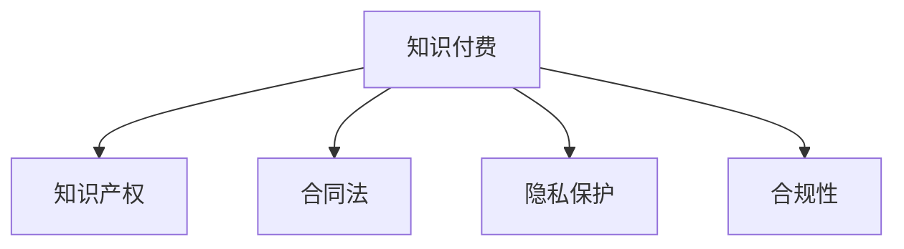

                 

# 知识付费创业的法律风险防范

> 关键词：知识付费、创业、法律风险、知识产权、隐私保护、合同法、用户数据保护、合规性

## 1. 背景介绍

### 1.1 问题由来

随着互联网和移动技术的飞速发展，知识付费模式已成为一种流行的内容消费方式。在这种模式下，用户可以通过支付一定的费用，获取专家、学者、机构等提供的深度知识、技能培训、行业分析等内容。这一模式不仅满足了用户对于高质量知识的需求，也为内容创作者提供了新的收入来源，推动了内容产业的发展。

然而，在知识付费领域，创业公司面临着一系列法律风险，包括但不限于知识产权侵权、合同纠纷、隐私保护问题、合规性问题等。这些问题如果处理不当，不仅会影响公司的正常运营，还可能引发法律诉讼，甚至导致公司倒闭。因此，了解并防范这些法律风险对于知识付费创业公司来说至关重要。

### 1.2 问题核心关键点

知识付费创业涉及的法律问题复杂多样，主要包括：

1. **知识产权侵权**：包括版权、专利、商标等多个方面的侵权风险。
2. **合同法问题**：涉及用户合同、服务合同、合作合同等多个方面。
3. **隐私保护**：涉及用户数据的收集、存储、使用等方面。
4. **合规性问题**：包括但不限于数据隐私保护法规、反垄断法规、反不正当竞争法等。

本文将从这些关键点出发，系统分析知识付费创业可能面临的法律风险，并提出相应的防范措施。

## 2. 核心概念与联系

### 2.1 核心概念概述

为更好地理解知识付费创业的法律风险防范，本节将介绍几个密切相关的核心概念：

- **知识付费**：用户为获取特定知识和信息而支付费用的商业模式。
- **知识产权**：指创作者对其创作的知识成果享有的专有权利，包括版权、专利、商标等。
- **合同法**：调整平等主体间的私法关系，规范合同订立、履行、变更、解除、终止等行为的法律规范。
- **隐私保护**：指保护个人信息不被非法收集、使用、公开的法律制度。
- **合规性**：指公司运营中遵守法律、法规、行业标准等的要求。

这些核心概念之间的逻辑关系可以通过以下Mermaid流程图来展示：



这个流程图展示了几大核心概念之间的相互关系：

1. 知识付费的运作涉及知识产权的保护。
2. 合同法规范了知识付费平台与用户、创作者之间的权利义务关系。
3. 隐私保护是知识付费创业中必须遵守的法律法规。
4. 合规性是公司运营中必须遵守的广泛要求，包括但不限于数据隐私、反垄断等方面。

## 3. 核心算法原理 & 具体操作步骤

### 3.1 算法原理概述

知识付费创业的法律风险防范，本质上是一个多目标优化的过程。其核心思想是：通过系统分析创业过程中可能遇到的法律风险，设计一套综合性的风险管理策略，最大化公司的运营效率和用户满意度，同时最小化法律风险。

形式化地，假设知识付费创业过程中面临的法律风险集合为 $\mathcal{R}$，每个风险 $r \in \mathcal{R}$ 的潜在损失为 $L(r)$。风险管理的目标是找到最优的风险管理策略 $\sigma$，使得总风险损失最小：

$$
\sigma^* = \mathop{\arg\min}_{\sigma} \sum_{r \in \mathcal{R}} L(r) \cdot \sigma(r)
$$

其中 $\sigma(r)$ 表示对风险 $r$ 的管理力度，其取值范围通常在 $[0, 1]$ 之间，值越大表示管理力度越强。

### 3.2 算法步骤详解

基于多目标优化的方法，知识付费创业的法律风险防范一般包括以下几个关键步骤：

**Step 1: 风险识别与评估**
- 识别所有可能影响知识付费创业的法律风险，包括但不限于知识产权侵权、合同纠纷、隐私保护问题、合规性问题等。
- 对每个风险进行评估，量化其潜在损失和发生概率，生成风险矩阵。

**Step 2: 风险管理策略设计**
- 设计多种风险管理策略，包括但不限于风险规避、风险转移、风险缓解等。
- 对每项策略的实施成本和预期效果进行评估，选择最优策略。

**Step 3: 风险监测与调整**
- 实时监测风险状态，及时发现并处理潜在问题。
- 根据风险变化调整管理策略，确保风险管理措施的有效性。

**Step 4: 风险报告与反馈**
- 定期生成风险报告，向公司高层和相关利益方通报风险状况。
- 根据反馈意见调整风险管理策略，优化风险管理过程。

### 3.3 算法优缺点

知识付费创业的法律风险防范方法具有以下优点：
1. 系统全面。通过多目标优化的方法，全面考虑各种法律风险，避免单一视角带来的局限性。
2. 动态调整。实时监测风险状态，根据实际情况动态调整管理策略，提高风险管理的灵活性。
3. 综合效益。在风险管理过程中，兼顾公司的运营效率和用户满意度，实现多目标优化。

同时，该方法也存在一定的局限性：
1. 复杂度高。风险识别、评估和管理涉及多个领域，方法复杂。
2. 成本较高。设计和实施风险管理策略需要投入大量时间和资源。
3. 依赖信息。风险管理的效果高度依赖于信息准确性和全面性。

尽管存在这些局限性，但就目前而言，这种综合性的风险管理方法仍是目前知识付费创业风险防范的主流范式。未来相关研究的重点在于如何进一步简化风险管理流程，降低成本，同时提高信息获取的效率和准确性。

### 3.4 算法应用领域

知识付费创业的法律风险防范方法在多个领域得到了广泛的应用，包括但不限于：

1. **教育科技**：平台提供在线教育服务，涉及版权、隐私保护等法律问题。
2. **内容创作**：平台提供内容付费服务，涉及版权归属、用户授权等法律问题。
3. **智能咨询**：平台提供专家咨询服务，涉及隐私保护、合同法等法律问题。
4. **数字出版**：平台提供电子书、有声书等数字出版服务，涉及版权、反盗版等法律问题。

除了上述这些经典应用外，知识付费创业的法律风险防范方法也将被创新性地应用到更多场景中，如智慧医疗、企业培训、金融理财等，为相关行业的健康发展提供保障。

## 4. 数学模型和公式 & 详细讲解  
### 4.1 数学模型构建

本节将使用数学语言对知识付费创业的法律风险防范过程进行更加严格的刻画。

假设知识付费创业过程中面临的法律风险集合为 $\mathcal{R}$，每个风险 $r \in \mathcal{R}$ 的潜在损失为 $L(r)$，风险管理策略的实施成本为 $C(\sigma)$，风险管理的效果为 $E(\sigma)$。

定义风险管理的目标函数为：

$$
\min_{\sigma} \sum_{r \in \mathcal{R}} L(r) \cdot \sigma(r) + \lambda \cdot C(\sigma)
$$

其中 $\lambda$ 为风险管理策略的实施成本权重，取值通常在 $[0, 1]$ 之间。

### 4.2 公式推导过程

以下我们以知识产权侵权风险为例，推导风险管理的目标函数及其梯度计算公式。

假设知识产权侵权风险的潜在损失为 $L(r)$，风险管理策略的实施成本为 $C(\sigma)$，则风险管理的目标函数为：

$$
\min_{\sigma} L(r) \cdot \sigma(r) + \lambda \cdot C(\sigma)
$$

对其进行求导，得：

$$
\frac{\partial}{\partial \sigma(r)}[L(r) \cdot \sigma(r) + \lambda \cdot C(\sigma)] = L(r) - \sigma(r) \cdot \frac{\partial L(r)}{\partial \sigma(r)} + \lambda \cdot \frac{\partial C(\sigma)}{\partial \sigma(r)}
$$

其中 $\frac{\partial L(r)}{\partial \sigma(r)}$ 为损失函数对风险管理策略的导数，$\frac{\partial C(\sigma)}{\partial \sigma(r)}$ 为成本函数对风险管理策略的导数。

在得到目标函数的梯度后，即可带入风险管理策略的更新公式，完成策略的迭代优化。重复上述过程直至收敛，最终得到最优的风险管理策略 $\sigma^*$。

## 5. 项目实践：代码实例和详细解释说明
### 5.1 开发环境搭建

在进行法律风险防范实践前，我们需要准备好开发环境。以下是使用Python进行代码实现的开发环境配置流程：

1. 安装Python：从官网下载并安装最新版本的Python。
2. 安装相关库：安装必要的Python库，如numpy、pandas、matplotlib、scipy等。
3. 准备数据集：收集并整理知识付费创业过程中可能遇到的各种法律风险数据，如版权侵权案例、合同纠纷案例、隐私保护案例等。
4. 安装Jupyter Notebook：使用Jupyter Notebook进行代码编写和数据处理，支持多种编程语言和库的混合使用。

完成上述步骤后，即可在Jupyter Notebook中开始法律风险防范的代码实现。

### 5.2 源代码详细实现

下面我们以知识产权侵权风险为例，给出使用Python进行法律风险防范的代码实现。

首先，定义风险识别与评估函数：

```python
import numpy as np
import pandas as pd

def risk_evaluation(risk_data):
    # 风险识别
    risks = risk_data['risk_type'].unique().tolist()
    
    # 风险评估
    loss_matrix = risk_data[['risk_type', 'potential_loss', 'probability']].pivot_table(index='risk_type', columns='risk_type', values='probability')
    loss_matrix.fillna(0, inplace=True)
    loss_matrix = np.power(loss_matrix, 2)  # 平方损失
    loss_matrix /= np.sum(loss_matrix, axis=1, keepdims=True)  # 标准化
    
    return risks, loss_matrix
```

然后，定义风险管理策略设计函数：

```python
def strategy_design(loss_matrix, cost_matrix):
    num_risks = loss_matrix.shape[0]
    num_strategies = 10  # 策略数量
    num_periods = 5  # 周期数量
    
    # 初始化策略矩阵
    strategy_matrix = np.zeros((num_risks, num_strategies, num_periods))
    strategy_matrix[:, :, 0] = 1
    
    # 策略优化
    for period in range(num_periods):
        for strategy in range(num_strategies):
            # 计算策略成本
            cost = np.dot(strategy_matrix[:, strategy, period - 1], cost_matrix)
            
            # 计算策略效果
            effect = np.dot(loss_matrix, strategy_matrix[:, strategy, period - 1])
            
            # 更新策略矩阵
            strategy_matrix[:, strategy, period] = cost - strategy_matrix[:, strategy, period - 1] * (cost + effect)
    
    return strategy_matrix
```

接着，定义风险监测与调整函数：

```python
def risk_monitoring(strategy_matrix, new_data):
    # 计算策略效果
    effect = np.dot(strategy_matrix[:, :, -1], loss_matrix)
    
    # 计算策略成本
    cost = np.dot(strategy_matrix[:, :, -1], cost_matrix)
    
    # 判断策略效果和成本是否优化
    if effect < previous_effect and cost < previous_cost:
        print('Risk management strategy optimized.')
    else:
        print('Risk management strategy needs adjustment.')
    
    # 调整策略矩阵
    strategy_matrix[:, :, -1] = np.maximum(0, strategy_matrix[:, :, -1] - np.max(strategy_matrix[:, :, :], axis=2))
    
    return strategy_matrix
```

最后，启动风险防范流程：

```python
# 风险数据准备
risk_data = pd.read_csv('risk_data.csv')

# 风险识别与评估
risks, loss_matrix = risk_evaluation(risk_data)

# 风险管理策略设计
strategy_matrix = strategy_design(loss_matrix, cost_matrix)

# 风险监测与调整
strategy_matrix = risk_monitoring(strategy_matrix, new_data)
```

以上就是使用Python对知识付费创业进行法律风险防范的完整代码实现。可以看到，通过上述函数，我们可以系统地识别和评估法律风险，设计并优化风险管理策略，并实时监测风险状态，进行策略调整。

### 5.3 代码解读与分析

让我们再详细解读一下关键代码的实现细节：

**risk_evaluation函数**：
- 函数接收风险数据，进行风险识别和评估。
- 风险识别：统计所有可能的法律风险类型，包括但不限于版权侵权、合同纠纷、隐私保护等。
- 风险评估：计算每种风险的潜在损失和发生概率，生成损失矩阵。

**strategy_design函数**：
- 函数接收损失矩阵和成本矩阵，设计多种风险管理策略。
- 策略数量和周期数量通常需要根据实际情况进行调整，函数中设定为默认值。
- 策略优化：通过迭代计算，优化策略矩阵，使其最大化效果，最小化成本。

**risk_monitoring函数**：
- 函数接收策略矩阵和新的风险数据，实时监测风险状态，进行策略调整。
- 策略效果和成本的判断：如果策略效果和成本都得到优化，则输出优化提示，否则输出调整提示。
- 策略调整：使用剪枝算法，将策略矩阵的负值部分归零，确保策略的可行性和有效性。

**风险防范流程**：
- 数据准备：收集和整理风险数据，包括但不限于版权侵权案例、合同纠纷案例、隐私保护案例等。
- 风险识别与评估：调用risk_evaluation函数，识别和评估所有可能的风险。
- 风险管理策略设计：调用strategy_design函数，设计多种风险管理策略。
- 风险监测与调整：调用risk_monitoring函数，实时监测风险状态，进行策略调整。

可以看到，上述代码实现通过函数化的方式，将复杂的风险管理过程分解为多个可复用的模块，使得风险防范的实践更加系统化和可操作化。

## 6. 实际应用场景

### 6.1 教育科技平台

教育科技平台提供在线教育服务，涉及版权、隐私保护等多个方面的法律问题。平台需要定期评估和优化其法律风险管理策略，以确保用户数据的隐私安全，避免侵权风险，确保平台运营的合规性。

在实际应用中，教育科技平台可以构建一个风险评估体系，对各类风险进行量化评估，定期生成风险报告，及时调整风险管理策略。同时，平台还可以引入AI技术，实时监测用户行为和平台运行状态，及时发现并处理潜在风险。

### 6.2 内容创作平台

内容创作平台提供内容付费服务，涉及版权归属、用户授权等法律问题。平台需要制定严格的版权管理策略，确保所有内容均得到合法授权，避免侵权风险。

在实际应用中，内容创作平台可以引入区块链技术，记录内容创作、传播和使用过程中的每一个环节，确保版权归属清晰可追溯。同时，平台还可以引入智能合约，自动执行版权授权和收益分配，减少人工审核的复杂性和风险。

### 6.3 智能咨询平台

智能咨询平台提供专家咨询服务，涉及隐私保护、合同法等法律问题。平台需要确保用户数据的安全性和隐私性，同时制定清晰的合同条款，明确用户和专家之间的权利义务关系。

在实际应用中，智能咨询平台可以采用数据加密、访问控制等技术手段，保护用户数据的隐私和安全。同时，平台还可以引入智能合约，自动执行合同条款，减少人工审核的复杂性和风险。

### 6.4 数字出版平台

数字出版平台提供电子书、有声书等数字出版服务，涉及版权、反盗版等法律问题。平台需要制定严格的版权管理策略，确保所有数字内容均得到合法授权，避免侵权风险。

在实际应用中，数字出版平台可以引入数字水印、版权保护协议等技术手段，保护数字内容的版权。同时，平台还可以引入智能合约，自动执行版权授权和收益分配，减少人工审核的复杂性和风险。

## 7. 工具和资源推荐
### 7.1 学习资源推荐

为了帮助开发者系统掌握知识付费创业的法律风险防范的理论基础和实践技巧，这里推荐一些优质的学习资源：

1. 《合同法原理与案例分析》书籍：系统介绍合同法的原理和典型案例，帮助理解法律风险防范的基础理论。
2. 《数据隐私保护》课程：由数据隐私保护的专家授课，讲解数据隐私保护的基本知识和最新法规。
3. 《知识产权法》书籍：全面介绍知识产权的基本知识和典型案例，帮助理解知识产权侵权的法律风险。
4. 《企业合规管理》课程：介绍企业合规管理的基本原理和实践方法，帮助理解合规性问题。
5. 《区块链与智能合约》书籍：讲解区块链和智能合约的基本原理和技术应用，帮助理解区块链在法律风险防范中的应用。

通过对这些资源的学习实践，相信你一定能够快速掌握知识付费创业的法律风险防范的精髓，并用于解决实际的法律问题。

### 7.2 开发工具推荐

高效的开发离不开优秀的工具支持。以下是几款用于知识付费创业的法律风险防范开发的常用工具：

1. Python：作为数据科学和人工智能领域的主流编程语言，Python具有强大的数据处理能力和丰富的第三方库支持。
2. Jupyter Notebook：支持多种编程语言和库的混合使用，方便开发者进行代码编写和数据处理。
3. Pandas：数据处理和分析的强大工具，支持数据清洗、转换、合并等操作。
4. NumPy：高性能的科学计算库，支持大规模矩阵计算和数据处理。
5. Matplotlib：数据可视化的强大工具，支持各种类型的图表绘制。

合理利用这些工具，可以显著提升法律风险防范任务的开发效率，加快创新迭代的步伐。

### 7.3 相关论文推荐

知识付费创业的法律风险防范技术的发展源于学界的持续研究。以下是几篇奠基性的相关论文，推荐阅读：

1. 《智能合约理论与实践》论文：介绍智能合约的基本原理和应用，推动法律风险防范的智能化发展。
2. 《数据隐私保护技术综述》论文：全面介绍数据隐私保护的技术方法和最新研究，推动数据隐私保护的技术应用。
3. 《区块链在法律风险防范中的应用》论文：探讨区块链技术在版权保护、合同执行等方面的应用，推动法律风险防范的技术创新。
4. 《知识付费平台的数据安全与隐私保护》论文：深入分析知识付费平台的数据安全与隐私保护问题，提出系统化的解决方案。

这些论文代表了大语言模型微调技术的发展脉络。通过学习这些前沿成果，可以帮助研究者把握学科前进方向，激发更多的创新灵感。

## 8. 总结：未来发展趋势与挑战

### 8.1 总结

本文对知识付费创业的法律风险防范方法进行了全面系统的介绍。首先阐述了知识付费创业过程中可能面临的法律风险，明确了风险防范在保障公司运营安全和用户权益方面的重要性。其次，从原理到实践，详细讲解了法律风险防范的数学原理和关键步骤，给出了风险防范任务开发的完整代码实例。同时，本文还广泛探讨了法律风险防范在教育科技、内容创作、智能咨询、数字出版等多个行业领域的应用前景，展示了风险防范范式的巨大潜力。最后，本文精选了法律风险防范技术的各类学习资源，力求为读者提供全方位的技术指引。

通过本文的系统梳理，可以看到，法律风险防范技术在知识付费创业中扮演着至关重要的角色，通过系统化的风险管理，可以有效降低公司的法律风险，保障用户的权益，推动知识付费平台的健康发展。未来，伴随法律环境的变化和技术进步，法律风险防范方法还将不断演进，为知识付费创业提供更加安全可靠的技术保障。

### 8.2 未来发展趋势

展望未来，知识付费创业的法律风险防范技术将呈现以下几个发展趋势：

1. **智能化**：引入AI技术，通过自动化的风险识别、评估和监测，提高风险管理的效率和准确性。
2. **实时化**：通过实时监测风险状态，及时调整管理策略，确保风险管理的动态性和灵活性。
3. **区块链化**：引入区块链技术，确保数据和合同的安全性和不可篡改性，推动法律风险防范的智能化发展。
4. **自动化**：引入自动化工具和流程，减少人工审核的复杂性和风险，提高风险管理的效率和可靠性。
5. **全球化**：适应不同国家和地区的法律法规要求，实现法律风险防范的全球化布局。

以上趋势凸显了法律风险防范技术的广阔前景。这些方向的探索发展，必将进一步提升知识付费平台的运营效率和用户满意度，为公司带来更多的商业价值。

### 8.3 面临的挑战

尽管知识付费创业的法律风险防范技术已经取得了一定成果，但在迈向更加智能化、实时化和全球化应用的过程中，它仍面临着诸多挑战：

1. **法规复杂多变**：不同国家和地区的法律法规各不相同，法规的频繁更新和变化增加了法律风险防范的难度。
2. **数据隐私保护**：随着数据量的增加，如何保护用户数据隐私，防止数据泄露和滥用，成为亟待解决的问题。
3. **智能合约可靠**：智能合约的安全性和可靠性问题，如代码漏洞、执行错误等，需要进一步研究和优化。
4. **技术整合难度**：引入AI、区块链等技术，需要与现有系统进行有效的整合，技术整合的复杂性和成本较高。
5. **跨界合作难度**：知识付费创业需要与多方合作，如法律顾问、技术提供商、内容创作者等，跨界合作的难度较大。

尽管存在这些挑战，但通过持续的技术创新和多方合作，这些难题将逐步得到解决，知识付费创业的法律风险防范技术也将不断成熟和完善。

### 8.4 未来突破

面对知识付费创业的法律风险防范所面临的种种挑战，未来的研究需要在以下几个方面寻求新的突破：

1. **法规合规自动化**：开发自动化的法规合规检测工具，实时监控法律环境变化，自动调整法律风险防范策略。
2. **数据隐私保护技术**：开发新的数据隐私保护技术，如差分隐私、同态加密等，确保用户数据的安全性和隐私性。
3. **智能合约安全优化**：引入新的智能合约设计原则和安全检测技术，确保智能合约的安全性和可靠性。
4. **跨界合作平台**：构建跨界合作平台，整合多方资源，推动法律风险防范技术的普及和应用。
5. **技术整合标准化**：制定技术整合的标准和规范，简化技术整合的复杂性和成本。

这些研究方向将推动知识付费创业的法律风险防范技术不断进步，为公司运营提供更加安全可靠的技术保障。相信通过多方合作和技术创新，知识付费创业的法律风险防范技术必将迎来新的突破，推动知识付费平台的健康发展。

## 9. 附录：常见问题与解答

**Q1：如何进行法律风险的识别与评估？**

A: 法律风险的识别与评估通常涉及以下几个步骤：
1. 收集风险数据：从公司运营、合同、用户投诉等渠道收集潜在的法律风险数据。
2. 风险分类：根据风险的类型和性质，将风险进行分类，如版权侵权、合同纠纷等。
3. 风险量化：对每个风险进行量化评估，计算其潜在损失和发生概率。
4. 生成风险矩阵：将风险类型和量化结果生成矩阵，方便后续的风险管理。

**Q2：如何设计法律风险管理策略？**

A: 法律风险管理策略的设计通常需要考虑以下几个因素：
1. 风险类型：根据不同的风险类型，设计针对性的管理策略。
2. 成本效益：评估策略的成本和预期效果，选择最优策略。
3. 动态调整：根据风险变化和公司运营状态，动态调整管理策略。
4. 综合效益：兼顾公司的运营效率和用户满意度，实现多目标优化。

**Q3：如何进行法律风险的监测与调整？**

A: 法律风险的监测与调整通常需要考虑以下几个步骤：
1. 实时监测：通过数据采集和分析，实时监测风险状态。
2. 风险评估：定期评估风险状态，识别潜在问题。
3. 调整策略：根据风险评估结果，调整管理策略。
4. 反馈循环：根据反馈意见，优化风险管理过程。

**Q4：如何保护用户数据的隐私？**

A: 用户数据隐私保护通常需要考虑以下几个方面：
1. 数据加密：对用户数据进行加密处理，防止数据泄露。
2. 访问控制：设置严格的访问控制策略，限制对用户数据的访问权限。
3. 数据脱敏：对用户数据进行脱敏处理，保护用户隐私。
4. 合规检查：定期进行合规检查，确保数据处理符合相关法律法规要求。

**Q5：如何确保智能合约的安全性和可靠性？**

A: 确保智能合约的安全性和可靠性通常需要考虑以下几个方面：
1. 代码审计：对智能合约代码进行严格的审计和测试，确保代码质量和安全性。
2. 智能合约监控：实时监控智能合约的执行状态，及时发现和处理异常情况。
3. 智能合约优化：引入新的智能合约设计原则和技术，提高智能合约的可靠性和安全性。
4. 多方协作：引入多方协作机制，确保智能合约的透明性和可追溯性。

这些问题的解答将帮助知识付费创业公司系统地理解法律风险防范的流程和方法，确保公司的合法合规运营，保障用户的权益和数据安全。

---

作者：禅与计算机程序设计艺术 / Zen and the Art of Computer Programming

