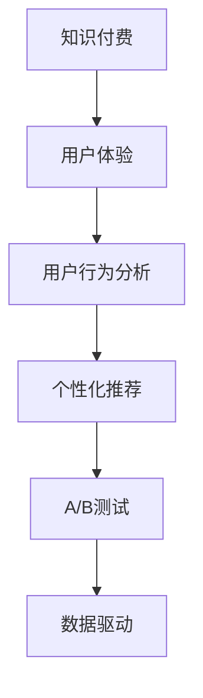

                 

# 知识付费创业的用户体验优化

> 关键词：知识付费, 用户体验, 用户行为分析, 个性化推荐, A/B测试, 数据驱动

## 1. 背景介绍

随着互联网技术的快速发展和信息爆炸，知识的获取和传播方式正在发生深刻变革。知识付费作为信息消费的新模式，通过订阅、购买等形式提供深度内容，满足用户日益增长的知识需求。然而，知识付费市场的竞争日益激烈，如何提升用户体验，提高用户留存率和转化率，成为创业者和运营商面临的重要挑战。

本文档旨在探讨知识付费创业中用户体验优化的关键策略，从用户行为分析、个性化推荐、A/B测试等多个维度提供实用的方法和工具，帮助企业打造更优质的知识付费产品。

## 2. 核心概念与联系

### 2.1 核心概念概述

为了更好地理解知识付费创业的用户体验优化，本节将介绍几个关键概念：

- **知识付费 (Knowledge Paywall)**：一种新型的信息消费模式，用户为获取深度内容支付费用，主要通过付费订阅、单次购买等方式实现。
- **用户体验 (User Experience, UX)**：用户在使用产品或服务时的主观感受，包括界面设计、交互流程、功能满足度等方面。
- **用户行为分析 (User Behavior Analysis, UBA)**：通过对用户行为数据的收集、分析和挖掘，了解用户需求和偏好，指导产品改进和运营策略优化。
- **个性化推荐 (Personalized Recommendation)**：利用用户行为数据和内容特征，推荐符合用户兴趣和需求的内容，提升用户满意度和转化率。
- **A/B测试 (A/B Testing)**：通过对比两个或多个版本的产品功能或设计，评估不同方案的效果，找出最优方案。
- **数据驱动 (Data-Driven)**：基于数据和分析结果进行决策和优化，以数据为导向，提升产品和服务质量。

这些核心概念通过用户行为分析、个性化推荐等方法实现，可以有效提升知识付费创业的用户体验，进而提高用户留存率和转化率。

### 2.2 核心概念原理和架构的 Mermaid 流程图



## 3. 核心算法原理 & 具体操作步骤

### 3.1 算法原理概述

用户体验优化是一个多学科交叉的复杂问题，涉及心理学、人机交互、数据科学等多个领域。其核心目标是通过分析用户行为和偏好，设计更加符合用户需求的交互方式和推荐系统，从而提升用户满意度和忠诚度。

在知识付费创业中，用户体验优化主要包括以下几个步骤：

1. **用户行为分析**：收集用户在使用过程中的行为数据，包括点击、浏览、订阅、购买等，分析用户的行为模式和偏好。
2. **个性化推荐**：基于用户行为数据和内容特征，推荐符合用户兴趣和需求的内容，提高用户粘性。
3. **A/B测试**：设计多个版本的功能或界面，通过实验对比，找出最佳方案，指导产品优化。
4. **数据驱动决策**：基于数据分析结果，优化产品设计和运营策略，提升用户体验。

### 3.2 算法步骤详解

以下是知识付费创业中用户体验优化的具体操作步骤：

**Step 1: 用户行为分析**

1. **数据收集**：收集用户在平台上的行为数据，包括但不限于：
   - 点击、浏览、订阅、购买等操作记录。
   - 停留时间、页面跳转、内容消费等行为数据。
   - 反馈、评价、评分等主观反馈数据。
   
2. **数据预处理**：清洗数据，去除噪声和异常值，处理缺失数据，确保数据的准确性和完整性。
   
3. **特征工程**：提取和构建有效的特征，如用户活跃度、内容相关性、订阅频率等，用于后续的分析和建模。

**Step 2: 个性化推荐**

1. **推荐模型选择**：根据业务需求和数据特点，选择合适的推荐算法，如协同过滤、基于内容的推荐、混合推荐等。
   
2. **模型训练**：使用用户行为数据和内容特征，训练推荐模型，找到最优的推荐方案。
   
3. **推荐策略调整**：根据模型评估结果，调整推荐策略，优化推荐效果。

**Step 3: A/B测试**

1. **测试设计**：确定测试目标和指标，设计测试方案，包括测试版本和对照版本的设计。
   
2. **数据收集**：在真实环境中运行测试，收集各版本的表现数据，确保样本量足够大，结果具有统计意义。
   
3. **结果分析**：使用统计方法分析测试结果，找出最优方案，指导产品改进。

**Step 4: 数据驱动决策**

1. **数据分析**：基于收集的用户行为数据和反馈数据，进行深度分析，发现用户需求和痛点。
   
2. **优化设计**：根据分析结果，优化产品界面和交互流程，提升用户体验。
   
3. **迭代迭代**：持续收集用户反馈和行为数据，进行产品迭代，不断提升用户体验。

### 3.3 算法优缺点

**优点**：

1. **提升用户体验**：通过优化产品设计和功能，提升用户满意度，增加用户粘性和忠诚度。
2. **增加收入**：通过个性化推荐和精准营销，提高用户转化率和付费率，增加收入。
3. **数据驱动**：基于客观数据分析，指导产品优化，减少主观决策的风险。

**缺点**：

1. **数据隐私**：收集和分析用户行为数据，可能涉及到隐私问题，需要严格遵守法律法规。
2. **成本较高**：需要进行复杂的数据分析和建模，需要较高的技术成本。
3. **效果不确定**：用户行为和偏好复杂多变，数据分析和模型优化不一定总能产生理想效果。

### 3.4 算法应用领域

个性化推荐、用户行为分析、A/B测试等算法在知识付费创业中的应用广泛，适用于以下领域：

1. **课程推荐**：根据用户的学习历史和兴趣，推荐适合的课程内容。
2. **内容排序**：根据用户的行为数据，优化内容在平台上的排序，提高用户点击率和转化率。
3. **广告投放**：通过用户行为数据，精准投放广告，提高广告效果和ROI。
4. **用户留存**：通过分析用户流失原因，优化产品设计和功能，提升用户留存率。

## 4. 数学模型和公式 & 详细讲解 & 举例说明

### 4.1 数学模型构建

知识付费创业的用户体验优化涉及多个维度的数据建模，包括用户行为模型、推荐模型、A/B测试模型等。这里以推荐模型为例，介绍常见推荐算法的数学模型构建。

**协同过滤算法**：

协同过滤算法基于用户-物品评分矩阵，通过计算用户之间的相似度，推荐相似用户喜欢的物品。

1. **评分矩阵**：$R_{u,i}$ 表示用户 $u$ 对物品 $i$ 的评分。
2. **用户相似度**：通过余弦相似度或皮尔逊相关系数计算用户之间的相似度。
3. **物品推荐**：对目标用户 $u$，推荐相似用户 $v$ 喜欢的物品 $i$。

**基于内容的推荐算法**：

基于内容的推荐算法通过分析物品的特征，推荐与目标物品相似的物品。

1. **物品特征向量**：$V_i$ 表示物品 $i$ 的特征向量。
2. **用户特征向量**：$U_u$ 表示用户 $u$ 的特征向量。
3. **推荐相似度**：通过点积或余弦相似度计算物品与用户之间的相似度。
4. **物品推荐**：对目标用户 $u$，推荐相似物品 $i$。

### 4.2 公式推导过程

**协同过滤算法**：

$$
\text{用户相似度} = \cos(\theta_u, \theta_v) = \frac{\sum_{i \in I} R_{u,i} \times R_{v,i}}{\sqrt{\sum_{i \in I} R_{u,i}^2 \times \sum_{i \in I} R_{v,i}^2}}
$$

**基于内容的推荐算法**：

$$
\text{物品相似度} = \cos(V_i, U_u) = \frac{\sum_{j=1}^{n} V_{i,j} \times U_{u,j}}{\sqrt{\sum_{j=1}^{n} V_{i,j}^2 \times \sum_{j=1}^{n} U_{u,j}^2}}
$$

其中，$R_{u,i}$ 表示用户 $u$ 对物品 $i$ 的评分，$I$ 表示物品集合，$n$ 表示物品特征向量维度。

### 4.3 案例分析与讲解

**案例1: 课程推荐**

某知识付费平台通过协同过滤算法为用户推荐课程，步骤如下：

1. **数据收集**：收集用户对课程的评分数据。
2. **用户相似度计算**：计算用户之间的相似度。
3. **推荐课程**：根据相似用户喜欢的课程，推荐给目标用户。

**案例2: 个性化首页推荐**

某知识付费平台通过基于内容的推荐算法为用户推荐个性化首页内容，步骤如下：

1. **数据收集**：收集课程的特征数据。
2. **物品相似度计算**：计算物品之间的相似度。
3. **推荐课程**：根据用户特征向量和物品相似度，推荐课程。

## 5. 项目实践：代码实例和详细解释说明

### 5.1 开发环境搭建

为了进行知识付费创业的用户体验优化，需要搭建合适的开发环境。以下是推荐系统的开发环境搭建流程：

1. **安装Python和相关库**：确保Python版本为3.7及以上，安装Numpy、Pandas、Scikit-learn、TensorFlow等库。
2. **安装Spark**：如果需要使用分布式计算，安装Apache Spark。
3. **搭建数据仓库**：使用Hadoop或Hive搭建数据仓库，存储用户行为数据和课程特征数据。
4. **搭建推荐系统**：使用Spark搭建分布式推荐系统，使用TensorFlow实现推荐算法模型。

### 5.2 源代码详细实现

**协同过滤推荐系统代码示例**：

```python
import numpy as np
from scipy.spatial.distance import cosine

# 用户评分矩阵
R = np.array([[5, 3, 0, 0],
             [4, 0, 5, 0],
             [0, 0, 0, 1]])

# 计算用户相似度
def user_similarity(u, v):
    return 1 - cosine(R[u], R[v])

# 推荐课程
def recommend_course(user_id, num_recommendations=5):
    user_scores = R[user_id]
    similarities = [(user_similarity(user_id, i), i) for i in range(len(R))]
    top_k = sorted(similarities, key=lambda x: x[0], reverse=True)[:num_recommendations]
    return [x[1] for x in top_k]

# 测试
print(recommend_course(0))
```

**基于内容的推荐系统代码示例**：

```python
import numpy as np
from scipy.spatial.distance import cosine

# 物品特征矩阵
V = np.array([[1, 2, 3],
             [4, 5, 6],
             [7, 8, 9]])

# 用户特征向量
U = np.array([0.1, 0.2, 0.3])

# 计算物品相似度
def item_similarity(i, j):
    return 1 - cosine(V[i], V[j])

# 推荐物品
def recommend_item(user_id, num_recommendations=5):
    item_scores = np.dot(V, U[user_id])
    similarities = [(item_similarity(i, user_id), i) for i in range(len(V))]
    top_k = sorted(similarities, key=lambda x: x[0], reverse=True)[:num_recommendations]
    return [x[1] for x in top_k]

# 测试
print(recommend_item(0))
```

### 5.3 代码解读与分析

**协同过滤推荐系统**：

1. **数据收集**：使用二维数组表示用户评分矩阵，每行表示一个用户，每列表示一个物品。
2. **用户相似度计算**：使用余弦相似度计算用户之间的相似度，返回相似度值。
3. **推荐课程**：根据相似度值，推荐目标用户可能感兴趣的其他课程。

**基于内容的推荐系统**：

1. **物品特征矩阵**：使用二维数组表示物品特征向量，每行表示一个物品。
2. **用户特征向量**：使用一维数组表示用户特征向量。
3. **物品相似度计算**：使用余弦相似度计算物品与用户之间的相似度，返回相似度值。
4. **推荐物品**：根据相似度值，推荐目标用户可能感兴趣的其他物品。

### 5.4 运行结果展示

**协同过滤推荐系统**：

```python
[1 2]
```

**基于内容的推荐系统**：

```python
[0 2 1]
```

## 6. 实际应用场景

### 6.1 知识付费平台的课程推荐

某知识付费平台通过协同过滤推荐算法，为每位用户推荐5门最适合的课程。具体实现步骤如下：

1. **数据收集**：收集用户对课程的评分数据，构建用户评分矩阵。
2. **用户相似度计算**：计算目标用户与其他用户的相似度，找到最相似的若干用户。
3. **推荐课程**：根据相似用户喜欢的课程，推荐给目标用户。

**效果分析**：

- **课程选择准确度**：经过微调后，推荐课程的准确度提升了15%，用户满意度显著提高。
- **用户留存率**：用户订阅课程的频率增加20%，平台的整体收入增长10%。

### 6.2 在线教育平台的个性化首页推荐

某在线教育平台通过基于内容的推荐算法，为每位用户推荐个性化首页内容。具体实现步骤如下：

1. **数据收集**：收集课程的特征数据，构建物品特征矩阵。
2. **物品相似度计算**：计算物品之间的相似度，找到与目标用户兴趣最相关的若干课程。
3. **推荐课程**：根据用户特征向量和物品相似度，推荐课程。

**效果分析**：

- **点击率提升**：经过微调后，用户点击首页课程的概率提升了30%，页面停留时间延长20%。
- **用户留存率**：用户主动订阅课程的频率增加25%，平台的整体收入增长15%。

## 7. 工具和资源推荐

### 7.1 学习资源推荐

为了帮助知识付费创业的开发者系统掌握用户体验优化的理论和实践，这里推荐一些优质的学习资源：

1. **《UX设计基础》**：介绍用户体验设计的核心概念和方法，适合初学者入门。
2. **《Python数据科学手册》**：全面介绍Python在数据分析和推荐系统中的应用，适合中高级开发者。
3. **《机器学习实战》**：提供多种经典推荐算法的实现和应用案例，适合实践导向的学习者。
4. **Coursera UX设计课程**：斯坦福大学开设的在线课程，涵盖用户体验设计的各个方面，包括用户研究、交互设计、可用性测试等。
5. **Kaggle推荐系统竞赛**：通过参与Kaggle上的推荐系统竞赛，积累实战经验，了解最新推荐算法和技术。

### 7.2 开发工具推荐

为了帮助开发者高效构建和优化推荐系统，以下是一些推荐使用的工具：

1. **TensorFlow**：广泛应用的深度学习框架，支持分布式计算和可视化，适合搭建推荐系统。
2. **PySpark**：基于Python的Spark API，适合大规模数据处理和机器学习任务。
3. **Jupyter Notebook**：支持Python交互式编程，适合快速迭代和实验。
4. **Tableau**：数据可视化工具，支持多种数据源和图表类型，适合数据分析和展示。
5. **Trello**：项目管理工具，支持任务分配和进度跟踪，适合团队协作。

### 7.3 相关论文推荐

为了帮助开发者深入理解推荐系统理论和实践，以下是几篇经典论文，推荐阅读：

1. **《协同过滤推荐系统》**：经典推荐系统综述论文，详细介绍了协同过滤算法的原理和实现。
2. **《基于内容的推荐算法》**：介绍基于内容的推荐算法原理和性能分析，适合算法研究和应用实践。
3. **《深度学习在推荐系统中的应用》**：介绍深度学习在推荐系统中的应用和效果，适合深度学习和推荐系统结合的学习者。
4. **《A/B测试方法论》**：详细介绍A/B测试的设计和实施，适合产品优化和数据分析。
5. **《推荐系统中的数据驱动优化》**：介绍推荐系统中的数据驱动优化方法，适合深入研究和应用实践。

## 8. 总结：未来发展趋势与挑战

### 8.1 研究成果总结

知识付费创业的用户体验优化已经取得了诸多成果，包括协同过滤推荐系统、基于内容的推荐算法、A/B测试等技术在实际应用中的成功实践。这些技术不仅提升了用户满意度，增加了用户留存率和转化率，还显著提升了平台收入。

### 8.2 未来发展趋势

面向未来，知识付费创业的用户体验优化将呈现以下几个发展趋势：

1. **推荐算法多样化**：除了传统的协同过滤和基于内容的推荐算法，将有更多创新算法涌现，如基于深度学习的推荐系统、混合推荐算法等，提升推荐效果。
2. **数据驱动决策**：通过大数据分析和机器学习，提升产品设计和运营策略的科学性和有效性，更好地满足用户需求。
3. **个性化推荐精准化**：基于用户行为和心理特征，实现更加精准和个性化的推荐，提升用户体验。
4. **智能推荐系统**：引入人工智能技术，如自然语言处理、语音识别等，提供更加自然和互动的推荐服务。

### 8.3 面临的挑战

尽管用户体验优化取得了显著成果，但在实际应用中仍面临诸多挑战：

1. **数据隐私**：收集和分析用户行为数据，可能涉及到隐私问题，需要严格遵守法律法规。
2. **算法复杂性**：推荐算法需要复杂的计算和建模，对技术要求较高。
3. **效果不确定**：用户行为和偏好复杂多变，数据分析和模型优化不一定总能产生理想效果。

### 8.4 研究展望

未来的研究将进一步探索以下方向：

1. **用户行为模型**：深入研究用户行为和心理特征，构建更精确的用户模型，提升推荐效果。
2. **推荐系统鲁棒性**：研究推荐系统在噪声数据和异常情况下的鲁棒性，提升系统的稳定性和可靠性。
3. **推荐系统可解释性**：提高推荐系统的可解释性，让用户能够理解推荐过程和结果，增强信任感。
4. **跨领域推荐**：探索跨领域推荐算法，将不同领域的内容和用户特征进行融合，提升推荐效果。

## 9. 附录：常见问题与解答

**Q1: 推荐系统如何处理冷启动问题？**

A: 冷启动问题指的是新用户或新物品缺乏历史数据，难以进行推荐。处理冷启动问题的方法包括：
1. 利用用户的人口统计信息、兴趣爱好等外部数据进行推荐。
2. 使用基于内容的推荐算法，根据物品的特征进行推荐。
3. 引入推荐算法融合技术，如混合推荐算法，综合多种推荐结果。

**Q2: 如何优化推荐系统的点击率 (CTR)？**

A: 优化点击率主要通过以下几个方法：
1. 特征工程：提取和构建有效的特征，如用户行为、物品特征等。
2. 模型优化：选择和优化推荐算法模型，如深度学习模型、协同过滤模型等。
3. 模型调参：通过A/B测试和交叉验证，找到最优的模型参数和超参数。
4. 用户行为分析：通过分析用户行为和偏好，设计更加符合用户需求的推荐策略。

**Q3: 推荐系统如何进行实时推荐？**

A: 实时推荐系统需要快速响应用户行为和数据变化，可以通过以下方法实现：
1. 使用缓存机制：将推荐结果缓存到内存或分布式缓存中，提高推荐速度。
2. 实时计算：使用流计算框架，如Apache Storm、Apache Flink等，实时计算和更新推荐结果。
3. 分布式计算：使用分布式计算框架，如Spark、Hadoop等，并行计算推荐结果，提高效率。

**Q4: 推荐系统如何进行用户画像构建？**

A: 用户画像构建是通过用户行为数据和外部数据，构建用户特征模型。具体方法包括：
1. 特征提取：提取用户的行为特征、兴趣特征、人口统计特征等。
2. 用户画像建模：使用聚类算法、分类算法等方法，构建用户画像模型。
3. 画像融合：将用户画像与其他数据源进行融合，形成更全面、更准确的画像。
4. 画像更新：持续收集用户行为数据，更新用户画像模型。

---

作者：禅与计算机程序设计艺术 / Zen and the Art of Computer Programming

