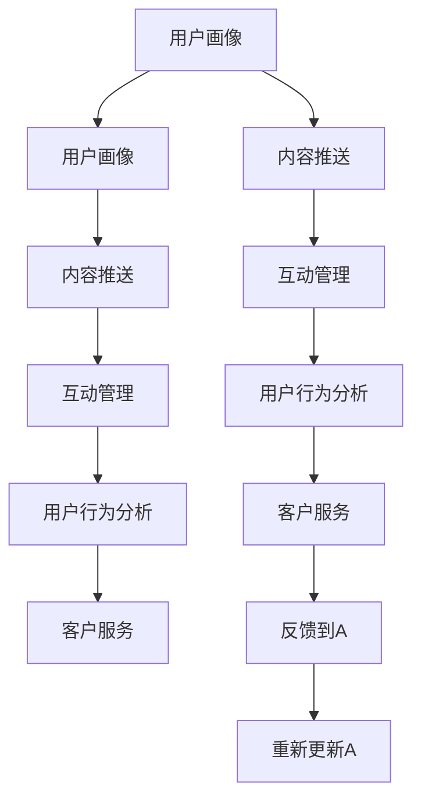

                 

## 1. 背景介绍

在移动互联网和数字经济的浪潮中，知识付费作为连接内容创作者与广大用户的新型商业模式，逐渐成为推动内容产业升级的重要力量。知识付费平台通过平台化、商业化运作，聚合高质量知识内容，满足用户深层次的学习需求，实现了知识变现的商业化转型。随着知识付费市场的持续扩展，其用户运营策略逐渐成为平台能否取得成功的重要因素。

### 1.1 知识付费的崛起

知识付费的崛起得益于移动互联网的普及和知识经济时代的到来。互联网将知识生产和传播渠道无限扩展，为知识付费提供了广阔的市场空间。伴随大众对于高质量、结构化知识的渴求日益增加，知识付费模式被越来越多的用户接受和认可。

### 1.2 用户运营的重要地位

知识付费平台的用户运营策略在决定平台用户规模、用户留存率和付费转化率等方面发挥着重要作用。用户运营的核心在于：

- **用户获取**：通过各种渠道吸引用户注册，扩大用户基数。
- **用户激活**：通过引导用户首次付费或参与互动，提高用户活跃度。
- **用户留存**：通过提供优质内容和持续的客户服务，延长用户生命周期。
- **用户转化**：通过个性化推荐、限时优惠等策略提升用户付费转化率。

用户运营的每一个环节都关系到知识付费平台的长期发展，需要精细化管理和持续优化。

## 2. 核心概念与联系

### 2.1 核心概念概述

在知识付费平台的用户运营中，涉及的核心概念包括：

- **用户画像**：对用户的基本属性、兴趣偏好、行为特征等进行全面分析，为个性化运营提供依据。
- **内容推送**：根据用户画像，推荐与其兴趣和需求相匹配的高质量内容。
- **互动管理**：通过与用户的互动反馈，不断优化内容和产品，提升用户体验。
- **用户行为分析**：利用数据挖掘技术，分析用户行为数据，发现用户需求和痛点。
- **客户服务**：提供及时、专业的客户支持，保障用户体验。

这些核心概念构成了一个环环相扣的用户运营体系，各概念之间紧密联系、相互支撑，共同支撑平台的用户运营策略。

### 2.2 核心概念原理和架构的 Mermaid 流程图



这个流程图展示了用户画像、内容推送、互动管理、用户行为分析、客户服务五者之间的相互作用关系。其中，用户画像（A）作为运营的出发点，通过内容推送（B）与互动管理（C）不断更新，而用户行为分析（D）和客户服务（E）为运营提供反馈和改进依据，使得用户画像持续优化。

## 3. 核心算法原理 & 具体操作步骤

### 3.1 算法原理概述

知识付费平台的用户运营策略，通常遵循以下算法原理：

- **协同过滤**：基于用户行为数据，推荐与用户兴趣类似的内容，提升用户体验。
- **基于内容的推荐**：通过分析内容的属性和用户的历史行为，推送匹配度高的内容，提高转化率。
- **深度学习模型**：使用深度学习模型（如CTR模型、RNN等）对用户行为进行建模，预测用户对不同内容的兴趣程度。
- **强化学习**：通过强化学习算法不断优化推荐策略，提升推荐准确性和用户体验。
- **A/B测试**：通过对比不同策略的效果，优化运营方案，寻找最佳用户增长路径。

### 3.2 算法步骤详解

以下详细讲解知识付费平台用户运营的各个步骤：

**Step 1: 数据收集与预处理**

- 收集用户注册信息、浏览历史、购买记录、评价反馈等数据，整理成数据集。
- 清洗和处理数据，去除噪声和无效数据，确保数据质量和准确性。

**Step 2: 用户画像构建**

- 通过数据挖掘和机器学习技术，提取用户的关键特征，如年龄、性别、职业、兴趣等。
- 使用聚类算法、分类算法等方法，对用户进行分组和分类，构建用户画像。

**Step 3: 内容推荐模型训练**

- 根据用户画像和内容属性，选择合适的推荐算法（如协同过滤、基于内容的推荐、深度学习模型等）进行模型训练。
- 使用历史数据对模型进行训练和验证，优化模型参数，提高推荐精度。

**Step 4: 个性化推荐**

- 实时计算用户对不同内容的兴趣程度，选择最匹配的推荐内容。
- 动态更新推荐结果，根据用户行为和偏好进行调整。

**Step 5: 互动管理与客户服务**

- 对用户反馈进行实时监测和分析，发现用户需求和问题。
- 提供及时、专业的客户服务，解答用户疑问，解决用户问题。
- 不断优化产品和服务，提升用户体验。

**Step 6: 用户行为分析**

- 利用数据挖掘和统计分析技术，深入挖掘用户行为数据，发现用户需求和行为模式。
- 通过数据分析发现用户流失原因，制定改进措施，提升用户留存率。

**Step 7: A/B测试**

- 设计多种运营策略，进行A/B测试，评估不同策略的效果。
- 选择效果最好的策略进行推广和优化。

### 3.3 算法优缺点

知识付费平台用户运营策略的优缺点如下：

**优点：**

- **个性化推荐**：通过深度学习和协同过滤等技术，为每位用户提供个性化推荐，提升用户满意度和留存率。
- **数据分析**：利用数据分析技术，深入了解用户行为和需求，制定针对性的运营策略。
- **用户留存**：通过互动管理和客户服务，及时解决用户问题，提高用户粘性和满意度。

**缺点：**

- **数据隐私问题**：用户行为数据涉及隐私，数据收集和处理需遵守相关法律法规。
- **推荐算法复杂**：深度学习和协同过滤等算法需要高水平的数据和算法技术，实施成本较高。
- **运营成本高**：用户运营需要投入大量的人力和技术资源，且收益和成本之间存在一定滞后性。

### 3.4 算法应用领域

知识付费平台的用户运营策略广泛应用于以下几个领域：

- **在线教育平台**：通过个性化推荐和互动管理，提升用户学习效果和平台粘性。
- **在线阅读平台**：根据用户兴趣和阅读行为，推荐图书和文章，提高用户转化率。
- **在线咨询平台**：通过客户服务和互动管理，提供专业咨询，满足用户需求。
- **知识社区**：根据用户行为和兴趣，推荐优质内容，提升社区活跃度和用户粘性。

这些领域的用户运营策略，主要围绕用户画像构建、内容推荐、互动管理、用户行为分析、客户服务等方面展开，旨在通过精细化运营，提升平台的用户规模和用户转化率。

## 4. 数学模型和公式 & 详细讲解 & 举例说明

### 4.1 数学模型构建

知识付费平台用户运营的核心数学模型包括：

- **协同过滤模型**：$$
    \hat{y}_{ui} = \sum_{i' \in N(u)} \alpha_{ii'} \hat{r}_{i'i}
$$
其中，$N(u)$表示与用户u活跃的邻居集合，$\alpha_{ii'}$表示用户u和邻居i'的相似度，$\hat{r}_{i'i}$表示邻居i'对内容i的评分。

- **深度学习模型**：使用CTR模型、RNN等算法对用户行为进行建模，公式如下：
  - CTR模型：$$
    \hat{p} = \sigma(W^T [x_u, x_i] + b)
  $$
  - RNN模型：$$
    \hat{p} = \sigma(W_{rnn} x_u + W_{x} x_i + b)
  $$
  其中，$W$和$b$为模型参数，$x_u$和$x_i$为用户行为和内容特征向量。

### 4.2 公式推导过程

**协同过滤模型的推导**：

假设用户u对内容i的评分可以通过邻居的评分进行推断，则有：

$$
\hat{r}_{ui} = \sum_{i' \in N(u)} \alpha_{ii'} \hat{r}_{i'i}
$$

其中$\alpha_{ii'}$为相似度，可以使用余弦相似度、皮尔逊相关系数等方法计算。实际应用中，$\hat{r}_{i'i}$可以通过KNN算法等方法计算。

**深度学习模型的推导**：

CTR模型和RNN模型的推导过程如下：

- **CTR模型**：
  - 输入特征表示：$$
    x_u = [x_{u1}, x_{u2}, ..., x_{um}], x_i = [x_{i1}, x_{i2}, ..., x_{in}]
  $$
  - 用户行为表示：$$
    x_u = [x_{u1}, x_{u2}, ..., x_{um}], x_i = [x_{i1}, x_{i2}, ..., x_{in}]
  $$
  - 预测公式：$$
    \hat{p} = \sigma(W^T [x_u, x_i] + b)
  $$
  其中，$W$和$b$为模型参数，$\sigma$为sigmoid函数。

- **RNN模型**：
  - 用户行为表示：$$
    x_u = [x_{u1}, x_{u2}, ..., x_{um}]
  $$
  - 内容特征表示：$$
    x_i = [x_{i1}, x_{i2}, ..., x_{in}]
  $$
  - 预测公式：$$
    \hat{p} = \sigma(W_{rnn} x_u + W_{x} x_i + b)
  $$
  其中，$W_{rnn}$和$W_{x}$为模型参数，$\sigma$为sigmoid函数。

### 4.3 案例分析与讲解

**案例一：协同过滤在推荐系统中的应用**

某知识付费平台采用协同过滤算法进行个性化推荐，其用户画像构建和推荐流程如下：

1. **用户画像构建**：收集用户的历史浏览记录、评分记录等数据，计算用户之间的相似度，构建用户画像。
2. **内容推荐**：选择与用户画像匹配度高的内容进行推荐。
3. **互动反馈**：通过用户反馈对模型进行迭代优化，提高推荐精度。

**案例二：深度学习在内容推荐中的应用**

某在线教育平台采用深度学习模型进行个性化推荐，其用户画像构建和推荐流程如下：

1. **用户画像构建**：收集用户的学习历史、课程评分、课程属性等数据，构建用户画像。
2. **内容推荐**：使用CTR模型和RNN模型对用户行为进行建模，预测用户对不同课程的兴趣程度。
3. **互动反馈**：通过用户反馈和课程效果评估对模型进行迭代优化，提高推荐精度。

## 5. 项目实践：代码实例和详细解释说明

### 5.1 开发环境搭建

在知识付费平台的开发中，需要搭建一个高效的开发环境。以下是Python开发环境搭建的具体步骤：

1. **安装Python**：
   - 下载并安装Python 3.8版本。
   - 将Python安装目录添加到系统环境变量中。

2. **安装Python环境管理工具**：
   - 安装虚拟环境管理工具`virtualenv`：
     ```bash
     pip install virtualenv
     ```
   - 创建虚拟环境并激活：
     ```bash
     virtualenv venv
     source venv/bin/activate
     ```

3. **安装第三方依赖包**：
   - 安装数据处理和分析库`pandas`、`numpy`、`scikit-learn`等：
     ```bash
     pip install pandas numpy scikit-learn
     ```
   - 安装机器学习库`scikit-learn`、`tensorflow`、`keras`等：
     ```bash
     pip install scikit-learn tensorflow keras
     ```
   - 安装推荐算法库`surprise`、`lightfm`等：
     ```bash
     pip install surprise lightfm
     ```

4. **安装深度学习框架**：
   - 安装深度学习框架`tensorflow`、`keras`：
     ```bash
     pip install tensorflow keras
     ```

5. **安装可视化工具**：
   - 安装可视化工具`matplotlib`、`seaborn`：
     ```bash
     pip install matplotlib seaborn
     ```

6. **安装在线分析工具**：
   - 安装在线分析工具`jupyter notebook`：
     ```bash
     pip install jupyter notebook
     ```

完成以上步骤后，即可在Python环境中开始知识付费平台的开发。

### 5.2 源代码详细实现

以下是一个简单的知识付费平台用户运营策略的代码实现，以协同过滤推荐算法为例：

```python
import numpy as np
from surprise import Dataset, Reader, KNNBasic
from surprise.model_selection import cross_validate

# 准备数据
reader = Reader(rating_scale=(1, 5))
data = Dataset.load_from_file('ratings.csv', reader=reader)

# 构建协同过滤模型
algo = KNNBasic(similarity='pearson')
results = cross_validate(algo, data, measures=['rmse', 'mae'], cv=5, verbose=False)
print('Cross-validation Mean RMSE: %f' % np.sqrt(results.mean('rmse')))
```

在上述代码中，首先导入必要的库和数据，然后使用KNN算法进行协同过滤推荐，最后计算交叉验证的平均RMSE值。

### 5.3 代码解读与分析

**代码解析**：

- **导入库和数据**：首先导入`numpy`、`surprise`等库，并准备数据文件`ratings.csv`。
- **构建协同过滤模型**：使用`KNNBasic`算法，选择皮尔逊相关系数作为相似度度量，进行交叉验证。
- **计算平均RMSE**：通过计算交叉验证的平均RMSE值，评估推荐模型的效果。

**性能分析**：

- **数据准备**：数据的准备和处理是推荐算法的基础，需要确保数据的完整性和准确性。
- **模型选择**：选择合适的推荐算法，根据实际情况选择不同的相似度度量和算法参数。
- **交叉验证**：通过交叉验证评估模型的泛化能力，防止过拟合。
- **性能评估**：使用平均RMSE等指标评估推荐模型的效果，并进行优化。

## 6. 实际应用场景

### 6.1 在线教育平台

在线教育平台通过个性化推荐和互动管理，提升用户的学习效果和平台粘性。具体而言：

- **个性化推荐**：根据用户的学习历史、偏好和行为，推荐适合其学习的内容，如课程、视频等。
- **互动管理**：通过互动管理，及时解答用户问题，提供学习指导和反馈。
- **客户服务**：提供专业的客户服务，解答用户疑问，提升用户体验。

### 6.2 在线阅读平台

在线阅读平台通过内容推荐和互动管理，提升用户的阅读体验和平台粘性。具体而言：

- **个性化推荐**：根据用户的阅读历史和偏好，推荐匹配的内容，如书籍、文章等。
- **互动管理**：通过互动管理，及时解答用户问题，提供阅读指导和反馈。
- **客户服务**：提供专业的客户服务，解答用户疑问，提升用户体验。

### 6.3 在线咨询平台

在线咨询平台通过客户服务和互动管理，提供专业咨询，满足用户需求。具体而言：

- **客户服务**：提供及时、专业的客户服务，解答用户疑问，提供咨询建议。
- **互动管理**：通过互动管理，及时了解用户需求和反馈，不断优化平台服务。

### 6.4 知识社区

知识社区通过个性化推荐和互动管理，提升社区的活跃度和用户粘性。具体而言：

- **个性化推荐**：根据用户的兴趣和行为，推荐优质内容，如文章、视频等。
- **互动管理**：通过互动管理，及时解答用户问题，提供社区指导和反馈。

## 7. 工具和资源推荐

### 7.1 学习资源推荐

为了帮助开发者深入理解知识付费平台的用户运营策略，这里推荐一些优质的学习资源：

1. **《推荐系统实战》**：全面介绍推荐系统原理和实践，包括协同过滤、深度学习等内容，适合初学者和进阶开发者。
2. **《用户行为分析》**：介绍用户行为分析的基本方法和应用案例，帮助开发者更好地理解用户行为，提升用户体验。
3. **《自然语言处理入门》**：介绍自然语言处理的基本原理和应用场景，帮助开发者更好地处理文本数据，提升推荐准确性。
4. **《机器学习实战》**：介绍机器学习的基本概念和算法，适合开发者学习机器学习基础知识。
5. **《数据分析实战》**：介绍数据分析的基本方法和应用案例，帮助开发者更好地处理和分析用户数据，提升运营效果。

通过对这些资源的学习实践，相信你一定能够快速掌握知识付费平台的用户运营策略，并用于解决实际的运营问题。

### 7.2 开发工具推荐

在知识付费平台的开发中，选择合适的工具能够大大提高开发效率。以下是几款推荐的工具：

1. **Jupyter Notebook**：开源的交互式编程环境，支持Python、R等多种语言，方便开发者进行数据处理和模型训练。
2. **TensorFlow**：Google开发的深度学习框架，支持多种算法和模型，适合大规模数据分析和深度学习任务。
3. **Pandas**：数据处理和分析库，支持数据清洗、转换和统计分析，适合数据预处理和分析。
4. **Scikit-learn**：机器学习库，支持多种算法和模型，适合快速原型开发和模型评估。
5. **LightFM**：基于深度学习的推荐系统框架，支持多种推荐算法，适合构建高精度的推荐模型。

合理利用这些工具，可以显著提升知识付费平台的开发效率，加快创新迭代的步伐。

### 7.3 相关论文推荐

知识付费平台的用户运营策略涉及众多研究领域，以下是几篇相关的经典论文，推荐阅读：

1. **《协同过滤推荐系统》**：介绍了协同过滤推荐系统的基本原理和应用案例。
2. **《深度学习在推荐系统中的应用》**：介绍了深度学习在推荐系统中的应用，包括CTR模型、RNN等。
3. **《用户行为分析与推荐系统》**：介绍了用户行为分析的基本方法和应用案例，帮助开发者更好地理解用户行为，提升推荐效果。
4. **《推荐系统中的个性化推荐》**：介绍了个性化推荐的基本原理和应用案例，帮助开发者更好地理解个性化推荐的核心思想。
5. **《知识付费平台的用户运营策略》**：介绍知识付费平台的用户运营策略，包括用户画像构建、内容推荐、互动管理等内容。

这些论文代表了大规模知识付费平台的运营实践和研究成果，通过学习这些前沿成果，可以帮助研究者把握学科前进方向，激发更多的创新灵感。

## 8. 总结：未来发展趋势与挑战

### 8.1 总结

本文对知识付费平台的用户运营策略进行了全面系统的介绍。首先阐述了知识付费平台的崛起背景，明确了用户运营策略在平台成功中的重要地位。其次，从算法原理到操作步骤，详细讲解了知识付费平台用户运营的核心算法和具体操作步骤，给出了完整的代码实例和详细解释。最后，本文广泛探讨了用户运营策略在多个行业领域的应用前景，展示了其广阔的应用空间。

通过本文的系统梳理，可以看到，知识付费平台的用户运营策略正在成为平台运营的关键因素，其精细化和个性化运营能力显著提升了用户粘性和平台效益。未来，伴随算法的不断演进和数据技术的持续提升，知识付费平台的用户运营将更加智能化、高效化，用户运营策略也将迎来更多的创新和突破。

### 8.2 未来发展趋势

展望未来，知识付费平台的用户运营策略将呈现以下几个发展趋势：

1. **智能推荐**：通过深度学习和强化学习等技术，实现更加精准、个性化的推荐，提升用户转化率和满意度。
2. **多渠道运营**：通过社交媒体、搜索引擎、邮件等多种渠道，实现多渠道用户获取和运营。
3. **全链路优化**：从用户画像构建、内容推荐、互动管理、客户服务等多个环节进行全链路优化，提升运营效率。
4. **动态调整**：通过实时监测和分析用户行为数据，动态调整推荐策略和运营方案，提高运营效果。
5. **数据驱动**：利用大数据和机器学习技术，深入挖掘用户行为和需求，制定精准的运营策略。
6. **用户情感分析**：通过情感分析技术，了解用户情感变化，及时调整运营策略，提升用户粘性和满意度。

这些趋势凸显了知识付费平台用户运营策略的智能化和数据化，其未来的发展前景值得期待。

### 8.3 面临的挑战

尽管知识付费平台用户运营策略已经取得了显著成效，但在迈向更加智能化、数据化的过程中，仍面临诸多挑战：

1. **数据隐私问题**：用户数据涉及隐私，数据收集和处理需遵守相关法律法规，如何在保障隐私的同时，获取高质量的用户行为数据，仍是一大难题。
2. **算法复杂性**：深度学习和大数据分析等技术，需要高水平的数据和算法技术，实施成本较高，如何在保证算法效果的同时，降低实施成本，是一个重要的挑战。
3. **运营成本高**：用户运营需要投入大量的人力和技术资源，且收益和成本之间存在一定滞后性，如何在提高运营效果的同时，控制运营成本，是运营者需要不断探索的问题。
4. **用户需求变化快**：用户需求和行为快速变化，如何及时捕捉和响应变化，制定灵活的运营策略，是一个需要不断应对的挑战。
5. **用户体验瓶颈**：用户体验是知识付费平台的核心竞争力，如何通过优化内容和互动管理，提升用户体验，是一个重要的课题。

这些挑战需要知识付费平台不断创新和优化运营策略，以应对未来的发展需求。

### 8.4 研究展望

面对知识付费平台用户运营策略面临的诸多挑战，未来的研究需要在以下几个方面寻求新的突破：

1. **用户需求挖掘**：通过数据分析和机器学习技术，深入挖掘用户需求和行为模式，制定精准的运营策略。
2. **推荐算法优化**：优化推荐算法，提升推荐精度和效果，实现更加个性化的推荐。
3. **数据隐私保护**：研究数据隐私保护技术，确保用户数据安全和隐私，增强用户信任。
4. **全链路优化**：通过全链路优化，提升运营效率和效果，实现规模化和个性化运营。
5. **用户情感分析**：研究用户情感分析技术，了解用户情感变化，及时调整运营策略，提升用户粘性和满意度。
6. **多渠道运营**：研究多渠道运营技术，提升用户获取和留存率，实现多渠道协同运营。

这些研究方向将推动知识付费平台的用户运营策略向更高效、智能化、数据化的方向发展，为知识付费平台的未来发展提供有力保障。

## 9. 附录：常见问题与解答

**Q1: 知识付费平台的运营策略有哪些？**

A: 知识付费平台的运营策略主要包括以下几个方面：
1. **用户画像构建**：通过数据挖掘和机器学习技术，提取用户的关键特征，如年龄、性别、职业、兴趣等。
2. **内容推荐**：根据用户画像和内容属性，选择合适的推荐算法进行模型训练，实现个性化推荐。
3. **互动管理**：通过与用户的互动反馈，不断优化内容和产品，提升用户体验。
4. **客户服务**：提供及时、专业的客户支持，保障用户体验。
5. **用户行为分析**：利用数据挖掘和统计分析技术，深入挖掘用户行为数据，发现用户需求和痛点。

**Q2: 知识付费平台如何构建用户画像？**

A: 知识付费平台构建用户画像的主要步骤包括：
1. **数据收集**：收集用户注册信息、浏览历史、购买记录、评价反馈等数据。
2. **数据清洗**：清洗和处理数据，去除噪声和无效数据，确保数据质量和准确性。
3. **特征提取**：通过数据挖掘和机器学习技术，提取用户的关键特征，如年龄、性别、职业、兴趣等。
4. **聚类分析**：使用聚类算法、分类算法等方法，对用户进行分组和分类，构建用户画像。

**Q3: 知识付费平台如何进行个性化推荐？**

A: 知识付费平台进行个性化推荐的主要步骤包括：
1. **数据准备**：准备用户的行为数据和内容数据。
2. **特征工程**：进行特征提取和特征选择，构建用户画像和内容画像。
3. **模型训练**：选择合适的推荐算法进行模型训练，如协同过滤、深度学习等。
4. **推荐预测**：实时计算用户对不同内容的兴趣程度，选择最匹配的推荐内容。
5. **结果评估**：通过用户反馈和互动数据，对推荐模型进行评估和优化。

**Q4: 知识付费平台如何进行用户互动管理？**

A: 知识付费平台进行用户互动管理的主要步骤包括：
1. **互动渠道建立**：建立多渠道互动渠道，如在线客服、社区论坛、私信等。
2. **问题解决**：及时解答用户问题，提供学习指导和反馈。
3. **用户反馈**：收集用户反馈，了解用户需求和问题。
4. **服务优化**：根据用户反馈和互动数据，优化产品和服务，提升用户体验。

**Q5: 知识付费平台如何进行用户行为分析？**

A: 知识付费平台进行用户行为分析的主要步骤包括：
1. **数据收集**：收集用户的行为数据，如浏览历史、购买记录、互动数据等。
2. **数据处理**：清洗和处理数据，去除噪声和无效数据，确保数据质量和准确性。
3. **数据分析**：利用数据挖掘和统计分析技术，深入挖掘用户行为数据，发现用户需求和行为模式。
4. **用户分类**：通过聚类算法、分类算法等方法，对用户进行分组和分类，构建用户画像。
5. **策略优化**：根据用户分类和行为分析结果，制定精准的运营策略，提升用户体验和平台效益。

**Q6: 知识付费平台如何保障用户隐私？**

A: 知识付费平台保障用户隐私的主要措施包括：
1. **数据匿名化**：对用户数据进行匿名化处理，确保用户隐私不被泄露。
2. **合规审查**：遵守相关法律法规，确保数据收集和处理符合隐私保护要求。
3. **加密存储**：使用加密技术对用户数据进行存储和传输，保障数据安全。
4. **权限控制**：设置严格的权限控制，限制对用户数据的访问和使用。
5. **用户知情权**：向用户明示数据使用和隐私保护措施，确保用户知情权和选择权。

这些措施可以帮助知识付费平台在保障用户隐私的同时，实现高效的数据利用和运营优化。

---

作者：禅与计算机程序设计艺术 / Zen and the Art of Computer Programming

