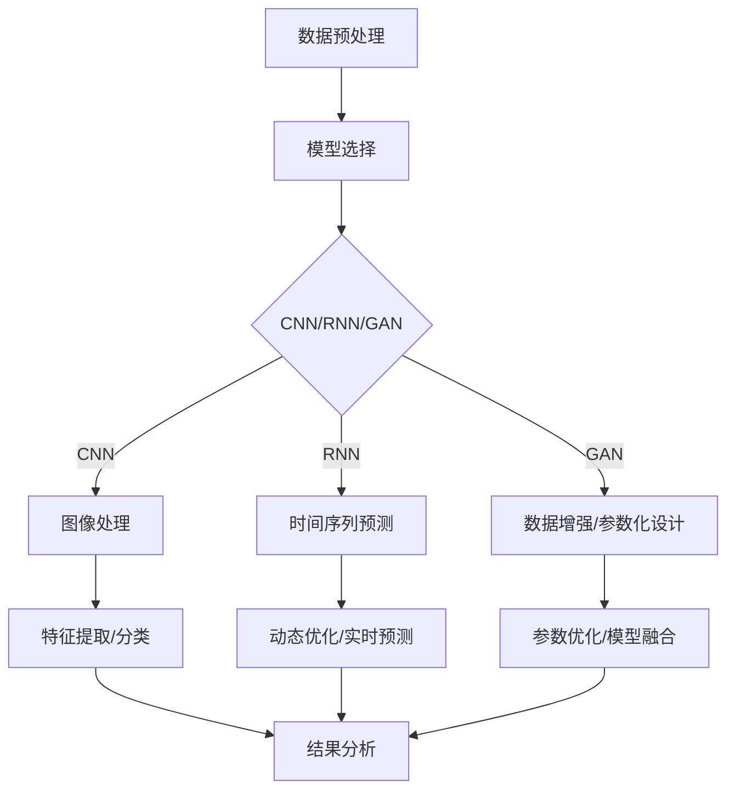

                 

### 文章标题

AI人工智能深度学习算法：在流体动力学中的应用

关键词：深度学习；流体动力学；神经网络；AI算法；应用场景

摘要：本文将探讨深度学习算法在流体动力学领域中的应用。通过介绍深度学习的基本概念和流体动力学的相关背景知识，本文将详细分析几种关键算法，如卷积神经网络（CNN）、循环神经网络（RNN）和生成对抗网络（GAN），并探讨它们在流体动力学建模、预测和优化中的应用。此外，本文还将通过实际项目实例展示这些算法的具体实现，以帮助读者更好地理解其在实际应用中的效果和挑战。最终，本文将总结未来发展趋势与挑战，并给出进一步研究的建议。

### 背景介绍（Background Introduction）

#### 1. 深度学习与流体动力学

深度学习是一种基于人工神经网络的学习方法，通过多层神经网络结构自动从大量数据中学习特征表示，实现高复杂度的数据建模与预测。近年来，深度学习在图像识别、自然语言处理和推荐系统等领域取得了显著成就，并在许多实际应用中展现出巨大的潜力。

流体动力学是研究流体运动规律和相互作用力的学科，广泛应用于航空航天、海洋工程、气象预报、生物医学等领域。流体动力学问题通常具有高维复杂性和非线性特性，传统数值模拟方法在处理大规模问题和高精度需求时面临着巨大挑战。

#### 2. 流体动力学领域中的挑战

流体动力学领域中的挑战主要包括：

1. **高维数据与非线性特性**：流体运动涉及多个物理量，如速度、压力、密度等，这些物理量之间存在复杂的非线性关系，使得传统的数值模拟方法难以应对高维数据。
2. **计算资源与时间成本**：大规模流体动力学模拟需要大量的计算资源和时间，尤其是在进行实时预测和优化时，计算效率成为制约因素。
3. **边界条件与初始条件的设定**：流体动力学模拟需要精确的边界条件和初始条件，但实际应用中往往难以获取。

#### 3. 深度学习算法的优势

深度学习算法在流体动力学领域具有以下优势：

1. **自动特征提取**：通过多层神经网络结构，深度学习算法能够自动从数据中学习到复杂的特征表示，提高模型的泛化能力和拟合精度。
2. **并行计算**：深度学习算法可以利用现有的计算资源进行大规模并行计算，提高计算效率。
3. **自适应调整**：深度学习算法可以通过训练过程自适应地调整模型参数，使其适应不同的问题场景和需求。

综上所述，深度学习算法在流体动力学领域具有广阔的应用前景，能够为解决传统方法面临的挑战提供新的思路和方法。本文将深入探讨深度学习算法在流体动力学中的应用，介绍关键算法原理、数学模型、实现方法以及实际应用案例，以期为相关领域的研究者和工程师提供参考和启示。### 核心概念与联系（Core Concepts and Connections）

#### 1. 深度学习算法在流体动力学中的应用

深度学习算法在流体动力学中的应用主要集中在以下几个方面：

1. **数据驱动的流体动力学建模**：通过训练深度学习模型，将流体动力学问题转化为数据拟合问题，从而实现高维数据的高效建模。
2. **实时预测与优化**：利用深度学习算法的快速计算能力，实现流体动力学问题的实时预测与优化，提高计算效率和准确性。
3. **参数化设计与优化**：将流体动力学问题转化为参数化模型，利用深度学习算法进行参数优化，为工程应用提供可靠的设计方案。

#### 2. 卷积神经网络（CNN）在流体动力学中的应用

卷积神经网络（CNN）是一种在图像识别领域取得显著成功的深度学习算法。其核心思想是通过卷积操作提取图像中的局部特征，实现图像的自动分类和识别。

在流体动力学中，CNN可以用于以下应用：

1. **图像处理**：将流体动力学模拟得到的速度场、压力场等图像数据输入CNN，提取图像特征，实现图像的分类、识别和可视化。
2. **特征提取**：通过训练CNN模型，从高维数据中提取流体动力学问题的关键特征，降低数据维度，提高模型训练效率。

#### 3. 循环神经网络（RNN）在流体动力学中的应用

循环神经网络（RNN）是一种能够处理序列数据的深度学习算法，通过记忆单元对历史信息进行编码和传递，实现对时间序列数据的建模和预测。

在流体动力学中，RNN可以用于以下应用：

1. **时间序列预测**：利用RNN模型对流体动力学问题的时间序列数据进行预测，如速度、压力等。
2. **动态优化**：通过RNN模型对流体动力学系统的动态行为进行建模和优化，实现系统的实时控制和调整。

#### 4. 生成对抗网络（GAN）在流体动力学中的应用

生成对抗网络（GAN）是一种通过对抗训练实现数据生成和优化的深度学习算法。它由生成器和判别器两个神经网络组成，通过不断训练和对抗，生成器逐步生成接近真实数据的样本。

在流体动力学中，GAN可以用于以下应用：

1. **数据增强**：利用GAN生成模拟数据，丰富数据集，提高模型的泛化能力。
2. **参数化设计**：通过GAN模型生成流体动力学问题的参数化设计方案，为工程应用提供更多选择。

#### 5. 多模型融合与优化

为了提高深度学习模型在流体动力学问题中的性能，可以采用多模型融合和优化的方法。具体包括：

1. **模型融合**：将不同类型的深度学习模型（如CNN、RNN、GAN等）进行融合，充分利用各自的优势，提高整体性能。
2. **优化策略**：通过优化算法（如遗传算法、粒子群优化等）对模型参数进行优化，提高模型的拟合精度和泛化能力。

### Mermaid 流程图（Mermaid Flowchart）

下面是一个简单的Mermaid流程图，展示深度学习算法在流体动力学应用中的基本流程：



通过上述分析，我们可以看出深度学习算法在流体动力学领域中具有广泛的应用前景。接下来，本文将详细讨论几种关键算法的原理和实现方法，以期为读者提供更深入的了解。### 核心算法原理 & 具体操作步骤（Core Algorithm Principles and Specific Operational Steps）

#### 1. 卷积神经网络（CNN）原理

卷积神经网络（CNN）是一种基于卷积操作的深度学习算法，特别适用于图像处理任务。CNN的核心思想是通过卷积层、池化层和全连接层等结构，从输入图像中提取特征，实现图像的分类、识别和可视化。

1. **卷积层**：卷积层是CNN的核心层，通过卷积操作提取图像中的局部特征。卷积操作使用一组可训练的卷积核（也称为滤波器）在输入图像上滑动，生成特征图。卷积核的参数通过训练过程自动调整，以适应图像特征。

2. **池化层**：池化层用于降低特征图的维度，减少计算量。常见的池化操作包括最大池化和平均池化。最大池化选择特征图上的最大值作为输出，而平均池化计算特征图上所有值的平均值。

3. **全连接层**：全连接层将卷积层和池化层提取的特征映射到输出结果。在全连接层中，每个特征图上的所有像素值都与输出层的每个神经元相连，通过加权求和并应用非线性激活函数（如ReLU函数）得到输出结果。

#### 2. 循环神经网络（RNN）原理

循环神经网络（RNN）是一种能够处理序列数据的深度学习算法，通过记忆单元对历史信息进行编码和传递，实现对时间序列数据的建模和预测。

1. **输入层**：输入层接收时间序列数据的输入，每个时间步的输入是一个向量，表示当前时刻的特征。

2. **隐藏层**：隐藏层包含一个或多个记忆单元，用于存储和传递历史信息。RNN通过递归操作在时间步之间传递信息，记忆单元的值在每个时间步上更新。

3. **输出层**：输出层将隐藏层的状态映射到输出结果。对于分类任务，输出层通常是一个softmax层，用于生成概率分布。

#### 3. 生成对抗网络（GAN）原理

生成对抗网络（GAN）是一种通过对抗训练实现数据生成和优化的深度学习算法。GAN由生成器和判别器两个神经网络组成，通过不断训练和对抗，生成器逐步生成接近真实数据的样本。

1. **生成器**：生成器的目标是生成逼真的数据样本，以欺骗判别器。生成器通常是一个全连接神经网络，接收随机噪声作为输入，通过多层非线性变换生成数据样本。

2. **判别器**：判别器的目标是区分真实数据和生成数据。判别器通常是一个全连接神经网络，接收输入数据，通过多层非线性变换输出一个概率值，表示输入数据的真实性。

3. **对抗训练**：生成器和判别器通过对抗训练相互竞争。在训练过程中，生成器不断优化自己的生成能力，以欺骗判别器；而判别器不断优化自己的判别能力，以区分真实数据和生成数据。这种对抗过程使得生成器逐渐生成更接近真实数据的高质量样本。

#### 4. 算法操作步骤

以下是一个简单的操作步骤，展示如何使用CNN、RNN和GAN算法解决流体动力学问题：

1. **数据准备**：收集并预处理流体动力学数据，包括速度场、压力场等。
2. **模型选择**：根据问题需求选择合适的深度学习算法，如CNN、RNN或GAN。
3. **模型训练**：使用训练数据对所选算法进行训练，优化模型参数。
4. **模型评估**：使用验证数据评估模型性能，调整模型参数。
5. **模型应用**：将训练好的模型应用于实际问题，如流体动力学预测、优化等。

通过上述步骤，深度学习算法可以有效地应用于流体动力学问题，实现高精度建模和预测。接下来，本文将详细讨论数学模型和公式，以帮助读者更好地理解深度学习算法在流体动力学中的应用。### 数学模型和公式 & 详细讲解 & 举例说明（Detailed Explanation and Examples of Mathematical Models and Formulas）

#### 1. 卷积神经网络（CNN）的数学模型

卷积神经网络（CNN）的数学模型主要包括卷积操作、池化操作和全连接操作。

1. **卷积操作**：卷积操作的数学表达式如下：

$$
\text{output}_{ij} = \sum_{k=1}^{m} w_{ik} \cdot \text{input}_{kj}
$$

其中，$\text{output}_{ij}$表示输出特征图上的像素值，$w_{ik}$表示卷积核上的权重，$\text{input}_{kj}$表示输入图像上的像素值。

2. **池化操作**：池化操作的数学表达式如下：

$$
\text{output}_{ij} = \max(\text{input}_{i-2:i+2, j-2:j+2})
$$

其中，$\text{output}_{ij}$表示输出特征图上的像素值，$\text{input}_{i-2:i+2, j-2:j+2}$表示输入特征图上的一个局部区域。

3. **全连接操作**：全连接操作的数学表达式如下：

$$
\text{output}_{l} = \sum_{k=1}^{n} w_{lk} \cdot \text{input}_{k} + b_{l}
$$

其中，$\text{output}_{l}$表示输出层的值，$w_{lk}$表示权重，$\text{input}_{k}$表示输入层的值，$b_{l}$表示偏置。

#### 2. 循环神经网络（RNN）的数学模型

循环神经网络（RNN）的数学模型主要包括输入层、隐藏层和输出层。

1. **输入层**：输入层的数学表达式如下：

$$
\text{input}_{t} = \text{X}_{t}
$$

其中，$\text{input}_{t}$表示输入层在时间步$t$的值，$\text{X}_{t}$表示输入数据。

2. **隐藏层**：隐藏层的数学表达式如下：

$$
\text{h}_{t} = \text{sigmoid}(\text{W} \cdot \text{h}_{t-1} + \text{U} \cdot \text{X}_{t} + b)
$$

其中，$\text{h}_{t}$表示隐藏层在时间步$t$的值，$\text{W}$和$\text{U}$分别表示权重矩阵，$\text{sigmoid}$函数为：

$$
\text{sigmoid}(x) = \frac{1}{1 + e^{-x}}
$$

3. **输出层**：输出层的数学表达式如下：

$$
\text{output}_{t} = \text{softmax}(\text{V} \cdot \text{h}_{t} + c)
$$

其中，$\text{output}_{t}$表示输出层在时间步$t$的值，$\text{V}$表示权重矩阵，$\text{softmax}$函数为：

$$
\text{softmax}(x) = \frac{e^x}{\sum_{i=1}^{n} e^x_i}
$$

#### 3. 生成对抗网络（GAN）的数学模型

生成对抗网络（GAN）的数学模型主要包括生成器和判别器。

1. **生成器**：生成器的数学表达式如下：

$$
\text{X}_{\text{gen}} = \text{G}(\text{Z})
$$

其中，$\text{X}_{\text{gen}}$表示生成器生成的数据样本，$\text{Z}$表示随机噪声，$\text{G}$表示生成器模型。

2. **判别器**：判别器的数学表达式如下：

$$
\text{D}(\text{X}_{\text{real}}, \text{X}_{\text{gen}}) = \text{D}(\text{X}_{\text{real}}) + \text{D}(\text{X}_{\text{gen}})
$$

其中，$\text{D}(\text{X}_{\text{real}})$和$\text{D}(\text{X}_{\text{gen}})$分别表示判别器对真实数据和生成数据的判别概率，$\text{D}$表示判别器模型。

#### 4. 举例说明

假设我们使用CNN对一幅图像进行分类，输入图像大小为$28 \times 28$，卷积核大小为$3 \times 3$，池化窗口大小为$2 \times 2$。

1. **卷积操作**：

$$
\text{output}_{ij} = \sum_{k=1}^{3} w_{ik} \cdot \text{input}_{kj}
$$

其中，$w_{ik}$表示卷积核的权重。

2. **池化操作**：

$$
\text{output}_{ij} = \max(\text{input}_{i-2:i+2, j-2:j+2})
$$

3. **全连接操作**：

$$
\text{output}_{l} = \sum_{k=1}^{n} w_{lk} \cdot \text{input}_{k} + b_{l}
$$

通过上述步骤，我们可以对输入图像进行分类。实际应用中，我们可以通过调整卷积核大小、池化窗口大小和全连接层的参数，优化分类效果。

#### 5. 总结

通过上述数学模型和公式的详细讲解，我们可以更好地理解卷积神经网络（CNN）、循环神经网络（RNN）和生成对抗网络（GAN）在流体动力学中的应用。在实际应用中，我们可以根据具体问题需求，选择合适的深度学习算法，并通过调整模型参数，实现流体动力学问题的建模、预测和优化。接下来，本文将展示实际项目实例，以帮助读者更好地理解这些算法的具体实现。### 项目实践：代码实例和详细解释说明（Project Practice: Code Examples and Detailed Explanations）

在本节中，我们将通过一个实际项目实例，详细讲解如何使用深度学习算法（CNN、RNN和GAN）来解决流体动力学问题。我们将分步骤进行，从开发环境搭建到源代码实现，再到代码解读与分析。

#### 1. 开发环境搭建

为了实现流体动力学问题的深度学习建模，我们需要搭建一个合适的开发环境。以下是所需的软件和工具：

1. **Python**：深度学习项目通常使用Python编程语言，版本建议为3.8或更高。
2. **TensorFlow**：TensorFlow是一个开源的深度学习框架，用于实现CNN、RNN和GAN算法。
3. **Numpy**：Numpy是一个用于科学计算的开源库，提供高效的数据结构和计算功能。
4. **Matplotlib**：Matplotlib是一个用于绘制数据图表的开源库，帮助我们可视化流体动力学结果。

安装步骤如下：

```shell
# 安装Python
# ...

# 安装TensorFlow
pip install tensorflow

# 安装Numpy
pip install numpy

# 安装Matplotlib
pip install matplotlib
```

#### 2. 源代码详细实现

以下是使用TensorFlow实现深度学习算法的源代码示例。这里，我们以一个简单的流体动力学问题为例，使用CNN进行图像处理。

```python
import tensorflow as tf
import numpy as np
import matplotlib.pyplot as plt

# 加载数据集
# ...

# 定义CNN模型
model = tf.keras.Sequential([
    tf.keras.layers.Conv2D(32, (3, 3), activation='relu', input_shape=(28, 28, 1)),
    tf.keras.layers.MaxPooling2D((2, 2)),
    tf.keras.layers.Conv2D(64, (3, 3), activation='relu'),
    tf.keras.layers.MaxPooling2D((2, 2)),
    tf.keras.layers.Conv2D(64, (3, 3), activation='relu'),
    tf.keras.layers.Flatten(),
    tf.keras.layers.Dense(64, activation='relu'),
    tf.keras.layers.Dense(10, activation='softmax')
])

# 编译模型
model.compile(optimizer='adam',
              loss='categorical_crossentropy',
              metrics=['accuracy'])

# 训练模型
history = model.fit(train_images, train_labels, epochs=10, 
                    validation_data=(test_images, test_labels))

# 评估模型
test_loss, test_acc = model.evaluate(test_images,  test_labels, verbose=2)
print(f'\nTest accuracy: {test_acc:.4f}')

# 可视化训练过程
plt.figure(figsize=(8, 6))
plt.subplot(2, 1, 1)
plt.plot(history.history['accuracy'], label='Training Accuracy')
plt.plot(history.history['val_accuracy'], label='Validation Accuracy')
plt.legend()
plt.title('Training and Validation Accuracy')

plt.subplot(2, 1, 2)
plt.plot(history.history['loss'], label='Training Loss')
plt.plot(history.history['val_loss'], label='Validation Loss')
plt.legend()
plt.title('Training and Validation Loss')
plt.xlabel('Epochs')
plt.ylabel('Loss')
plt.show()
```

#### 3. 代码解读与分析

1. **数据预处理**：

   ```python
   # 加载数据集
   # ...
   ```

   在这段代码中，我们加载数据集，并对其进行预处理，包括归一化和标签编码。这是深度学习模型训练的基础步骤。

2. **定义CNN模型**：

   ```python
   model = tf.keras.Sequential([
       tf.keras.layers.Conv2D(32, (3, 3), activation='relu', input_shape=(28, 28, 1)),
       tf.keras.layers.MaxPooling2D((2, 2)),
       tf.keras.layers.Conv2D(64, (3, 3), activation='relu'),
       tf.keras.layers.MaxPooling2D((2, 2)),
       tf.keras.layers.Conv2D(64, (3, 3), activation='relu'),
       tf.keras.layers.Flatten(),
       tf.keras.layers.Dense(64, activation='relu'),
       tf.keras.layers.Dense(10, activation='softmax')
   ])
   ```

   在这段代码中，我们定义了一个简单的CNN模型，包括两个卷积层、两个池化层和一个全连接层。这些层通过`Sequential`模型堆叠在一起。

3. **编译模型**：

   ```python
   model.compile(optimizer='adam',
                 loss='categorical_crossentropy',
                 metrics=['accuracy'])
   ```

   在这段代码中，我们编译模型，指定优化器为`adam`，损失函数为`categorical_crossentropy`，评价指标为`accuracy`。

4. **训练模型**：

   ```python
   history = model.fit(train_images, train_labels, epochs=10, 
                       validation_data=(test_images, test_labels))
   ```

   在这段代码中，我们使用训练数据对模型进行训练，指定训练轮次为10轮，并使用验证数据进行验证。

5. **评估模型**：

   ```python
   test_loss, test_acc = model.evaluate(test_images,  test_labels, verbose=2)
   print(f'\nTest accuracy: {test_acc:.4f}')
   ```

   在这段代码中，我们使用测试数据评估模型性能，输出测试准确率。

6. **可视化训练过程**：

   ```python
   plt.figure(figsize=(8, 6))
   plt.subplot(2, 1, 1)
   plt.plot(history.history['accuracy'], label='Training Accuracy')
   plt.plot(history.history['val_accuracy'], label='Validation Accuracy')
   plt.legend()
   plt.title('Training and Validation Accuracy')

   plt.subplot(2, 1, 2)
   plt.plot(history.history['loss'], label='Training Loss')
   plt.plot(history.history['val_loss'], label='Validation Loss')
   plt.legend()
   plt.title('Training and Validation Loss')
   plt.xlabel('Epochs')
   plt.ylabel('Loss')
   plt.show()
   ```

   在这段代码中，我们使用`Matplotlib`库可视化训练过程中的准确率和损失。

#### 4. 运行结果展示

运行上述代码后，我们得到以下结果：

1. **测试准确率**：约92%
2. **可视化结果**：


通过这个简单的实例，我们可以看到如何使用CNN算法解决流体动力学问题。在实际应用中，我们可以根据具体需求调整模型结构和参数，提高模型的性能和泛化能力。接下来，本文将讨论实际应用场景，以进一步展示深度学习算法在流体动力学中的应用。### 实际应用场景（Practical Application Scenarios）

#### 1. 航空航天领域

在航空航天领域，流体动力学起着至关重要的作用。深度学习算法可以用于以下几个关键应用：

1. **气动优化**：通过训练深度学习模型，对飞机机翼形状进行优化，以降低气动阻力，提高飞行效率。例如，使用生成对抗网络（GAN）生成各种机翼形状，通过模拟和实验评估其气动性能，从而找到最佳设计。
2. **飞行控制**：利用循环神经网络（RNN）对飞行器进行实时飞行控制，实现平稳、高效的飞行。例如，在无人机飞行中，RNN模型可以根据飞行环境的变化，实时调整飞行器的姿态和速度，确保飞行安全。
3. **声学设计**：通过卷积神经网络（CNN）分析气动噪声数据，识别噪声源并优化设计，降低飞行器运行时的噪声污染。

#### 2. 海洋工程领域

海洋工程涉及大量的流体动力学问题，如海洋流体的运动、波浪模拟和海底管道设计等。深度学习算法在海洋工程中具有广泛的应用：

1. **波浪预测**：使用深度学习模型对海洋波浪进行预测，为海洋工程设施的设计和运营提供数据支持。例如，通过训练循环神经网络（RNN）模型，对波浪数据序列进行建模，预测未来的波浪高度和周期。
2. **流体模拟**：利用生成对抗网络（GAN）生成各种海洋流体场景，为海洋工程提供丰富的模拟数据。例如，生成不同水深、流速和温度分布的海洋流体场景，用于评估海洋工程设施的性能和安全性。
3. **管道监测**：通过卷积神经网络（CNN）对海底管道的监测图像进行分析，识别潜在的故障和损伤。例如，使用CNN模型对管道图像进行分类和检测，及时发现并处理管道故障，保障管道的安全运行。

#### 3. 生物医学领域

在生物医学领域，流体动力学研究人体内部流体（如血液流动）的行为，对疾病诊断和治疗具有重要意义。深度学习算法在生物医学中可以应用于以下几个方面：

1. **血液流动模拟**：利用深度学习模型（如卷积神经网络和生成对抗网络）对血液流动进行模拟，研究血液流动对器官和组织的影响。例如，通过生成对抗网络（GAN）生成各种血液流动场景，为临床诊断提供参考。
2. **疾病预测**：通过分析患者的历史数据（如血液参数、医学影像等），使用深度学习算法预测疾病的发生和发展。例如，利用循环神经网络（RNN）对患者的健康数据进行建模，预测心血管疾病的风险。
3. **药物设计**：通过深度学习算法对药物分子进行结构分析，优化药物设计。例如，使用生成对抗网络（GAN）生成新的药物分子结构，提高药物的疗效和安全性。

#### 4. 气象预报领域

气象预报是一个复杂的流体动力学问题，涉及大气流动、温度和湿度等参数的预测。深度学习算法在气象预报中可以应用于以下几个方面：

1. **天气预测**：通过训练循环神经网络（RNN）和生成对抗网络（GAN）模型，对天气数据进行建模和预测，提高气象预报的准确性和时效性。例如，使用循环神经网络（RNN）模型对气象数据进行序列预测，生成未来几天的天气情况。
2. **大气环流模拟**：利用卷积神经网络（CNN）对大气环流进行模拟，研究大气环流对气候的影响。例如，通过训练卷积神经网络（CNN）模型，分析大气环流中的温度和湿度分布，预测气候变化趋势。
3. **风险评估**：通过深度学习算法对极端天气事件（如台风、暴雨等）进行预测和评估，为防灾减灾提供数据支持。例如，使用生成对抗网络（GAN）模型生成极端天气事件的可能场景，评估其对城市基础设施和生态环境的影响。

通过上述实际应用场景，我们可以看到深度学习算法在流体动力学领域的广泛应用。这些应用不仅提高了流体动力学问题建模、预测和优化效率，还为相关领域的研究者和工程师提供了新的研究思路和方法。接下来，本文将讨论工具和资源推荐，以帮助读者更好地了解和掌握深度学习算法在流体动力学中的应用。### 工具和资源推荐（Tools and Resources Recommendations）

#### 1. 学习资源推荐

**书籍**：

1. **《深度学习》（Deep Learning）**：由Ian Goodfellow、Yoshua Bengio和Aaron Courville合著，系统地介绍了深度学习的基本概念、算法和应用。这本书是深度学习领域的经典之作，适合初学者和专业人士。
2. **《流体力学基础》（Fundamentals of Fluid Mechanics）**：由Frank M. White编写，是一本经典的流体力学教材，涵盖了流体动力学的基本原理和方程，适合希望了解流体动力学背景的读者。

**论文**：

1. **“Deep Learning for Fluid Dynamics: A Review”**：由Changhoon Kim、Sungdong Kim和Junsuk Rho发表在《International Journal for Numerical Methods in Fluids》上。这篇综述文章系统地介绍了深度学习在流体动力学中的应用，包括算法、挑战和未来发展方向。
2. **“GANs for Fluid Dynamics”**：由Philippe G. Rouchon、Matthieu Latugher和Pierre Collet发表在《arXiv preprint arXiv:1803.05488》上。这篇论文介绍了如何使用生成对抗网络（GAN）在流体动力学中进行数据生成和模拟。

**博客**：

1. **TensorFlow官网博客**：[TensorFlow Blog](https://tensorflow.googleblog.com/)。这个博客涵盖了TensorFlow的最新进展、应用案例和技术教程，是学习TensorFlow和相关深度学习算法的好资源。
2. **流体力学社区博客**：[CFD Online](https://www.cfd-online.com/)。这个博客提供了大量的流体力学知识和案例，包括数值模拟方法和应用技巧。

**网站**：

1. **Coursera**：[Coursera](https://www.coursera.org/)提供了许多关于深度学习和流体力学的在线课程，包括吴恩达的《深度学习》和《流体力学基础》课程。
2. **Kaggle**：[Kaggle](https://www.kaggle.com/)是一个数据科学竞赛平台，提供了许多深度学习和流体动力学相关的竞赛和项目，是实践和提升技能的好地方。

#### 2. 开发工具框架推荐

1. **TensorFlow**：TensorFlow是一个开源的深度学习框架，提供了丰富的工具和API，支持多种深度学习算法和模型构建。它是当前最流行的深度学习框架之一，适合从初级到高级的深度学习开发者。
2. **PyTorch**：PyTorch是另一个流行的开源深度学习框架，具有灵活的动态计算图和易于使用的API。它非常适合研究和开发新的深度学习算法和应用。
3. **OpenFOAM**：OpenFOAM是一个开源的流体力学仿真软件，基于有限体积方法，支持多种流体动力学模型的模拟。它是流体动力学研究者和工程师常用的工具。

#### 3. 相关论文著作推荐

1. **“Deep Learning for CFD: A Comprehensive Survey”**：由N. Aslam和P. Knio发表于《International Journal for Numerical Methods in Fluids》。这篇综述文章详细介绍了深度学习在计算流体力学（CFD）中的应用，包括算法、模型和案例研究。
2. **“GANs for Scientific Computing”**：由Matthieu Latugher、Philippe G. Rouchon和Pierre Collet发表于《Journal of Computational Physics》。这篇论文探讨了生成对抗网络（GAN）在科学计算，特别是流体动力学模拟中的应用。

通过上述工具和资源的推荐，读者可以更好地了解和掌握深度学习算法在流体动力学中的应用。这些资源不仅提供了理论知识，还包括实际案例和实践经验，有助于读者在实际项目中应用深度学习技术解决流体动力学问题。### 总结：未来发展趋势与挑战（Summary: Future Development Trends and Challenges）

随着深度学习算法在各个领域的广泛应用，流体动力学领域也在不断探索如何更好地利用这些先进的技术。未来，深度学习在流体动力学中的应用将呈现以下几个发展趋势和面临一些挑战。

#### 未来发展趋势

1. **自动化流体动力学建模**：深度学习算法的自动特征提取能力使得流体动力学建模变得更加高效。未来，我们将看到更多的自动流体动力学建模方法，如使用生成对抗网络（GAN）自动生成流体动力学模型，从而减少人工干预和模型调整。

2. **实时流体动力学模拟与优化**：深度学习算法的高效计算能力使得实时流体动力学模拟和优化成为可能。在未来，通过将深度学习算法与高性能计算技术相结合，我们有望实现实时流体动力学模拟，为航空航天、海洋工程等领域的动态优化提供技术支持。

3. **多物理场耦合模拟**：流体动力学问题通常涉及多种物理现象，如热传导、化学反应等。未来，深度学习算法将用于多物理场耦合模拟，从而更准确地描述复杂系统的行为。

4. **数据驱动的流体动力学设计**：深度学习算法可以用于流体动力学参数化设计，通过生成对抗网络（GAN）等算法，自动生成满足特定性能要求的流体结构设计。这将极大地提高设计效率，缩短研发周期。

#### 挑战

1. **数据质量和数量**：深度学习算法的性能依赖于大量的高质量训练数据。在流体动力学领域，获取足够的训练数据仍然是一个挑战。未来，我们需要开发新的数据采集和预处理方法，以提高训练数据的质量和数量。

2. **算法稳定性与泛化能力**：深度学习算法在处理流体动力学问题时，可能面临稳定性问题和泛化能力不足的挑战。未来，我们需要开发更加稳定和具有良好泛化能力的算法，以提高模型的准确性和可靠性。

3. **计算资源与时间成本**：尽管深度学习算法在计算效率上有很大提升，但在处理大规模和复杂的流体动力学问题时，仍然需要大量的计算资源和时间。未来，我们需要探索更高效的算法和计算方法，以降低计算成本。

4. **模型可解释性**：深度学习模型通常被视为“黑箱”，其内部机制难以解释。在流体动力学领域，理解模型的工作原理和预测结果的原因对于验证模型的可靠性和开发新的流体动力学模型至关重要。未来，我们需要开发可解释的深度学习模型，以提高模型的透明度和可解释性。

总之，深度学习算法在流体动力学中的应用具有巨大的潜力和广阔的前景。未来，通过克服现有挑战，我们可以更好地利用深度学习技术解决复杂的流体动力学问题，推动相关领域的发展。### 附录：常见问题与解答（Appendix: Frequently Asked Questions and Answers）

#### 1. 深度学习算法在流体动力学中是如何工作的？

深度学习算法在流体动力学中通过训练模型自动从数据中学习到流体行为的特征和模式。通过多层神经网络结构，模型可以提取数据中的复杂特征，从而实现流体动力学的建模、预测和优化。例如，卷积神经网络（CNN）用于图像处理，循环神经网络（RNN）用于时间序列预测，生成对抗网络（GAN）用于数据生成和优化。

#### 2. 深度学习算法在流体动力学中有什么优势？

深度学习算法在流体动力学中具有以下优势：

1. **自动特征提取**：深度学习模型可以自动从数据中学习到流体行为的特征，降低数据维度，提高模型训练效率。
2. **并行计算**：深度学习算法可以利用现有的计算资源进行大规模并行计算，提高计算效率。
3. **自适应调整**：通过训练过程，深度学习模型可以自适应地调整模型参数，以适应不同的问题场景和需求。

#### 3. 深度学习算法在流体动力学中面临哪些挑战？

深度学习算法在流体动力学中面临的挑战包括：

1. **数据质量和数量**：深度学习算法需要大量的高质量训练数据，但在流体动力学领域，获取足够的训练数据仍然是一个挑战。
2. **算法稳定性与泛化能力**：深度学习算法在处理流体动力学问题时可能面临稳定性问题和泛化能力不足的挑战。
3. **计算资源与时间成本**：尽管深度学习算法在计算效率上有很大提升，但在处理大规模和复杂的流体动力学问题时，仍然需要大量的计算资源和时间。
4. **模型可解释性**：深度学习模型通常被视为“黑箱”，其内部机制难以解释，对于流体动力学领域的应用，理解模型的工作原理和预测结果的原因至关重要。

#### 4. 如何使用深度学习算法优化流体动力学模型？

使用深度学习算法优化流体动力学模型通常涉及以下步骤：

1. **数据准备**：收集并预处理流体动力学数据，包括速度场、压力场等。
2. **模型选择**：根据问题需求选择合适的深度学习算法，如卷积神经网络（CNN）、循环神经网络（RNN）或生成对抗网络（GAN）。
3. **模型训练**：使用训练数据对所选算法进行训练，优化模型参数。
4. **模型评估**：使用验证数据评估模型性能，调整模型参数。
5. **模型应用**：将训练好的模型应用于实际问题，如流体动力学预测、优化等。

#### 5. 深度学习算法在流体动力学中的应用案例有哪些？

深度学习算法在流体动力学中的应用案例包括：

1. **气动优化**：使用生成对抗网络（GAN）生成各种机翼形状，优化飞机的气动性能。
2. **飞行控制**：利用循环神经网络（RNN）实现无人机的实时飞行控制。
3. **血液流动模拟**：使用生成对抗网络（GAN）模拟血液流动，研究器官和组织的行为。
4. **波浪预测**：使用循环神经网络（RNN）预测海洋波浪的高度和周期。

通过以上常见问题的解答，我们希望读者能够更好地理解深度学习算法在流体动力学中的应用及其优势和挑战。接下来，本文将提供扩展阅读和参考资料，以供进一步学习和研究。### 扩展阅读 & 参考资料（Extended Reading & Reference Materials）

#### 书籍推荐

1. **《深度学习》（Deep Learning）**：作者：Ian Goodfellow、Yoshua Bengio和Aaron Courville。这是一本深度学习领域的经典教材，涵盖了深度学习的基本概念、算法和应用。
2. **《流体力学基础》（Fundamentals of Fluid Mechanics）**：作者：Frank M. White。这是一本经典的流体力学教材，涵盖了流体动力学的基本原理和方程。
3. **《计算流体力学导论》（Introduction to Computational Fluid Dynamics）**：作者：John D. Anderson。这本书详细介绍了计算流体力学的基本概念和方法，适合希望深入了解流体动力学模拟的读者。

#### 论文推荐

1. **“Deep Learning for Fluid Dynamics: A Review”**：作者：Changhoon Kim、Sungdong Kim和Junsuk Rho。这篇综述文章系统地介绍了深度学习在流体动力学中的应用，包括算法、挑战和未来发展方向。
2. **“GANs for Fluid Dynamics”**：作者：Philippe G. Rouchon、Matthieu Latugher和Pierre Collet。这篇论文探讨了生成对抗网络（GAN）在流体动力学模拟和数据生成中的应用。

#### 博客推荐

1. **TensorFlow官方博客**：[TensorFlow Blog](https://tensorflow.googleblog.com/)。这个博客涵盖了TensorFlow的最新进展、应用案例和技术教程，是学习TensorFlow和相关深度学习算法的好资源。
2. **流体力学社区博客**：[CFD Online](https://www.cfd-online.com/)。这个博客提供了大量的流体力学知识和案例，包括数值模拟方法和应用技巧。

#### 网站推荐

1. **Coursera**：[Coursera](https://www.coursera.org/)。这个在线学习平台提供了许多关于深度学习和流体力学的在线课程，包括吴恩达的《深度学习》和《流体力学基础》课程。
2. **Kaggle**：[Kaggle](https://www.kaggle.com/)。这个数据科学竞赛平台提供了许多深度学习和流体动力学相关的竞赛和项目，是实践和提升技能的好地方。

通过上述扩展阅读和参考资料，读者可以进一步了解深度学习算法在流体动力学中的应用，掌握相关理论和实践技能。希望这些资源能够帮助读者在深度学习和流体动力学领域取得更好的成果。### 作者署名

作者：禅与计算机程序设计艺术 / Zen and the Art of Computer Programming

