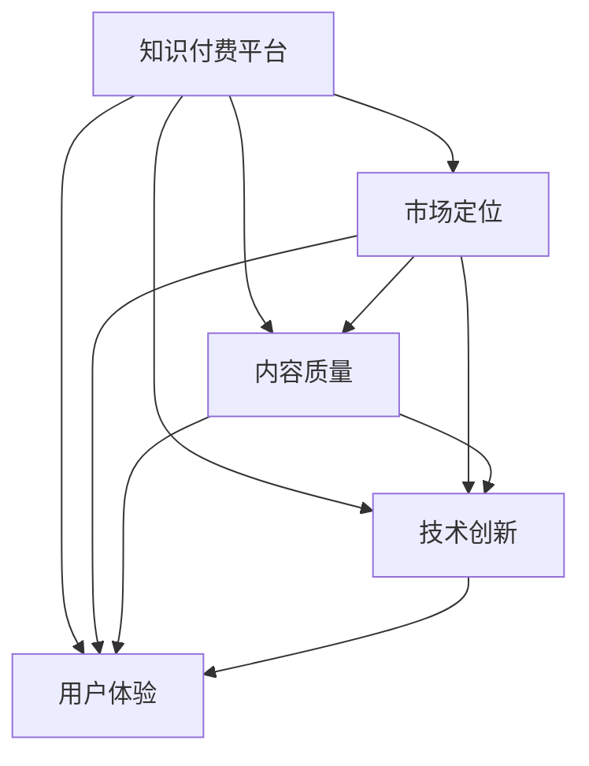

                 

## 1. 背景介绍

随着知识经济时代的到来，知识付费市场逐渐崛起，各类平台如雨后春笋般涌现。从音频、视频、文字到图文并茂的课程，知识付费的形式日益丰富。然而，在激烈的竞争中，许多平台和内容提供者难以脱颖而出，市场份额逐渐分化，竞争策略也逐步显现差异化趋势。那么，知识付费平台如何实现差异化竞争优势，成为市场中的佼佼者？本文将从市场定位、内容质量、技术创新和用户体验四个维度，探讨知识付费平台实现差异化竞争的策略。

## 2. 核心概念与联系

在深入探讨知识付费平台差异化竞争策略之前，我们首先要厘清一些核心概念及其联系。

### 2.1 核心概念概述

1. **知识付费平台(Knowledge Paywall Platforms)**：
   - **定义**：指提供知识产品或服务并收取相应费用的平台，如得到App、喜马拉雅、知乎、学而思网校等。
   - **功能**：包括内容创作、内容审核、知识推送、付费体系、用户管理等。
   - **竞争点**：通过提供专业知识和信息，满足用户的学习和成长需求。

2. **差异化竞争(Differentiated Competition)**：
   - **定义**：指企业通过提供与众不同的产品或服务，满足特定用户需求，从而在市场中获取竞争优势。
   - **手段**：包括市场定位、内容差异化、技术创新和用户体验提升。
   - **目标**：提升用户粘性，扩大市场份额，获得更高的利润回报。

3. **市场定位(Market Positioning)**：
   - **定义**：指确定目标市场并明确自身与竞争对手的区别，以吸引特定用户群体。
   - **方法**：通过细分市场，识别用户需求，寻找差异化切入点。
   - **目的**：建立品牌形象，提高用户认知度，在竞争中占据有利位置。

4. **内容质量(Content Quality)**：
   - **定义**：指知识内容的专业性和实用性。
   - **指标**：包括内容的原创性、深度、更新频率、用户评价等。
   - **重要性**：高质量内容是吸引用户的关键因素，也是提升用户满意度和忠诚度的基础。

5. **技术创新(Technology Innovation)**：
   - **定义**：指采用前沿技术，提高平台和内容交付效率。
   - **形式**：包括但不限于大数据分析、人工智能、区块链、云计算等。
   - **意义**：提升用户体验，优化平台运营效率，增加新业务增长点。

6. **用户体验(User Experience, UX)**：
   - **定义**：指用户在使用产品或服务过程中，体验的满意度和流畅性。
   - **维度**：包括界面设计、交互流程、功能完善性等。
   - **重要性**：良好的用户体验可以提升用户粘性，促使用户重复购买。

### 2.2 核心概念联系（Mermaid 流程图）



## 3. 核心算法原理 & 具体操作步骤

### 3.1 算法原理概述

知识付费平台实现差异化竞争的核心算法原理包括数据驱动决策、用户行为分析、推荐系统、广告投放优化等。这些算法共同作用于市场定位、内容质量、技术创新和用户体验，形成系统性的竞争优势。

1. **数据驱动决策**：通过收集和分析用户行为数据，识别用户需求和市场趋势，从而制定合理的市场定位和内容策略。
2. **用户行为分析**：使用机器学习算法，对用户行为数据进行建模和预测，优化推荐系统，提升用户体验。
3. **推荐系统**：基于用户兴趣和行为特征，推荐相关内容，增加用户粘性和满意度。
4. **广告投放优化**：利用数据分析结果，优化广告投放策略，精准触达目标用户。

### 3.2 算法步骤详解

#### 3.2.1 市场定位

**Step 1: 用户细分**：
- 使用聚类算法(如K-means)将用户分为不同的细分市场。
- 对每个细分市场进行特征分析，识别主要需求和偏好。

**Step 2: 差异化定位**：
- 选择具有较高增长潜力和较低竞争风险的细分市场。
- 确定品牌定位和市场口号，形成独特的市场形象。

**Step 3: 目标市场选择**：
- 通过市场调研和竞争分析，选择最适合的平台定位。
- 设定目标用户群体和市场份额，明确平台核心竞争力。

#### 3.2.2 内容质量提升

**Step 1: 内容审核与筛选**：
- 建立严格的内容审核机制，剔除低质量内容。
- 引入内容专家和第三方评估机构，提升内容专业性。

**Step 2: 内容更新与优化**：
- 定期更新内容，保持新鲜度和时效性。
- 基于用户反馈和数据驱动，进行内容优化和改进。

**Step 3: 用户评价与反馈**：
- 收集用户评价和反馈，改进内容质量。
- 引入用户评价机制，提升内容可信度和口碑。

#### 3.2.3 技术创新实施

**Step 1: 技术选型与集成**：
- 根据平台需求，选择合适的技术和工具，如大数据分析、AI算法、区块链等。
- 对技术进行集成和部署，提升平台运营效率。

**Step 2: 数据采集与分析**：
- 建立数据采集和存储系统，收集用户行为数据和市场数据。
- 利用数据挖掘和机器学习算法，进行数据建模和分析。

**Step 3: 系统迭代与优化**：
- 持续进行技术迭代和优化，提升平台性能和稳定性。
- 引入A/B测试等手段，验证技术效果，确保用户体验。

#### 3.2.4 用户体验优化

**Step 1: 界面设计与优化**：
- 设计简洁、美观、易用的界面，提升用户使用体验。
- 定期进行UI/UX优化，改善用户界面流畅性。

**Step 2: 交互流程优化**：
- 简化用户操作流程，减少操作步骤。
- 引入智能交互技术，提升用户互动体验。

**Step 3: 功能完善与扩展**：
- 持续引入新功能，提升平台综合功能。
- 根据用户需求进行功能扩展，增加用户粘性。

### 3.3 算法优缺点

#### 优点

1. **提升平台竞争力**：通过差异化定位和优质内容，提升平台市场份额和用户粘性。
2. **优化用户体验**：通过技术创新和用户体验优化，提升用户满意度和忠诚度。
3. **实现精准营销**：通过数据分析和广告优化，实现精准投放，提高广告效果。

#### 缺点

1. **数据依赖性高**：需要大量用户行为数据，可能面临数据隐私和安全问题。
2. **技术门槛高**：需要一定的技术储备和资源投入，增加运营成本。
3. **内容更新难度大**：高质量内容的生产和更新需要大量人力和资源，可能影响内容更新频率。

### 3.4 算法应用领域

1. **教育领域**：
   - 通过内容审核和个性化推荐，提升学习效果和满意度。
   - 利用技术创新优化在线教育平台，提供互动和沉浸式学习体验。

2. **医疗健康**：
   - 通过精准推荐和数据分析，提供个性化健康咨询和诊疗方案。
   - 利用区块链技术保障用户数据安全和隐私。

3. **职业技能**：
   - 提供高质量的职业技能培训课程和认证，提升用户职业竞争力。
   - 利用AI技术，进行职业发展路径规划和个性化建议。

4. **个人成长**：
   - 提供丰富的个人成长课程和资源，帮助用户实现自我提升。
   - 利用大数据分析，进行用户兴趣和行为预测，提升用户体验。

## 4. 数学模型和公式 & 详细讲解

### 4.1 数学模型构建

1. **用户细分模型**：
   - **聚类算法**：K-means、层次聚类等。
   - **用户特征提取**：性别、年龄、职业、兴趣等。

2. **内容推荐模型**：
   - **协同过滤**：基于用户行为数据的推荐算法。
   - **矩阵分解**：将用户-内容矩阵分解，挖掘潜在兴趣。

3. **广告投放模型**：
   - **线性回归**：预测广告效果，优化投放策略。
   - **逻辑回归**：分析用户转化率，提升广告点击率。

### 4.2 公式推导过程

#### 聚类算法K-means

K-means算法将n个用户样本分为k个簇，每个簇的中心点表示簇的质心。公式如下：

$$
\min_{C,\mu} \sum_{i=1}^n \min_{k=1}^m ||x_i - \mu_k||^2
$$

其中，$x_i$ 表示用户样本，$\mu_k$ 表示簇质心，$C$ 表示用户到簇的分配，$m$ 表示簇的个数。

#### 协同过滤推荐算法

协同过滤算法通过用户行为数据，找到用户之间的相似性，进行推荐。公式如下：

$$
\hat{y} = \frac{1}{\hat{s}_i^T \hat{s}_j + \epsilon} \hat{s}_i \hat{s}_j^T
$$

其中，$y$ 表示用户对内容的质量评分，$s_i$ 表示用户特征向量，$\epsilon$ 表示正则项，$\hat{y}$ 表示推荐评分。

#### 线性回归广告投放模型

线性回归模型用于预测广告效果，公式如下：

$$
y = \beta_0 + \sum_{i=1}^n \beta_i x_i
$$

其中，$y$ 表示广告效果，$x_i$ 表示广告特征，$\beta_i$ 表示特征系数，$\beta_0$ 表示截距。

### 4.3 案例分析与讲解

#### 案例1: 教育平台知识付费

1. **市场定位**：
   - 定位为在线K-12教育平台，专注于中小学生的课外辅导和素质教育。
   - 目标用户为中小学生和家长，提供个性化学习计划和辅导服务。

2. **内容质量提升**：
   - 引入名师授课，提供高质量教学视频和课件。
   - 定期更新课程内容，提供最新的教育资讯和资源。

3. **技术创新**：
   - 引入AI技术，进行个性化推荐和智能辅导。
   - 利用大数据分析，优化课程内容和学习路径。

4. **用户体验优化**：
   - 设计简洁易用的界面，提供良好的学习体验。
   - 引入互动功能，提升用户参与度。

#### 案例2: 职业技能培训

1. **市场定位**：
   - 定位为职业技能培训平台，专注于提升职业技能和职业竞争力。
   - 目标用户为职场人士和求职者，提供实用技能培训和职业认证。

2. **内容质量提升**：
   - 引入行业专家和从业者授课，提供实用的职业技能课程。
   - 提供实战案例和项目经验，提升课程实战性。

3. **技术创新**：
   - 利用AI技术，进行职业发展路径规划和个性化建议。
   - 利用区块链技术，保障用户数据安全和隐私。

4. **用户体验优化**：
   - 提供灵活的学习时间和方式，提升用户学习便利性。
   - 引入智能交互和反馈机制，提升用户互动体验。

## 5. 项目实践：代码实例和详细解释说明

### 5.1 开发环境搭建

1. **选择开发语言**：
   - Python是最常用的知识付费平台开发语言，具有丰富的第三方库和框架支持。
   - 推荐使用Jupyter Notebook进行代码开发和测试。

2. **安装开发环境**：
   - 安装Python、pip、Jupyter Notebook。
   - 安装相关的开发依赖，如Flask、Django、Scikit-learn、TensorFlow等。

3. **搭建开发环境**：
   - 创建Python虚拟环境，安装项目依赖。
   - 搭建开发服务器，进行项目测试和部署。

### 5.2 源代码详细实现

以下是一个简单的知识付费平台代码实现示例：

1. **用户注册与登录**：

```python
from flask import Flask, request, jsonify

app = Flask(__name__)

# 用户注册
@app.route('/register', methods=['POST'])
def register():
    data = request.json
    # 处理用户注册逻辑
    return jsonify({'message': '注册成功'})

# 用户登录
@app.route('/login', methods=['POST'])
def login():
    data = request.json
    # 处理用户登录逻辑
    return jsonify({'message': '登录成功'})
```

2. **内容推荐系统**：

```python
# 协同过滤推荐系统
class CollaborativeFiltering:
    def __init__(self, matrix):
        self.matrix = matrix
        self.size = len(matrix)
        self.similarity_matrix = np.zeros((self.size, self.size))
    
    def similarity(self, user1, user2):
        return np.dot(self.matrix[user1], self.matrix[user2].T) / (np.linalg.norm(self.matrix[user1]) * np.linalg.norm(self.matrix[user2]))
    
    def predict(self, user, item):
        predictions = [self.similarity(user, i) for i in range(self.size)]
        return np.dot(predictions, self.matrix[item])
```

3. **数据分析与可视化**：

```python
import pandas as pd
import matplotlib.pyplot as plt

# 数据读取
data = pd.read_csv('user_behavior.csv')

# 数据可视化
plt.hist(data['time'], bins=30)
plt.xlabel('Time')
plt.ylabel('Frequency')
plt.show()
```

### 5.3 代码解读与分析

#### 代码1: 用户注册与登录

**注册与登录逻辑**：
- 通过Flask框架实现用户注册和登录功能。
- 使用POST方法接收用户提交的JSON数据，并进行处理。
- 注册和登录成功，返回JSON响应。

#### 代码2: 协同过滤推荐系统

**协同过滤算法**：
- 使用Python实现协同过滤推荐系统，通过用户行为矩阵计算用户间的相似度。
- 利用相似度矩阵计算推荐结果。

#### 代码3: 数据分析与可视化

**数据处理与可视化**：
- 使用Pandas和Matplotlib处理数据和进行可视化。
- 读取用户行为数据，进行时间分布的直方图绘制。

### 5.4 运行结果展示

1. **用户注册与登录结果**：
   - 注册和登录成功，返回JSON响应。

2. **协同过滤推荐结果**：
   - 基于用户行为数据，计算推荐评分，返回推荐内容列表。

3. **数据分析与可视化结果**：
   - 用户行为数据的时间分布直方图，展示用户使用频率和活跃度。

## 6. 实际应用场景

### 6.1 智能客服

智能客服平台通过知识付费实现差异化竞争，提供个性化的智能客服解决方案，提高用户满意度和服务效率。

1. **市场定位**：
   - 定位为智能客服解决方案提供商，专注于企业级的客服需求。
   - 目标用户为企业，提供定制化的智能客服系统。

2. **内容质量提升**：
   - 引入行业专家和经验丰富的客服人员，提供高质量的客服内容。
   - 定期更新和优化客服内容，提升客服质量。

3. **技术创新**：
   - 利用AI技术，进行对话理解和自然语言处理。
   - 引入机器学习和数据分析，优化客服系统。

4. **用户体验优化**：
   - 设计简洁易用的界面，提供良好的使用体验。
   - 引入智能交互和反馈机制，提升用户互动体验。

### 6.2 医疗健康

医疗健康平台通过知识付费实现差异化竞争，提供精准的医疗健康咨询服务，提升用户健康水平和满意度。

1. **市场定位**：
   - 定位为医疗健康咨询服务提供商，专注于个人健康咨询和诊疗。
   - 目标用户为个人用户，提供专业、精准的医疗健康咨询。

2. **内容质量提升**：
   - 引入医学专家和专业医生，提供高质量的医疗健康内容。
   - 定期更新和优化医疗健康内容，提升咨询质量。

3. **技术创新**：
   - 利用AI技术，进行病历分析和大数据分析。
   - 引入区块链技术，保障用户数据安全和隐私。

4. **用户体验优化**：
   - 提供实时在线咨询服务，提升用户使用体验。
   - 引入智能交互和反馈机制，提升用户互动体验。

## 7. 工具和资源推荐

### 7.1 学习资源推荐

1. **《知识付费平台设计与运营》**：
   - 提供知识付费平台的全景分析和技术实践，涵盖市场定位、内容质量提升、技术创新和用户体验优化。
   - 推荐阅读《知识付费平台设计与运营》书籍，获取系统的知识付费平台开发经验。

2. **《Python数据分析与可视化》**：
   - 提供Python数据分析和可视化的实用技巧和方法，涵盖数据处理、数据建模和可视化技术。
   - 推荐阅读《Python数据分析与可视化》书籍，掌握Python数据分析与可视化技能。

3. **《深度学习与知识图谱》**：
   - 提供深度学习和知识图谱的理论与实践，涵盖深度学习算法、知识图谱构建与应用。
   - 推荐阅读《深度学习与知识图谱》书籍，了解深度学习与知识图谱的最新研究进展。

### 7.2 开发工具推荐

1. **Flask**：
   - 轻量级的Web框架，适合快速开发知识付费平台。
   - 支持RESTful API开发，方便集成第三方服务。

2. **Django**：
   - 全功能的Web框架，适合大型知识付费平台开发。
   - 提供丰富的ORM和插件支持，方便开发和维护。

3. **TensorFlow**：
   - 开源的深度学习框架，支持多种深度学习算法和模型。
   - 适合大规模数据处理和深度学习任务开发。

4. **PyTorch**：
   - 灵活的深度学习框架，支持动态计算图和GPU加速。
   - 适合快速迭代和研究性项目开发。

5. **Jupyter Notebook**：
   - 交互式开发环境，方便进行代码测试和数据可视化。
   - 支持Python、R、SQL等多种语言和工具。

### 7.3 相关论文推荐

1. **《知识付费平台的市场定位与差异化竞争策略》**：
   - 讨论知识付费平台的市场定位和差异化竞争策略，提供系统的理论分析和技术实践。
   - 推荐阅读《知识付费平台的市场定位与差异化竞争策略》论文，获取最新的知识付费平台研究进展。

2. **《内容推荐系统算法与应用》**：
   - 讨论内容推荐系统的算法和应用，涵盖协同过滤、矩阵分解、深度学习等推荐算法。
   - 推荐阅读《内容推荐系统算法与应用》论文，掌握内容推荐系统的最新研究进展。

3. **《用户行为分析与个性化推荐》**：
   - 讨论用户行为分析与个性化推荐技术，涵盖机器学习、数据分析等技术。
   - 推荐阅读《用户行为分析与个性化推荐》论文，了解用户行为分析的最新研究进展。

## 8. 总结：未来发展趋势与挑战

### 8.1 研究成果总结

1. **市场定位**：
   - 市场定位是实现差异化竞争的关键，通过细分市场和明确品牌形象，形成独特的市场优势。
   - 通过用户细分和数据分析，精准定位目标用户群体，提升市场竞争力。

2. **内容质量**：
   - 高质量的内容是吸引用户的关键，通过引入名师授课和持续内容更新，提升用户满意度和忠诚度。
   - 内容质量提升需要不断优化内容审核机制，引入第三方评估机构，保障内容专业性。

3. **技术创新**：
   - 技术创新是提升平台竞争力的重要手段，通过引入AI和大数据分析，提升平台运营效率和用户体验。
   - 持续进行技术迭代和优化，提升平台性能和稳定性。

4. **用户体验**：
   - 用户体验是提升用户粘性的重要因素，通过界面设计、交互流程优化和功能完善，提升用户满意度和忠诚度。
   - 引入智能交互和反馈机制，提升用户互动体验。

### 8.2 未来发展趋势

1. **市场细分化**：
   - 知识付费市场将更加细分化，出现更多垂直领域的知识付费平台，满足特定用户需求。

2. **内容多样化**：
   - 内容形式将更加多样化，包括视频、音频、图文并茂等形式，提升用户使用体验。

3. **技术创新**：
   - 技术创新将持续推进，如AI、区块链、大数据等技术，提升平台运营效率和安全性。

4. **个性化推荐**：
   - 推荐系统将更加精准，通过用户行为分析和数据分析，实现个性化推荐，提升用户体验。

5. **用户体验优化**：
   - 用户体验将更加注重界面设计、交互流程和功能完善，提升用户粘性和满意度。

### 8.3 面临的挑战

1. **数据隐私和安全**：
   - 用户数据隐私和安全是知识付费平台面临的重要挑战，需要加强数据保护措施，保障用户数据安全。

2. **内容审核和质量控制**：
   - 内容审核和质量控制需要严格把关，避免低质量内容对平台形象和用户体验造成负面影响。

3. **技术复杂度**：
   - 技术复杂度较高，需要较强的技术储备和资源投入，可能增加运营成本。

4. **用户粘性提升**：
   - 用户粘性提升需要持续优化用户体验，面临较大挑战。

5. **市场竞争激烈**：
   - 知识付费市场竞争激烈，需要不断创新和优化，才能在竞争中脱颖而出。

### 8.4 研究展望

1. **数据驱动决策**：
   - 引入更多数据驱动决策技术，通过大数据分析和机器学习，提升平台运营效率和市场定位。

2. **内容质量控制**：
   - 引入内容质量控制机制，通过用户评价和第三方评估，保障内容专业性和可靠性。

3. **技术创新**：
   - 引入更多前沿技术，如自然语言处理、情感分析等，提升平台运营效率和用户体验。

4. **个性化推荐**：
   - 引入个性化推荐技术，通过用户行为分析和内容分析，实现精准推荐。

5. **用户体验优化**：
   - 持续优化用户体验，引入智能交互和反馈机制，提升用户粘性和满意度。

综上所述，知识付费平台通过差异化竞争策略，可以提升市场竞争力，实现更高的用户满意度和业务增长。然而，面对市场细分化、内容多样化、技术创新等挑战，知识付费平台需要不断创新和优化，才能在激烈的市场竞争中脱颖而出。

## 9. 附录：常见问题与解答

### 9.1 问题1：知识付费平台如何吸引用户？

**回答**：
- 吸引用户的关键在于高质量内容和个性化推荐。通过引入名师授课和持续内容更新，提升内容质量。
- 利用推荐系统，根据用户行为数据进行个性化推荐，提升用户体验。

### 9.2 问题2：知识付费平台如何保证内容质量？

**回答**：
- 建立严格的内容审核机制，剔除低质量内容。引入内容专家和第三方评估机构，保障内容专业性。
- 定期更新内容，保持新鲜度和时效性，提升用户满意度和忠诚度。

### 9.3 问题3：知识付费平台如何提升用户体验？

**回答**：
- 设计简洁易用的界面，提供良好的使用体验。引入智能交互和反馈机制，提升用户互动体验。
- 优化交互流程，减少操作步骤，提高用户使用便利性。

### 9.4 问题4：知识付费平台如何优化市场定位？

**回答**：
- 通过用户细分和数据分析，明确目标用户群体和市场需求。
- 确定品牌定位和市场口号，形成独特的市场形象，提升用户认知度和品牌忠诚度。

### 9.5 问题5：知识付费平台如何提高用户粘性？

**回答**：
- 提供灵活的学习时间和方式，提升用户学习便利性。
- 引入个性化推荐和智能辅导，提升用户参与度和满意度。
- 利用数据分析和机器学习，优化推荐系统和学习路径，增加用户粘性。

---

作者：禅与计算机程序设计艺术 / Zen and the Art of Computer Programming

