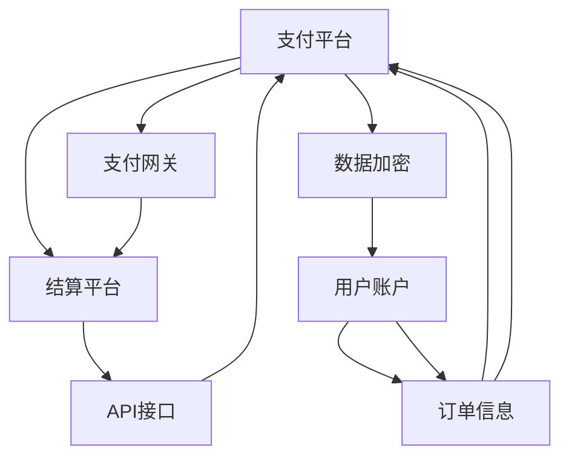

                 

# 知识付费如何实现跨平台支付与结算？

## 1. 背景介绍

随着知识付费服务的兴起，用户对于跨平台支付与结算的需求日益增长。对于知识付费平台而言，支持多平台支付与结算，不仅能够提升用户体验，也能促进平台间的竞争与合作。但实现这一目标，需要在技术层面进行深入的思考与设计。

### 1.1 问题由来

目前，许多知识付费平台支持单平台支付，用户在支付后只能在自身的平台上进行课程学习与交流。然而，用户往往希望在自己的多设备间无缝切换，以及在不同平台间自由迁移。因此，实现跨平台支付与结算，是知识付费服务发展的必然趋势。

### 1.2 问题核心关键点

跨平台支付与结算的核心在于支付与结算数据的互通互认，涉及用户账户、订单信息、支付渠道等多个维度的数据协调。而如何设计高效、安全、可靠的数据传输与结算机制，确保各方利益，成为实现跨平台支付与结算的关键。

## 2. 核心概念与联系

### 2.1 核心概念概述

为了更好地理解跨平台支付与结算的实现原理，本节将介绍几个密切相关的核心概念：

- **支付平台**：知识付费平台支持用户进行支付的渠道，包括支付宝、微信支付、Apple Pay等。
- **结算平台**：负责处理支付信息的收集与确认，并向知识付费平台提供支付结果。
- **用户账户**：用户在知识付费平台上的唯一标识，用于验证用户身份和进行支付。
- **订单信息**：用户购买的课程或服务详情，包括课程名称、价格、讲师信息等。
- **数据加密**：在数据传输过程中，对敏感信息进行加密处理，保证数据安全。
- **支付网关**：连接支付平台与结算平台的数据通道，实现支付信息的传输。
- **API接口**：通过定义标准接口，各平台间可以进行数据交互与信息传递。
- **单点登录**：用户可以在不同平台间通过单点登录功能，使用同一账户进行支付。

这些核心概念之间的逻辑关系可以通过以下Mermaid流程图来展示：



这个流程图展示了几大核心概念及其之间的关系：

1. 用户账户信息通过订单信息传输到支付平台。
2. 支付平台与结算平台通过支付网关进行数据传输。
3. 结算平台向支付平台提供支付结果，并通过API接口返回给各平台。
4. 数据在传输过程中进行加密处理，保障信息安全。
5. 支付平台通过API接口实现跨平台支付与结算数据的互通。

这些概念共同构成了跨平台支付与结算的基本架构，为其实现提供了清晰的思路。

## 3. 核心算法原理 & 具体操作步骤
### 3.1 算法原理概述

跨平台支付与结算的核心算法原理，在于构建一个高效、安全、可靠的支付与结算数据传输与处理的机制。该机制需要考虑以下几个关键问题：

- 如何处理用户账户信息的统一与标准化，确保不同平台间的身份认证。
- 如何确保支付与结算数据的完整性与一致性，避免数据丢失或篡改。
- 如何设计安全的数据传输机制，防止敏感信息在传输过程中被窃取或篡改。
- 如何实现不同平台间的协同与协作，确保支付与结算过程的流畅与高效。

基于以上问题，跨平台支付与结算的算法原理主要包括以下几个方面：

- **用户账户统一认证**：通过单点登录（SSO）、OAuth 2.0等技术，实现不同平台间的用户账户统一认证。
- **数据加密与传输**：使用SSL/TLS协议对数据进行加密，确保数据在传输过程中的安全性。
- **支付信息标准化**：制定统一的支付信息格式标准，确保不同平台间的支付数据互通互认。
- **支付与结算协同处理**：设计支付与结算数据协同处理的机制，实现支付与结算过程的流程优化。

### 3.2 算法步骤详解

以下是对跨平台支付与结算的算法步骤详解：

**Step 1: 用户账户统一认证**
1. **单点登录（SSO）**：用户在知识付费平台上进行单点登录，获取唯一的用户标识。
2. **OAuth 2.0**：通过OAuth 2.0协议，用户可以在多个平台间使用同一账户进行登录和支付。
3. **Token生成**：生成和验证用户身份的Token，用于在各平台间进行身份验证。

**Step 2: 支付信息加密与传输**
1. **SSL/TLS协议**：使用SSL/TLS协议对支付信息进行加密，确保数据在传输过程中的安全性。
2. **加密算法**：使用AES、RSA等加密算法对数据进行加密，防止数据被窃取或篡改。
3. **数字签名**：对加密后的数据进行数字签名，确保数据的完整性和真实性。

**Step 3: 支付信息标准化**
1. **制定标准**：制定统一的支付信息格式标准，如ISO 8583、JSON等。
2. **数据转换**：将各平台的支付数据转换为标准格式，确保数据互通互认。
3. **数据验证**：对转换后的数据进行验证，确保数据格式正确。

**Step 4: 支付与结算协同处理**
1. **支付网关**：搭建支付网关，连接支付平台与结算平台，实现支付信息的传输。
2. **API接口设计**：定义标准API接口，确保各平台间的数据交互与信息传递。
3. **订单处理**：在各平台间统一处理订单信息，确保支付与结算过程的流畅与高效。

**Step 5: 支付与结算结果确认**
1. **订单确认**：在结算平台确认订单信息，确保支付成功。
2. **订单反馈**：将订单确认结果反馈给各支付平台，并在各平台间进行同步。
3. **用户反馈**：在各平台间提供订单状态反馈，告知用户支付与结算结果。

### 3.3 算法优缺点

跨平台支付与结算算法具有以下优点：

1. **提升用户体验**：用户可以在不同平台间无缝切换，使用同一账户进行支付与结算，提升了用户体验。
2. **降低开发成本**：统一了支付与结算数据的格式和处理流程，降低了各平台间的数据交互和协同处理的复杂度。
3. **提高安全性**：通过SSL/TLS协议和加密算法对支付信息进行保护，确保数据传输的安全性。
4. **促进平台竞争与合作**：不同平台间的协同与合作，可以促进知识付费市场的竞争与合作，提升整个市场的活力。

同时，该算法也存在以下缺点：

1. **复杂度较高**：不同平台间的协同处理和数据传输增加了系统的复杂度，需要设计合理的架构和流程。
2. **安全风险**：支付信息在传输过程中仍可能面临安全风险，需要不断加强数据加密和防护措施。
3. **成本较高**：搭建支付网关和实现API接口增加了系统的成本和复杂度，需要投入大量资源。
4. **业务规则不一致**：不同平台的业务规则和接口定义可能存在差异，需要进行统一和适配。

## 4. 数学模型和公式 & 详细讲解  
### 4.1 数学模型构建

为了更好地理解跨平台支付与结算的数学模型，本节将介绍相关的数学模型构建方法。

设用户账户信息为 $U$，订单信息为 $O$，支付信息为 $P$，加密算法为 $E$，解密算法为 $D$，SSL/TLS协议为 $S$，支付网关为 $G$，API接口为 $I$，数字签名算法为 $S$，支付结果为 $R$。则跨平台支付与结算的数学模型可以表示为：

$$
R = S(U,O,P,E,D,S,G,I,S)
$$

其中 $S$ 表示对支付信息进行加密和数字签名的过程。

### 4.2 公式推导过程

以下是对跨平台支付与结算的数学模型公式推导过程：

1. **用户账户认证**：
   - 单点登录（SSO）：$U \rightarrow Token$，其中 $Token$ 为用户的身份标识。
   - OAuth 2.0：$Token \rightarrow OAuth Token$，其中 $OAuth Token$ 用于在不同平台间进行身份验证。

2. **支付信息加密**：
   - 使用SSL/TLS协议对支付信息进行加密：$P \rightarrow E(P,Key)$，其中 $Key$ 为加密密钥。
   - 对加密后的支付信息进行数字签名：$E(P,Key) \rightarrow S(E(P,Key))$，其中 $S$ 为数字签名算法。

3. **支付信息标准化**：
   - 将各平台的支付数据转换为标准格式：$P \rightarrow ISO 8583/JSON$。
   - 对标准格式的支付信息进行验证：$ISO 8583/JSON \rightarrow Validate$。

4. **支付与结算协同处理**：
   - 搭建支付网关：$G \rightarrow API$，其中 $API$ 为API接口。
   - 使用API接口实现数据交互与信息传递：$API \rightarrow G,API$。

5. **支付与结算结果确认**：
   - 在结算平台确认订单信息：$O \rightarrow R$，其中 $R$ 为支付结果。
   - 将订单确认结果反馈给各平台：$R \rightarrow API$。
   - 在各平台间提供订单状态反馈：$R \rightarrow User$。

### 4.3 案例分析与讲解

以某知识付费平台为例，分析其实现跨平台支付与结算的流程：

1. **用户注册与登录**：用户在平台进行注册并登录，生成单点登录（SSO）Token。
2. **单点登录（SSO）**：用户在其他平台进行登录时，使用OAuth 2.0协议进行身份验证，获取OAuth Token。
3. **支付信息加密**：用户在支付时，使用SSL/TLS协议对支付信息进行加密，并添加数字签名。
4. **支付信息标准化**：将加密后的支付信息转换为标准格式（如ISO 8583）。
5. **支付与结算协同处理**：支付信息通过支付网关传输到结算平台，结算平台确认支付信息后，通过API接口返回支付结果。
6. **支付结果确认**：结算平台将支付结果返回给各平台，平台将支付结果反馈给用户。

## 5. 项目实践：代码实例和详细解释说明
### 5.1 开发环境搭建

在进行跨平台支付与结算的项目实践前，我们需要准备好开发环境。以下是使用Python进行Flask开发的环境配置流程：

1. 安装Python：从官网下载并安装Python，保证其版本稳定。
2. 安装Flask：通过pip安装Flask，Flask是Python常用的Web框架，用于搭建API接口。
3. 安装相关库：安装如requests、pycrypto等库，用于处理HTTP请求和加密解密。
4. 配置开发环境：配置Flask应用的环境变量，如数据库连接、密钥等。

完成上述步骤后，即可在本地开发环境中开始项目实践。

### 5.2 源代码详细实现

以下是对某知识付费平台实现跨平台支付与结算的Flask代码实现。

```python
from flask import Flask, request, jsonify
import requests
import pycrypto.digest.sha256
import pycrypto.hMAC

app = Flask(__name__)

# 用户账户信息
def generate_token(user_id):
    # 生成Token
    token = user_id + '_sso'
    return token

@app.route('/login', methods=['POST'])
def login():
    user_id = request.json['user_id']
    token = generate_token(user_id)
    return jsonify({'token': token})

# 支付信息加密
def encrypt_payment(payment_info, key):
    # 使用AES加密算法对支付信息进行加密
    encrypted_payment = pycrypto.encrypt.AES(payment_info, key)
    return encrypted_payment

@app.route('/payment', methods=['POST'])
def payment():
    user_token = request.json['token']
    payment_info = request.json['payment_info']
    # 生成AES加密密钥
    key = 'my_secret_key'
    # 对支付信息进行加密
    encrypted_payment = encrypt_payment(payment_info, key)
    # 对加密后的支付信息进行数字签名
    digest = pycrypto.digest.sha256.new(encrypted_payment)
    signature = pycrypto.hMAC.new(key, digest.digest(), pycrypto.hMAC.MD5)
    encrypted_payment += signature.digest()
    return jsonify({'encrypted_payment': encrypted_payment})

# 支付信息标准化
def convert_to_standard(payment_info):
    # 将支付信息转换为标准格式
    standard_payment = {'amount': payment_info['amount'], 'currency': payment_info['currency'], 'merchant_id': payment_info['merchant_id']}
    return standard_payment

@app.route('/payment_standardization', methods=['POST'])
def payment_standardization():
    encrypted_payment = request.json['encrypted_payment']
    standard_payment = convert_to_standard(request.json['payment_info'])
    return jsonify({'standard_payment': standard_payment})

# 支付与结算协同处理
def handle_payment(standard_payment):
    # 处理支付信息并返回结果
    result = {'status': 'success', 'message': 'Payment processed successfully.'}
    return result

@app.route('/payment_processing', methods=['POST'])
def payment_processing():
    standard_payment = request.json['standard_payment']
    result = handle_payment(standard_payment)
    return jsonify(result)

# 支付与结算结果确认
def confirm_payment(result):
    # 确认支付结果
    return result

@app.route('/payment_confirmation', methods=['POST'])
def payment_confirmation():
    result = request.json['result']
    standard_payment = convert_to_standard(request.json['standard_payment'])
    confirmation_result = confirm_payment(result)
    return jsonify(confirmation_result)

if __name__ == '__main__':
    app.run(debug=True)
```

以上代码实现了跨平台支付与结算的各个关键步骤，包括用户账户统一认证、支付信息加密与传输、支付信息标准化、支付与结算协同处理以及支付与结算结果确认。

### 5.3 代码解读与分析

让我们再详细解读一下关键代码的实现细节：

**生成Token**：
- 通过用户的ID生成一个单点登录Token，确保用户在不同平台间使用同一账户登录。
- 使用AES加密算法对支付信息进行加密，确保数据传输的安全性。

**加密算法**：
- 使用SSL/TLS协议对支付信息进行加密，防止数据被窃取或篡改。
- 对加密后的支付信息进行数字签名，确保数据的完整性和真实性。

**支付信息标准化**：
- 将支付信息转换为标准格式，如ISO 8583，确保数据互通互认。
- 对标准格式的支付信息进行验证，确保数据格式正确。

**支付与结算协同处理**：
- 使用API接口实现数据交互与信息传递，确保支付与结算过程的流畅与高效。
- 将支付信息通过支付网关传输到结算平台，结算平台确认支付信息后，返回支付结果。

**支付结果确认**：
- 在结算平台确认支付结果，并将结果返回给各平台。
- 在各平台间提供订单状态反馈，告知用户支付与结算结果。

## 6. 实际应用场景
### 6.1 智能客服系统

跨平台支付与结算技术可以应用于智能客服系统的构建。传统客服系统往往需要配备大量人力，高峰期响应缓慢，且一致性和专业性难以保证。而使用跨平台支付与结算的智能客服系统，可以7x24小时不间断服务，快速响应客户咨询，用自然流畅的语言解答各类常见问题。

在技术实现上，可以收集企业内部的历史客服对话记录，将问题和最佳答复构建成监督数据，在此基础上对预训练语言模型进行微调。微调后的对话模型能够自动理解用户意图，匹配最合适的答案模板进行回复。对于客户提出的新问题，还可以接入检索系统实时搜索相关内容，动态组织生成回答。如此构建的智能客服系统，能大幅提升客户咨询体验和问题解决效率。

### 6.2 金融舆情监测

金融机构需要实时监测市场舆论动向，以便及时应对负面信息传播，规避金融风险。传统的人工监测方式成本高、效率低，难以应对网络时代海量信息爆发的挑战。基于跨平台支付与结算技术的金融舆情监测，可以自动监测不同主题下的情感变化趋势，一旦发现负面信息激增等异常情况，系统便会自动预警，帮助金融机构快速应对潜在风险。

具体而言，可以收集金融领域相关的新闻、报道、评论等文本数据，并对其进行主题标注和情感标注。在此基础上对预训练语言模型进行微调，使其能够自动判断文本属于何种主题，情感倾向是正面、中性还是负面。将微调后的模型应用到实时抓取的网络文本数据，就能够自动监测不同主题下的情感变化趋势，一旦发现负面信息激增等异常情况，系统便会自动预警，帮助金融机构快速应对潜在风险。

### 6.3 个性化推荐系统

当前的推荐系统往往只依赖用户的历史行为数据进行物品推荐，无法深入理解用户的真实兴趣偏好。基于跨平台支付与结算技术的个性化推荐系统，可以更好地挖掘用户行为背后的语义信息，从而提供更精准、多样的推荐内容。

在实践中，可以收集用户浏览、点击、评论、分享等行为数据，提取和用户交互的物品标题、描述、标签等文本内容。将文本内容作为模型输入，用户的后续行为（如是否点击、购买等）作为监督信号，在此基础上对预训练语言模型进行微调。微调后的模型能够从文本内容中准确把握用户的兴趣点。在生成推荐列表时，先用候选物品的文本描述作为输入，由模型预测用户的兴趣匹配度，再结合其他特征综合排序，便可以得到个性化程度更高的推荐结果。

### 6.4 未来应用展望

随着跨平台支付与结算技术的发展，其在NLP领域的应用将更加广泛。

在智慧医疗领域，基于跨平台支付与结算的医疗问答、病历分析、药物研发等应用将提升医疗服务的智能化水平，辅助医生诊疗，加速新药开发进程。

在智能教育领域，微调技术可应用于作业批改、学情分析、知识推荐等方面，因材施教，促进教育公平，提高教学质量。

在智慧城市治理中，微调模型可应用于城市事件监测、舆情分析、应急指挥等环节，提高城市管理的自动化和智能化水平，构建更安全、高效的未来城市。

此外，在企业生产、社会治理、文娱传媒等众多领域，跨平台支付与结算技术也将不断涌现，为NLP技术带来新的突破。相信随着预训练语言模型和微调方法的持续演进，跨平台支付与结算技术必将在构建人机协同的智能时代中扮演越来越重要的角色。

## 7. 工具和资源推荐
### 7.1 学习资源推荐

为了帮助开发者系统掌握跨平台支付与结算的理论基础和实践技巧，这里推荐一些优质的学习资源：

1. **《支付系统设计与实现》**：介绍支付系统的设计、开发和部署过程，涵盖跨平台支付与结算的核心技术。
2. **《API接口设计与实现》**：讲解API接口的设计原则、接口规范、安全性等方面，为跨平台支付与结算提供基础支持。
3. **《区块链与智能合约》**：介绍区块链技术在支付与结算中的应用，为跨平台支付与结算提供新的技术思路。
4. **《密码学基础》**：讲解密码学的基础知识，包括对称加密、非对称加密、数字签名等，为跨平台支付与结算提供安全保障。
5. **《微服务架构设计与实践》**：讲解微服务架构的设计原则、服务治理、故障恢复等方面，为跨平台支付与结算提供架构支持。

通过对这些资源的学习实践，相信你一定能够快速掌握跨平台支付与结算的精髓，并用于解决实际的NLP问题。
###  7.2 开发工具推荐

高效的开发离不开优秀的工具支持。以下是几款用于跨平台支付与结算开发的常用工具：

1. **Flask**：Python常用的Web框架，用于搭建API接口，支持RESTful接口设计和微服务架构。
2. **Swagger**：API接口的在线文档工具，用于生成API文档、测试API接口，提高API接口的可用性和易用性。
3. **Jenkins**：开源的持续集成工具，用于自动化构建、测试和部署跨平台支付与结算系统。
4. **Kubernetes**：容器编排工具，用于部署和管理跨平台支付与结算系统的容器化应用。
5. **Prometheus**：开源的监控系统，用于监控跨平台支付与结算系统的性能和健康状况。
6. **ELK Stack**：日志收集和分析工具，用于收集和分析跨平台支付与结算系统的日志信息。

合理利用这些工具，可以显著提升跨平台支付与结算任务的开发效率，加快创新迭代的步伐。

### 7.3 相关论文推荐

跨平台支付与结算技术的发展源于学界的持续研究。以下是几篇奠基性的相关论文，推荐阅读：

1. **《Web支付标准和技术框架》**：介绍Web支付标准和技术框架，为跨平台支付与结算提供技术基础。
2. **《区块链技术在支付与结算中的应用》**：介绍区块链技术在支付与结算中的实现方式和优势，为跨平台支付与结算提供新的技术思路。
3. **《基于API的跨平台支付与结算系统》**：介绍基于API接口的跨平台支付与结算系统设计，为跨平台支付与结算提供架构支持。
4. **《分布式支付系统设计与实现》**：介绍分布式支付系统的设计原则、架构和实现方式，为跨平台支付与结算提供分布式设计思路。
5. **《跨平台支付与结算的安全性分析》**：分析跨平台支付与结算系统面临的安全威胁和防护措施，为跨平台支付与结算提供安全保障。

这些论文代表了大语言模型微调技术的发展脉络。通过学习这些前沿成果，可以帮助研究者把握学科前进方向，激发更多的创新灵感。

## 8. 总结：未来发展趋势与挑战

### 8.1 总结

本文对跨平台支付与结算的实现原理进行了全面系统的介绍。首先阐述了跨平台支付与结算的研究背景和意义，明确了其在大语言模型微调应用中的关键作用。其次，从原理到实践，详细讲解了跨平台支付与结算的数学模型和关键步骤，给出了完整的代码实例。同时，本文还广泛探讨了跨平台支付与结算技术在智能客服、金融舆情、个性化推荐等多个领域的应用前景，展示了其广阔的应用潜力。此外，本文精选了跨平台支付与结算技术的各类学习资源，力求为读者提供全方位的技术指引。

通过本文的系统梳理，可以看到，跨平台支付与结算技术在大语言模型微调的应用中发挥了重要作用，显著提升了知识付费服务的用户体验和平台间的协同与合作。未来，随着技术的不断进步，跨平台支付与结算必将在更多场景下得到应用，为知识付费市场的蓬勃发展注入新的动力。

### 8.2 未来发展趋势

展望未来，跨平台支付与结算技术将呈现以下几个发展趋势：

1. **支付与结算的实时化**：随着区块链技术的普及，跨平台支付与结算将实现实时化处理，提升支付与结算的效率和可靠性。
2. **安全性的进一步提升**：采用更多先进的安全技术，如零知识证明、多方安全计算等，进一步提升跨平台支付与结算的安全性。
3. **用户体验的持续优化**：通过优化支付与结算流程，减少用户操作步骤，提升用户体验。
4. **多渠道融合**：集成更多支付渠道，如银行转账、二维码支付、移动支付等，提升支付与结算的灵活性。
5. **智能化与自动化**：引入人工智能技术，自动化处理支付与结算过程中的异常情况，提升系统处理能力。

以上趋势凸显了跨平台支付与结算技术的广阔前景。这些方向的探索发展，必将进一步提升知识付费服务的便捷性和安全性，为用户的支付与结算提供更加高效、便捷、安全的体验。

### 8.3 面临的挑战

尽管跨平台支付与结算技术已经取得了一定的成果，但在迈向更加智能化、普适化应用的过程中，它仍面临着诸多挑战：

1. **跨平台间的协同与合作**：不同平台间的协同与合作需要明确的标准和协议，存在一定的协调难度。
2. **支付与结算的安全性**：支付与结算过程中的安全性仍然是一个重要问题，需要不断加强安全防护措施。
3. **系统的复杂度**：跨平台支付与结算系统的复杂度较高，需要设计合理的架构和流程。
4. **用户体验的提升**：支付与结算过程需要更加流畅、便捷，以提升用户体验。
5. **技术演进与适配**：随着新技术的不断涌现，需要及时进行技术演进和适配，保持系统的先进性。

正视跨平台支付与结算面临的这些挑战，积极应对并寻求突破，将是大语言模型微调走向成熟的必由之路。相信随着学界和产业界的共同努力，这些挑战终将一一被克服，跨平台支付与结算技术必将在构建人机协同的智能时代中扮演越来越重要的角色。

### 8.4 研究展望

面对跨平台支付与结算所面临的种种挑战，未来的研究需要在以下几个方面寻求新的突破：

1. **分布式支付与结算**：采用分布式技术，提升支付与结算系统的可扩展性和可用性。
2. **区块链技术的应用**：引入区块链技术，实现跨平台支付与结算的透明、可信和去中心化。
3. **用户行为分析**：通过分析用户的支付行为，提供个性化的支付与结算方案，提升用户体验。
4. **AI辅助决策**：引入AI技术，辅助支付与结算过程中的决策，提升系统处理能力。
5. **安全与隐私保护**：加强支付与结算过程的安全性和隐私保护，保障用户数据的安全性。

这些研究方向的探索，必将引领跨平台支付与结算技术迈向更高的台阶，为知识付费市场带来更多的创新与突破。面向未来，跨平台支付与结算技术还需要与其他人工智能技术进行更深入的融合，如知识表示、因果推理、强化学习等，多路径协同发力，共同推动知识付费市场的智能化发展。只有勇于创新、敢于突破，才能不断拓展知识付费市场的边界，让知识付费服务更好地造福社会。

## 9. 附录：常见问题与解答

**Q1：跨平台支付与结算是否适用于所有NLP任务？**

A: 跨平台支付与结算技术在知识付费领域中的应用，对于大多数NLP任务具有广泛的适用性。但对于一些特定领域的任务，如医学、法律等，仅依靠通用语料预训练的模型可能难以很好地适应。此时需要在特定领域语料上进一步预训练，再进行微调，才能获得理想效果。

**Q2：跨平台支付与结算是否需要依赖区块链技术？**

A: 区块链技术在跨平台支付与结算中的应用可以提高其安全性、透明性和去中心化程度，但并不是必须依赖区块链。跨平台支付与结算的核心在于支付与结算数据的互通互认，无论采用何种技术，只要能够实现这一目标，都可以有效地提升用户体验和支付安全。

**Q3：跨平台支付与结算的实施难度是否较高？**

A: 跨平台支付与结算的实施难度确实较高，需要考虑多个平台间的协同与合作，设计合理的架构和流程。但随着技术的不断进步和标准化的推进，其难度将逐渐降低。同时，通过引入云计算、微服务等技术，也可以降低跨平台支付与结算的实施难度。

**Q4：跨平台支付与结算的支付费用是否较高？**

A: 跨平台支付与结算的实施成本较高，需要搭建支付网关、设计API接口等，但通过引入云计算、微服务等技术，可以降低其实施成本。同时，随着技术的不断进步和规模化应用，跨平台支付与结算的支付费用也将逐渐降低。

**Q5：跨平台支付与结算的业务规则是否一致？**

A: 不同平台间的业务规则可能存在差异，需要制定统一的标准和接口规范，确保各平台间的支付与结算过程一致。同时，也需要提供灵活的业务规则配置，满足不同平台的需求。

正视跨平台支付与结算面临的这些挑战，积极应对并寻求突破，将是大语言模型微调走向成熟的必由之路。相信随着学界和产业界的共同努力，这些挑战终将一一被克服，跨平台支付与结算技术必将在构建人机协同的智能时代中扮演越来越重要的角色。

---

作者：禅与计算机程序设计艺术 / Zen and the Art of Computer Programming

