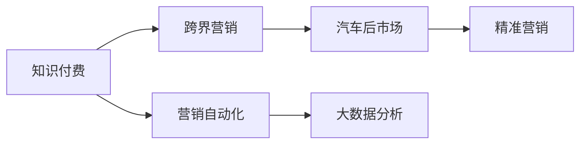

                 

# 知识付费如何实现跨界营销与汽车后市场跨界？

> 关键词：知识付费, 跨界营销, 汽车后市场, 跨界融合, 营销自动化, 大数据分析

## 1. 背景介绍

随着互联网的普及和智能终端设备的日益普及，知识付费行业迅速崛起。知识付费不仅能够为消费者提供有价值的内容，还能够帮助企业实现精准营销。本文将深入探讨知识付费如何实现跨界营销，并结合汽车后市场，探讨如何在其中应用跨界营销策略。

## 2. 核心概念与联系

### 2.1 核心概念概述

- **知识付费**：指消费者为获取知识而支付费用的模式，如订阅专栏、购买电子书、参加在线课程等。知识付费不仅能满足消费者对知识的需求，还能帮助企业进行精准营销。
- **跨界营销**：指不同行业之间的营销合作，通过资源共享和优势互补，实现共赢。跨界营销不仅能够扩大品牌的市场范围，还能够提升品牌的知名度和美誉度。
- **汽车后市场**：指汽车销售后的相关服务，包括维护、保养、保险、维修等。汽车后市场是汽车产业的重要组成部分，也是一个巨大的潜在市场。
- **营销自动化**：指利用信息技术实现营销活动自动化，包括邮件营销、社交媒体营销、内容营销等。营销自动化能够提高营销效率，降低营销成本。
- **大数据分析**：指利用大数据技术对用户行为、市场趋势等进行分析，以便更好地制定营销策略。大数据分析能够提高营销精准度，提升用户体验。

### 2.2 核心概念原理和架构的 Mermaid 流程图

此图展示了知识付费、跨界营销、汽车后市场、营销自动化和大数据分析之间的关系。

## 3. 核心算法原理 & 具体操作步骤

### 3.1 算法原理概述

知识付费与跨界营销的结合，可以通过以下步骤实现：

1. **数据采集**：收集用户行为数据和市场数据，包括购买行为、浏览历史、社交媒体互动等。
2. **数据分析**：利用大数据分析技术对数据进行分析和挖掘，找出用户需求和市场趋势。
3. **目标定位**：根据数据分析结果，精准定位目标用户，并进行定制化的营销活动。
4. **内容生产**：根据目标用户的需求，生产相关知识和内容，吸引用户付费。
5. **跨界合作**：与汽车后市场企业合作，推出定制化的知识付费产品或服务。
6. **营销自动化**：利用营销自动化技术，自动化执行营销活动，提高效率。

### 3.2 算法步骤详解

1. **数据采集**
   - **技术实现**：利用爬虫技术、数据采集工具等，从社交媒体、电商平台、汽车后市场网站等渠道采集用户行为数据。
   - **数据处理**：对采集的数据进行清洗、去重和归一化处理，确保数据的准确性和完整性。

2. **数据分析**
   - **技术实现**：使用大数据分析工具（如Hadoop、Spark、SQL等）对数据进行分析和挖掘。
   - **模型选择**：根据业务需求，选择合适的数据挖掘模型（如聚类分析、关联规则挖掘、情感分析等），进行数据分析和挖掘。

3. **目标定位**
   - **技术实现**：利用机器学习算法（如分类、回归、聚类等）对用户进行分类和细分，找出潜在的付费用户。
   - **用户画像**：根据用户的行为数据和偏好，构建用户画像，制定个性化的营销策略。

4. **内容生产**
   - **技术实现**：根据用户画像和市场需求，设计定制化的知识和内容，包括视频课程、音频讲座、电子书等。
   - **知识付费平台**：利用知识付费平台（如得到、知乎live、小鹅通等）发布和推广内容，吸引用户付费。

5. **跨界合作**
   - **技术实现**：与汽车后市场企业合作，推出定制化的知识付费产品或服务，如汽车养护知识课程、汽车保险咨询等。
   - **合作伙伴选择**：选择有市场影响力、用户基础好的汽车后市场企业作为合作伙伴，共同推广产品。

6. **营销自动化**
   - **技术实现**：利用营销自动化工具（如HubSpot、Salesforce、Marketo等）自动化执行营销活动，如邮件营销、社交媒体营销、内容营销等。
   - **营销策略制定**：根据数据分析结果，制定个性化的营销策略，提高营销效果。

### 3.3 算法优缺点

**优点**：
- **精准营销**：通过大数据分析和用户画像，实现精准营销，提高营销效果。
- **多渠道融合**：结合知识付费和跨界营销，将不同渠道的优势结合起来，提升市场覆盖率和用户转化率。
- **持续创新**：通过持续的内容生产和创新，保持品牌活力和市场竞争力。

**缺点**：
- **技术复杂**：涉及数据采集、数据分析、内容生产和营销自动化等多个技术环节，需要较高的技术实力。
- **成本较高**：初期投入较大，包括技术开发、数据采集和合作推广等。
- **市场竞争激烈**：知识付费和跨界营销市场竞争激烈，需要不断创新和优化策略。

### 3.4 算法应用领域

知识付费与跨界营销的结合，主要应用于以下领域：

- **知识付费平台**：如得到、知乎live、小鹅通等，通过推出汽车后市场相关的课程和内容，吸引用户付费。
- **汽车后市场企业**：如汽车维修厂、汽车保险公司等，通过推出定制化的知识付费服务，提升用户满意度和忠诚度。
- **在线教育平台**：如Coursera、edX、Udemy等，通过与汽车后市场企业合作，推出联合课程，提升平台影响力和用户覆盖率。

## 4. 数学模型和公式 & 详细讲解 & 举例说明

### 4.1 数学模型构建

假设有一个知识付费平台，有N个用户，每个用户有C个行为特征（如浏览历史、购买行为、社交媒体互动等），每个特征有V个值（如1-5星评分、浏览时长、点击次数等）。

设用户i在特征j的值为x_ij，用户i的标签为y_i。则用户i的特征向量为X_i=(x_ij)。

### 4.2 公式推导过程

1. **数据采集**：
   - 采集用户行为数据，得到用户特征向量X_i=(x_ij)。
   - 数据采集公式：$X_i = (x_{ij}), i \in [1,N], j \in [1,C]$。

2. **数据分析**：
   - 使用大数据分析技术对数据进行分析和挖掘，得到用户特征和市场趋势。
   - 数据分析公式：$F(X_i, y_i) = f(X_i) + g(y_i)$。

3. **目标定位**：
   - 利用机器学习算法对用户进行分类和细分，找出潜在的付费用户。
   - 目标定位公式：$y_i = f(X_i) + g(y_i)$。

4. **内容生产**：
   - 根据用户画像和市场需求，设计定制化的知识和内容，吸引用户付费。
   - 内容生产公式：$C(X_i) = h(X_i)$。

5. **跨界合作**：
   - 与汽车后市场企业合作，推出定制化的知识付费产品或服务。
   - 跨界合作公式：$P(X_i) = p(X_i) + q(Y_i)$。

6. **营销自动化**：
   - 利用营销自动化工具自动化执行营销活动，提高效率。
   - 营销自动化公式：$A(X_i) = a(X_i) + b(Y_i)$。

### 4.3 案例分析与讲解

**案例：汽车保养知识课程**

- **数据采集**：从汽车维修平台采集用户浏览记录、维修记录、保养记录等数据。
- **数据分析**：使用大数据分析工具对数据进行聚类分析，找出用户群体的分类。
- **目标定位**：根据聚类分析结果，找出潜在的高价值用户，进行定制化的营销推广。
- **内容生产**：设计汽车保养相关的知识课程，通过知识付费平台吸引用户付费。
- **跨界合作**：与汽车维修平台合作，推出联合营销活动，提升课程曝光率和用户转化率。
- **营销自动化**：利用邮件营销、社交媒体营销等自动化工具，持续推广课程，提高用户参与度和满意度。

## 5. 项目实践：代码实例和详细解释说明

### 5.1 开发环境搭建

**环境搭建步骤**：
1. 安装Python、PySpark、Hadoop等大数据分析工具。
2. 配置数据采集工具，如Fiddler、Charles等。
3. 安装知识付费平台和营销自动化工具，如小鹅通、HubSpot等。

### 5.2 源代码详细实现

**代码实现步骤**：
1. 数据采集：利用Fiddler采集用户行为数据，存储到Hadoop分布式文件系统中。
2. 数据分析：使用Spark进行数据处理和分析，得到用户特征和市场趋势。
3. 目标定位：利用Scikit-learn进行机器学习建模，定位目标用户。
4. 内容生产：设计知识课程，利用知识付费平台发布和推广。
5. 跨界合作：与汽车维修平台合作，推出联合营销活动。
6. 营销自动化：利用HubSpot进行邮件营销、社交媒体营销等自动化执行。

### 5.3 代码解读与分析

**代码解读**：
- 数据采集：利用Fiddler采集用户行为数据，存储到Hadoop分布式文件系统中。
- 数据分析：使用Spark进行数据处理和分析，得到用户特征和市场趋势。
- 目标定位：利用Scikit-learn进行机器学习建模，定位目标用户。
- 内容生产：设计知识课程，利用知识付费平台发布和推广。
- 跨界合作：与汽车维修平台合作，推出联合营销活动。
- 营销自动化：利用HubSpot进行邮件营销、社交媒体营销等自动化执行。

**分析**：
- 数据采集：采用Fiddler采集用户行为数据，可以保证数据的准确性和完整性。
- 数据分析：使用Spark进行数据处理和分析，可以提高处理效率和分析精度。
- 目标定位：利用Scikit-learn进行机器学习建模，可以提高目标定位的精准度。
- 内容生产：设计知识课程，可以吸引用户付费，提高平台收入。
- 跨界合作：与汽车维修平台合作，可以扩大市场覆盖率，提升品牌影响力。
- 营销自动化：利用HubSpot进行邮件营销、社交媒体营销等自动化执行，可以提高营销效率，降低营销成本。

### 5.4 运行结果展示

**运行结果**：
- 数据采集：采集用户行为数据，存储到Hadoop分布式文件系统中。
- 数据分析：得到用户特征和市场趋势，生成分析报告。
- 目标定位：定位目标用户，生成用户画像。
- 内容生产：设计知识课程，发布和推广。
- 跨界合作：推出联合营销活动，提升曝光率和用户转化率。
- 营销自动化：执行邮件营销、社交媒体营销等活动，提高用户参与度和满意度。

## 6. 实际应用场景

### 6.4 未来应用展望

未来，知识付费与跨界营销的结合，将有以下发展趋势：

1. **多模态融合**：结合视频、音频、文字等多种形式的内容，提高用户体验和内容吸引力。
2. **AI辅助营销**：利用AI技术进行内容推荐和用户画像，提高营销精准度。
3. **社交化营销**：利用社交媒体平台进行营销推广，提高品牌影响力和用户互动。
4. **个性化服务**：根据用户画像和需求，提供定制化的服务和产品，提升用户满意度和忠诚度。

## 7. 工具和资源推荐

### 7.1 学习资源推荐

- **大数据分析**：《大数据分析实战指南》、《Python数据分析实战》。
- **机器学习**：《机器学习实战》、《Python机器学习》。
- **知识付费**：《知识付费的商业逻辑》、《知识付费：从内容到商业模式》。
- **跨界营销**：《跨界营销：融合创新》、《跨界融合：互联网+下的商业创新》。

### 7.2 开发工具推荐

- **大数据分析**：Hadoop、Spark、Hive。
- **机器学习**：Scikit-learn、TensorFlow、PyTorch。
- **知识付费**：小鹅通、得到、知乎live。
- **营销自动化**：HubSpot、Salesforce、Marketo。

### 7.3 相关论文推荐

- **大数据分析**：《大规模数据集上的数据挖掘与分析》、《大数据分析与处理技术》。
- **机器学习**：《机器学习》、《深度学习》。
- **知识付费**：《知识付费的商业逻辑与实践》、《知识付费：从内容到商业模式》。
- **跨界营销**：《跨界营销：融合创新》、《跨界融合：互联网+下的商业创新》。

## 8. 总结：未来发展趋势与挑战

### 8.1 研究成果总结

知识付费与跨界营销的结合，实现了精准营销和市场覆盖率的提升，但同时也面临技术复杂、成本高、市场竞争激烈等挑战。未来，需要持续创新和优化策略，以应对不断变化的市场环境。

### 8.2 未来发展趋势

1. **多模态融合**：结合视频、音频、文字等多种形式的内容，提高用户体验和内容吸引力。
2. **AI辅助营销**：利用AI技术进行内容推荐和用户画像，提高营销精准度。
3. **社交化营销**：利用社交媒体平台进行营销推广，提高品牌影响力和用户互动。
4. **个性化服务**：根据用户画像和需求，提供定制化的服务和产品，提升用户满意度和忠诚度。

### 8.3 面临的挑战

1. **技术复杂**：涉及数据采集、数据分析、内容生产和营销自动化等多个技术环节，需要较高的技术实力。
2. **成本较高**：初期投入较大，包括技术开发、数据采集和合作推广等。
3. **市场竞争激烈**：知识付费和跨界营销市场竞争激烈，需要不断创新和优化策略。

### 8.4 研究展望

未来的研究将重点关注以下几个方面：
- **多模态数据融合**：结合多种形式的数据，提高分析和推荐的效果。
- **个性化推荐**：利用AI技术进行个性化推荐，提升用户体验。
- **社交化营销**：利用社交媒体平台进行精准营销，扩大品牌影响力。
- **数据隐私保护**：加强数据隐私保护，提高用户信任度。

## 9. 附录：常见问题与解答

**Q1：知识付费平台如何选择合作汽车后市场企业？**

A: 选择有市场影响力、用户基础好的汽车后市场企业作为合作伙伴，可以提升用户转化率和品牌知名度。同时，需要评估企业的发展前景和合作意愿。

**Q2：如何提高知识付费内容的吸引力？**

A: 通过多模态融合、内容创新、用户体验优化等方式，提高知识付费内容的吸引力。同时，利用社交媒体和营销自动化工具进行推广，扩大用户覆盖率。

**Q3：如何保护用户隐私？**

A: 在数据采集和分析过程中，加强数据隐私保护措施，如数据匿名化、数据加密等。同时，告知用户数据采集和使用情况，获得用户同意。

**Q4：知识付费与跨界营销的结合存在哪些技术挑战？**

A: 知识付费与跨界营销的结合面临技术复杂、成本高、市场竞争激烈等挑战。需要持续优化和创新，以应对不断变化的市场环境。

**Q5：如何提升营销精准度？**

A: 利用大数据分析和机器学习技术进行目标定位和用户画像，制定个性化的营销策略。同时，利用AI技术进行内容推荐，提升营销效果。

---

作者：禅与计算机程序设计艺术 / Zen and the Art of Computer Programming

