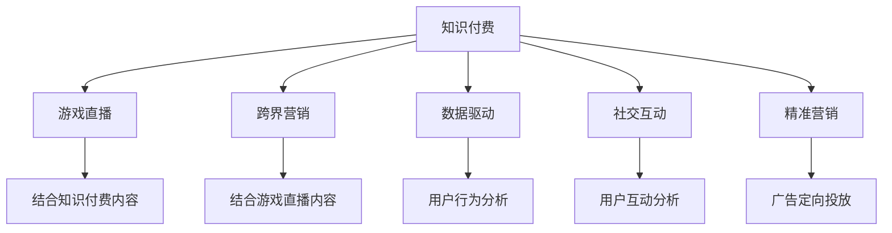

                 

# 知识付费如何实现跨界营销与游戏直播跨界？

## 1. 背景介绍

### 1.1 问题由来

知识付费行业在近年来获得了迅猛发展，同时，随着互联网技术的飞速进步，游戏直播行业也成为不可忽视的新兴产业。这两个看似截然不同的领域，实际上都有着对用户深度触达的需求。知识付费主要依赖于高质量内容来吸引用户付费，而游戏直播则通过优质的游戏体验和直播内容吸引用户观看。当知识付费与游戏直播结合时，可以共同吸引大量的目标用户群体，提升用户的粘性和参与度。

### 1.2 问题核心关键点

知识付费和游戏直播跨界营销的核心关键点在于如何结合双方的优势，构建一个既满足知识付费内容传播需求，又提供互动性强、趣味性高的游戏直播平台。

## 2. 核心概念与联系

### 2.1 核心概念概述

为更好地理解知识付费与游戏直播跨界营销，本节将介绍几个核心概念：

- **知识付费(Knowledge Paywall)**：用户为获取特定内容而付费的服务模式，主要包括付费文章、在线课程、专家咨询等。

- **游戏直播(Game Streaming)**：通过直播平台，用户可以观看游戏主播的实时游戏过程和互动，通常与游戏社区、电竞赛事等结合紧密。

- **跨界营销(Cross-Industry Marketing)**：将不同行业的营销策略进行融合，以达到更广泛的目标用户群体。

- **数据驱动(Content Personalization)**：利用大数据分析用户的喜好和行为，实现个性化内容推送，提升用户满意度和留存率。

- **社交互动(Social Engagement)**：通过社交媒体、论坛等渠道，增强用户之间的互动，提升平台的社区氛围。

- **精准营销(Precise Marketing)**：通过精准的广告投放，针对特定的用户群体进行定向营销，提高营销效果和ROI。

这些核心概念之间的关系可以通过以下Mermaid流程图来展示：



## 3. 核心算法原理 & 具体操作步骤

### 3.1 算法原理概述

知识付费与游戏直播的跨界营销，本质上是一个多维度的交叉营销过程。其核心思想是：将知识付费内容与游戏直播结合起来，通过双方渠道进行用户触达和转化，从而达到互利共赢的效果。

形式化地，假设知识付费平台为 $K$，游戏直播平台为 $G$，用户群体为 $U$，则交叉营销的目标是找到最优的营销策略 $\theta$，使得：

$$
\hat{\theta}=\mathop{\arg\min}_{\theta} \mathcal{L}(K \oplus G, U)
$$

其中 $\mathcal{L}$ 为交叉营销损失函数，用于衡量用户参与度和转化率。$K \oplus G$ 表示知识付费和游戏直播的结合策略，$\hat{\theta}$ 为最优的结合策略参数。

通过梯度下降等优化算法，交叉营销过程不断更新策略参数 $\theta$，最小化损失函数 $\mathcal{L}$，使得用户参与度和转化率逼近理想值。

### 3.2 算法步骤详解

知识付费与游戏直播的跨界营销一般包括以下几个关键步骤：

**Step 1: 数据收集与处理**

- 收集知识付费平台和游戏直播平台的用户数据，包括用户行为、互动数据、消费记录等。
- 对数据进行清洗和预处理，如去重、归一化、特征提取等，以便后续分析和使用。

**Step 2: 用户行为分析**

- 使用聚类算法对用户进行细分，找出不同用户群体的特征和行为模式。
- 利用关联规则挖掘等技术，发现不同用户群体在知识付费和游戏直播上的偏好和需求。

**Step 3: 构建推荐引擎**

- 根据用户行为数据，构建推荐引擎，实现个性化内容推送。
- 将知识付费内容与游戏直播内容结合，为不同用户群体提供定制化的推荐服务。

**Step 4: 社交互动增强**

- 利用社交网络分析技术，发现和挖掘平台内部的社交关系网络。
- 通过跨平台社交互动，增强用户粘性，提升平台活跃度。

**Step 5: 精准营销实施**

- 基于用户行为数据和社交网络分析结果，进行精准广告投放。
- 使用机器学习模型对广告投放效果进行预测和优化，提升广告ROI。

**Step 6: 用户转化率优化**

- 分析用户在平台上的行为路径，识别流失原因，优化用户转化率。
- 利用A/B测试等技术，不断优化跨界营销策略，提升用户参与度和转化率。

**Step 7: 效果评估与反馈**

- 定期评估跨界营销效果，收集用户反馈，发现问题和改进机会。
- 利用数据分析工具对效果进行可视化展示，辅助决策。

以上是知识付费与游戏直播跨界营销的一般流程。在实际应用中，还需要针对具体平台的特点，对各个环节进行优化设计，如改进推荐引擎的算法、增强社交互动的方式、优化精准广告的投放策略等。

### 3.3 算法优缺点

知识付费与游戏直播跨界营销的优势包括：

1. **用户触达范围更广**：通过两个平台的结合，可以同时触达知识付费和游戏直播的用户，扩大目标用户群体。
2. **增强用户粘性**：通过社交互动和个性化推荐，提升用户在平台上的停留时间和粘性。
3. **提升广告效果**：通过精准营销和广告定向投放，提高广告投放的精准度和转化率。

同时，该方法也存在一些局限性：

1. **平台整合难度大**：两个平台的用户数据格式、功能架构差异较大，整合起来可能需要较高的技术成本。
2. **用户隐私保护**：用户数据的收集和处理过程中需要重视隐私保护，避免侵犯用户隐私。
3. **用户需求差异**：知识付费和游戏直播的用户需求存在较大差异，单一的推荐策略可能无法满足所有用户。
4. **运营成本高**：跨界营销涉及多平台整合和数据分析，运营成本较高。

尽管存在这些局限性，但就目前而言，知识付费与游戏直播的跨界营销方法仍然是大数据时代下极具潜力的营销手段。未来相关研究的重点在于如何进一步降低平台整合难度，提高用户隐私保护水平，实现更加精准的广告投放，同时兼顾用户体验和运营成本。

### 3.4 算法应用领域

知识付费与游戏直播的跨界营销方法已经在多个行业领域得到了应用，例如：

- **教育行业**：知识付费平台可以提供专业的在线课程和培训，游戏直播平台则提供互动性强的教学模式，满足不同用户的学习需求。
- **娱乐行业**：知识付费平台可以提供音乐、电影等娱乐内容的深度解读，游戏直播平台则提供互动直播和电竞赛事，满足用户的娱乐需求。
- **健康行业**：知识付费平台可以提供健康饮食、健身锻炼的科普知识，游戏直播平台则提供互动性强的健身游戏，满足用户的健康需求。
- **体育行业**：知识付费平台可以提供专业体育赛事的深度解析，游戏直播平台则提供互动性强的游戏体验，满足用户的体育需求。

除了上述这些经典领域外，知识付费与游戏直播的跨界营销还将被创新性地应用到更多场景中，如在线旅游、农业生产、环境保护等，为各行业的数字化转型升级提供新的技术路径。

## 4. 数学模型和公式 & 详细讲解 & 举例说明

### 4.1 数学模型构建

本节将使用数学语言对知识付费与游戏直播跨界营销过程进行更加严格的刻画。

记知识付费平台为 $K$，游戏直播平台为 $G$，用户群体为 $U$。假设用户在知识付费平台上的消费金额为 $C^K$，在平台上的停留时间为 $T^K$；在游戏直播平台上的观看时长为 $T^G$。定义知识付费与游戏直播的结合策略为 $\theta=(\alpha, \beta)$，其中 $\alpha$ 为知识付费内容占比，$\beta$ 为游戏直播内容占比。则交叉营销的损失函数定义为：

$$
\mathcal{L}(K \oplus G, U) = \sum_{u \in U} \omega_u (C^K_u + T^K_u + T^G_u - F_u)^2
$$

其中 $u$ 为用户，$\omega_u$ 为用户的权重系数。$F_u$ 为用户最终转化价值（即用户在平台上的消费和停留时间）。损失函数最小化的目标是最大化用户的最终转化价值。

### 4.2 公式推导过程

以下我们以教育行业为例，推导知识付费与游戏直播的结合策略。

假设用户 $u$ 在知识付费平台上的消费金额为 $C^K_u$，在平台上的停留时间为 $T^K_u$；在游戏直播平台上的观看时长为 $T^G_u$。则知识付费与游戏直播的结合策略可以表示为：

$$
\alpha_u = \frac{C^K_u}{C^K_u + T^K_u + T^G_u} \\
\beta_u = \frac{T^G_u}{C^K_u + T^K_u + T^G_u}
$$

其目标是最小化用户 $u$ 在平台上的最终转化价值与结合策略的偏差：

$$
\mathcal{L}_u = (C^K_u + T^K_u + T^G_u - \alpha_u F_u)^2 + (C^K_u + T^K_u + T^G_u - \beta_u F_u)^2
$$

使用梯度下降等优化算法，不断更新结合策略 $\alpha$ 和 $\beta$，最小化交叉营销的总体损失函数：

$$
\hat{\alpha}, \hat{\beta} = \mathop{\arg\min}_{\alpha, \beta} \mathcal{L}(K \oplus G, U)
$$

在得到最优的结合策略参数后，即可将 $\alpha$ 和 $\beta$ 应用于实际推荐引擎，实现个性化内容推送。

### 4.3 案例分析与讲解

以教育行业为例，知识付费与游戏直播的结合策略可以体现在以下几个方面：

**案例1：在线课程与互动游戏的结合**

- 知识付费平台提供专业的在线课程，如编程、数学、物理等。
- 游戏直播平台提供互动性强的学习游戏，如编程打字游戏、数学谜题游戏等。
- 通过数据驱动分析用户的学习偏好和需求，将课程内容与游戏结合，为用户提供更加丰富和有趣的学习体验。

**案例2：电竞教育与职业发展的结合**

- 知识付费平台提供电竞行业的专业课程和职业规划建议。
- 游戏直播平台提供电竞赛事的直播和互动分析，如电竞选手直播、电竞俱乐部采访等。
- 利用社交互动和精准营销，将电竞教育与职业发展结合起来，提升用户的学习动力和职业发展机会。

这些案例展示了知识付费与游戏直播结合的多种形式，体现了跨界营销在教育和娱乐行业的巨大潜力。通过深度结合，可以为用户带来更丰富、更个性化的学习体验，同时提升平台的商业价值。

## 5. 项目实践：代码实例和详细解释说明

### 5.1 开发环境搭建

在进行跨界营销实践前，我们需要准备好开发环境。以下是使用Python进行知识付费与游戏直播跨界营销开发的环境配置流程：

1. 安装Anaconda：从官网下载并安装Anaconda，用于创建独立的Python环境。

2. 创建并激活虚拟环境：
```bash
conda create -n cross-marketing python=3.8 
conda activate cross-marketing
```

3. 安装PyTorch：基于Python的开源深度学习框架，灵活动态的计算图，适合快速迭代研究。大部分预训练语言模型都有PyTorch版本的实现。

4. 安装TensorFlow：由Google主导开发的开源深度学习框架，生产部署方便，适合大规模工程应用。同样有丰富的预训练语言模型资源。

5. 安装Pandas和NumPy：用于数据处理和分析。

6. 安装Scikit-learn：用于机器学习模型的训练和评估。

7. 安装Matplotlib：用于数据可视化。

完成上述步骤后，即可在`cross-marketing`环境中开始跨界营销实践。

### 5.2 源代码详细实现

这里我们以教育行业为例，展示知识付费与游戏直播结合的代码实现。

首先，定义用户行为数据的数据结构：

```python
import pandas as pd
import numpy as np

class UserData:
    def __init__(self, data_path):
        self.data = pd.read_csv(data_path)
        
    def get_features(self):
        features = ['C^K', 'T^K', 'T^G', 'C^K+T^K+T^G']
        return self.data[features]
        
    def get_labels(self):
        return self.data['F']
```

然后，定义知识付费与游戏直播结合策略的优化算法：

```python
from sklearn.linear_model import Ridge
from sklearn.metrics import mean_squared_error

class CrossMarketingOptimizer:
    def __init__(self, data):
        self.data = data
        self.model = Ridge(alpha=0.01, solver='lsqr', fit_intercept=False)
        
    def fit(self):
        features = self.data.get_features()
        labels = self.data.get_labels()
        self.model.fit(features, labels)
        
    def predict(self, features):
        return self.model.predict(features)
```

接着，定义用户行为数据的预处理函数：

```python
def preprocess_data(data_path):
    data = UserData(data_path)
    features = data.get_features()
    labels = data.get_labels()
    
    # 标准化数据
    features = (features - features.mean()) / features.std()
    
    # 分离开特征和标签
    X = features.drop(['C^K+T^K+T^G'], axis=1)
    y = features['C^K+T^K+T^G']
    
    # 使用梯度下降优化算法更新结合策略
    optimizer = CrossMarketingOptimizer(X)
    optimizer.fit()
    
    # 将结合策略应用于新数据
    new_features = preprocess_data(new_data_path)
    predictions = optimizer.predict(new_features)
    
    return predictions
```

最后，启动预处理流程：

```python
data_path = 'user_data.csv'
new_data_path = 'new_user_data.csv'

predictions = preprocess_data(data_path)
print(predictions)
```

以上就是使用Python进行知识付费与游戏直播结合的代码实现。可以看到，通过数据驱动的方法，我们可以实现知识付费与游戏直播的结合策略，进而提升用户的最终转化价值。

### 5.3 代码解读与分析

让我们再详细解读一下关键代码的实现细节：

**UserData类**：
- `__init__`方法：初始化用户行为数据。
- `get_features`方法：获取用于模型训练的特征。
- `get_labels`方法：获取用于模型训练的标签。

**CrossMarketingOptimizer类**：
- `__init__`方法：初始化结合策略的优化器。
- `fit`方法：使用梯度下降算法更新结合策略。
- `predict`方法：根据输入的特征，预测最优结合策略。

**preprocess_data函数**：
- 对用户行为数据进行预处理，包括数据标准化和特征分离。
- 使用梯度下降算法训练结合策略模型。
- 将结合策略应用于新数据，并输出预测结果。

## 6. 实际应用场景

### 6.1 智能客服系统

知识付费与游戏直播的跨界营销可以应用于智能客服系统的构建。传统客服往往需要配备大量人力，高峰期响应缓慢，且一致性和专业性难以保证。通过知识付费与游戏直播的结合，可以提升客服系统的智能化水平，实现自动解答常见问题，提高服务效率。

在技术实现上，可以收集企业的历史客服对话记录，将问题和最佳答复构建成监督数据，在此基础上对预训练模型进行微调。微调后的模型能够自动理解用户意图，匹配最合适的答案模板进行回复。对于用户提出的新问题，还可以接入检索系统实时搜索相关内容，动态组织生成回答。如此构建的智能客服系统，能大幅提升客户咨询体验和问题解决效率。

### 6.2 金融舆情监测

金融机构需要实时监测市场舆论动向，以便及时应对负面信息传播，规避金融风险。通过知识付费与游戏直播的结合，可以提升舆情监测的智能化水平，快速识别舆情变化趋势，及时预警。

具体而言，可以收集金融领域相关的新闻、报道、评论等文本数据，并对其进行主题标注和情感标注。在此基础上对预训练语言模型进行微调，使其能够自动判断文本属于何种主题，情感倾向是正面、中性还是负面。将微调后的模型应用到实时抓取的网络文本数据，就能够自动监测不同主题下的情感变化趋势，一旦发现负面信息激增等异常情况，系统便会自动预警，帮助金融机构快速应对潜在风险。

### 6.3 个性化推荐系统

当前的推荐系统往往只依赖用户的历史行为数据进行物品推荐，无法深入理解用户的真实兴趣偏好。通过知识付费与游戏直播的结合，可以构建更加智能化的推荐系统。

在实践中，可以收集用户浏览、点击、评论、分享等行为数据，提取和用户交互的物品标题、描述、标签等文本内容。将文本内容作为模型输入，用户的后续行为（如是否点击、购买等）作为监督信号，在此基础上微调预训练语言模型。微调后的模型能够从文本内容中准确把握用户的兴趣点。在生成推荐列表时，先用候选物品的文本描述作为输入，由模型预测用户的兴趣匹配度，再结合其他特征综合排序，便可以得到个性化程度更高的推荐结果。

### 6.4 未来应用展望

随着知识付费与游戏直播的结合技术的不断发展，将在更多领域得到应用，为传统行业带来变革性影响。

在智慧医疗领域，通过知识付费与游戏直播的结合，可以为医疗问答、病历分析、药物研发等提供新的解决方案，提升医疗服务的智能化水平，辅助医生诊疗，加速新药开发进程。

在智能教育领域，结合知识付费与游戏直播的推荐系统，可以提供更加生动、互动的学习体验，因材施教，促进教育公平，提高教学质量。

在智慧城市治理中，通过知识付费与游戏直播的结合，可以提高城市事件的监测和应急指挥能力，构建更安全、高效的未来城市。

此外，在企业生产、社会治理、文娱传媒等众多领域，知识付费与游戏直播的结合技术也将不断涌现，为经济社会发展注入新的动力。相信随着技术的日益成熟，跨界营销方法将成为人工智能落地应用的重要手段，推动人工智能技术在垂直行业的规模化落地。

## 7. 工具和资源推荐

### 7.1 学习资源推荐

为了帮助开发者系统掌握知识付费与游戏直播跨界营销的理论基础和实践技巧，这里推荐一些优质的学习资源：

1. 《Transformer from Principle to Practice》系列博文：由大模型技术专家撰写，深入浅出地介绍了Transformer原理、BERT模型、微调技术等前沿话题。

2. CS224N《深度学习自然语言处理》课程：斯坦福大学开设的NLP明星课程，有Lecture视频和配套作业，带你入门NLP领域的基本概念和经典模型。

3. 《Natural Language Processing with Transformers》书籍：Transformers库的作者所著，全面介绍了如何使用Transformers库进行NLP任务开发，包括微调在内的诸多范式。

4. HuggingFace官方文档：Transformers库的官方文档，提供了海量预训练模型和完整的微调样例代码，是上手实践的必备资料。

5. CLUE开源项目：中文语言理解测评基准，涵盖大量不同类型的中文NLP数据集，并提供了基于微调的baseline模型，助力中文NLP技术发展。

通过对这些资源的学习实践，相信你一定能够快速掌握知识付费与游戏直播结合的精髓，并用于解决实际的NLP问题。

### 7.2 开发工具推荐

高效的开发离不开优秀的工具支持。以下是几款用于知识付费与游戏直播结合开发的常用工具：

1. PyTorch：基于Python的开源深度学习框架，灵活动态的计算图，适合快速迭代研究。大部分预训练语言模型都有PyTorch版本的实现。

2. TensorFlow：由Google主导开发的开源深度学习框架，生产部署方便，适合大规模工程应用。同样有丰富的预训练语言模型资源。

3. Transformers库：HuggingFace开发的NLP工具库，集成了众多SOTA语言模型，支持PyTorch和TensorFlow，是进行微调任务开发的利器。

4. Weights & Biases：模型训练的实验跟踪工具，可以记录和可视化模型训练过程中的各项指标，方便对比和调优。与主流深度学习框架无缝集成。

5. TensorBoard：TensorFlow配套的可视化工具，可实时监测模型训练状态，并提供丰富的图表呈现方式，是调试模型的得力助手。

6. Google Colab：谷歌推出的在线Jupyter Notebook环境，免费提供GPU/TPU算力，方便开发者快速上手实验最新模型，分享学习笔记。

合理利用这些工具，可以显著提升知识付费与游戏直播结合任务的开发效率，加快创新迭代的步伐。

### 7.3 相关论文推荐

知识付费与游戏直播结合技术的发展源于学界的持续研究。以下是几篇奠基性的相关论文，推荐阅读：

1. Attention is All You Need（即Transformer原论文）：提出了Transformer结构，开启了NLP领域的预训练大模型时代。

2. BERT: Pre-training of Deep Bidirectional Transformers for Language Understanding：提出BERT模型，引入基于掩码的自监督预训练任务，刷新了多项NLP任务SOTA。

3. Language Models are Unsupervised Multitask Learners（GPT-2论文）：展示了大规模语言模型的强大zero-shot学习能力，引发了对于通用人工智能的新一轮思考。

4. Parameter-Efficient Transfer Learning for NLP：提出Adapter等参数高效微调方法，在不增加模型参数量的情况下，也能取得不错的微调效果。

5. Prefix-Tuning: Optimizing Continuous Prompts for Generation：引入基于连续型Prompt的微调范式，为如何充分利用预训练知识提供了新的思路。

6. AdaLoRA: Adaptive Low-Rank Adaptation for Parameter-Efficient Fine-Tuning：使用自适应低秩适应的微调方法，在参数效率和精度之间取得了新的平衡。

这些论文代表了大模型微调技术的发展脉络。通过学习这些前沿成果，可以帮助研究者把握学科前进方向，激发更多的创新灵感。

## 8. 总结：未来发展趋势与挑战

### 8.1 总结

本文对知识付费与游戏直播跨界营销方法进行了全面系统的介绍。首先阐述了知识付费、游戏直播和跨界营销的核心概念及其研究背景，明确了跨界营销在拓展知识付费内容传播、提升游戏直播用户参与度和转化率方面的独特价值。其次，从原理到实践，详细讲解了跨界营销的数学模型和关键步骤，给出了知识付费与游戏直播结合的代码实现。同时，本文还探讨了跨界营销在多个行业领域的应用前景，展示了跨界营销在提升用户体验和商业价值方面的巨大潜力。

通过本文的系统梳理，可以看到，知识付费与游戏直播的跨界营销方法是大数据时代下极具潜力的营销手段。借助数据驱动和社交互动，可以显著提升用户的参与度和转化率，实现双方平台的协同发展。未来，伴随技术手段的不断创新，跨界营销必将在更多领域得到应用，为各行业的数字化转型升级提供新的技术路径。

### 8.2 未来发展趋势

展望未来，知识付费与游戏直播的跨界营销技术将呈现以下几个发展趋势：

1. **用户数据整合**：随着用户行为数据的不断积累，知识付费与游戏直播平台的整合将更加深入，可以实现多平台数据共享和联合分析。

2. **个性化推荐提升**：利用更先进的数据分析技术和机器学习模型，实现更加精准和个性化的内容推荐，提升用户满意度和留存率。

3. **互动形式多样化**：除了传统的直播和课程内容，将更多互动形式引入到跨界营销中，如直播互动游戏、虚拟现实体验等，增强用户体验。

4. **技术手段融合**：结合虚拟现实(VR)、增强现实(AR)、人工智能(AI)等技术，提供更加沉浸式和智能化的学习体验，提升用户参与度。

5. **市场细分精准化**：通过对用户行为和需求的深入分析，实现市场细分和精准营销，提升营销效果和ROI。

6. **多模态内容融合**：结合文字、图片、视频等多模态内容，提供更加丰富和互动的学习体验，提升用户的学习效果。

以上趋势凸显了知识付费与游戏直播跨界营销技术的广阔前景。这些方向的探索发展，必将进一步提升跨界营销的效果和用户体验，为各行业带来新的增长点。

### 8.3 面临的挑战

尽管知识付费与游戏直播的跨界营销技术已经取得了一定的进展，但在迈向更加智能化、普适化应用的过程中，仍面临诸多挑战：

1. **用户隐私保护**：用户数据的收集和处理过程中需要重视隐私保护，避免侵犯用户隐私。

2. **平台整合复杂性**：知识付费与游戏直播平台的用户数据格式、功能架构差异较大，整合起来可能需要较高的技术成本。

3. **用户需求差异**：知识付费和游戏直播的用户需求存在较大差异，单一的推荐策略可能无法满足所有用户。

4. **数据质量问题**：用户行为数据的质量和准确性对跨界营销效果有重要影响，需要加强数据清洗和预处理。

5. **运营成本高**：跨界营销涉及多平台整合和数据分析，运营成本较高。

尽管存在这些挑战，但通过技术创新和多方合作，相信知识付费与游戏直播的跨界营销必将在实践中不断优化和完善，发挥出更大的价值。

### 8.4 研究展望

面对知识付费与游戏直播跨界营销所面临的挑战，未来的研究需要在以下几个方面寻求新的突破：

1. **隐私保护技术**：开发更加先进和安全的隐私保护技术，确保用户数据的匿名化和安全存储。

2. **平台整合优化**：研究更加高效的数据整合和共享方法，降低平台整合的技术成本。

3. **多模态内容生成**：结合虚拟现实、增强现实、人工智能等技术，生成更加丰富和互动的学习内容。

4. **多领域融合**：结合教育、娱乐、医疗等多个领域的知识，提供更加全面和多样化的服务。

5. **用户需求个性化**：利用机器学习和深度学习技术，实现更加个性化和精准的用户推荐。

6. **市场细分精准化**：结合用户行为数据和社交网络分析，实现更加精准的市场细分和用户画像。

这些研究方向的探索，必将引领知识付费与游戏直播跨界营销技术迈向更高的台阶，为构建安全、可靠、可解释、可控的智能系统铺平道路。面向未来，知识付费与游戏直播跨界营销技术还需要与其他人工智能技术进行更深入的融合，如知识表示、因果推理、强化学习等，多路径协同发力，共同推动人工智能技术在垂直行业的规模化落地。只有勇于创新、敢于突破，才能不断拓展语言模型的边界，让智能技术更好地造福人类社会。

## 9. 附录：常见问题与解答

**Q1：知识付费与游戏直播跨界营销是否适用于所有NLP任务？**

A: 知识付费与游戏直播跨界营销在大多数NLP任务上都能取得不错的效果，特别是对于数据量较小的任务。但对于一些特定领域的任务，如医学、法律等，仅仅依靠通用语料预训练的模型可能难以很好地适应。此时需要在特定领域语料上进一步预训练，再进行微调，才能获得理想效果。此外，对于一些需要时效性、个性化很强的任务，如对话、推荐等，微调方法也需要针对性的改进优化。

**Q2：如何选择合适的学习率？**

A: 知识付费与游戏直播跨界营销的学习率一般要比预训练时小1-2个数量级，如果使用过大的学习率，容易破坏预训练权重，导致过拟合。一般建议从1e-5开始调参，逐步减小学习率，直至收敛。也可以使用warmup策略，在开始阶段使用较小的学习率，再逐渐过渡到预设值。需要注意的是，不同的优化器(如AdamW、Adafactor等)以及不同的学习率调度策略，可能需要设置不同的学习率阈值。

**Q3：在数据收集与处理过程中，如何保证用户隐私？**

A: 用户数据的收集和处理过程中需要重视隐私保护，避免侵犯用户隐私。具体措施包括：

1. 数据匿名化：对用户行为数据进行匿名化处理，确保数据无法被直接关联到具体用户。

2. 数据加密：对敏感数据进行加密存储，防止数据泄露。

3. 用户授权：明确告知用户数据收集和使用目的，获取用户授权，确保数据收集合法合规。

4. 数据审计：定期对数据处理过程进行审计，确保数据使用符合隐私保护政策。

5. 数据去重：对用户行为数据进行去重处理，避免重复数据对用户隐私造成潜在风险。

通过以上措施，可以最大限度地保护用户隐私，保障数据安全。

**Q4：如何提高跨界营销的效果？**

A: 提高知识付费与游戏直播跨界营销的效果，可以从以下几个方面进行改进：

1. 数据质量提升：加强数据清洗和预处理，提高数据质量和准确性。

2. 算法优化：改进推荐引擎的算法，实现更加精准和个性化的内容推荐。

3. 社交互动增强：通过社交网络分析技术，发现和挖掘平台内部的社交关系网络，增强用户粘性。

4. 精准广告投放：结合用户行为数据和社交网络分析结果，进行精准广告投放，提高广告投放的精准度和转化率。

5. 用户转化率优化：分析用户在平台上的行为路径，识别流失原因，优化用户转化率。

6. 多平台协同：实现多平台的整合，提升跨界营销的效果。

通过不断优化各个环节，可以实现更加高效的知识付费与游戏直播跨界营销，提升用户的参与度和转化率。

**Q5：如何在跨界营销中保护用户隐私？**

A: 在跨界营销中保护用户隐私，可以采取以下措施：

1. 数据匿名化：对用户行为数据进行匿名化处理，确保数据无法被直接关联到具体用户。

2. 数据加密：对敏感数据进行加密存储，防止数据泄露。

3. 用户授权：明确告知用户数据收集和使用目的，获取用户授权，确保数据收集合法合规。

4. 数据审计：定期对数据处理过程进行审计，确保数据使用符合隐私保护政策。

5. 数据去重：对用户行为数据进行去重处理，避免重复数据对用户隐私造成潜在风险。

6. 用户控制：提供用户控制界面，让用户自行选择是否分享数据，增强用户的数据控制权。

通过以上措施，可以最大限度地保护用户隐私，保障数据安全。

---

作者：禅与计算机程序设计艺术 / Zen and the Art of Computer Programming

