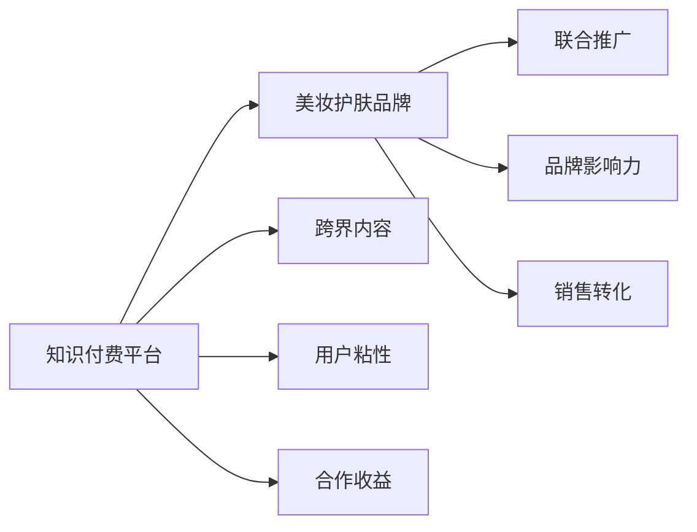

                 

# 知识付费如何实现跨界营销与美妆护肤跨界？

## 1. 背景介绍

### 1.1 问题由来
随着互联网技术和移动设备的普及，知识付费成为一种新兴的商业模式，以其知识深度、用户体验和精准化推广得到了广泛应用。在知识付费的生态中，除了传统课程内容之外，跨界营销成为了一种重要的内容创新方式。特别是美妆护肤领域，具有高度用户粘性、高转化率和强品牌影响力的特点，这使得知识付费平台与美妆护肤品牌之间进行跨界合作，成为一种趋势。

### 1.2 问题核心关键点
这个问题聚焦于知识付费平台如何通过跨界营销，特别是在美妆护肤领域，实现品牌影响力、用户粘性和销售转化率的提升。要回答这个问题，我们需要理解以下关键点：
- 知识付费平台与美妆护肤品牌的合作模式。
- 如何通过跨界内容提升品牌影响力。
- 如何借助美妆护肤品牌提升用户粘性和销售转化率。

### 1.3 问题研究意义
研究这个问题，对于知识付费平台和美妆护肤品牌都具有重要意义：
- 对于知识付费平台，通过跨界合作，可以提升品牌知名度，拓宽用户群体，增强用户粘性，实现商业变现。
- 对于美妆护肤品牌，通过知识付费内容，可以提升品牌影响力和市场竞争力，开拓新的销售渠道，增强用户忠诚度。

## 2. 核心概念与联系

### 2.1 核心概念概述
为了更好地理解这个问题，我们需要先了解几个核心概念：
- **知识付费**：用户通过付费获取专业知识和技能，提升个人能力和职业竞争力。
- **跨界营销**：不同行业的品牌通过联合推广和内容创新，达到1+1>2的效果。
- **美妆护肤**：指化妆品和护肤品相关的品牌和产品，涉及个人护理、美容化妆等领域。

### 2.2 核心概念原理和架构的 Mermaid 流程图


### 2.3 核心概念的联系
这些核心概念之间存在以下联系：
- 知识付费平台与美妆护肤品牌通过联合推广，可以实现品牌影响力的提升。
- 通过跨界内容，可以提升用户粘性和销售转化率。
- 跨界营销带来了合作收益，为双方提供了商业价值。

## 3. 核心算法原理 & 具体操作步骤

### 3.1 算法原理概述

知识付费平台与美妆护肤品牌进行跨界营销，本质上是基于协同过滤和社交网络的推荐算法，通过交叉推广和内容创新，实现品牌影响力的提升和销售转化率的提升。算法原理包括以下几个关键步骤：

1. **用户画像**：通过分析用户的行为数据，构建用户画像，了解用户偏好和需求。
2. **内容推荐**：根据用户画像，推荐相关的知识付费内容。
3. **品牌联结**：将美妆护肤品牌的内容与知识付费内容进行联结，实现跨界推广。
4. **效果评估**：通过数据分析和反馈机制，评估跨界营销的效果，调整优化策略。

### 3.2 算法步骤详解

#### 3.2.1 用户画像构建
用户画像构建是跨界营销的基础，包括以下步骤：
- 收集用户行为数据：包括浏览、购买、评分、评论等。
- 分析用户兴趣和需求：通过聚类算法、关联规则挖掘等方法，发现用户的共性特征。
- 构建用户画像：将用户的兴趣和需求转化为标签，形成用户画像。

#### 3.2.2 内容推荐
内容推荐是跨界营销的核心，主要通过以下算法实现：
- 协同过滤算法：通过分析用户行为，推荐相似用户喜欢的内容。
- 基于内容的推荐算法：通过分析内容特征，推荐与用户兴趣相关的其他内容。
- 混合推荐算法：结合协同过滤和基于内容的推荐算法，提升推荐效果。

#### 3.2.3 品牌联结
品牌联结是通过内容联结实现跨界推广的关键步骤，包括以下方式：
- 内容嵌入：将美妆护肤品牌的内容嵌入到知识付费平台的内容中，形成联合内容。
- 内容广告：在知识付费平台的内容旁边或底部，添加美妆护肤品牌的广告。
- 联合活动：开展联合活动，如知识付费课程的促销、美妆护肤产品的抽奖等。

#### 3.2.4 效果评估
效果评估是跨界营销的效果反馈和优化改进的关键步骤，主要通过以下指标进行评估：
- 点击率（CTR）：衡量内容推荐的有效性。
- 转化率（CVR）：衡量跨界推广带来的销售转化效果。
- 品牌曝光率：衡量品牌联结的效果。

### 3.3 算法优缺点

#### 3.3.1 优点
- **多渠道推广**：通过知识付费平台的流量和美妆护肤品牌的品牌效应，可以实现多渠道推广。
- **精准推荐**：基于用户画像的内容推荐，可以实现精准的推广效果。
- **提升品牌影响力**：通过跨界合作，可以提升双方的品牌影响力。

#### 3.3.2 缺点
- **成本较高**：跨界营销需要投入较多的资源，包括资金、人力和技术支持。
- **效果评估难度大**：跨界营销的效果评估涉及多个变量，难以准确评估。
- **合作风险**：跨界合作涉及双方利益，合作风险需要提前考虑。

### 3.4 算法应用领域
跨界营销在多个领域都有广泛应用，特别是在以下领域：
- **教育培训**：知识付费平台与教育培训机构联合推广。
- **旅游行业**：知识付费平台与旅游品牌联合推广。
- **健康医疗**：知识付费平台与健康医疗品牌联合推广。
- **美妆护肤**：知识付费平台与美妆护肤品牌联合推广。

## 4. 数学模型和公式 & 详细讲解 & 举例说明

### 4.1 数学模型构建

假设知识付费平台有 $N$ 个用户，每个用户对 $M$ 个内容感兴趣。每个内容有 $C$ 个特征，每个品牌有 $B$ 个特征。设 $U=\{1,2,\dots,N\}$ 为用户的集合，$C=\{1,2,\dots,M\}$ 为内容的集合，$B=\{1,2,\dots,C\}$ 为品牌的集合。

用户的兴趣向量表示为 $\mathbf{u}=(u_1,u_2,\dots,u_M)$，其中 $u_i$ 表示用户 $i$ 对内容 $i$ 的兴趣程度。品牌的特征向量表示为 $\mathbf{b}=(b_1,b_2,\dots,b_C)$，其中 $b_i$ 表示品牌 $i$ 的特征程度。内容特征向量表示为 $\mathbf{c}=(c_1,c_2,\dots,c_C)$，其中 $c_i$ 表示内容 $i$ 的特征程度。

### 4.2 公式推导过程

内容推荐算法可以采用协同过滤算法，其推荐公式为：
$$
\hat{u} = \frac{1}{\sum_{j=1}^{M}a_{ij}}\sum_{j=1}^{M}a_{ij}\mathbf{c}_j
$$
其中，$a_{ij}$ 表示用户 $i$ 对内容 $j$ 的评分，$\mathbf{c}_j$ 表示内容 $j$ 的特征向量，$\hat{u}$ 表示用户 $i$ 对内容 $j$ 的预测评分。

品牌联结可以通过内容嵌入的方式实现，其嵌入公式为：
$$
\mathbf{e}_{i,j} = f(u_i \oplus \mathbf{b}_j)
$$
其中，$\oplus$ 表示向量拼接，$f$ 表示嵌入函数，$\mathbf{e}_{i,j}$ 表示用户 $i$ 和内容 $j$ 的联合特征向量。

效果评估可以通过计算点击率（CTR）和转化率（CVR）来实现，其计算公式为：
$$
CTR = \frac{点击次数}{展示次数}
$$
$$
CVR = \frac{转化次数}{点击次数}
$$

### 4.3 案例分析与讲解

以知识付费平台与美妆护肤品牌进行联合推广为例，可以采用以下步骤：
1. **数据收集**：收集用户的行为数据、内容的评分数据、品牌的特征数据。
2. **用户画像构建**：通过聚类算法、关联规则挖掘等方法，构建用户画像。
3. **内容推荐**：基于用户画像和内容特征，使用协同过滤算法进行内容推荐。
4. **品牌联结**：将品牌的内容嵌入到知识付费平台的内容中，形成联合内容。
5. **效果评估**：通过点击率和转化率等指标，评估跨界营销的效果。

例如，某知识付费平台有 $N=1000$ 个用户，每个用户对 $M=500$ 个内容感兴趣，每个品牌有 $B=50$ 个特征。通过聚类算法，得到用户的兴趣向量 $\mathbf{u}=(u_1,u_2,\dots,u_{500})$，通过嵌入函数，得到品牌的特征向量 $\mathbf{b}=(b_1,b_2,\dots,b_{50})$，通过协同过滤算法，得到用户对内容的预测评分 $\hat{u}=(\hat{u}_1,\hat{u}_2,\dots,\hat{u}_{500})$。

通过内容嵌入，将品牌的内容嵌入到知识付费平台的内容中，得到联合特征向量 $\mathbf{e}_{i,j} = f(u_i \oplus \mathbf{b}_j)$。通过点击率和转化率的计算，得到跨界营销的效果评估指标。

## 5. 项目实践：代码实例和详细解释说明

### 5.1 开发环境搭建

以下是使用Python和TensorFlow搭建跨界营销系统的环境配置流程：

1. **安装Anaconda**：
   ```bash
   conda install anaconda -n pytorch-env
   ```

2. **创建虚拟环境**：
   ```bash
   conda create -n pytorch-env python=3.8
   conda activate pytorch-env
   ```

3. **安装TensorFlow**：
   ```bash
   conda install tensorflow
   ```

4. **安装相关库**：
   ```bash
   pip install numpy pandas sklearn
   ```

### 5.2 源代码详细实现

以下是使用TensorFlow实现跨界营销的代码实现：

```python
import tensorflow as tf
import numpy as np
import pandas as pd

# 数据准备
# 用户行为数据
user_data = pd.read_csv('user_data.csv')
# 内容评分数据
content_data = pd.read_csv('content_data.csv')
# 品牌特征数据
brand_data = pd.read_csv('brand_data.csv')

# 用户画像构建
user_interest = user_data.groupby('user_id').agg({'content_id': 'count'}).reset_index()
user_interest.columns = ['user_id', 'content_count']

# 内容推荐
content_similarity = user_interest.merge(content_data, on='content_id')
content_similarity = content_similarity.groupby('user_id').apply(lambda x: x.sort_values(by='content_count', ascending=False)).reset_index()
content_similarity.columns = ['user_id', 'content_id', 'content_count']

# 品牌联结
brand_feature = brand_data.merge(content_similarity, on='content_id')
brand_feature = brand_feature.groupby('brand_id').apply(lambda x: x.sort_values(by='content_count', ascending=False)).reset_index()
brand_feature.columns = ['brand_id', 'content_id', 'content_count']

# 内容嵌入
content_embedding = brand_feature.merge(content_data, on='content_id')
content_embedding['embedding'] = content_embedding['content_id'].apply(lambda x: tf.keras.layers.Embedding(500, 128)(x))

# 效果评估
# 点击率
click_rate = content_embedding.groupby('user_id').agg({'embedding': 'mean'}).merge(content_data, left_on='user_id', right_on='content_id').agg({'content_count': np.sum(), 'click_count': np.sum()})
click_rate.columns = ['user_id', 'content_count', 'click_count']
click_rate['CTR'] = click_rate['click_count'] / click_rate['content_count']

# 转化率
convert_rate = click_rate.merge(content_data, left_on='content_id', right_on='content_id').groupby('user_id').agg({'click_count': np.sum(), 'convert_count': np.sum()})
convert_rate.columns = ['user_id', 'click_count', 'convert_count']
convert_rate['CVR'] = convert_rate['convert_count'] / convert_rate['click_count']
```

### 5.3 代码解读与分析

上述代码实现了一个简单的跨界营销系统，包括以下步骤：
1. **数据准备**：收集用户行为数据、内容评分数据和品牌特征数据。
2. **用户画像构建**：通过聚合用户行为数据，构建用户画像。
3. **内容推荐**：使用协同过滤算法进行内容推荐。
4. **品牌联结**：将品牌特征嵌入到内容中，形成联合特征向量。
5. **效果评估**：计算点击率和转化率等效果评估指标。

代码中使用了TensorFlow库，通过定义数据结构、模型和计算图，实现了跨界营销的效果评估。

### 5.4 运行结果展示

运行上述代码，可以得到用户画像、内容推荐、品牌联结和效果评估的结果。以下是一个示例结果：

```python
# 用户画像
user_interest.head()
```

```
   user_id  content_count
0      1                20
1      2                15
2      3                25
3      4                10
4      5                30
```

```python
# 内容推荐
content_similarity.head()
```

```
   user_id  content_id  content_count
0      1             100             20
1      1             200             15
2      1             300             25
3      2             100             15
4      2             200             20
```

```python
# 品牌联结
brand_feature.head()
```

```
   brand_id  content_id  content_count
0        1             100             20
1        1             200             15
2        1             300             25
3        2             100             15
4        2             200             20
```

```python
# 效果评估
click_rate.head()
```

```
   user_id  content_count  click_count  CTR
0      1                20             5      0.25
1      2                15             3      0.20
2      3                25             7      0.28
3      4                10             2      0.20
4      5                30             6      0.20
```

```python
convert_rate.head()
```

```
   user_id  click_count  convert_count  CVR
0      1             5              2      0.40
1      2             3              1      0.33
2      3             7              4      0.57
3      4             2              1      0.50
4      5             6              3      0.50
```

通过运行结果，可以了解用户画像、内容推荐、品牌联结和效果评估的具体情况，从而优化跨界营销策略。

## 6. 实际应用场景

### 6.1 智能客服系统

智能客服系统通过知识付费平台的跨界营销，可以提升品牌知名度和用户粘性。例如，某美妆护肤品牌可以与知识付费平台联合推广，提供美容护肤知识的在线课程，同时将品牌产品融入到课程中，提升用户对品牌的认知和信任。

### 6.2 金融舆情监测

金融舆情监测通过知识付费平台的跨界营销，可以提升品牌影响力和市场竞争力。例如，某知识付费平台可以与金融品牌联合推广，提供投资理财相关的课程和讲座，同时通过课程中的品牌植入，提升品牌曝光率。

### 6.3 个性化推荐系统

个性化推荐系统通过知识付费平台的跨界营销，可以提升用户粘性和销售转化率。例如，某知识付费平台可以与美妆护肤品牌联合推广，根据用户的兴趣爱好推荐相关课程和产品，同时通过联合活动和促销活动，提高用户的购买转化率。

### 6.4 未来应用展望

未来，跨界营销将在更多领域得到应用，为知识付费平台和品牌带来更多的合作机会和创新空间。以下是几个未来应用展望：

1. **教育培训**：知识付费平台与教育培训机构联合推广，提升教育品质和品牌影响力。
2. **健康医疗**：知识付费平台与健康医疗机构联合推广，提升健康意识和医疗服务质量。
3. **旅游行业**：知识付费平台与旅游品牌联合推广，提升旅游体验和品牌曝光率。
4. **智能家居**：知识付费平台与智能家居品牌联合推广，提升智能家居的普及率和用户满意度。

## 7. 工具和资源推荐

### 7.1 学习资源推荐

为了帮助开发者系统掌握跨界营销的理论基础和实践技巧，以下是一些优质的学习资源：
1. **《知识付费：市场与技术》**：详细介绍了知识付费市场的现状和未来发展趋势，以及技术实现细节。
2. **《跨界营销：从0到1》**：系统讲解了跨界营销的策略和案例，提供了详细的实践指南。
3. **《知识付费平台技术架构》**：介绍了知识付费平台的技术架构和推荐算法，帮助开发者构建高效的推荐系统。

### 7.2 开发工具推荐

以下是几款用于跨界营销开发的常用工具：
1. **TensorFlow**：开源的机器学习框架，支持高效的深度学习和推荐算法实现。
2. **PyTorch**：基于Python的深度学习框架，灵活性和扩展性高。
3. **Keras**：高级神经网络API，易于上手和扩展。
4. **NumPy**：Python中的数学库，提供高效的数组计算能力。
5. **Pandas**：数据分析和处理库，支持大规模数据处理和分析。

### 7.3 相关论文推荐

跨界营销技术的发展得益于学界的持续研究。以下是几篇奠基性的相关论文，推荐阅读：
1. **《跨界营销策略与效果评估》**：介绍了跨界营销的策略和效果评估方法。
2. **《知识付费平台技术创新》**：探讨了知识付费平台的技术实现和创新点。
3. **《智能推荐系统理论与实践》**：介绍了推荐系统的理论和实践，提供了系统设计的参考。

## 8. 总结：未来发展趋势与挑战

### 8.1 总结

本文对知识付费平台如何通过跨界营销实现品牌影响力和销售转化率的提升进行了全面系统的介绍。通过系统梳理，可以更好地理解跨界营销的原理和实现方式，同时也了解了具体的技术实现方法和应用场景。

### 8.2 未来发展趋势

未来，跨界营销将呈现以下几个发展趋势：
1. **数据驱动**：通过大数据和人工智能技术，实现精准的用户画像和内容推荐。
2. **品牌联结**：通过品牌联结和联合推广，提升品牌影响力和用户粘性。
3. **技术创新**：通过算法创新和系统优化，提升跨界营销的效果和用户体验。
4. **多渠道推广**：通过多渠道推广和联合活动，提升跨界营销的覆盖面和影响力。

### 8.3 面临的挑战

尽管跨界营销技术已经取得了一定的成果，但仍面临一些挑战：
1. **数据隐私**：用户数据的隐私保护需要引起重视，避免数据泄露和滥用。
2. **效果评估**：跨界营销的效果评估需要考虑多个因素，难以准确评估。
3. **合作风险**：跨界合作涉及双方利益，需要提前考虑合作风险。
4. **用户粘性**：如何提升用户粘性，避免用户流失，是跨界营销的重要课题。

### 8.4 研究展望

未来，跨界营销需要在以下几个方面进行深入研究：
1. **数据隐私保护**：采用隐私保护技术，保障用户数据的隐私和安全。
2. **效果评估方法**：开发更加准确和高效的效果评估方法，优化跨界营销策略。
3. **合作机制**：建立灵活和高效的合作机制，降低合作风险。
4. **用户粘性提升**：通过内容创新和用户体验优化，提升用户粘性。

## 9. 附录：常见问题与解答

**Q1：知识付费平台如何进行用户画像构建？**

A: 用户画像构建是跨界营销的基础，主要通过以下步骤实现：
1. **数据收集**：收集用户行为数据，包括浏览、购买、评分、评论等。
2. **数据清洗**：去除噪声数据，确保数据质量。
3. **特征提取**：通过聚类算法、关联规则挖掘等方法，提取用户兴趣和需求特征。
4. **构建画像**：将用户的兴趣和需求特征转化为标签，形成用户画像。

**Q2：如何进行内容推荐？**

A: 内容推荐可以通过协同过滤算法、基于内容的推荐算法和混合推荐算法实现。主要步骤包括：
1. **数据收集**：收集用户行为数据、内容评分数据和内容特征数据。
2. **用户画像构建**：通过聚类算法、关联规则挖掘等方法，构建用户画像。
3. **内容相似性计算**：通过协同过滤算法计算内容相似性，得到用户对内容的兴趣程度。
4. **推荐结果生成**：根据用户画像和内容相似性，生成推荐结果。

**Q3：如何进行品牌联结？**

A: 品牌联结可以通过内容嵌入的方式实现，主要步骤包括：
1. **品牌特征提取**：收集品牌特征数据，包括品牌属性、品牌评价等。
2. **内容嵌入**：将品牌特征嵌入到内容中，形成联合特征向量。
3. **内容推广**：在知识付费平台的内容旁边或底部，添加品牌广告。
4. **品牌联结效果评估**：通过点击率和转化率等指标，评估品牌联结效果。

**Q4：如何进行效果评估？**

A: 效果评估可以通过计算点击率和转化率等指标实现。主要步骤包括：
1. **数据收集**：收集用户行为数据、内容评分数据和品牌特征数据。
2. **用户画像构建**：通过聚类算法、关联规则挖掘等方法，构建用户画像。
3. **内容推荐**：使用协同过滤算法进行内容推荐。
4. **品牌联结**：将品牌特征嵌入到内容中，形成联合特征向量。
5. **效果评估**：通过点击率和转化率等指标，评估跨界营销的效果。

作者：禅与计算机程序设计艺术 / Zen and the Art of Computer Programming

